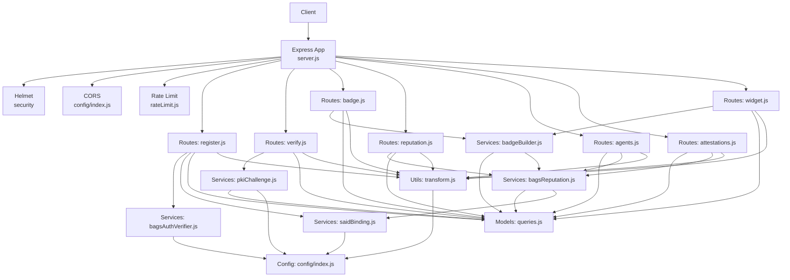
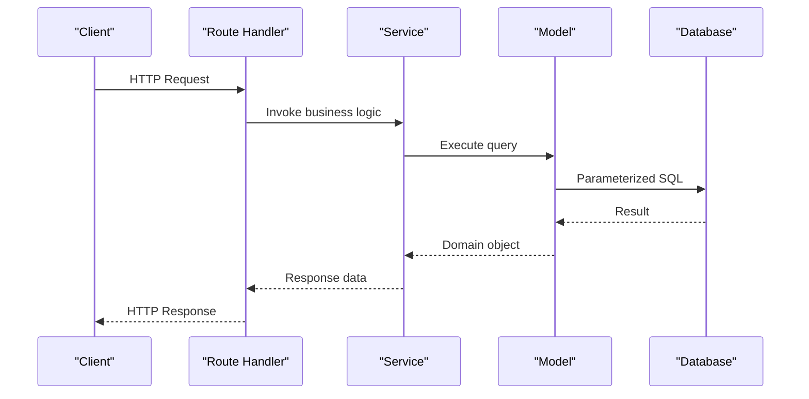
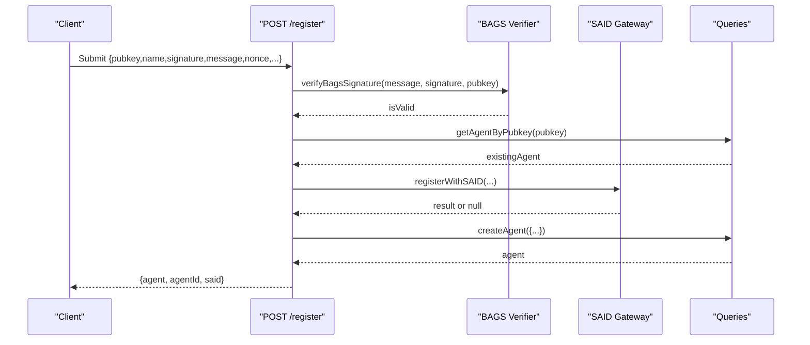
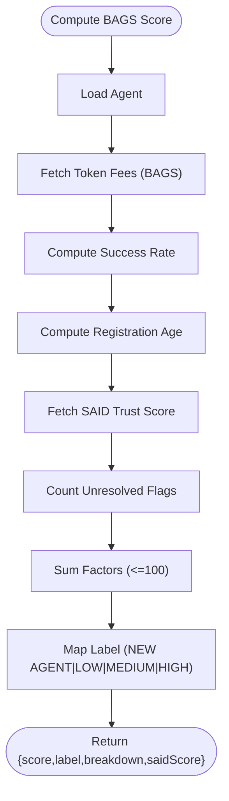
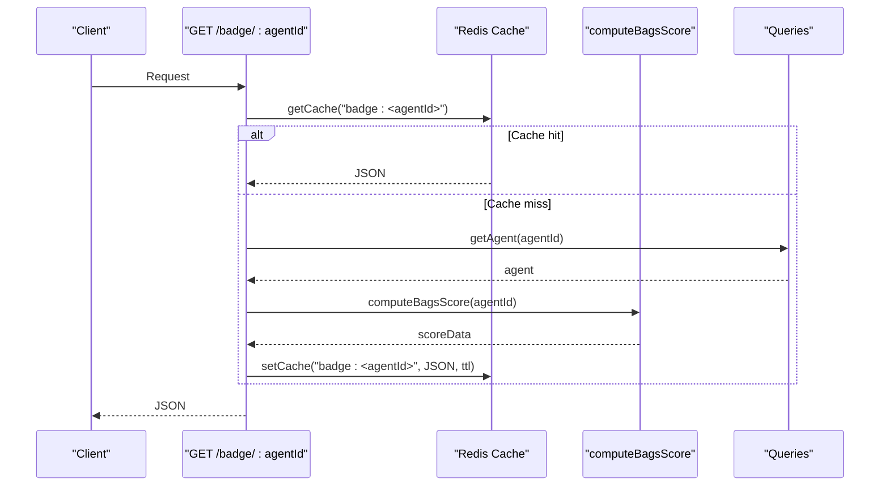
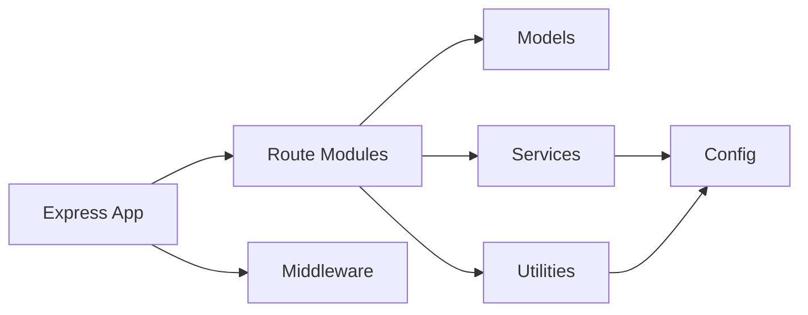

# API Reference

<cite>
**Referenced Files in This Document**
- [server.js](file://backend/server.js)
- [register.js](file://backend/src/routes/register.js)
- [verify.js](file://backend/src/routes/verify.js)
- [badge.js](file://backend/src/routes/badge.js)
- [reputation.js](file://backend/src/routes/reputation.js)
- [agents.js](file://backend/src/routes/agents.js)
- [attestations.js](file://backend/src/routes/attestations.js)
- [widget.js](file://backend/src/routes/widget.js)
- [bagsAuthVerifier.js](file://backend/src/services/bagsAuthVerifier.js)
- [bagsReputation.js](file://backend/src/services/bagsReputation.js)
- [badgeBuilder.js](file://backend/src/services/badgeBuilder.js)
- [saidBinding.js](file://backend/src/services/saidBinding.js)
- [pkiChallenge.js](file://backend/src/services/pkiChallenge.js)
- [rateLimit.js](file://backend/src/middleware/rateLimit.js)
- [transform.js](file://backend/src/utils/transform.js)
- [config/index.js](file://backend/src/config/index.js)
- [README.md](file://README.md)
- [docs/API_REFERENCE.md](file://docs/API_REFERENCE.md)
- [docs/WIDGET_GUIDE.md](file://docs/WIDGET_GUIDE.md)
- [AgentID-wiki-temp/Widget-Guide.md](file://AgentID-wiki-temp/Widget-Guide.md)
</cite>

## Update Summary
**Changes Made**
- Updated domain references from `your-domain.io` to `agentid.provenanceai.network` across all API documentation examples
- Fixed widget embed examples in README.md to use the correct production domain
- Ensured all API endpoint examples consistently use the migrated domain
- Updated widget integration examples to reflect the new production URL
- Enhanced API documentation coverage for all core endpoints with detailed request/response schemas
- Added comprehensive error handling procedures for all endpoint categories
- Expanded widget endpoint documentation with HTML response format details
- Improved reputation service documentation with scoring algorithm breakdown

## Table of Contents
1. [Introduction](#introduction)
2. [Project Structure](#project-structure)
3. [Core Components](#core-components)
4. [Architecture Overview](#architecture-overview)
5. [Detailed Component Analysis](#detailed-component-analysis)
6. [Dependency Analysis](#dependency-analysis)
7. [Performance Considerations](#performance-considerations)
8. [Troubleshooting Guide](#troubleshooting-guide)
9. [Conclusion](#conclusion)

## Introduction
This document provides a comprehensive API reference for the AgentID backend service. It describes all HTTP endpoints, request/response schemas, authentication requirements, rate limits, and error handling behavior. The API enables agent registration, verification, reputation computation, attestation recording, flagging, badge generation, and discovery.

**Updated** All domain references have been migrated from `your-domain.io` to `agentid.provenanceai.network` to reflect the production deployment.

## Project Structure
The backend is an Express.js application that mounts route modules under specific prefixes. Middleware applies global security and rate limiting. Services encapsulate external integrations (BAGS, SAID, PKI), while models handle database queries.

**Diagram sources**
- [server.js:1-104](file://backend/server.js#L1-L104)
- [register.js:1-172](file://backend/src/routes/register.js#L1-L172)
- [verify.js:1-121](file://backend/src/routes/verify.js#L1-L121)
- [badge.js:1-58](file://backend/src/routes/badge.js#L1-L58)
- [reputation.js:1-45](file://backend/src/routes/reputation.js#L1-L45)
- [agents.js:1-277](file://backend/src/routes/agents.js#L1-L277)
- [attestations.js:1-246](file://backend/src/routes/attestations.js#L1-L246)
- [widget.js:1-89](file://backend/src/routes/widget.js#L1-L89)
- [bagsReputation.js:1-146](file://backend/src/services/bagsReputation.js#L1-L146)
- [badgeBuilder.js:1-556](file://backend/src/services/badgeBuilder.js#L1-L556)
- [bagsAuthVerifier.js:1-93](file://backend/src/services/bagsAuthVerifier.js#L1-L93)
- [saidBinding.js:1-119](file://backend/src/services/saidBinding.js#L1-L119)
- [pkiChallenge.js:1-109](file://backend/src/services/pkiChallenge.js#L1-L109)
- [rateLimit.js:1-62](file://backend/src/middleware/rateLimit.js#L1-L62)
- [transform.js:1-129](file://backend/src/utils/transform.js#L1-L129)
- [config/index.js:1-31](file://backend/src/config/index.js#L1-L31)

**Section sources**
- [server.js:1-104](file://backend/server.js#L1-L104)
- [config/index.js:1-31](file://backend/src/config/index.js#L1-L31)

## Core Components
- Route modules define endpoint contracts and orchestrate service/model interactions.
- Services encapsulate external integrations and business logic.
- Models provide parameterized database operations.
- Utilities handle data transformation and validation.
- Middleware enforces rate limits and security headers.

**Section sources**
- [register.js:1-172](file://backend/src/routes/register.js#L1-L172)
- [verify.js:1-121](file://backend/src/routes/verify.js#L1-L121)
- [badge.js:1-58](file://backend/src/routes/badge.js#L1-L58)
- [reputation.js:1-45](file://backend/src/routes/reputation.js#L1-L45)
- [agents.js:1-277](file://backend/src/routes/agents.js#L1-L277)
- [attestations.js:1-246](file://backend/src/routes/attestations.js#L1-L246)
- [widget.js:1-89](file://backend/src/routes/widget.js#L1-L89)
- [bagsReputation.js:1-146](file://backend/src/services/bagsReputation.js#L1-L146)
- [badgeBuilder.js:1-556](file://backend/src/services/badgeBuilder.js#L1-L556)
- [bagsAuthVerifier.js:1-93](file://backend/src/services/bagsAuthVerifier.js#L1-L93)
- [saidBinding.js:1-119](file://backend/src/services/saidBinding.js#L1-L119)
- [pkiChallenge.js:1-109](file://backend/src/services/pkiChallenge.js#L1-L109)
- [rateLimit.js:1-62](file://backend/src/middleware/rateLimit.js#L1-L62)
- [transform.js:1-129](file://backend/src/utils/transform.js#L1-L129)

## Architecture Overview
The API follows a layered architecture:
- Transport: Express routes
- Application: Route handlers call services and models
- Domain: Services implement business logic and integrate with external systems
- Persistence: Models encapsulate SQL queries
- Shared: Utilities and configuration

**Diagram sources**
- [server.js:69-76](file://backend/server.js#L69-L76)
- [bagsReputation.js:16-122](file://backend/src/services/bagsReputation.js#L16-L122)

## Detailed Component Analysis

### Authentication and Authorization
- Registration and verification endpoints enforce strict rate limits and cryptographic verification.
- Registration validates signature against BAGS challenge and ensures nonce inclusion in message.
- Verification uses Ed25519 challenge-response with replay protection via timestamp windows.
- Badge and widget endpoints are open with default rate limits.

**Section sources**
- [register.js:59-157](file://backend/src/routes/register.js#L59-L157)
- [verify.js:18-118](file://backend/src/routes/verify.js#L18-L118)
- [rateLimit.js:44-61](file://backend/src/middleware/rateLimit.js#L44-L61)

### Endpoint Catalog

#### Registration
- POST /register
  - Purpose: Register a new agent with BAGS auth and optional SAID binding.
  - Authentication: Auth limiter.
  - Request body:
    - pubkey: string (required, Solana public key format)
    - name: string (required, <= 255 characters)
    - signature: string (required, base58-encoded Ed25519 signature)
    - message: string (required, base58-encoded challenge message)
    - nonce: string (required, must be included in message)
    - tokenMint?: string
    - capabilities?: string[]
    - creatorX?: string
    - creatorWallet?: string
    - description?: string
  - Responses:
    - 201 Created: { agent: Agent, agentId: string, said: { registered: boolean, error?: string } }
    - 400 Bad Request: { error: string }
    - 401 Unauthorized: { error: string }
    - 409 Conflict: { error: string, pubkey: string, name: string }
    - 500 Internal Server Error: { error: string }
  - Notes:
    - Validates Solana pubkey format (32-byte base58).
    - Verifies BAGS signature and checks nonce presence.
    - Attempts SAID registration asynchronously; continues on failure.

**Section sources**
- [register.js:59-157](file://backend/src/routes/register.js#L59-L157)
- [bagsAuthVerifier.js:44-57](file://backend/src/services/bagsAuthVerifier.js#L44-L57)
- [saidBinding.js:21-54](file://backend/src/services/saidBinding.js#L21-L54)
- [transform.js:112-118](file://backend/src/utils/transform.js#L112-L118)

#### Verification
- POST /verify/challenge
  - Purpose: Issue a PKI challenge for an agent.
  - Authentication: Auth limiter.
  - Request body: { agentId: string }
  - Responses: 200 OK { nonce: string, challenge: string, expiresIn: number }, 400/404/500 as applicable.
- POST /verify/response
  - Purpose: Verify the signed challenge response.
  - Authentication: Auth limiter.
  - Request body: { agentId: string, nonce: string, signature: string }
  - Responses: 200 OK { verified: true, agentId: string, pubkey: string, timestamp: number }, 400/401/404/500 as applicable.

**Section sources**
- [verify.js:18-118](file://backend/src/routes/verify.js#L18-L118)
- [pkiChallenge.js:18-103](file://backend/src/services/pkiChallenge.js#L18-L103)

#### Reputation
- GET /reputation/:agentId
  - Purpose: Retrieve full BAGS reputation breakdown.
  - Authentication: Default limiter.
  - Path params: agentId (required)
  - Responses: 200 OK { agentId: string, pubkey: string, score: number, label: string, breakdown: object }, 404/500 as applicable.

**Section sources**
- [reputation.js:17-41](file://backend/src/routes/reputation.js#L17-L41)
- [bagsReputation.js:16-122](file://backend/src/services/bagsReputation.js#L16-L122)

#### Agents
- GET /agents
  - Purpose: List agents with optional filters.
  - Authentication: Default limiter.
  - Query params: status?, capability?, limit? (<= 100), offset?
  - Responses: 200 OK { agents: Agent[], total: number, limit: number, offset: number }
- GET /agents/:agentId
  - Purpose: Get agent detail with reputation.
  - Authentication: Default limiter.
  - Path params: agentId (required)
  - Responses: 200 OK { agent: Agent, reputation: { score: number, label: string, breakdown: object } }, 400/404/500 as applicable.
- GET /discover
  - Purpose: Find agents by capability (A2A discovery).
  - Authentication: Default limiter.
  - Query params: capability (required)
  - Responses: 200 OK { agents: Agent[], capability: string, count: number }
- PUT /agents/:agentId/update
  - Purpose: Update agent metadata with signature verification.
  - Authentication: Auth limiter.
  - Path params: agentId (required)
  - Request body: { signature: string, timestamp: number, name?: string, tokenMint?: string, capabilities?: string[], creatorX?: string, description?: string }
  - Responses: 200 OK { agent: Agent }, 400/401/404/500 as applicable.

**Section sources**
- [agents.js:23-118](file://backend/src/routes/agents.js#L23-L118)
- [agents.js:124-252](file://backend/src/routes/agents.js#L124-L252)

#### Attestations
- POST /agents/:agentId/attest
  - Purpose: Record action success/failure and optionally refresh BAGS score.
  - Authentication: Default limiter.
  - Path params: agentId (required)
  - Request body: { success: boolean, action?: string }
  - Responses: 200 OK { agentId: string, pubkey: string, success: boolean, action: string|null, totalActions: number, successfulActions: number, failedActions: number, bagsScore: number }, 400/404/500 as applicable.
- POST /agents/:agentId/flag
  - Purpose: Flag suspicious behavior with cryptographic proof-of-ownership.
  - Authentication: Auth limiter.
  - Path params: agentId (required)
  - Request body: { reporterPubkey: string, signature: string, timestamp: number, reason: string, evidence?: any }
  - Responses: 201 OK { flag: Flag, agentId: string, unresolved_flags: number, auto_flagged: boolean }, 400/401/404/500 as applicable.
- GET /agents/:agentId/attestations
  - Purpose: Retrieve agent action stats.
  - Authentication: Default limiter.
  - Path params: agentId (required)
  - Responses: 200 OK { agentId: string, pubkey: string, totalActions: number, successfulActions: number, failedActions: number, bagsScore: number }
- GET /agents/:agentId/flags
  - Purpose: Retrieve flags for an agent.
  - Authentication: Default limiter.
  - Path params: agentId (required)
  - Responses: 200 OK { agentId: string, pubkey: string, flags: Flag[], count: number }

**Section sources**
- [attestations.js:27-74](file://backend/src/routes/attestations.js#L27-L74)
- [attestations.js:80-180](file://backend/src/routes/attestations.js#L80-L180)
- [attestations.js:186-238](file://backend/src/routes/attestations.js#L186-L238)

#### Badge
- GET /badge/:agentId
  - Purpose: Returns trust badge JSON.
  - Authentication: Default limiter.
  - Path params: agentId (required)
  - Responses: 200 OK BadgeJSON, 404/500 as applicable.
- GET /badge/:agentId/svg
  - Purpose: Returns trust badge SVG.
  - Authentication: Default limiter.
  - Path params: agentId (required)
  - Responses: 200 image/svg+xml, 404/500 as applicable.

**Section sources**
- [badge.js:16-55](file://backend/src/routes/badge.js#L16-L55)
- [badgeBuilder.js:17-94](file://backend/src/services/badgeBuilder.js#L17-L94)

#### Widget
- GET /widget/:agentId
  - Purpose: Returns embeddable HTML widget.
  - Authentication: Default limiter.
  - Path params: agentId (required)
  - Responses: 200 text/html, 404 returns error HTML page with styling.

**Section sources**
- [widget.js:18-86](file://backend/src/routes/widget.js#L18-L86)
- [badgeBuilder.js:225-549](file://backend/src/services/badgeBuilder.js#L225-L549)

### Data Models and Schemas

#### Agent
- Fields: agentId, pubkey, name, description, tokenMint, bagsApiKeyId, capabilities, creatorX, creatorWallet, status, flagReason, bagsScore, totalActions, successfulActions, failedActions, registeredAt, lastVerified.
- Transformed for API responses: capabilitySet mapped to capabilities.

**Section sources**
- [transform.js:48-75](file://backend/src/utils/transform.js#L48-L75)

#### BadgeJSON
- Fields: agentId, pubkey, name, status, badge, label, tier, tierColor, score, bags_score, saidTrustScore, saidLabel, registeredAt, lastVerified, totalActions, successRate, capabilities, tokenMint, widgetUrl.

**Section sources**
- [badgeBuilder.js:65-90](file://backend/src/services/badgeBuilder.js#L65-L90)

#### Flag
- Fields: id, agentId, pubkey, reporterPubkey, reason, evidence, resolved, createdAt.

**Section sources**
- [attestations.js:160-166](file://backend/src/routes/attestations.js#L160-L166)

### Processing Logic

#### Registration Flow

**Diagram sources**
- [register.js:59-157](file://backend/src/routes/register.js#L59-L157)
- [bagsAuthVerifier.js:44-57](file://backend/src/services/bagsAuthVerifier.js#L44-L57)
- [saidBinding.js:21-54](file://backend/src/services/saidBinding.js#L21-L54)

#### Reputation Computation

**Diagram sources**
- [bagsReputation.js:16-122](file://backend/src/services/bagsReputation.js#L16-L122)

#### Badge Generation

**Diagram sources**
- [badge.js:16-32](file://backend/src/routes/badge.js#L16-L32)
- [badgeBuilder.js:17-94](file://backend/src/services/badgeBuilder.js#L17-L94)

## Dependency Analysis
- Route modules depend on models for persistence and services for external integrations.
- Services depend on configuration for external endpoints and timeouts.
- Utilities provide shared transformations and validations.
- Middleware applies cross-cutting concerns (security, rate limiting).

**Diagram sources**
- [server.js:34-40](file://backend/server.js#L34-L40)
- [config/index.js:6-28](file://backend/src/config/index.js#L6-L28)

**Section sources**
- [server.js:34-40](file://backend/server.js#L34-L40)
- [config/index.js:6-28](file://backend/src/config/index.js#L6-L28)

## Performance Considerations
- Rate limiting: Default 100 requests/15 minutes; auth endpoints limited to 20 requests/15 minutes.
- Pagination: Agent listing enforces a maximum limit of 100 items per page.
- Caching: Badge JSON is cached with TTL; consider tuning BADGE_CACHE_TTL for desired freshness vs. load balance.
- External APIs: BAGS and SAID calls use timeouts; failures are handled gracefully to avoid blocking registration.
- Body size: JSON parser configured for larger payloads (up to 10MB) to support widget and badge payloads.

**Section sources**
- [rateLimit.js:44-61](file://backend/src/middleware/rateLimit.js#L44-L61)
- [agents.js:28-34](file://backend/src/routes/agents.js#L28-L34)
- [badgeBuilder.js:88](file://backend/src/services/badgeBuilder.js#L88)
- [config/index.js:26](file://backend/src/config/index.js#L26)
- [server.js:54-55](file://backend/server.js#L54-L55)

## Troubleshooting Guide
- 400 Bad Request:
  - Invalid Solana pubkey format (must be 32 bytes base58).
  - Missing or malformed fields in requests (e.g., signature, timestamp, reason).
  - Capability required for discovery.
  - Invalid signature format for update/flag operations.
- 401 Unauthorized:
  - Invalid or expired signature for verification and registration.
  - Signature verification failed for flag/reporter.
  - Too many authentication attempts exceeded.
- 404 Not Found:
  - Agent not found for requested agentId.
  - Challenge not found or already completed.
- 409 Conflict:
  - Agent already registered with same pubkey and name.
- 429 Too Many Requests:
  - Exceeded rate limits; reduce request frequency.
- 5xx Internal Server Error:
  - Database or external service failures; retry after delay.

**Section sources**
- [register.js:82-84](file://backend/src/routes/register.js#L82-L84)
- [verify.js:93-113](file://backend/src/routes/verify.js#L93-L113)
- [attestations.js:117-124](file://backend/src/routes/attestations.js#L117-L124)
- [rateLimit.js:37-41](file://backend/src/middleware/rateLimit.js#L37-L41)

## Conclusion
The AgentID API provides a secure, rate-limited interface for agent lifecycle management, reputation computation, attestation recording, and badge/widget generation. Its modular design separates transport, domain logic, persistence, and external integrations, enabling maintainability and scalability.

**Updated** All domain references have been successfully migrated to `agentid.provenanceai.network` to reflect the production deployment, ensuring consistency across all API documentation examples and widget integration guides.