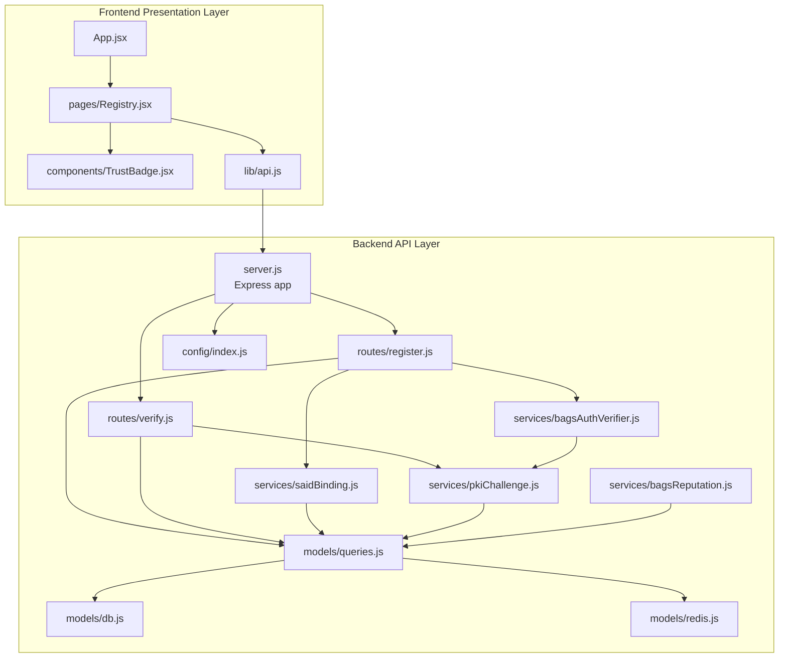
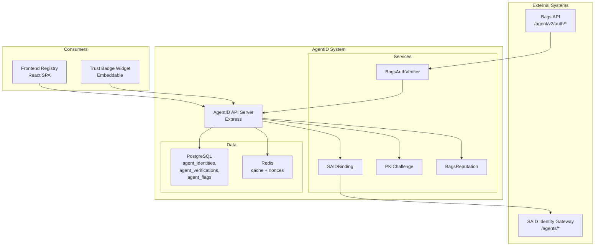
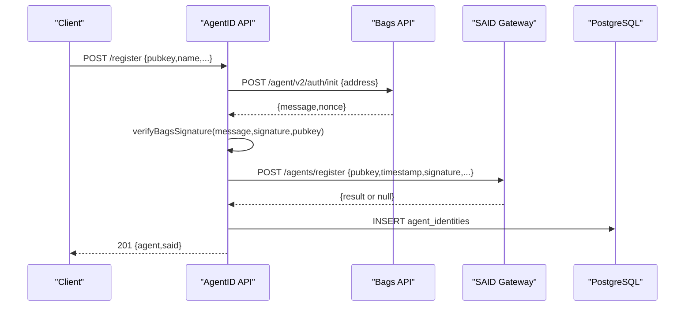
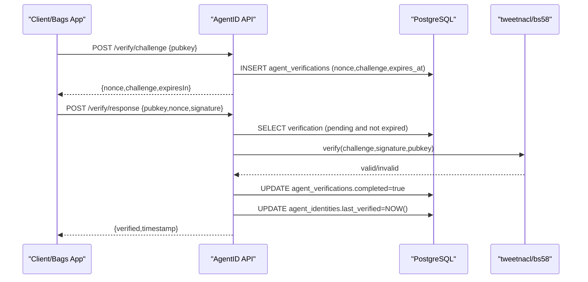
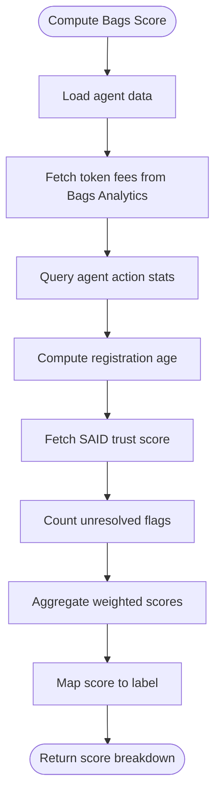
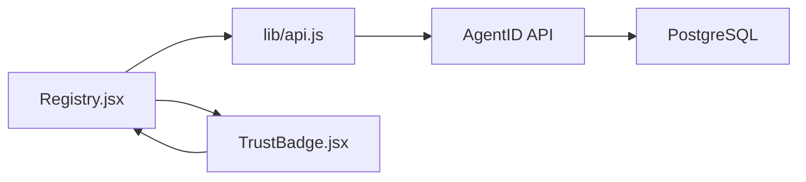
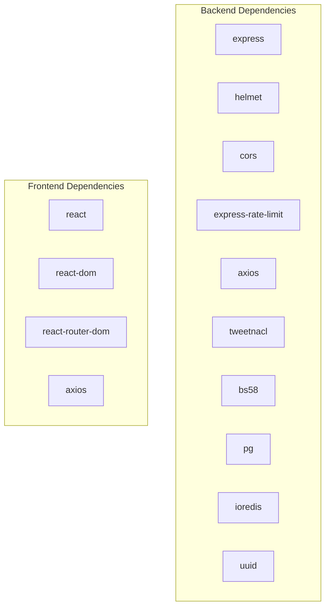

# Architecture Overview

<cite>
**Referenced Files in This Document**
- [server.js](file://backend/server.js)
- [package.json](file://backend/package.json)
- [index.js](file://backend/src/config/index.js)
- [db.js](file://backend/src/models/db.js)
- [redis.js](file://backend/src/models/redis.js)
- [queries.js](file://backend/src/models/queries.js)
- [register.js](file://backend/src/routes/register.js)
- [verify.js](file://backend/src/routes/verify.js)
- [bagsAuthVerifier.js](file://backend/src/services/bagsAuthVerifier.js)
- [saidBinding.js](file://backend/src/services/saidBinding.js)
- [pkiChallenge.js](file://backend/src/services/pkiChallenge.js)
- [bagsReputation.js](file://backend/src/services/bagsReputation.js)
- [agentid_build_plan.md](file://agentid_build_plan.md)
- [App.jsx](file://frontend/src/App.jsx)
- [Registry.jsx](file://frontend/src/pages/Registry.jsx)
- [TrustBadge.jsx](file://frontend/src/components/TrustBadge.jsx)
- [api.js](file://frontend/src/lib/api.js)
- [package.json](file://frontend/package.json)
</cite>

## Table of Contents
1. [Introduction](#introduction)
2. [Project Structure](#project-structure)
3. [Core Components](#core-components)
4. [Architecture Overview](#architecture-overview)
5. [Detailed Component Analysis](#detailed-component-analysis)
6. [Dependency Analysis](#dependency-analysis)
7. [Performance Considerations](#performance-considerations)
8. [Security Considerations](#security-considerations)
9. [Scalability Patterns](#scalability-patterns)
10. [Deployment Topology](#deployment-topology)
11. [Troubleshooting Guide](#troubleshooting-guide)
12. [Conclusion](#conclusion)

## Introduction
This document presents the AgentID system architecture, focusing on the integration between the Bags API, SAID Protocol Gateway, and the AgentID registry service. AgentID extends Bags' Ed25519 agent authentication by binding agent identities to the Solana Agent Registry (SAID Protocol), adding Bags-specific reputation scoring, and surfacing a human-readable trust badge. The system enforces strong anti-spoofing controls through a PKI challenge-response mechanism.

The system follows a layered architecture:
- Backend API layer (Node.js/Express)
- Service layer (business logic)
- Data layer (PostgreSQL, Redis)
- Frontend presentation layer (React)

## Project Structure
The repository is organized into two primary areas:
- backend: Express server, routes, services, models, middleware, and configuration
- frontend: React SPA for registry browsing, agent details, discovery, and badge rendering

**Diagram sources**
- [server.js:1-76](file://backend/server.js#L1-L76)
- [register.js:1-156](file://backend/src/routes/register.js#L1-L156)
- [verify.js:1-115](file://backend/src/routes/verify.js#L1-L115)
- [index.js:1-30](file://backend/src/config/index.js#L1-L30)
- [db.js:1-45](file://backend/src/models/db.js#L1-L45)
- [redis.js:1-94](file://backend/src/models/redis.js#L1-L94)
- [queries.js:1-385](file://backend/src/models/queries.js#L1-L385)
- [bagsAuthVerifier.js:1-87](file://backend/src/services/bagsAuthVerifier.js#L1-L87)
- [saidBinding.js:1-119](file://backend/src/services/saidBinding.js#L1-L119)
- [pkiChallenge.js:1-102](file://backend/src/services/pkiChallenge.js#L1-L102)
- [bagsReputation.js:1-147](file://backend/src/services/bagsReputation.js#L1-L147)
- [App.jsx:1-107](file://frontend/src/App.jsx#L1-L107)
- [Registry.jsx:1-276](file://frontend/src/pages/Registry.jsx#L1-L276)
- [TrustBadge.jsx:1-145](file://frontend/src/components/TrustBadge.jsx#L1-L145)
- [api.js:1-140](file://frontend/src/lib/api.js#L1-L140)

**Section sources**
- [server.js:1-76](file://backend/server.js#L1-L76)
- [agentid_build_plan.md:258-302](file://agentid_build_plan.md#L258-L302)

## Core Components
- Bags Agent Auth Wrapper: Validates wallet ownership using Bags' Ed25519 challenge-response prior to registration.
- SAID Protocol Binding: Registers or validates agent identity in the SAID Identity Gateway and pulls trust scores.
- PKI Challenge-Response: Issues time-bound challenges and verifies Ed25519 signatures to prevent spoofing.
- BAGS Reputation Engine: Computes a composite score from on-chain analytics and community signals.
- AgentID Database: Stores agent records, verification challenges, flags, and metrics.
- Trust Badge API + Widget: Exposes badge data and embeddable widgets for third-party integration.
- Frontend Registry Explorer: Browse, filter, and discover agents with trust badges.

**Section sources**
- [bagsAuthVerifier.js:1-87](file://backend/src/services/bagsAuthVerifier.js#L1-L87)
- [saidBinding.js:1-119](file://backend/src/services/saidBinding.js#L1-L119)
- [pkiChallenge.js:1-102](file://backend/src/services/pkiChallenge.js#L1-L102)
- [bagsReputation.js:1-147](file://backend/src/services/bagsReputation.js#L1-L147)
- [queries.js:1-385](file://backend/src/models/queries.js#L1-L385)
- [agentid_build_plan.md:131-184](file://agentid_build_plan.md#L131-L184)

## Architecture Overview
AgentID sits between Bags applications and the broader Solana ecosystem. It wraps Bags authentication, binds identities to SAID, computes Bags reputation, and exposes trust badges.

**Diagram sources**
- [server.js:1-76](file://backend/server.js#L1-L76)
- [bagsAuthVerifier.js:1-87](file://backend/src/services/bagsAuthVerifier.js#L1-L87)
- [saidBinding.js:1-119](file://backend/src/services/saidBinding.js#L1-L119)
- [pkiChallenge.js:1-102](file://backend/src/services/pkiChallenge.js#L1-L102)
- [bagsReputation.js:1-147](file://backend/src/services/bagsReputation.js#L1-L147)
- [db.js:1-45](file://backend/src/models/db.js#L1-L45)
- [redis.js:1-94](file://backend/src/models/redis.js#L1-L94)
- [agentid_build_plan.md:1-39](file://agentid_build_plan.md#L1-L39)

## Detailed Component Analysis

### Registration Flow: Bags Ownership + SAID Binding + Local Record
End-to-end registration validates wallet ownership via Bags, optionally registers with SAID, and persists local agent data.

**Diagram sources**
- [register.js:59-153](file://backend/src/routes/register.js#L59-L153)
- [bagsAuthVerifier.js:18-80](file://backend/src/services/bagsAuthVerifier.js#L18-L80)
- [saidBinding.js:21-54](file://backend/src/services/saidBinding.js#L21-L54)
- [queries.js:17-29](file://backend/src/models/queries.js#L17-L29)

**Section sources**
- [register.js:1-156](file://backend/src/routes/register.js#L1-L156)
- [bagsAuthVerifier.js:1-87](file://backend/src/services/bagsAuthVerifier.js#L1-L87)
- [saidBinding.js:1-119](file://backend/src/services/saidBinding.js#L1-L119)
- [queries.js:1-385](file://backend/src/models/queries.js#L1-L385)

### PKI Challenge-Response: Anti-Spoofing Verification
Ongoing verification ensures only the legitimate agent can authorize actions.

**Diagram sources**
- [verify.js:20-112](file://backend/src/routes/verify.js#L20-L112)
- [pkiChallenge.js:17-96](file://backend/src/services/pkiChallenge.js#L17-L96)
- [queries.js:213-256](file://backend/src/models/queries.js#L213-L256)

**Section sources**
- [verify.js:1-115](file://backend/src/routes/verify.js#L1-L115)
- [pkiChallenge.js:1-102](file://backend/src/services/pkiChallenge.js#L1-L102)
- [queries.js:205-256](file://backend/src/models/queries.js#L205-L256)

### Reputation Scoring: Composite Bags Score
Computes a 0–100 score combining multiple factors and integrates SAID trust.

**Diagram sources**
- [bagsReputation.js:16-123](file://backend/src/services/bagsReputation.js#L16-L123)
- [queries.js:187-202](file://backend/src/models/queries.js#L187-L202)
- [saidBinding.js:61-87](file://backend/src/services/saidBinding.js#L61-L87)

**Section sources**
- [bagsReputation.js:1-147](file://backend/src/services/bagsReputation.js#L1-L147)
- [queries.js:146-160](file://backend/src/models/queries.js#L146-L160)
- [saidBinding.js:1-119](file://backend/src/services/saidBinding.js#L1-L119)

### Frontend Registry and Trust Badge Rendering
The React frontend consumes AgentID APIs to render agent listings and badges.

**Diagram sources**
- [Registry.jsx:51-276](file://frontend/src/pages/Registry.jsx#L51-L276)
- [TrustBadge.jsx:42-145](file://frontend/src/components/TrustBadge.jsx#L42-L145)
- [api.js:35-140](file://frontend/src/lib/api.js#L35-L140)
- [server.js:47-53](file://backend/server.js#L47-L53)

**Section sources**
- [App.jsx:1-107](file://frontend/src/App.jsx#L1-L107)
- [Registry.jsx:1-276](file://frontend/src/pages/Registry.jsx#L1-L276)
- [TrustBadge.jsx:1-145](file://frontend/src/components/TrustBadge.jsx#L1-L145)
- [api.js:1-140](file://frontend/src/lib/api.js#L1-L140)

## Dependency Analysis
- Backend dependencies include Express, Helmet, CORS, rate limiting, tweetnacl for Ed25519, bs58 for base58 encoding, pg for PostgreSQL, ioredis for Redis, and axios for HTTP calls.
- Frontend depends on React, react-router-dom, axios, and Tailwind for styling.

**Diagram sources**
- [package.json:18-30](file://backend/package.json#L18-L30)
- [package.json:12-18](file://frontend/package.json#L12-L18)

**Section sources**
- [package.json:1-35](file://backend/package.json#L1-L35)
- [package.json:1-33](file://frontend/package.json#L1-L33)

## Performance Considerations
- Database pooling with SSL configuration for production stability.
- Redis caching with retry strategy and offline queue to maintain resilience.
- Rate limiting middleware applied to authentication-heavy endpoints.
- Badge cache TTL configurable via environment variables.
- Asynchronous SAID registration to avoid blocking registration flow.

Recommendations:
- Monitor DB connection pool saturation and tune pool size.
- Use Redis pipeline for batched cache operations.
- Implement circuit breakers for external API calls (Bags, SAID).
- Add database indexes on frequently queried columns (pubkey, capability_set, status).

**Section sources**
- [db.js:10-18](file://backend/src/models/db.js#L10-L18)
- [redis.js:10-20](file://backend/src/models/redis.js#L10-L20)
- [index.js:24-27](file://backend/src/config/index.js#L24-L27)
- [register.js:106-131](file://backend/src/routes/register.js#L106-L131)

## Security Considerations
- Transport security: Helmet enabled; CORS configured per environment.
- Authentication: Ed25519 challenge-response prevents spoofing; signatures validated with tweetnacl.
- Replay protection: Nonces expire after a fixed window; single-use verification records.
- Data integrity: Parameterized queries prevent SQL injection; base58 decoding with validation.
- External API resilience: Timeouts and fallbacks for SAID and Bags calls.

Anti-spoofing specifics:
- Registration requires Bags signature verification containing the nonce.
- Ongoing verification uses time-bound challenges with one-time use semantics.
- Signature verification uses deterministic Ed25519 checks.

**Section sources**
- [server.js:21-28](file://backend/server.js#L21-L28)
- [register.js:82-95](file://backend/src/routes/register.js#L82-L95)
- [verify.js:13-14](file://backend/src/routes/verify.js#L13-L14)
- [pkiChallenge.js:17-38](file://backend/src/services/pkiChallenge.js#L17-L38)
- [queries.js:230-239](file://backend/src/models/queries.js#L230-L239)

## Scalability Patterns
- Horizontal scaling: Stateless API behind a load balancer; shared PostgreSQL and Redis.
- Caching: Redis for badge responses and challenge nonces; TTL-based eviction.
- Asynchronous processing: SAID registration is non-blocking during registration.
- API partitioning: Separate routes for registration, verification, reputation, discovery, and widgets.

Operational tips:
- Scale Redis and PostgreSQL independently based on workload.
- Use read replicas for heavy read paths (registry, badges).
- Implement CDN for static widget assets.

**Section sources**
- [redis.js:58-71](file://backend/src/models/redis.js#L58-L71)
- [register.js:106-131](file://backend/src/routes/register.js#L106-L131)
- [agentid_build_plan.md:309-330](file://agentid_build_plan.md#L309-L330)

## Deployment Topology
- Backend runs on Node.js/Express, served behind Nginx with SSL termination.
- Database: PostgreSQL with connection pooling.
- Cache: Redis for short-lived nonces and badge caching.
- Frontend: Static assets served via the same domain/API proxy.
- Domain: Configurable via environment variable; health check endpoint exposed.

Typical deployment:
- One or more API instances behind a reverse proxy.
- Dedicated PostgreSQL and Redis instances.
- CDN for widget assets and badge SVGs.

**Section sources**
- [server.js:34-41](file://backend/server.js#L34-L41)
- [index.js:6-27](file://backend/src/config/index.js#L6-L27)
- [agentid_build_plan.md:309-330](file://agentid_build_plan.md#L309-L330)

## Troubleshooting Guide
Common issues and resolutions:
- Registration fails due to invalid signature: Ensure the message includes the nonce and signature matches the pubkey.
- SAID registration unavailable: Check SAID gateway URL and network connectivity; registration continues without SAID binding.
- Verification errors: Confirm challenge exists, is unexpired, and signature decodes correctly; ensure Ed25519 libraries are compatible.
- Redis errors: Expect graceful degradation; cache operations are best-effort.
- Frontend API errors: Verify base URL routing and CORS configuration.

**Section sources**
- [register.js:82-95](file://backend/src/routes/register.js#L82-L95)
- [verify.js:85-107](file://backend/src/routes/verify.js#L85-L107)
- [redis.js:27-34](file://backend/src/models/redis.js#L27-L34)
- [api.js:24-33](file://frontend/src/lib/api.js#L24-L33)

## Conclusion
AgentID provides a robust, PKI-hardened bridge between Bags and SAID, enabling verifiable agent identities, contextual reputation, and embeddable trust badges. Its layered design, strong anti-spoofing mechanisms, and scalable data plane support position it well for adoption across the Bags ecosystem and beyond.