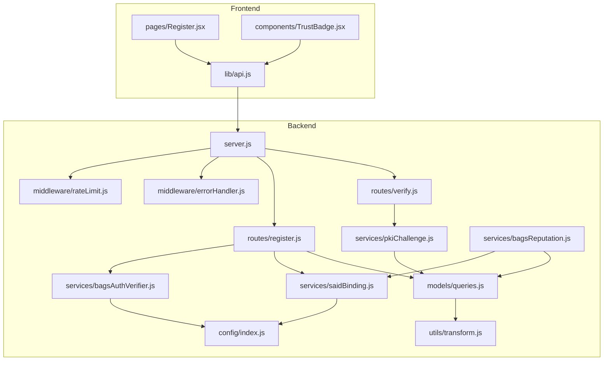
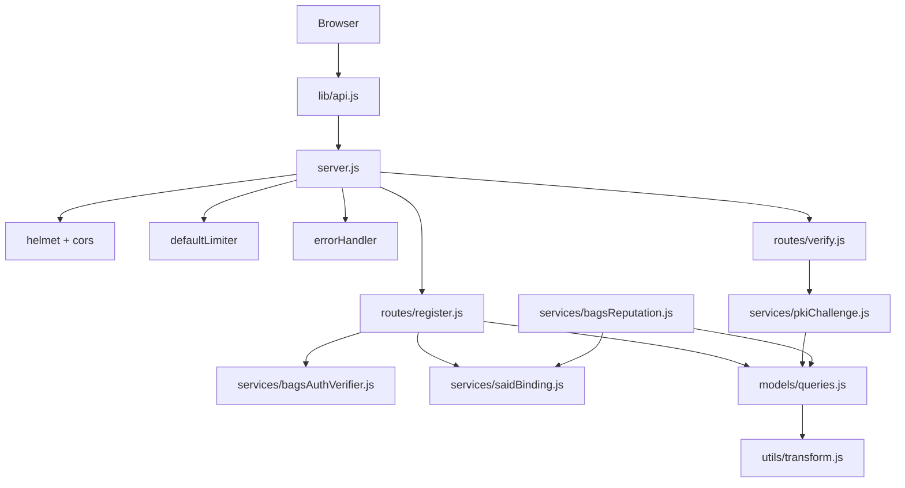
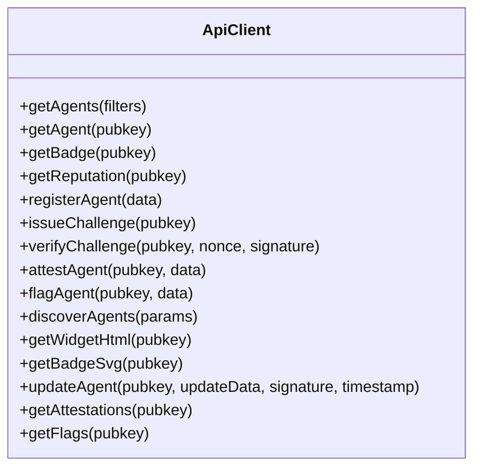
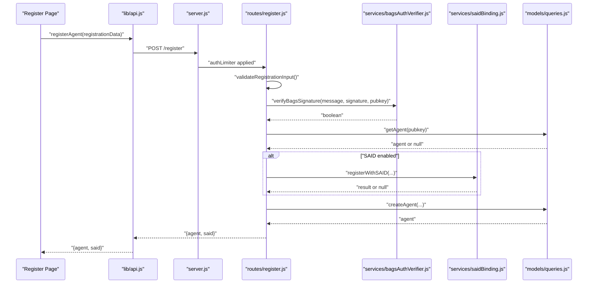
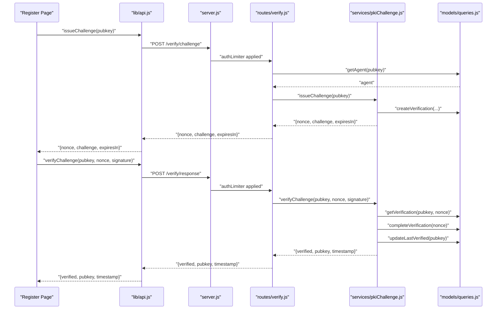
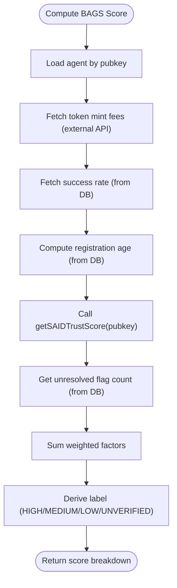
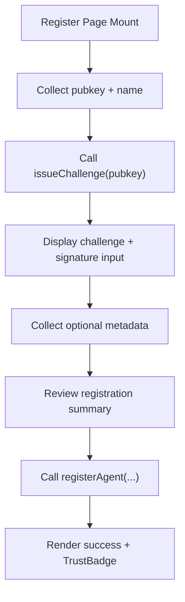
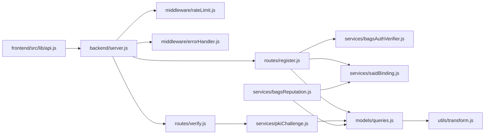

# Component Interactions

<cite>
**Referenced Files in This Document**
- [server.js](file://backend/server.js)
- [config/index.js](file://backend/src/config/index.js)
- [middleware/errorHandler.js](file://backend/src/middleware/errorHandler.js)
- [middleware/rateLimit.js](file://backend/src/middleware/rateLimit.js)
- [routes/register.js](file://backend/src/routes/register.js)
- [routes/verify.js](file://backend/src/routes/verify.js)
- [services/bagsAuthVerifier.js](file://backend/src/services/bagsAuthVerifier.js)
- [services/bagsReputation.js](file://backend/src/services/bagsReputation.js)
- [services/pkiChallenge.js](file://backend/src/services/pkiChallenge.js)
- [services/saidBinding.js](file://backend/src/services/saidBinding.js)
- [models/queries.js](file://backend/src/models/queries.js)
- [utils/transform.js](file://backend/src/utils/transform.js)
- [lib/api.js](file://frontend/src/lib/api.js)
- [pages/Register.jsx](file://frontend/src/pages/Register.jsx)
- [components/TrustBadge.jsx](file://frontend/src/components/TrustBadge.jsx)
</cite>

## Table of Contents
1. [Introduction](#introduction)
2. [Project Structure](#project-structure)
3. [Core Components](#core-components)
4. [Architecture Overview](#architecture-overview)
5. [Detailed Component Analysis](#detailed-component-analysis)
6. [Dependency Analysis](#dependency-analysis)
7. [Performance Considerations](#performance-considerations)
8. [Troubleshooting Guide](#troubleshooting-guide)
9. [Conclusion](#conclusion)
10. [Appendices](#appendices)

## Introduction
This document explains how AgentID’s frontend and backend components interact to deliver agent registration, verification, reputation scoring, and trust badges. It details request/response patterns, state management, middleware behavior, and integration with external systems such as BAGS authentication and SAID identity gateway. Sequence diagrams illustrate typical user workflows, and the dependency analysis highlights coupling and cohesion across services.

## Project Structure
AgentID is split into:
- Backend (Express server, routes, services, models, middleware, configuration)
- Frontend (React SPA with API client, pages, and components)

**Diagram sources**
- [server.js:1-91](file://backend/server.js#L1-L91)
- [config/index.js:1-31](file://backend/src/config/index.js#L1-L31)
- [middleware/rateLimit.js:1-62](file://backend/src/middleware/rateLimit.js#L1-L62)
- [middleware/errorHandler.js:1-44](file://backend/src/middleware/errorHandler.js#L1-L44)
- [routes/register.js:1-162](file://backend/src/routes/register.js#L1-L162)
- [routes/verify.js:1-121](file://backend/src/routes/verify.js#L1-L121)
- [services/bagsAuthVerifier.js:1-93](file://backend/src/services/bagsAuthVerifier.js#L1-L93)
- [services/pkiChallenge.js:1-102](file://backend/src/services/pkiChallenge.js#L1-L102)
- [services/saidBinding.js:1-119](file://backend/src/services/saidBinding.js#L1-L119)
- [services/bagsReputation.js:1-146](file://backend/src/services/bagsReputation.js#L1-L146)
- [models/queries.js:1-404](file://backend/src/models/queries.js#L1-L404)
- [utils/transform.js:1-103](file://backend/src/utils/transform.js#L1-L103)
- [lib/api.js:1-140](file://frontend/src/lib/api.js#L1-L140)
- [pages/Register.jsx:1-733](file://frontend/src/pages/Register.jsx#L1-L733)
- [components/TrustBadge.jsx:1-145](file://frontend/src/components/TrustBadge.jsx#L1-L145)

**Section sources**
- [server.js:1-91](file://backend/server.js#L1-L91)
- [lib/api.js:1-140](file://frontend/src/lib/api.js#L1-L140)

## Core Components
- Frontend API client encapsulates HTTP calls and interceptors for auth and error handling.
- Backend server initializes middleware, routes, and health checks; delegates to services and models.
- Services implement domain logic: BAGS auth verification, PKI challenge-response, SAID binding, and BAGS reputation computation.
- Models provide database query abstractions and transformations.
- Middleware enforces rate limits and global error handling.

**Section sources**
- [lib/api.js:1-140](file://frontend/src/lib/api.js#L1-L140)
- [server.js:1-91](file://backend/server.js#L1-L91)
- [services/bagsAuthVerifier.js:1-93](file://backend/src/services/bagsAuthVerifier.js#L1-L93)
- [services/pkiChallenge.js:1-102](file://backend/src/services/pkiChallenge.js#L1-L102)
- [services/saidBinding.js:1-119](file://backend/src/services/saidBinding.js#L1-L119)
- [services/bagsReputation.js:1-146](file://backend/src/services/bagsReputation.js#L1-L146)
- [models/queries.js:1-404](file://backend/src/models/queries.js#L1-L404)
- [middleware/rateLimit.js:1-62](file://backend/src/middleware/rateLimit.js#L1-L62)
- [middleware/errorHandler.js:1-44](file://backend/src/middleware/errorHandler.js#L1-L44)

## Architecture Overview
The backend follows a layered architecture:
- HTTP entrypoint (Express) applies security and rate-limit middleware.
- Route handlers validate inputs, enforce rate limits, and orchestrate service calls.
- Services integrate with external APIs and the database.
- Models encapsulate SQL and data transformations.
- Frontend communicates via a typed API client and renders trust badges.

**Diagram sources**
- [server.js:1-91](file://backend/server.js#L1-L91)
- [routes/register.js:1-162](file://backend/src/routes/register.js#L1-L162)
- [routes/verify.js:1-121](file://backend/src/routes/verify.js#L1-L121)
- [services/bagsAuthVerifier.js:1-93](file://backend/src/services/bagsAuthVerifier.js#L1-L93)
- [services/pkiChallenge.js:1-102](file://backend/src/services/pkiChallenge.js#L1-L102)
- [services/saidBinding.js:1-119](file://backend/src/services/saidBinding.js#L1-L119)
- [services/bagsReputation.js:1-146](file://backend/src/services/bagsReputation.js#L1-L146)
- [models/queries.js:1-404](file://backend/src/models/queries.js#L1-L404)
- [utils/transform.js:1-103](file://backend/src/utils/transform.js#L1-L103)
- [lib/api.js:1-140](file://frontend/src/lib/api.js#L1-L140)

## Detailed Component Analysis

### Frontend API Layer
- Provides centralized HTTP client with base URL and interceptors for auth token injection and 401 handling.
- Exposes functions for agents, badges, reputation, registration, verification, attestations, discovery, and widget rendering.

**Diagram sources**
- [lib/api.js:1-140](file://frontend/src/lib/api.js#L1-L140)

**Section sources**
- [lib/api.js:1-140](file://frontend/src/lib/api.js#L1-L140)

### Registration Workflow (End-to-End)
This sequence shows the full registration flow including BAGS signature verification and optional SAID binding.

**Diagram sources**
- [pages/Register.jsx:295-341](file://frontend/src/pages/Register.jsx#L295-L341)
- [lib/api.js:65-68](file://frontend/src/lib/api.js#L65-L68)
- [server.js:57-63](file://backend/server.js#L57-L63)
- [routes/register.js:59-159](file://backend/src/routes/register.js#L59-L159)
- [services/bagsAuthVerifier.js:44-57](file://backend/src/services/bagsAuthVerifier.js#L44-L57)
- [services/saidBinding.js:21-54](file://backend/src/services/saidBinding.js#L21-L54)
- [models/queries.js:17-28](file://backend/src/models/queries.js#L17-L28)

**Section sources**
- [pages/Register.jsx:295-341](file://frontend/src/pages/Register.jsx#L295-L341)
- [routes/register.js:59-159](file://backend/src/routes/register.js#L59-L159)

### Verification Workflow (Challenge-Response)
This sequence covers issuing a challenge and verifying a signed response using Ed25519.

**Diagram sources**
- [lib/api.js:71-83](file://frontend/src/lib/api.js#L71-L83)
- [routes/verify.js:18-118](file://backend/src/routes/verify.js#L18-L118)
- [services/pkiChallenge.js:17-96](file://backend/src/services/pkiChallenge.js#L17-L96)
- [models/queries.js:213-256](file://backend/src/models/queries.js#L213-L256)

**Section sources**
- [lib/api.js:71-83](file://frontend/src/lib/api.js#L71-L83)
- [routes/verify.js:18-118](file://backend/src/routes/verify.js#L18-L118)
- [services/pkiChallenge.js:17-96](file://backend/src/services/pkiChallenge.js#L17-L96)

### Reputation Scoring and SAID Integration
BAGS reputation aggregates multiple signals and optionally consults SAID for trust scores.

**Diagram sources**
- [services/bagsReputation.js:16-122](file://backend/src/services/bagsReputation.js#L16-L122)
- [services/saidBinding.js:61-87](file://backend/src/services/saidBinding.js#L61-L87)
- [models/queries.js:187-202](file://backend/src/models/queries.js#L187-L202)
- [models/queries.js:299-305](file://backend/src/models/queries.js#L299-L305)

**Section sources**
- [services/bagsReputation.js:16-122](file://backend/src/services/bagsReputation.js#L16-L122)
- [services/saidBinding.js:61-87](file://backend/src/services/saidBinding.js#L61-L87)

### Frontend State Management and Rendering
- Registration page orchestrates multi-step form state, validates inputs, and triggers API calls.
- Trust badge component renders status, name, score, and metadata.

**Diagram sources**
- [pages/Register.jsx:241-390](file://frontend/src/pages/Register.jsx#L241-L390)
- [components/TrustBadge.jsx:42-134](file://frontend/src/components/TrustBadge.jsx#L42-L134)

**Section sources**
- [pages/Register.jsx:241-390](file://frontend/src/pages/Register.jsx#L241-L390)
- [components/TrustBadge.jsx:42-134](file://frontend/src/components/TrustBadge.jsx#L42-L134)

## Dependency Analysis
- Route handlers depend on services and models; services depend on configuration and external APIs.
- Frontend depends on the API client; components depend on props and API responses.
- Middleware is globally applied before routes and error handling is centralized.

**Diagram sources**
- [lib/api.js:1-140](file://frontend/src/lib/api.js#L1-L140)
- [server.js:1-91](file://backend/server.js#L1-L91)
- [routes/register.js:1-162](file://backend/src/routes/register.js#L1-L162)
- [routes/verify.js:1-121](file://backend/src/routes/verify.js#L1-L121)
- [services/bagsAuthVerifier.js:1-93](file://backend/src/services/bagsAuthVerifier.js#L1-L93)
- [services/pkiChallenge.js:1-102](file://backend/src/services/pkiChallenge.js#L1-L102)
- [services/saidBinding.js:1-119](file://backend/src/services/saidBinding.js#L1-L119)
- [services/bagsReputation.js:1-146](file://backend/src/services/bagsReputation.js#L1-L146)
- [models/queries.js:1-404](file://backend/src/models/queries.js#L1-L404)
- [utils/transform.js:1-103](file://backend/src/utils/transform.js#L1-L103)

**Section sources**
- [server.js:1-91](file://backend/server.js#L1-L91)
- [routes/register.js:1-162](file://backend/src/routes/register.js#L1-L162)
- [routes/verify.js:1-121](file://backend/src/routes/verify.js#L1-L121)
- [services/bagsAuthVerifier.js:1-93](file://backend/src/services/bagsAuthVerifier.js#L1-L93)
- [services/pkiChallenge.js:1-102](file://backend/src/services/pkiChallenge.js#L1-L102)
- [services/saidBinding.js:1-119](file://backend/src/services/saidBinding.js#L1-L119)
- [services/bagsReputation.js:1-146](file://backend/src/services/bagsReputation.js#L1-L146)
- [models/queries.js:1-404](file://backend/src/models/queries.js#L1-L404)
- [utils/transform.js:1-103](file://backend/src/utils/transform.js#L1-L103)

## Performance Considerations
- Rate limiting reduces load and protects endpoints; stricter limits apply to auth-related routes.
- External API calls (BAGS, SAID) are retried with timeouts; failures degrade gracefully to avoid blocking registration.
- Database queries use parameterized statements and JSONB fields for capability filtering and discovery.
- Caching TTL for badges is configurable; consider adding Redis caching for frequent badge requests.

[No sources needed since this section provides general guidance]

## Troubleshooting Guide
- Authentication and session:
  - The API client removes stored tokens on 401 responses to prevent stale auth.
- Registration issues:
  - Validate pubkey format and signature presence; ensure the message includes the nonce.
  - SAID registration failures are logged and do not block agent creation.
- Verification issues:
  - Ensure challenge exists, is uncompleted, and not expired.
  - Confirm Ed25519 signature decoding and verification succeed.
- Reputation scoring:
  - Missing external data results in conservative zero scores; SAID trust score fallback to UNKNOWN is handled gracefully.

**Section sources**
- [lib/api.js:23-33](file://frontend/src/lib/api.js#L23-L33)
- [routes/register.js:60-101](file://backend/src/routes/register.js#L60-L101)
- [routes/verify.js:57-113](file://backend/src/routes/verify.js#L57-L113)
- [services/pkiChallenge.js:49-96](file://backend/src/services/pkiChallenge.js#L49-L96)
- [services/bagsReputation.js:35-121](file://backend/src/services/bagsReputation.js#L35-L121)

## Conclusion
AgentID’s architecture cleanly separates concerns between frontend and backend, with robust middleware, modular services, and resilient integrations to external systems. The documented workflows and diagrams provide a blueprint for extending features, adding caching, and maintaining reliability under load.

[No sources needed since this section summarizes without analyzing specific files]

## Appendices

### API Surface Summary
- Registration: POST /register (with BAGS signature verification and optional SAID binding)
- Verification: POST /verify/challenge and POST /verify/response (Ed25519 challenge-response)
- Badges: GET /badge/:pubkey and GET /badge/:pubkey/svg
- Reputation: GET /reputation/:pubkey
- Agents: GET /agents, GET /agents/:pubkey, GET /discover
- Attestations: POST /agents/:pubkey/attest, POST /agents/:pubkey/flag
- Widget: GET /widget/:pubkey

**Section sources**
- [server.js:57-63](file://backend/server.js#L57-L63)
- [lib/api.js:35-116](file://frontend/src/lib/api.js#L35-L116)