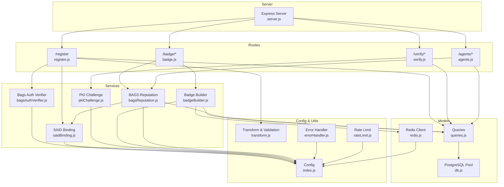
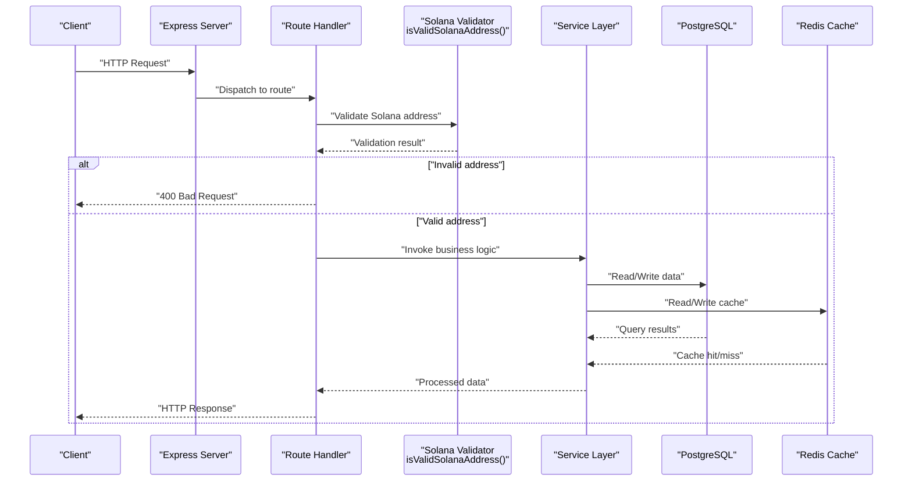
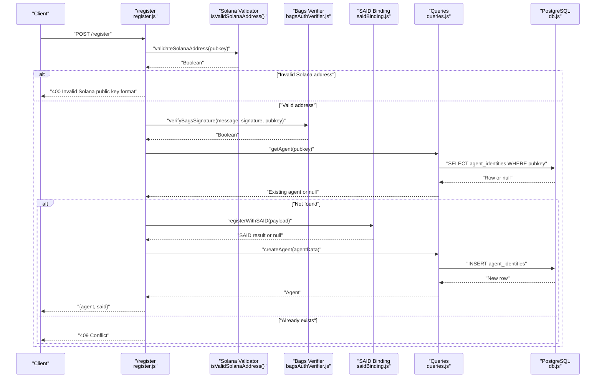
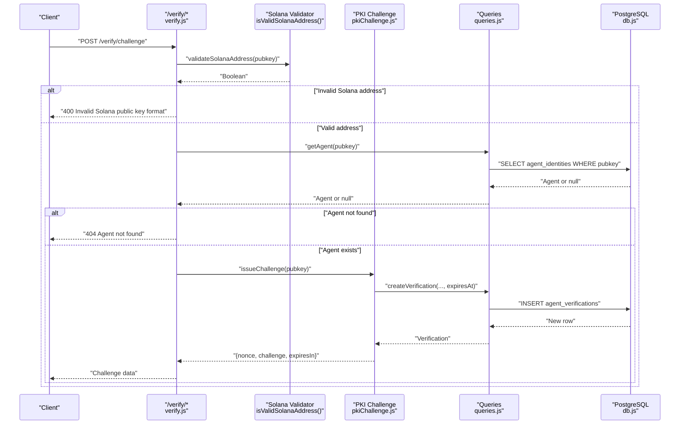
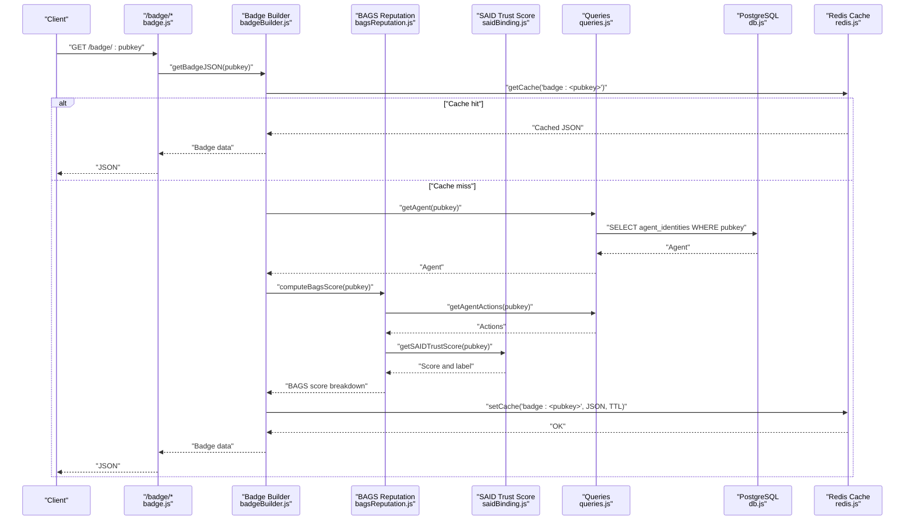
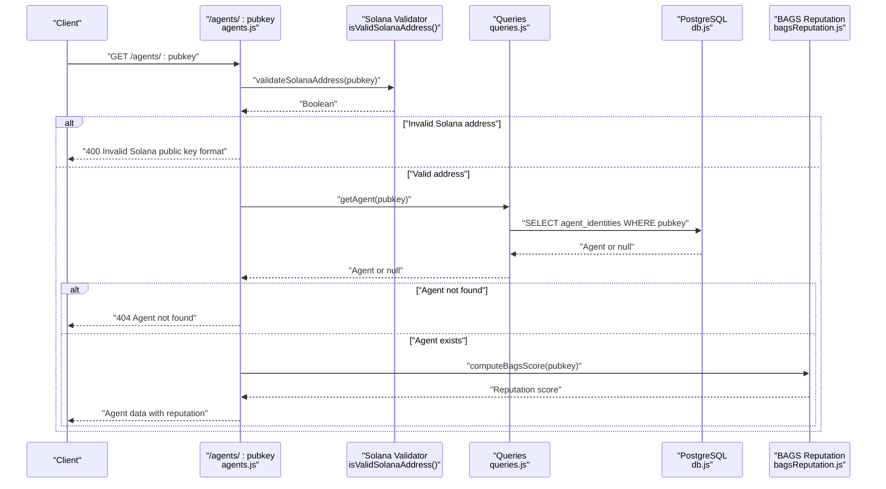
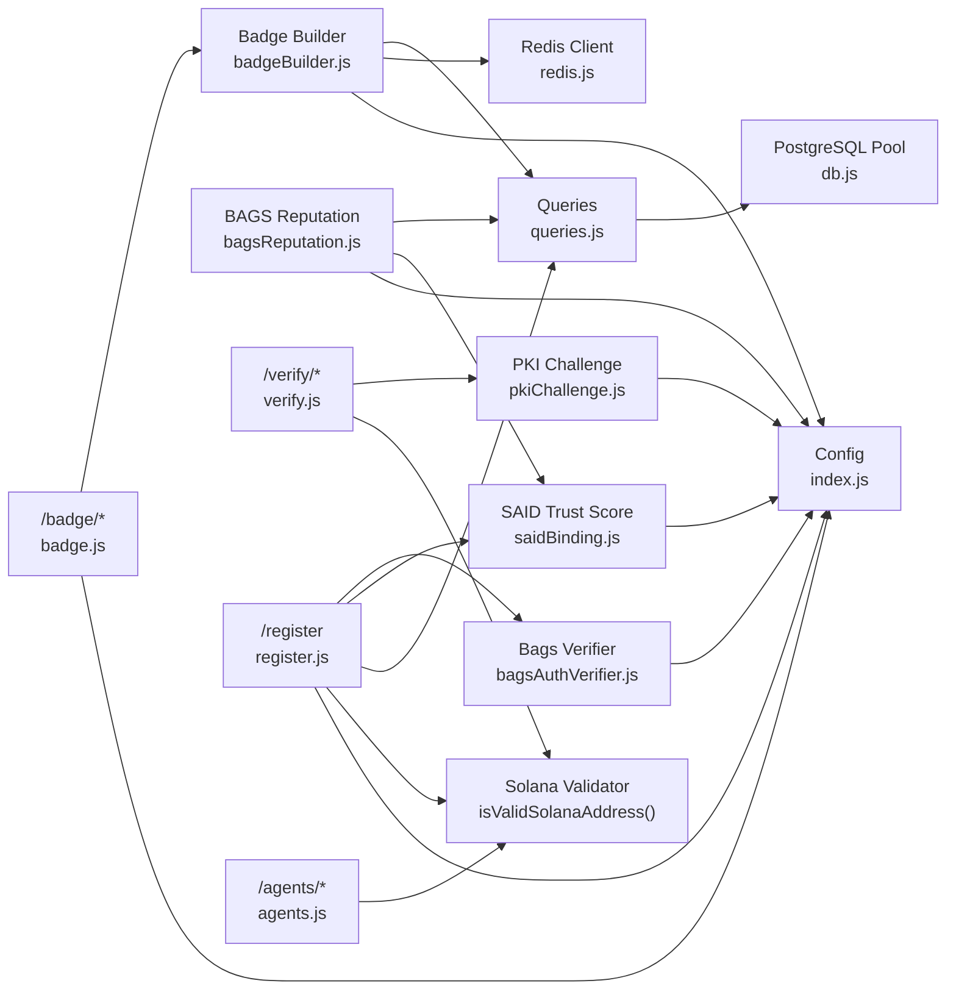

# Data Flow Architecture

<cite>
**Referenced Files in This Document**
- [server.js](file://backend/server.js)
- [index.js](file://backend/src/config/index.js)
- [db.js](file://backend/src/models/db.js)
- [redis.js](file://backend/src/models/redis.js)
- [queries.js](file://backend/src/models/queries.js)
- [register.js](file://backend/src/routes/register.js)
- [verify.js](file://backend/src/routes/verify.js)
- [badge.js](file://backend/src/routes/badge.js)
- [agents.js](file://backend/src/routes/agents.js)
- [bagsAuthVerifier.js](file://backend/src/services/bagsAuthVerifier.js)
- [saidBinding.js](file://backend/src/services/saidBinding.js)
- [pkiChallenge.js](file://backend/src/services/pkiChallenge.js)
- [badgeBuilder.js](file://backend/src/services/badgeBuilder.js)
- [bagsReputation.js](file://backend/src/services/bagsReputation.js)
- [transform.js](file://backend/src/utils/transform.js)
- [errorHandler.js](file://backend/src/middleware/errorHandler.js)
- [rateLimit.js](file://backend/src/middleware/rateLimit.js)
</cite>

## Update Summary
**Changes Made**
- Enhanced validation mechanisms with strict Solana address validation throughout critical routes
- Added `isValidSolanaAddress()` function implementation with comprehensive validation logic
- Integrated strict Solana address validation in `/register`, `/verify/challenge`, `/verify/response`, and `/agents/:pubkey` routes
- Updated validation flows to include descriptive HTTP 400 responses with error messages
- Strengthened data integrity by enforcing base58-encoded Solana public key format across all critical endpoints

## Table of Contents
1. [Introduction](#introduction)
2. [Project Structure](#project-structure)
3. [Core Components](#core-components)
4. [Architecture Overview](#architecture-overview)
5. [Detailed Component Analysis](#detailed-component-analysis)
6. [Dependency Analysis](#dependency-analysis)
7. [Performance Considerations](#performance-considerations)
8. [Troubleshooting Guide](#troubleshooting-guide)
9. [Conclusion](#conclusion)

## Introduction
This document describes the data flow architecture of AgentID, focusing on how data moves through the system from user requests to final responses. It covers three primary pathways:
- Registration flow: client → /register → Bags auth verification → SAID binding → database persistence
- Verification flow: challenge issuance → response validation → database updates
- Badge retrieval flow: reputation computation → badge generation → response caching

It also documents data transformations, Redis caching strategies, database transaction handling, the persistence model for agent identities, verification records, and flags, along with validation flows, error propagation, data integrity mechanisms, performance considerations, consistency guarantees, and monitoring approaches.

**Updated** Enhanced with strict Solana address validation across all critical routes to ensure data integrity and prevent malformed requests.

## Project Structure
AgentID is organized into a backend service with clear separation of concerns:
- Configuration and environment variables
- Middleware for error handling and rate limiting
- Models for database and Redis
- Services for external integrations and computations
- Routes for HTTP endpoints
- Utilities for data transformation and validation

**Diagram sources**
- [server.js](file://backend/server.js)
- [register.js](file://backend/src/routes/register.js)
- [verify.js](file://backend/src/routes/verify.js)
- [badge.js](file://backend/src/routes/badge.js)
- [agents.js](file://backend/src/routes/agents.js)
- [bagsAuthVerifier.js](file://backend/src/services/bagsAuthVerifier.js)
- [saidBinding.js](file://backend/src/services/saidBinding.js)
- [pkiChallenge.js](file://backend/src/services/pkiChallenge.js)
- [badgeBuilder.js](file://backend/src/services/badgeBuilder.js)
- [bagsReputation.js](file://backend/src/services/bagsReputation.js)
- [queries.js](file://backend/src/models/queries.js)
- [db.js](file://backend/src/models/db.js)
- [redis.js](file://backend/src/models/redis.js)
- [index.js](file://backend/src/config/index.js)
- [transform.js](file://backend/src/utils/transform.js)
- [errorHandler.js](file://backend/src/middleware/errorHandler.js)
- [rateLimit.js](file://backend/src/middleware/rateLimit.js)

**Section sources**
- [server.js](file://backend/server.js)
- [index.js](file://backend/src/config/index.js)

## Core Components
- Configuration: centralizes environment-driven settings for external APIs, database, Redis, CORS, and cache TTLs.
- Database: PostgreSQL via a connection pool with parameterized queries for safety.
- Redis: caching client with retry strategy and offline queue for resilience.
- Routes: HTTP endpoints for registration, verification, badge retrieval, and agent management.
- Services: external integrations (Bags, SAID) and internal computations (reputation, challenges, badges).
- Models: reusable query functions for agent identities, verifications, flags, and discovery.
- Utilities: data transformation and validation helpers, including strict Solana address validation.
- Middleware: global error handling and rate limiting.

**Updated** Enhanced validation utilities now include comprehensive Solana address validation using base58 decoding and length checking.

**Section sources**
- [index.js](file://backend/src/config/index.js)
- [db.js](file://backend/src/models/db.js)
- [redis.js](file://backend/src/models/redis.js)
- [queries.js](file://backend/src/models/queries.js)
- [transform.js](file://backend/src/utils/transform.js)
- [errorHandler.js](file://backend/src/middleware/errorHandler.js)
- [rateLimit.js](file://backend/src/middleware/rateLimit.js)

## Architecture Overview
AgentID's data flows are request-driven and layered:
- Requests enter via Express routes, validated, and processed by services.
- Services integrate with external systems (Bags, SAID) and persist or fetch data from PostgreSQL.
- Redis caches badge data to reduce load and latency.
- Responses are transformed and returned to clients, with errors handled centrally.
- All critical routes now enforce strict Solana address validation to ensure data integrity.

[No sources needed since this diagram shows conceptual workflow, not actual code structure]

## Detailed Component Analysis

### Registration Flow
End-to-end data movement for agent registration:
- Client sends a registration request with pubkey, name, signature, message, nonce, and optional metadata.
- Route validates inputs, checks nonce presence in message, enforces strict Solana address validation, verifies Bags signature, checks for existing agent, attempts SAID binding (non-blocking), persists agent record, and returns agent plus SAID status.

**Diagram sources**
- [register.js](file://backend/src/routes/register.js)
- [transform.js](file://backend/src/utils/transform.js)
- [bagsAuthVerifier.js](file://backend/src/services/bagsAuthVerifier.js)
- [saidBinding.js](file://backend/src/services/saidBinding.js)
- [queries.js](file://backend/src/models/queries.js)
- [db.js](file://backend/src/models/db.js)

Data transformation and validation:
- Route validates required fields, length constraints, and Solana pubkey format using `isValidSolanaAddress()`.
- Nonce must be included in the message to prevent signature replay.
- Bags signature is verified using Ed25519 and base58 decoding.

Caching and persistence:
- Registration does not use Redis caching; it writes directly to PostgreSQL.
- SAID binding is attempted asynchronously and logged without failing the registration.

Error propagation:
- Validation errors return 400 with structured messages including "Invalid Solana public key format".
- Signature verification failure returns 401.
- Existing agent returns 409.
- Unexpected errors are forwarded to the global error handler.

**Updated** Added strict Solana address validation as the first step in the registration process, returning HTTP 400 with descriptive error messages for invalid addresses.

**Section sources**
- [register.js](file://backend/src/routes/register.js)
- [transform.js](file://backend/src/utils/transform.js)
- [bagsAuthVerifier.js](file://backend/src/services/bagsAuthVerifier.js)
- [saidBinding.js](file://backend/src/services/saidBinding.js)
- [queries.js](file://backend/src/models/queries.js)
- [db.js](file://backend/src/models/db.js)
- [errorHandler.js](file://backend/src/middleware/errorHandler.js)

### Verification Flow
Challenge issuance and response validation:
- Challenge issuance stores a pending verification record with an expiration timestamp and returns a base58-encoded challenge.
- Response validation decodes inputs, verifies Ed25519 signature against the stored challenge, marks verification complete, and updates last verified timestamp.

**Diagram sources**
- [verify.js](file://backend/src/routes/verify.js)
- [transform.js](file://backend/src/utils/transform.js)
- [pkiChallenge.js](file://backend/src/services/pkiChallenge.js)
- [queries.js](file://backend/src/models/queries.js)
- [db.js](file://backend/src/models/db.js)

Data validation and integrity:
- Inputs are validated for presence and format, with strict Solana address validation enforced.
- Expiration is enforced by database query conditions.
- Signature verification uses deterministic base58 decoding and Ed25519 verification.

Error propagation:
- Specific error messages for not found, expired, and invalid signature scenarios.
- Invalid Solana address returns HTTP 400 with descriptive error message.
- Unexpected errors bubble to the global error handler.

**Updated** Added strict Solana address validation to both challenge issuance and response validation endpoints, ensuring all verification operations use valid Solana addresses.

**Section sources**
- [verify.js](file://backend/src/routes/verify.js)
- [transform.js](file://backend/src/utils/transform.js)
- [pkiChallenge.js](file://backend/src/services/pkiChallenge.js)
- [queries.js](file://backend/src/models/queries.js)
- [db.js](file://backend/src/models/db.js)
- [errorHandler.js](file://backend/src/middleware/errorHandler.js)

### Badge Retrieval Flow
Badge generation pipeline:
- Route handlers fetch badge JSON or SVG by pubkey.
- Badge builder retrieves agent, computes reputation (BAGS score), aggregates action stats, determines status and label, and renders badge data.
- Results are cached in Redis with configured TTL.

**Diagram sources**
- [badge.js](file://backend/src/routes/badge.js)
- [badgeBuilder.js](file://backend/src/services/badgeBuilder.js)
- [bagsReputation.js](file://backend/src/services/bagsReputation.js)
- [saidBinding.js](file://backend/src/services/saidBinding.js)
- [queries.js](file://backend/src/models/queries.js)
- [db.js](file://backend/src/models/db.js)
- [redis.js](file://backend/src/models/redis.js)

Data transformation and rendering:
- Agent data is transformed to camelCase and capability_set mapped to capabilities for frontend compatibility.
- SVG and HTML widget renderers produce themed badges with dynamic colors and scores.

Caching strategy:
- Redis key pattern: "badge:<pubkey>" with TTL derived from configuration.
- On miss, the computed badge is serialized and cached.

**Section sources**
- [badge.js](file://backend/src/routes/badge.js)
- [badgeBuilder.js](file://backend/src/services/badgeBuilder.js)
- [bagsReputation.js](file://backend/src/services/bagsReputation.js)
- [saidBinding.js](file://backend/src/services/saidBinding.js)
- [queries.js](file://backend/src/models/queries.js)
- [redis.js](file://backend/src/models/redis.js)
- [transform.js](file://backend/src/utils/transform.js)
- [index.js](file://backend/src/config/index.js)

### Agent Management Flow
Agent detail retrieval with enhanced validation:
- Route validates Solana address format, fetches agent details, computes reputation score, and returns agent data with reputation metrics.

**Diagram sources**
- [agents.js](file://backend/src/routes/agents.js)
- [transform.js](file://backend/src/utils/transform.js)
- [queries.js](file://backend/src/models/queries.js)
- [db.js](file://backend/src/models/db.js)
- [bagsReputation.js](file://backend/src/services/bagsReputation.js)

**Updated** Added strict Solana address validation to agent detail retrieval endpoint, ensuring all agent-related operations use valid Solana addresses.

**Section sources**
- [agents.js](file://backend/src/routes/agents.js)
- [transform.js](file://backend/src/utils/transform.js)
- [queries.js](file://backend/src/models/queries.js)
- [db.js](file://backend/src/models/db.js)
- [bagsReputation.js](file://backend/src/services/bagsReputation.js)

## Dependency Analysis
Component relationships and data dependencies:

**Diagram sources**
- [index.js](file://backend/src/config/index.js)
- [db.js](file://backend/src/models/db.js)
- [redis.js](file://backend/src/models/redis.js)
- [queries.js](file://backend/src/models/queries.js)
- [badgeBuilder.js](file://backend/src/services/badgeBuilder.js)
- [bagsReputation.js](file://backend/src/services/bagsReputation.js)
- [saidBinding.js](file://backend/src/services/saidBinding.js)
- [pkiChallenge.js](file://backend/src/services/pkiChallenge.js)
- [bagsAuthVerifier.js](file://backend/src/services/bagsAuthVerifier.js)
- [register.js](file://backend/src/routes/register.js)
- [badge.js](file://backend/src/routes/badge.js)
- [verify.js](file://backend/src/routes/verify.js)
- [agents.js](file://backend/src/routes/agents.js)
- [transform.js](file://backend/src/utils/transform.js)

**Updated** Added validator dependency to all critical routes that handle Solana addresses, ensuring consistent validation across the application.

**Section sources**
- [index.js](file://backend/src/config/index.js)
- [db.js](file://backend/src/models/db.js)
- [redis.js](file://backend/src/models/redis.js)
- [queries.js](file://backend/src/models/queries.js)

## Performance Considerations
- Caching: Badge JSON is cached in Redis with a configurable TTL to minimize repeated computation and database load.
- Database pooling: PostgreSQL connection pool improves concurrency and reduces connection overhead.
- Rate limiting: Separate limits for auth endpoints and general routes protect the system from abuse.
- Asynchronous SAID binding: Registration continues even if SAID binding fails, reducing end-to-end latency.
- Parameterized queries: Prevent SQL injection and improve plan reuse.
- Base58 decoding and Ed25519 verification are lightweight; avoid unnecessary re-decoding by passing pre-decoded buffers where possible.
- **Updated** Solana address validation adds minimal overhead as it performs base58 decoding and length checking, catching malformed addresses early in the request lifecycle.

[No sources needed since this section provides general guidance]

## Troubleshooting Guide
Common issues and diagnostics:
- Registration failures:
  - Invalid or missing fields cause 400 responses; check request payload and pubkey format.
  - **Updated** Invalid Solana address format returns HTTP 400 with "Invalid Solana public key format" error message.
  - Signature verification failure returns 401; confirm message includes nonce and correct signing key.
  - SAID binding failures are logged and do not block registration; inspect SAID gateway availability.
- Verification failures:
  - 404 indicates challenge not found or already completed; ensure nonce matches issued challenge.
  - 401 for expired challenge or invalid signature; regenerate challenge and re-sign.
  - **Updated** Invalid Solana address format returns HTTP 400 with descriptive error message.
- Badge retrieval:
  - Agent not found errors indicate missing identity; verify pubkey correctness.
  - Redis failures are non-fatal; cache operations are retried and logged.
- Agent detail retrieval:
  - **Updated** Invalid Solana address format returns HTTP 400 with "Invalid Solana public key format" error message.
- Error logging:
  - Global error handler logs request context and stack traces in development mode.

Monitoring approaches:
- Track rate limit hits and 429 responses to detect abuse.
- Monitor Redis connection events and retry counts.
- Observe PostgreSQL pool errors and slow query patterns.
- Record external API timeouts and error rates for Bags and SAID.
- **Updated** Monitor validation error rates to identify potential client-side issues with Solana address formatting.

**Section sources**
- [register.js](file://backend/src/routes/register.js)
- [verify.js](file://backend/src/routes/verify.js)
- [badge.js](file://backend/src/routes/badge.js)
- [agents.js](file://backend/src/routes/agents.js)
- [errorHandler.js](file://backend/src/middleware/errorHandler.js)
- [redis.js](file://backend/src/models/redis.js)
- [db.js](file://backend/src/models/db.js)

## Conclusion
AgentID's data flow architecture emphasizes clear separation of concerns, robust validation, resilient caching, and safe persistence. The registration, verification, and badge retrieval paths demonstrate secure, observable, and scalable processing of agent identities and trust signals. By leveraging Redis for caching, PostgreSQL for durable storage, and modular services for external integrations, the system maintains performance and reliability while preserving data integrity across distributed components.

**Updated** The enhanced validation mechanisms with strict Solana address validation across all critical routes significantly improve data integrity and security, preventing malformed requests and ensuring all operations use valid base58-encoded Solana public keys. This comprehensive validation approach protects the system from various attack vectors while maintaining optimal performance through early input validation.