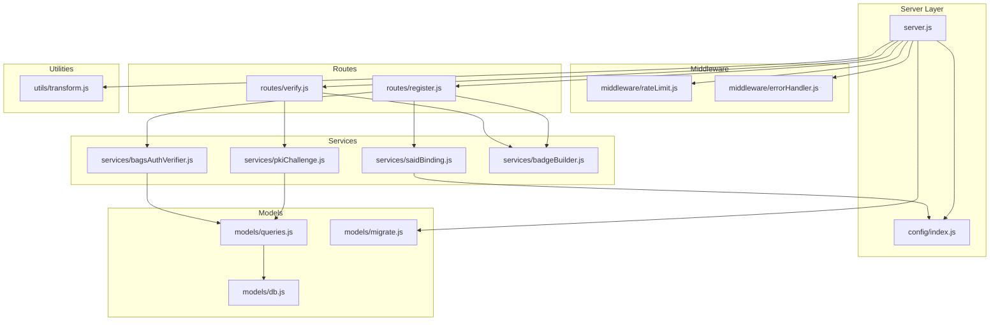
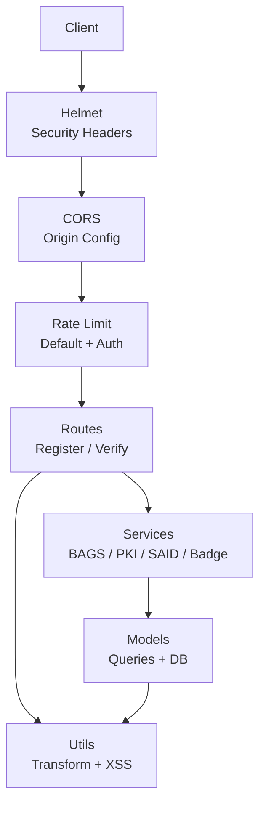
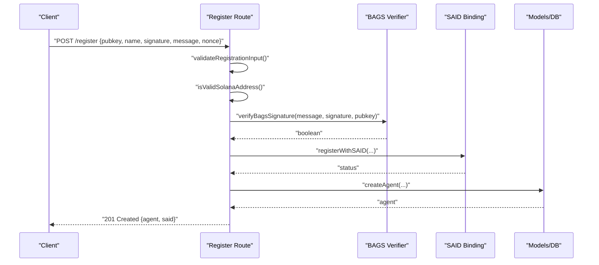
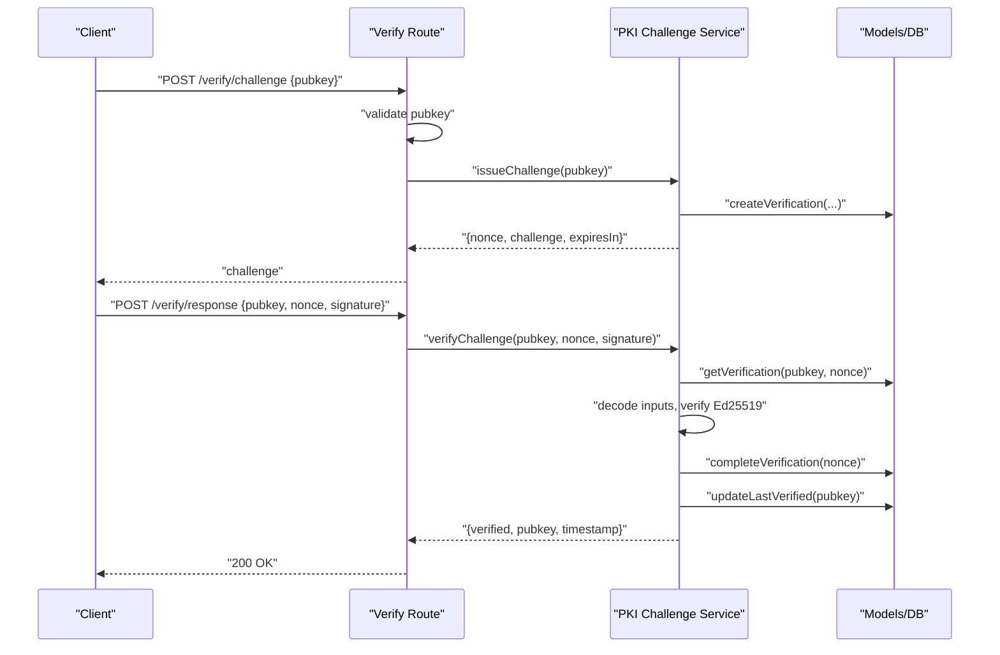
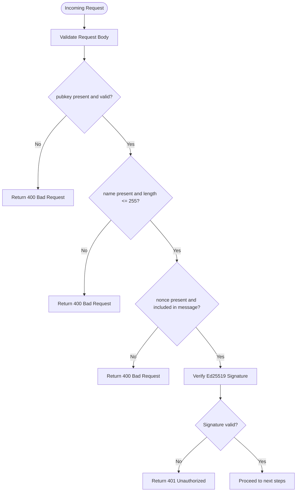
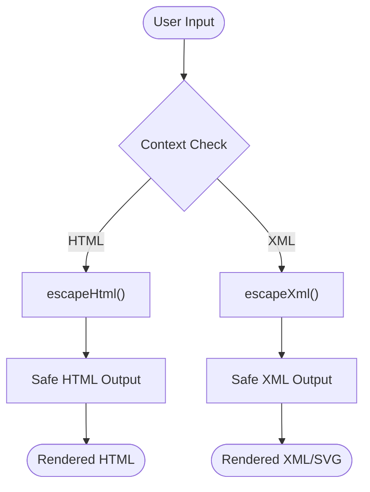
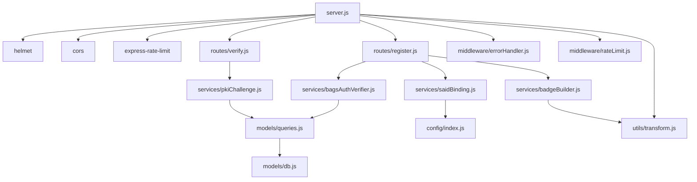

# Security Architecture

<cite>
**Referenced Files in This Document**
- [server.js](file://backend/server.js)
- [config/index.js](file://backend/src/config/index.js)
- [middleware/rateLimit.js](file://backend/src/middleware/rateLimit.js)
- [middleware/errorHandler.js](file://backend/src/middleware/errorHandler.js)
- [services/bagsAuthVerifier.js](file://backend/src/services/bagsAuthVerifier.js)
- [services/pkiChallenge.js](file://backend/src/services/pkiChallenge.js)
- [services/saidBinding.js](file://backend/src/services/saidBinding.js)
- [services/badgeBuilder.js](file://backend/src/services/badgeBuilder.js)
- [routes/register.js](file://backend/src/routes/register.js)
- [routes/verify.js](file://backend/src/routes/verify.js)
- [utils/transform.js](file://backend/src/utils/transform.js)
- [models/db.js](file://backend/src/models/db.js)
- [models/queries.js](file://backend/src/models/queries.js)
- [models/migrate.js](file://backend/src/models/migrate.js)
- [package.json](file://backend/package.json)
</cite>

## Update Summary
**Changes Made**
- Updated Protection Against Common Vulnerabilities section to reflect consolidation of escapeXml function into transform.js utility module
- Added new section documenting XML escaping functionality alongside HTML escaping in transform utilities
- Updated security controls documentation to include XML escaping for SVG badge generation
- Enhanced XSS prevention coverage to include both HTML and XML contexts

## Table of Contents
1. [Introduction](#introduction)
2. [Project Structure](#project-structure)
3. [Core Components](#core-components)
4. [Architecture Overview](#architecture-overview)
5. [Detailed Component Analysis](#detailed-component-analysis)
6. [Dependency Analysis](#dependency-analysis)
7. [Performance Considerations](#performance-considerations)
8. [Troubleshooting Guide](#troubleshooting-guide)
9. [Conclusion](#conclusion)
10. [Appendices](#appendices)

## Introduction
This document presents the security architecture of AgentID, focusing on the multi-layered protections that safeguard the system and user data. It covers the authentication model (Ed25519 signature verification, PKI challenge-response, and wallet ownership verification via external APIs), authorization patterns, input validation, protections against common vulnerabilities, rate limiting, error handling, sensitive data handling, middleware stack, CORS configuration, and HTTPS enforcement. It also includes threat modeling, audit considerations, compliance orientation, secure communication patterns, token management, and incident response procedures.

## Project Structure
AgentID's backend is organized around a layered architecture:
- Entry point initializes environment validation, middleware, routes, and health checks.
- Configuration centralizes environment-driven settings.
- Middleware enforces rate limits and global error handling.
- Services encapsulate cryptographic verification, challenge issuance, and external API integrations.
- Routes define endpoint-level validation and authorization controls.
- Models handle database access with parameterized queries and migrations.
- Utilities provide data transformation and XSS prevention helpers.

**Diagram sources**
- [server.js:1-91](file://backend/server.js#L1-L91)
- [config/index.js:1-31](file://backend/src/config/index.js#L1-L31)
- [middleware/rateLimit.js:1-62](file://backend/src/middleware/rateLimit.js#L1-L62)
- [middleware/errorHandler.js:1-44](file://backend/src/middleware/errorHandler.js#L1-L44)
- [routes/register.js:1-162](file://backend/src/routes/register.js#L1-L162)
- [routes/verify.js:1-121](file://backend/src/routes/verify.js#L1-L121)
- [services/bagsAuthVerifier.js:1-93](file://backend/src/services/bagsAuthVerifier.js#L1-L93)
- [services/pkiChallenge.js:1-102](file://backend/src/services/pkiChallenge.js#L1-L102)
- [services/saidBinding.js:1-119](file://backend/src/services/saidBinding.js#L1-L119)
- [services/badgeBuilder.js:1-551](file://backend/src/services/badgeBuilder.js#L1-L551)
- [models/db.js:1-45](file://backend/src/models/db.js#L1-L45)
- [models/queries.js:1-404](file://backend/src/models/queries.js#L1-L404)
- [models/migrate.js:1-100](file://backend/src/models/migrate.js#L1-L100)
- [utils/transform.js:1-119](file://backend/src/utils/transform.js#L1-L119)

**Section sources**
- [server.js:1-91](file://backend/server.js#L1-L91)
- [config/index.js:1-31](file://backend/src/config/index.js#L1-L31)

## Core Components
- Authentication model:
  - Ed25519 signature verification for wallet ownership using external APIs.
  - PKI challenge-response to continuously verify agent identity.
- Authorization patterns:
  - Endpoint-level rate limiting and strict auth limiter for sensitive flows.
  - Input validation and address format checks.
- Data protection:
  - Parameterized queries to prevent SQL injection.
  - XSS prevention via HTML and XML escaping utilities.
- Secure transport and headers:
  - Helmet middleware for standard security headers.
  - CORS configured via environment variable.
- Error handling:
  - Centralized error handler logging and controlled responses.

**Section sources**
- [services/bagsAuthVerifier.js:1-93](file://backend/src/services/bagsAuthVerifier.js#L1-L93)
- [services/pkiChallenge.js:1-102](file://backend/src/services/pkiChallenge.js#L1-L102)
- [routes/register.js:1-162](file://backend/src/routes/register.js#L1-L162)
- [routes/verify.js:1-121](file://backend/src/routes/verify.js#L1-L121)
- [middleware/rateLimit.js:1-62](file://backend/src/middleware/rateLimit.js#L1-L62)
- [middleware/errorHandler.js:1-44](file://backend/src/middleware/errorHandler.js#L1-L44)
- [utils/transform.js:67-95](file://backend/src/utils/transform.js#L67-L95)
- [models/queries.js:1-404](file://backend/src/models/queries.js#L1-L404)
- [server.js:31-38](file://backend/server.js#L31-L38)

## Architecture Overview
AgentID employs a layered security model:
- Transport and network: Helmet hardens HTTP headers; CORS is environment-configured; rate limiting protects endpoints; health checks expose minimal surface.
- Authentication: Wallet ownership verified via Ed25519 signatures against external services; ongoing verification via challenge-response.
- Authorization: Strict auth limiter for registration and verification endpoints; input validation prevents malformed requests.
- Data protection: Parameterized queries; XSS escaping for both HTML and XML contexts; secrets via environment variables.
- Observability: Centralized error logging and controlled error responses.

**Diagram sources**
- [server.js:31-38](file://backend/server.js#L31-L38)
- [middleware/rateLimit.js:23-42](file://backend/src/middleware/rateLimit.js#L23-L42)
- [routes/register.js:59-159](file://backend/src/routes/register.js#L59-L159)
- [routes/verify.js:18-118](file://backend/src/routes/verify.js#L18-L118)
- [services/bagsAuthVerifier.js:18-86](file://backend/src/services/bagsAuthVerifier.js#L18-L86)
- [services/pkiChallenge.js:17-96](file://backend/src/services/pkiChallenge.js#L17-L96)
- [services/saidBinding.js:21-54](file://backend/src/services/saidBinding.js#L21-L54)
- [services/badgeBuilder.js:10-10](file://backend/src/services/badgeBuilder.js#L10-L10)
- [models/queries.js:17-394](file://backend/src/models/queries.js#L17-L394)
- [utils/transform.js:67-95](file://backend/src/utils/transform.js#L67-L95)

## Detailed Component Analysis

### Authentication Security Model
AgentID combines two complementary mechanisms:
- Wallet ownership verification via Ed25519 signatures against external services.
- Ongoing identity verification via a PKI challenge-response protocol.

**Diagram sources**
- [routes/register.js:59-159](file://backend/src/routes/register.js#L59-L159)
- [services/bagsAuthVerifier.js:44-57](file://backend/src/services/bagsAuthVerifier.js#L44-L57)
- [services/saidBinding.js:21-54](file://backend/src/services/saidBinding.js#L21-L54)
- [models/queries.js:17-29](file://backend/src/models/queries.js#L17-L29)
- [utils/transform.js:87-93](file://backend/src/utils/transform.js#L87-L93)

Key security controls:
- Nonce inclusion check ensures messages cannot be replayed.
- Ed25519 signature verification using deterministic base58 decoding and library primitives.
- SAID registration is attempted but non-blocking; failures are logged and surfaced conservatively.

**Section sources**
- [routes/register.js:16-53](file://backend/src/routes/register.js#L16-L53)
- [routes/register.js:88-101](file://backend/src/routes/register.js#L88-L101)
- [services/bagsAuthVerifier.js:18-57](file://backend/src/services/bagsAuthVerifier.js#L18-L57)
- [services/saidBinding.js:21-54](file://backend/src/services/saidBinding.js#L21-L54)
- [utils/transform.js:87-93](file://backend/src/utils/transform.js#L87-L93)

### PKI Challenge-Response System
The PKI challenge-response system prevents spoofing by requiring a valid Ed25519 signature bound to a unique nonce and timestamp.

**Diagram sources**
- [routes/verify.js:18-51](file://backend/src/routes/verify.js#L18-L51)
- [routes/verify.js:57-118](file://backend/src/routes/verify.js#L57-L118)
- [services/pkiChallenge.js:17-96](file://backend/src/services/pkiChallenge.js#L17-L96)
- [models/queries.js:213-256](file://backend/src/models/queries.js#L213-L256)

Security controls:
- Challenges are stored with expiration and uniqueness guarantees.
- Signature verification uses Ed25519 with strict input decoding.
- After successful verification, records are marked complete and last verified timestamps are updated.

**Section sources**
- [services/pkiChallenge.js:17-96](file://backend/src/services/pkiChallenge.js#L17-L96)
- [models/queries.js:213-256](file://backend/src/models/queries.js#L213-L256)
- [routes/verify.js:18-118](file://backend/src/routes/verify.js#L18-L118)

### Authorization Patterns and Input Validation
- Strict auth limiter applied to registration and verification endpoints.
- Input validation enforces presence, type, length, and format constraints.
- Solana address validation ensures base58-encoded public keys of expected length.

**Diagram sources**
- [routes/register.js:20-53](file://backend/src/routes/register.js#L20-L53)
- [routes/register.js:88-101](file://backend/src/routes/register.js#L88-L101)
- [utils/transform.js:87-93](file://backend/src/utils/transform.js#L87-L93)

**Section sources**
- [middleware/rateLimit.js:50-55](file://backend/src/middleware/rateLimit.js#L50-L55)
- [routes/register.js:16-53](file://backend/src/routes/register.js#L16-L53)
- [routes/register.js:88-101](file://backend/src/routes/register.js#L88-L101)
- [utils/transform.js:87-93](file://backend/src/utils/transform.js#L87-L93)

### Protection Against Common Vulnerabilities
- SQL injection: All database queries are parameterized; dynamic field updates sanitize column names and values.
- XSS: HTML and XML escaping utilities escape special characters in text inputs across different contexts.
- CSRF: Not applicable for stateless API; mitigate by enforcing HTTPS and using short-lived tokens if JWT were introduced.
- Insecure deserialization: No deserialization of untrusted data; cryptography uses well-established libraries.

**Updated** Consolidated XML escaping functionality into transform.js utility module alongside HTML escaping for comprehensive XSS protection.

**Diagram sources**
- [utils/transform.js:67-95](file://backend/src/utils/transform.js#L67-L95)
- [services/badgeBuilder.js:182-183](file://backend/src/services/badgeBuilder.js#L182-L183)

**Section sources**
- [models/queries.js:17-73](file://backend/src/models/queries.js#L17-L73)
- [utils/transform.js:67-95](file://backend/src/utils/transform.js#L67-L95)
- [services/badgeBuilder.js:10-10](file://backend/src/services/badgeBuilder.js#L10-L10)

### Rate Limiting Implementation
- Default limiter: 100 requests per 15 minutes per IP.
- Auth limiter: 20 requests per 15 minutes for registration and verification endpoints.
- Standard headers enabled; custom handler logs and returns structured error payloads.

**Section sources**
- [middleware/rateLimit.js:8-42](file://backend/src/middleware/rateLimit.js#L8-L42)
- [routes/register.js:59](file://backend/src/routes/register.js#L59)
- [routes/verify.js:18](file://backend/src/routes/verify.js#L18)

### Error Handling Security Measures
- Centralized error handler logs error metadata (message, stack, path, method, timestamp).
- Controlled JSON responses; stack traces included only in development.
- 404 handling for undefined routes; global error handler last middleware.

**Section sources**
- [middleware/errorHandler.js:15-41](file://backend/src/middleware/errorHandler.js#L15-L41)
- [server.js:65-74](file://backend/server.js#L65-L74)

### Sensitive Data Protection
- Secrets: DATABASE_URL, BAGS_API_KEY, SAID_GATEWAY_URL, AGENTID_BASE_URL, REDIS_URL, CORS_ORIGIN, BADGE_CACHE_TTL, CHALLENGE_EXPIRY_SECONDS.
- Logging: Errors logged with sanitized context; sensitive fields excluded.
- External secrets: API keys passed via headers to external services; avoid embedding in client-side code.

**Section sources**
- [config/index.js:6-28](file://backend/src/config/index.js#L6-L28)
- [services/bagsAuthVerifier.js:22-28](file://backend/src/services/bagsAuthVerifier.js#L22-L28)
- [services/saidBinding.js:38-47](file://backend/src/services/saidBinding.js#L38-L47)
- [middleware/errorHandler.js:16-23](file://backend/src/middleware/errorHandler.js#L16-L23)

### Security Middleware Stack, CORS, and HTTPS Enforcement
- Helmet: Adds security headers including X-Content-Type-Options.
- CORS: Origin configured via environment variable; credentials supported.
- HTTPS: Enforced by deployment; server listens on configured port; no explicit TLS termination in code.

**Section sources**
- [server.js:31-38](file://backend/server.js#L31-L38)
- [config/index.js:22-23](file://backend/src/config/index.js#L22-L23)

### Secure Communication Patterns and Token Management
- External API calls: Use HTTPS endpoints and API keys via headers.
- Token management: No JWT tokens are used in current implementation; authentication relies on Ed25519 signatures and challenge-response.
- Recommendations: If tokens are introduced, enforce short TTLs, secure HttpOnly cookies, and SameSite policies.

**Section sources**
- [services/bagsAuthVerifier.js:22-28](file://backend/src/services/bagsAuthVerifier.js#L22-L28)
- [services/saidBinding.js:38-47](file://backend/src/services/saidBinding.js#L38-L47)

## Dependency Analysis

**Diagram sources**
- [server.js:12-28](file://backend/server.js#L12-L28)
- [routes/register.js:7-11](file://backend/src/routes/register.js#L7-L11)
- [routes/verify.js:7-10](file://backend/src/routes/verify.js#L7-L10)
- [services/bagsAuthVerifier.js:6-9](file://backend/src/services/bagsAuthVerifier.js#L6-L9)
- [services/pkiChallenge.js:9](file://backend/src/services/pkiChallenge.js#L9)
- [services/saidBinding.js:6-7](file://backend/src/services/saidBinding.js#L6-L7)
- [services/badgeBuilder.js:6-10](file://backend/src/services/badgeBuilder.js#L6-L10)
- [models/queries.js:6](file://backend/src/models/queries.js#L6)
- [models/db.js](file://backend/src/models/db.js)
- [middleware/errorHandler.js](file://backend/src/middleware/errorHandler.js)
- [middleware/rateLimit.js](file://backend/src/middleware/rateLimit.js)
- [utils/transform.js](file://backend/src/utils/transform.js)
- [config/index.js](file://backend/src/config/index.js)

**Section sources**
- [package.json:20-31](file://backend/package.json#L20-L31)
- [server.js:12-28](file://backend/server.js#L12-L28)

## Performance Considerations
- Database connections: Connection pooling with optional SSL for production.
- Indexes: Strategic indexes on frequently filtered columns improve query performance.
- Caching: Badge cache TTL configurable via environment; consider Redis for session/token caching.
- Rate limiting: Tune windows and max values based on traffic patterns.

**Section sources**
- [models/db.js:10-18](file://backend/src/models/db.js#L10-L18)
- [models/migrate.js:58-64](file://backend/src/models/migrate.js#L58-L64)
- [config/index.js:26-27](file://backend/src/config/index.js#L26-L27)
- [middleware/rateLimit.js:8-13](file://backend/src/middleware/rateLimit.js#L8-L13)

## Troubleshooting Guide
Common issues and mitigations:
- Authentication failures:
  - Verify nonce inclusion in message.
  - Confirm Ed25519 signature validity and base58 decoding.
  - Check BAGS API key and SAID gateway availability.
- Verification failures:
  - Ensure challenge not expired and nonce matches issued challenge.
  - Confirm signature uses the correct challenge string and public key.
- Database errors:
  - Review parameterized query usage and connection pool configuration.
- Rate limiting:
  - Adjust auth limiter thresholds for legitimate spikes.
- CORS errors:
  - Verify origin matches configured CORS origin.
- XSS protection failures:
  - Verify escapeHtml and escapeXml functions are properly imported and used in appropriate contexts.

**Section sources**
- [routes/register.js:88-101](file://backend/src/routes/register.js#L88-L101)
- [routes/verify.js:93-113](file://backend/src/routes/verify.js#L93-L113)
- [services/bagsAuthVerifier.js:65-86](file://backend/src/services/bagsAuthVerifier.js#L65-L86)
- [services/pkiChallenge.js:49-96](file://backend/src/services/pkiChallenge.js#L49-L96)
- [models/db.js:20-23](file://backend/src/models/db.js#L20-L23)
- [middleware/rateLimit.js:50-55](file://backend/src/middleware/rateLimit.js#L50-L55)
- [config/index.js:22-23](file://backend/src/config/index.js#L22-L23)

## Conclusion
AgentID's security architecture integrates cryptographic verification, robust input validation, strict rate limiting, and defensive programming practices. The Ed25519-based authentication and PKI challenge-response provide strong assurance of wallet ownership and continuous identity verification. Parameterized queries, consolidated XSS escaping utilities (both HTML and XML), and centralized error handling further reduce risk. The consolidation of escapeXml functionality into the transform.js utility module provides comprehensive protection against cross-context injection attacks in both HTML and XML outputs, particularly important for SVG badge generation. Deployment should enforce HTTPS, rotate secrets regularly, and monitor logs for anomalies.

## Appendices

### Threat Modeling
- Adversaries may attempt:
  - Replay attacks: Mitigated by nonce inclusion and challenge-response.
  - Signature forgery: Mitigated by Ed25519 verification and external API checks.
  - Brute force registration/verification: Mitigated by strict auth rate limits.
  - Injection attacks: Mitigated by parameterized queries and input validation.
  - Cross-site scripting: Mitigated by HTML and XML escaping utilities in transform.js.
- Assumptions:
  - External APIs (BAGS, SAID) remain available and responsive.
  - Secrets are managed securely and rotated periodically.

### Security Audit Considerations
- Review environment variables and secret storage.
- Validate cryptographic libraries and their versions.
- Audit database schema and indexes for performance and security.
- Test rate limiting under realistic loads.
- Conduct penetration testing against exposed endpoints.
- Verify XSS protection coverage across all output contexts (HTML, XML, SVG).

### Compliance Orientation
- Data minimization: Only collect necessary fields.
- Logging hygiene: Avoid logging sensitive data; sanitize error logs.
- Access control: Enforce rate limits and input validation at all layers.
- Transport security: Enforce HTTPS in production deployments.

### Incident Response Procedures
- Immediate actions:
  - Scale rate limits for affected endpoints.
  - Rotate compromised secrets.
  - Monitor error logs and alert on anomalies.
- Forensic analysis:
  - Correlate request IDs with logs.
  - Inspect challenge/response records for tampering.
  - Review XSS protection effectiveness across all output contexts.
- Recovery:
  - Restore from backups after remediation.
  - Re-enable normal rate limits gradually.