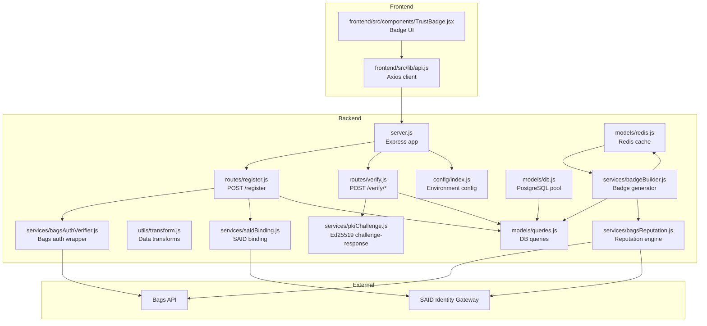
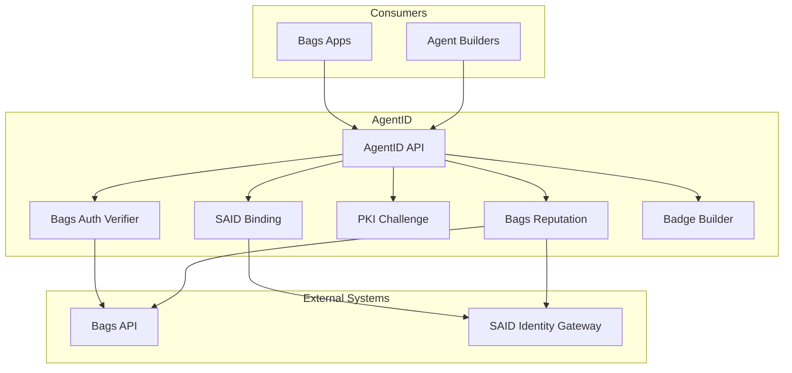
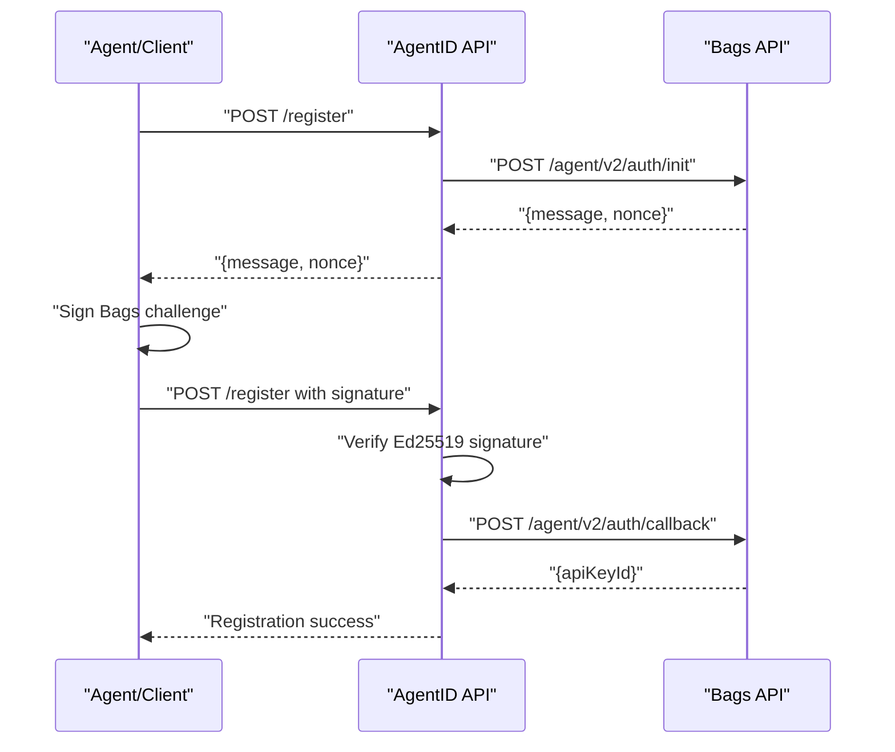
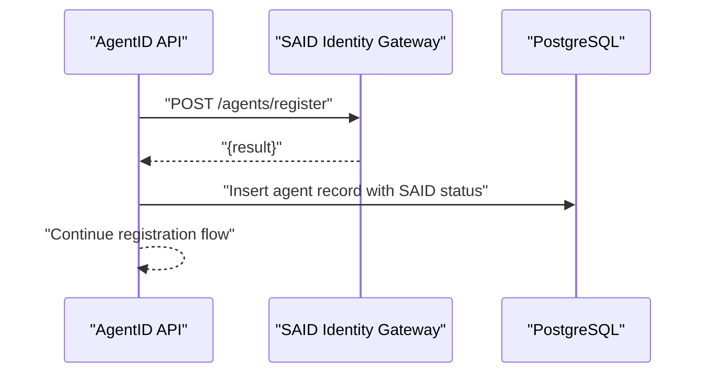
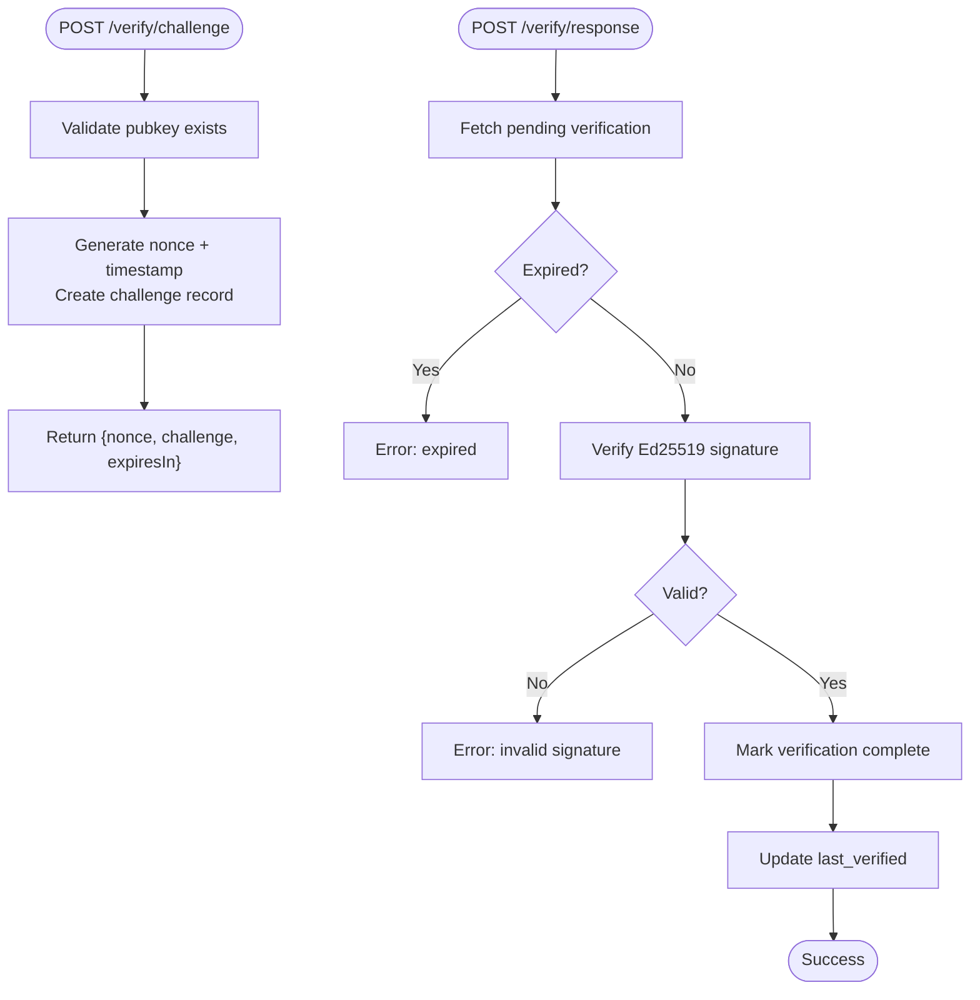
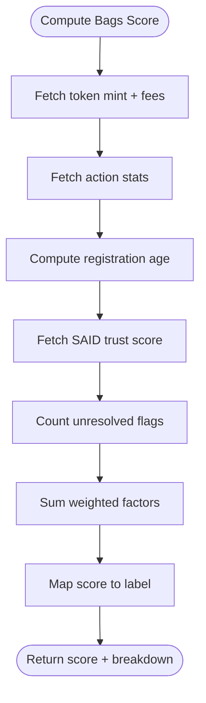
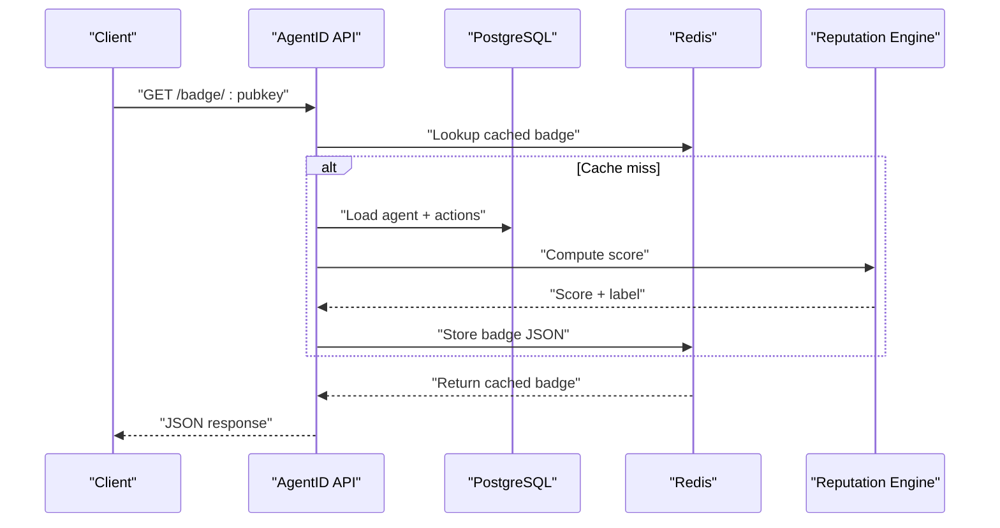
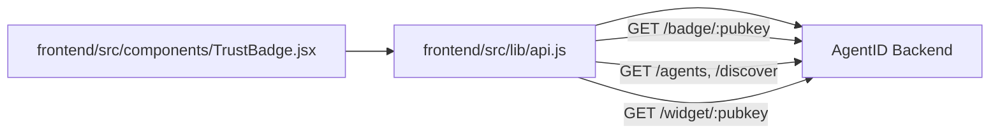
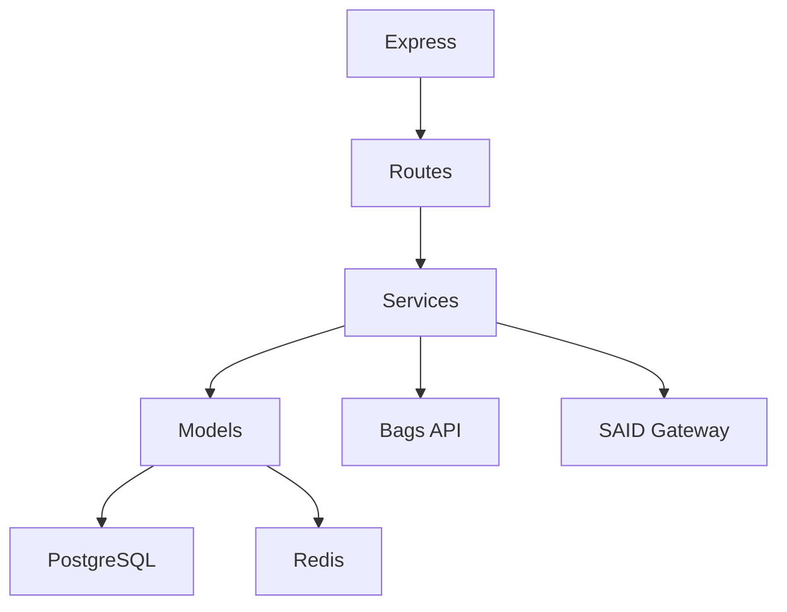

# System Overview

<cite>
**Referenced Files in This Document**
- [server.js](file://backend/server.js)
- [config/index.js](file://backend/src/config/index.js)
- [register.js](file://backend/src/routes/register.js)
- [verify.js](file://backend/src/routes/verify.js)
- [bagAuthVerifier.js](file://backend/src/services/bagsAuthVerifier.js)
- [saidBinding.js](file://backend/src/services/saidBinding.js)
- [pkiChallenge.js](file://backend/src/services/pkiChallenge.js)
- [bagsReputation.js](file://backend/src/services/bagsReputation.js)
- [badgeBuilder.js](file://backend/src/services/badgeBuilder.js)
- [db.js](file://backend/src/models/db.js)
- [queries.js](file://backend/src/models/queries.js)
- [redis.js](file://backend/src/models/redis.js)
- [transform.js](file://backend/src/utils/transform.js)
- [api.js](file://frontend/src/lib/api.js)
- [TrustBadge.jsx](file://frontend/src/components/TrustBadge.jsx)
- [agentid_build_plan.md](file://agentid_build_plan.md)
</cite>

## Table of Contents
1. [Introduction](#introduction)
2. [Project Structure](#project-structure)
3. [Core Components](#core-components)
4. [Architecture Overview](#architecture-overview)
5. [Detailed Component Analysis](#detailed-component-analysis)
6. [Dependency Analysis](#dependency-analysis)
7. [Performance Considerations](#performance-considerations)
8. [Troubleshooting Guide](#troubleshooting-guide)
9. [Conclusion](#conclusion)

## Introduction
AgentID is the trust verification layer for AI agents in the Bags ecosystem. It augments Bags’ Ed25519 agent authentication with a robust identity lifecycle that:
- Wraps Bags authentication to verify wallet ownership
- Binds agent identities to the Solana Agent Registry (SAID Protocol) with Bags-specific metadata
- Adds Bags-specific reputation scoring derived from on-chain analytics
- Surfaces a human-readable trust badge for UI embedding and discovery

AgentID’s modular design separates concerns into authentication, identity management, reputation scoring, and trust badge generation, enabling clear extensibility and composability within the broader AI agent ecosystem.

## Project Structure
The system is organized into a backend API (Node.js/Express) and a frontend React application. The backend exposes REST endpoints, integrates with external services (Bags API and SAID Gateway), and manages persistence and caching. The frontend provides a registry UI and embeddable widgets.

**Diagram sources**
- [server.js:1-85](file://backend/server.js#L1-L85)
- [config/index.js:1-31](file://backend/src/config/index.js#L1-L31)
- [register.js:1-156](file://backend/src/routes/register.js#L1-L156)
- [verify.js:1-115](file://backend/src/routes/verify.js#L1-L115)
- [bagsAuthVerifier.js:1-93](file://backend/src/services/bagsAuthVerifier.js#L1-L93)
- [saidBinding.js:1-119](file://backend/src/services/saidBinding.js#L1-L119)
- [pkiChallenge.js:1-102](file://backend/src/services/pkiChallenge.js#L1-L102)
- [bagsReputation.js:1-146](file://backend/src/services/bagsReputation.js#L1-L146)
- [badgeBuilder.js:1-516](file://backend/src/services/badgeBuilder.js#L1-L516)
- [db.js:1-45](file://backend/src/models/db.js#L1-L45)
- [queries.js:1-404](file://backend/src/models/queries.js#L1-L404)
- [redis.js:1-94](file://backend/src/models/redis.js#L1-L94)
- [transform.js:1-89](file://backend/src/utils/transform.js#L1-L89)
- [api.js:1-140](file://frontend/src/lib/api.js#L1-L140)
- [TrustBadge.jsx:1-145](file://frontend/src/components/TrustBadge.jsx#L1-L145)

**Section sources**
- [server.js:1-85](file://backend/server.js#L1-L85)
- [agentid_build_plan.md:1-330](file://agentid_build_plan.md#L1-L330)

## Core Components
AgentID’s core components are implemented as cohesive services with clear responsibilities:

- Authentication wrapper: Validates Bags Ed25519 challenge-response and extracts API key identifiers.
- SAID binding: Registers or retrieves agent records in the SAID Identity Gateway and pulls trust labels.
- PKI challenge-response: Issues time-bound challenges and validates Ed25519 signatures to prevent spoofing.
- Reputation engine: Computes a composite Bags ecosystem trust score using multiple factors.
- Badge builder: Produces JSON, SVG, and HTML widget outputs with caching and sanitization.
- Data persistence and caching: PostgreSQL for durable state and Redis for ephemeral caches and short-lived challenges.

These components are wired through Express routes and validated by middleware for security and rate limiting.

**Section sources**
- [bagsAuthVerifier.js:1-93](file://backend/src/services/bagsAuthVerifier.js#L1-L93)
- [saidBinding.js:1-119](file://backend/src/services/saidBinding.js#L1-L119)
- [pkiChallenge.js:1-102](file://backend/src/services/pkiChallenge.js#L1-L102)
- [bagsReputation.js:1-146](file://backend/src/services/bagsReputation.js#L1-L146)
- [badgeBuilder.js:1-516](file://backend/src/services/badgeBuilder.js#L1-L516)
- [db.js:1-45](file://backend/src/models/db.js#L1-L45)
- [redis.js:1-94](file://backend/src/models/redis.js#L1-L94)

## Architecture Overview
AgentID sits between Bags agents and the applications/users interacting with them. It enforces identity binding to SAID, augments trust with Bags analytics, and exposes trust signals through badges and discovery.

**Diagram sources**
- [agentid_build_plan.md:1-330](file://agentid_build_plan.md#L1-L330)
- [bagsAuthVerifier.js:1-93](file://backend/src/services/bagsAuthVerifier.js#L1-L93)
- [saidBinding.js:1-119](file://backend/src/services/saidBinding.js#L1-L119)
- [bagsReputation.js:1-146](file://backend/src/services/bagsReputation.js#L1-L146)
- [badgeBuilder.js:1-516](file://backend/src/services/badgeBuilder.js#L1-L516)

## Detailed Component Analysis

### Authentication Wrapper (Bags Auth)
The authentication wrapper integrates with Bags’ Ed25519 challenge-response to verify wallet ownership. It validates signatures locally and coordinates with Bags to obtain API key identifiers.

**Diagram sources**
- [register.js:59-153](file://backend/src/routes/register.js#L59-L153)
- [bagsAuthVerifier.js:18-86](file://backend/src/services/bagsAuthVerifier.js#L18-L86)

**Section sources**
- [register.js:59-153](file://backend/src/routes/register.js#L59-L153)
- [bagsAuthVerifier.js:18-86](file://backend/src/services/bagsAuthVerifier.js#L18-L86)

### SAID Binding
After verifying ownership, AgentID binds the agent to the SAID registry and stores the result. This enables discovery and trust attribution from SAID while adding Bags-specific metadata.

**Diagram sources**
- [register.js:106-131](file://backend/src/routes/register.js#L106-L131)
- [saidBinding.js:21-54](file://backend/src/services/saidBinding.js#L21-L54)
- [queries.js:17-29](file://backend/src/models/queries.js#L17-L29)

**Section sources**
- [register.js:106-131](file://backend/src/routes/register.js#L106-L131)
- [saidBinding.js:21-54](file://backend/src/services/saidBinding.js#L21-L54)
- [queries.js:17-29](file://backend/src/models/queries.js#L17-L29)

### PKI Challenge-Response
Ongoing verification uses time-bound Ed25519 challenges scoped to AgentID. Challenges are stored with expiration and marked complete after successful verification.

**Diagram sources**
- [verify.js:20-112](file://backend/src/routes/verify.js#L20-L112)
- [pkiChallenge.js:17-96](file://backend/src/services/pkiChallenge.js#L17-L96)
- [queries.js:213-256](file://backend/src/models/queries.js#L213-L256)

**Section sources**
- [verify.js:20-112](file://backend/src/routes/verify.js#L20-L112)
- [pkiChallenge.js:17-96](file://backend/src/services/pkiChallenge.js#L17-L96)
- [queries.js:213-256](file://backend/src/models/queries.js#L213-L256)

### Reputation Scoring
AgentID computes a composite trust score using:
- Fee activity (from Bags analytics)
- Success rate from internal action counters
- Registration age
- SAID trust score
- Community verification (flag counts)

**Diagram sources**
- [bagsReputation.js:16-122](file://backend/src/services/bagsReputation.js#L16-L122)
- [queries.js:187-202](file://backend/src/models/queries.js#L187-L202)
- [saidBinding.js:61-87](file://backend/src/services/saidBinding.js#L61-L87)

**Section sources**
- [bagsReputation.js:16-122](file://backend/src/services/bagsReputation.js#L16-L122)
- [queries.js:187-202](file://backend/src/models/queries.js#L187-L202)
- [saidBinding.js:61-87](file://backend/src/services/saidBinding.js#L61-L87)

### Trust Badge Generation
The badge builder aggregates agent data, reputation, and action metrics, then generates:
- JSON for programmatic consumption
- SVG for static documentation
- HTML widget for embeddable UI

**Diagram sources**
- [badgeBuilder.js:17-83](file://backend/src/services/badgeBuilder.js#L17-L83)
- [redis.js:41-71](file://backend/src/models/redis.js#L41-L71)
- [bagsReputation.js:129-140](file://backend/src/services/bagsReputation.js#L129-L140)
- [queries.js:36-39](file://backend/src/models/queries.js#L36-L39)

**Section sources**
- [badgeBuilder.js:17-83](file://backend/src/services/badgeBuilder.js#L17-L83)
- [redis.js:41-71](file://backend/src/models/redis.js#L41-L71)
- [bagsReputation.js:129-140](file://backend/src/services/bagsReputation.js#L129-L140)
- [queries.js:36-39](file://backend/src/models/queries.js#L36-L39)

### Frontend Integration
The frontend consumes the AgentID API to render badges, explore agents, and embed widgets. It also provides a registry interface for browsing and discovering agents.

**Diagram sources**
- [api.js:1-140](file://frontend/src/lib/api.js#L1-L140)
- [TrustBadge.jsx:1-145](file://frontend/src/components/TrustBadge.jsx#L1-L145)
- [server.js:55-62](file://backend/server.js#L55-L62)

**Section sources**
- [api.js:1-140](file://frontend/src/lib/api.js#L1-L140)
- [TrustBadge.jsx:1-145](file://frontend/src/components/TrustBadge.jsx#L1-L145)
- [server.js:55-62](file://backend/server.js#L55-L62)

## Dependency Analysis
AgentID’s backend depends on:
- Express for routing and middleware
- PostgreSQL for durable state
- Redis for caching and ephemeral challenge storage
- External APIs for authentication, reputation, and discovery

**Diagram sources**
- [server.js:12-27](file://backend/server.js#L12-L27)
- [db.js:10-18](file://backend/src/models/db.js#L10-L18)
- [redis.js:10-20](file://backend/src/models/redis.js#L10-L20)
- [bagsAuthVerifier.js:6-9](file://backend/src/services/bagsAuthVerifier.js#L6-L9)
- [saidBinding.js:6-7](file://backend/src/services/saidBinding.js#L6-L7)

**Section sources**
- [server.js:12-27](file://backend/server.js#L12-L27)
- [db.js:10-18](file://backend/src/models/db.js#L10-L18)
- [redis.js:10-20](file://backend/src/models/redis.js#L10-L20)
- [bagsAuthVerifier.js:6-9](file://backend/src/services/bagsAuthVerifier.js#L6-L9)
- [saidBinding.js:6-7](file://backend/src/services/saidBinding.js#L6-L7)

## Performance Considerations
- Caching: Badge JSON is cached with configurable TTL to reduce repeated computation and external API calls.
- Rate limiting: Authentication-related endpoints apply rate limits to mitigate abuse.
- Asynchronous SAID binding: SAID registration does not block primary registration flow; failures are logged and registration proceeds.
- Database indexing: Queries leverage JSONB operators for capability filtering and ordering by score for discovery.
- Redis resilience: Retry strategy and offline queue improve reliability for cache operations.

[No sources needed since this section provides general guidance]

## Troubleshooting Guide
Common issues and resolutions:
- Registration fails due to invalid signature: Ensure the message includes the nonce and the Ed25519 signature matches the public key.
- SAID registration unavailable: The system logs warnings and continues; retry or check SAID gateway availability.
- Challenge expired or invalid: Verify the nonce and timestamp windows; ensure clients re-issue challenges as needed.
- Reputation API failures: The reputation engine gracefully falls back to zero scores when external analytics are unavailable.
- Cache errors: Redis errors are handled without crashing; verify Redis connectivity and configuration.

**Section sources**
- [register.js:82-95](file://backend/src/routes/register.js#L82-L95)
- [register.js:126-130](file://backend/src/routes/register.js#L126-L130)
- [verify.js:85-107](file://backend/src/routes/verify.js#L85-L107)
- [bagsReputation.js:35-38](file://backend/src/services/bagsReputation.js#L35-L38)
- [redis.js:27-30](file://backend/src/models/redis.js#L27-L30)

## Conclusion
AgentID delivers a composable trust layer for Bags agents by wrapping Ed25519 authentication, binding identities to SAID, and computing Bags-specific reputation. Its modular architecture cleanly separates concerns, supports scalable caching, and provides rich trust signals through badges and discovery. This foundation enables trust verification across the AI agent ecosystem, with immediate value for developers seeking to display verified badges and for users seeking reliable agent interactions.