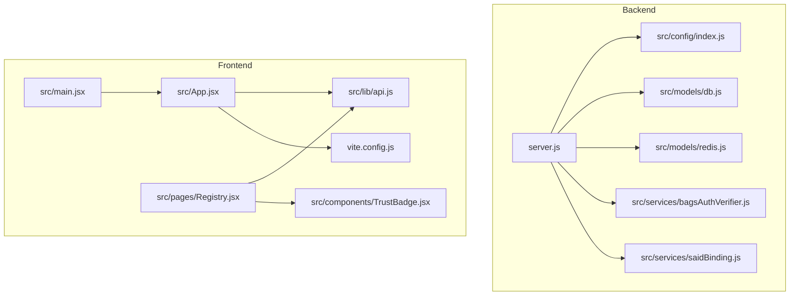
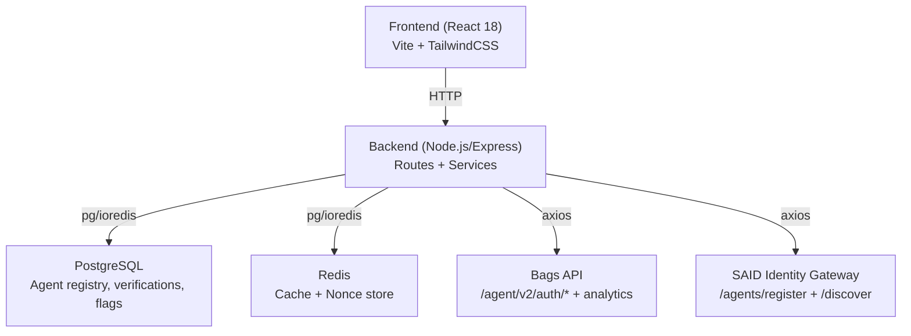
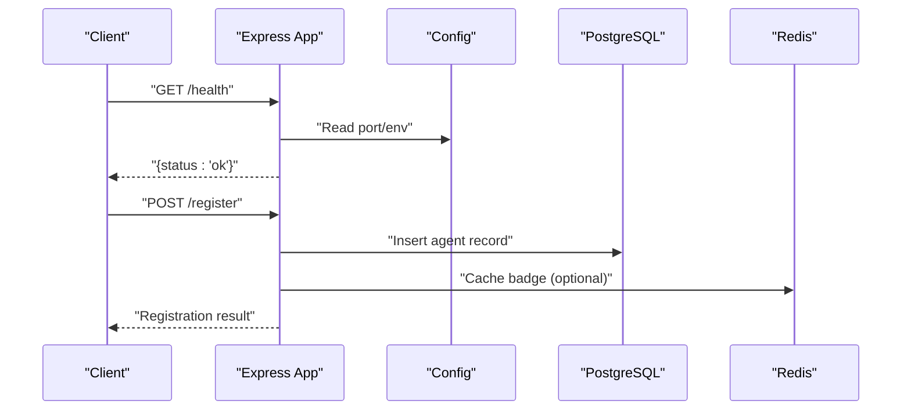
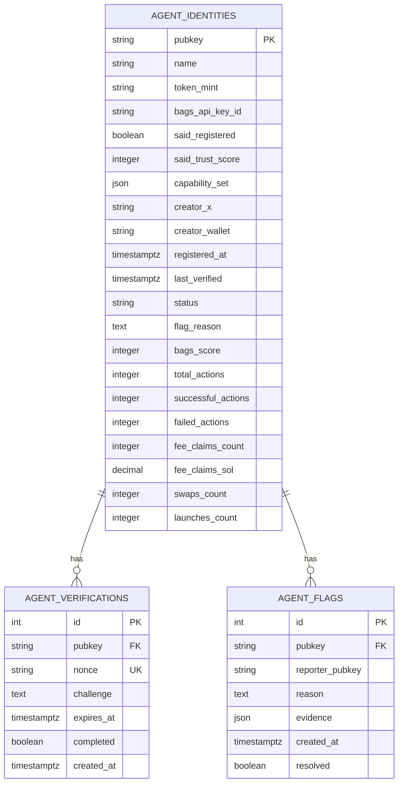
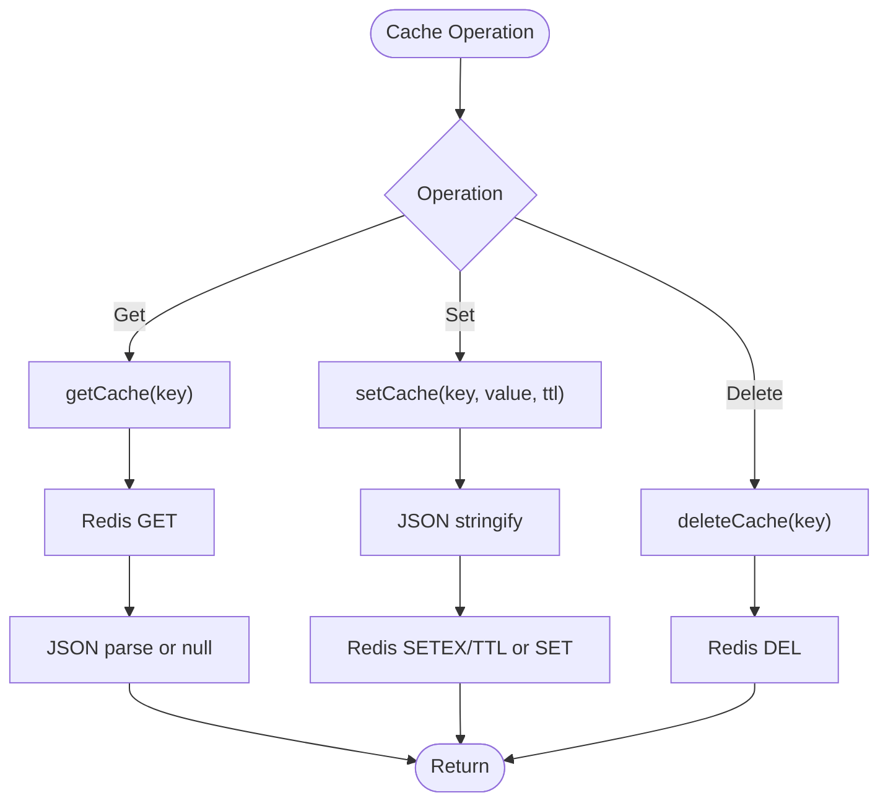
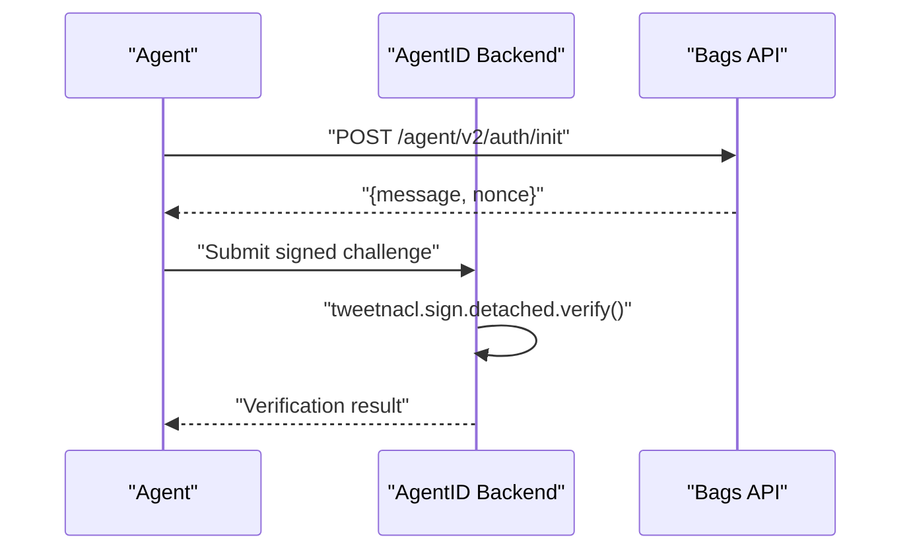
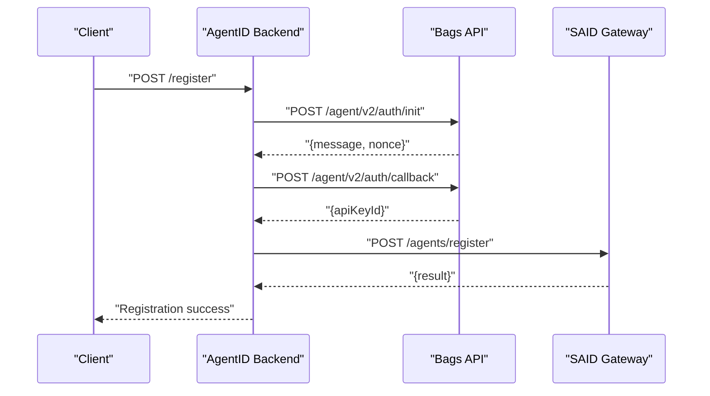
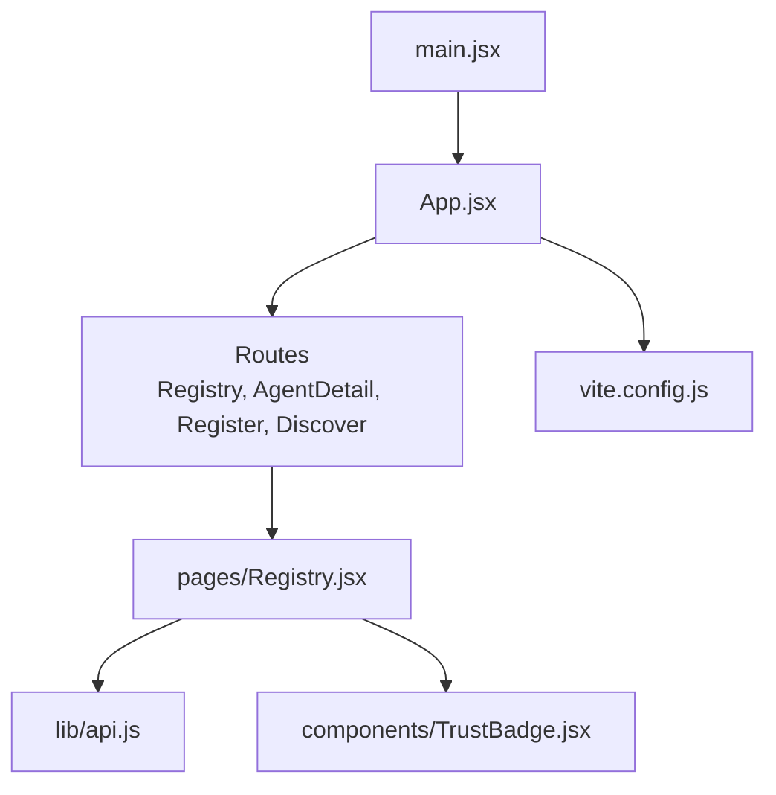
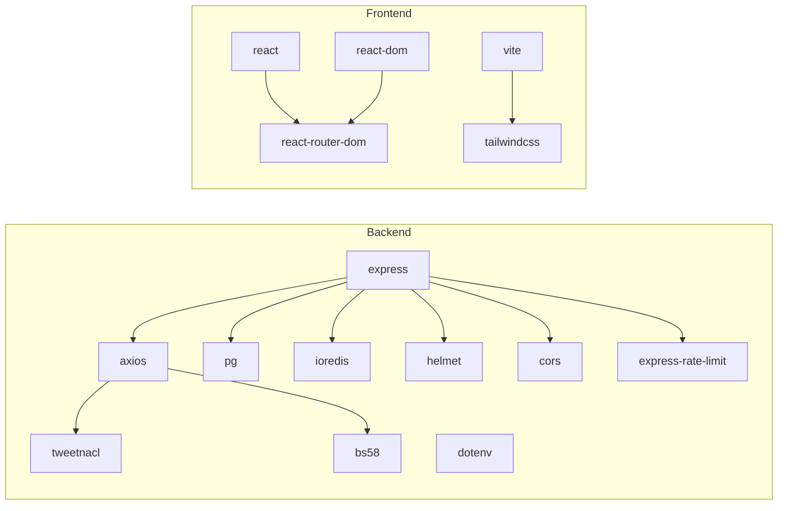

# Technology Stack

<cite>
**Referenced Files in This Document**
- [backend/package.json](file://backend/package.json)
- [frontend/package.json](file://frontend/package.json)
- [backend/src/config/index.js](file://backend/src/config/index.js)
- [backend/server.js](file://backend/server.js)
- [backend/src/models/db.js](file://backend/src/models/db.js)
- [backend/src/models/redis.js](file://backend/src/models/redis.js)
- [backend/src/services/bagsAuthVerifier.js](file://backend/src/services/bagsAuthVerifier.js)
- [backend/src/services/saidBinding.js](file://backend/src/services/saidBinding.js)
- [frontend/vite.config.js](file://frontend/vite.config.js)
- [frontend/src/App.jsx](file://frontend/src/App.jsx)
- [frontend/src/main.jsx](file://frontend/src/main.jsx)
- [frontend/src/lib/api.js](file://frontend/src/lib/api.js)
- [frontend/src/pages/Registry.jsx](file://frontend/src/pages/Registry.jsx)
- [frontend/src/components/TrustBadge.jsx](file://frontend/src/components/TrustBadge.jsx)
- [agentid_build_plan.md](file://agentid_build_plan.md)
</cite>

## Table of Contents
1. [Introduction](#introduction)
2. [Project Structure](#project-structure)
3. [Core Components](#core-components)
4. [Architecture Overview](#architecture-overview)
5. [Detailed Component Analysis](#detailed-component-analysis)
6. [Dependency Analysis](#dependency-analysis)
7. [Performance Considerations](#performance-considerations)
8. [Troubleshooting Guide](#troubleshooting-guide)
9. [Conclusion](#conclusion)
10. [Appendices](#appendices)

## Introduction
This document provides a comprehensive technology stack overview for AgentID. It covers the backend Node.js runtime and Express API, PostgreSQL database, Redis caching, cryptographic libraries, and frontend React 18 application with Vite and TailwindCSS. It also documents external service integrations (Bags API and SAID Protocol Gateway), configuration management across environments, and the rationale behind technology choices.

## Project Structure
AgentID is organized into two primary applications:
- Backend: Node.js/Express API with routing, services, models, middleware, and configuration.
- Frontend: React 18 application with Vite build tooling and TailwindCSS styling.

**Diagram sources**
- [backend/server.js:1-85](file://backend/server.js#L1-L85)
- [backend/src/config/index.js:1-31](file://backend/src/config/index.js#L1-L31)
- [backend/src/models/db.js:1-45](file://backend/src/models/db.js#L1-L45)
- [backend/src/models/redis.js:1-94](file://backend/src/models/redis.js#L1-L94)
- [backend/src/services/bagsAuthVerifier.js:1-93](file://backend/src/services/bagsAuthVerifier.js#L1-L93)
- [backend/src/services/saidBinding.js:1-119](file://backend/src/services/saidBinding.js#L1-L119)
- [frontend/src/App.jsx:1-148](file://frontend/src/App.jsx#L1-L148)
- [frontend/src/main.jsx:1-11](file://frontend/src/main.jsx#L1-L11)
- [frontend/src/lib/api.js:1-140](file://frontend/src/lib/api.js#L1-L140)
- [frontend/src/pages/Registry.jsx:1-276](file://frontend/src/pages/Registry.jsx#L1-L276)
- [frontend/src/components/TrustBadge.jsx:1-145](file://frontend/src/components/TrustBadge.jsx#L1-L145)
- [frontend/vite.config.js:1-42](file://frontend/vite.config.js#L1-L42)

**Section sources**
- [agentid_build_plan.md:257-302](file://agentid_build_plan.md#L257-L302)

## Core Components
- Backend runtime and framework
  - Node.js runtime and Express web framework form the API backbone.
  - Helmet secures HTTP headers; CORS middleware controls cross-origin access; rate limiting protects endpoints.
  - Environment-driven configuration centralizes secrets and URLs.
- Database and caching
  - PostgreSQL via pg connection pooling persists agent records, verifications, and flags.
  - Redis via ioredis provides caching and short-lived nonce storage for challenge-response.
- Cryptography
  - tweetnacl for Ed25519 signature verification; bs58 for base58 encoding/decoding.
- External integrations
  - Bags API for Ed25519 agent authentication and analytics.
  - SAID Protocol Gateway for Solana agent registry binding and trust score retrieval.
- Frontend stack
  - React 18 with React Router DOM for navigation.
  - Vite for development and build; TailwindCSS for styling.

**Section sources**
- [backend/server.js:12-85](file://backend/server.js#L12-L85)
- [backend/src/config/index.js:6-31](file://backend/src/config/index.js#L6-L31)
- [backend/src/models/db.js:6-45](file://backend/src/models/db.js#L6-L45)
- [backend/src/models/redis.js:6-94](file://backend/src/models/redis.js#L6-L94)
- [backend/src/services/bagsAuthVerifier.js:6-93](file://backend/src/services/bagsAuthVerifier.js#L6-L93)
- [backend/src/services/saidBinding.js:6-119](file://backend/src/services/saidBinding.js#L6-L119)
- [frontend/src/App.jsx:1-148](file://frontend/src/App.jsx#L1-L148)
- [frontend/vite.config.js:1-42](file://frontend/vite.config.js#L1-L42)

## Architecture Overview
AgentID’s architecture integrates a Node.js/Express backend with PostgreSQL and Redis, and a React 18 frontend served via Vite. The backend orchestrates:
- Wallet ownership verification against Bags API using Ed25519 challenge-response.
- SAID Protocol binding and trust score retrieval.
- Local agent registry, verifications, and flags stored in PostgreSQL.
- Caching and short-lived nonce management via Redis.
- Public API endpoints for badges, reputation, discovery, and attestation.

**Diagram sources**
- [backend/server.js:55-62](file://backend/server.js#L55-L62)
- [backend/src/models/db.js:10-18](file://backend/src/models/db.js#L10-L18)
- [backend/src/models/redis.js:10-20](file://backend/src/models/redis.js#L10-L20)
- [backend/src/services/bagsAuthVerifier.js:18-35](file://backend/src/services/bagsAuthVerifier.js#L18-L35)
- [backend/src/services/saidBinding.js:21-54](file://backend/src/services/saidBinding.js#L21-L54)

## Detailed Component Analysis

### Backend Runtime and Express API
- Security middleware: Helmet, CORS, and rate limiting applied globally.
- Centralized configuration via environment variables for ports, origins, database, Redis, and cache TTLs.
- Health check endpoint and unified 404/5xx error handling.
- Modular routes mounted under logical prefixes (/verify, /badge, /reputation, /agents, /attestations, /widget).

**Diagram sources**
- [backend/server.js:44-50](file://backend/server.js#L44-L50)
- [backend/server.js:55-62](file://backend/server.js#L55-L62)
- [backend/src/config/index.js:6-31](file://backend/src/config/index.js#L6-L31)

**Section sources**
- [backend/server.js:12-85](file://backend/server.js#L12-L85)
- [backend/src/config/index.js:6-31](file://backend/src/config/index.js#L6-L31)

### Database: PostgreSQL
- Connection pooling via pg with optional SSL for production.
- Centralized query function with error logging and propagation.
- Schema includes agent identities, verifications, and flags tables.

**Diagram sources**
- [agentid_build_plan.md:88-131](file://agentid_build_plan.md#L88-L131)

**Section sources**
- [backend/src/models/db.js:6-45](file://backend/src/models/db.js#L6-L45)
- [agentid_build_plan.md:88-131](file://agentid_build_plan.md#L88-L131)

### Caching: Redis
- ioredis client with retry strategy, offline queue, and TTL support.
- Functions for get/set/delete cache with JSON serialization.
- Used for badge caching and challenge nonce storage.

**Diagram sources**
- [backend/src/models/redis.js:41-93](file://backend/src/models/redis.js#L41-L93)

**Section sources**
- [backend/src/models/redis.js:6-94](file://backend/src/models/redis.js#L6-L94)

### Cryptographic Libraries: tweetnacl and bs58
- tweetnacl for Ed25519 detached signature verification.
- bs58 for base58 encoding/decoding of messages, signatures, and public keys.
- Applied in Bags authentication verification and PKI challenge-response.

**Diagram sources**
- [backend/src/services/bagsAuthVerifier.js:18-57](file://backend/src/services/bagsAuthVerifier.js#L18-L57)

**Section sources**
- [backend/src/services/bagsAuthVerifier.js:6-93](file://backend/src/services/bagsAuthVerifier.js#L6-L93)

### External Integrations: Bags API and SAID Protocol Gateway
- Bags API integration:
  - Authentication initialization and callback for Ed25519 challenge-response.
  - Analytics endpoints for reputation computation.
- SAID Protocol integration:
  - Registration and trust score retrieval.
  - Agent discovery by capability.

**Diagram sources**
- [backend/src/services/bagsAuthVerifier.js:18-86](file://backend/src/services/bagsAuthVerifier.js#L18-L86)
- [backend/src/services/saidBinding.js:21-54](file://backend/src/services/saidBinding.js#L21-L54)

**Section sources**
- [backend/src/services/bagsAuthVerifier.js:11-86](file://backend/src/services/bagsAuthVerifier.js#L11-L86)
- [backend/src/services/saidBinding.js:21-112](file://backend/src/services/saidBinding.js#L21-L112)

### Frontend: React 18, Vite, TailwindCSS, React Router
- React 18 with strict mode and router-based navigation.
- Vite configuration includes React plugin, TailwindCSS plugin, dev proxy to backend, and multi-page build (main + widget).
- API client encapsulates baseURL and interceptors for auth and error handling.
- Pages and components implement registry browsing, agent detail, discovery, and trust badge rendering.

**Diagram sources**
- [frontend/src/main.jsx:1-11](file://frontend/src/main.jsx#L1-L11)
- [frontend/src/App.jsx:128-145](file://frontend/src/App.jsx#L128-L145)
- [frontend/src/lib/api.js:3-8](file://frontend/src/lib/api.js#L3-L8)
- [frontend/src/pages/Registry.jsx:51-84](file://frontend/src/pages/Registry.jsx#L51-L84)
- [frontend/src/components/TrustBadge.jsx:42-69](file://frontend/src/components/TrustBadge.jsx#L42-L69)
- [frontend/vite.config.js:5-41](file://frontend/vite.config.js#L5-L41)

**Section sources**
- [frontend/src/App.jsx:1-148](file://frontend/src/App.jsx#L1-L148)
- [frontend/src/main.jsx:1-11](file://frontend/src/main.jsx#L1-L11)
- [frontend/src/lib/api.js:1-140](file://frontend/src/lib/api.js#L1-L140)
- [frontend/src/pages/Registry.jsx:1-276](file://frontend/src/pages/Registry.jsx#L1-L276)
- [frontend/src/components/TrustBadge.jsx:1-145](file://frontend/src/components/TrustBadge.jsx#L1-L145)
- [frontend/vite.config.js:1-42](file://frontend/vite.config.js#L1-L42)

## Dependency Analysis
- Backend dependencies (selected):
  - express, cors, helmet, express-rate-limit for web server and security.
  - pg for PostgreSQL connectivity; ioredis for Redis.
  - tweetnacl and bs58 for cryptography.
  - dotenv for environment variable loading.
  - axios for HTTP requests to external services.
- Frontend dependencies (selected):
  - react, react-dom, react-router-dom for UI and routing.
  - axios for API communication.
  - TailwindCSS and Vite plugins for styling and build.

**Diagram sources**
- [backend/package.json:18-30](file://backend/package.json#L18-L30)
- [frontend/package.json:12-18](file://frontend/package.json#L12-L18)

**Section sources**
- [backend/package.json:18-30](file://backend/package.json#L18-L30)
- [frontend/package.json:12-31](file://frontend/package.json#L12-L31)

## Performance Considerations
- Database
  - Use connection pooling to minimize overhead and improve concurrency.
  - Indexes on frequently queried columns (e.g., pubkey, status, capability_set) recommended for scalability.
- Caching
  - Cache badge responses with short TTLs to reduce repeated computations and external API calls.
  - Use Redis for low-latency reads and write-through patterns for consistency.
- Network
  - Configure timeouts for external API calls to prevent hanging requests.
  - Apply rate limiting to protect internal resources from abuse.
- Frontend
  - Lazy-load components and pages to reduce initial bundle size.
  - Use skeleton loaders and pagination to improve perceived performance.

[No sources needed since this section provides general guidance]

## Troubleshooting Guide
- Environment variables
  - Ensure DATABASE_URL is present; otherwise, startup exits early with a clear error.
  - Configure BAGS_API_KEY, SAID_GATEWAY_URL, REDIS_URL, CORS_ORIGIN, and cache TTLs appropriately.
- Database connectivity
  - Check connection string format and network access; production may require SSL configuration.
- Redis availability
  - Monitor reconnection logs; degraded functionality is acceptable since Redis is a cache.
- External service outages
  - Implement fallbacks and circuit-breaker patterns for Bags and SAID endpoints.
- Frontend proxy
  - Confirm Vite proxy targets the backend port and rewrites /api paths correctly.

**Section sources**
- [backend/server.js:3-10](file://backend/server.js#L3-L10)
- [backend/src/config/index.js:6-31](file://backend/src/config/index.js#L6-L31)
- [backend/src/models/db.js:10-18](file://backend/src/models/db.js#L10-L18)
- [backend/src/models/redis.js:23-34](file://backend/src/models/redis.js#L23-L34)
- [frontend/vite.config.js:33-39](file://frontend/vite.config.js#L33-L39)

## Conclusion
AgentID leverages a cohesive stack: Node.js/Express for the backend API, PostgreSQL for persistence, Redis for caching, and tweetnacl/bs58 for cryptographic integrity. The React 18 frontend, built with Vite and TailwindCSS, delivers a responsive registry and discovery experience. External integrations with Bags and SAID provide wallet-bound identity, trust scoring, and ecosystem reputation. Environment-driven configuration ensures portability across development, staging, and production.

[No sources needed since this section summarizes without analyzing specific files]

## Appendices

### Version and Compatibility Notes
- Backend
  - Node.js runtime aligned with the project’s stated stack.
  - Express, pg, ioredis, tweetnacl, axios, dotenv, cors, helmet, and express-rate-limit versions are defined in the backend package manifest.
- Frontend
  - React 18, react-router-dom, Vite, TailwindCSS, and related plugins versions are defined in the frontend package manifest.
- External Services
  - Bags API endpoints and SAID Gateway endpoints are integrated via axios with explicit timeouts.

**Section sources**
- [agentid_build_plan.md:309-330](file://agentid_build_plan.md#L309-L330)
- [backend/package.json:18-30](file://backend/package.json#L18-L30)
- [frontend/package.json:12-31](file://frontend/package.json#L12-L31)