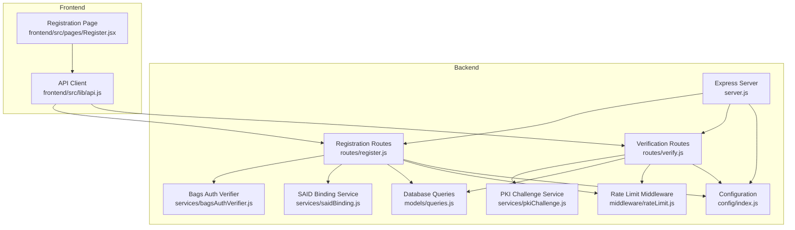
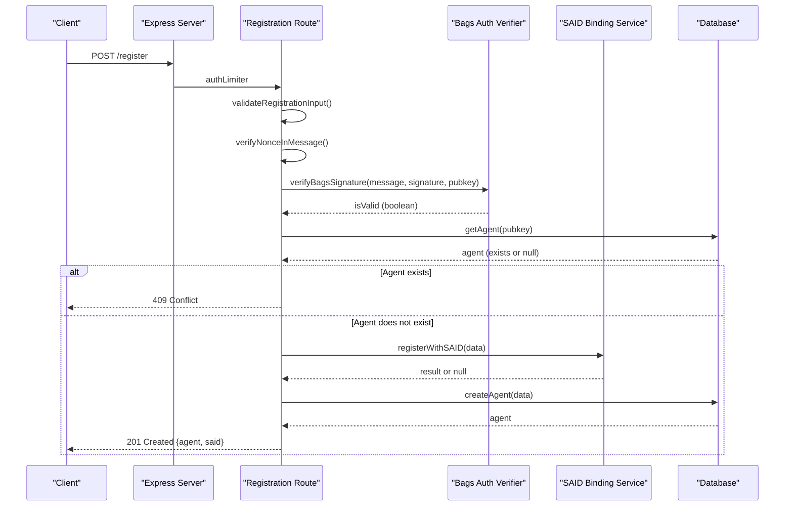
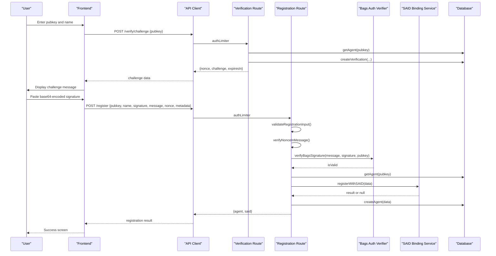
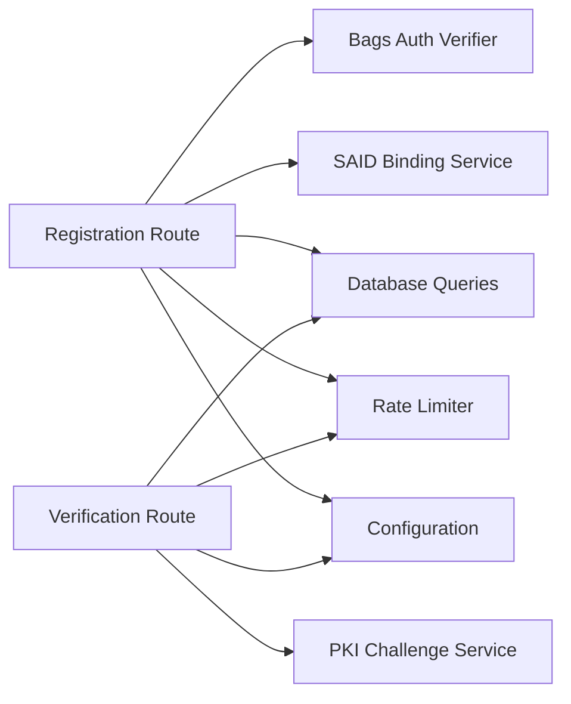

# Authentication Endpoints

<cite>
**Referenced Files in This Document**
- [server.js](file://backend/server.js)
- [register.js](file://backend/src/routes/register.js)
- [verify.js](file://backend/src/routes/verify.js)
- [bagsAuthVerifier.js](file://backend/src/services/bagsAuthVerifier.js)
- [pkiChallenge.js](file://backend/src/services/pkiChallenge.js)
- [saidBinding.js](file://backend/src/services/saidBinding.js)
- [rateLimit.js](file://backend/src/middleware/rateLimit.js)
- [config/index.js](file://backend/src/config/index.js)
- [queries.js](file://backend/src/models/queries.js)
- [api.js](file://frontend/src/lib/api.js)
- [Register.jsx](file://frontend/src/pages/Register.jsx)
</cite>

## Table of Contents
1. [Introduction](#introduction)
2. [Project Structure](#project-structure)
3. [Core Components](#core-components)
4. [Architecture Overview](#architecture-overview)
5. [Detailed Component Analysis](#detailed-component-analysis)
6. [Dependency Analysis](#dependency-analysis)
7. [Performance Considerations](#performance-considerations)
8. [Troubleshooting Guide](#troubleshooting-guide)
9. [Conclusion](#conclusion)

## Introduction
This document provides comprehensive API documentation for AgentID authentication endpoints focused on agent registration and ongoing verification. It covers:
- POST /register: Agent registration with Bags wallet ownership verification, Ed25519 signature verification, nonce validation, and SAID protocol binding
- GET /verify/challenge: Issuance of PKI challenges for ongoing verification
- POST /verify/response: Submission and verification of challenge responses

The documentation includes parameter specifications, response formats, rate limiting, security considerations, and practical examples demonstrating the complete registration flow.

## Project Structure
The authentication endpoints are implemented in the backend server with modular routing, services, and middleware. The frontend integrates with these endpoints to provide a guided registration experience.



**Diagram sources**
- [server.js:1-76](file://backend/server.js#L1-L76)
- [register.js:1-156](file://backend/src/routes/register.js#L1-L156)
- [verify.js:1-115](file://backend/src/routes/verify.js#L1-L115)
- [bagsAuthVerifier.js:1-93](file://backend/src/services/bagsAuthVerifier.js#L1-L93)
- [pkiChallenge.js:1-102](file://backend/src/services/pkiChallenge.js#L1-L102)
- [saidBinding.js:1-119](file://backend/src/services/saidBinding.js#L1-L119)
- [rateLimit.js:1-62](file://backend/src/middleware/rateLimit.js#L1-L62)
- [config/index.js:1-31](file://backend/src/config/index.js#L1-L31)
- [queries.js:1-404](file://backend/src/models/queries.js#L1-L404)
- [api.js:1-140](file://frontend/src/lib/api.js#L1-L140)
- [Register.jsx:1-673](file://frontend/src/pages/Register.jsx#L1-L673)

**Section sources**
- [server.js:1-76](file://backend/server.js#L1-L76)
- [register.js:1-156](file://backend/src/routes/register.js#L1-L156)
- [verify.js:1-115](file://backend/src/routes/verify.js#L1-L115)

## Core Components
- Registration Route: Validates request bodies, verifies Bags signatures, checks nonce presence in message, prevents duplicate registrations, attempts SAID binding, stores agent records, and returns agent data with SAID status.
- Verification Routes: Issue PKI challenges with random nonces and timestamps, and verify challenge responses with Ed25519 signature verification and expiration checks.
- Services:
  - Bags Auth Verifier: Interacts with external Bags API to initialize and complete authentication flows and verifies Ed25519 signatures.
  - PKI Challenge Service: Generates challenges, stores verification records, decodes base58 inputs, verifies Ed25519 signatures, and marks verifications as completed.
  - SAID Binding Service: Registers agents with the SAID Identity Gateway and retrieves trust scores.
- Middleware: Rate limiting configured specifically for authentication endpoints.
- Configuration: External API keys, gateway URLs, challenge expiry, and caching TTLs.

**Section sources**
- [register.js:15-156](file://backend/src/routes/register.js#L15-L156)
- [verify.js:16-115](file://backend/src/routes/verify.js#L16-L115)
- [bagsAuthVerifier.js:13-93](file://backend/src/services/bagsAuthVerifier.js#L13-L93)
- [pkiChallenge.js:12-102](file://backend/src/services/pkiChallenge.js#L12-L102)
- [saidBinding.js:9-119](file://backend/src/services/saidBinding.js#L9-L119)
- [rateLimit.js:15-62](file://backend/src/middleware/rateLimit.js#L15-L62)
- [config/index.js:6-31](file://backend/src/config/index.js#L6-L31)

## Architecture Overview
The authentication system follows a layered architecture:
- HTTP Layer: Express routes define endpoints and apply rate limiting.
- Service Layer: Business logic for external integrations and cryptographic verification.
- Persistence Layer: Database queries manage agent identities and verification records.
- Security Layer: Rate limiting, input validation, and signature verification protect the system.



**Diagram sources**
- [register.js:59-153](file://backend/src/routes/register.js#L59-L153)
- [bagsAuthVerifier.js:44-57](file://backend/src/services/bagsAuthVerifier.js#L44-L57)
- [saidBinding.js:21-54](file://backend/src/services/saidBinding.js#L21-L54)
- [queries.js:17-29](file://backend/src/models/queries.js#L17-L29)

## Detailed Component Analysis

### POST /register
Purpose: Register a new agent with wallet ownership verification and optional SAID binding.

Parameters (request body):
- pubkey: string, required, non-empty, length between 32 and 88 characters
- name: string, required, non-empty, max 255 characters
- signature: string, required, base58-encoded Ed25519 signature
- message: string, required, base58-encoded challenge message from Bags
- nonce: string, required, must be included in message
- tokenMint: string, optional, SPL token mint address
- capabilities: array<string>, optional, capability identifiers
- creatorX: string, optional, X (Twitter) handle
- creatorWallet: string, optional, creator's wallet address
- description: string, optional, agent description

Validation logic:
- Enforces presence and type checks for required fields
- Validates pubkey and name length constraints
- Ensures nonce appears in message to prevent signature replay
- Checks for existing agent to avoid duplicates

Processing steps:
1. Validate request body
2. Verify nonce presence in message
3. Verify Ed25519 signature against Bags challenge
4. Check for existing agent
5. Attempt SAID binding (non-blocking)
6. Store agent record
7. Return agent data with SAID status

Response formats:
- Success (201): { agent: object, said: { registered: boolean, error?: string, data?: object } }
- Validation error (400): { error: string }
- Signature invalid (401): { error: string }
- Duplicate registration (409): { error: string, pubkey: string }

Security considerations:
- Ed25519 signature verification ensures wallet ownership
- Nonce inclusion in message prevents replay attacks
- SAID binding is attempted but does not block registration
- Rate limiting protects against abuse

Rate limiting:
- Auth endpoints: 20 requests per 15 minutes per IP

Example curl command:
```bash
curl -X POST https://your-domain.com/register \
  -H "Content-Type: application/json" \
  -d '{
    "pubkey": "your_agent_pubkey",
    "name": "My Agent",
    "signature": "base58_encoded_signature",
    "message": "base58_encoded_challenge_message",
    "nonce": "challenge_nonce",
    "tokenMint": "optional_token_mint",
    "capabilities": ["capability1", "capability2"],
    "creatorX": "@handle",
    "creatorWallet": "creator_wallet_address",
    "description": "Agent description"
  }'
```

**Section sources**
- [register.js:15-156](file://backend/src/routes/register.js#L15-L156)
- [bagsAuthVerifier.js:44-57](file://backend/src/services/bagsAuthVerifier.js#L44-L57)
- [saidBinding.js:21-54](file://backend/src/services/saidBinding.js#L21-L54)
- [rateLimit.js:50-55](file://backend/src/middleware/rateLimit.js#L50-L55)

### GET /verify/challenge
Purpose: Issue a PKI challenge for an agent to verify ongoing ownership.

Parameters (request body):
- pubkey: string, required, agent's public key

Processing steps:
1. Validate pubkey presence and type
2. Check agent exists in database
3. Generate random nonce and timestamp
4. Create challenge string: AGENTID-VERIFY:{pubkey}:{nonce}:{timestamp}
5. Store verification record with expiration
6. Return base58-encoded challenge and expiration time

Response formats:
- Success (200): { nonce: string, challenge: string, expiresIn: number }
- Validation error (400): { error: string }
- Not found (404): { error: string, pubkey: string }

Security considerations:
- Random nonce prevents replay attacks
- Expiration prevents long-term reuse
- Challenge stored in database with completion flag

Rate limiting:
- Auth endpoints: 20 requests per 15 minutes per IP

Example curl command:
```bash
curl -X POST https://your-domain.com/verify/challenge \
  -H "Content-Type: application/json" \
  -d '{"pubkey": "agent_pubkey"}'
```

**Section sources**
- [verify.js:16-49](file://backend/src/routes/verify.js#L16-L49)
- [pkiChallenge.js:17-39](file://backend/src/services/pkiChallenge.js#L17-L39)
- [queries.js:213-222](file://backend/src/models/queries.js#L213-L222)
- [rateLimit.js:50-55](file://backend/src/middleware/rateLimit.js#L50-L55)

### POST /verify/response
Purpose: Submit and verify a challenge response using Ed25519 signature.

Parameters (request body):
- pubkey: string, required, agent's public key
- nonce: string, required, challenge nonce
- signature: string, required, base58-encoded Ed25519 signature

Processing steps:
1. Validate required fields
2. Retrieve pending verification by pubkey and nonce
3. Check expiration against current time
4. Decode base58 inputs (signature, pubkey, challenge)
5. Verify Ed25519 signature against stored challenge
6. Mark verification as completed
7. Update last verified timestamp

Response formats:
- Success (200): { verified: boolean, pubkey: string, timestamp: number }
- Validation error (400): { error: string }
- Not found/expired (404): { error: string }
- Invalid signature (401): { error: string }

Security considerations:
- Ed25519 signature verification ensures authenticity
- Expiration prevents stale responses
- Single-use verification records prevent reuse

Rate limiting:
- Auth endpoints: 20 requests per 15 minutes per IP

Example curl command:
```bash
curl -X POST https://your-domain.com/verify/response \
  -H "Content-Type: application/json" \
  -d '{
    "pubkey": "agent_pubkey",
    "nonce": "challenge_nonce",
    "signature": "base58_encoded_signature"
  }'
```

**Section sources**
- [verify.js:51-112](file://backend/src/routes/verify.js#L51-L112)
- [pkiChallenge.js:49-96](file://backend/src/services/pkiChallenge.js#L49-L96)
- [queries.js:229-256](file://backend/src/models/queries.js#L229-L256)
- [rateLimit.js:50-55](file://backend/src/middleware/rateLimit.js#L50-L55)

### End-to-End Registration Flow (Practical Example)
The frontend orchestrates the complete registration flow:
1. User enters pubkey and name
2. Frontend requests challenge from /verify/challenge
3. User signs challenge message with Ed25519 private key
4. Frontend submits registration to /register with signature and metadata
5. Backend verifies signature, prevents duplicates, and stores agent



**Diagram sources**
- [Register.jsx:295-341](file://frontend/src/pages/Register.jsx#L295-L341)
- [api.js:65-83](file://frontend/src/lib/api.js#L65-L83)
- [verify.js:20-49](file://backend/src/routes/verify.js#L20-L49)
- [register.js:59-153](file://backend/src/routes/register.js#L59-L153)
- [bagsAuthVerifier.js:44-57](file://backend/src/services/bagsAuthVerifier.js#L44-L57)
- [saidBinding.js:21-54](file://backend/src/services/saidBinding.js#L21-L54)
- [queries.js:17-29](file://backend/src/models/queries.js#L17-L29)

**Section sources**
- [Register.jsx:295-341](file://frontend/src/pages/Register.jsx#L295-L341)
- [api.js:65-83](file://frontend/src/lib/api.js#L65-L83)

## Dependency Analysis
The authentication endpoints depend on several services and middleware:
- Registration depends on Bags Auth Verifier for signature validation and SAID Binding Service for identity registration
- Verification depends on PKI Challenge Service for challenge issuance and verification
- All endpoints use rate limiting middleware and share configuration values
- Database queries provide persistence for agent identities and verification records



**Diagram sources**
- [register.js:7-11](file://backend/src/routes/register.js#L7-L11)
- [verify.js:7-9](file://backend/src/routes/verify.js#L7-L9)
- [bagsAuthVerifier.js:11](file://backend/src/services/bagsAuthVerifier.js#L11)
- [pkiChallenge.js:9](file://backend/src/services/pkiChallenge.js#L9)
- [saidBinding.js:7](file://backend/src/services/saidBinding.js#L7)
- [rateLimit.js:10](file://backend/src/middleware/rateLimit.js#L10)
- [config/index.js:12-27](file://backend/src/config/index.js#L12-L27)

**Section sources**
- [register.js:7-11](file://backend/src/routes/register.js#L7-L11)
- [verify.js:7-9](file://backend/src/routes/verify.js#L7-L9)
- [rateLimit.js:15-62](file://backend/src/middleware/rateLimit.js#L15-L62)
- [config/index.js:6-31](file://backend/src/config/index.js#L6-L31)

## Performance Considerations
- Rate limiting: Authentication endpoints are restricted to 20 requests per 15 minutes per IP to prevent abuse
- External API timeouts: Bags and SAID gateway calls have 10-second timeouts to avoid blocking
- Database queries: Parameterized queries prevent SQL injection and support efficient indexing
- Challenge expiration: 5-minute window balances usability with security
- Payload limits: JSON body parsing allows up to 10MB for large payloads

## Troubleshooting Guide
Common error scenarios and resolutions:
- 400 Bad Request: Validate all required fields and ensure nonce is included in message
- 401 Unauthorized: Verify Ed25519 signature and base58 encoding; ensure challenge is fresh
- 404 Not Found: Confirm agent exists before issuing challenges; check pubkey format
- 409 Conflict: Agent already registered; use different pubkey or update existing record
- 429 Too Many Requests: Respect rate limits; implement client-side retry with exponential backoff
- SAID binding failures: Non-blocking; registration proceeds without SAID registration

Debugging tips:
- Enable server logs for rate limit warnings and signature verification errors
- Verify base58 encoding of messages, signatures, and pubkeys
- Check challenge expiration timestamps
- Monitor external API availability for Bags and SAID gateways

**Section sources**
- [register.js:82-104](file://backend/src/routes/register.js#L82-L104)
- [verify.js:85-107](file://backend/src/routes/verify.js#L85-L107)
- [rateLimit.js:37-41](file://backend/src/middleware/rateLimit.js#L37-L41)
- [bagsAuthVerifier.js:53-56](file://backend/src/services/bagsAuthVerifier.js#L53-L56)
- [pkiChallenge.js:74-76](file://backend/src/services/pkiChallenge.js#L74-L76)

## Conclusion
The AgentID authentication system provides robust agent registration and ongoing verification through:
- Ed25519-based wallet ownership verification via Bags
- PKI challenge-response for continuous verification
- SAID identity binding for decentralized identity
- Comprehensive rate limiting and input validation
- Clear error handling and security safeguards

The documented endpoints enable clients to implement secure agent onboarding and verification workflows while maintaining compliance with cryptographic best practices and operational constraints.