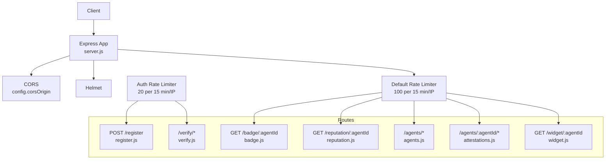
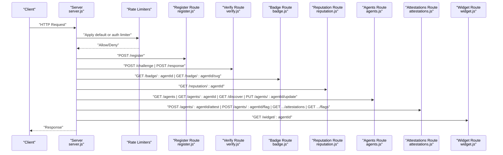
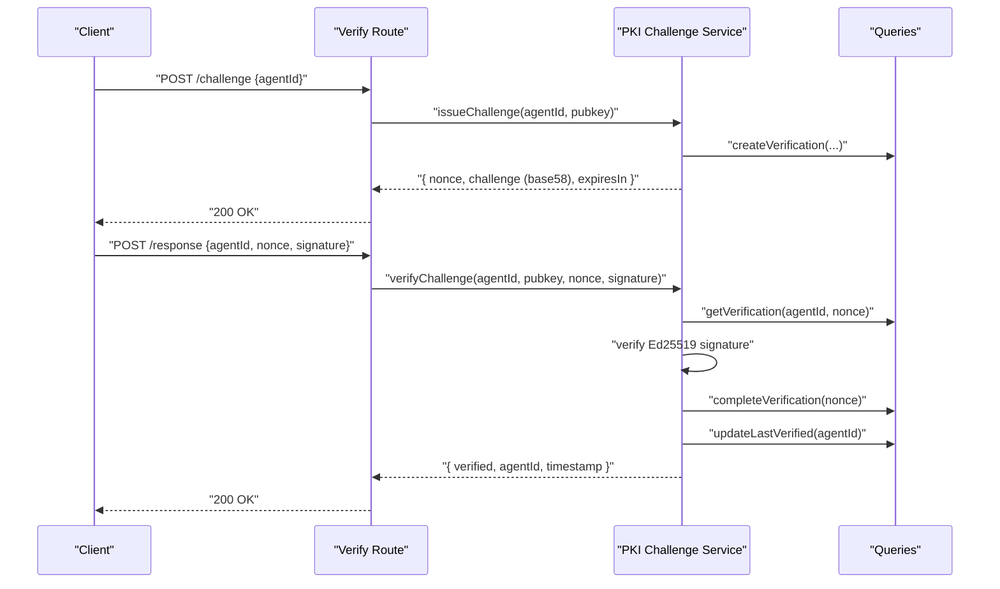
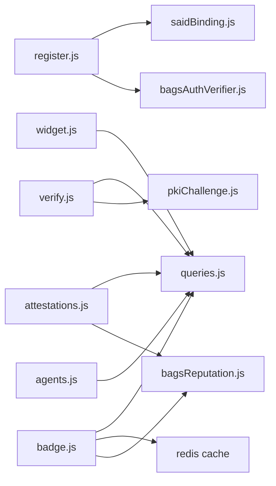
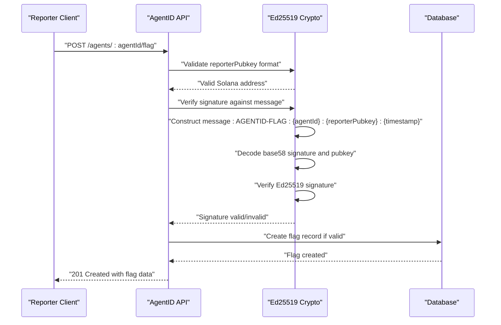

# Backend API Reference

<cite>
**Referenced Files in This Document**
- [server.js](file://backend/server.js)
- [register.js](file://backend/src/routes/register.js)
- [verify.js](file://backend/src/routes/verify.js)
- [agents.js](file://backend/src/routes/agents.js)
- [attestations.js](file://backend/src/routes/attestations.js)
- [badge.js](file://backend/src/routes/badge.js)
- [widget.js](file://backend/src/routes/widget.js)
- [rateLimit.js](file://backend/src/middleware/rateLimit.js)
- [bagsAuthVerifier.js](file://backend/src/services/bagsAuthVerifier.js)
- [pkiChallenge.js](file://backend/src/services/pkiChallenge.js)
- [saidBinding.js](file://backend/src/services/saidBinding.js)
- [bagsReputation.js](file://backend/src/services/bagsReputation.js)
- [queries.js](file://backend/src/models/queries.js)
- [transform.js](file://backend/src/utils/transform.js)
- [config/index.js](file://backend/src/config/index.js)
- [package.json](file://backend/package.json)
- [API_REFERENCE.md](file://docs/API_REFERENCE.md)
- [api.js](file://frontend/src/lib/api.js)
</cite>

## Update Summary
**Changes Made**
- Updated authentication endpoints to reflect route path standardization: /verify/ prefix removed from challenge and response endpoints
- Challenge endpoint now at /challenge instead of /verify/challenge
- Response endpoint now at /response instead of /verify/response
- Enhanced registration flow with base58 encoding validation and nonce checking
- Updated all endpoint URLs and parameter references to reflect current implementation
- Corrected rate limiting documentation to match actual route structure

## Table of Contents
1. [Introduction](#introduction)
2. [Project Structure](#project-structure)
3. [Core Components](#core-components)
4. [Architecture Overview](#architecture-overview)
5. [Detailed Component Analysis](#detailed-component-analysis)
6. [Dependency Analysis](#dependency-analysis)
7. [Performance Considerations](#performance-considerations)
8. [Troubleshooting Guide](#troubleshooting-guide)
9. [Conclusion](#conclusion)
10. [Appendices](#appendices)

## Introduction
This document describes the AgentID backend REST API, covering authentication and registration, verification, trust and reputation, discovery and registry, attestation and flagging, and widget endpoints. The API has been refactored to use UUID-based agent identifiers (:agentId) instead of public key-based parameters (:pubkey). It specifies HTTP methods, URL patterns, request/response schemas, authentication requirements, rate limiting, and security considerations. Practical usage examples are included via curl commands and code snippet paths.

## Project Structure
The backend is an Express server that mounts route modules under specific prefixes. Middleware applies global and per-route rate limits, and security headers are enforced. External integrations include BAGS and SAID gateways for authentication and reputation.

**Diagram sources**
- [server.js:47-53](file://backend/server.js#L47-L53)
- [rateLimit.js:44-55](file://backend/src/middleware/rateLimit.js#L44-L55)

**Section sources**
- [server.js:19-76](file://backend/server.js#L19-L76)
- [rateLimit.js:1-62](file://backend/src/middleware/rateLimit.js#L1-L62)

## Core Components
- Authentication and Registration
  - POST /register: Full registration with Bags signature verification and optional SAID binding.
  - POST /challenge: Issue a PKI challenge for an agent using agent UUID.
  - POST /response: Verify a signed challenge response using agent UUID.
- Trust and Reputation
  - GET /reputation/:agentId: Full reputation breakdown.
  - GET /badge/:agentId, GET /badge/:agentId/svg: Trust badge JSON and SVG.
- Discovery and Registry
  - GET /agents: List agents with filters and pagination.
  - GET /agents/:agentId: Agent detail with reputation.
  - GET /discover: Capability-based discovery of verified agents.
  - PUT /agents/:agentId/update: Update agent metadata with Ed25519 signature verification.
- Attestations and Flagging
  - POST /agents/:agentId/attest: Record action success/failure and optionally refresh reputation.
  - POST /agents/:agentId/flag: Flag suspicious behavior with comprehensive Ed25519 cryptographic authentication.
  - GET /agents/:agentId/attestations: Agent action statistics.
  - GET /agents/:agentId/flags: Flags filed against an agent.
- Widget
  - GET /widget/:agentId: Embeddable HTML widget.

**Section sources**
- [register.js:59-153](file://backend/src/routes/register.js#L59-L153)
- [verify.js:20-112](file://backend/src/routes/verify.js#L20-L112)
- [agents.js:23-248](file://backend/src/routes/agents.js#L23-L248)
- [attestations.js:25-185](file://backend/src/routes/attestations.js#L25-L185)
- [badge.js:16-55](file://backend/src/routes/badge.js#L16-L55)
- [widget.js:32-100](file://backend/src/routes/widget.js#L32-L100)

## Architecture Overview
The API follows a modular route architecture with per-route rate limiting. Authentication endpoints use stricter limits. Data transformations normalize snake_case database fields to camelCase for clients. External services integrate with BAGS for wallet ownership verification and SAID for reputation and discovery. All endpoints now use UUID-based agent identification.

**Diagram sources**
- [server.js:47-53](file://backend/server.js#L47-L53)
- [rateLimit.js:44-55](file://backend/src/middleware/rateLimit.js#L44-L55)

## Detailed Component Analysis

### Authentication and Registration Endpoints
- POST /register
  - Purpose: Register a new agent with Bags signature verification and optional SAID binding.
  - Authentication: None (strict rate limiting).
  - Rate limit: Auth limiter (20 per 15 minutes).
  - Request body:
    - Required: pubkey, name, signature, message, nonce
    - Optional: tokenMint, capabilities[], creatorX, creatorWallet, description
  - Validation:
    - pubkey: string, length 32–88
    - name: string, length ≤ 255
    - signature/message/nonce: non-empty strings
    - message must include nonce
  - Signature verification:
    - Verifies Ed25519 signature against the message using Bags verifier.
  - SAID binding:
    - Non-blocking attempt to register with SAID gateway; response includes registration status.
  - Responses:
    - 201 Created: { agent, agentId, said }
    - 400 Bad Request: validation errors
    - 401 Unauthorized: invalid signature
    - 409 Conflict: agent already registered
    - 500 Internal Server Error: unexpected errors
  - Security:
    - Replay protection via nonce inclusion check.
    - Strict rate limiting.
  - Example curl:
    - [curl snippet path:59-153](file://backend/src/routes/register.js#L59-L153)

- POST /challenge
  - Purpose: Issue a PKI challenge for an agent using agent UUID.
  - Authentication: None (strict rate limiting).
  - Rate limit: Auth limiter (20 per 15 minutes).
  - Request body: { agentId }
  - Responses:
    - 200 OK: { nonce, challenge (base58), expiresIn }
    - 400 Bad Request: missing agentId
    - 404 Not Found: agent not found
  - Security:
    - Challenge stored with expiration; encoded in base58.
  - Example curl:
    - [curl snippet path:20-49](file://backend/src/routes/verify.js#L20-L49)

- POST /response
  - Purpose: Verify signed challenge response using agent UUID.
  - Authentication: None (strict rate limiting).
  - Rate limit: Auth limiter (20 per 15 minutes).
  - Request body: { agentId, nonce, signature }
  - Validation:
    - All fields required and strings.
  - Verification:
    - Decodes inputs (base58), verifies Ed25519 signature against constructed challenge.
    - Checks expiration and completion status.
  - Responses:
    - 200 OK: { verified, agentId, timestamp }
    - 400 Bad Request: missing fields
    - 401 Unauthorized: invalid/expired signature or encoding
    - 404 Not Found: challenge not found or completed
  - Security:
    - Replay protection via timestamp window in related flows.
  - Example curl:
    - [curl snippet path:55-112](file://backend/src/routes/verify.js#L55-L112)

**Section sources**
- [register.js:59-153](file://backend/src/routes/register.js#L59-L153)
- [verify.js:20-112](file://backend/src/routes/verify.js#L20-L112)
- [rateLimit.js:44-55](file://backend/src/middleware/rateLimit.js#L44-L55)
- [bagsAuthVerifier.js:44-57](file://backend/src/services/bagsAuthVerifier.js#L44-L57)
- [pkiChallenge.js:17-96](file://backend/src/services/pkiChallenge.js#L17-L96)

### Trust and Reputation Endpoints
- GET /reputation/:agentId
  - Purpose: Retrieve full reputation breakdown for an agent using UUID.
  - Authentication: None.
  - Rate limit: Default limiter (100 per 15 minutes).
  - Responses:
    - 200 OK: { agentId, pubkey, score, label, breakdown }
    - 404 Not Found: agent not found
  - Example curl:
    - [curl snippet path:17-41](file://backend/src/routes/reputation.js#L17-L41)

- GET /badge/:agentId
  - Purpose: Return trust badge JSON using UUID.
  - Authentication: None.
  - Rate limit: Default limiter (100 per 15 minutes).
  - Responses:
    - 200 OK: { agentId, pubkey, name, status, badge, label, score, bags_score, saidTrustScore, saidLabel, registeredAt, lastVerified, totalActions, successRate, capabilities, tokenMint, widgetUrl }
    - 404 Not Found: agent not found
  - Example curl:
    - [curl snippet path:16-32](file://backend/src/routes/badge.js#L16-L32)

- GET /badge/:agentId/svg
  - Purpose: Return trust badge SVG image using UUID.
  - Authentication: None.
  - Rate limit: Default limiter (100 per 15 minutes).
  - Responses:
    - 200 OK: image/svg+xml
    - 404 Not Found: agent not found
  - Example curl:
    - [curl snippet path:38-55](file://backend/src/routes/badge.js#L38-L55)

**Section sources**
- [reputation.js:17-41](file://backend/src/routes/reputation.js#L17-L41)
- [badge.js:16-55](file://backend/src/routes/badge.js#L16-L55)
- [bagsReputation.js:16-141](file://backend/src/services/bagsReputation.js#L16-L141)
- [saidBinding.js:61-87](file://backend/src/services/saidBinding.js#L61-L87)

### Discovery and Registry Endpoints
- GET /agents
  - Purpose: List agents with optional filters and pagination.
  - Authentication: None.
  - Rate limit: Default limiter (100 per 15 minutes).
  - Query parameters:
    - status (optional)
    - capability (optional)
    - limit (default 50, max 100)
    - offset (default 0)
  - Responses:
    - 200 OK: { agents: [...], total, limit, offset }
  - Example curl:
    - [curl snippet path:23-55](file://backend/src/routes/agents.js#L23-L55)

- GET /agents/:agentId
  - Purpose: Retrieve agent detail with reputation using UUID.
  - Authentication: None.
  - Rate limit: Default limiter (100 per 15 minutes).
  - Responses:
    - 200 OK: { agent, reputation: { score, label, breakdown } }
    - 404 Not Found: agent not found
  - Example curl:
    - [curl snippet path:61-87](file://backend/src/routes/agents.js#L61-L87)

- GET /discover
  - Purpose: Find verified agents by capability.
  - Authentication: None.
  - Rate limit: Default limiter (100 per 15 minutes).
  - Query parameters:
    - capability (required)
  - Responses:
    - 200 OK: { agents: [...], capability, count }
    - 400 Bad Request: missing capability
  - Example curl:
    - [curl snippet path:93-114](file://backend/src/routes/agents.js#L93-L114)

- PUT /agents/:agentId/update
  - Purpose: Update agent metadata with Ed25519 signature verification using UUID.
  - Authentication: None (strict rate limiting).
  - Rate limit: Auth limiter (20 per 15 minutes).
  - Path parameter:
    - agentId (UUID)
  - Request body:
    - signature (required, base58-encoded Ed25519)
    - timestamp (required, number)
    - name, tokenMint, capabilities[], creatorX, description (optional)
  - Validation:
    - signature format and Ed25519 verification against message "AGENTID-UPDATE:{agentId}:{timestamp}".
    - timestamp within ±5 minutes (with small future tolerance).
    - Agent must exist.
  - Responses:
    - 200 OK: { agent }
    - 400 Bad Request: invalid fields or no valid fields to update
    - 401 Unauthorized: invalid signature or timestamp too old/future
    - 404 Not Found: agent not found
    - 500 Internal Server Error: failed to update
  - Security:
    - Replay protection via timestamp window.
  - Example curl:
    - [curl snippet path:120-248](file://backend/src/routes/agents.js#L120-L248)

**Section sources**
- [agents.js:23-248](file://backend/src/routes/agents.js#L23-L248)
- [queries.js:17-73](file://backend/src/models/queries.js#L17-L73)
- [transform.js:43-55](file://backend/src/utils/transform.js#L43-L55)

### Attestations and Flagging Endpoints
- POST /agents/:agentId/attest
  - Purpose: Record action success/failure and optionally refresh reputation using UUID.
  - Authentication: None.
  - Rate limit: Default limiter (100 per 15 minutes).
  - Path parameter:
    - agentId (UUID)
  - Request body:
    - success (required, boolean)
    - action (optional, string)
  - Behavior:
    - Increments total and successful/failed counters.
    - On success, attempts to refresh and store BAGS score.
  - Responses:
    - 200 OK: { agentId, pubkey, success, action, totalActions, successfulActions, failedActions, bagsScore }
    - 404 Not Found: agent not found
  - Example curl:
    - [curl snippet path:25-72](file://backend/src/routes/attestations.js#L25-L72)

- POST /agents/:agentId/flag
  - Purpose: Flag suspicious behavior with comprehensive Ed25519 cryptographic authentication using UUID.
  - Authentication: Ed25519 signature-based authentication (strict rate limiting).
  - Rate limit: Auth limiter (20 requests per 15 minutes) - **Enhanced** from default tier.
  - Path parameter:
    - agentId (UUID)
  - Request body:
    - reporterPubkey (required, valid Solana address)
    - signature (required, base58-encoded Ed25519)
    - timestamp (required, number)
    - reason (required, non-empty string)
    - evidence (optional)
  - Validation:
    - reporterPubkey: valid Solana address format (base58, 32 bytes)
    - signature: base58-encoded Ed25519 signature
    - timestamp: within ±5 minutes (300,000 ms) of current time
    - reason: non-empty string
  - Signature verification:
    - Constructs message: "AGENTID-FLAG:{agentId}:{reporterPubkey}:{timestamp}"
    - Verifies Ed25519 signature against reporterPubkey
    - Validates signature format and encoding
  - Behavior:
    - Creates flag record with cryptographic proof of ownership
    - If unresolved flags ≥ 3 and status != flagged, updates agent status to flagged
  - Responses:
    - 201 Created: { flag, agentId, unresolved_flags, auto_flagged }
    - 400 Bad Request: missing fields, invalid signature format, timestamp outside window
    - 401 Unauthorized: invalid reporter signature
    - 404 Not Found: agent not found
  - Security:
    - Comprehensive cryptographic authentication prevents anonymous flagging
    - Replay protection via timestamp window
    - Strict rate limiting for authentication endpoints
  - Example curl:
    - [curl snippet path:78-127](file://backend/src/routes/attestations.js#L78-L127)

- GET /agents/:agentId/attestations
  - Purpose: Retrieve agent action statistics using UUID.
  - Authentication: None.
  - Rate limit: Default limiter (100 per 15 minutes).
  - Responses:
    - 200 OK: { agentId, pubkey, totalActions, successfulActions, failedActions, bagsScore }
    - 404 Not Found: agent not found
  - Example curl:
    - [curl snippet path:133-156](file://backend/src/routes/attestations.js#L133-L156)

- GET /agents/:agentId/flags
  - Purpose: Retrieve flags filed against an agent using UUID.
  - Authentication: None.
  - Rate limit: Default limiter (100 per 15 minutes).
  - Responses:
    - 200 OK: { agentId, pubkey, flags: [...], count }
    - 404 Not Found: agent not found
  - Example curl:
    - [curl snippet path:162-185](file://backend/src/routes/attestations.js#L162-L185)

**Section sources**
- [attestations.js:25-185](file://backend/src/routes/attestations.js#L25-L185)
- [bagsReputation.js:130-141](file://backend/src/services/bagsReputation.js#L130-L141)
- [queries.js:168-202](file://backend/src/models/queries.js#L168-L202)
- [queries.js:267-305](file://backend/src/models/queries.js#L267-L305)

### Widget Endpoint
- GET /widget/:agentId
  - Purpose: Return embeddable HTML widget for an agent using UUID.
  - Authentication: None.
  - Rate limit: Default limiter (100 per 15 minutes).
  - Responses:
    - 200 OK: text/html (widget HTML)
    - 404 Not Found: simple HTML error page with agentId
  - Security:
    - HTML is escaped to prevent XSS.
  - Example curl:
    - [curl snippet path:32-100](file://backend/src/routes/widget.js#L32-L100)

**Section sources**
- [widget.js:32-100](file://backend/src/routes/widget.js#L32-L100)

### PKI Challenge-Response Message Format and Signature Verification
- Challenge issuance:
  - Construct challenge string: "AGENTID-VERIFY:{agentId}:{pubkey}:{nonce}:{timestamp}"
  - Store with expiration and completion status.
  - Return base58-encoded challenge and nonce.
- Response verification:
  - Decode signature and pubkey (base58).
  - Verify Ed25519 signature against the stored challenge.
  - Validate expiration and completion status.
  - On success, mark challenge as completed and update last verified timestamp.

**Diagram sources**
- [verify.js:20-112](file://backend/src/routes/verify.js#L20-L112)
- [pkiChallenge.js:17-96](file://backend/src/services/pkiChallenge.js#L17-L96)
- [queries.js:213-256](file://backend/src/models/queries.js#L213-L256)

**Section sources**
- [pkiChallenge.js:17-96](file://backend/src/services/pkiChallenge.js#L17-L96)
- [verify.js:55-112](file://backend/src/routes/verify.js#L55-L112)

### Enhanced Rate Limiting Configuration
**Updated** Enhanced rate limiting documentation with comprehensive configurations

- Default rate limiter: 100 requests per 15 minutes per IP
  - Used for read operations (GET requests)
  - Applied to endpoints: /agents, /badge/:agentId, /reputation/:agentId, /discover, /agents/:agentId/attestations, /agents/:agentId/flags
- Auth rate limiter: 20 requests per 15 minutes per IP
  - Used for write operations and authentication
  - Applied to endpoints: /register, /challenge, /response, /agents/:agentId/update, /agents/:agentId/flag
- Rate limit headers:
  - Standard headers: RateLimit-Limit, RateLimit-Remaining, RateLimit-Reset
  - Legacy headers: Disabled (legacyHeaders: false)
- Response format:
  - JSON error response with error message and status code
  - 429 status code for rate limit exceeded

**Section sources**
- [rateLimit.js:8-62](file://backend/src/middleware/rateLimit.js#L8-L62)

### Comprehensive Ed25519 Cryptographic Authentication for Flag Submissions
**Updated** Added comprehensive Ed25519 cryptographic authentication for flag submissions

- Authentication model:
  - Ed25519 signature-based authentication for all state-modifying operations
  - Eliminates need for shared secrets or API tokens
  - Provides non-repudiation and strong cryptographic proof
- Flag submission authentication:
  - Requires reporterPubkey (valid Solana address)
  - Requires signature (base58-encoded Ed25519)
  - Requires timestamp (within ±5 minutes window)
  - Message format: "AGENTID-FLAG:{agentId}:{reporterPubkey}:{timestamp}"
- Security benefits:
  - Prevents anonymous bulk flagging
  - Ensures reporter control over reported actions
  - Provides replay protection via timestamp validation
  - Maintains audit trail with cryptographic signatures

**Section sources**
- [attestations.js:80-180](file://backend/src/routes/attestations.js#L80-L180)
- [transform.js:87-93](file://backend/src/utils/transform.js#L87-L93)

## Dependency Analysis
- Route-to-service dependencies:
  - Registration depends on Bags signature verification and SAID binding.
  - Verification depends on challenge storage and Ed25519 verification.
  - Reputation depends on BAGS analytics and SAID trust scores.
  - Badge generation caches and builds SVG/HTML.
  - Attestations update counters and optionally refresh reputation.
- External integrations:
  - BAGS API for auth initialization, callback, and analytics.
  - SAID Gateway for agent registration, trust score, and discovery.
- Database and caching:
  - PostgreSQL for agent identities, verifications, flags, and actions.
  - Redis for badge caching.

**Diagram sources**
- [register.js:7-8](file://backend/src/routes/register.js#L7-L8)
- [verify.js:7-8](file://backend/src/routes/verify.js#L7-L8)
- [badge.js:7-8](file://backend/src/routes/badge.js#L7-L8)
- [attestations.js:15](file://backend/src/routes/attestations.js#L15)
- [agents.js:9-10](file://backend/src/routes/agents.js#L9-L10)
- [widget.js:8](file://backend/src/routes/widget.js#L8)

**Section sources**
- [register.js:7-8](file://backend/src/routes/register.js#L7-L8)
- [verify.js:7-8](file://backend/src/routes/verify.js#L7-L8)
- [badge.js:7-8](file://backend/src/routes/badge.js#L7-L8)
- [attestations.js:15](file://backend/src/routes/attestations.js#L15)
- [agents.js:9-10](file://backend/src/routes/agents.js#L9-L10)
- [widget.js:8](file://backend/src/routes/widget.js#L8)

## Performance Considerations
- Rate limiting:
  - Default limiter: 100 requests per 15 minutes per IP.
  - Auth limiter: 20 requests per 15 minutes per IP for registration and verification.
- Payload sizes:
  - Body parser configured with a 10 MB limit.
- Caching:
  - Badge JSON responses are cached with TTL controlled by environment variable.
- Pagination:
  - Max limit enforced at 100 per page for listing endpoints.
- Network timeouts:
  - External API calls include timeouts to prevent hanging requests.

## Troubleshooting Guide
- Common HTTP errors:
  - 400 Bad Request: validation failures (missing/invalid fields).
  - 401 Unauthorized: invalid signatures, expired challenges, or timestamp issues.
  - 404 Not Found: agent or challenge not found.
  - 409 Conflict: agent already registered.
  - 429 Too Many Requests: rate limit exceeded.
  - 500 Internal Server Error: unexpected server errors.
- Rate limiting:
  - Monitor RateLimit-* headers for current quota.
  - Reduce request frequency or implement client-side backoff.
- Signature verification:
  - Ensure messages include the nonce for registration.
  - Verify Ed25519 signatures are base58-encoded and match the expected challenge format.
  - For flag submissions, ensure reporterPubkey is a valid Solana address.
  - All endpoints now use UUID parameters instead of public keys.
- External services:
  - BAGS and SAID endpoints may be temporarily unavailable; handle gracefully with retries and fallbacks.

**Section sources**
- [rateLimit.js:23-42](file://backend/src/middleware/rateLimit.js#L23-L42)
- [register.js:62-87](file://backend/src/routes/register.js#L62-L87)
- [verify.js:85-107](file://backend/src/routes/verify.js#L85-L107)
- [agents.js:161-176](file://backend/src/routes/agents.js#L161-L176)

## Conclusion
The AgentID backend provides a comprehensive REST API for identity registration, verification, trust scoring, discovery, and widget embedding. The API has been refactored to use UUID-based agent identification throughout, replacing the previous pubkey-based parameter system. Enhanced Ed25519 cryptographic authentication for flag submissions ensures robust security against abuse. Strict rate limiting, comprehensive signature verification, and external integrations ensure reliability and security. The modular route architecture and caching strategies support scalability and performance.

## Appendices

### API Summary Table
- Authentication and Registration
  - POST /register: Registration with Bags signature and optional SAID binding.
  - POST /challenge: Issue PKI challenge using agent UUID.
  - POST /response: Verify challenge response using agent UUID.
- Trust and Reputation
  - GET /reputation/:agentId: Full reputation breakdown.
  - GET /badge/:agentId: Trust badge JSON.
  - GET /badge/:agentId/svg: Trust badge SVG.
- Discovery and Registry
  - GET /agents: List agents with filters.
  - GET /agents/:agentId: Agent detail with reputation.
  - GET /discover: Capability-based discovery.
  - PUT /agents/:agentId/update: Update metadata with Ed25519 signature.
- Attestations and Flagging
  - POST /agents/:agentId/attest: Record action outcome.
  - POST /agents/:agentId/flag: Flag suspicious behavior with Ed25519 authentication.
  - GET /agents/:agentId/attestations: Action statistics.
  - GET /agents/:agentId/flags: Flags against agent.
- Widget
  - GET /widget/:agentId: Embeddable HTML widget.

**Section sources**
- [register.js:59-153](file://backend/src/routes/register.js#L59-L153)
- [verify.js:20-112](file://backend/src/routes/verify.js#L20-L112)
- [reputation.js:17-41](file://backend/src/routes/reputation.js#L17-L41)
- [badge.js:16-55](file://backend/src/routes/badge.js#L16-L55)
- [agents.js:23-248](file://backend/src/routes/agents.js#L23-L248)
- [attestations.js:25-185](file://backend/src/routes/attestations.js#L25-L185)
- [widget.js:32-100](file://backend/src/routes/widget.js#L32-L100)

### Enhanced Rate Limiting Details
**Updated** Enhanced rate limiting documentation with comprehensive configurations

- Default limiter: 100 requests per 15 minutes per IP.
- Auth limiter: 20 requests per 15 minutes per IP.
- Headers: Standard headers include rate limit information; legacy headers disabled.
- Response format: JSON error response with error message and status code.

**Section sources**
- [rateLimit.js:44-55](file://backend/src/middleware/rateLimit.js#L44-L55)

### Security Considerations
**Updated** Enhanced security considerations with comprehensive cryptographic authentication

- Helmet: Security headers enabled.
- CORS: Configurable origin with credentials support.
- Input validation: Strict checks on field presence, types, and lengths.
- Signature verification: Ed25519 verification for registration, metadata updates, and flag submissions.
- Replay protection: Nonce inclusion and timestamp windows.
- XSS prevention: HTML escaping in widget responses.
- Cryptographic authentication: Comprehensive Ed25519 signature verification for flag submissions.
- Rate limiting: Tiered rate limiting with strict authentication limits.
- Parameter system: All endpoints now use UUID-based agent identification.

**Section sources**
- [server.js:22-28](file://backend/server.js#L22-L28)
- [register.js:82-87](file://backend/src/routes/register.js#L82-L87)
- [agents.js:161-176](file://backend/src/routes/agents.js#L161-L176)
- [attestations.js:117-147](file://backend/src/routes/attestations.js#L117-L147)
- [widget.js:18-26](file://backend/src/routes/widget.js#L18-L26)

### Environment Variables and Configuration
- PORT, NODE_ENV, BAGS_API_KEY, SAID_GATEWAY_URL, DATABASE_URL, REDIS_URL, CORS_ORIGIN, BADGE_CACHE_TTL, CHALLENGE_EXPIRY_SECONDS.

**Section sources**
- [config/index.js:6-27](file://backend/src/config/index.js#L6-L27)

### Dependencies Overview
- Express, CORS, Helmet, rate limiting, Axios, tweetnacl, bs58, UUID, ioredis, pg.

**Section sources**
- [package.json:18-30](file://backend/package.json#L18-L30)

### Cryptographic Authentication Flow
**New** Comprehensive cryptographic authentication flow for flag submissions

**Diagram sources**
- [attestations.js:126-147](file://backend/src/routes/attestations.js#L126-L147)
- [transform.js:87-93](file://backend/src/utils/transform.js#L87-L93)

### Client-Side API Usage
**Updated** Client-side API usage reflects UUID-based parameter system

The frontend API library has been updated to use UUID-based parameters consistently:

- `getAgent(agentId)` - GET `/agents/:agentId`
- `getBadge(agentId)` - GET `/badge/:agentId`
- `getReputation(agentId)` - GET `/reputation/:agentId`
- `attestAgent(agentId, data)` - POST `/agents/:agentId/attest`
- `flagAgent(agentId, data)` - POST `/agents/:agentId/flag`
- `updateAgent(agentId, data, signature, timestamp)` - PUT `/agents/:agentId/update`
- `getAttestations(agentId)` - GET `/agents/:agentId/attestations`
- `getFlags(agentId)` - GET `/agents/:agentId/flags`
- `getWidgetHtml(agentId)` - GET `/widget/:agentId`
- `getBadgeSvg(agentId)` - GET `/badge/:agentId/svg`

**Section sources**
- [api.js:47-144](file://frontend/src/lib/api.js#L47-L144)