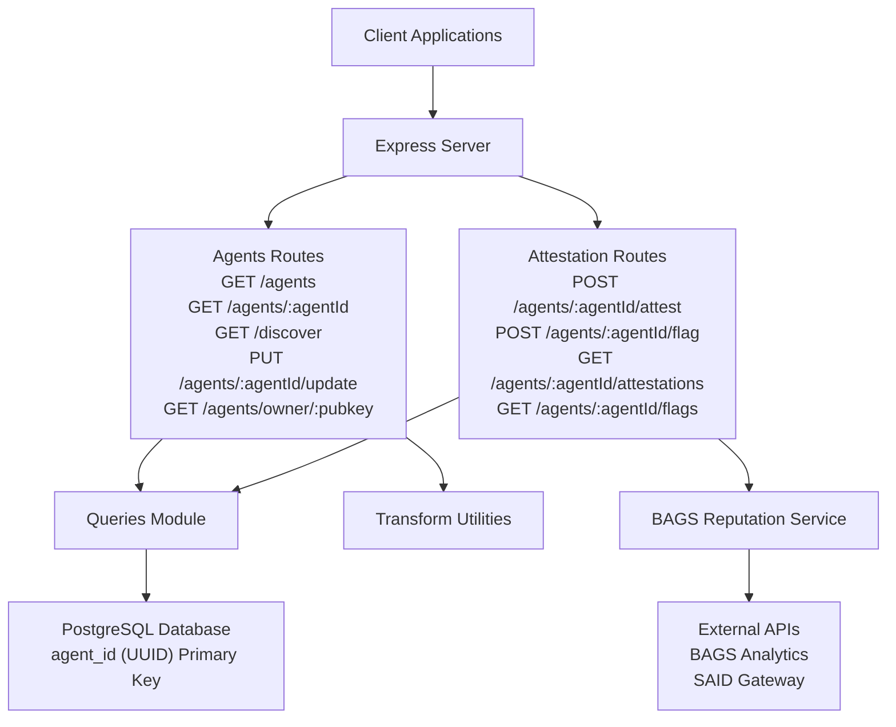
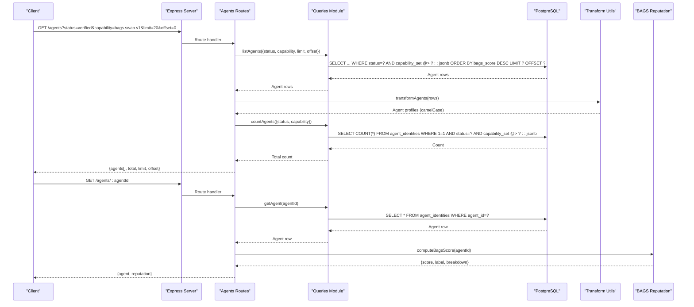
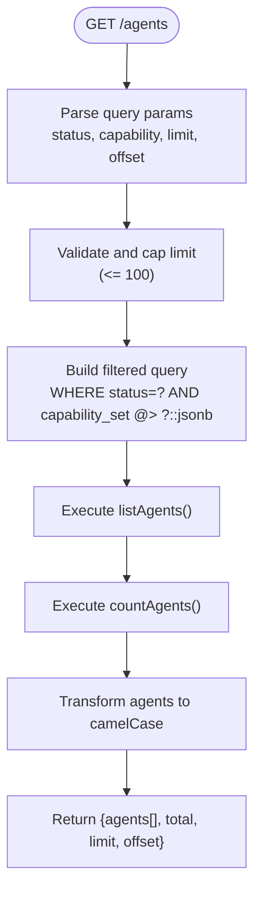
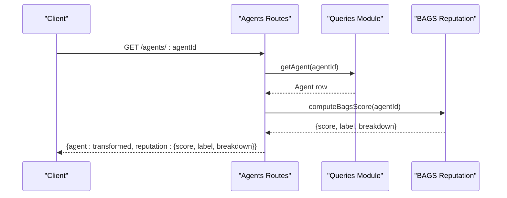
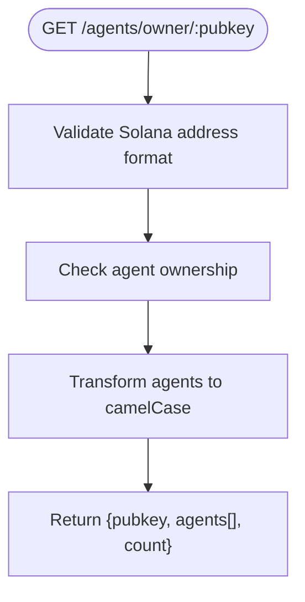
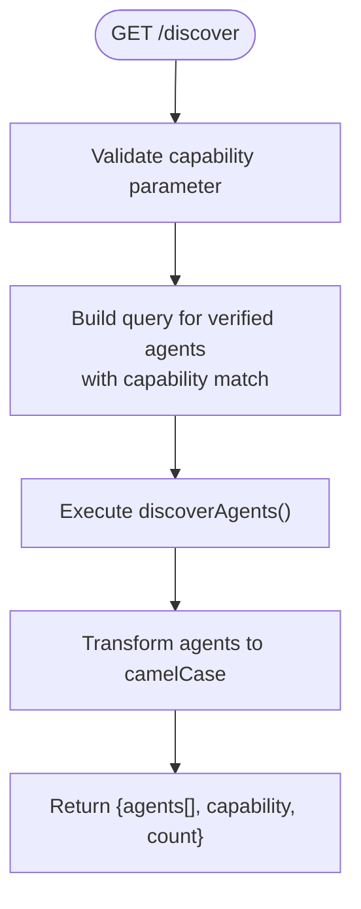
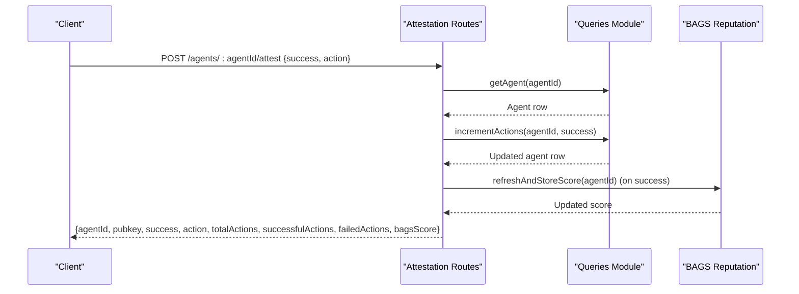
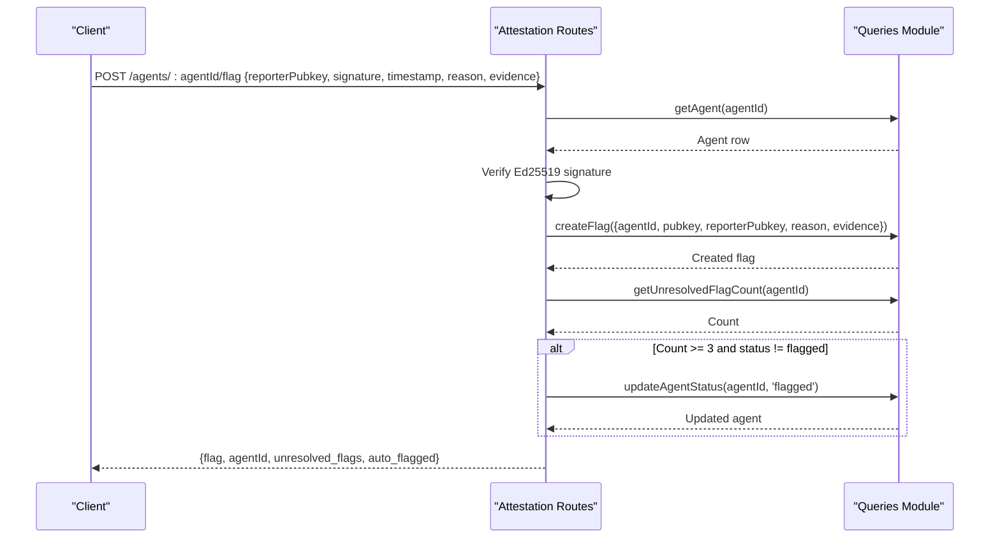
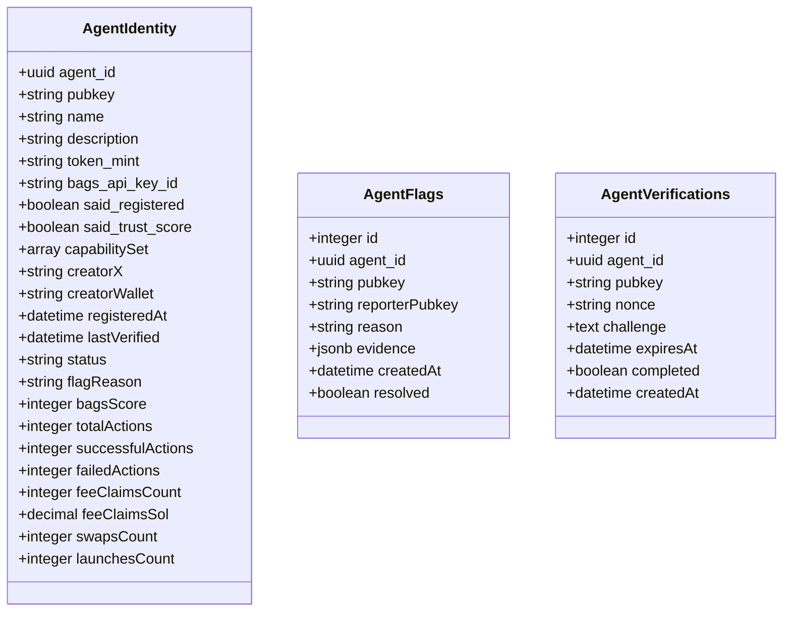
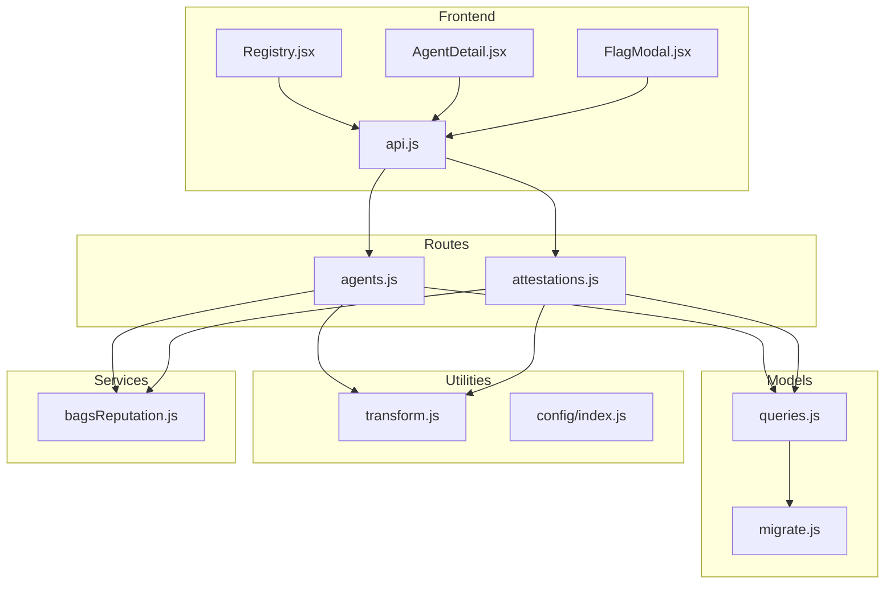

# Discovery & Registry Endpoints

<cite>
**Referenced Files in This Document**
- [server.js](file://backend/server.js)
- [agents.js](file://backend/src/routes/agents.js)
- [attestations.js](file://backend/src/routes/attestations.js)
- [queries.js](file://backend/src/models/queries.js)
- [migrate.js](file://backend/src/models/migrate.js)
- [transform.js](file://backend/src/utils/transform.js)
- [bagsReputation.js](file://backend/src/services/bagsReputation.js)
- [api.js](file://frontend/src/lib/api.js)
- [Registry.jsx](file://frontend/src/pages/Registry.jsx)
- [AgentDetail.jsx](file://frontend/src/pages/AgentDetail.jsx)
- [FlagModal.jsx](file://frontend/src/components/FlagModal.jsx)
- [Backend-API-Reference.md](file://AgentID-wiki-temp/Backend-API-Reference.md)
</cite>

## Update Summary
**Changes Made**
- Updated all endpoint parameter references from `:pubkey` to `:agentId`
- Updated agent detail endpoint documentation to reflect UUID-based identification
- Updated all related endpoint examples and response schemas
- Added new agent owner lookup endpoint documentation
- Updated frontend integration examples to use `agentId` parameter

## Table of Contents
1. [Introduction](#introduction)
2. [Project Structure](#project-structure)
3. [Core Components](#core-components)
4. [Architecture Overview](#architecture-overview)
5. [Detailed Component Analysis](#detailed-component-analysis)
6. [Dependency Analysis](#dependency-analysis)
7. [Performance Considerations](#performance-considerations)
8. [Troubleshooting Guide](#troubleshooting-guide)
9. [Conclusion](#conclusion)

## Introduction
This document provides comprehensive API documentation for AgentID's discovery and registry endpoints. It covers:
- Agent registry listing with filtering and pagination
- Agent detail retrieval with reputation scoring using UUID-based identification
- Agent attestation submissions
- Community flagging mechanism
- Moderation workflows and automatic status updates
- Frontend integration patterns and examples

The documentation focuses on the `/agents` GET endpoint for registry listing, the `/agents/:agentId` GET endpoint for agent detail retrieval, the `/agents/:agentId/attest` POST endpoint for attestation submissions, and the `/agents/:agentId/flag` POST endpoint for community flagging. It includes query parameters, response schemas, and practical examples.

**Updated** The endpoint parameter has been standardized to use `:agentId` (UUID) instead of `:pubkey` throughout the discovery and registry system for consistent UUID-based identification.

## Project Structure
The API is implemented using Express.js with PostgreSQL persistence. The backend exposes REST endpoints organized by feature modules:
- Routes: `/agents`, `/discover`, `/agents/:agentId`, `/agents/:agentId/update`
- Attestation routes: `/agents/:agentId/attest`, `/agents/:agentId/flag`, `/agents/:agentId/attestations`, `/agents/:agentId/flags`
- Owner lookup routes: `/agents/owner/:pubkey`
- Models: database queries and transformations
- Services: reputation computation and external integrations
- Frontend: API client and UI components for registry browsing and flagging

**Diagram sources**
- [server.js:55-62](file://backend/server.js#L55-L62)
- [agents.js:19-114](file://backend/src/routes/agents.js#L19-L114)
- [attestations.js:19-189](file://backend/src/routes/attestations.js#L19-L189)
- [queries.js:1-404](file://backend/src/models/queries.js#L1-L404)
- [transform.js:1-89](file://backend/src/utils/transform.js#L1-L89)
- [bagsReputation.js:1-146](file://backend/src/services/bagsReputation.js#L1-L146)

**Section sources**
- [server.js:55-62](file://backend/server.js#L55-L62)
- [agents.js:19-114](file://backend/src/routes/agents.js#L19-L114)
- [attestations.js:19-189](file://backend/src/routes/attestations.js#L19-L189)

## Core Components

### Agent Registry Endpoint
The primary registry endpoint lists agents with optional filtering and pagination:
- Path: `GET /agents`
- Query parameters:
  - `status`: Filter by agent status (e.g., verified, flagged)
  - `capability`: Filter by capability (exact match against capability set)
  - `limit`: Maximum number of results (default 50, max 100)
  - `offset`: Pagination offset (default 0)
- Response schema:
  - `agents`: Array of agent profiles (transformed to camelCase)
  - `total`: Total count matching filters
  - `limit`: Applied limit
  - `offset`: Applied offset

### Agent Detail Endpoint
Retrieves a single agent with reputation details using UUID-based identification:
- Path: `GET /agents/:agentId`
- Path parameters:
  - `agentId`: Agent UUID (primary key)
- Response schema:
  - `agent`: Transformed agent profile
  - `reputation`: Computed BAGS score with label and breakdown

### Agent Owner Lookup Endpoint
Retrieves all agents owned by a specific public key:
- Path: `GET /agents/owner/:pubkey`
- Path parameters:
  - `pubkey`: Agent public key (Solana address format)
- Response schema:
  - `pubkey`: The owner's public key
  - `agents`: Array of agent profiles owned by the pubkey
  - `count`: Number of agents owned

### Discovery Endpoint
A2A discovery for capability-based matching:
- Path: `GET /discover`
- Query parameters:
  - `capability`: Required capability to match
- Response schema:
  - `agents`: Verified agents matching the capability
  - `capability`: Provided capability
  - `count`: Number of matched agents

### Attestation Submission Endpoint
Records successful/failed action outcomes:
- Path: `POST /agents/:agentId/attest`
- Path parameters:
  - `agentId`: Agent UUID (primary key)
- Request body:
  - `success`: Boolean indicating outcome
  - `action`: Optional action identifier
- Response schema:
  - `agentId`: Agent UUID
  - `pubkey`: Agent public key
  - `success`: Outcome recorded
  - `action`: Provided action identifier
  - `totalActions`, `successfulActions`, `failedActions`: Updated counters
  - `bagsScore`: Updated BAGS score

### Flag Reporting Endpoint
Community flagging of suspicious behavior:
- Path: `POST /agents/:agentId/flag`
- Path parameters:
  - `agentId`: Agent UUID (primary key)
- Request body:
  - `reporterPubkey`: Reporter's public key (Solana address)
  - `signature`: Ed25519 signature (base58)
  - `timestamp`: Request timestamp (milliseconds)
  - `reason`: Non-empty reason for flagging
  - `evidence`: Optional JSON evidence
- Response schema:
  - `flag`: Created flag record
  - `agentId`: Agent UUID
  - `unresolved_flags`: Current unresolved flag count
  - `auto_flagged`: Indicates automatic status change to flagged

### Moderation Workflow
Automatic moderation triggers when unresolved flags reach threshold:
- Threshold: 3 unresolved flags
- Automatic status: Updates agent status to flagged
- Note: Signature verification for reporter identity is implemented with Ed25519

**Section sources**
- [agents.js:23-55](file://backend/src/routes/agents.js#L23-L55)
- [agents.js:61-87](file://backend/src/routes/agents.js#L61-L87)
- [agents.js:81-111](file://backend/src/routes/agents.js#L81-L111)
- [agents.js:113-138](file://backend/src/routes/agents.js#L113-L138)
- [attestations.js:25-75](file://backend/src/routes/attestations.js#L25-L75)
- [attestations.js:77-183](file://backend/src/routes/attestations.js#L77-L183)

## Architecture Overview

**Diagram sources**
- [agents.js:23-87](file://backend/src/routes/agents.js#L23-L87)
- [queries.js:116-145](file://backend/src/models/queries.js#L116-L145)
- [queries.js:359-375](file://backend/src/models/queries.js#L359-L375)
- [transform.js:43-65](file://backend/src/utils/transform.js#L43-L65)
- [bagsReputation.js:16-122](file://backend/src/services/bagsReputation.js#L16-L122)

## Detailed Component Analysis

### Agent Registry Listing (`/agents`)
The registry endpoint supports:
- Filtering by status and capability
- Pagination with configurable limits
- Sorting by BAGS score (descending)
- Response transformation to camelCase for frontend compatibility

**Diagram sources**
- [agents.js:23-55](file://backend/src/routes/agents.js#L23-L55)
- [queries.js:116-145](file://backend/src/models/queries.js#L116-L145)
- [queries.js:359-375](file://backend/src/models/queries.js#L359-L375)
- [transform.js:43-65](file://backend/src/utils/transform.js#L43-L65)

**Section sources**
- [agents.js:23-55](file://backend/src/routes/agents.js#L23-L55)
- [queries.js:116-145](file://backend/src/models/queries.js#L116-L145)
- [queries.js:359-375](file://backend/src/models/queries.js#L359-L375)
- [transform.js:43-65](file://backend/src/utils/transform.js#L43-L65)

### Agent Detail Retrieval (`/agents/:agentId`)
Retrieves agent details and computes reputation using UUID-based identification:
- Fetches agent by UUID (agent_id)
- Computes BAGS score with detailed breakdown
- Returns transformed agent profile with reputation metadata

**Diagram sources**
- [agents.js:81-111](file://backend/src/routes/agents.js#L81-L111)
- [queries.js:31-39](file://backend/src/models/queries.js#L31-L39)
- [bagsReputation.js:16-122](file://backend/src/services/bagsReputation.js#L16-L122)

**Section sources**
- [agents.js:81-111](file://backend/src/routes/agents.js#L81-L111)
- [bagsReputation.js:16-122](file://backend/src/services/bagsReputation.js#L16-L122)

### Agent Owner Lookup (`/agents/owner/:pubkey`)
Retrieves all agents owned by a specific public key:
- Validates Solana address format
- Fetches all agents with matching pubkey
- Returns agent array with count

**Diagram sources**
- [agents.js:57-79](file://backend/src/routes/agents.js#L57-L79)
- [queries.js:51-75](file://backend/src/models/queries.js#L51-L75)

**Section sources**
- [agents.js:57-79](file://backend/src/routes/agents.js#L57-L79)
- [queries.js:51-75](file://backend/src/models/queries.js#L51-L75)

### Discovery Endpoint (`/discover`)
A2A discovery for capability-based matching:
- Filters verified agents by capability
- Returns top agents sorted by BAGS score
- Supports optional capability parameter

**Diagram sources**
- [agents.js:113-138](file://backend/src/routes/agents.js#L113-L138)
- [queries.js:332-357](file://backend/src/models/queries.js#L332-L357)

**Section sources**
- [agents.js:113-138](file://backend/src/routes/agents.js#L113-L138)
- [queries.js:332-357](file://backend/src/models/queries.js#L332-L357)

### Attestation Submission (`/agents/:agentId/attest`)
Records action outcomes and updates reputation:
- Validates success boolean
- Increments action counters
- Refreshes BAGS score on successful actions
- Returns updated agent metrics

**Diagram sources**
- [attestations.js:25-75](file://backend/src/routes/attestations.js#L25-L75)
- [queries.js:168-180](file://backend/src/models/queries.js#L168-L180)
- [bagsReputation.js:129-140](file://backend/src/services/bagsReputation.js#L129-L140)

**Section sources**
- [attestations.js:25-75](file://backend/src/routes/attestations.js#L25-L75)
- [queries.js:168-180](file://backend/src/models/queries.js#L168-L180)
- [bagsReputation.js:129-140](file://backend/src/services/bagsReputation.js#L129-L140)

### Flag Reporting (`/agents/:agentId/flag`)
Community flagging with automatic moderation and cryptographic verification:
- Validates reporterPubkey, signature, and timestamp
- Creates flag record with cryptographic proof-of-ownership
- Counts unresolved flags
- Auto-flags agents with 3+ unresolved flags
- Returns flag creation details

**Diagram sources**
- [attestations.js:77-183](file://backend/src/routes/attestations.js#L77-L183)
- [queries.js:267-305](file://backend/src/models/queries.js#L267-L305)

**Section sources**
- [attestations.js:77-183](file://backend/src/routes/attestations.js#L77-L183)
- [queries.js:267-305](file://backend/src/models/queries.js#L267-L305)

### Data Model and Transformation
The backend uses a unified transformation layer to convert database rows to camelCase for API responses and maps capability sets appropriately. The database schema uses UUID as the primary key for agent identification.

**Diagram sources**
- [migrate.js:11-56](file://backend/src/models/migrate.js#L11-L56)

**Section sources**
- [migrate.js:11-56](file://backend/src/models/migrate.js#L11-L56)
- [transform.js:43-65](file://backend/src/utils/transform.js#L43-L65)

## Dependency Analysis

**Diagram sources**
- [agents.js:9-12](file://backend/src/routes/agents.js#L9-L12)
- [attestations.js:7-17](file://backend/src/routes/attestations.js#L7-L17)
- [queries.js:6](file://backend/src/models/queries.js#L6)
- [transform.js:12](file://backend/src/utils/transform.js#L12)
- [bagsReputation.js:9](file://backend/src/services/bagsReputation.js#L9)
- [api.js:35-137](file://frontend/src/lib/api.js#L35-L137)

**Section sources**
- [agents.js:9-12](file://backend/src/routes/agents.js#L9-L12)
- [attestations.js:7-17](file://backend/src/routes/attestations.js#L7-L17)
- [queries.js:6](file://backend/src/models/queries.js#L6)
- [transform.js:12](file://backend/src/utils/transform.js#L12)
- [bagsReputation.js:9](file://backend/src/services/bagsReputation.js#L9)
- [api.js:35-137](file://frontend/src/lib/api.js#L35-L137)

## Performance Considerations
- Pagination limits: The registry enforces a maximum limit of 100 to prevent excessive load.
- Database indexing: Strategic indexes on agent_id (UUID), status, BAGS score, and flag resolution improve query performance.
- JSONB operations: Capability filtering uses PostgreSQL JSONB containment operators for efficient matching.
- Reputation caching: BAGS score computation integrates with external APIs; consider caching strategies for high-traffic scenarios.
- Rate limiting: Default rate limiter protects endpoints from abuse while allowing reasonable throughput.
- UUID vs Pubkey: Using UUIDs provides better performance for foreign key relationships and indexing compared to base58-encoded public keys.

## Troubleshooting Guide
Common issues and resolutions:
- Agent not found errors: Ensure the agentId exists in the database before querying details or submitting attestations.
- Invalid signature errors: For agent updates and flagging, verify Ed25519 signatures and timestamp windows.
- Flag submission failures: Validate reporterPubkey format, signature, and timestamp fields; ensure evidence is valid JSON when provided.
- Excessive pagination: Respect the maximum limit of 100 per page to avoid performance degradation.
- Reputation computation timeouts: External API calls may fail; implement retry logic and fallback scoring.
- UUID format issues: Ensure agentId parameters are valid UUID v4 format when using direct API calls.

**Section sources**
- [agents.js:120-247](file://backend/src/routes/agents.js#L120-L247)
- [attestations.js:25-183](file://backend/src/routes/attestations.js#L25-L183)

## Conclusion
The AgentID discovery and registry endpoints provide a robust foundation for agent discovery, reputation management, and community moderation. The API supports capability-based filtering, comprehensive pagination, and integrated reputation scoring using UUID-based identification. The attestation and flagging mechanisms enable community-driven quality assurance with automated moderation workflows. The frontend components demonstrate practical integration patterns for registry browsing and flag reporting. The transition to UUID-based identification improves system consistency and performance while maintaining backward compatibility for owner lookup functionality.