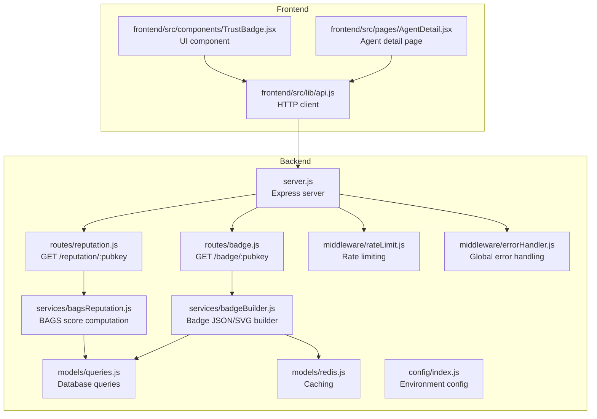
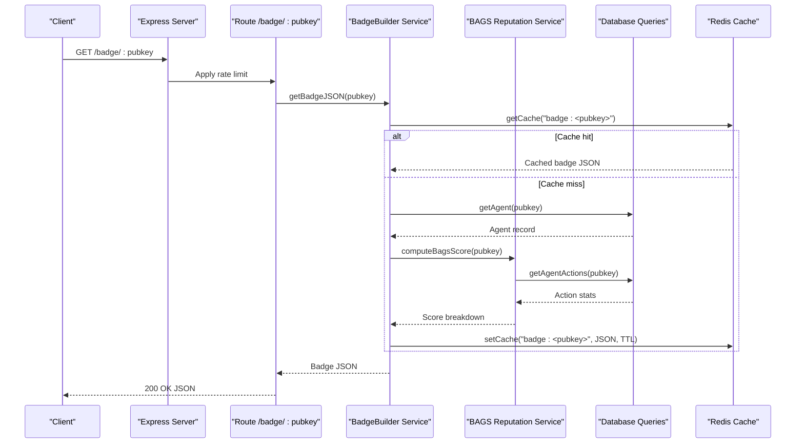
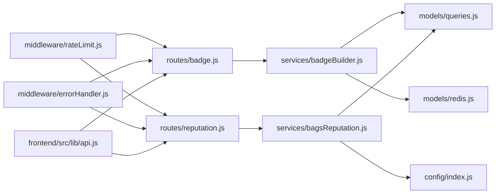

# Trust & Reputation Endpoints

<cite>
**Referenced Files in This Document**
- [server.js](file://backend/server.js)
- [badge.js](file://backend/src/routes/badge.js)
- [reputation.js](file://backend/src/routes/reputation.js)
- [badgeBuilder.js](file://backend/src/services/badgeBuilder.js)
- [bagsReputation.js](file://backend/src/services/bagsReputation.js)
- [queries.js](file://backend/src/models/queries.js)
- [redis.js](file://backend/src/models/redis.js)
- [rateLimit.js](file://backend/src/middleware/rateLimit.js)
- [errorHandler.js](file://backend/src/middleware/errorHandler.js)
- [config/index.js](file://backend/src/config/index.js)
- [api.js](file://frontend/src/lib/api.js)
- [TrustBadge.jsx](file://frontend/src/components/TrustBadge.jsx)
- [AgentDetail.jsx](file://frontend/src/pages/AgentDetail.jsx)
</cite>

## Table of Contents
1. [Introduction](#introduction)
2. [Project Structure](#project-structure)
3. [Core Components](#core-components)
4. [Architecture Overview](#architecture-overview)
5. [Detailed Component Analysis](#detailed-component-analysis)
6. [Dependency Analysis](#dependency-analysis)
7. [Performance Considerations](#performance-considerations)
8. [Troubleshooting Guide](#troubleshooting-guide)
9. [Conclusion](#conclusion)

## Introduction
This document provides API documentation for AgentID’s trust and reputation endpoints. It covers:
- The /badge/:pubkey GET endpoint for retrieving trust badge JSON with reputation scores, capability badges, and trust indicators.
- The /reputation/:pubkey GET endpoint for detailed reputation breakdown including BAGS ecosystem scores, community ratings, and trust calculations.

It documents request parameters, response schemas, caching behavior, error handling, and integration patterns for displaying trust information.

## Project Structure
The trust and reputation features are implemented in the backend API server and consumed by the frontend React application.

**Diagram sources**
- [server.js:55-62](file://backend/server.js#L55-L62)
- [badge.js:16-32](file://backend/src/routes/badge.js#L16-L32)
- [reputation.js:17-41](file://backend/src/routes/reputation.js#L17-L41)
- [badgeBuilder.js:17-83](file://backend/src/services/badgeBuilder.js#L17-L83)
- [bagsReputation.js:16-122](file://backend/src/services/bagsReputation.js#L16-L122)
- [queries.js:36-38](file://backend/src/models/queries.js#L36-L38)
- [redis.js:41-71](file://backend/src/models/redis.js#L41-L71)
- [rateLimit.js:45-48](file://backend/src/middleware/rateLimit.js#L45-L48)
- [errorHandler.js:15-41](file://backend/src/middleware/errorHandler.js#L15-L41)
- [config/index.js:26](file://backend/src/config/index.js#L26)
- [api.js:53-62](file://frontend/src/lib/api.js#L53-L62)
- [TrustBadge.jsx:42-145](file://frontend/src/components/TrustBadge.jsx#L42-L145)
- [AgentDetail.jsx:180-212](file://frontend/src/pages/AgentDetail.jsx#L180-L212)

**Section sources**
- [server.js:55-62](file://backend/server.js#L55-L62)
- [badge.js:16-32](file://backend/src/routes/badge.js#L16-L32)
- [reputation.js:17-41](file://backend/src/routes/reputation.js#L17-L41)

## Core Components
- Route handlers for badge and reputation endpoints.
- Services that compute trust scores and build badge artifacts.
- Database queries for agent data and action statistics.
- Redis caching for badge JSON.
- Rate limiting and global error handling.

**Section sources**
- [badge.js:16-32](file://backend/src/routes/badge.js#L16-L32)
- [reputation.js:17-41](file://backend/src/routes/reputation.js#L17-L41)
- [badgeBuilder.js:17-83](file://backend/src/services/badgeBuilder.js#L17-L83)
- [bagsReputation.js:16-122](file://backend/src/services/bagsReputation.js#L16-L122)
- [queries.js:36-38](file://backend/src/models/queries.js#L36-L38)
- [redis.js:41-71](file://backend/src/models/redis.js#L41-L71)
- [rateLimit.js:45-48](file://backend/src/middleware/rateLimit.js#L45-L48)
- [errorHandler.js:15-41](file://backend/src/middleware/errorHandler.js#L15-L41)

## Architecture Overview
The trust and reputation endpoints follow a layered architecture:
- HTTP routes accept requests and apply rate limiting.
- Services compute reputation and assemble badge data.
- Database queries fetch agent and action metrics.
- Redis caches badge JSON for performance.
- Frontend consumes endpoints and renders trust badges.

**Diagram sources**
- [badge.js:16-32](file://backend/src/routes/badge.js#L16-L32)
- [badgeBuilder.js:17-83](file://backend/src/services/badgeBuilder.js#L17-L83)
- [bagsReputation.js:16-122](file://backend/src/services/bagsReputation.js#L16-L122)
- [queries.js:36-38](file://backend/src/models/queries.js#L36-L38)
- [redis.js:41-71](file://backend/src/models/redis.js#L41-L71)

## Detailed Component Analysis

### Endpoint: GET /badge/:pubkey
Purpose: Retrieve trust badge JSON containing reputation scores, capability badges, and trust indicators.

- Path: `/badge/:pubkey`
- Method: GET
- Rate limit: defaultLimiter (100 requests per 15 minutes per IP)
- Request parameters:
  - pubkey: string (path parameter)
- Response:
  - 200 OK: JSON object with badge metadata and reputation metrics
  - 404 Not Found: JSON with error field when agent is not found
  - 429 Too Many Requests: JSON with rate limit error
  - 500 Internal Server Error: JSON with error details (global handler)
- Caching:
  - Cache key: `badge:<pubkey>`
  - TTL: BADGE_CACHE_TTL seconds (default 60)
  - Redis used for cache get/set
- Error handling:
  - Specific 404 for “Agent not found”
  - Global error handler for other exceptions

Response schema (fields):
- pubkey: string
- name: string
- status: enum ["verified", "unverified", "flagged"]
- badge: emoji character
- label: string
- score: number (trust score)
- bags_score: number (alias of score)
- saidTrustScore: number (from SAID trust)
- saidLabel: string (SAID trust label)
- registeredAt: datetime string
- lastVerified: datetime string
- totalActions: number
- successRate: number (0..1)
- capabilities: string[]
- tokenMint: string
- widgetUrl: string

Integration patterns:
- Frontend calls getBadge(pubkey) and renders TrustBadge component.
- Frontend can also fetch SVG via /badge/:pubkey/svg.

Example usage:
- Fetch badge JSON: GET /badge/:pubkey
- Embed SVG: GET /badge/:pubkey/svg

**Section sources**
- [badge.js:16-32](file://backend/src/routes/badge.js#L16-L32)
- [badgeBuilder.js:17-83](file://backend/src/services/badgeBuilder.js#L17-L83)
- [redis.js:41-71](file://backend/src/models/redis.js#L41-L71)
- [config/index.js:26](file://backend/src/config/index.js#L26)
- [api.js:53-56](file://frontend/src/lib/api.js#L53-L56)
- [TrustBadge.jsx:42-145](file://frontend/src/components/TrustBadge.jsx#L42-L145)

### Endpoint: GET /reputation/:pubkey
Purpose: Retrieve detailed reputation breakdown including BAGS ecosystem scores, community ratings, and trust calculations.

- Path: `/reputation/:pubkey`
- Method: GET
- Rate limit: defaultLimiter (100 requests per 15 minutes per IP)
- Request parameters:
  - pubkey: string (path parameter)
- Response:
  - 200 OK: JSON with score, label, and breakdown
  - 404 Not Found: JSON with error field when agent is not found
  - 429 Too Many Requests: JSON with rate limit error
  - 500 Internal Server Error: JSON with error details (global handler)
- Processing logic:
  - Validates agent existence
  - Computes BAGS score from five factors:
    - Fee activity (max 30)
    - Success rate (max 25)
    - Registration age (max 20)
    - SAID trust score (max 15)
    - Community verification (max 10)
  - Aggregates total score (0–100) and assigns label ("HIGH", "MEDIUM", "LOW", "UNVERIFIED")

Response schema (fields):
- pubkey: string
- score: number (0–100)
- label: string
- breakdown: object
  - feeActivity: { score, max }
  - successRate: { score, max }
  - age: { score, max }
  - saidTrust: { score, max }
  - community: { score, max }

Example usage:
- GET /reputation/:pubkey
- Frontend displays ReputationBreakdown component

**Section sources**
- [reputation.js:17-41](file://backend/src/routes/reputation.js#L17-L41)
- [bagsReputation.js:16-122](file://backend/src/services/bagsReputation.js#L16-L122)
- [queries.js:36-38](file://backend/src/models/queries.js#L36-L38)
- [api.js:59-62](file://frontend/src/lib/api.js#L59-L62)

### Badge JSON Generation and Caching
- getBadgeJSON(pubkey):
  - Checks Redis cache first
  - Loads agent and computes BAGS score
  - Calculates success rate from agent actions
  - Determines status and label based on agent status and score
  - Builds badge JSON with metadata and metrics
  - Stores result in Redis with TTL

- getBadgeSVG(pubkey):
  - Reuses badge JSON to render SVG with status-specific colors and layout

- Redis cache:
  - getCache(key): returns parsed JSON or null
  - setCache(key, value, ttlSeconds): stores JSON string with TTL

**Section sources**
- [badgeBuilder.js:17-83](file://backend/src/services/badgeBuilder.js#L17-L83)
- [badgeBuilder.js:90-162](file://backend/src/services/badgeBuilder.js#L90-L162)
- [redis.js:41-71](file://backend/src/models/redis.js#L41-L71)
- [config/index.js:26](file://backend/src/config/index.js#L26)

### BAGS Reputation Computation
- Factors and scoring:
  - Fee activity: external API call to BAGS analytics; scales by SOL fees
  - Success rate: ratio of successful actions to total actions
  - Registration age: days since registration (capped)
  - SAID trust score: external trust score scaled to 15 points
  - Community verification: resolves to 10, 5, or 0 based on unresolved flags

- Label thresholds:
  - >= 80: HIGH
  - >= 60: MEDIUM
  - >= 40: LOW
  - < 40: UNVERIFIED

**Section sources**
- [bagsReputation.js:16-122](file://backend/src/services/bagsReputation.js#L16-L122)
- [queries.js:187-202](file://backend/src/models/queries.js#L187-L202)
- [queries.js:299-305](file://backend/src/models/queries.js#L299-L305)

### Frontend Integration Patterns
- API client:
  - getBadge(pubkey) and getReputation(pubkey) wrap HTTP calls
  - getBadgeSvg(pubkey) fetches SVG

- UI components:
  - TrustBadge renders status, name, score, and metadata
  - AgentDetail page loads agent, badge, reputation, and flags concurrently

**Section sources**
- [api.js:53-62](file://frontend/src/lib/api.js#L53-L62)
- [TrustBadge.jsx:42-145](file://frontend/src/components/TrustBadge.jsx#L42-L145)
- [AgentDetail.jsx:180-212](file://frontend/src/pages/AgentDetail.jsx#L180-L212)

## Dependency Analysis

**Diagram sources**
- [badge.js:16-32](file://backend/src/routes/badge.js#L16-L32)
- [reputation.js:17-41](file://backend/src/routes/reputation.js#L17-L41)
- [badgeBuilder.js:17-83](file://backend/src/services/badgeBuilder.js#L17-L83)
- [bagsReputation.js:16-122](file://backend/src/services/bagsReputation.js#L16-L122)
- [queries.js:36-38](file://backend/src/models/queries.js#L36-L38)
- [redis.js:41-71](file://backend/src/models/redis.js#L41-L71)
- [rateLimit.js:45-48](file://backend/src/middleware/rateLimit.js#L45-L48)
- [errorHandler.js:15-41](file://backend/src/middleware/errorHandler.js#L15-L41)
- [config/index.js:26](file://backend/src/config/index.js#L26)
- [api.js:53-62](file://frontend/src/lib/api.js#L53-L62)

**Section sources**
- [badge.js:16-32](file://backend/src/routes/badge.js#L16-L32)
- [reputation.js:17-41](file://backend/src/routes/reputation.js#L17-L41)
- [badgeBuilder.js:17-83](file://backend/src/services/badgeBuilder.js#L17-L83)
- [bagsReputation.js:16-122](file://backend/src/services/bagsReputation.js#L16-L122)
- [queries.js:36-38](file://backend/src/models/queries.js#L36-L38)
- [redis.js:41-71](file://backend/src/models/redis.js#L41-L71)
- [rateLimit.js:45-48](file://backend/src/middleware/rateLimit.js#L45-L48)
- [errorHandler.js:15-41](file://backend/src/middleware/errorHandler.js#L15-L41)
- [config/index.js:26](file://backend/src/config/index.js#L26)
- [api.js:53-62](file://frontend/src/lib/api.js#L53-L62)

## Performance Considerations
- Caching:
  - Badge JSON is cached in Redis with TTL controlled by BADGE_CACHE_TTL (default 60 seconds). This reduces repeated computation and external API calls.
- Rate limiting:
  - defaultLimiter enforces 100 requests per 15 minutes per IP to prevent abuse.
- External dependencies:
  - BAGS analytics and SAID gateway calls are subject to network latency and availability. Failures are handled gracefully by falling back to zero or default scores.
- Concurrency:
  - Frontend can fetch badge and reputation in parallel to reduce perceived latency.

[No sources needed since this section provides general guidance]

## Troubleshooting Guide
Common issues and resolutions:
- 404 Not Found for /badge/:pubkey or /reputation/:pubkey:
  - The agent pubkey does not exist in the database. Verify the pubkey and ensure the agent is registered.
- 429 Too Many Requests:
  - Exceeded rate limit. Reduce request frequency or adjust rate limiting configuration.
- 500 Internal Server Error:
  - Unexpected server error. Check server logs for stack traces and error details (in development mode).
- Redis connectivity issues:
  - Redis errors are logged and do not crash the service. Cache operations fall back gracefully.
- External API failures:
  - BAGS analytics or SAID gateway unavailability results in zero or default scores for affected factors.

**Section sources**
- [badge.js:24-30](file://backend/src/routes/badge.js#L24-L30)
- [reputation.js:23-28](file://backend/src/routes/reputation.js#L23-L28)
- [rateLimit.js:37-41](file://backend/src/middleware/rateLimit.js#L37-L41)
- [errorHandler.js:15-41](file://backend/src/middleware/errorHandler.js#L15-L41)
- [redis.js:27-30](file://backend/src/models/redis.js#L27-L30)
- [bagsReputation.js:35-38](file://backend/src/services/bagsReputation.js#L35-L38)
- [bagsReputation.js:72-75](file://backend/src/services/bagsReputation.js#L72-L75)

## Conclusion
The trust and reputation endpoints provide a robust foundation for displaying agent trust information:
- /badge/:pubkey delivers a cached JSON payload enriched with reputation metrics and capability badges.
- /reputation/:pubkey exposes a detailed breakdown of the BAGS score and underlying factors.
- The system integrates caching, rate limiting, and graceful error handling to ensure reliability and performance.
- Frontend components consume these endpoints to render trust badges and reputation details effectively.