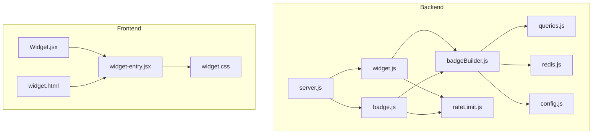
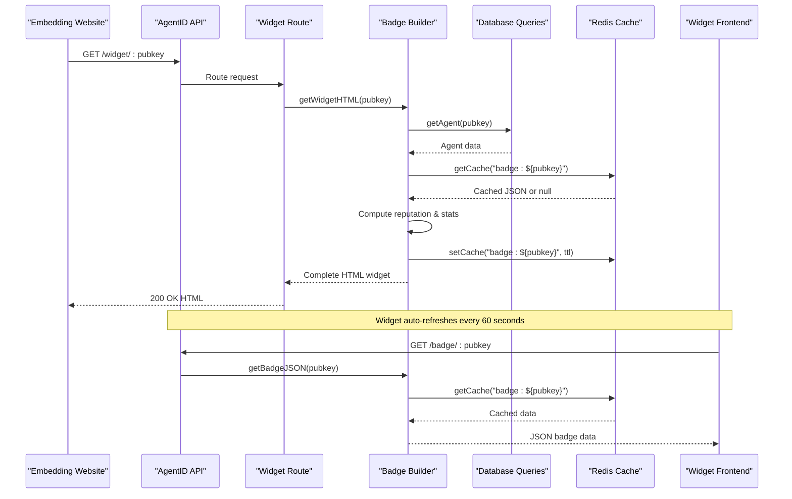
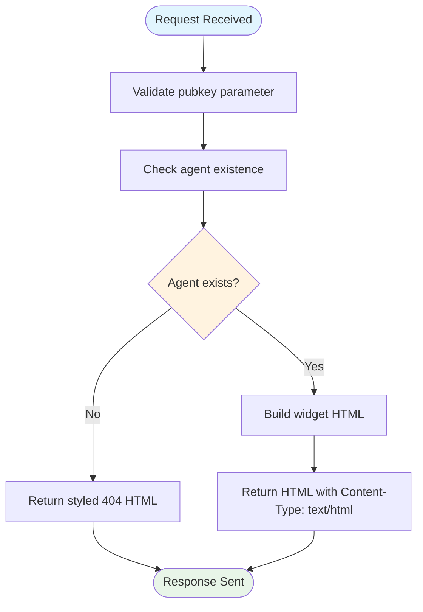
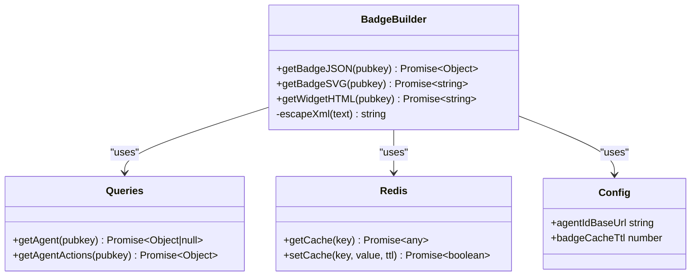
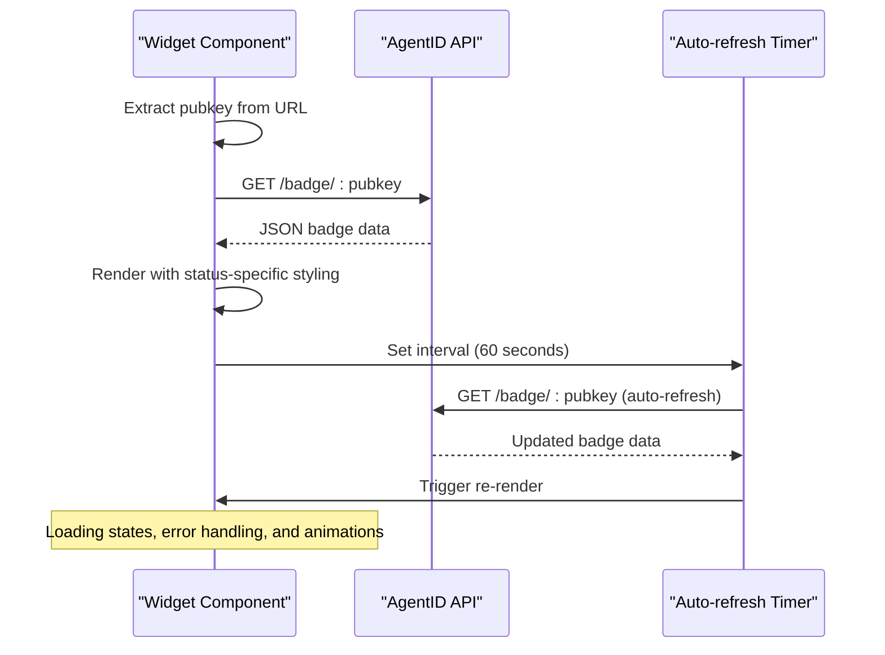
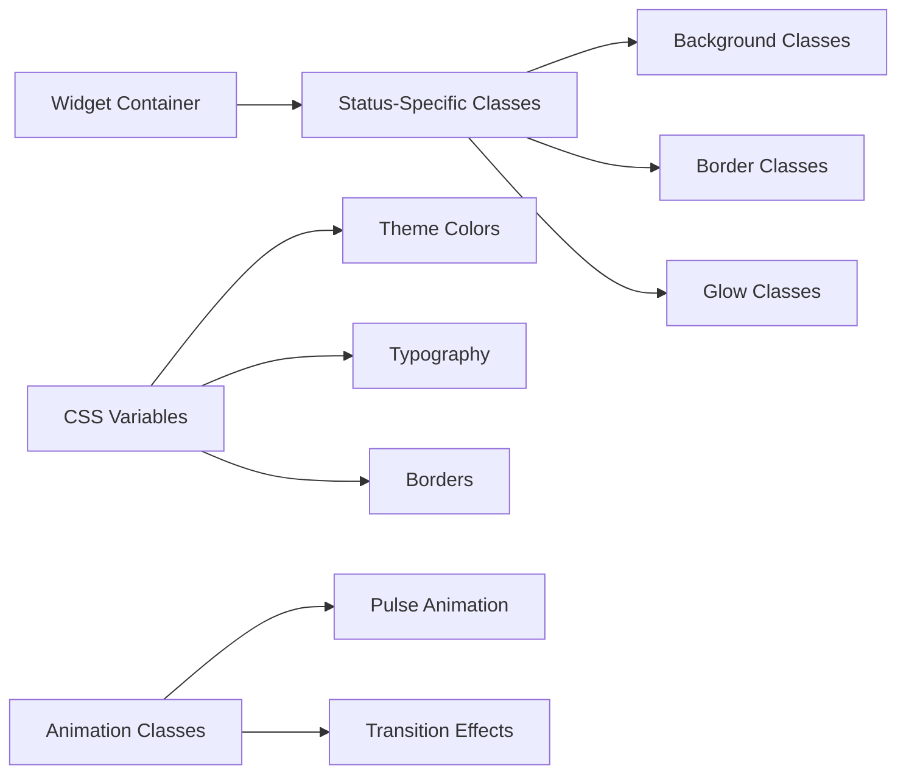
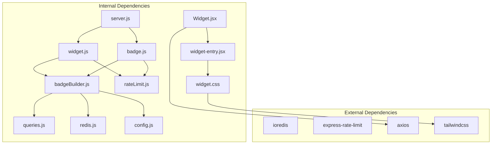

# Widget Endpoints

<cite>
**Referenced Files in This Document**
- [server.js](file://backend/server.js)
- [widget.js](file://backend/src/routes/widget.js)
- [badge.js](file://backend/src/routes/badge.js)
- [badgeBuilder.js](file://backend/src/services/badgeBuilder.js)
- [queries.js](file://backend/src/models/queries.js)
- [redis.js](file://backend/src/models/redis.js)
- [rateLimit.js](file://backend/src/middleware/rateLimit.js)
- [config.js](file://backend/src/config/index.js)
- [Widget.jsx](file://frontend/src/widget/Widget.jsx)
- [widget-entry.jsx](file://frontend/src/widget/widget-entry.jsx)
- [widget.css](file://frontend/src/widget/widget.css)
- [widget.html](file://frontend/widget.html)
</cite>

## Table of Contents
1. [Introduction](#introduction)
2. [Project Structure](#project-structure)
3. [Core Components](#core-components)
4. [Architecture Overview](#architecture-overview)
5. [Detailed Component Analysis](#detailed-component-analysis)
6. [Dependency Analysis](#dependency-analysis)
7. [Performance Considerations](#performance-considerations)
8. [Troubleshooting Guide](#troubleshooting-guide)
9. [Conclusion](#conclusion)

## Introduction
This document provides comprehensive API documentation for AgentID's widget endpoints that power embeddable trust badge widgets. It covers two primary endpoints:
- `/widget/:pubkey` - Returns an embeddable HTML widget suitable for iframe embedding
- `/badge/:pubkey/svg` - Returns a direct SVG badge for programmatic use

The documentation includes widget embedding parameters, customization options, CSS styling hooks, JavaScript integration patterns, initialization procedures, real-time updates, cache behavior, performance optimization strategies, and troubleshooting guidance.

## Project Structure
The widget functionality spans both backend and frontend components:

**Diagram sources**
- [server.js:1-91](file://backend/server.js#L1-L91)
- [widget.js:1-89](file://backend/src/routes/widget.js#L1-L89)
- [badge.js:1-58](file://backend/src/routes/badge.js#L1-L58)
- [badgeBuilder.js:1-497](file://backend/src/services/badgeBuilder.js#L1-L497)
- [queries.js:1-404](file://backend/src/models/queries.js#L1-L404)
- [redis.js:1-94](file://backend/src/models/redis.js#L1-L94)
- [rateLimit.js:1-62](file://backend/src/middleware/rateLimit.js#L1-L62)
- [config.js:1-31](file://backend/src/config/index.js#L1-L31)
- [Widget.jsx:1-218](file://frontend/src/widget/Widget.jsx#L1-L218)
- [widget-entry.jsx:1-11](file://frontend/src/widget/widget-entry.jsx#L1-L11)
- [widget.css:1-70](file://frontend/src/widget/widget.css#L1-L70)
- [widget.html:1-16](file://frontend/widget.html#L1-L16)

**Section sources**
- [server.js:20-63](file://backend/server.js#L20-L63)
- [widget.js:14-86](file://backend/src/routes/widget.js#L14-L86)
- [badge.js:12-55](file://backend/src/routes/badge.js#L12-L55)

## Core Components
This section documents the two primary widget endpoints and their associated services.

### Endpoint: GET /widget/:pubkey
Returns an embeddable HTML widget for a given agent public key. The widget is designed for iframe embedding and includes:
- Real-time badge data fetched from the `/badge/:pubkey` endpoint
- Auto-refresh mechanism every 60 seconds
- Responsive layout with dark theme styling
- Live indicator animation

Key behaviors:
- Validates agent existence; returns a styled 404 page if not found
- Uses the badge builder service to generate widget HTML
- Applies rate limiting via the default limiter middleware
- Sets Content-Type to text/html

**Section sources**
- [widget.js:14-86](file://backend/src/routes/widget.js#L14-L86)
- [badgeBuilder.js:169-475](file://backend/src/services/badgeBuilder.js#L169-L475)

### Endpoint: GET /badge/:pubkey/svg
Returns a static SVG representation of the trust badge. The SVG includes:
- Dynamic colors based on agent status (verified, flagged, unverified)
- Agent name, status label, and trust score
- Visual score bar proportional to the trust score
- Optimized for direct embedding in web pages

Key behaviors:
- Computes badge data via the badge builder service
- Applies rate limiting via the default limiter middleware
- Sets Content-Type to image/svg+xml
- Handles agent-not-found errors with JSON response

**Section sources**
- [badge.js:34-55](file://backend/src/routes/badge.js#L34-L55)
- [badgeBuilder.js:85-162](file://backend/src/services/badgeBuilder.js#L85-L162)

### Endpoint: GET /badge/:pubkey (JSON)
Provides structured badge data in JSON format for programmatic consumption. Includes:
- Agent identification and metadata
- Trust score and status information
- Action statistics and success rates
- Capability sets and timestamps
- Widget URL for iframe embedding

**Section sources**
- [badge.js:12-32](file://backend/src/routes/badge.js#L12-L32)
- [badgeBuilder.js:17-83](file://backend/src/services/badgeBuilder.js#L17-L83)

## Architecture Overview
The widget system follows a layered architecture with clear separation between presentation, business logic, and data access:

**Diagram sources**
- [widget.js:18-82](file://backend/src/routes/widget.js#L18-L82)
- [badge.js:16-31](file://backend/src/routes/badge.js#L16-L31)
- [badgeBuilder.js:17-83](file://backend/src/services/badgeBuilder.js#L17-L83)
- [queries.js:36-39](file://backend/src/models/queries.js#L36-L39)
- [redis.js:41-71](file://backend/src/models/redis.js#L41-L71)

## Detailed Component Analysis

### Backend Route Implementation
The backend routes handle widget and badge requests with consistent error handling and rate limiting.

**Diagram sources**
- [widget.js:18-82](file://backend/src/routes/widget.js#L18-L82)

**Section sources**
- [widget.js:18-86](file://backend/src/routes/widget.js#L18-L86)
- [badge.js:16-54](file://backend/src/routes/badge.js#L16-L54)

### Badge Builder Service
The badge builder service orchestrates data fetching, computation, and caching for all badge-related operations.

**Diagram sources**
- [badgeBuilder.js:17-83](file://backend/src/services/badgeBuilder.js#L17-L83)
- [queries.js:36-39](file://backend/src/models/queries.js#L36-L39)
- [redis.js:41-71](file://backend/src/models/redis.js#L41-L71)
- [config.js:14](file://backend/src/config/index.js#L14)

**Section sources**
- [badgeBuilder.js:17-162](file://backend/src/services/badgeBuilder.js#L17-L162)

### Frontend Widget Component
The frontend widget component handles real-time updates and responsive design.

**Diagram sources**
- [Widget.jsx:67-102](file://frontend/src/widget/Widget.jsx#L67-L102)
- [Widget.jsx:82-94](file://frontend/src/widget/Widget.jsx#L82-L94)

**Section sources**
- [Widget.jsx:1-218](file://frontend/src/widget/Widget.jsx#L1-L218)

### CSS Styling Hooks
The widget provides extensive CSS customization through Tailwind classes and CSS variables:

**Diagram sources**
- [widget.css:3-25](file://frontend/src/widget/widget.css#L3-L25)
- [Widget.jsx:151-156](file://frontend/src/widget/Widget.jsx#L151-L156)

**Section sources**
- [widget.css:1-70](file://frontend/src/widget/widget.css#L1-L70)
- [Widget.jsx:16-59](file://frontend/src/widget/Widget.jsx#L16-L59)

## Dependency Analysis
The widget system has well-defined dependencies between components:

**Diagram sources**
- [server.js:12-27](file://backend/server.js#L12-L27)
- [widget.js:6-10](file://backend/src/routes/widget.js#L6-L10)
- [badge.js:6-8](file://backend/src/routes/badge.js#L6-L8)
- [badgeBuilder.js:6-10](file://backend/src/services/badgeBuilder.js#L6-L10)
- [Widget.jsx:2](file://frontend/src/widget/Widget.jsx#L2)

**Section sources**
- [server.js:12-27](file://backend/server.js#L12-L27)
- [Widget.jsx:4-6](file://frontend/src/widget/Widget.jsx#L4-L6)

## Performance Considerations
The widget system implements several performance optimizations:

### Caching Strategy
- Redis-based caching with configurable TTL (default: 60 seconds)
- Cache keys follow the pattern `badge:${pubkey}`
- Automatic cache invalidation through TTL expiration
- Graceful degradation when Redis is unavailable

### Request Optimization
- Rate limiting prevents abuse while allowing reasonable traffic
- Parameterized queries prevent SQL injection
- Efficient JSON serialization/deserialization
- Minimal DOM manipulation in frontend component

### Network Efficiency
- Single JSON request per refresh cycle
- Static SVG endpoint for direct embedding
- Lightweight HTML widget with embedded styles
- Preconnect hints for external fonts

**Section sources**
- [redis.js:41-71](file://backend/src/models/redis.js#L41-L71)
- [config.js:26](file://backend/src/config/index.js#L26)
- [rateLimit.js:23-48](file://backend/src/middleware/rateLimit.js#L23-L48)

## Troubleshooting Guide

### Common Integration Issues

#### 1. Widget Not Loading
**Symptoms**: Blank iframe or error message
**Causes**:
- Invalid pubkey parameter
- Network connectivity issues
- CORS configuration problems
- Rate limiting restrictions

**Solutions**:
- Verify pubkey format and existence
- Check browser console for network errors
- Ensure CORS allows your domain
- Monitor rate limit headers

#### 2. Stale Badge Data
**Symptoms**: Outdated trust scores or status
**Causes**:
- Cache TTL expiration
- Frontend auto-refresh timing
- Redis connectivity issues

**Solutions**:
- Wait for automatic refresh (60 seconds)
- Clear browser cache
- Verify Redis connectivity
- Check cache TTL configuration

#### 3. Styling Issues
**Symptoms**: Incorrect colors or layout problems
**Causes**:
- CSS conflicts with host page
- Missing font dependencies
- Responsive design breakpoints

**Solutions**:
- Use iframe sandbox for isolation
- Load widget in separate DOM context
- Verify font loading
- Test across different viewport sizes

#### 4. Performance Problems
**Symptoms**: Slow loading or frequent reloads
**Causes**:
- High request volume
- Network latency
- Large widget container

**Solutions**:
- Implement client-side caching
- Use SVG endpoint for static badges
- Optimize host page CSS
- Monitor API response times

**Section sources**
- [Widget.jsx:73-94](file://frontend/src/widget/Widget.jsx#L73-L94)
- [widget.js:23-77](file://backend/src/routes/widget.js#L23-L77)
- [rateLimit.js:37-40](file://backend/src/middleware/rateLimit.js#L37-L40)

## Conclusion
AgentID's widget endpoints provide a robust, performant solution for displaying trust badges across websites. The system combines backend caching, frontend real-time updates, and flexible embedding options to deliver reliable badge information. By following the integration patterns and optimization strategies outlined in this document, developers can successfully implement trust badges that enhance user confidence while maintaining excellent performance and reliability.

The modular architecture ensures maintainability and extensibility, while comprehensive error handling and rate limiting protect the system from abuse. The dual endpoint approach (HTML widget and SVG) accommodates various use cases, from simple badge displays to complex interactive implementations.