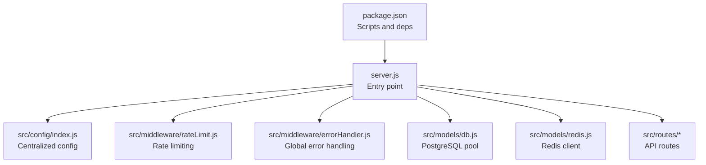
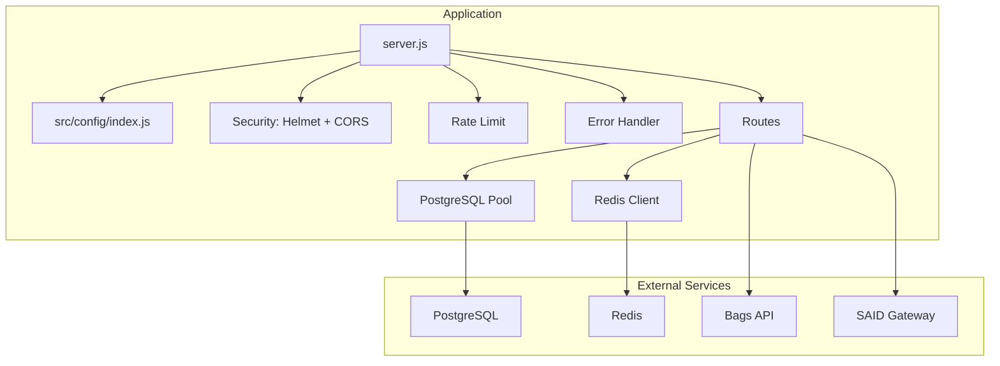
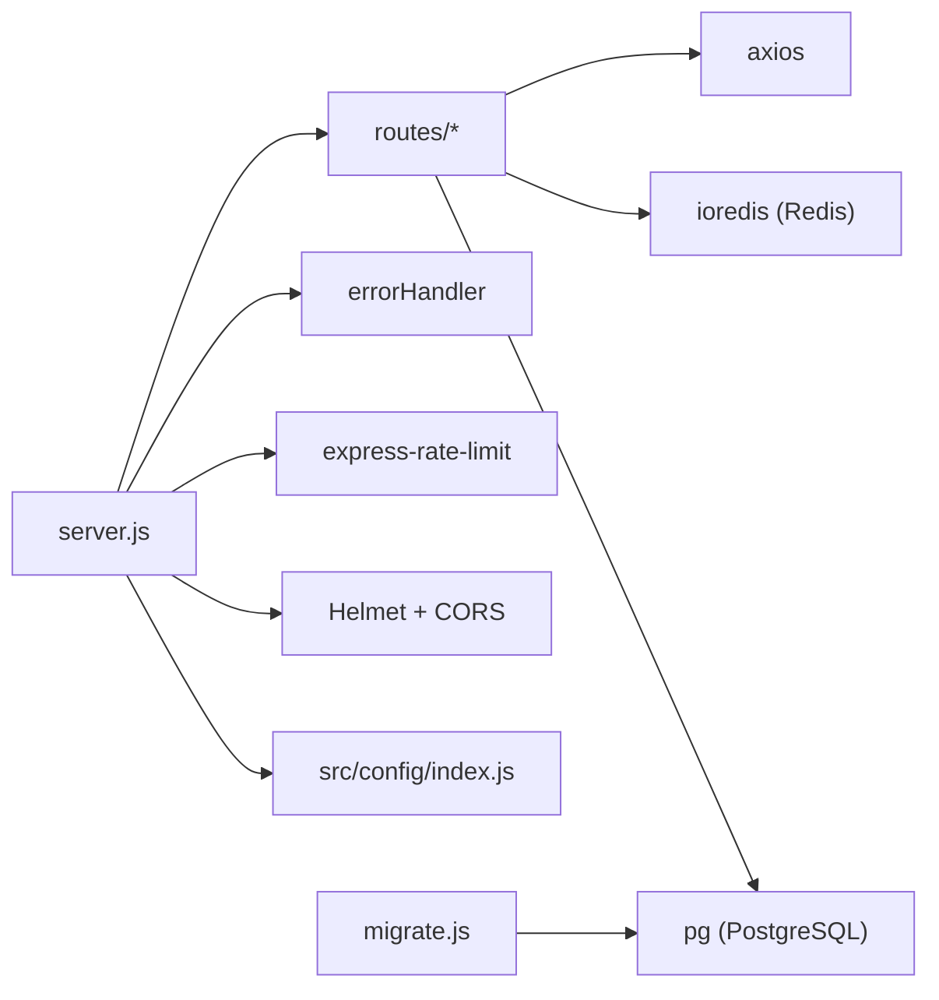

# Backend Deployment

<cite>
**Referenced Files in This Document**
- [package.json](file://backend/package.json)
- [server.js](file://backend/server.js)
- [index.js](file://backend/src/config/index.js)
- [db.js](file://backend/src/models/db.js)
- [redis.js](file://backend/src/models/redis.js)
- [errorHandler.js](file://backend/src/middleware/errorHandler.js)
- [rateLimit.js](file://backend/src/middleware/rateLimit.js)
- [migrate.js](file://backend/src/models/migrate.js)
- [agentid_build_plan.md](file://agentid_build_plan.md)
</cite>

## Table of Contents
1. [Introduction](#introduction)
2. [Project Structure](#project-structure)
3. [Core Components](#core-components)
4. [Architecture Overview](#architecture-overview)
5. [Detailed Component Analysis](#detailed-component-analysis)
6. [Dependency Analysis](#dependency-analysis)
7. [Performance Considerations](#performance-considerations)
8. [Troubleshooting Guide](#troubleshooting-guide)
9. [Conclusion](#conclusion)
10. [Appendices](#appendices)

## Introduction
This document provides comprehensive backend deployment guidance for the Node.js application. It covers environment configuration, dependency management, server startup, process management, clustering, database and cache setup, SSL considerations, security hardening, logging, health checks, deployment packaging, service configuration, monitoring, and performance tuning for production environments.

## Project Structure
The backend is organized around a modular Express application with clear separation of concerns:
- Application entry point initializes environment validation, middleware, routes, and health checks.
- Configuration module centralizes environment-driven settings.
- Models encapsulate database and Redis connectivity and operations.
- Middleware provides security, rate limiting, and error handling.
- Migration utilities manage database schema creation.

**Diagram sources**
- [server.js:1-85](file://backend/server.js#L1-L85)
- [index.js:1-31](file://backend/src/config/index.js#L1-L31)
- [rateLimit.js:1-62](file://backend/src/middleware/rateLimit.js#L1-L62)
- [errorHandler.js:1-44](file://backend/src/middleware/errorHandler.js#L1-L44)
- [db.js:1-45](file://backend/src/models/db.js#L1-L45)
- [redis.js:1-94](file://backend/src/models/redis.js#L1-L94)
- [package.json:1-35](file://backend/package.json#L1-L35)

**Section sources**
- [server.js:1-85](file://backend/server.js#L1-L85)
- [index.js:1-31](file://backend/src/config/index.js#L1-L31)
- [package.json:1-35](file://backend/package.json#L1-L35)

## Core Components
- Environment configuration: Centralized via a configuration module that reads environment variables with sensible defaults for ports, external API endpoints, database and Redis URLs, CORS origin, and cache TTLs.
- Database connectivity: PostgreSQL pool initialized with SSL settings in production.
- Redis cache: ioredis client with retry strategy, offline queue, and TTL support.
- Security middleware: Helmet for secure headers, CORS configured from environment.
- Rate limiting: Configurable limits with defaults and stricter limits for authentication endpoints.
- Error handling: Centralized error handler that logs and responds with structured JSON.
- Health checks: Lightweight GET /health endpoint for readiness/liveness probes.
- Migration: Utility to create tables and indexes for the agent registry.

**Section sources**
- [index.js:6-28](file://backend/src/config/index.js#L6-L28)
- [db.js:10-18](file://backend/src/models/db.js#L10-L18)
- [redis.js:10-20](file://backend/src/models/redis.js#L10-L20)
- [rateLimit.js:23-42](file://backend/src/middleware/rateLimit.js#L23-L42)
- [errorHandler.js:15-41](file://backend/src/middleware/errorHandler.js#L15-L41)
- [server.js:43-50](file://backend/server.js#L43-L50)
- [migrate.js:67-96](file://backend/src/models/migrate.js#L67-L96)

## Architecture Overview
The backend follows a layered architecture:
- Entry point initializes Express app, loads environment, applies middleware, mounts routes, and starts the server.
- Configuration module supplies runtime settings.
- Models encapsulate persistence and caching.
- Middleware enforces security and rate limits.
- Routes define API endpoints.

**Diagram sources**
- [server.js:12-73](file://backend/server.js#L12-L73)
- [index.js:6-28](file://backend/src/config/index.js#L6-L28)
- [db.js:6-18](file://backend/src/models/db.js#L6-L18)
- [redis.js:6-20](file://backend/src/models/redis.js#L6-L20)

## Detailed Component Analysis

### Environment Configuration
- Purpose: Provide centralized, environment-driven configuration with defaults.
- Key settings:
  - Server: port, NODE_ENV
  - External APIs: BAGS_API_KEY, SAID_GATEWAY_URL, AGENTID_BASE_URL
  - Database: DATABASE_URL
  - Redis: REDIS_URL
  - CORS: CORS_ORIGIN
  - Cache and expiry: BADGE_CACHE_TTL, CHALLENGE_EXPIRY_SECONDS

Operational guidance:
- Define all required variables in the environment prior to startup.
- Use production-grade secrets management in deployment environments.

**Section sources**
- [index.js:6-28](file://backend/src/config/index.js#L6-L28)

### Database Connectivity (PostgreSQL)
- Pool configuration: Initializes with DATABASE_URL and enables SSL in production.
- Error handling: Logs unexpected pool errors without crashing.
- Query abstraction: Provides a wrapper around pool.query with error logging.

Production SSL note:
- SSL is enabled conditionally in production via rejectUnauthorized set to false. Review and align with your CA policy and certificate validation strategy.

**Section sources**
- [db.js:10-18](file://backend/src/models/db.js#L10-L18)
- [db.js:21-23](file://backend/src/models/db.js#L21-L23)
- [db.js:31-39](file://backend/src/models/db.js#L31-L39)

### Redis Cache Initialization
- Client configuration: ioredis with retryStrategy, maxRetriesPerRequest, enableOfflineQueue.
- Event handling: Logs connect, error, and reconnect events.
- Cache helpers: getCache, setCache (with optional TTL), deleteCache.

Operational guidance:
- Ensure Redis is reachable at REDIS_URL.
- Monitor Redis connectivity and tune retry/backoff for your environment.

**Section sources**
- [redis.js:10-20](file://backend/src/models/redis.js#L10-L20)
- [redis.js:23-34](file://backend/src/models/redis.js#L23-L34)
- [redis.js:41-86](file://backend/src/models/redis.js#L41-L86)

### Security Middleware and Rate Limiting
- Helmet: Applies secure headers.
- CORS: Origin and credentials controlled by configuration.
- Rate limiting: Default and stricter limits for authentication endpoints with configurable windows and messages.

**Section sources**
- [server.js:31-37](file://backend/server.js#L31-L37)
- [rateLimit.js:23-42](file://backend/src/middleware/rateLimit.js#L23-L42)
- [rateLimit.js:44-61](file://backend/src/middleware/rateLimit.js#L44-L61)

### Error Handling
- Centralized error handler logs request context and returns structured JSON responses.
- In development, includes stack traces and optional details.

**Section sources**
- [errorHandler.js:15-41](file://backend/src/middleware/errorHandler.js#L15-L41)

### Health Check Endpoint
- GET /health returns service status, name, and timestamp for monitoring and load balancer health checks.

**Section sources**
- [server.js:43-50](file://backend/server.js#L43-L50)

### Database Migration
- Utility to create required tables and indexes.
- Runs as a standalone script and exits with appropriate status codes.

**Section sources**
- [migrate.js:67-96](file://backend/src/models/migrate.js#L67-L96)

### Server Startup and Process Management
- Entry point validates required environment variables, sets up middleware and routes, and starts the server on the configured port.
- Exports the app for external use and prints environment and health check URL on startup.

Process management and clustering:
- The repository does not include PM2 configuration. To enable multi-core utilization, deploy with PM2 using cluster mode and process configuration aligned with CPU cores.

**Section sources**
- [server.js:3-10](file://backend/server.js#L3-L10)
- [server.js:76-82](file://backend/server.js#L76-L82)
- [package.json:6-9](file://backend/package.json#L6-L9)

## Dependency Analysis
- Application dependencies include Express, Helmet, CORS, rate limiting, PostgreSQL driver, Redis client, tweetnacl for Ed25519, UUID, and Axios for external API calls.
- Scripts define start, dev, and migration commands.

**Diagram sources**
- [server.js:12-26](file://backend/server.js#L12-L26)
- [package.json:18-30](file://backend/package.json#L18-L30)

**Section sources**
- [package.json:18-30](file://backend/package.json#L18-L30)
- [server.js:12-26](file://backend/server.js#L12-L26)

## Performance Considerations
- Database pooling: Tune pool size and timeouts according to workload and connection limits.
- SSL in production: Align PostgreSQL SSL settings with your certificate authority and security posture.
- Redis retry/backoff: Adjust retryStrategy and maxRetriesPerRequest for your network conditions.
- Rate limiting: Calibrate windowMs and max based on traffic patterns and abuse prevention goals.
- Body parsing limits: Current JSON/URL-encoded payload limits are set to 10MB; adjust as needed.

[No sources needed since this section provides general guidance]

## Troubleshooting Guide
Common issues and resolutions:
- Missing environment variables: The server validates required variables and exits early with guidance. Ensure DATABASE_URL and others are present.
- Database connectivity: Check DATABASE_URL and SSL settings; verify PostgreSQL availability and credentials.
- Redis connectivity: Confirm REDIS_URL and network reachability; monitor reconnect events.
- Health checks: Use GET /health to verify service readiness.
- Migration failures: Run the migration script and review logs for errors; ensure transaction boundaries and proper cleanup.

**Section sources**
- [server.js:3-10](file://backend/server.js#L3-L10)
- [db.js:21-23](file://backend/src/models/db.js#L21-L23)
- [redis.js:27-34](file://backend/src/models/redis.js#L27-L34)
- [server.js:43-50](file://backend/server.js#L43-L50)
- [migrate.js:84-87](file://backend/src/models/migrate.js#L84-L87)

## Conclusion
This backend deployment guide consolidates environment configuration, database and cache setup, security hardening, health checks, and operational practices. Extend the setup with PM2 for process management and clustering, implement robust monitoring and log rotation, and align SSL and firewall policies with your production security requirements.

[No sources needed since this section summarizes without analyzing specific files]

## Appendices

### Environment Variables Reference
- PORT: Server port (default in configuration)
- NODE_ENV: Environment mode (development/production)
- BAGS_API_KEY: API key for Bags integration
- SAID_GATEWAY_URL: SAID Identity Gateway base URL
- AGENTID_BASE_URL: Base URL for AgentID service
- DATABASE_URL: PostgreSQL connection string
- REDIS_URL: Redis connection string
- CORS_ORIGIN: Allowed origin for CORS
- BADGE_CACHE_TTL: Badge cache TTL in seconds
- CHALLENGE_EXPIRY_SECONDS: Challenge expiry in seconds

**Section sources**
- [index.js:6-28](file://backend/src/config/index.js#L6-L28)
- [agentid_build_plan.md:309-329](file://agentid_build_plan.md#L309-L329)

### Deployment Checklist
- Package the application and install dependencies.
- Configure environment variables and secrets.
- Initialize the database schema using the migration script.
- Start the server with PM2 in cluster mode for multi-core utilization.
- Configure reverse proxy and SSL termination.
- Set up monitoring, alerting, and log rotation.
- Harden firewall and restrict inbound ports to necessary services only.

[No sources needed since this section provides general guidance]