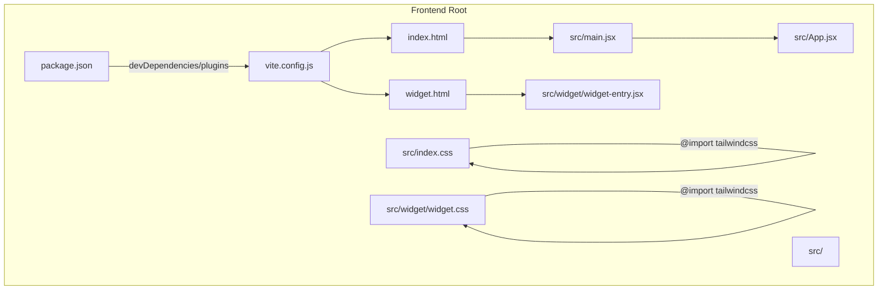
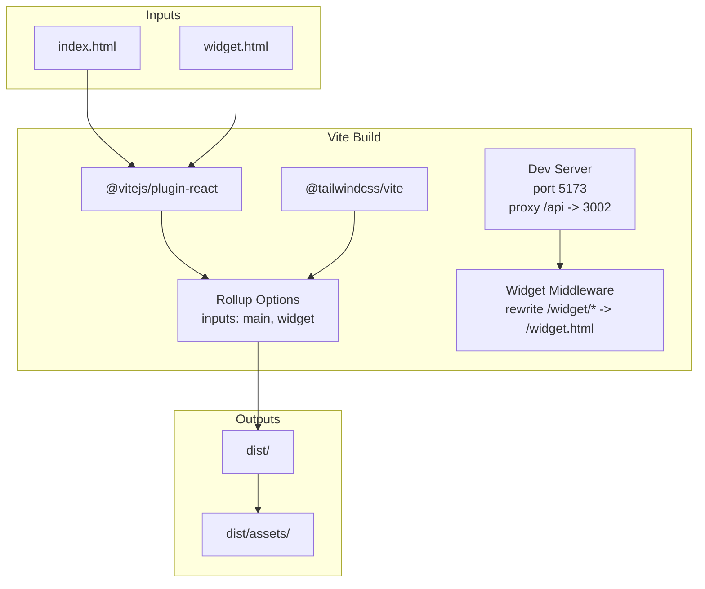
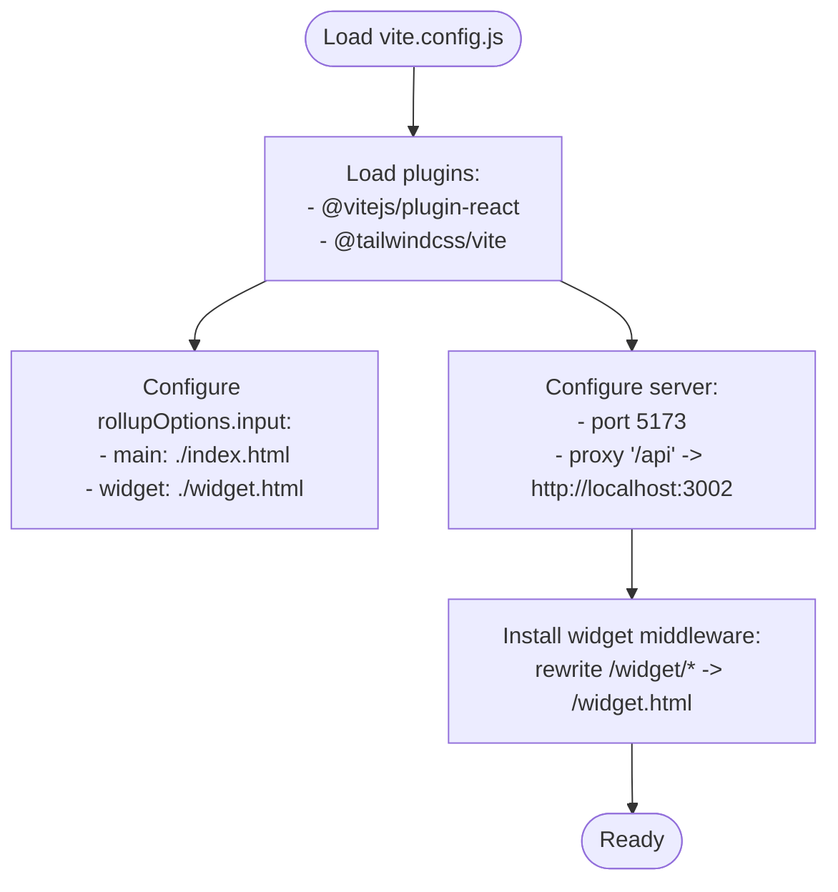
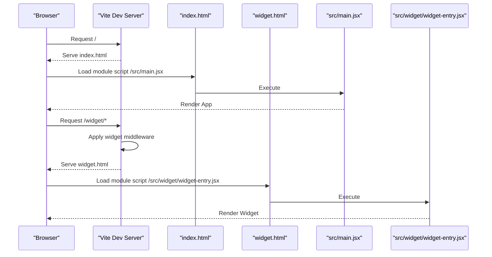
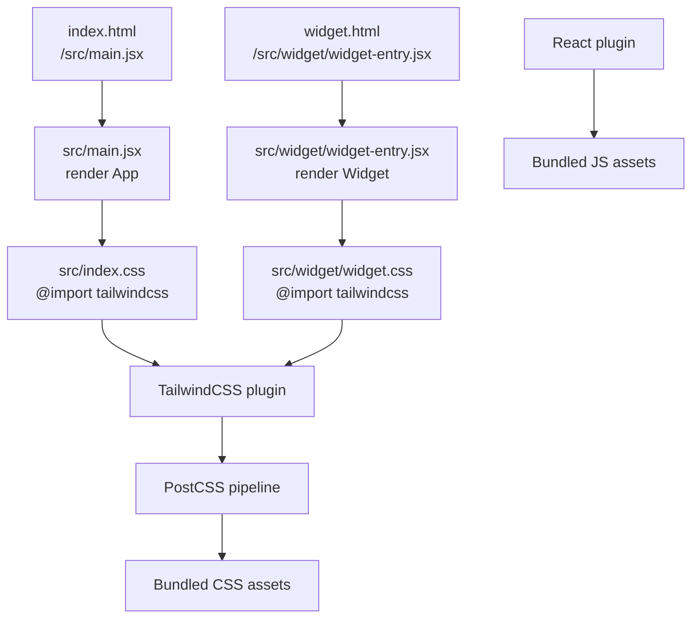
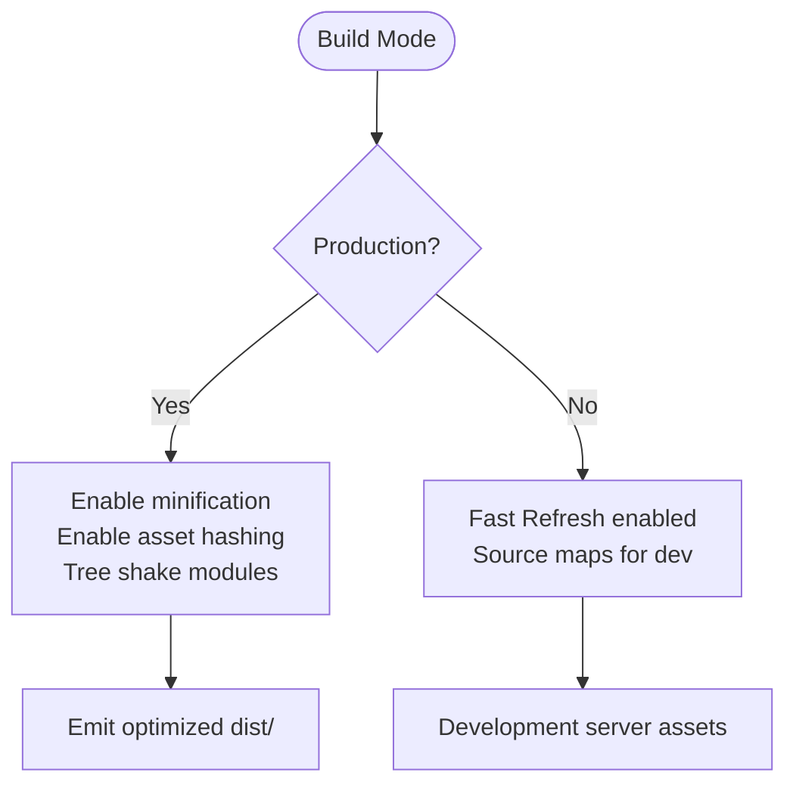
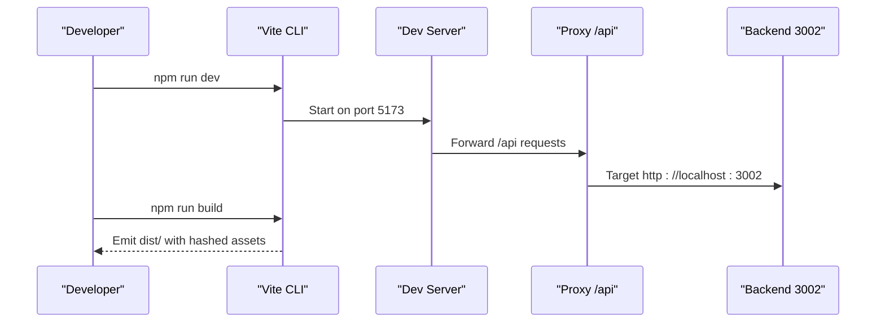
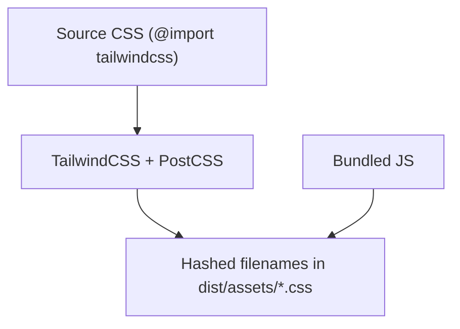
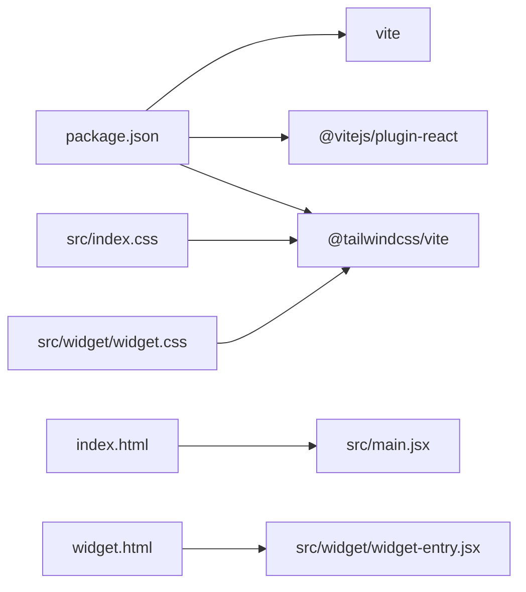

# Frontend Build Process

<cite>
**Referenced Files in This Document**
- [vite.config.js](file://frontend/vite.config.js)
- [package.json](file://frontend/package.json)
- [index.html](file://frontend/index.html)
- [widget.html](file://frontend/widget.html)
- [main.jsx](file://frontend/src/main.jsx)
- [widget-entry.jsx](file://frontend/src/widget/widget-entry.jsx)
- [index.css](file://frontend/src/index.css)
- [widget.css](file://frontend/src/widget/widget.css)
- [App.jsx](file://frontend/src/App.jsx)
- [eslint.config.js](file://frontend/eslint.config.js)
</cite>

## Table of Contents
1. [Introduction](#introduction)
2. [Project Structure](#project-structure)
3. [Core Components](#core-components)
4. [Architecture Overview](#architecture-overview)
5. [Detailed Component Analysis](#detailed-component-analysis)
6. [Dependency Analysis](#dependency-analysis)
7. [Performance Considerations](#performance-considerations)
8. [Troubleshooting Guide](#troubleshooting-guide)
9. [Conclusion](#conclusion)

## Introduction
This document explains the frontend build process for the Vite-based React application. It covers Vite configuration, entry points, output targets, asset compilation (static assets, CSS with TailwindCSS, and JavaScript bundling), optimization techniques (code splitting, tree shaking, minification), environment-specific builds, asset hashing, build artifacts, and troubleshooting procedures. The project supports two distinct entry points: the main application and a standalone widget.

## Project Structure
The frontend is organized around a dual-entry architecture:
- Main application entry via index.html and src/main.jsx
- Widget entry via widget.html and src/widget/widget-entry.jsx

Key characteristics:
- Single-page application built with React and React Router
- TailwindCSS integrated for styling with CSS imports in both main and widget stylesheets
- Development server proxy configured for API requests
- ESLint configuration for code quality

**Diagram sources**
- [vite.config.js:1-42](file://frontend/vite.config.js#L1-L42)
- [package.json:1-33](file://frontend/package.json#L1-L33)
- [index.html:1-14](file://frontend/index.html#L1-L14)
- [widget.html:1-16](file://frontend/widget.html#L1-L16)
- [main.jsx:1-11](file://frontend/src/main.jsx#L1-L11)
- [widget-entry.jsx:1-11](file://frontend/src/widget/widget-entry.jsx#L1-L11)
- [index.css:1-163](file://frontend/src/index.css#L1-L163)
- [widget.css:1-70](file://frontend/src/widget/widget.css#L1-L70)
- [App.jsx:1-148](file://frontend/src/App.jsx#L1-L148)

**Section sources**
- [vite.config.js:1-42](file://frontend/vite.config.js#L1-L42)
- [package.json:1-33](file://frontend/package.json#L1-L33)
- [index.html:1-14](file://frontend/index.html#L1-L14)
- [widget.html:1-16](file://frontend/widget.html#L1-L16)
- [main.jsx:1-11](file://frontend/src/main.jsx#L1-L11)
- [widget-entry.jsx:1-11](file://frontend/src/widget/widget-entry.jsx#L1-L11)
- [index.css:1-163](file://frontend/src/index.css#L1-L163)
- [widget.css:1-70](file://frontend/src/widget/widget.css#L1-L70)
- [App.jsx:1-148](file://frontend/src/App.jsx#L1-L148)

## Core Components
- Vite configuration defines plugins, build inputs, and development server behavior.
- Package scripts orchestrate development, building, and previewing.
- HTML entry files declare module script entries for main and widget bundles.
- CSS pipelines import Tailwind directives and define theme tokens.
- ESLint enforces recommended rules and React-specific hooks and refresh plugins.

**Section sources**
- [vite.config.js:1-42](file://frontend/vite.config.js#L1-L42)
- [package.json:6-11](file://frontend/package.json#L6-L11)
- [index.html](file://frontend/index.html#L11)
- [widget.html](file://frontend/widget.html#L13)
- [index.css](file://frontend/src/index.css#L1)
- [widget.css](file://frontend/src/widget/widget.css#L1)
- [eslint.config.js:1-30](file://frontend/eslint.config.js#L1-L30)

## Architecture Overview
The build architecture centers on Vite’s plugin ecosystem and Rollup under the hood. The configuration sets up:
- React plugin for JSX/React refresh
- TailwindCSS plugin for CSS processing
- Dual HTML inputs mapped to separate JS entry points
- Development server with proxy for API traffic
- A custom middleware to serve widget.html for widget routes during development

**Diagram sources**
- [vite.config.js:5-41](file://frontend/vite.config.js#L5-L41)
- [index.html:1-14](file://frontend/index.html#L1-L14)
- [widget.html:1-16](file://frontend/widget.html#L1-L16)

**Section sources**
- [vite.config.js:5-41](file://frontend/vite.config.js#L5-L41)

## Detailed Component Analysis

### Vite Configuration and Plugins
- Plugins:
  - React plugin enables JSX transforms and React Refresh.
  - TailwindCSS plugin integrates Tailwind directives and purging.
  - Custom middleware rewrites URLs under /widget/* to serve widget.html in development.
- Build inputs:
  - Rollup inputs map to index.html and widget.html, producing separate bundles.
- Development server:
  - Port 5173 with proxy for /api to backend service.
- Environment:
  - No explicit NODE_ENV overrides; defaults apply per mode.

**Diagram sources**
- [vite.config.js:5-41](file://frontend/vite.config.js#L5-L41)

**Section sources**
- [vite.config.js:5-41](file://frontend/vite.config.js#L5-L41)

### Entry Points and Outputs
- Main entry:
  - index.html loads src/main.jsx as a module script.
  - src/main.jsx renders the root App component.
- Widget entry:
  - widget.html loads src/widget/widget-entry.jsx as a module script.
  - src/widget/widget-entry.jsx renders the Widget component with local styles.
- Output targets:
  - Vite emits to dist/ with hashed asset filenames by default in production builds.

**Diagram sources**
- [index.html](file://frontend/index.html#L11)
- [widget.html](file://frontend/widget.html#L13)
- [main.jsx:1-11](file://frontend/src/main.jsx#L1-L11)
- [widget-entry.jsx:1-11](file://frontend/src/widget/widget-entry.jsx#L1-L11)
- [vite.config.js:10-21](file://frontend/vite.config.js#L10-L21)

**Section sources**
- [index.html](file://frontend/index.html#L11)
- [widget.html](file://frontend/widget.html#L13)
- [main.jsx:1-11](file://frontend/src/main.jsx#L1-L11)
- [widget-entry.jsx:1-11](file://frontend/src/widget/widget-entry.jsx#L1-L11)
- [vite.config.js:23-30](file://frontend/vite.config.js#L23-L30)

### Asset Pipeline: Static Assets, CSS, and JavaScript
- Static assets:
  - Public favicon referenced from index.html.
  - Fonts loaded via preconnect and external stylesheet in widget.html.
- CSS processing:
  - Both main and widget stylesheets import TailwindCSS directives.
  - Theme tokens defined in CSS variables for dark mode and color palettes.
- JavaScript bundling:
  - React plugin compiles JSX and enables Fast Refresh.
  - Separate bundles produced for main and widget entry points.

**Diagram sources**
- [index.html](file://frontend/index.html#L5)
- [widget.html:7-9](file://frontend/widget.html#L7-L9)
- [main.jsx:1-11](file://frontend/src/main.jsx#L1-L11)
- [widget-entry.jsx:1-11](file://frontend/src/widget/widget-entry.jsx#L1-L11)
- [index.css](file://frontend/src/index.css#L1)
- [widget.css](file://frontend/src/widget/widget.css#L1)
- [vite.config.js:6-8](file://frontend/vite.config.js#L6-L8)

**Section sources**
- [index.html](file://frontend/index.html#L5)
- [widget.html:7-9](file://frontend/widget.html#L7-L9)
- [main.jsx:1-11](file://frontend/src/main.jsx#L1-L11)
- [widget-entry.jsx:1-11](file://frontend/src/widget/widget-entry.jsx#L1-L11)
- [index.css](file://frontend/src/index.css#L1)
- [widget.css](file://frontend/src/widget/widget.css#L1)
- [vite.config.js:6-8](file://frontend/vite.config.js#L6-L8)

### Build Optimization Techniques
- Code splitting:
  - Vite naturally splits code based on dynamic imports and route boundaries. The main application uses React Router, enabling route-based lazy loading patterns.
- Tree shaking:
  - ES modules and modern bundling minimize unused code in production builds.
- Minification:
  - JavaScript and CSS are minified in production mode by default.
- Asset hashing:
  - Default Vite behavior generates hashed filenames for cache busting in production builds.
- Bundle analysis:
  - No dedicated analyzer plugin is configured; consider adding a Rollup plugin for analysis if needed.

**Section sources**
- [package.json:6-11](file://frontend/package.json#L6-L11)
- [vite.config.js:23-30](file://frontend/vite.config.js#L23-L30)

### Environment-Specific Builds
- Development:
  - Scripts: dev, preview.
  - Server runs on port 5173 with proxy for /api.
  - React Refresh enabled via plugin.
- Production:
  - Script: build.
  - Default Vite production optimizations apply (minification, hashing, treeshaking).

**Diagram sources**
- [package.json:6-11](file://frontend/package.json#L6-L11)
- [vite.config.js:31-40](file://frontend/vite.config.js#L31-L40)

**Section sources**
- [package.json:6-11](file://frontend/package.json#L6-L11)
- [vite.config.js:31-40](file://frontend/vite.config.js#L31-L40)

### Build Artifacts and Asset Hashing
- Output directory:
  - dist/ contains generated assets and chunks.
- Asset naming:
  - Default hashed filenames support long-term caching and cache busting.
- CSS assets:
  - Tailwind-generated CSS is emitted alongside hashed JS assets.

**Diagram sources**
- [index.css](file://frontend/src/index.css#L1)
- [widget.css](file://frontend/src/widget/widget.css#L1)
- [vite.config.js:23-30](file://frontend/vite.config.js#L23-L30)

**Section sources**
- [index.css](file://frontend/src/index.css#L1)
- [widget.css](file://frontend/src/widget/widget.css#L1)
- [vite.config.js:23-30](file://frontend/vite.config.js#L23-L30)

### Browser Compatibility and Polyfills
- Modern browsers:
  - The project relies on ES modules and modern APIs suitable for current browsers.
- Polyfills:
  - No polyfill configuration is present in the Vite config; ensure target browsers meet requirements or add a polyfill plugin if legacy support is needed.

**Section sources**
- [vite.config.js:1-42](file://frontend/vite.config.js#L1-L42)

## Dependency Analysis
- Plugin dependencies:
  - @vitejs/plugin-react, @tailwindcss/vite, and Vite itself are dev dependencies.
- Runtime dependencies:
  - React, React DOM, React Router Dom, Axios, PropTypes power the application.
- Build-time coupling:
  - HTML entry files depend on corresponding JS entry modules.
  - CSS imports depend on Tailwind plugin availability.

**Diagram sources**
- [package.json:12-31](file://frontend/package.json#L12-L31)
- [index.html](file://frontend/index.html#L11)
- [widget.html](file://frontend/widget.html#L13)
- [index.css](file://frontend/src/index.css#L1)
- [widget.css](file://frontend/src/widget/widget.css#L1)

**Section sources**
- [package.json:12-31](file://frontend/package.json#L12-L31)
- [index.html](file://frontend/index.html#L11)
- [widget.html](file://frontend/widget.html#L13)
- [index.css](file://frontend/src/index.css#L1)
- [widget.css](file://frontend/src/widget/widget.css#L1)

## Performance Considerations
- Keep CSS scoped to reduce bundle size; Tailwind utilities are purged automatically in production.
- Prefer lazy loading for heavy routes/components to improve initial load performance.
- Monitor asset sizes and enable compression on the server for production deployments.
- Avoid unnecessary polyfills to maintain small bundle sizes.

[No sources needed since this section provides general guidance]

## Troubleshooting Guide
- Development server not starting:
  - Verify port 5173 is free and network permissions allow binding.
- API proxy errors:
  - Confirm backend is running on port 3002 and reachable from localhost.
- Widget not rendering:
  - Ensure the widget middleware rewrite is functioning for /widget/* paths.
- CSS not applying:
  - Check Tailwind directives are present in stylesheets and Tailwind plugin is active.
- Lint errors:
  - Run lint script and address reported issues using ESLint configuration.

**Section sources**
- [vite.config.js:31-40](file://frontend/vite.config.js#L31-L40)
- [eslint.config.js:1-30](file://frontend/eslint.config.js#L1-L30)

## Conclusion
The frontend build process leverages Vite with React and TailwindCSS to produce two independent bundles: the main application and the widget. The configuration emphasizes a clean separation of concerns, efficient development ergonomics via proxy and middleware, and strong defaults for production optimization. For advanced needs, consider adding a bundle analyzer and adjusting browser targets or polyfills as required.