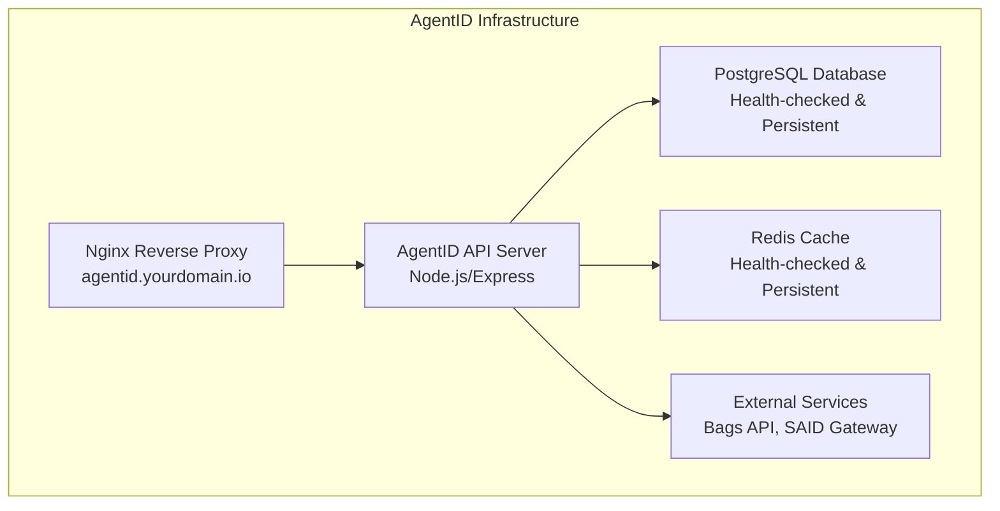
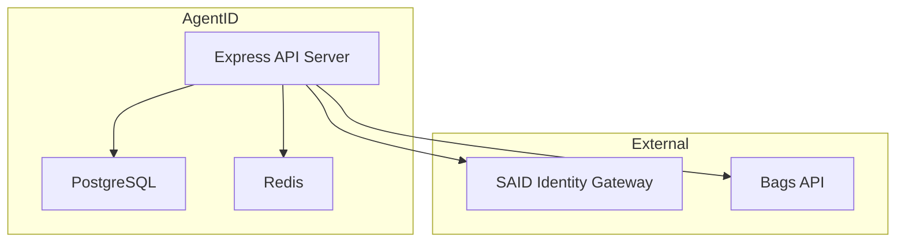
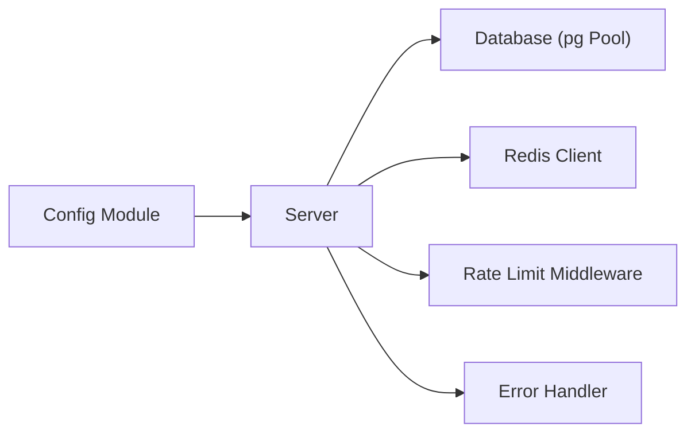

# Infrastructure Setup

<cite>
**Referenced Files in This Document**
- [docker-compose.yml](file://docker-compose.yml)
- [backend/src/config/index.js](file://backend/src/config/index.js)
- [backend/server.js](file://backend/server.js)
- [backend/src/models/db.js](file://backend/src/models/db.js)
- [backend/src/models/redis.js](file://backend/src/models/redis.js)
- [backend/src/models/migrate.js](file://backend/src/models/migrate.js)
- [backend/package.json](file://backend/package.json)
</cite>

## Update Summary
**Changes Made**
- Enhanced Docker Compose configuration section with detailed health checks, persistent volumes, and network isolation
- Updated local development setup documentation with improved container orchestration
- Added comprehensive environment variable configuration for database and Redis services
- Expanded troubleshooting guide with Docker-specific diagnostics

## Table of Contents
1. [Introduction](#introduction)
2. [Project Structure](#project-structure)
3. [Core Components](#core-components)
4. [Architecture Overview](#architecture-overview)
5. [Detailed Component Analysis](#detailed-component-analysis)
6. [Dependency Analysis](#dependency-analysis)
7. [Performance Considerations](#performance-considerations)
8. [Troubleshooting Guide](#troubleshooting-guide)
9. [Conclusion](#conclusion)
10. [Appendices](#appendices)

## Introduction
This document provides a comprehensive guide to setting up the AgentID infrastructure, focusing on server configuration, system architecture, and operational procedures. It covers Nginx virtual host setup, SSL certificate configuration with Certbot, reverse proxy rules for the AgentID application, domain and DNS configuration, certificate management, system requirements, firewall and access control, database and Redis setup, backup procedures, load balancing and CDN considerations, caching strategies, monitoring and alerting, and CI/CD integration with automated deployments and rollbacks.

## Project Structure
AgentID consists of:
- Backend API written in Node.js/Express with PostgreSQL and Redis
- Enhanced Docker Compose for local development and testing with health checks and persistent volumes
- Environment-driven configuration and scripts for migrations and tests



**Diagram sources**
- [docker-compose.yml:1-47](file://docker-compose.yml#L1-L47)
- [backend/server.js:1-91](file://backend/server.js#L1-L91)

**Section sources**
- [docker-compose.yml:1-47](file://docker-compose.yml#L1-L47)
- [backend/server.js:1-91](file://backend/server.js#L1-L91)

## Core Components
- Application server: Node.js/Express API with health checks, rate limiting, and security middleware
- Database: PostgreSQL with connection pooling and migrations
- Cache: Redis for nonce storage and badge caching
- External integrations: Bags API and SAID Identity Gateway
- Configuration: Environment variables for ports, URLs, database, Redis, CORS, and cache TTLs

Key configuration and runtime behaviors:
- Port and environment are controlled via environment variables
- Database URL and Redis URL are required for runtime
- CORS origin is configurable
- Cache TTL and challenge expiry are configurable
- Rate limiting is applied globally and for authentication endpoints

**Section sources**
- [backend/src/config/index.js:6-28](file://backend/src/config/index.js#L6-L28)
- [backend/server.js:4-10](file://backend/server.js#L4-L10)
- [backend/server.js:35-42](file://backend/server.js#L35-L42)

## Architecture Overview
The AgentID system integrates external services (Bags API and SAID Gateway) with a local API that manages agent registration, verification, reputation, badges, and discovery. The backend exposes REST endpoints and relies on PostgreSQL for persistence and Redis for caching and nonce management.



**Diagram sources**
- [backend/server.js:1-91](file://backend/server.js#L1-L91)
- [backend/src/models/db.js:1-45](file://backend/src/models/db.js#L1-L45)
- [backend/src/models/redis.js:1-94](file://backend/src/models/redis.js#L1-L94)

## Detailed Component Analysis

### Nginx Reverse Proxy and SSL Configuration
- Virtual host: Configure a server block for agentid.yourdomain.io
- SSL termination: Use Certbot to provision and renew certificates
- Reverse proxy: Forward traffic to the AgentID API listening on the configured port
- Security headers: Enforce HTTPS and secure headers via Nginx and Express middleware

Operational steps:
- Install and configure Nginx
- Add a server block for the domain
- Configure SSL with Certbot (standalone or webroot)
- Proxy pass to the API port (default 3002)
- Redirect HTTP to HTTPS
- Harden SSL/TLS settings and security headers

[No sources needed since this section provides general guidance]

### Domain Configuration and DNS
- Choose a domain aligned with the project's branding (e.g., provenanceai.network or runtimefence.io)
- Point the domain to the server's public IP
- Configure A records for the primary domain and CNAME for www if applicable
- Ensure DNS propagation and TXT records for domain verification if using Certbot

[No sources needed since this section provides general guidance]

### Certificate Management Procedures
- Provision certificates with Certbot for the domain
- Automate renewal with cron or systemd timers
- Monitor certificate expiration and renewal status
- Rotate keys and renewals as part of routine maintenance

[No sources needed since this section provides general guidance]

### System Requirements
- Operating system: Linux distribution with package managers supporting Nginx, Certbot, Node.js, PostgreSQL, and Redis
- CPU/RAM: Minimum shared VPS suitable for Node.js/Express with moderate concurrency
- Storage: SSD recommended for PostgreSQL and Redis data directories
- Network: Outbound access to external services (Bags API, SAID Gateway)

[No sources needed since this section provides general guidance]

### Firewall Configuration, Security Groups, and Access Control
- Open inbound ports:
  - TCP 80 (HTTP redirect)
  - TCP 443 (HTTPS)
  - TCP 22 (SSH, restrict to trusted IPs)
  - TCP 3002 (API, restrict to internal or trusted networks)
- Restrict PostgreSQL and Redis to internal network or loopback where possible
- Use security groups/firewalls to limit ingress to essential ports only

[No sources needed since this section provides general guidance]

### Database Server Setup (PostgreSQL)
- Use the connection string from configuration for production
- Enable SSL for production connections if required by the hosting provider
- Create a dedicated database and user for AgentID
- Apply migrations using the provided migration script

Key behaviors:
- Connection pooling via pg Pool
- Production SSL settings disabled by default; adjust based on provider requirements
- Migration script creates required tables and indexes

**Section sources**
- [backend/src/config/index.js:16-18](file://backend/src/config/index.js#L16-L18)
- [backend/src/models/db.js:10-18](file://backend/src/models/db.js#L10-L18)
- [backend/src/models/migrate.js:9-65](file://backend/src/models/migrate.js#L9-L65)

### Redis Configuration
- Use the Redis URL from configuration
- Configure retry strategy and offline queue for resilience
- Use Redis for nonce storage and badge caching
- Monitor Redis availability and performance

**Section sources**
- [backend/src/config/index.js:19-20](file://backend/src/config/index.js#L19-L20)
- [backend/src/models/redis.js:10-20](file://backend/src/models/redis.js#L10-L20)

### Enhanced Docker Compose Configuration for Local Development
**Updated** The Docker Compose configuration now provides a complete, production-ready development environment with health checks, persistent volumes, and network isolation.

The enhanced configuration includes:

#### PostgreSQL Service Configuration
- **Image**: postgres:16-alpine (latest stable version)
- **Container Name**: agentid-postgres
- **Ports**: Exposes port 5432 internally mapped to host
- **Environment Variables**: Configures username, password, and database name
- **Persistent Volumes**: Mounts postgres_data volume for data persistence
- **Health Checks**: Comprehensive health check using pg_isready command
- **Network Isolation**: Runs on custom bridge network agentid-network

#### Redis Service Configuration
- **Image**: redis:7-alpine (latest stable version)
- **Container Name**: agentid-redis
- **Ports**: Exposes port 6379 internally mapped to host
- **Persistent Volumes**: Mounts redis_data volume for data persistence
- **Health Checks**: Comprehensive health check using redis-cli ping
- **Network Isolation**: Runs on custom bridge network agentid-network

#### Volume Management
- **PostgreSQL Data Volume**: postgres_data persists database state
- **Redis Data Volume**: redis_data persists cache state
- **Automatic Cleanup**: Volumes are automatically managed by Docker Compose

#### Network Configuration
- **Custom Bridge Network**: agentid-network isolates services
- **Service Communication**: Containers can communicate via service names
- **Security**: Network isolation prevents external access to databases

**Section sources**
- [docker-compose.yml:1-47](file://docker-compose.yml#L1-L47)

### Backup Procedures
- PostgreSQL:
  - Schedule regular logical backups (e.g., pg_dump)
  - Store backups offsite or in cloud storage
  - Test restore procedures periodically
- Redis:
  - Enable snapshotting or AOF persistence
  - Back up snapshot files regularly
  - Validate backup integrity

[No sources needed since this section provides general guidance]

### Load Balancing, CDN, and Caching Strategies
- Load balancing:
  - Use Nginx or a cloud load balancer to distribute traffic across API instances
  - Enable health checks and sticky sessions if required
- CDN:
  - Serve static assets (badge SVGs, widget assets) via CDN
  - Cache static content at CDN edge nodes
- Caching:
  - Use Redis for short-lived caches (challenges, badges)
  - Tune cache TTLs based on usage patterns
  - Implement cache warming for popular endpoints

[No sources needed since this section provides general guidance]

### Monitoring Infrastructure, Alerting, and Metrics
- Application:
  - Expose health endpoints and monitor uptime
  - Collect logs centrally (stdout/stderr captured by process manager)
  - Track error rates and latency
- Infrastructure:
  - Monitor CPU, memory, disk, and network utilization
  - Track database and Redis performance
- Alerts:
  - Set thresholds for error rates, downtime, and resource saturation
  - Notify on-call via email, Slack, or pager

[No sources needed since this section provides general guidance]

### CI/CD Pipeline Integration, Automated Deployments, and Rollbacks
- Build:
  - Package the backend application
  - Run tests and migrations in CI
- Deploy:
  - Use a process manager (e.g., PM2) or container orchestration
  - Deploy via SSH or CI-managed runners
  - Roll out gradually (blue/green or rolling updates)
- Rollback:
  - Keep previous artifacts and configurations
  - Re-deploy previous version on failure
  - Use feature flags or A/B routing if supported

[No sources needed since this section provides general guidance]

## Dependency Analysis
The backend depends on environment variables for configuration, external services for identity and reputation, and local services for persistence and caching.



**Diagram sources**
- [backend/src/config/index.js:6-28](file://backend/src/config/index.js#L6-L28)
- [backend/server.js:15-18](file://backend/server.js#L15-L18)
- [backend/src/models/db.js:6-18](file://backend/src/models/db.js#L6-L18)
- [backend/src/models/redis.js:6-20](file://backend/src/models/redis.js#L6-L20)

**Section sources**
- [backend/package.json:20-32](file://backend/package.json#L20-L32)
- [backend/server.js:12-28](file://backend/server.js#L12-L28)

## Performance Considerations
- Database:
  - Use connection pooling and prepared statements
  - Index frequently queried columns (status, scores, foreign keys)
- Cache:
  - Tune TTLs for badge and challenge caches
  - Monitor hit ratios and evictions
- API:
  - Apply rate limiting to prevent abuse
  - Use compression and keep-alive for static assets
- External services:
  - Handle transient failures gracefully (non-blocking connectivity checks)
  - Retry with backoff for external API calls

[No sources needed since this section provides general guidance]

## Troubleshooting Guide

### Docker Compose Issues
**Updated** Enhanced troubleshooting for the new Docker Compose configuration with health checks and persistent volumes.

Common issues and resolutions:
- **Container fails health checks**:
  - Check PostgreSQL logs: `docker compose logs postgres`
  - Verify database initialization completed successfully
  - Ensure environment variables are correctly set
- **Redis connection refused**:
  - Verify Redis container is healthy: `docker compose ps redis`
  - Check Redis logs: `docker compose logs redis`
  - Confirm network connectivity between containers
- **Volume mounting issues**:
  - Verify Docker has permission to access volume directories
  - Check for permission conflicts with existing data
  - Ensure sufficient disk space is available
- **Network connectivity problems**:
  - Verify custom network creation: `docker network ls`
  - Check service names in application configuration
  - Ensure containers are on the same network

### Traditional Issues
- Missing environment variables:
  - Ensure DATABASE_URL is present; the server validates required variables at startup
- Database connectivity:
  - Verify connection string and network access
  - Check PostgreSQL logs and pool error events
- Redis connectivity:
  - Confirm Redis URL and network accessibility
  - Review retry strategy and offline queue behavior
- Rate limiting:
  - Adjust limits for legitimate traffic spikes
  - Inspect logs for repeated 429 responses
- Health checks:
  - Use the /health endpoint to verify service status
  - Monitor external service health (SAID Gateway) and handle non-critical failures

**Section sources**
- [docker-compose.yml:15-36](file://docker-compose.yml#L15-L36)
- [backend/server.js:4-10](file://backend/server.js#L4-L10)
- [backend/server.js:44-51](file://backend/server.js#L44-L51)
- [backend/src/models/db.js:21-23](file://backend/src/models/db.js#L21-L23)
- [backend/src/models/redis.js:23-34](file://backend/src/models/redis.js#L23-L34)

## Conclusion
This guide outlines the end-to-end infrastructure setup for AgentID, covering server configuration, SSL, reverse proxy, domain and DNS, database and Redis, caching, monitoring, and CI/CD. The enhanced Docker Compose configuration provides developers with a complete, production-ready development environment featuring health checks, persistent volumes, and network isolation. By following these recommendations, you can deploy a secure, scalable, and observable AgentID service ready to integrate with Bags and SAID.

## Appendices

### Environment Variables Reference
- PORT: Application port (default 3002)
- NODE_ENV: Environment mode (development/production)
- BAGS_API_KEY: API key for Bags integration
- SAID_GATEWAY_URL: SAID Identity Gateway base URL
- AGENTID_BASE_URL: Base URL for AgentID service
- DATABASE_URL: PostgreSQL connection string
- REDIS_URL: Redis connection string
- CORS_ORIGIN: Allowed origin for cross-origin requests
- BADGE_CACHE_TTL: Badge cache TTL in seconds
- CHALLENGE_EXPIRY_SECONDS: Challenge expiry in seconds

**Section sources**
- [backend/src/config/index.js:8-27](file://backend/src/config/index.js#L8-L27)

### Enhanced Containerized Local Development
**Updated** The Docker Compose configuration now provides a comprehensive development environment with health checks, persistent volumes, and network isolation.

#### Complete Stack Deployment
```bash
# Start the complete development stack
docker compose up -d

# View service status
docker compose ps

# View logs for all services
docker compose logs -f

# Stop the stack
docker compose down
```

#### Service Configuration Details
- **PostgreSQL Service**:
  - Image: postgres:16-alpine
  - Health Check: `pg_isready -U agentid -d agentid`
  - Volume: postgres_data (persistent)
  - Network: agentid-network
  - Ports: 5432:5432

- **Redis Service**:
  - Image: redis:7-alpine
  - Health Check: `redis-cli ping`
  - Volume: redis_data (persistent)
  - Network: agentid-network
  - Ports: 6379:6379

#### Health Check Monitoring
```bash
# Monitor service health
docker compose ps

# View individual service logs
docker compose logs postgres
docker compose logs redis

# Test database connectivity
docker compose exec postgres psql -U agentid -d agentid -c "SELECT version();"

# Test Redis connectivity
docker compose exec redis redis-cli ping
```

**Section sources**
- [docker-compose.yml:1-47](file://docker-compose.yml#L1-L47)

### Database Migration and Initialization
**Updated** Enhanced migration process with Docker Compose integration.

```bash
# Start services
docker compose up -d postgres redis

# Wait for services to be ready
sleep 10

# Run database migrations
docker compose exec backend npm run migrate

# Stop services
docker compose down
```

**Section sources**
- [backend/src/models/migrate.js:9-65](file://backend/src/models/migrate.js#L9-L65)
- [backend/package.json:9](file://backend/package.json#L9)