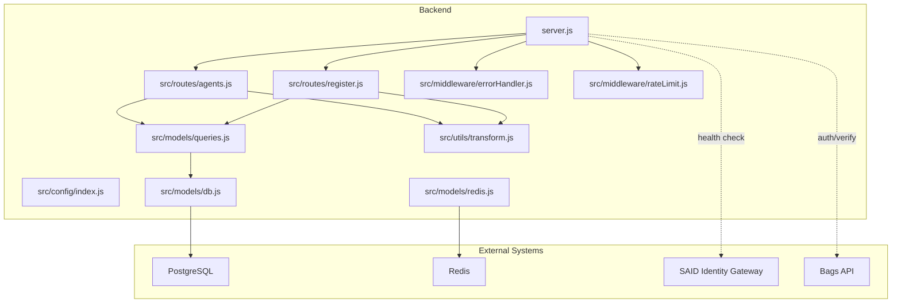
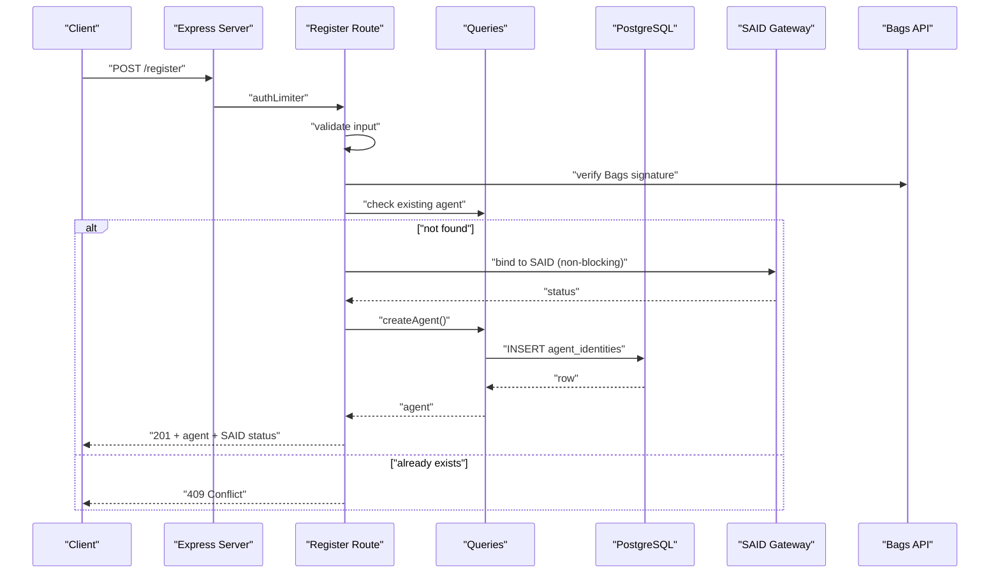

# Operational Procedures

<cite>
**Referenced Files in This Document**
- [server.js](file://backend/server.js)
- [index.js](file://backend/src/config/index.js)
- [db.js](file://backend/src/models/db.js)
- [migrate.js](file://backend/src/models/migrate.js)
- [redis.js](file://backend/src/models/redis.js)
- [errorHandler.js](file://backend/src/middleware/errorHandler.js)
- [rateLimit.js](file://backend/src/middleware/rateLimit.js)
- [agents.js](file://backend/src/routes/agents.js)
- [register.js](file://backend/src/routes/register.js)
- [queries.js](file://backend/src/models/queries.js)
- [transform.js](file://backend/src/utils/transform.js)
- [package.json](file://backend/package.json)
- [agentid_build_plan.md](file://agentid_build_plan.md)
</cite>

## Table of Contents
1. [Introduction](#introduction)
2. [Project Structure](#project-structure)
3. [Core Components](#core-components)
4. [Architecture Overview](#architecture-overview)
5. [Daily Operations](#daily-operations)
6. [Incident Response](#incident-response)
7. [Backup and Restore](#backup-and-restore)
8. [Capacity Planning and Scaling](#capacity-planning-and-scaling)
9. [Security Maintenance](#security-maintenance)
10. [Maintenance Windows and Change Management](#maintenance-windows-and-change-management)
11. [Monitoring and Alerting](#monitoring-and-alerting)
12. [Disaster Recovery and Business Continuity](#disaster-recovery-and-business-continuity)
13. [Conclusion](#conclusion)

## Introduction
This document defines comprehensive operational procedures for the AgentID production environment. It covers daily maintenance and monitoring, incident response, backups, capacity planning, security, maintenance windows, monitoring dashboards, alerting, and disaster recovery. The goal is to ensure reliable, secure, and scalable operations for the AgentID API service.

## Project Structure
The system consists of:
- Backend API (Node.js/Express) with routing, middleware, models, and services
- PostgreSQL for persistent data
- Redis for caching and transient state
- Frontend React application for registry and badge widgets
- Environment-driven configuration and scripts for migrations and testing

**Diagram sources**
- [server.js:1-91](file://backend/server.js#L1-L91)
- [index.js:1-31](file://backend/src/config/index.js#L1-L31)
- [agents.js:1-255](file://backend/src/routes/agents.js#L1-L255)
- [register.js:1-162](file://backend/src/routes/register.js#L1-L162)
- [db.js:1-45](file://backend/src/models/db.js#L1-L45)
- [redis.js:1-94](file://backend/src/models/redis.js#L1-L94)
- [queries.js:1-404](file://backend/src/models/queries.js#L1-L404)
- [errorHandler.js:1-44](file://backend/src/middleware/errorHandler.js#L1-L44)
- [rateLimit.js:1-62](file://backend/src/middleware/rateLimit.js#L1-L62)
- [transform.js:1-103](file://backend/src/utils/transform.js#L1-L103)

**Section sources**
- [server.js:1-91](file://backend/server.js#L1-L91)
- [agentid_build_plan.md:257-302](file://agentid_build_plan.md#L257-L302)

## Core Components
- Configuration: centralizes environment variables for ports, URLs, database, Redis, CORS, and cache TTLs
- Database: connection pool with production SSL handling and centralized query function
- Redis: client with retry/backoff, offline queue, and cache helpers
- Middleware: global error handler and rate limiting
- Routes: registration, verification, badges, reputation, agents, attestations, widget
- Models: reusable queries for agents, verifications, flags, discovery
- Utilities: data transformation and validation helpers

**Section sources**
- [index.js:6-28](file://backend/src/config/index.js#L6-L28)
- [db.js:10-44](file://backend/src/models/db.js#L10-L44)
- [redis.js:10-94](file://backend/src/models/redis.js#L10-L94)
- [errorHandler.js:15-41](file://backend/src/middleware/errorHandler.js#L15-L41)
- [rateLimit.js:23-61](file://backend/src/middleware/rateLimit.js#L23-L61)
- [agents.js:14-255](file://backend/src/routes/agents.js#L14-L255)
- [register.js:13-162](file://backend/src/routes/register.js#L13-L162)
- [queries.js:17-356](file://backend/src/models/queries.js#L17-L356)
- [transform.js:43-102](file://backend/src/utils/transform.js#L43-L102)

## Architecture Overview
The API exposes endpoints for registration, verification, badges, reputation, discovery, and attestation. It integrates with external systems (Bags and SAID) and persists state in PostgreSQL while caching transient data in Redis. Security middleware enforces rate limits and hardens headers.

**Diagram sources**
- [server.js:56-63](file://backend/server.js#L56-L63)
- [register.js:59-159](file://backend/src/routes/register.js#L59-L159)
- [queries.js:17-29](file://backend/src/models/queries.js#L17-L29)
- [db.js:31-39](file://backend/src/models/db.js#L31-L39)

**Section sources**
- [server.js:44-88](file://backend/server.js#L44-L88)
- [register.js:59-159](file://backend/src/routes/register.js#L59-L159)
- [queries.js:17-29](file://backend/src/models/queries.js#L17-L29)

## Daily Operations
Daily tasks for production maintenance and monitoring:

- Application Monitoring
  - Monitor health endpoint for service availability
  - Track error logs and rate limit warnings
  - Observe Redis connection status and cache operations
  - Verify external integrations (Bags and SAID) connectivity

- Log Analysis
  - Review structured error logs with timestamp, path, method, and stack traces (in development)
  - Watch for repeated rate limit hits indicating abuse or misconfiguration
  - Investigate database and Redis errors promptly

- Performance Metrics Collection
  - Track request latency and throughput via reverse proxy or APM
  - Monitor database query counts and slow queries
  - Observe Redis hit rates and TTL usage
  - Measure badge cache effectiveness and TTL impact

- Environment and Secrets
  - Validate required environment variables at startup
  - Rotate secrets and update environment variables safely
  - Confirm CORS origin and base URLs align with domain configuration

**Section sources**
- [server.js:44-88](file://backend/server.js#L44-L88)
- [errorHandler.js:15-41](file://backend/src/middleware/errorHandler.js#L15-L41)
- [rateLimit.js:23-42](file://backend/src/middleware/rateLimit.js#L23-L42)
- [redis.js:22-35](file://backend/src/models/redis.js#L22-L35)
- [db.js:20-23](file://backend/src/models/db.js#L20-L23)
- [index.js:6-28](file://backend/src/config/index.js#L6-L28)

## Incident Response
Incident categories and response steps:

- Service Outage
  - Confirm health endpoint status
  - Check database connectivity and pool errors
  - Verify Redis availability and reconnection logs
  - Validate external service reachability (Bags, SAID)

- Authentication and Verification Failures
  - Inspect rate limit middleware behavior
  - Review signature verification and nonce handling
  - Check challenge expiration and replay protection

- Data Integrity Issues
  - Audit database writes and transactions
  - Verify migration status and schema consistency
  - Confirm index usage for queries

- Cache Degradation
  - Monitor cache get/set/delete errors
  - Adjust TTLs and fallback behavior
  - Clear stale keys if necessary

Escalation procedure:
- Tier 1: On-call engineer investigates logs and restarts services if needed
- Tier 2: Senior engineer reviews configuration and external dependencies
- Tier 3: Architect participates for systemic issues or long-term fixes

**Section sources**
- [server.js:84-86](file://backend/server.js#L84-L86)
- [db.js:20-23](file://backend/src/models/db.js#L20-L23)
- [redis.js:22-35](file://backend/src/models/redis.js#L22-L35)
- [rateLimit.js:23-42](file://backend/src/middleware/rateLimit.js#L23-L42)
- [agents.js:124-251](file://backend/src/routes/agents.js#L124-L251)
- [register.js:59-159](file://backend/src/routes/register.js#L59-L159)

## Backup and Restore
Backup scope and procedures:

- Database Backups
  - Schedule regular logical backups of PostgreSQL
  - Test restore procedures in staging environment
  - Maintain WAL archiving for point-in-time recovery

- Configuration Files
  - Version control environment files and deployment scripts
  - Store secrets externally and rotate regularly
  - Document backup locations and retention policies

- Application Data
  - Treat cached data as ephemeral; rebuild from primary sources
  - Ensure application state does not contain sensitive operational data

Restore process:
- Stop application traffic
- Restore database from latest backup
- Recreate indexes and run migrations if needed
- Restart services and validate health checks
- Verify external integrations and caches

**Section sources**
- [migrate.js:67-91](file://backend/src/models/migrate.js#L67-L91)
- [db.js:10-18](file://backend/src/models/db.js#L10-L18)
- [agentid_build_plan.md:309-330](file://agentid_build_plan.md#L309-L330)

## Capacity Planning and Scaling
Capacity planning and scaling operations:

- Resource Optimization
  - Tune database connection pool size and timeouts
  - Optimize queries and indexes based on usage patterns
  - Monitor Redis memory and evictions

- Scaling Operations
  - Horizontal scaling: deploy multiple instances behind a load balancer
  - Vertical scaling: increase CPU/RAM for higher concurrency
  - Auto-scaling: configure based on CPU, memory, or request rate

- Performance Tuning
  - Reduce payload sizes and enforce limits
  - Leverage caching for frequently accessed badges
  - Batch or paginate heavy queries

**Section sources**
- [db.js:10-18](file://backend/src/models/db.js#L10-L18)
- [redis.js:10-20](file://backend/src/models/redis.js#L10-L20)
- [agents.js:23-54](file://backend/src/routes/agents.js#L23-L54)
- [server.js:41-42](file://backend/server.js#L41-L42)

## Security Maintenance
Security maintenance procedures:

- Vulnerability Scanning
  - Scan container images and dependencies regularly
  - Address critical and high severity findings within SLA

- Patch Management
  - Maintain an inventory of installed packages
  - Apply OS and library patches in staging first

- Access Control Reviews
  - Review environment variable access and secret rotation
  - Limit administrative access to deployment and database servers
  - Audit API keys and third-party service credentials

- Operational Hardening
  - Enforce HTTPS and secure headers via Helmet
  - Configure strict CORS origins
  - Monitor and alert on unusual rate limit triggers

**Section sources**
- [server.js:31-38](file://backend/server.js#L31-L38)
- [index.js:22-27](file://backend/src/config/index.js#L22-L27)
- [rateLimit.js:23-42](file://backend/src/middleware/rateLimit.js#L23-L42)
- [package.json:20-32](file://backend/package.json#L20-L32)

## Maintenance Windows and Change Management
Maintenance windows and change management:

- Scheduled Downtime
  - Announce planned maintenance windows with advance notice
  - Perform database migrations during low-traffic periods
  - Coordinate with stakeholders for rollback readiness

- Change Management
  - Require code review and approval for all changes
  - Use feature flags where applicable
  - Document rollback procedures and test them

- Rollout Strategy
  - Deploy to a subset of instances first
  - Monitor health and metrics closely
  - Gradually shift traffic and validate external integrations

**Section sources**
- [migrate.js:67-91](file://backend/src/models/migrate.js#L67-L91)
- [server.js:76-88](file://backend/server.js#L76-L88)
- [agentid_build_plan.md:309-330](file://agentid_build_plan.md#L309-L330)

## Monitoring and Alerting
Monitoring dashboard setup and alerting configuration:

- Dashboards
  - Service health: /health endpoint status
  - Error rates and latency by endpoint
  - Database pool utilization and query performance
  - Redis connectivity and cache hit ratio
  - Rate limit violations and abuse detection

- Alerting
  - Critical: service outage, database errors, Redis failures
  - Warning: sustained rate limit spikes, slow queries, cache misses
  - Info: new deployments, configuration changes

- Escalation
  - Define on-call rotations and communication channels
  - Automate notifications and acknowledgments

**Section sources**
- [server.js:44-51](file://backend/server.js#L44-L51)
- [errorHandler.js:15-41](file://backend/src/middleware/errorHandler.js#L15-L41)
- [db.js:20-23](file://backend/src/models/db.js#L20-L23)
- [redis.js:22-35](file://backend/src/models/redis.js#L22-L35)
- [rateLimit.js:37-41](file://backend/src/middleware/rateLimit.js#L37-L41)

## Disaster Recovery and Business Continuity
Disaster recovery and business continuity procedures:

- DR Planning
  - Identify RTO/RPO targets for the API and data
  - Maintain offsite backups and replication where feasible

- Recovery Process
  - Restore database from backups
  - Recreate application state and caches
  - Validate external integrations and service health

- Business Continuity
  - Keep minimum viable service operational
  - Communicate with users during outages
  - Document lessons learned and update plans

**Section sources**
- [migrate.js:67-91](file://backend/src/models/migrate.js#L67-L91)
- [db.js:10-18](file://backend/src/models/db.js#L10-L18)
- [redis.js:10-20](file://backend/src/models/redis.js#L10-L20)
- [agentid_build_plan.md:309-330](file://agentid_build_plan.md#L309-L330)

## Conclusion
These operational procedures provide a comprehensive framework for maintaining the AgentID production environment. By following the daily operations, incident response, backup and restore, capacity planning, security maintenance, change management, monitoring, and disaster recovery guidelines, the team can ensure reliable, secure, and scalable operations aligned with the system’s architecture and external integrations.