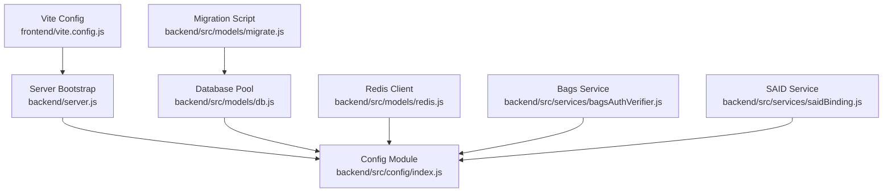
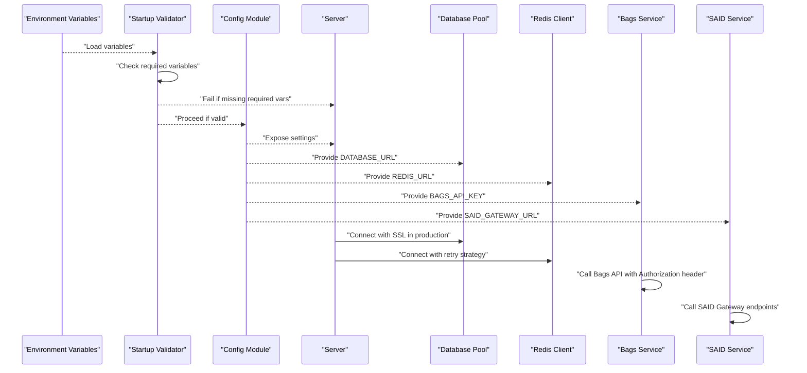
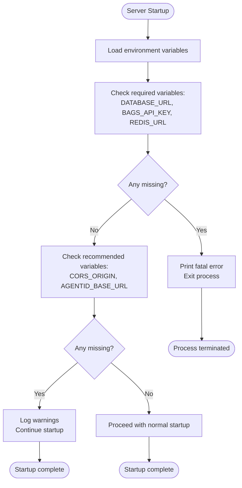
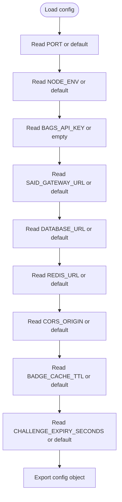
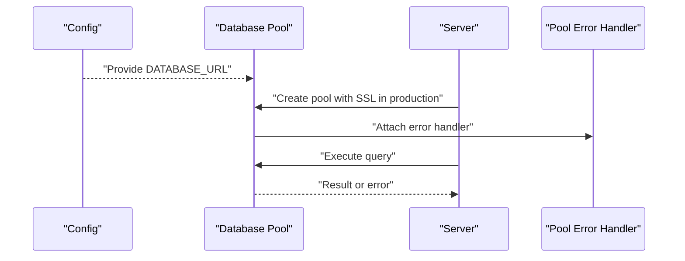
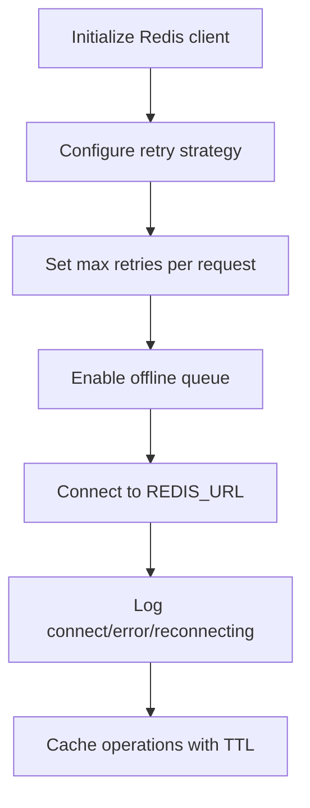
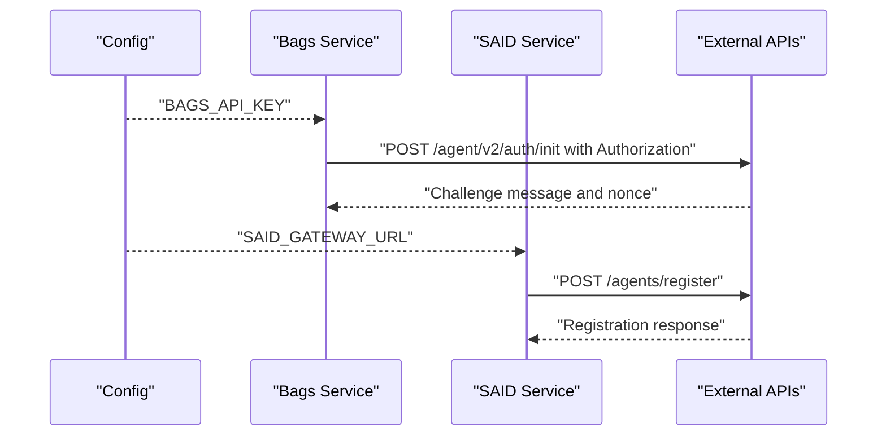
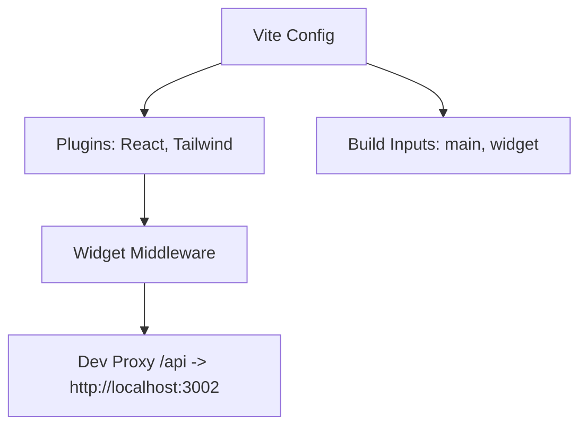
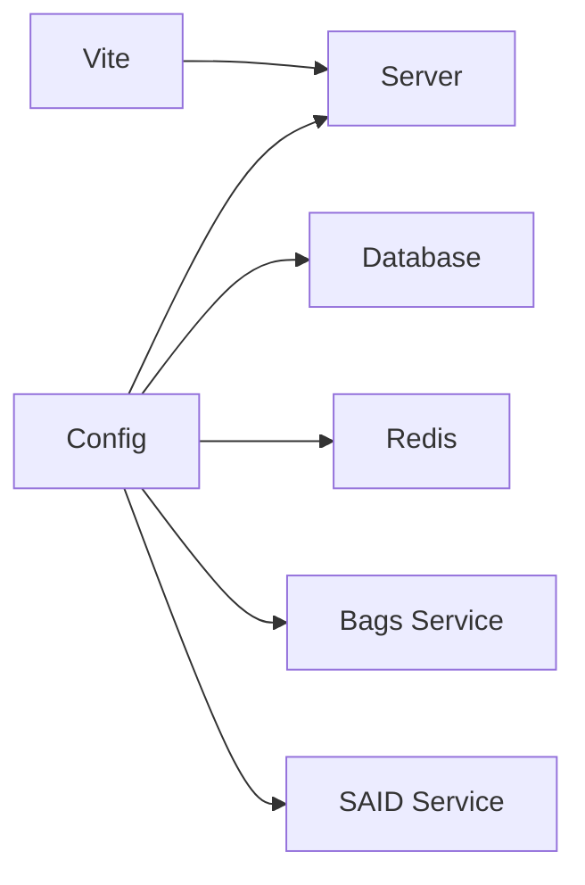

# Configuration Management

<cite>
**Referenced Files in This Document**
- [backend/src/config/index.js](file://backend/src/config/index.js)
- [backend/server.js](file://backend/server.js)
- [backend/src/models/db.js](file://backend/src/models/db.js)
- [backend/src/models/redis.js](file://backend/src/models/redis.js)
- [backend/src/models/migrate.js](file://backend/src/models/migrate.js)
- [backend/src/services/bagsAuthVerifier.js](file://backend/src/services/bagsAuthVerifier.js)
- [backend/src/services/saidBinding.js](file://backend/src/services/saidBinding.js)
- [backend/package.json](file://backend/package.json)
- [frontend/vite.config.js](file://frontend/vite.config.js)
- [frontend/package.json](file://frontend/package.json)
- [agentid_build_plan.md](file://agentid_build_plan.md)
</cite>

## Update Summary
**Changes Made**
- Updated environment variable validation section to reflect new mandatory configuration requirements
- Added new section on environment variable validation and startup behavior
- Updated troubleshooting guide to include validation failure scenarios
- Enhanced security considerations to emphasize mandatory variable requirements
- Updated configuration validation approaches to include startup validation patterns

## Table of Contents
1. [Introduction](#introduction)
2. [Project Structure](#project-structure)
3. [Core Components](#core-components)
4. [Architecture Overview](#architecture-overview)
5. [Detailed Component Analysis](#detailed-component-analysis)
6. [Dependency Analysis](#dependency-analysis)
7. [Performance Considerations](#performance-considerations)
8. [Troubleshooting Guide](#troubleshooting-guide)
9. [Conclusion](#conclusion)
10. [Appendices](#appendices)

## Introduction
This document describes the configuration management system for the AgentID project, focusing on centralized environment configuration, service settings, and frontend build configuration. It explains how environment variables are used to control external integrations (Bags API and SAID Protocol gateway), database and Redis connectivity, CORS, and cache behavior. The system now enforces mandatory configuration validation at startup, requiring critical variables like DATABASE_URL, BAGS_API_KEY, and REDIS_URL to be present. It covers development versus production differences, security considerations for sensitive configuration, validation approaches, and practical deployment examples for local, containerized, and cloud environments.

## Project Structure
The configuration system spans three primary areas:
- Backend configuration module that reads environment variables and exposes a central config object
- Backend services that consume configuration for external API endpoints and timeouts
- Frontend Vite configuration for development proxying and build targets

**Diagram sources**
- [backend/src/config/index.js:1-31](file://backend/src/config/index.js#L1-L31)
- [backend/server.js:1-104](file://backend/server.js#L1-L104)
- [backend/src/models/db.js:1-71](file://backend/src/models/db.js#L1-L71)
- [backend/src/models/redis.js:1-94](file://backend/src/models/redis.js#L1-L94)
- [backend/src/models/migrate.js:1-99](file://backend/src/models/migrate.js#L1-L99)
- [backend/src/services/bagsAuthVerifier.js:1-93](file://backend/src/services/bagsAuthVerifier.js#L1-L93)
- [backend/src/services/saidBinding.js:1-119](file://backend/src/services/saidBinding.js#L1-L119)
- [frontend/vite.config.js:1-42](file://frontend/vite.config.js#L1-L42)

**Section sources**
- [backend/src/config/index.js:1-31](file://backend/src/config/index.js#L1-L31)
- [backend/server.js:1-104](file://backend/server.js#L1-L104)
- [frontend/vite.config.js:1-42](file://frontend/vite.config.js#L1-L42)

## Core Components
Centralized environment configuration is defined in a single module and consumed across services and models. The configuration includes:
- Server settings: port and environment mode
- External API integration: Bags API key and SAID gateway URL
- Database connectivity: connection string
- Redis connectivity: connection URL
- CORS origin for the frontend domain
- Cache and expiry settings: badge cache TTL and challenge expiry

These values are read from environment variables with sensible defaults, enabling quick setup in development while allowing overrides in production. **Critical variables (DATABASE_URL, BAGS_API_KEY, REDIS_URL) are now mandatory and will cause the server to fail fast if missing.**

**Section sources**
- [backend/src/config/index.js:6-28](file://backend/src/config/index.js#L6-L28)

## Architecture Overview
The configuration architecture ensures that all runtime behavior is controlled by environment variables. The server performs mandatory validation at startup, ensuring critical dependencies are present before accepting requests. Services use configuration to call external APIs and manage timeouts. Models use configuration to connect to PostgreSQL and Redis. The frontend Vite configuration proxies API requests to the backend during development and defines build targets for both the main app and the widget.

**Diagram sources**
- [backend/src/config/index.js:6-28](file://backend/src/config/index.js#L6-L28)
- [backend/server.js:3-23](file://backend/server.js#L3-L23)
- [backend/server.js:19-64](file://backend/server.js#L19-L64)
- [backend/src/models/db.js:10-18](file://backend/src/models/db.js#L10-L18)
- [backend/src/models/redis.js:10-20](file://backend/src/models/redis.js#L10-L20)
- [backend/src/services/bagsAuthVerifier.js:18-35](file://backend/src/services/bagsAuthVerifier.js#L18-L35)
- [backend/src/services/saidBinding.js:21-54](file://backend/src/services/saidBinding.js#L21-L54)

## Detailed Component Analysis

### Enhanced Environment Variable Validation and Startup Behavior
The server now performs comprehensive validation at startup to ensure critical configuration is present. **Three variables are now mandatory: DATABASE_URL, BAGS_API_KEY, and REDIS_URL.** The validation process:

1. **Mandatory Variables Check**: Server exits immediately if any required variables are missing
2. **Recommended Variables Check**: Server warns but continues if optional variables are missing
3. **Graceful Degradation**: Services continue operating even if some external dependencies are unavailable

**Diagram sources**
- [backend/server.js:3-23](file://backend/server.js#L3-L23)

**Section sources**
- [backend/server.js:3-23](file://backend/server.js#L3-L23)

### Backend Configuration Module
The configuration module reads environment variables and provides defaults for:
- Port and environment mode
- Bags API key and SAID gateway URL
- Database URL and Redis URL
- CORS origin
- Cache TTL and challenge expiry

**Important**: While the configuration module still provides defaults, the server startup validation enforces that critical variables are present in production environments. The configuration module serves as a fallback for development and testing scenarios.

**Diagram sources**
- [backend/src/config/index.js:6-28](file://backend/src/config/index.js#L6-L28)

**Section sources**
- [backend/src/config/index.js:6-28](file://backend/src/config/index.js#L6-L28)

### Database Configuration and SSL Behavior
The database pool is created using the configuration's database URL. In production mode, SSL is enabled with a disabled certificate verification setting to accommodate various hosting environments. Queries are wrapped with error logging and rethrown to prevent silent failures.

**Diagram sources**
- [backend/src/models/db.js:10-18](file://backend/src/models/db.js#L10-L18)
- [backend/src/models/db.js:21-23](file://backend/src/models/db.js#L21-L23)
- [backend/src/models/db.js:31-39](file://backend/src/models/db.js#L31-L39)

**Section sources**
- [backend/src/models/db.js:10-18](file://backend/src/models/db.js#L10-L18)
- [backend/src/models/db.js:21-23](file://backend/src/models/db.js#L21-L23)
- [backend/src/models/db.js:31-39](file://backend/src/models/db.js#L31-L39)

### Redis Configuration and Retry Strategy
The Redis client is initialized with a retry strategy, maximum retries, and offline queue enabled. Connection events are logged, and cache operations wrap errors for resilience. TTL-based caching is supported for badge data and challenge nonces.

**Diagram sources**
- [backend/src/models/redis.js:10-20](file://backend/src/models/redis.js#L10-L20)
- [backend/src/models/redis.js:23-34](file://backend/src/models/redis.js#L23-L34)
- [backend/src/models/redis.js:58-71](file://backend/src/models/redis.js#L58-L71)

**Section sources**
- [backend/src/models/redis.js:10-20](file://backend/src/models/redis.js#L10-L20)
- [backend/src/models/redis.js:23-34](file://backend/src/models/redis.js#L23-L34)
- [backend/src/models/redis.js:58-71](file://backend/src/models/redis.js#L58-L71)

### External API Integrations Using Configuration
Services use configuration to:
- Call Bags API with Authorization header using the configured API key
- Call SAID Gateway endpoints using the configured gateway URL
- Apply timeouts for external calls

**Diagram sources**
- [backend/src/services/bagsAuthVerifier.js:18-35](file://backend/src/services/bagsAuthVerifier.js#L18-L35)
- [backend/src/services/bagsAuthVerifier.js:65-80](file://backend/src/services/bagsAuthVerifier.js#L65-L80)
- [backend/src/services/saidBinding.js:21-54](file://backend/src/services/saidBinding.js#L21-L54)
- [backend/src/services/saidBinding.js:61-87](file://backend/src/services/saidBinding.js#L61-L87)

**Section sources**
- [backend/src/services/bagsAuthVerifier.js:18-35](file://backend/src/services/bagsAuthVerifier.js#L18-L35)
- [backend/src/services/bagsAuthVerifier.js:65-80](file://backend/src/services/bagsAuthVerifier.js#L65-L80)
- [backend/src/services/saidBinding.js:21-54](file://backend/src/services/saidBinding.js#L21-L54)
- [backend/src/services/saidBinding.js:61-87](file://backend/src/services/saidBinding.js#L61-L87)

### Frontend Build Configuration (Vite)
The frontend Vite configuration:
- Enables React and Tailwind plugins
- Adds a development middleware to serve the widget entry for widget routes
- Defines build inputs for both the main app and the widget
- Proxies API requests to the backend during development

**Diagram sources**
- [frontend/vite.config.js:5-41](file://frontend/vite.config.js#L5-L41)

**Section sources**
- [frontend/vite.config.js:5-41](file://frontend/vite.config.js#L5-L41)

### Environment Variables and Defaults
The authoritative list of environment variables and defaults is defined in the build plan. **Critical variables (DATABASE_URL, BAGS_API_KEY, REDIS_URL) are now mandatory and will cause server startup to fail if missing.** Recommended variables (CORS_ORIGIN, AGENTID_BASE_URL) are validated but allow graceful startup if absent.

**Section sources**
- [agentid_build_plan.md:309-329](file://agentid_build_plan.md#L309-L329)

## Dependency Analysis
Configuration dependencies across modules are straightforward and centralized:
- Server depends on config for port, environment, CORS origin, and rate limiting
- Database and Redis depend on config for connection URLs and production SSL behavior
- Services depend on config for external API keys and gateway URLs
- Frontend Vite depends on backend availability for proxying during development

**Diagram sources**
- [backend/src/config/index.js:6-28](file://backend/src/config/index.js#L6-L28)
- [backend/server.js:19-64](file://backend/server.js#L19-L64)
- [backend/src/models/db.js:10-18](file://backend/src/models/db.js#L10-L18)
- [backend/src/models/redis.js:10-20](file://backend/src/models/redis.js#L10-L20)
- [backend/src/services/bagsAuthVerifier.js:9](file://backend/src/services/bagsAuthVerifier.js#L9)
- [backend/src/services/saidBinding.js:7](file://backend/src/services/saidBinding.js#L7)
- [frontend/vite.config.js:33-39](file://frontend/vite.config.js#L33-L39)

**Section sources**
- [backend/src/config/index.js:6-28](file://backend/src/config/index.js#L6-L28)
- [backend/server.js:19-64](file://backend/server.js#L19-L64)
- [backend/src/models/db.js:10-18](file://backend/src/models/db.js#L10-L18)
- [backend/src/models/redis.js:10-20](file://backend/src/models/redis.js#L10-L20)
- [backend/src/services/bagsAuthVerifier.js:9](file://backend/src/services/bagsAuthVerifier.js#L9)
- [backend/src/services/saidBinding.js:7](file://backend/src/services/saidBinding.js#L7)
- [frontend/vite.config.js:33-39](file://frontend/vite.config.js#L33-L39)

## Performance Considerations
- Database SSL in production improves transport security but may add latency; ensure connection pooling parameters are tuned for expected load.
- Redis retry strategy and offline queue improve resilience under transient failures; monitor reconnect logs to detect persistent issues.
- Cache TTL for badges balances freshness and load reduction; adjust based on observed traffic patterns.
- Challenge expiry prevents replay attacks and limits stale nonce usage; ensure clients handle expiration gracefully.
- **Startup validation adds minimal overhead but prevents wasted resources on misconfigured deployments.**

## Troubleshooting Guide
Common configuration-related issues and resolutions:

### Startup Validation Failures
**Critical Variables Missing**: Server exits immediately with fatal error
- **Symptom**: Process terminates with "FATAL: Missing required environment variables"
- **Solution**: Set DATABASE_URL, BAGS_API_KEY, and REDIS_URL in environment
- **Prevention**: Use `.env` file or platform environment variables

**Recommended Variables Missing**: Server starts but logs warnings
- **Symptom**: Warning messages about missing CORS_ORIGIN or AGENTID_BASE_URL
- **Solution**: Set optional variables for production deployment
- **Impact**: System continues operating with default values

### CORS Errors
- **Cause**: CORS_ORIGIN not matching frontend origin
- **Solution**: Set CORS_ORIGIN to match frontend domain
- **Development**: Default to localhost:5173

### Database Connection Failures
- **Cause**: Invalid DATABASE_URL format or credentials
- **Solution**: Verify connection string format and database accessibility
- **Production**: SSL is enabled automatically

### Redis Unavailability
- **Cause**: Invalid REDIS_URL or network connectivity
- **Impact**: Cache operations fail but system continues
- **Resolution**: Fix connection URL and network access

### External API Timeouts
- **Cause**: Invalid BAGS_API_KEY or network issues
- **Solution**: Verify API key validity and network connectivity
- **Timeouts**: Applied to external calls to prevent hanging

### Migration Failures
- **Cause**: Database schema issues or permissions
- **Solution**: Run migration script to create required tables and indexes

**Section sources**
- [backend/src/models/db.js:10-18](file://backend/src/models/db.js#L10-L18)
- [backend/src/models/redis.js:23-34](file://backend/src/models/redis.js#L23-L34)
- [backend/src/services/bagsAuthVerifier.js:18-35](file://backend/src/services/bagsAuthVerifier.js#L18-L35)
- [backend/src/models/migrate.js:66-91](file://backend/src/models/migrate.js#L66-L91)

## Conclusion
The AgentID configuration system is intentionally simple and centralized with enhanced validation. **Critical environment variables are now mandatory**, preventing misconfigured deployments from reaching production. Environment variables control all runtime behavior, enabling consistent deployments across environments. By keeping secrets out of source and validating configuration at startup, the system remains secure and maintainable. The frontend Vite configuration supports efficient development workflows and predictable production builds.

## Appendices

### Environment Variable Reference
- **Mandatory (Critical)**: DATABASE_URL, BAGS_API_KEY, REDIS_URL
- **Recommended**: CORS_ORIGIN, AGENTID_BASE_URL
- **Optional**: PORT, NODE_ENV, SAID_GATEWAY_URL, BADGE_CACHE_TTL, CHALLENGE_EXPIRY_SECONDS

**Section sources**
- [agentid_build_plan.md:309-329](file://agentid_build_plan.md#L309-L329)

### Development vs Production Differences
- **Database SSL**: Enabled in production mode to enforce encrypted connections
- **CORS Origin**: Defaults differ between development and production origins
- **Node Environment**: Controls logging verbosity and security middleware behavior
- **Validation**: Production requires all mandatory variables, development allows defaults

**Section sources**
- [backend/src/models/db.js:13-17](file://backend/src/models/db.js#L13-L17)
- [backend/src/config/index.js:22](file://backend/src/config/index.js#L22)
- [backend/server.js:21-28](file://backend/server.js#L21-L28)

### Security Considerations
- **Mandatory Variables**: Critical variables must be provided to prevent misconfiguration
- **Secrets Management**: Keep secrets out of version control; use environment variables or secret managers
- **Startup Validation**: Early detection of configuration issues prevents running with invalid settings
- **Graceful Degradation**: Non-critical services continue operating if external dependencies fail
- **Redis as Cache**: Treat Redis as non-critical; application logic should not fail when cache is unavailable

### Configuration Validation Approaches
- **Startup Validation**: Log effective configuration values and environment mode
- **Early Validation**: Ensure required variables are present before accepting requests
- **Typed Parsing**: Use parseInt for numeric values (ports, TTLs) with bounds checking
- **Graceful Warning**: Log warnings for recommended variables without failing startup

### Frontend Build Configuration Notes
- **Development Proxy**: Targets backend port for seamless API calls
- **Build Inputs**: Include both main app and widget entry for standalone embedding
- **Widget Middleware**: Rewrites widget routes to widget entry during development

**Section sources**
- [frontend/vite.config.js:33-39](file://frontend/vite.config.js#L33-L39)
- [frontend/vite.config.js:24-29](file://frontend/vite.config.js#L24-L29)
- [frontend/vite.config.js:10-21](file://frontend/vite.config.js#L10-L21)

### Deployment Scenarios and Examples
- **Local Development**: Start backend and frontend; Vite proxies API requests to the backend
- **Containerization**: Expose backend port, set environment variables, and mount volumes for static assets if needed
- **Cloud Platforms**: Set environment variables in platform configuration; ensure database and Redis endpoints are reachable; configure SSL for database connections in production

### Environment Variable Validation Patterns
The server implements a two-tier validation approach:
1. **Mandatory Variables**: Variables that cause immediate failure if missing
2. **Recommended Variables**: Variables that trigger warnings but allow continued startup

**Section sources**
- [backend/server.js:3-23](file://backend/server.js#L3-L23)