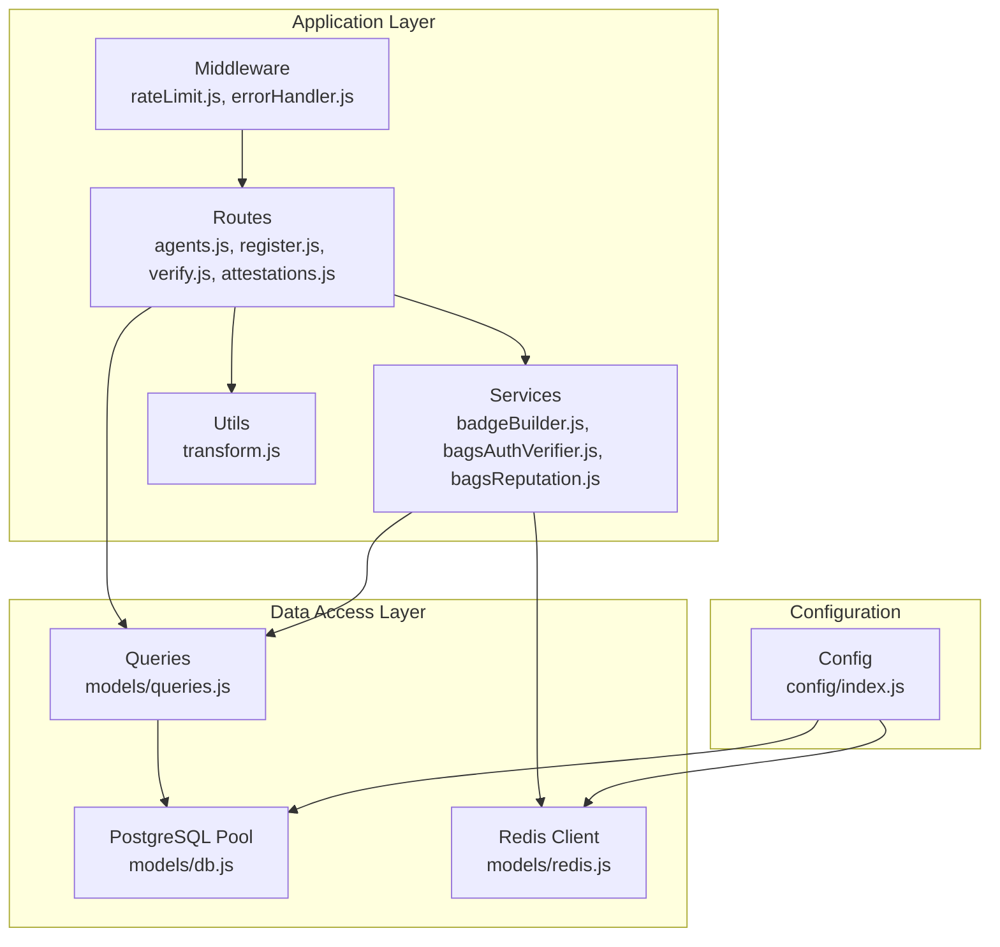
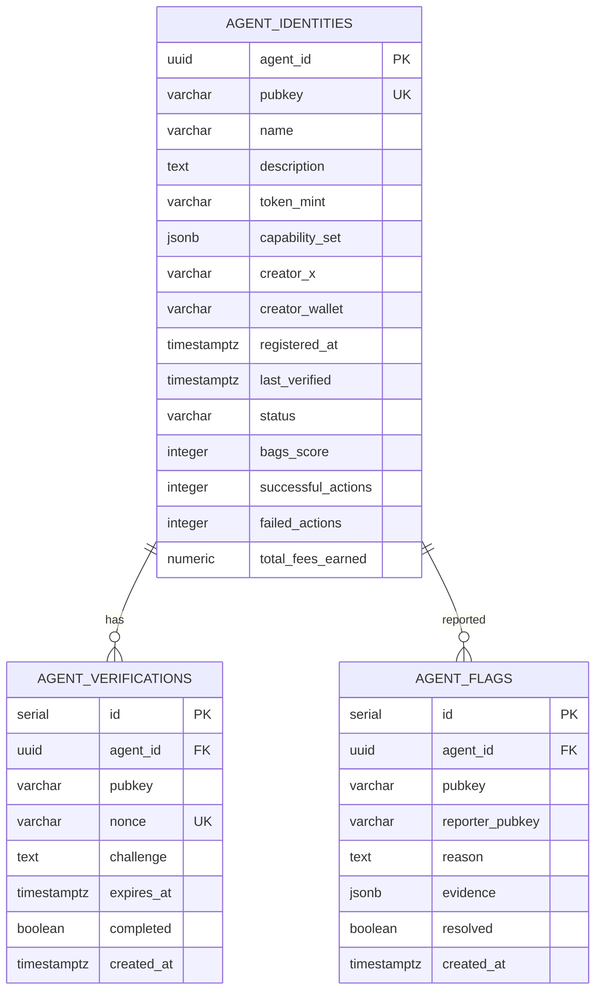
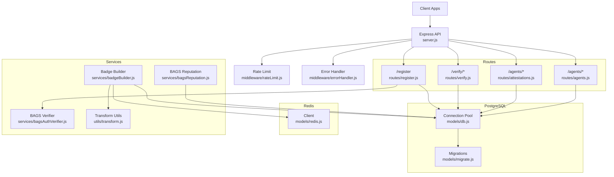
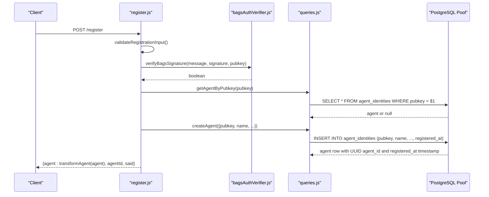
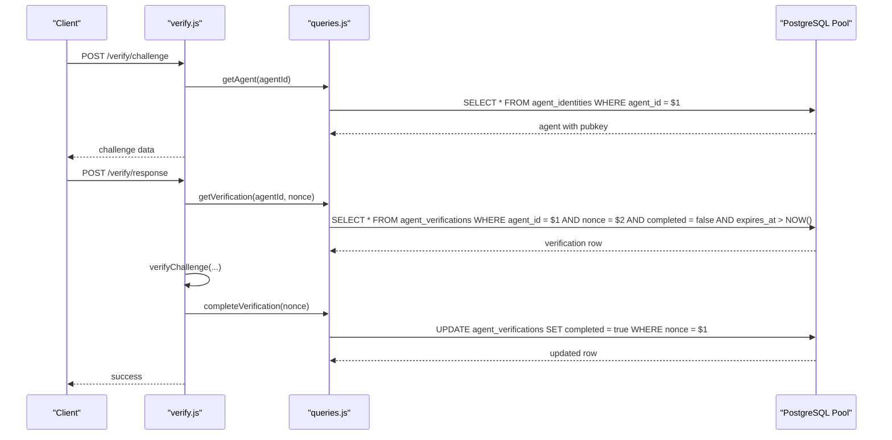
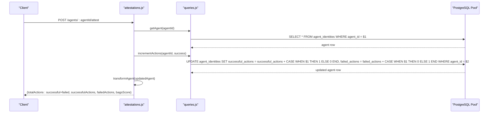
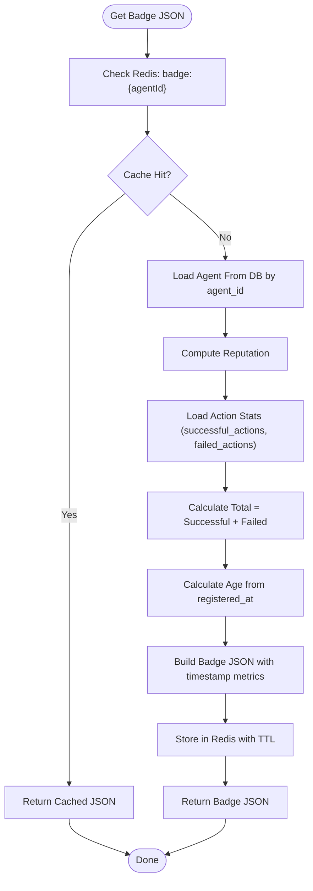
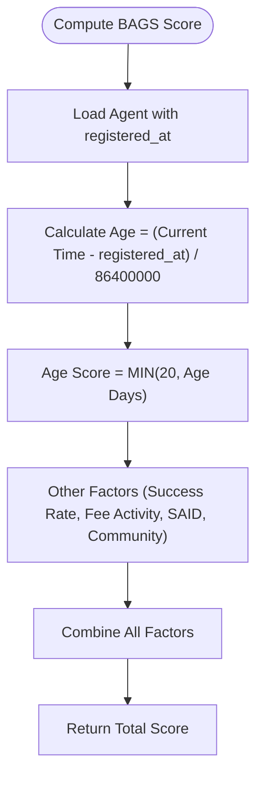
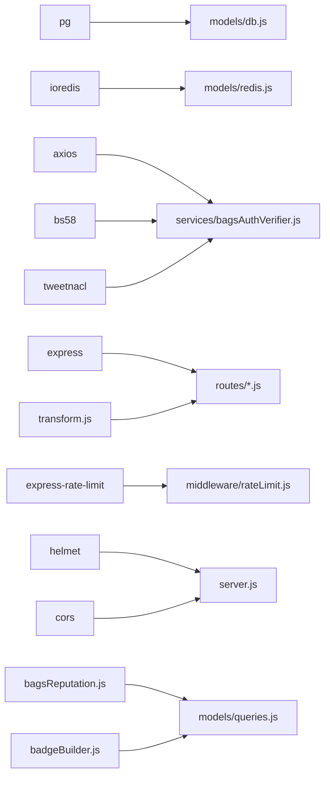

# Database Design

<cite>
**Referenced Files in This Document**
- [server.js](file://backend/server.js)
- [config/index.js](file://backend/src/config/index.js)
- [models/db.js](file://backend/src/models/db.js)
- [models/migrate.js](file://backend/src/models/migrate.js)
- [models/redis.js](file://backend/src/models/redis.js)
- [models/queries.js](file://backend/src/models/queries.js)
- [routes/agents.js](file://backend/src/routes/agents.js)
- [routes/register.js](file://backend/src/routes/register.js)
- [routes/verify.js](file://backend/src/routes/verify.js)
- [routes/attestations.js](file://backend/src/routes/attestations.js)
- [services/badgeBuilder.js](file://backend/src/services/badgeBuilder.js)
- [services/bagsAuthVerifier.js](file://backend/src/services/bagsAuthVerifier.js)
- [services/bagsReputation.js](file://backend/src/services/bagsReputation.js)
- [middleware/errorHandler.js](file://backend/src/middleware/errorHandler.js)
- [middleware/rateLimit.js](file://backend/src/middleware/rateLimit.js)
- [utils/transform.js](file://backend/src/utils/transform.js)
- [package.json](file://backend/package.json)
</cite>

## Update Summary
**Changes Made**
- Updated agent_identities table schema to include registered_at timestamp field for audit trail and onboarding tracking
- Enhanced registration workflow to capture agent registration timestamps
- Updated badge builder service to include registered_at in badge metadata
- Integrated registered_at field into BAGS reputation scoring for agent age calculations
- Added ORDER BY registered_at DESC clause for owner-based agent queries

## Table of Contents
1. [Introduction](#introduction)
2. [Project Structure](#project-structure)
3. [Core Components](#core-components)
4. [Architecture Overview](#architecture-overview)
5. [Detailed Component Analysis](#detailed-component-analysis)
6. [Dependency Analysis](#dependency-analysis)
7. [Performance Considerations](#performance-considerations)
8. [Troubleshooting Guide](#troubleshooting-guide)
9. [Conclusion](#conclusion)
10. [Appendices](#appendices)

## Introduction
This document provides comprehensive data model documentation for the AgentID database schema and Redis caching strategy. The system has been enhanced with a registered_at timestamp field in the agent identities table, providing valuable audit trail information and enabling better user onboarding tracking. This timestamp captures when agents register with the system, supporting compliance requirements and user analytics.

## Project Structure
The backend is organized around a layered architecture with UUID-based agent identification and comprehensive timestamp tracking:
- Configuration and environment variables
- Database connectivity and migrations with UUID primary keys and enhanced timestamp fields
- Query layer for reusable SQL operations with agent_id UUID parameters
- Route handlers for API endpoints using UUID identifiers
- Services for external integrations, reputation scoring, and badge building
- Middleware for security, rate limiting, and error handling

**Diagram sources**
- [server.js:10-53](file://backend/server.js#L10-L53)
- [routes/agents.js:1-277](file://backend/src/routes/agents.js#L1-L277)
- [routes/register.js:1-162](file://backend/src/routes/register.js#L1-L162)
- [routes/verify.js:1-115](file://backend/src/routes/verify.js#L1-L115)
- [routes/attestations.js:1-246](file://backend/src/routes/attestations.js#L1-L246)
- [services/badgeBuilder.js:1-556](file://backend/src/services/badgeBuilder.js#L1-L556)
- [services/bagsAuthVerifier.js:1-87](file://backend/src/services/bagsAuthVerifier.js#L1-L87)
- [services/bagsReputation.js:1-146](file://backend/src/services/bagsReputation.js#L1-L146)
- [models/queries.js:1-444](file://backend/src/models/queries.js#L1-L444)
- [models/db.js:1-71](file://backend/src/models/db.js#L1-L71)
- [models/redis.js:1-94](file://backend/src/models/redis.js#L1-L94)
- [config/index.js:1-34](file://backend/src/config/index.js#L1-L34)
- [utils/transform.js:1-125](file://backend/src/utils/transform.js#L1-L125)

**Section sources**
- [server.js:10-53](file://backend/server.js#L10-L53)
- [config/index.js:6-27](file://backend/src/config/index.js#L6-L27)

## Core Components
This section documents the core database schema and caching strategy with UUID-based agent identification and comprehensive timestamp tracking.

### PostgreSQL Schema: agent_identities
- **Purpose**: Primary agent registry with reputation metrics, metadata, and audit trail timestamps
- **Primary key**: agent_id (UUID, generated by gen_random_uuid())
- **Notable fields**:
  - pubkey (VARCHAR(88), NOT NULL) - for backward compatibility and ownership validation
  - name (VARCHAR(255), NOT NULL)
  - description (TEXT)
  - token_mint (VARCHAR(88))
  - capability_set (JSONB DEFAULT '[]')
  - creator_x (VARCHAR(255))
  - creator_wallet (VARCHAR(88))
  - registered_at (TIMESTAMPTZ DEFAULT NOW()) - **NEW**: Timestamp when agent registered
  - last_verified (TIMESTAMPTZ)
  - status (VARCHAR(20) DEFAULT 'verified')
  - bags_score (INTEGER DEFAULT 0)
  - successful_actions (INTEGER DEFAULT 0)
  - failed_actions (INTEGER DEFAULT 0)
  - total_fees_earned (NUMERIC(20,9) DEFAULT 0)
  - UNIQUE constraint: (pubkey, name)

**Enhanced Audit Trail**:
- registered_at: TIMESTAMPTZ DEFAULT NOW() - **NEW**: Captures agent registration timestamp for compliance and analytics
- Supports onboarding tracking and user lifecycle analysis
- Enables chronological ordering of agent registrations

Constraints and indexes:
- Primary key on agent_id
- UNIQUE constraint on (pubkey, name)
- Indexes:
  - idx_agent_identities_pubkey on pubkey
  - idx_agent_identities_status on status
  - idx_agent_identities_bags_score on bags_score
  - idx_agent_identities_creator_wallet on creator_wallet

Business rules enforced by application logic:
- Status transitions and flag_reason updates are handled via dedicated update functions
- Action counters are incremented atomically via SQL updates with DEFAULT values
- Discovery queries filter by status = 'verified' and order by bags_score DESC
- Ownership validation uses pubkey field while internal operations use agent_id UUID
- Registration timestamps are captured automatically during agent creation
- Agent listing by owner orders results by registration date (newest first)

**Updated** Added registered_at timestamp field for comprehensive audit trail

**Section sources**
- [models/migrate.js:10-29](file://backend/src/models/migrate.js#L10-L29)
- [models/migrate.js:55-65](file://backend/src/models/migrate.js#L55-L65)
- [models/queries.js:17-29](file://backend/src/models/queries.js#L17-L29)
- [models/queries.js:36-49](file://backend/src/models/queries.js#L36-L49)
- [models/queries.js:57-62](file://backend/src/models/queries.js#L57-L62)
- [models/queries.js:204-216](file://backend/src/models/queries.js#L204-L216)
- [models/queries.js:222-239](file://backend/src/models/queries.js#L222-L239)

### PostgreSQL Schema: agent_verifications
- **Purpose**: Challenge-response tracking for PKI verification
- **Primary key**: id (SERIAL)
- **Foreign key**: agent_id UUID REFERENCES agent_identities(agent_id) ON DELETE CASCADE
- **Notable fields**:
  - agent_id (UUID, NOT NULL) - references agent_identities
  - pubkey (VARCHAR(88), NOT NULL) - for verification purposes
  - nonce (VARCHAR(64), UNIQUE, NOT NULL)
  - challenge (TEXT NOT NULL)
  - expires_at (TIMESTAMPTZ NOT NULL)
  - completed (BOOLEAN DEFAULT false)
  - created_at (TIMESTAMPTZ DEFAULT NOW())

Constraints and indexes:
- Unique constraint on nonce
- Indexes:
  - idx_agent_verifications_agent_id on agent_id
  - idx_agent_verifications_pubkey on pubkey

Business rules enforced by application logic:
- Pending verifications are filtered by completed = false and expires_at > NOW()
- Challenges are created with an expiration derived from configuration
- Responses mark the verification as completed upon successful signature verification
- Foreign key cascade deletion maintains referential integrity

**Updated** Foreign key now references agent_id UUID instead of pubkey

**Section sources**
- [models/migrate.js:31-41](file://backend/src/models/migrate.js#L31-L41)
- [models/migrate.js:60](file://backend/src/models/migrate.js#L60)
- [models/queries.js:249-258](file://backend/src/models/queries.js#L249-L258)
- [models/queries.js:266-276](file://backend/src/models/queries.js#L266-L276)

### PostgreSQL Schema: agent_flags
- **Purpose**: Community moderation system for reporting agents
- **Primary key**: id (SERIAL)
- **Foreign key**: agent_id UUID REFERENCES agent_identities(agent_id) ON DELETE CASCADE
- **Notable fields**:
  - agent_id (UUID, NOT NULL) - references agent_identities
  - pubkey (VARCHAR(88), NOT NULL) - for reporting purposes
  - reporter_pubkey (VARCHAR(88))
  - reason (TEXT NOT NULL)
  - evidence (JSONB)
  - resolved (BOOLEAN DEFAULT false)
  - created_at (TIMESTAMPTZ DEFAULT NOW())

Constraints and indexes:
- Indexes:
  - idx_agent_flags_agent_id on agent_id
  - idx_agent_flags_pubkey on pubkey
  - idx_agent_flags_resolved on resolved
  - idx_agent_flags_agent_id_resolved on (agent_id, resolved)

Business rules enforced by application logic:
- Flags are created with reporter_pubkey and optional evidence
- Unresolved flag counts are computed for moderation workflows
- Resolutions toggle resolved = true
- Foreign key cascade deletion maintains referential integrity

**Updated** Foreign key now references agent_id UUID instead of pubkey

**Section sources**
- [models/migrate.js:43-53](file://backend/src/models/migrate.js#L43-L53)
- [models/migrate.js:62-65](file://backend/src/models/migrate.js#L62-L65)
- [models/queries.js:303-315](file://backend/src/models/queries.js#L303-L315)
- [models/queries.js:322-341](file://backend/src/models/queries.js#L322-L341)

### Relationship Model

**Updated** Relationships now use UUID foreign keys with enhanced timestamp tracking

**Diagram sources**
- [models/migrate.js:10-53](file://backend/src/models/migrate.js#L10-L53)

## Architecture Overview
The system integrates PostgreSQL for durable persistence and Redis for high-throughput, short-lived caching. The application exposes REST endpoints that orchestrate database writes and reads, and Redis operations for badge caching. The enhanced timestamp tracking architecture provides comprehensive audit trails and improved data analytics capabilities.

**Diagram sources**
- [server.js:10-64](file://backend/server.js#L10-L64)
- [routes/register.js:59-153](file://backend/src/routes/register.js#L59-L153)
- [routes/verify.js:20-112](file://backend/src/routes/verify.js#L20-L112)
- [routes/attestations.js:27-75](file://backend/src/routes/attestations.js#L27-L75)
- [routes/agents.js:23-277](file://backend/src/routes/agents.js#L23-L277)
- [services/badgeBuilder.js:16-83](file://backend/src/services/badgeBuilder.js#L16-L83)
- [services/bagsAuthVerifier.js:18-80](file://backend/src/services/bagsAuthVerifier.js#L18-L80)
- [services/bagsReputation.js:16-80](file://backend/src/services/bagsReputation.js#L16-L80)
- [utils/transform.js:44-61](file://backend/src/utils/transform.js#L44-L61)
- [models/db.js:10-18](file://backend/src/models/db.js#L10-L18)
- [models/redis.js:10-20](file://backend/src/models/redis.js#L10-L20)
- [models/migrate.js:66-91](file://backend/src/models/migrate.js#L66-L91)
- [middleware/rateLimit.js:23-55](file://backend/src/middleware/rateLimit.js#L23-L55)
- [middleware/errorHandler.js:15-41](file://backend/src/middleware/errorHandler.js#L15-L41)

## Detailed Component Analysis

### Database Connection and Pooling
- Connection pool uses the pg package with a connection string from configuration
- Production SSL behavior sets rejectUnauthorized to false when NODE_ENV is production
- Pool error events are logged without crashing the process
- Query wrapper executes parameterized SQL and logs errors before rethrowing

Operational notes:
- Connection string is configured via DATABASE_URL
- SSL settings are environment-driven
- Error logging occurs at pool and query levels

**Section sources**
- [models/db.js:10-18](file://backend/src/models/db.js#L10-L18)
- [models/db.js:21-39](file://backend/src/models/db.js#L21-L39)
- [config/index.js:16](file://backend/src/config/index.js#L16)

### Migration Management
- Migration script creates tables and indexes in a transaction
- Creates agent_identities, agent_verifications, and agent_flags with UUID primary keys
- **Enhanced**: Adds registered_at timestamp field to agent_identities table
- Adds indexes for performance on pubkey, status, bags_score, creator_wallet, agent_id, and resolved
- Uses a single SQL block to define all schema elements with enhanced constraints

Lifecycle considerations:
- Run via npm script: migrate
- Transactional execution ensures atomicity
- Index creation improves query performance for common filters
- UNIQUE constraint on (pubkey, name) prevents duplicate agent registrations
- **NEW**: registered_at field automatically captures registration timestamps

**Updated** Migration script now includes registered_at timestamp field for comprehensive audit trail

**Section sources**
- [models/migrate.js:9-64](file://backend/src/models/migrate.js#L9-L64)
- [models/migrate.js:66-91](file://backend/src/models/migrate.js#L66-L91)

### Redis Caching Strategy
- Redis client uses ioredis with retryStrategy, maxRetriesPerRequest, and enableOfflineQueue
- Cache keys for badges follow the pattern: badge:{agentId} (UUID-based)
- TTL for badges is configured via BADGE_CACHE_TTL (default 60 seconds)
- Cache operations include get, set with TTL, and delete

Key naming conventions:
- badge:{agentId} for badge JSON cache using UUID

Expiration policy:
- Badge cache TTL is configurable and defaults to 60 seconds

**Updated** Cache keys now use UUID-based badge:{agentId} pattern

**Section sources**
- [models/redis.js:10-20](file://backend/src/models/redis.js#L10-L20)
- [models/redis.js:41-71](file://backend/src/models/redis.js#L41-L71)
- [config/index.js:25-26](file://backend/src/config/index.js#L25-L26)
- [services/badgeBuilder.js:17-83](file://backend/src/services/badgeBuilder.js#L17-L83)

### Business Workflows and Data Validation

#### Registration Workflow
- Validates request body fields (pubkey length, name length, presence of signature/message/nonce)
- Verifies Bags signature using Ed25519 and base58 decoding
- Prevents replay by ensuring nonce appears in the message
- Checks for existing agent to avoid duplicates using UNIQUE (pubkey, name) constraint
- **Enhanced**: Automatically captures registration timestamp during agent creation
- Attempts SAID binding (non-blocking) and stores agent record in PostgreSQL with UUID primary key
- Returns agent data with agentId and SAID status

**Updated** Registration now captures registered_at timestamp automatically

**Diagram sources**
- [routes/register.js:59-153](file://backend/src/routes/register.js#L59-L153)
- [services/bagsAuthVerifier.js:44-57](file://backend/src/services/bagsAuthVerifier.js#L44-L57)
- [models/queries.js:17-29](file://backend/src/models/queries.js#L17-L29)
- [models/db.js:31-39](file://backend/src/models/db.js#L31-L39)

**Section sources**
- [routes/register.js:20-53](file://backend/src/routes/register.js#L20-L53)
- [routes/register.js:82-95](file://backend/src/routes/register.js#L82-L95)
- [routes/register.js:97-104](file://backend/src/routes/register.js#L97-L104)
- [routes/register.js:132-142](file://backend/src/routes/register.js#L132-L142)

#### Verification Workflow
- Issues a PKI challenge bound to an agent UUID
- Responds to the challenge by verifying signature and checking nonce validity
- Marks verification as completed upon success
- Enforces expiration and completion checks in queries
- Uses agent_id foreign key for proper relationship management

**Updated** Verification now uses UUID-based agent identification and foreign key relationships

**Diagram sources**
- [routes/verify.js:20-49](file://backend/src/routes/verify.js#L20-L49)
- [routes/verify.js:55-112](file://backend/src/routes/verify.js#L55-L112)
- [models/queries.js:266-276](file://backend/src/models/queries.js#L266-L276)
- [models/queries.js:283-292](file://backend/src/models/queries.js#L283-L292)

**Section sources**
- [routes/verify.js:20-49](file://backend/src/routes/verify.js#L20-L49)
- [routes/verify.js:55-112](file://backend/src/routes/verify.js#L55-L112)
- [models/queries.js:249-258](file://backend/src/models/queries.js#L249-L258)
- [models/queries.js:266-276](file://backend/src/models/queries.js#L266-L276)
- [models/queries.js:283-292](file://backend/src/models/queries.js#L283-L292)

#### Attestation and Action Tracking Workflow
- Records successful/failed actions with atomic counter updates
- Updates BAGS score on successful actions
- Returns transformed agent data with computed metrics

**Updated** Attestation workflow now uses simplified action metrics and dynamic calculation

**Diagram sources**
- [routes/attestations.js:27-75](file://backend/src/routes/attestations.js#L27-L75)
- [models/queries.js:204-216](file://backend/src/models/queries.js#L204-L216)
- [models/queries.js:222-239](file://backend/src/models/queries.js#L222-L239)
- [utils/transform.js:44-61](file://backend/src/utils/transform.js#L44-L61)

**Section sources**
- [routes/attestations.js:27-75](file://backend/src/routes/attestations.js#L27-L75)
- [models/queries.js:204-216](file://backend/src/models/queries.js#L204-L216)
- [models/queries.js:222-239](file://backend/src/models/queries.js#L222-L239)
- [utils/transform.js:44-61](file://backend/src/utils/transform.js#L44-L61)

#### Badge Retrieval and Caching
- Badge JSON retrieval follows a cache-first strategy with fallback to DB
- Computes reputation and aggregates action stats with enhanced timestamp tracking
- Stores badge JSON in Redis with TTL using UUID-based cache keys
- Provides SVG and HTML widget variants with dynamic metrics including registration age

**Updated** Badge caching now includes registered_at timestamp for comprehensive agent metrics

**Diagram sources**
- [services/badgeBuilder.js:16-83](file://backend/src/services/badgeBuilder.js#L16-L83)
- [models/redis.js:41-71](file://backend/src/models/redis.js#L41-L71)
- [models/queries.js:27-39](file://backend/src/models/queries.js#L27-L39)
- [models/queries.js:222-239](file://backend/src/models/queries.js#L222-L239)
- [services/bagsReputation.js:56-63](file://backend/src/services/bagsReputation.js#L56-L63)

**Section sources**
- [services/badgeBuilder.js:16-83](file://backend/src/services/badgeBuilder.js#L16-L83)
- [models/redis.js:41-71](file://backend/src/models/redis.js#L41-L71)
- [models/queries.js:27-39](file://backend/src/models/queries.js#L27-L39)
- [models/queries.js:222-239](file://backend/src/models/queries.js#L222-L239)
- [services/bagsReputation.js:56-63](file://backend/src/services/bagsReputation.js#L56-L63)

#### BAGS Reputation Scoring with Registration Age
- **Enhanced**: Incorporates agent registration age into reputation calculations
- Calculates age in days from registered_at timestamp
- Awards up to 20 points based on agent age (linear scaling)
- Combines registration age with other factors for comprehensive scoring

**Updated** BAGS reputation now includes registered_at timestamp for agent age calculations

**Diagram sources**
- [services/bagsReputation.js:56-63](file://backend/src/services/bagsReputation.js#L56-L63)

**Section sources**
- [services/bagsReputation.js:56-63](file://backend/src/services/bagsReputation.js#L56-L63)

## Dependency Analysis
External dependencies relevant to data and caching:
- PostgreSQL driver (pg): connection pooling and SQL execution with UUID support
- Redis client (ioredis): caching with retry and offline queue
- Express ecosystem: routing, rate limiting, error handling
- Utility libraries: base58, tweetnacl for Ed25519 operations
- Transform utilities for data formatting

**Diagram sources**
- [package.json:18-29](file://backend/package.json#L18-L29)
- [models/db.js:6](file://backend/src/models/db.js#L6)
- [models/redis.js:6](file://backend/src/models/redis.js#L6)
- [services/bagsAuthVerifier.js:6-8](file://backend/src/services/bagsAuthVerifier.js#L6-L8)
- [routes/register.js:6-11](file://backend/src/routes/register.js#L6-L11)
- [middleware/rateLimit.js:6](file://backend/src/middleware/rateLimit.js#L6)
- [server.js:3-8](file://backend/server.js#L3-L8)
- [utils/transform.js:116-125](file://backend/src/utils/transform.js#L116-L125)
- [services/bagsReputation.js:16-80](file://backend/src/services/bagsReputation.js#L16-L80)
- [services/badgeBuilder.js:16-83](file://backend/src/services/badgeBuilder.js#L16-L83)

**Section sources**
- [package.json:18-29](file://backend/package.json#L18-L29)

## Performance Considerations
- PostgreSQL:
  - Use indexes on frequently filtered columns (status, bags_score) and foreign keys (agent_id, pubkey) to optimize joins and scans
  - Parameterized queries prevent SQL injection and improve plan reuse
  - UUID primary keys provide better distribution for concurrent writes
  - DEFAULT values for action metrics eliminate NULL handling overhead
  - UNIQUE (pubkey, name) constraint prevents duplicate registrations efficiently
  - **NEW**: registered_at timestamp supports efficient chronological queries and analytics
  - **NEW**: ORDER BY registered_at DESC optimization for owner-based agent listings
- Redis:
  - Short TTL for badges balances freshness and load reduction
  - Retry strategy and offline queue improve resilience under transient failures
  - UUID-based cache keys provide better cache locality
  - Consider pipeline operations for batched cache updates
- Application:
  - Rate limiting prevents abuse and protects downstream systems
  - Pagination limits protect query performance on large datasets
  - Discovery queries filter by verified status and order by score to minimize result sets
  - **NEW**: Registration timestamp enables advanced analytics and compliance reporting
  - **NEW**: Agent age calculations integrate seamlessly with existing reputation scoring

## Troubleshooting Guide
Common issues and remedies:
- Database connectivity:
  - Verify DATABASE_URL format and network accessibility
  - Check SSL settings in production; rejectUnauthorized is disabled conditionally
  - Inspect pool error logs for connection failures
- Migration failures:
  - Ensure transactional migration runs to completion; rollback is handled automatically
  - Confirm required indexes are created post-migration including UUID foreign keys
  - Verify UNIQUE (pubkey, name) constraint is properly indexed
  - **NEW**: Confirm registered_at field exists in agent_identities table with DEFAULT NOW()
- Redis connectivity:
  - Monitor connect, error, and reconnect events
  - Cache operations return null/false on failure; handle gracefully
  - Ensure badge:{agentId} cache keys are being used consistently
- API errors:
  - Global error handler logs structured errors and returns JSON responses
  - Rate limiting triggers 429 responses with contextual messages
- Verification challenges:
  - Ensure nonce is included in the message and not expired
  - Validate signatures using Ed25519 and base58 decoding
  - Verify agent_id UUID format in verification requests
- Action metrics:
  - DEFAULT values for successful_actions and failed_actions prevent NULL handling
  - Enhanced metrics provide better observability of agent behavior without data redundancy
- **NEW**: Registration timestamp issues:
  - Verify registered_at field is populated during agent creation
  - Check that DEFAULT NOW() constraint is active
  - Ensure ORDER BY registered_at DESC works correctly for owner queries
  - Validate that BAGS reputation calculations use registered_at for age scoring

**Section sources**
- [models/db.js:21-23](file://backend/src/models/db.js#L21-L23)
- [models/migrate.js:83-89](file://backend/src/models/migrate.js#L83-L89)
- [models/redis.js:23-34](file://backend/src/models/redis.js#L23-L34)
- [middleware/errorHandler.js:15-41](file://backend/src/middleware/errorHandler.js#L15-L41)
- [middleware/rateLimit.js:37-41](file://backend/src/middleware/rateLimit.js#L37-L41)
- [routes/verify.js:87-107](file://backend/src/routes/verify.js#L87-L107)
- [models/queries.js:57-62](file://backend/src/models/queries.js#L57-L62)
- [services/bagsReputation.js:56-63](file://backend/src/services/bagsReputation.js#L56-L63)

## Conclusion
The AgentID data model centers on three core tables that support identity, verification, and moderation with UUID-based agent identification and comprehensive timestamp tracking. The addition of the registered_at timestamp field has significantly enhanced the system's audit trail capabilities, enabling better user onboarding tracking and compliance reporting. This timestamp automatically captures when agents register with the system, providing valuable insights into user acquisition and engagement patterns.

The enhanced schema maintains the simplified action metrics approach while adding robust timestamp functionality. PostgreSQL provides durable storage with targeted indexes and enhanced constraints, including the new registered_at field with automatic timestamp generation. Redis caches frequently accessed badge data with UUID-based keys, now including comprehensive timestamp metrics.

The application enforces business rules through route handlers and services, with robust error handling and rate limiting. Migrations ensure schema consistency, and configuration enables flexible deployment across environments. The integration of registered_at timestamps with BAGS reputation scoring provides a more nuanced understanding of agent trustworthiness based on both behavioral metrics and temporal factors.

## Appendices

### Configuration Reference
- DATABASE_URL: PostgreSQL connection string
- REDIS_URL: Redis connection string
- BADGE_CACHE_TTL: Cache TTL for badges (seconds)
- CHALLENGE_EXPIRY_SECONDS: Expiration for verification challenges (seconds)
- CORS_ORIGIN: Allowed origin for cross-origin requests
- PORT: Server port
- NODE_ENV: Environment (affects SSL behavior)
- VERIFIED_THRESHOLD: Threshold for verified tier classification

**Section sources**
- [config/index.js:16-31](file://backend/src/config/index.js#L16-L31)

### Enhanced Field Definitions
**New Field**:
- registered_at: TIMESTAMPTZ DEFAULT NOW() - **NEW**: Captures agent registration timestamp for audit trail and onboarding tracking

**Enhanced Usage Examples**:
- Automatic timestamp capture during agent creation via DEFAULT NOW() constraint
- Agent listing by owner ordered by registration date (newest first) using ORDER BY registered_at DESC
- BAGS reputation scoring incorporates agent age calculated from registered_at timestamp
- Badge metadata includes registered_at for comprehensive agent information display
- Compliance reporting and analytics leverage registered_at for user lifecycle analysis

**Section sources**
- [models/migrate.js:21](file://backend/src/models/migrate.js#L21)
- [models/queries.js:57-62](file://backend/src/models/queries.js#L57-L62)
- [models/queries.js:17-29](file://backend/src/models/queries.js#L17-L29)
- [services/bagsReputation.js:56-63](file://backend/src/services/bagsReputation.js#L56-L63)
- [services/badgeBuilder.js:77-78](file://backend/src/services/badgeBuilder.js#L77-L78)