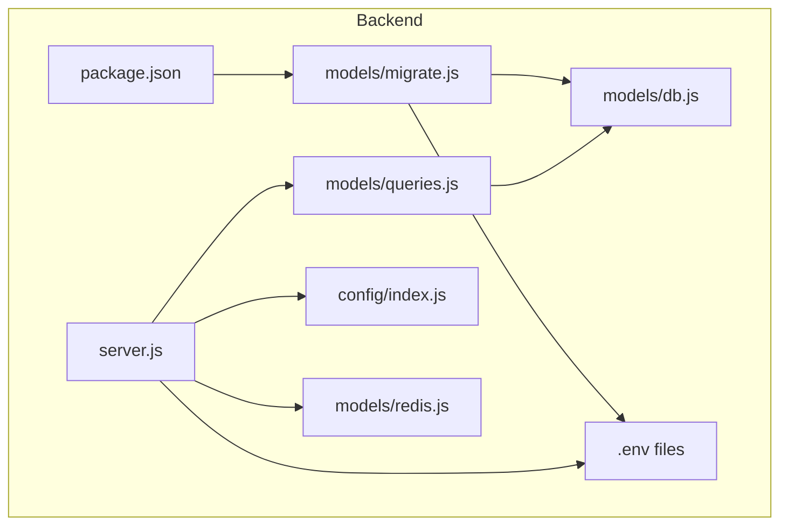
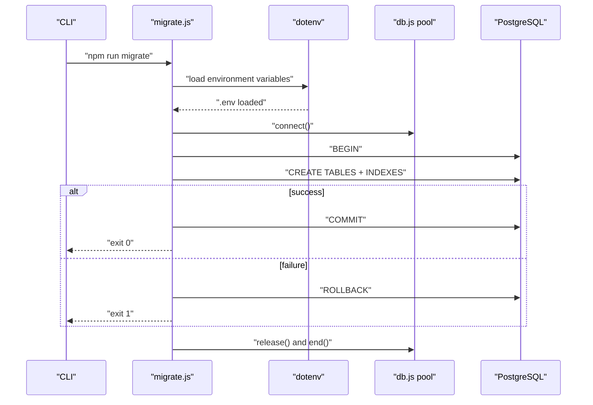
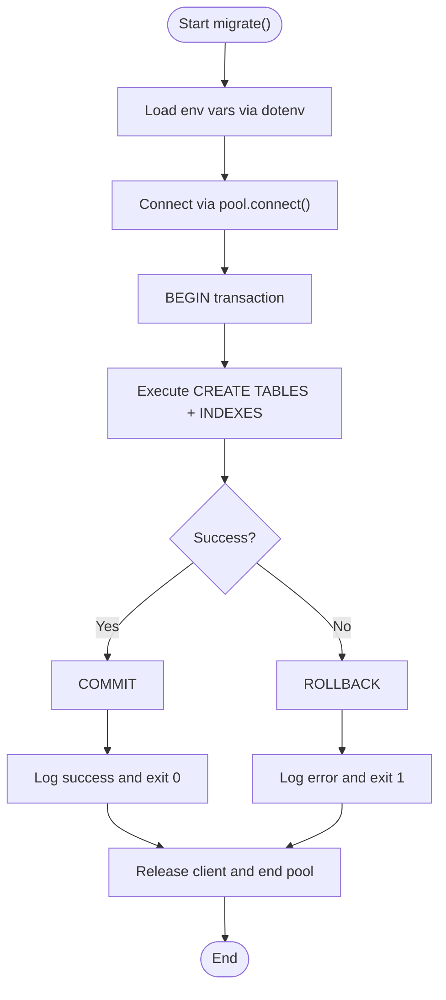
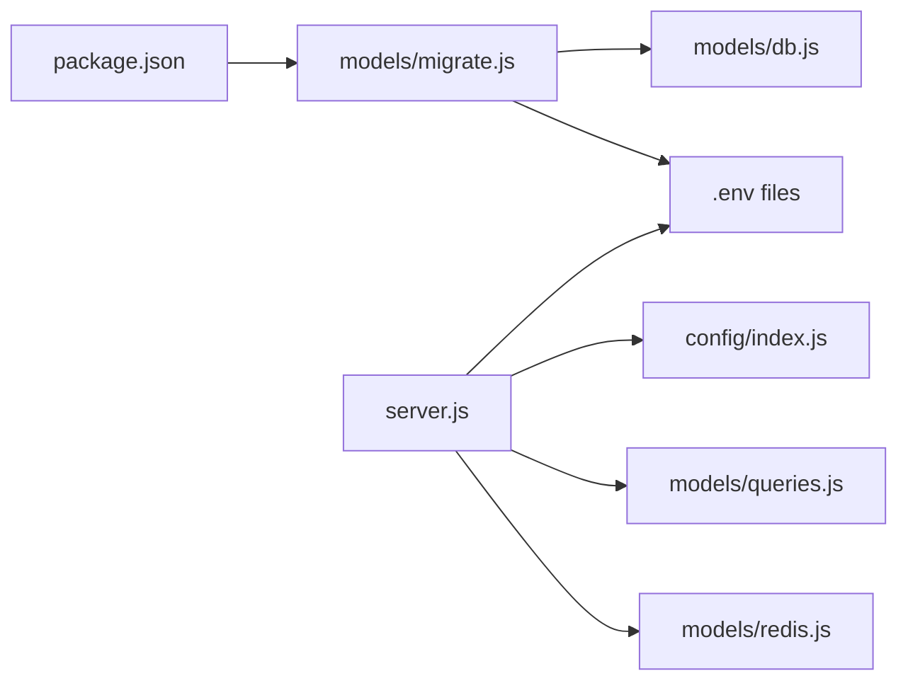

# Migration System

<cite>
**Referenced Files in This Document**
- [migrate.js](file://backend/src/models/migrate.js)
- [db.js](file://backend/src/models/db.js)
- [queries.js](file://backend/src/models/queries.js)
- [redis.js](file://backend/src/models/redis.js)
- [index.js](file://backend/src/config/index.js)
- [server.js](file://backend/server.js)
- [package.json](file://backend/package.json)
- [agentid_build_plan.md](file://agentid_build_plan.md)
- [setup.js](file://backend/tests/setup.js)
</cite>

## Update Summary
**Changes Made**
- Added dotenv configuration loading section to explain environment variable support
- Updated migration script analysis to include dotenv integration
- Enhanced configuration and environment section with dotenv details
- Added troubleshooting guidance for dotenv-related issues

## Table of Contents
1. [Introduction](#introduction)
2. [Project Structure](#project-structure)
3. [Core Components](#core-components)
4. [Architecture Overview](#architecture-overview)
5. [Detailed Component Analysis](#detailed-component-analysis)
6. [Dependency Analysis](#dependency-analysis)
7. [Performance Considerations](#performance-considerations)
8. [Troubleshooting Guide](#troubleshooting-guide)
9. [Conclusion](#conclusion)
10. [Appendices](#appendices)

## Introduction
This document describes the database migration system in AgentID. It explains how the initial schema is created, how migrations are structured and executed, and how the system tracks schema state. It also documents the current migration approach, outlines strategies for future enhancements (such as rollback and versioning), and provides guidance for testing, deployment, and operational best practices.

AgentID uses a straightforward, imperative migration script that creates the initial schema and indexes. The system relies on PostgreSQL for persistence and exposes a dedicated command to apply the migration. The build plan and repository layout confirm that the migration script is the primary mechanism for schema initialization.

**Updated** The migration script now includes dotenv configuration loading at the beginning, enabling environment variable support for database connection management and other configuration settings. This enhancement allows the migration process to properly utilize environment-specific configurations for different deployment environments.

## Project Structure
The migration system resides in the backend under the models directory. The key files involved are:
- Migration script: defines and applies the initial schema and indexes
- Database connection pool: provides connection and query execution
- Query helpers: encapsulate reusable database operations
- Configuration: supplies environment-driven connection settings
- Package scripts: expose the migration command
- Server bootstrap: validates required environment variables before starting the API

**Diagram sources**
- [migrate.js:1-101](file://backend/src/models/migrate.js#L1-L101)
- [db.js:1-71](file://backend/src/models/db.js#L1-L71)
- [queries.js:1-404](file://backend/src/models/queries.js#L1-L404)
- [redis.js:1-94](file://backend/src/models/redis.js#L1-L94)
- [index.js:1-34](file://backend/src/config/index.js#L1-L34)
- [server.js:1-104](file://backend/server.js#L1-L104)
- [package.json:1-38](file://backend/package.json#L1-L38)

**Section sources**
- [migrate.js:1-101](file://backend/src/models/migrate.js#L1-L101)
- [db.js:1-71](file://backend/src/models/db.js#L1-L71)
- [queries.js:1-404](file://backend/src/models/queries.js#L1-L404)
- [redis.js:1-94](file://backend/src/models/redis.js#L1-L94)
- [index.js:1-34](file://backend/src/config/index.js#L1-L34)
- [server.js:1-104](file://backend/server.js#L1-L104)
- [package.json:1-38](file://backend/package.json#L1-L38)

## Core Components
- Migration script: Creates tables and indexes, runs within a transaction, and exits with appropriate status codes
- Database connection pool: Provides a connection pool and a safe query wrapper
- Query helpers: Encapsulate CRUD and aggregation operations against the schema
- Configuration: Supplies DATABASE_URL and other environment variables
- Package scripts: Exposes the migration command
- Server bootstrap: Validates required environment variables before starting the API

Key responsibilities:
- Schema creation and indexing are performed by the migration script
- Application code uses the query helpers to interact with the schema
- The server ensures required environment variables are present before launching
- **Updated** The migration script now loads environment variables via dotenv for flexible configuration management

**Section sources**
- [migrate.js:1-101](file://backend/src/models/migrate.js#L1-L101)
- [db.js:1-71](file://backend/src/models/db.js#L1-L71)
- [queries.js:1-404](file://backend/src/models/queries.js#L1-L404)
- [index.js:16-17](file://backend/src/config/index.js#L16-L17)
- [package.json:9-9](file://backend/package.json#L9-L9)
- [server.js:4-10](file://backend/server.js#L4-L10)

## Architecture Overview
The migration system is a standalone script that connects to the database, executes a transactional schema creation, and logs outcomes. The application's runtime code uses the shared database connection pool and query helpers to operate on the migrated schema.

**Updated** The migration script now includes dotenv configuration loading, allowing it to properly utilize environment-specific configurations for different deployment environments.

**Diagram sources**
- [migrate.js:67-92](file://backend/src/models/migrate.js#L67-L92)
- [db.js:1-71](file://backend/src/models/db.js#L1-L71)
- [server.js:1-104](file://backend/server.js#L1-L104)

## Detailed Component Analysis

### Migration Script
The migration script performs the following:
- **Updated** Loads environment variables using dotenv configuration at startup
- Connects to the database via the shared pool
- Begins a transaction
- Executes the SQL that defines the initial schema and indexes
- Commits on success or rolls back on error
- Logs created tables and indexes
- Exits with status code 0 on success, 1 on failure

**Diagram sources**
- [migrate.js:67-92](file://backend/src/models/migrate.js#L67-L92)

**Section sources**
- [migrate.js:67-92](file://backend/src/models/migrate.js#L67-L92)

### Database Connection Pool
The connection pool:
- Reads DATABASE_URL from configuration
- Adds SSL configuration in production environments
- Emits and handles pool-level errors
- Provides a safe query wrapper that logs and rethrows errors

Operational implications:
- The migration script uses the pool to connect and execute DDL
- Application routes and services use the same pool for DML and queries

**Section sources**
- [db.js:1-71](file://backend/src/models/db.js#L1-L71)
- [index.js:16-17](file://backend/src/config/index.js#L16-L17)

### Query Helpers
The query helpers encapsulate:
- Agent identity operations (create, get, update, list, counts)
- Verification operations (create, get, complete)
- Flag operations (create, get, count unresolved, resolve)
- Discovery and counting utilities

These helpers rely on the shared database connection and parameterized queries to prevent SQL injection.

**Section sources**
- [queries.js:17-180](file://backend/src/models/queries.js#L17-L180)
- [queries.js:213-256](file://backend/src/models/queries.js#L213-L256)
- [queries.js:267-321](file://backend/src/models/queries.js#L267-L321)
- [queries.js:332-375](file://backend/src/models/queries.js#L332-L375)

### Configuration and Environment
Configuration supplies:
- DATABASE_URL for Postgres connection
- Other environment variables validated by the server bootstrap
- **Updated** Environment variables are loaded via dotenv configuration for flexible deployment management

Server bootstrap enforces required environment variables before starting the API.

**Section sources**
- [index.js:16-17](file://backend/src/config/index.js#L16-L17)
- [server.js:4-10](file://backend/server.js#L4-L10)

### Package Scripts
The package exposes a migration script that invokes the migration file directly.

**Section sources**
- [package.json:9-9](file://backend/package.json#L9-L9)

### Build Plan Reference
The build plan documents the initial schema and the intended relationships among tables, including indexes and foreign keys.

**Section sources**
- [agentid_build_plan.md:88-130](file://agentid_build_plan.md#L88-L130)

## Dependency Analysis
The migration script depends on the database connection pool. The application's runtime code depends on the pool and query helpers. The server validates environment variables before serving requests.

**Updated** Both the migration script and server now load environment variables via dotenv for consistent configuration management.

**Diagram sources**
- [migrate.js:7-7](file://backend/src/models/migrate.js#L7-L7)
- [db.js:6-6](file://backend/src/models/db.js#L6-L6)
- [server.js:15-16](file://backend/server.js#L15-L16)
- [queries.js:6-6](file://backend/src/models/queries.js#L6-L6)
- [redis.js:6-7](file://backend/src/models/redis.js#L6-L7)
- [package.json:9-9](file://backend/package.json#L9-L9)

**Section sources**
- [migrate.js:7-7](file://backend/src/models/migrate.js#L7-L7)
- [db.js:6-6](file://backend/src/models/db.js#L6-L6)
- [server.js:15-16](file://backend/server.js#L15-L16)
- [queries.js:6-6](file://backend/src/models/queries.js#L6-L6)
- [redis.js:6-7](file://backend/src/models/redis.js#L6-L7)
- [package.json:9-9](file://backend/package.json#L9-L9)

## Performance Considerations
- The migration script creates indexes designed for common query patterns:
  - Status filtering on agent identities
  - Bags score sorting
  - Foreign key lookups and composite filters on flags
- These indexes support typical application queries for listing, filtering, and ranking agents.

Operational tips:
- Monitor index usage after deployment to validate effectiveness
- Consider partitioning or materialized views if query patterns evolve significantly

**Section sources**
- [migrate.js:58-64](file://backend/src/models/migrate.js#L58-L64)

## Troubleshooting Guide
Common issues and remedies:
- Missing DATABASE_URL: The server bootstrap requires DATABASE_URL and exits if absent. Ensure the environment variable is set before starting the server or running the migration.
- **Updated** Missing .env files: The dotenv configuration loader requires .env files to be present. Create a .env file with the required environment variables or ensure they're available in the deployment environment.
- Migration failures: The migration script logs errors and exits with code 1 on failure. Review logs and ensure the database is reachable and the user has privileges to create tables and indexes.
- Connection errors: The pool emits and handles errors; check network connectivity and credentials.
- Test isolation: Tests mock the database module to avoid connecting to the database. This isolates unit tests from the migration system.

**Section sources**
- [server.js:4-10](file://backend/server.js#L4-L10)
- [migrate.js:84-87](file://backend/src/models/migrate.js#L84-L87)
- [db.js:21-23](file://backend/src/models/db.js#L21-L23)
- [setup.js:9-15](file://backend/tests/setup.js#L9-L15)

## Conclusion
AgentID's current migration system is intentionally minimal: a single transactional script that creates the initial schema and indexes. It integrates cleanly with the rest of the backend through a shared connection pool and query helpers. As the system evolves, consider adopting a formal migration framework to manage versioning, rollbacks, and repeatable deployments across environments.

**Updated** The addition of dotenv configuration loading enhances the migration system's flexibility by enabling environment-specific configurations for different deployment scenarios, improving portability and maintainability across development, staging, and production environments.

## Appendices

### Initial Schema Summary
The initial schema consists of three tables with supporting indexes:
- agent_identities: stores agent records and metrics
- agent_verifications: stores challenge-response nonces and state
- agent_flags: stores community-reported flags

Indexes optimize common filters and sorts.

**Section sources**
- [migrate.js:9-64](file://backend/src/models/migrate.js#L9-L64)
- [agentid_build_plan.md:88-130](file://agentid_build_plan.md#L88-L130)

### Migration Execution Workflow
- Apply the migration using the package script
- Confirm successful completion and logged table/index creation
- Start the server; it validates required environment variables before listening

**Section sources**
- [package.json:9-9](file://backend/package.json#L9-L9)
- [migrate.js:77-81](file://backend/src/models/migrate.js#L77-L81)
- [server.js:77-88](file://backend/server.js#L77-L88)

### Environment Variable Configuration
**Updated** The migration system now supports dotenv configuration for flexible environment management:

- **Environment Loading**: The migration script loads environment variables via `require('dotenv').config()` at startup
- **Configuration Sources**: Environment variables are loaded from .env files or system environment variables
- **Deployment Flexibility**: Different deployment environments can use separate .env files for database connections, API keys, and other settings
- **Security**: Sensitive configuration values can be managed through environment variables rather than hardcoded values

**Section sources**
- [migrate.js:7](file://backend/src/models/migrate.js#L7)
- [server.js:1](file://backend/server.js#L1)
- [index.js:16-17](file://backend/src/config/index.js#L16-L17)