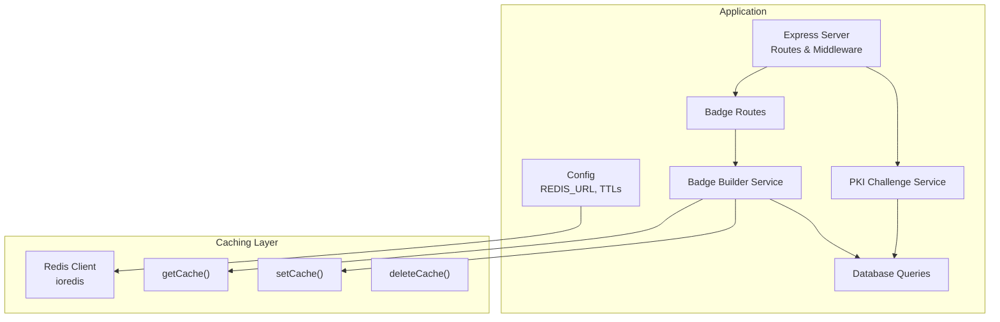
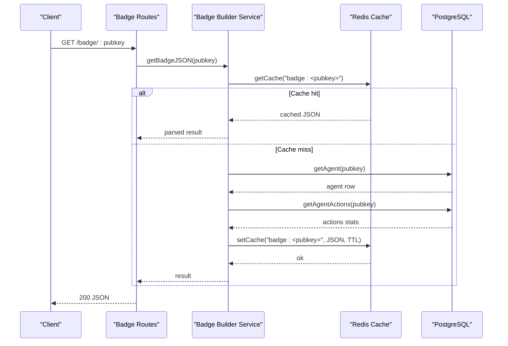
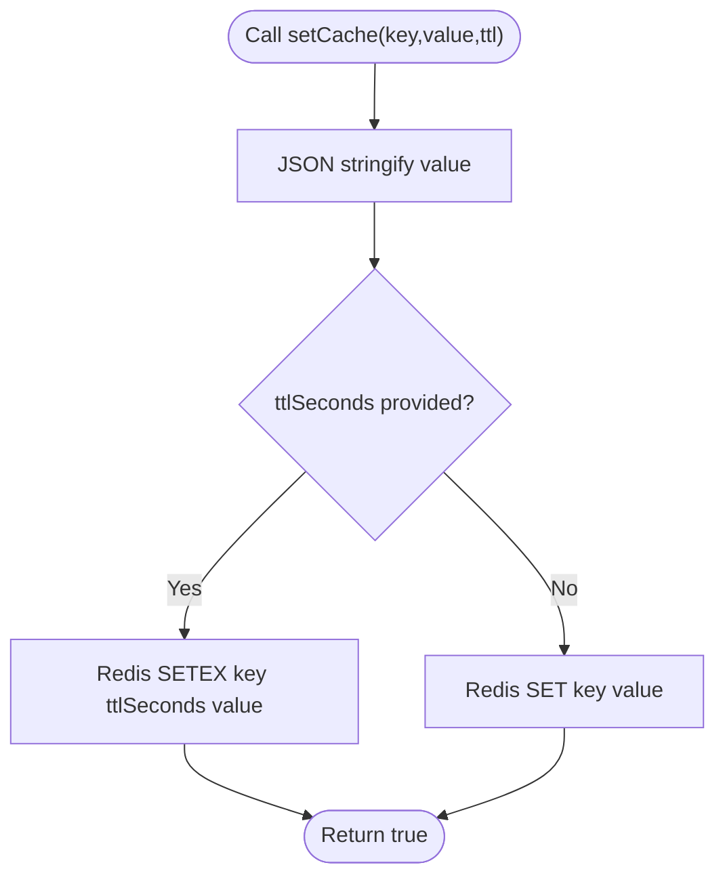
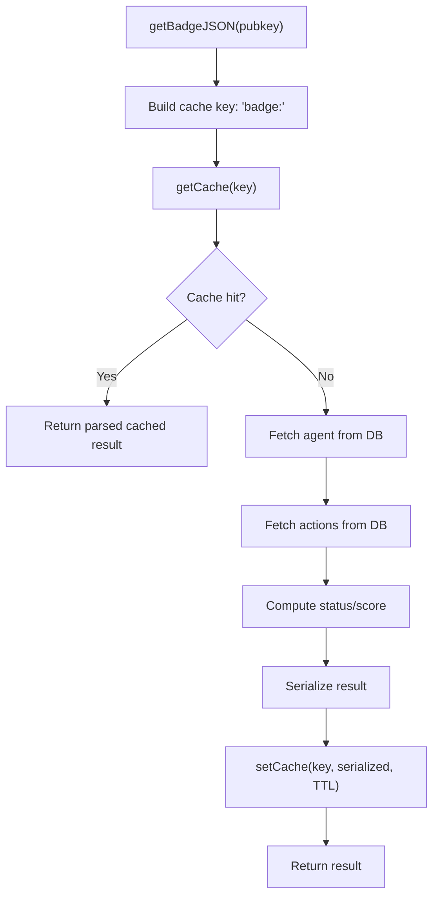
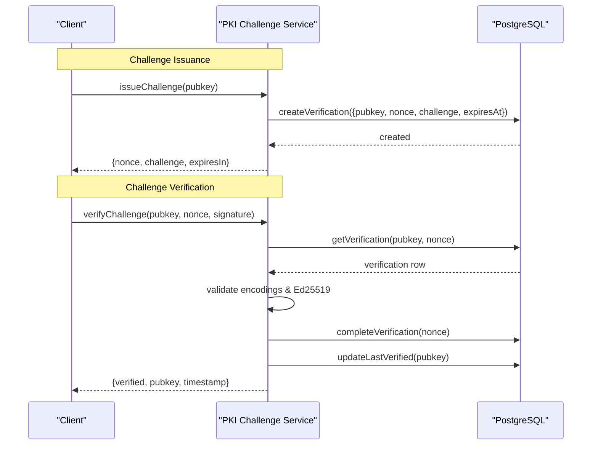
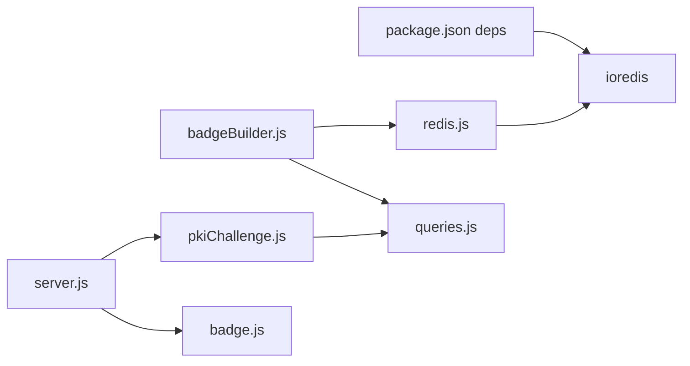

# Redis Integration

<cite>
**Referenced Files in This Document**
- [redis.js](file://backend/src/models/redis.js)
- [index.js](file://backend/src/config/index.js)
- [pkiChallenge.js](file://backend/src/services/pkiChallenge.js)
- [queries.js](file://backend/src/models/queries.js)
- [badgeBuilder.js](file://backend/src/services/badgeBuilder.js)
- [badge.js](file://backend/src/routes/badge.js)
- [server.js](file://backend/server.js)
- [package.json](file://backend/package.json)
- [migrate.js](file://backend/src/models/migrate.js)
</cite>

## Table of Contents
1. [Introduction](#introduction)
2. [Project Structure](#project-structure)
3. [Core Components](#core-components)
4. [Architecture Overview](#architecture-overview)
5. [Detailed Component Analysis](#detailed-component-analysis)
6. [Dependency Analysis](#dependency-analysis)
7. [Performance Considerations](#performance-considerations)
8. [Troubleshooting Guide](#troubleshooting-guide)
9. [Conclusion](#conclusion)

## Introduction
This document explains Redis integration in AgentID’s caching and session management system. It covers Redis client configuration, connection handling, and key-value storage patterns. It documents the nonce storage mechanism for PKI challenge-response security, including key naming conventions, expiration policies, and cleanup strategies. It also explains the badge caching system for trust badges, including cache invalidation policies and performance optimization. Finally, it outlines Redis command patterns, error handling strategies, connection management, monitoring approaches, and troubleshooting steps.

## Project Structure
Redis is configured centrally and consumed by services and routes that benefit from caching. The primary integration points are:
- Redis client initialization and helpers
- Badge builder service using Redis for caching
- PKI challenge service storing challenges in the database (no Redis used here)
- Application configuration and environment variables
- Route handlers for badge retrieval

**Diagram sources**
- [server.js:1-91](file://backend/server.js#L1-L91)
- [redis.js:1-94](file://backend/src/models/redis.js#L1-L94)
- [badgeBuilder.js:1-497](file://backend/src/services/badgeBuilder.js#L1-L497)
- [pkiChallenge.js:1-102](file://backend/src/services/pkiChallenge.js#L1-L102)
- [queries.js:1-404](file://backend/src/models/queries.js#L1-L404)
- [index.js:1-31](file://backend/src/config/index.js#L1-L31)

**Section sources**
- [server.js:1-91](file://backend/server.js#L1-L91)
- [redis.js:1-94](file://backend/src/models/redis.js#L1-L94)
- [badgeBuilder.js:1-497](file://backend/src/services/badgeBuilder.js#L1-L497)
- [pkiChallenge.js:1-102](file://backend/src/services/pkiChallenge.js#L1-L102)
- [queries.js:1-404](file://backend/src/models/queries.js#L1-L404)
- [index.js:1-31](file://backend/src/config/index.js#L1-L31)

## Core Components
- Redis client and helpers
  - Client creation with retry strategy, offline queue, and error handling
  - Helper functions for get, set, and delete with JSON serialization and TTL support
- Configuration
  - Redis URL from environment
  - Cache TTLs for badges and challenge expiry
- Badge caching
  - Cache key pattern for badge JSON
  - TTL applied on write
- PKI challenge storage
  - Challenges stored in PostgreSQL; Redis not used for nonce persistence
  - Expiration enforced via database query and timestamp checks

**Section sources**
- [redis.js:1-94](file://backend/src/models/redis.js#L1-L94)
- [index.js:19-27](file://backend/src/config/index.js#L19-L27)
- [badgeBuilder.js:17-83](file://backend/src/services/badgeBuilder.js#L17-L83)
- [pkiChallenge.js:17-96](file://backend/src/services/pkiChallenge.js#L17-L96)

## Architecture Overview
Redis is used as a fast, in-memory cache for badge data. The flow is:
- Badge route receives a request
- Badge service checks Redis for cached data
- On miss, it computes badge data, caches it with TTL, and returns
- PKI challenge service stores challenges in PostgreSQL and verifies signatures without Redis

**Diagram sources**
- [badge.js:16-32](file://backend/src/routes/badge.js#L16-L32)
- [badgeBuilder.js:17-83](file://backend/src/services/badgeBuilder.js#L17-L83)
- [redis.js:41-71](file://backend/src/models/redis.js#L41-L71)
- [queries.js:36-202](file://backend/src/models/queries.js#L36-L202)

## Detailed Component Analysis

### Redis Client and Helpers
- Client configuration
  - Uses ioredis with a retry strategy and capped delay
  - Enables offline queue to buffer commands while disconnected
  - Limits retries per request to avoid long blocking operations
- Event handling
  - Logs successful connect, errors, and reconnect attempts
- Helper functions
  - getCache: retrieves and parses JSON value or returns null
  - setCache: serializes value and sets with optional TTL using SETEX
  - deleteCache: deletes a key

**Diagram sources**
- [redis.js:58-71](file://backend/src/models/redis.js#L58-L71)

**Section sources**
- [redis.js:10-20](file://backend/src/models/redis.js#L10-L20)
- [redis.js:23-34](file://backend/src/models/redis.js#L23-L34)
- [redis.js:41-71](file://backend/src/models/redis.js#L41-L71)
- [redis.js:78-86](file://backend/src/models/redis.js#L78-L86)

### Configuration and Environment Variables
- Redis URL is loaded from environment
- Cache TTLs:
  - Badge cache TTL
  - Challenge expiry seconds (used for challenge lifetime in PKI service)
- CORS origin and other application settings

**Section sources**
- [index.js:19-27](file://backend/src/config/index.js#L19-L27)

### Badge Caching System
- Cache key naming convention
  - Pattern: "badge:<pubkey>"
- Cache behavior
  - Read-through: check cache first; on miss, compute badge data and cache with TTL
  - No explicit invalidation policy is present in the badge builder; TTL-driven eviction applies
- Data flow
  - Fetch agent and action stats from PostgreSQL
  - Compute status and score
  - Cache serialized JSON with TTL

**Diagram sources**
- [badgeBuilder.js:17-83](file://backend/src/services/badgeBuilder.js#L17-L83)
- [redis.js:41-71](file://backend/src/models/redis.js#L41-L71)

**Section sources**
- [badgeBuilder.js:17-83](file://backend/src/services/badgeBuilder.js#L17-L83)

### PKI Challenge-Response and Nonce Storage
- Challenge issuance
  - Generates UUID nonce and challenge string
  - Stores challenge record in PostgreSQL with expiry timestamp
  - Returns base58-encoded challenge and expiry seconds
- Challenge verification
  - Retrieves pending, uncompleted, and not-expired verification from PostgreSQL
  - Validates base58 encodings and Ed25519 signature
  - Marks verification as completed and updates last verified timestamp
- Redis usage
  - Not used for nonce storage; PostgreSQL is the single source of truth for challenges

**Diagram sources**
- [pkiChallenge.js:17-96](file://backend/src/services/pkiChallenge.js#L17-L96)
- [queries.js:213-256](file://backend/src/models/queries.js#L213-L256)

**Section sources**
- [pkiChallenge.js:17-96](file://backend/src/services/pkiChallenge.js#L17-L96)
- [queries.js:213-256](file://backend/src/models/queries.js#L213-L256)

### Route Handlers Using Redis
- Badge routes
  - GET /badge/:pubkey returns badge JSON
  - GET /badge/:pubkey/svg returns SVG
  - Both rely on badge builder service which uses Redis caching
- Rate limiting middleware is applied globally and per endpoint

**Section sources**
- [badge.js:16-55](file://backend/src/routes/badge.js#L16-L55)
- [server.js:53-63](file://backend/server.js#L53-L63)

## Dependency Analysis
- Redis client depends on ioredis
- Badge builder depends on Redis helpers and database queries
- PKI challenge service depends on database queries and cryptographic libraries
- Server initializes routes and middleware; Redis is initialized at module load

**Diagram sources**
- [package.json:20-31](file://backend/package.json#L20-L31)
- [redis.js:6](file://backend/src/models/redis.js#L6)
- [badgeBuilder.js:8](file://backend/src/services/badgeBuilder.js#L8)
- [pkiChallenge.js:9](file://backend/src/services/pkiChallenge.js#L9)
- [server.js:20-27](file://backend/server.js#L20-L27)

**Section sources**
- [package.json:20-31](file://backend/package.json#L20-L31)
- [redis.js:6](file://backend/src/models/redis.js#L6)
- [badgeBuilder.js:8](file://backend/src/services/badgeBuilder.js#L8)
- [pkiChallenge.js:9](file://backend/src/services/pkiChallenge.js#L9)
- [server.js:20-27](file://backend/server.js#L20-L27)

## Performance Considerations
- Cache hit ratio
  - Badge caching reduces database load; tune TTL to balance freshness vs. performance
- Redis command patterns
  - GET for reads, SETEX for writes with TTL
  - DEL for targeted deletions (not currently used in badge builder)
- Connection resilience
  - Retry strategy and offline queue prevent transient failures from impacting requests
- Database indexing
  - PostgreSQL tables include indexes for performance; ensure proper maintenance

[No sources needed since this section provides general guidance]

## Troubleshooting Guide
- Redis connectivity issues
  - Confirm REDIS_URL environment variable is set
  - Review connection event logs for connect/reconnect/error messages
  - Validate Redis server availability and network access
- Cache misses and slow responses
  - Verify cache keys follow the "badge:<pubkey>" pattern
  - Ensure TTL is set on writes and not excessively low
- PKI challenge errors
  - Check for “Challenge not found or already completed” and “Challenge has expired”
  - Confirm PostgreSQL records for verifications and timestamps
- Error logging
  - Application logs errors with request context; inspect logs for Redis and database errors

**Section sources**
- [index.js:20](file://backend/src/config/index.js#L20)
- [redis.js:23-34](file://backend/src/models/redis.js#L23-L34)
- [pkiChallenge.js:54-63](file://backend/src/services/pkiChallenge.js#L54-L63)
- [server.js:15-41](file://backend/server.js#L15-L41)

## Conclusion
Redis is used as a lightweight cache for badge data with a simple key naming scheme and TTL-based eviction. PKI challenge-response relies on PostgreSQL for nonce storage and verification, not Redis. The Redis client is resilient with retry and offline queue capabilities. Proper configuration of environment variables and TTLs ensures reliable performance and graceful degradation.