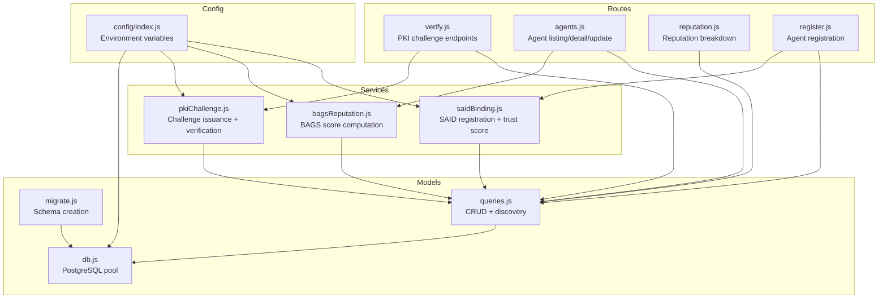
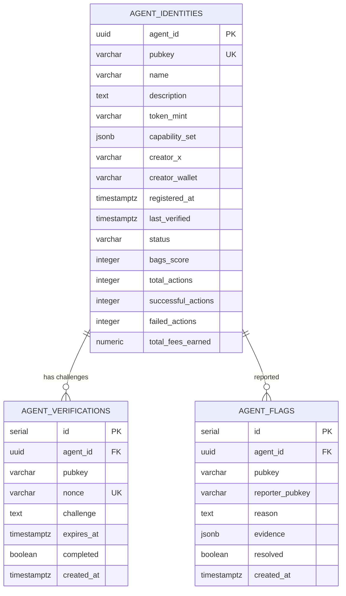
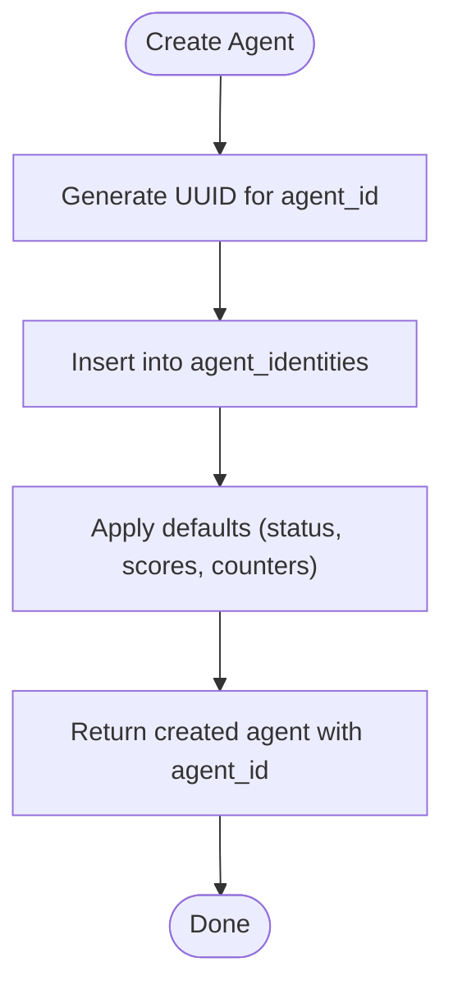
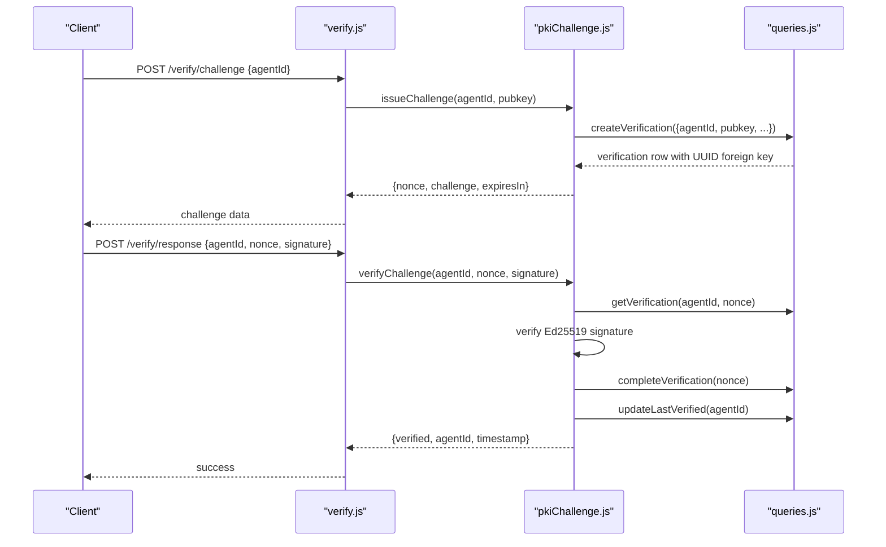
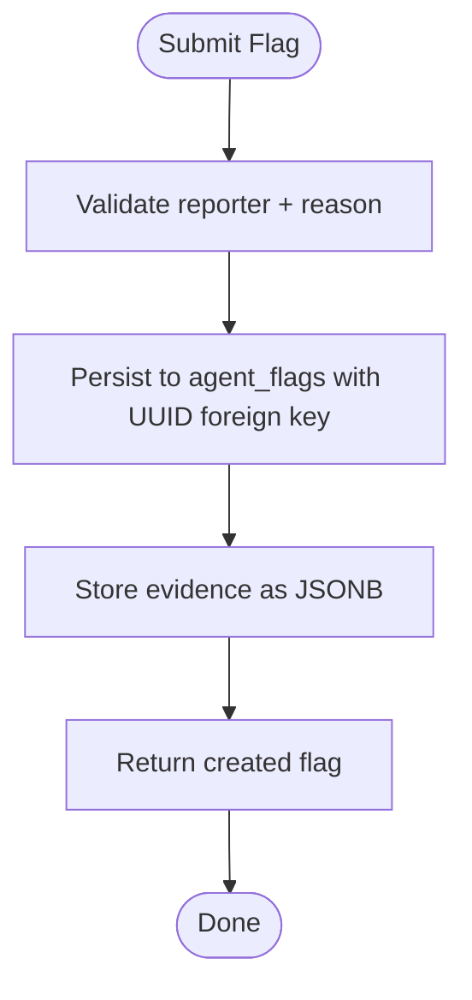
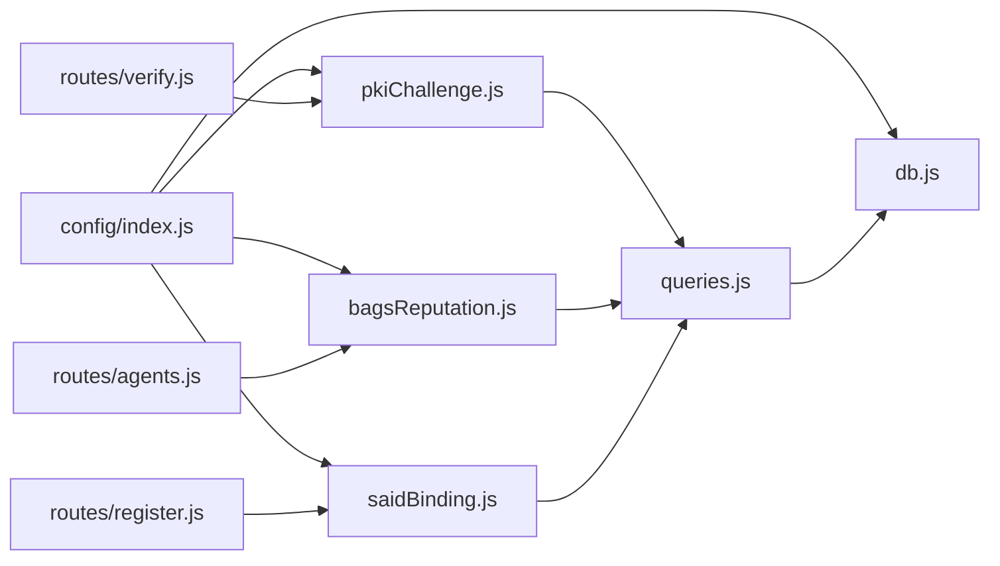

# Schema Overview

<cite>
**Referenced Files in This Document**
- [agentid_build_plan.md](file://agentid_build_plan.md)
- [migrate.js](file://backend/src/models/migrate.js)
- [queries.js](file://backend/src/models/queries.js)
- [db.js](file://backend/src/models/db.js)
- [config/index.js](file://backend/src/config/index.js)
- [pkiChallenge.js](file://backend/src/services/pkiChallenge.js)
- [bagsReputation.js](file://backend/src/services/bagsReputation.js)
- [saidBinding.js](file://backend/src/services/saidBinding.js)
- [verify.js](file://backend/src/routes/verify.js)
- [agents.js](file://backend/src/routes/agents.js)
- [register.js](file://backend/src/routes/register.js)
- [transform.js](file://backend/src/utils/transform.js)
</cite>

## Update Summary
**Changes Made**
- Updated agent_identities table to use UUID primary key instead of pubkey
- Enhanced action counter fields with new total_fees_earned field
- Improved indexing strategy with new indexes on agent_identities_pubkey, agent_identities_creator_wallet, and agent_verifications_agent_id
- Updated all table relationships to reference UUID instead of pubkey
- Modified query functions to use agent_id instead of pubkey for identification

## Table of Contents
1. [Introduction](#introduction)
2. [Project Structure](#project-structure)
3. [Core Components](#core-components)
4. [Architecture Overview](#architecture-overview)
5. [Detailed Component Analysis](#detailed-component-analysis)
6. [Dependency Analysis](#dependency-analysis)
7. [Performance Considerations](#performance-considerations)
8. [Troubleshooting Guide](#troubleshooting-guide)
9. [Conclusion](#conclusion)

## Introduction
This document provides a comprehensive schema overview for the AgentID database design. It explains the overall architecture, table relationships, and design philosophy behind the three core tables: agent_identities (primary agent registry with reputation metrics), agent_verifications (challenge-response tracking), and agent_flags (community moderation system). The schema has been redesigned with UUID-based primary keys for improved scalability and security, along with enhanced action counter fields and optimized indexing strategy. It documents the schema evolution from the build plan, detailing field definitions, data types, constraints, primary and foreign keys, and indexing strategy. Finally, it explains the rationale for the normalized design and how it supports AgentID's trust verification workflows.

## Project Structure
The AgentID backend organizes database concerns under models, services, routes, and configuration. The schema is defined and migrated via a dedicated migration script and consumed by reusable query functions. Services encapsulate external integrations (Bags, SAID) and internal verification logic. Routes expose the API and orchestrate database operations.

**Diagram sources**
- [db.js:1-45](file://backend/src/models/db.js#L1-L45)
- [migrate.js:1-101](file://backend/src/models/migrate.js#L1-L101)
- [queries.js:1-443](file://backend/src/models/queries.js#L1-L443)
- [pkiChallenge.js:1-106](file://backend/src/services/pkiChallenge.js#L1-L106)
- [bagsReputation.js:1-146](file://backend/src/services/bagsReputation.js#L1-L146)
- [saidBinding.js:1-119](file://backend/src/services/saidBinding.js#L1-L119)
- [verify.js:1-121](file://backend/src/routes/verify.js#L1-L121)
- [agents.js:1-277](file://backend/src/routes/agents.js#L1-L277)
- [register.js:1-162](file://backend/src/routes/register.js#L1-L162)
- [config/index.js:1-31](file://backend/src/config/index.js#L1-L31)

**Section sources**
- [migrate.js:9-65](file://backend/src/models/migrate.js#L9-L65)
- [queries.js:11-109](file://backend/src/models/queries.js#L11-L109)
- [config/index.js:6-28](file://backend/src/config/index.js#L6-L28)

## Core Components
This section documents the three core tables and their roles in AgentID's trust verification system, updated with the new UUID-based design.

- agent_identities
  - Purpose: Primary registry for agents, storing metadata, SAID linkage, and reputation metrics.
  - Key fields include agent_id (UUID primary key), pubkey (unique constraint), name, description, token_mint, capability_set (JSONB), creator_x and creator_wallet, timestamps (registered_at, last_verified), status and flag_reason, and composite reputation metrics (bags_score, total_actions, successful_actions, failed_actions, total_fees_earned, plus ecosystem activity counts).
  - Constraints: Primary key on agent_id; unique constraint on pubkey and name combination; default values for booleans and numeric fields; status constrained to a small set of values; JSONB for capability_set enables flexible capability discovery.

- agent_verifications
  - Purpose: Tracks challenge-response sessions for ongoing verification.
  - Key fields include id (primary key), agent_id (foreign key to agent_identities), pubkey (foreign key to agent_identities), nonce (unique), challenge (stored message), expires_at, completed flag, and created_at.
  - Constraints: Unique constraint on nonce; foreign key to agent_identities; completed flag ensures one-time use; expires_at enforces time-bound challenges.

- agent_flags
  - Purpose: Community moderation and flagging system.
  - Key fields include id (primary key), agent_id (foreign key to agent_identities), pubkey (foreign key to agent_identities), reporter_pubkey, reason, evidence (JSONB), resolved flag, and created_at.
  - Constraints: Foreign key to agent_identities; resolved flag supports administrative review; JSONB for evidence supports structured reporting.

**Section sources**
- [migrate.js:11-56](file://backend/src/models/migrate.js#L11-L56)
- [queries.js:17-29](file://backend/src/models/queries.js#L17-L29)
- [queries.js:213-222](file://backend/src/models/queries.js#L213-L222)
- [queries.js:267-279](file://backend/src/models/queries.js#L267-L279)

## Architecture Overview
The AgentID schema is designed around a normalized relational model with deliberate constraints and indexes to support:
- Identity management and metadata with UUID primary keys
- Ongoing PKI-based verification with UUID-based relationships
- Community-driven moderation with UUID foreign keys
- Efficient discovery and reputation computation with optimized indexes

**Diagram sources**
- [migrate.js:11-56](file://backend/src/models/migrate.js#L11-L56)

## Detailed Component Analysis

### agent_identities: Primary Agent Registry
- Design philosophy: Centralized identity with UUID primary key for improved scalability and security, embedded reputation metrics and capability declarations stored as JSONB for flexibility.
- Primary key: agent_id (UUID, auto-generated).
- Notable constraints and defaults:
  - Unique constraint on pubkey and name combination.
  - status defaults to a controlled set of values.
  - Enhanced action counters with total_fees_earned field for comprehensive reputation tracking.
  - capability_set stored as JSONB for efficient filtering and discovery.
- Representative usage:
  - Creation via route and service integration with automatic UUID generation.
  - Updates via authorized metadata updates with signature verification.
  - Discovery and listing with filters and ordering by bags_score.

**Diagram sources**
- [queries.js:17-29](file://backend/src/models/queries.js#L17-L29)
- [register.js:133-142](file://backend/src/routes/register.js#L133-L142)

**Section sources**
- [queries.js:17-29](file://backend/src/models/queries.js#L17-L29)
- [register.js:133-142](file://backend/src/routes/register.js#L133-L142)
- [agents.js:120-248](file://backend/src/routes/agents.js#L120-L248)

### agent_verifications: Challenge-Response Tracking
- Design philosophy: One-time use, time-bound challenges to prevent replay attacks while enabling lightweight verification, with UUID-based foreign key relationships.
- Primary key: id (SERIAL); unique constraint on nonce; foreign key to agent_identities via agent_id.
- Expiration and completion:
  - expires_at enforced by service logic and query filters.
  - completed flag ensures a nonce cannot be reused.
- Representative usage:
  - Issue challenge via route → service → persistence with UUID foreign key.
  - Verify response via route → service → signature check → mark completed → update last_verified.

**Diagram sources**
- [verify.js:17-46](file://backend/src/routes/verify.js#L17-L46)
- [verify.js:52-109](file://backend/src/routes/verify.js#L52-L109)
- [pkiChallenge.js:17-39](file://backend/src/services/pkiChallenge.js#L17-L39)
- [pkiChallenge.js:49-96](file://backend/src/services/pkiChallenge.js#L49-L96)
- [queries.js:213-222](file://backend/src/models/queries.js#L213-L222)
- [queries.js:230-240](file://backend/src/models/queries.js#L230-L240)
- [queries.js:247-256](file://backend/src/models/queries.js#L247-L256)
- [queries.js:134-143](file://backend/src/models/queries.js#L134-L143)

**Section sources**
- [pkiChallenge.js:17-39](file://backend/src/services/pkiChallenge.js#L17-L39)
- [pkiChallenge.js:49-96](file://backend/src/services/pkiChallenge.js#L49-L96)
- [queries.js:213-222](file://backend/src/models/queries.js#L213-L222)
- [queries.js:230-240](file://backend/src/models/queries.js#L230-L240)
- [queries.js:247-256](file://backend/src/models/queries.js#L247-L256)
- [queries.js:134-143](file://backend/src/models/queries.js#L134-L143)

### agent_flags: Community Moderation System
- Design philosophy: Structured reporting with JSONB evidence and administrative resolution, with UUID-based foreign key relationships.
- Primary key: id; foreign key to agent_identities via agent_id; resolved flag indicates administrative action.
- Representative usage:
  - Submit flag via service → persist with JSONB evidence and UUID foreign key.
  - Retrieve flags and unresolved counts for reputation computation.
  - Resolve flags through administrative actions.

**Diagram sources**
- [queries.js:267-279](file://backend/src/models/queries.js#L267-L279)
- [bagsReputation.js:78-90](file://backend/src/services/bagsReputation.js#L78-L90)

**Section sources**
- [queries.js:267-279](file://backend/src/models/queries.js#L267-L279)
- [queries.js:299-305](file://backend/src/models/queries.js#L299-L305)
- [bagsReputation.js:78-90](file://backend/src/services/bagsReputation.js#L78-L90)

### Schema Evolution and Design Decisions
- From build plan to schema:
  - The build plan defined the three core tables with pubkey-based primary keys and relationships.
  - The updated migration script creates tables with UUID primary keys for improved scalability and security.
  - Enhanced action counter fields including total_fees_earned for comprehensive reputation tracking.
  - Optimized indexing strategy with new indexes on agent_identities_pubkey, agent_identities_creator_wallet, and agent_verifications_agent_id.
- Design choices:
  - agent_identities with UUID primary key replacing pubkey for better scalability and security.
  - agent_verifications enforcing time-bound, single-use challenges with UUID foreign keys.
  - agent_flags supporting structured moderation with UUID foreign keys and JSONB evidence.
  - Enhanced action counters with total_fees_earned for comprehensive reputation computation.
  - JSONB for capability_set and evidence to enable flexible querying and future extensibility.

**Section sources**
- [agentid_build_plan.md:87-130](file://agentid_build_plan.md#L87-L130)
- [migrate.js:9-65](file://backend/src/models/migrate.js#L9-L65)

## Dependency Analysis
The schema depends on configuration for timeouts and caching, and is consumed by services and routes. External dependencies include Bags and SAID APIs, which influence data availability and scoring.

**Diagram sources**
- [config/index.js:6-28](file://backend/src/config/index.js#L6-L28)
- [db.js:1-45](file://backend/src/models/db.js#L1-L45)
- [pkiChallenge.js:1-106](file://backend/src/services/pkiChallenge.js#L1-L106)
- [bagsReputation.js:1-146](file://backend/src/services/bagsReputation.js#L1-L146)
- [saidBinding.js:1-119](file://backend/src/services/saidBinding.js#L1-L119)
- [verify.js:1-121](file://backend/src/routes/verify.js#L1-L121)
- [agents.js:1-277](file://backend/src/routes/agents.js#L1-L277)
- [register.js:1-162](file://backend/src/routes/register.js#L1-L162)
- [queries.js:1-443](file://backend/src/models/queries.js#L1-L443)

**Section sources**
- [config/index.js:6-28](file://backend/src/config/index.js#L6-L28)
- [db.js:1-45](file://backend/src/models/db.js#L1-L45)
- [queries.js:1-443](file://backend/src/models/queries.js#L1-L443)

## Performance Considerations
- Indexes
  - UUID-based agent_id indexes for efficient foreign key lookups.
  - Status and BAGS score indexes support fast filtering and sorting for discovery and listing.
  - New indexes on agent_identities_pubkey, agent_identities_creator_wallet, and agent_verifications_agent_id improve query performance.
  - Composite indexes on flags improve moderation queries.
- Query patterns
  - Parameterized queries prevent injection and leverage prepared statement plans.
  - JSONB containment operators enable efficient capability filtering.
- Operational notes
  - Challenge expiration and one-time use reduce stale data and replay risk.
  - Reputation recomputation is selective and driven by explicit requests.

**Section sources**
- [migrate.js:58-65](file://backend/src/models/migrate.js#L58-L65)
- [queries.js:80-109](file://backend/src/models/queries.js#L80-L109)
- [queries.js:332-357](file://backend/src/models/queries.js#L332-L357)

## Troubleshooting Guide
Common issues and resolutions:
- Challenge not found or expired
  - Symptoms: Verification endpoints return not found or expired errors.
  - Causes: Nonce reuse, expired challenge, or incorrect agentId parameters.
  - Resolution: Issue a new challenge; ensure nonce uniqueness and timely responses; verify UUID format.
- Invalid signature or encoding
  - Symptoms: Signature verification failures.
  - Causes: Incorrect message format, encoding issues, or mismatched pubkey/signature.
  - Resolution: Confirm challenge message format and base58 encoding; reissue challenge if needed.
- Agent not found
  - Symptoms: Registration and verification routes return 404.
  - Causes: Missing agent_id or unregistered agent.
  - Resolution: Ensure agent is registered; verify UUID correctness.
- Flagging and moderation
  - Symptoms: Flags not appearing or unresolved counts incorrect.
  - Causes: Missing JSONB evidence or unresolved flags.
  - Resolution: Submit structured evidence; resolve flags administratively.
- UUID format issues
  - Symptoms: Database errors related to UUID format.
  - Causes: Invalid UUID format in requests or database operations.
  - Resolution: Ensure proper UUID format (36 characters with hyphens) throughout the application.

**Section sources**
- [verify.js:84-104](file://backend/src/routes/verify.js#L84-L104)
- [pkiChallenge.js:54-83](file://backend/src/services/pkiChallenge.js#L54-L83)
- [agents.js:177-184](file://backend/src/routes/agents.js#L177-L184)
- [queries.js:299-305](file://backend/src/models/queries.js#L299-L305)

## Conclusion
The AgentID schema is a normalized, constraint-rich design that supports robust identity management, PKI-based verification, and community moderation. The three core tables—agent_identities, agent_verifications, and agent_flags—have been redesigned with UUID-based primary keys for improved scalability and security, enhanced action counter fields for comprehensive reputation tracking, and optimized indexing strategy for better performance. These improvements work together to enforce strong authenticity guarantees, maintain transparent reputation signals, and enable scalable discovery. The migration script and query layer ensure consistent schema evolution and efficient access patterns aligned with the build plan and operational needs.