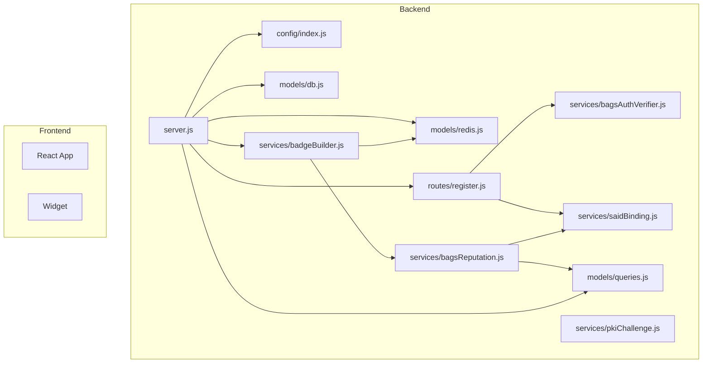
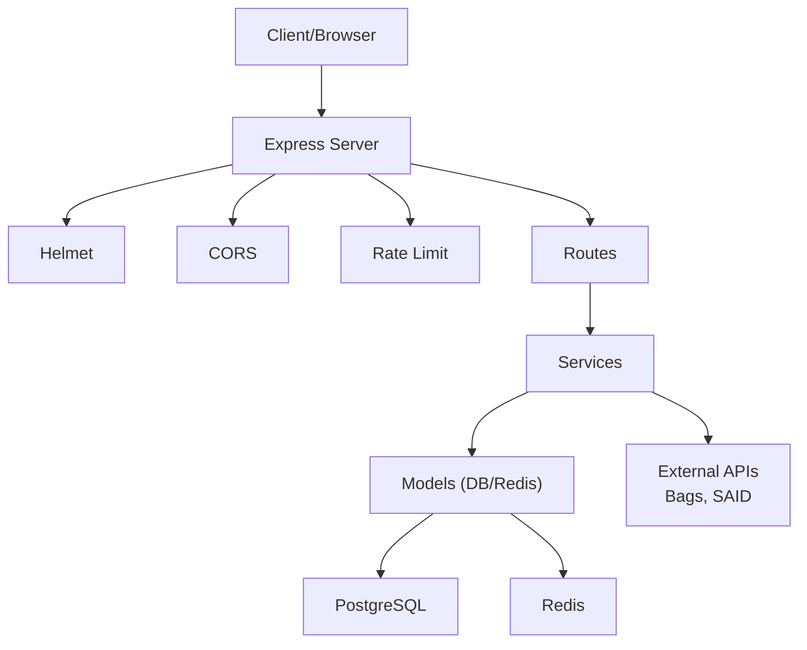
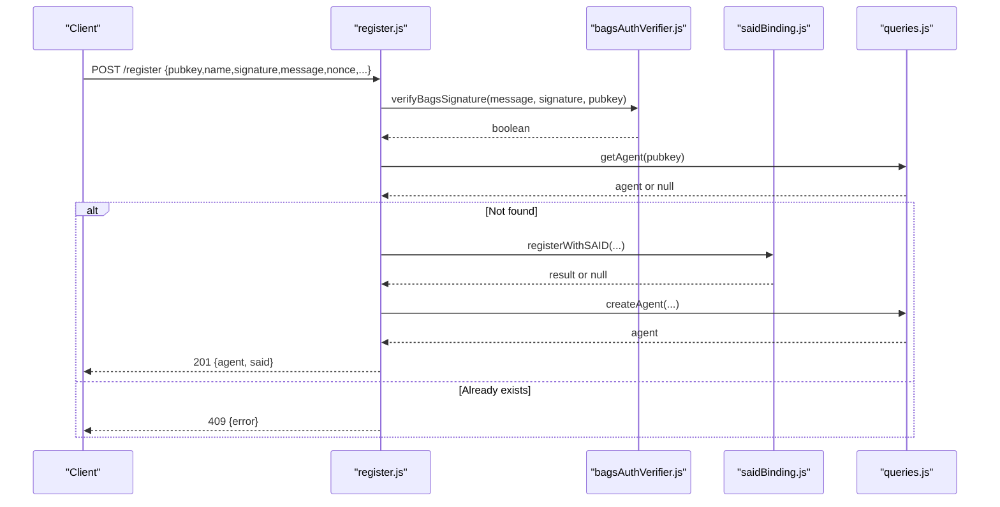
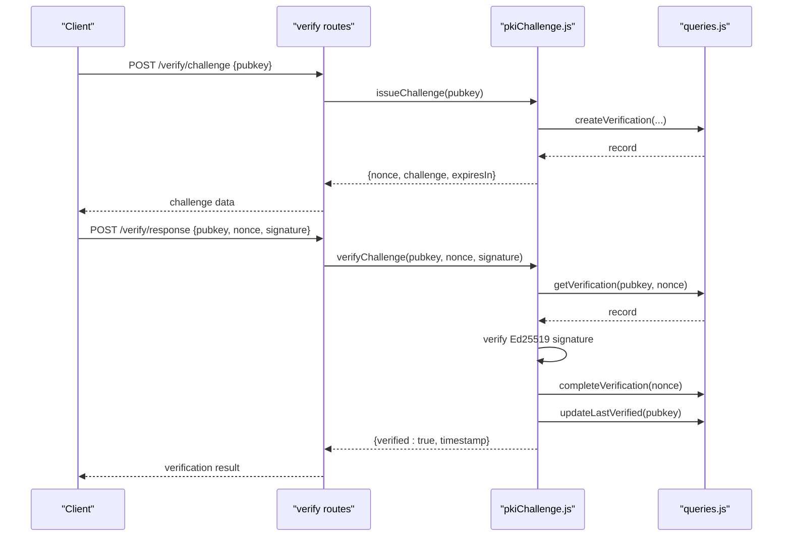
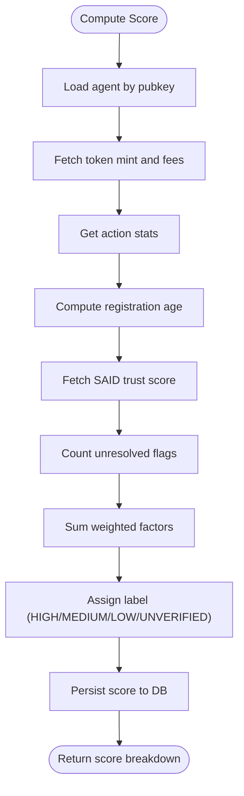
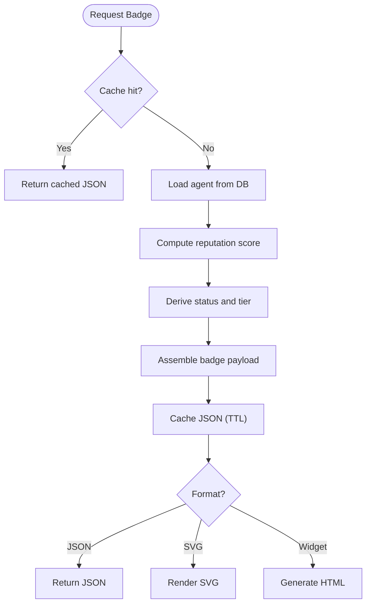
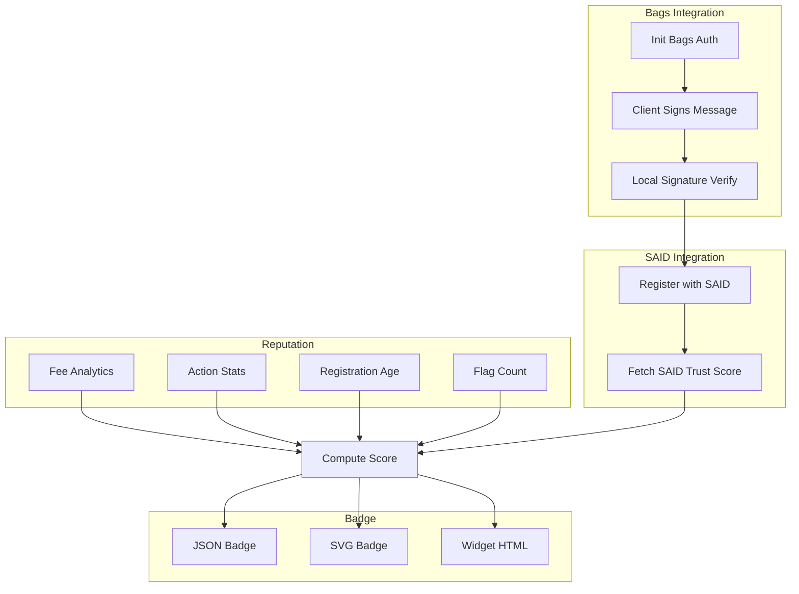
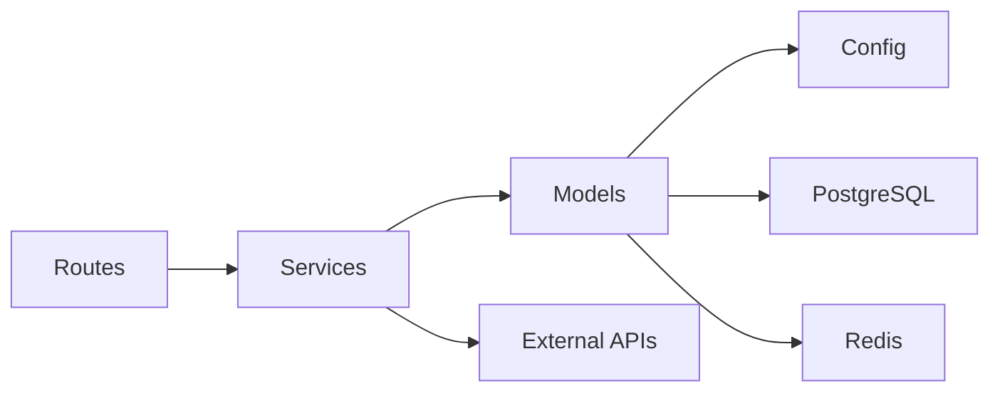

# Developer Guide

<cite>
**Referenced Files in This Document**
- [README.md](file://README.md)
- [DEVELOPER_GUIDE.md](file://docs/DEVELOPER_GUIDE.md)
- [DEVELOPER_GUIDE_TRUSTMARK.md](file://docs/DEVELOPER_GUIDE_TRUSTMARK.md)
- [API_REFERENCE.md](file://docs/API_REFERENCE.md)
- [WIDGET_GUIDE.md](file://docs/WIDGET_GUIDE.md)
- [docker-compose.yml](file://docker-compose.yml)
- [backend/package.json](file://backend/package.json)
- [frontend/package.json](file://frontend/package.json)
- [backend/server.js](file://backend/server.js)
- [backend/src/config/index.js](file://backend/src/config/index.js)
- [backend/src/models/db.js](file://backend/src/models/db.js)
- [backend/src/models/redis.js](file://backend/src/models/redis.js)
- [backend/src/models/queries.js](file://backend/src/models/queries.js)
- [backend/src/services/bagsAuthVerifier.js](file://backend/src/services/bagsAuthVerifier.js)
- [backend/src/services/bagsReputation.js](file://backend/src/services/bagsReputation.js)
- [backend/src/services/pkiChallenge.js](file://backend/src/services/pkiChallenge.js)
- [backend/src/services/saidBinding.js](file://backend/src/services/saidBinding.js)
- [backend/src/services/badgeBuilder.js](file://backend/src/services/badgeBuilder.js)
- [backend/src/routes/register.js](file://backend/src/routes/register.js)
</cite>

## Update Summary
**Changes Made**
- Added comprehensive cryptographic operations section covering Ed25519 keypair generation and signature verification
- Integrated multi-language implementation examples (Node.js, Python, Go, Rust, Java) from DEVELOPER_GUIDE_TRUSTMARK.md
- Enhanced PKI challenge-response documentation with detailed cryptographic requirements
- Updated API reference with comprehensive error handling and troubleshooting guidance
- Expanded reputation scoring system documentation with detailed factor breakdown
- Added comprehensive widget integration examples and customization options

## Table of Contents
1. [Introduction](#introduction)
2. [Project Structure](#project-structure)
3. [Core Components](#core-components)
4. [Architecture Overview](#architecture-overview)
5. [Cryptographic Operations](#cryptographic-operations)
6. [Multi-Language Integration Examples](#multi-language-integration-examples)
7. [Detailed Component Analysis](#detailed-component-analysis)
8. [Dependency Analysis](#dependency-analysis)
9. [Performance Considerations](#performance-considerations)
10. [Troubleshooting Guide](#troubleshooting-guide)
11. [Conclusion](#conclusion)
12. [Appendices](#appendices)

## Introduction
AgentID is the trust verification layer for Bags agents on Solana. It integrates Bags authentication, binds agent identities to the SAID Identity Gateway, computes a 5-factor reputation score, and exposes human-readable trust badges and embeddable widgets. The backend is a Node.js/Express application with PostgreSQL and Redis, while the frontend is a React/Vite application.

**Updated** The platform now provides comprehensive developer integration support with detailed cryptographic operations, multi-language implementation examples, and extensive troubleshooting guidance.

## Project Structure
The repository is organized into:
- backend: Express server, configuration, middleware, models (database and Redis), services (business logic), routes (HTTP endpoints), and tests
- frontend: React application with pages, components, API client, and widget
- docs: API reference, developer guide, comprehensive integration guide, and widget guide
- docker-compose.yml: Infrastructure provisioning for PostgreSQL and Redis
- Root README with quick start, API reference, and reputation scoring



**Diagram sources**
- [backend/server.js:1-104](file://backend/server.js#L1-L104)
- [backend/src/config/index.js:1-34](file://backend/src/config/index.js#L1-L34)
- [backend/src/models/db.js:1-71](file://backend/src/models/db.js#L1-L71)
- [backend/src/models/redis.js:1-94](file://backend/src/models/redis.js#L1-L94)
- [backend/src/models/queries.js:1-404](file://backend/src/models/queries.js#L1-L404)
- [backend/src/services/bagsAuthVerifier.js:1-93](file://backend/src/services/bagsAuthVerifier.js#L1-L93)
- [backend/src/services/bagsReputation.js:1-146](file://backend/src/services/bagsReputation.js#L1-L146)
- [backend/src/services/pkiChallenge.js:1-102](file://backend/src/services/pkiChallenge.js#L1-L102)
- [backend/src/services/saidBinding.js:1-119](file://backend/src/services/saidBinding.js#L1-L119)
- [backend/src/services/badgeBuilder.js:1-548](file://backend/src/services/badgeBuilder.js#L1-L548)
- [backend/src/routes/register.js:1-160](file://backend/src/routes/register.js#L1-L160)

**Section sources**
- [README.md:1-104](file://README.md#L1-L104)
- [DEVELOPER_GUIDE.md:327-436](file://docs/DEVELOPER_GUIDE.md#L327-L436)

## Core Components
- Configuration: Centralized environment variables and defaults
- Data Access: PostgreSQL pool and Redis client with caching helpers
- Queries: Parameterized SQL functions for agent, verification, and flag operations
- Services:
  - BagsAuthVerifier: Integrates with Bags API for challenge/init and signature verification
  - BagsReputation: Computes 5-factor reputation score and stores it
  - PKIChallenge: Issues and verifies Ed25519 challenges
  - SAIDBinding: Registers agents and fetches trust scores from SAID Gateway
  - BadgeBuilder: Generates JSON, SVG, and HTML widget outputs with caching
- Routes: HTTP endpoints for registration, verification, badges, reputation, agents, attestations, and widgets
- Security: Helmet, CORS, rate limiting, and health checks

**Section sources**
- [backend/src/config/index.js:1-34](file://backend/src/config/index.js#L1-L34)
- [backend/src/models/db.js:1-71](file://backend/src/models/db.js#L1-L71)
- [backend/src/models/redis.js:1-94](file://backend/src/models/redis.js#L1-L94)
- [backend/src/models/queries.js:1-404](file://backend/src/models/queries.js#L1-L404)
- [backend/src/services/bagsAuthVerifier.js:1-93](file://backend/src/services/bagsAuthVerifier.js#L1-L93)
- [backend/src/services/bagsReputation.js:1-146](file://backend/src/services/bagsReputation.js#L1-L146)
- [backend/src/services/pkiChallenge.js:1-102](file://backend/src/services/pkiChallenge.js#L1-L102)
- [backend/src/services/saidBinding.js:1-119](file://backend/src/services/saidBinding.js#L1-L119)
- [backend/src/services/badgeBuilder.js:1-548](file://backend/src/services/badgeBuilder.js#L1-L548)
- [backend/server.js:1-104](file://backend/server.js#L1-L104)

## Architecture Overview
The backend follows a layered architecture:
- Entry point initializes Express, loads environment, applies security middleware, registers routes, and starts the server
- Routes orchestrate service calls and model queries
- Services encapsulate external integrations and business logic
- Models abstract database and Redis operations
- Frontend consumes the API and renders badges and widgets



**Diagram sources**
- [backend/server.js:44-87](file://backend/server.js#L44-L87)
- [backend/src/services/bagsAuthVerifier.js:11-86](file://backend/src/services/bagsAuthVerifier.js#L11-L86)
- [backend/src/services/saidBinding.js:21-87](file://backend/src/services/saidBinding.js#L21-L87)
- [backend/src/models/db.js:25-43](file://backend/src/models/db.js#L25-L43)
- [backend/src/models/redis.js:9-20](file://backend/src/models/redis.js#L9-L20)

**Section sources**
- [DEVELOPER_GUIDE.md:327-436](file://docs/DEVELOPER_GUIDE.md#L327-L436)

## Cryptographic Operations

### Ed25519 Key Pair Generation
AgentID uses Ed25519 elliptic curve cryptography for secure identity verification. The system generates cryptographically secure key pairs using the tweetnacl library.

**Key Generation Process:**
1. Generate a new Ed25519 key pair using `nacl.sign.keyPair()`
2. Encode public and private keys using Base58 encoding
3. Store private key securely for signature operations
4. Use public key for agent identification and verification

**Implementation Requirements:**
- **Node.js 18+** required for Ed25519 cryptographic operations
- **tweetnacl** library for Ed25519 signature generation and verification
- **bs58** library for Base58 encoding/decoding

**Section sources**
- [DEVELOPER_GUIDE_TRUSTMARK.md:9-19](file://docs/DEVELOPER_GUIDE_TRUSTMARK.md#L9-L19)
- [DEVELOPER_GUIDE_TRUSTMARK.md:30-45](file://docs/DEVELOPER_GUIDE_TRUSTMARK.md#L30-L45)

### PKI Challenge-Response Protocol
The PKI challenge-response system provides cryptographic proof of key ownership:

**Challenge Issuance:**
1. Generate UUID v4 nonce
2. Construct challenge message: `AGENTID-VERIFY:{agentId}:{pubkey}:{nonce}:{timestamp}`
3. Encode challenge as Base58 string
4. Store challenge with expiration timestamp
5. Return challenge to client

**Response Verification:**
1. Base58-decode stored challenge
2. Verify challenge hasn't expired
3. Sign decoded challenge bytes with private key
4. Base58-encode signature
5. Verify signature against stored public key
6. Mark challenge as completed

**Critical Implementation Details:**
- The challenge must be Base58-decoded before signing
- Sign the raw bytes, not the Base58-encoded string
- Challenge expires after 5 minutes (configurable via `CHALLENGE_EXPIRY_SECONDS`)

**Section sources**
- [DEVELOPER_GUIDE_TRUSTMARK.md:149-218](file://docs/DEVELOPER_GUIDE_TRUSTMARK.md#L149-L218)
- [backend/src/services/pkiChallenge.js:18-44](file://backend/src/services/pkiChallenge.js#L18-L44)
- [backend/src/services/pkiChallenge.js:55-103](file://backend/src/services/pkiChallenge.js#L55-L103)

## Multi-Language Integration Examples

### Node.js Implementation
Complete implementation using tweetnacl and bs58 libraries:

**Installation:**
```bash
npm install tweetnacl bs58
```

**Key Operations:**
- Generate Ed25519 key pair
- Sign registration messages with `nacl.sign.detached()`
- Base58 encode/decode for API communication
- Handle challenge-response flow

**Section sources**
- [DEVELOPER_GUIDE_TRUSTMARK.md:24-45](file://docs/DEVELOPER_GUIDE_TRUSTMARK.md#L24-L45)
- [DEVELOPER_GUIDE_TRUSTMARK.md:62-139](file://docs/DEVELOPER_GUIDE_TRUSTMARK.md#L62-L139)

### Python Implementation
Using PyNaCl library for cryptographic operations:

**Installation:**
```bash
pip install pynacl base58 requests
```

**Key Features:**
- Generate signing keys with `nacl.signing.SigningKey.generate()`
- Sign messages using `signing_key.sign()`
- Base58 encoding with `base58.b58encode()`
- HTTP requests with `requests.post()`

**Section sources**
- [DEVELOPER_GUIDE_TRUSTMARK.md:556-638](file://docs/DEVELOPER_GUIDE_TRUSTMARK.md#L556-L638)

### Go Implementation
Using Go's built-in crypto/ed25519 package:

**Key Features:**
- Generate key pairs with `ed25519.GenerateKey()`
- Sign messages with `ed25519.Sign()`
- Base58 encoding/decoding utilities
- HTTP client for API communication

**Section sources**
- [DEVELOPER_GUIDE_TRUSTMARK.md:13-18](file://docs/DEVELOPER_GUIDE_TRUSTMARK.md#L13-L18)
- [DEVELOPER_GUIDE_TRUSTMARK.md:556-638](file://docs/DEVELOPER_GUIDE_TRUSTMARK.md#L556-L638)

### Rust Implementation
Using ed25519-dalek crate:

**Key Features:**
- Generate key pairs with `Keypair::generate()`
- Sign messages with `Keypair::sign()`
- Base58 encoding with dedicated crates
- Async/await support for API calls

**Section sources**
- [DEVELOPER_GUIDE_TRUSTMARK.md:13-18](file://docs/DEVELOPER_GUIDE_TRUSTMARK.md#L13-L18)
- [DEVELOPER_GUIDE_TRUSTMARK.md:556-638](file://docs/DEVELOPER_GUIDE_TRUSTMARK.md#L556-L638)

### Java Implementation
Using net.i2p.crypto:eddsa library:

**Key Features:**
- Generate key pairs with `Ed25519KeyPairGenerator`
- Sign messages with `EdDSAEngine`
- Base58 encoding utilities
- HTTP client for API communication

**Section sources**
- [DEVELOPER_GUIDE_TRUSTMARK.md:13-18](file://docs/DEVELOPER_GUIDE_TRUSTMARK.md#L13-L18)
- [DEVELOPER_GUIDE_TRUSTMARK.md:556-638](file://docs/DEVELOPER_GUIDE_TRUSTMARK.md#L556-L638)

## Detailed Component Analysis

### Registration Flow (POST /register)
End-to-end registration with Bags auth and optional SAID binding:
1. Validate input (pubkey, name, signature, message, nonce)
2. Verify nonce presence in message
3. Verify Bags signature using Ed25519
4. Check for existing agent
5. Optionally register with SAID (non-blocking)
6. Persist agent record
7. Return created agent and SAID status



**Diagram sources**
- [backend/src/routes/register.js:59-157](file://backend/src/routes/register.js#L59-L157)
- [backend/src/services/bagsAuthVerifier.js:44-86](file://backend/src/services/bagsAuthVerifier.js#L44-L86)
- [backend/src/services/saidBinding.js:21-54](file://backend/src/services/saidBinding.js#L21-L54)
- [backend/src/models/queries.js:17-29](file://backend/src/models/queries.js#L17-L29)

**Section sources**
- [backend/src/routes/register.js:1-160](file://backend/src/routes/register.js#L1-L160)
- [backend/src/services/bagsAuthVerifier.js:1-93](file://backend/src/services/bagsAuthVerifier.js#L1-L93)
- [backend/src/services/saidBinding.js:1-119](file://backend/src/services/saidBinding.js#L1-L119)
- [backend/src/models/queries.js:1-404](file://backend/src/models/queries.js#L1-L404)

### PKI Challenge-Response (POST /verify/challenge, POST /verify/response)
- Issue challenge: generate nonce, construct challenge string, persist verification record, return base58-encoded challenge
- Verify challenge: fetch pending verification, validate expiration, decode inputs, verify Ed25519 signature, mark complete, update last verified



**Diagram sources**
- [backend/src/services/pkiChallenge.js:17-96](file://backend/src/services/pkiChallenge.js#L17-L96)
- [backend/src/models/queries.js:213-256](file://backend/src/models/queries.js#L213-L256)

**Section sources**
- [backend/src/services/pkiChallenge.js:1-102](file://backend/src/services/pkiChallenge.js#L1-L102)
- [backend/src/models/queries.js:205-256](file://backend/src/models/queries.js#L205-L256)

### Reputation Scoring (GET /reputation/:pubkey)
Computes a 5-factor score (Fee Activity, Success Rate, Registration Age, SAID Trust, Community) and stores it in the database.



**Diagram sources**
- [backend/src/services/bagsReputation.js:16-140](file://backend/src/services/bagsReputation.js#L16-L140)
- [backend/src/models/queries.js:187-202](file://backend/src/models/queries.js#L187-L202)
- [backend/src/services/saidBinding.js:61-87](file://backend/src/services/saidBinding.js#L61-L87)

**Section sources**
- [backend/src/services/bagsReputation.js:1-146](file://backend/src/services/bagsReputation.js#L1-L146)
- [backend/src/models/queries.js:1-404](file://backend/src/models/queries.js#L1-L404)
- [backend/src/services/saidBinding.js:1-119](file://backend/src/services/saidBinding.js#L1-L119)

### Badge Generation Pipeline (GET /badge/:pubkey, GET /badge/:pubkey/svg, GET /widget/:pubkey)
- Badge JSON: fetch agent, compute reputation, derive status/tier, cache with TTL
- SVG: render themed SVG badge with status icon and score bar
- Widget: generate HTML page with live refresh and statistics



**Diagram sources**
- [backend/src/services/badgeBuilder.js:17-89](file://backend/src/services/badgeBuilder.js#L17-L89)
- [backend/src/services/badgeBuilder.js:96-213](file://backend/src/services/badgeBuilder.js#L96-L213)
- [backend/src/services/badgeBuilder.js:220-526](file://backend/src/services/badgeBuilder.js#L220-L526)
- [backend/src/models/redis.js:41-71](file://backend/src/models/redis.js#L41-L71)

**Section sources**
- [backend/src/services/badgeBuilder.js:1-548](file://backend/src/services/badgeBuilder.js#L1-L548)
- [backend/src/models/redis.js:1-94](file://backend/src/models/redis.js#L1-L94)
- [backend/src/models/queries.js:1-404](file://backend/src/models/queries.js#L1-L404)

### Conceptual Overview
- Bags Auth: Client obtains a challenge from Bags, signs it with Ed25519, and AgentID verifies the signature locally
- SAID Binding: Agent registration payload includes SAID-compatible fields and Bags binding metadata
- Reputation: Scores are computed from analytics and community signals, stored, and surfaced in badges
- Badge Delivery: JSON for programmatic consumption, SVG for static images, HTML widget for embeds



## Dependency Analysis
- External dependencies: Express, tweetnacl, bs58, pg, ioredis, axios, helmet, cors, express-rate-limit
- Internal dependencies:
  - Routes depend on services and models
  - Services depend on models and external APIs
  - Models depend on configuration and environment variables
- Coupling: Services encapsulate external integrations; routes remain thin controllers; models abstract persistence



**Diagram sources**
- [backend/server.js:34-41](file://backend/server.js#L34-L41)
- [backend/src/services/bagsAuthVerifier.js:6-9](file://backend/src/services/bagsAuthVerifier.js#L6-L9)
- [backend/src/models/db.js:7-8](file://backend/src/models/db.js#L7-L8)
- [backend/src/models/redis.js:6-7](file://backend/src/models/redis.js#L6-L7)
- [backend/src/config/index.js:6-31](file://backend/src/config/index.js#L6-L31)

**Section sources**
- [backend/package.json:20-36](file://backend/package.json#L20-L36)
- [backend/server.js:25-41](file://backend/server.js#L25-L41)

## Performance Considerations
- Caching: Redis caches badge JSON with configurable TTL to reduce DB and computation load
- Database: Parameterized queries and indexes on status, score, and flags improve query performance
- External calls: SAID and Bags calls are retried with timeouts; failures degrade gracefully
- Rate limiting: Protects endpoints from abuse
- Recommendations: Increase cache TTL for production, monitor Redis and DB latency, and consider connection pooling tuning

## Troubleshooting Guide

### Cryptographic Issues
**"My signature is invalid"**
- Verify you're using the correct private key that matches your public key
- Ensure you're signing the raw bytes, not the Base58 string
- Check that both message and signature are Base58-encoded in the request
- Verify the message format is exactly: `AGENTID-REGISTER:{name}:{nonce}:{timestamp}`

**"Challenge expired"**
- The 5-minute timer starts when you request the challenge, not when you start signing
- If your signing process is slow or you get distracted, request a fresh challenge
- Check system clock synchronization if experiencing frequent expiration

**"Invalid Solana address"**
- The pubkey must be 32-88 characters long
- Must be valid Base58 encoding
- Must be a valid Ed25519 public key

### API Integration Issues
**HTTP Status Code 400 "Message must contain the nonce"**
- Cause: The decoded message doesn't include the expected nonce
- Solution: Ensure your message format is exactly: `AGENTID-REGISTER:{name}:{nonce}:{timestamp}`

**HTTP Status Code 401 "Invalid signature"**
- Cause: The signature doesn't match the message or wrong private key used
- Solution: Verify you're using the correct private key, ensure you're signing the raw bytes, not the Base58 string

**HTTP Status Code 409 "Already registered"**
- Cause: A combination of this pubkey + name already exists
- Solution: Use a different name or check if you've already registered this agent

**HTTP Status Code 429 "Rate limit exceeded"**
- Cause: Too many registration/verification attempts
- Solution: Wait 15 minutes before trying again

### Widget Integration Issues
**Widget shows UNVERIFIED**
- You need to complete the verification flow (Step 2)
- Registration alone doesn't verify key ownership
- Complete the challenge-response flow to achieve verified status

**Badge data not updating**
- The widget auto-refreshes every 60 seconds
- Badge data is cached for 60 seconds (configurable via `BADGE_CACHE_TTL`)
- Force refresh by adding cache-buster parameter

**Section sources**
- [DEVELOPER_GUIDE_TRUSTMARK.md:457-547](file://docs/DEVELOPER_GUIDE_TRUSTMARK.md#L457-L547)
- [DEVELOPER_GUIDE_TRUSTMARK.md:505-547](file://docs/DEVELOPER_GUIDE_TRUSTMARK.md#L505-L547)

## Conclusion
AgentID provides a robust trust layer for Bags agents on Solana, integrating authentication, identity binding, reputation scoring, and trust badges. The modular backend architecture, combined with comprehensive cryptographic operations, caching, and resilient external integrations, enables scalable deployment and easy extension across multiple programming languages.

**Updated** The platform now offers extensive developer integration support with detailed cryptographic operations, multi-language implementation examples, and comprehensive troubleshooting guidance, making it accessible to developers across different technology stacks.

## Appendices

### API Quick Reference
- POST /register: Register an agent (Bags auth + SAID binding)
- POST /verify/challenge: Issue PKI challenge
- POST /verify/response: Verify signed challenge
- GET /badge/:pubkey: Trust badge JSON
- GET /badge/:pubkey/svg: SVG badge
- GET /reputation/:pubkey: Full reputation breakdown
- GET /agents: List all agents (filterable)
- GET /discover?capability=...: Agent discovery
- GET /widget/:pubkey: Embeddable trust badge

**Section sources**
- [README.md:56-69](file://README.md#L56-L69)

### Database Schema Overview
- agent_identities: Agent metadata, reputation, flags, and analytics
- agent_verifications: Challenge-response records
- agent_flags: Reports and resolution tracking

**Section sources**
- [DEVELOPER_GUIDE.md:176-233](file://docs/DEVELOPER_GUIDE.md#L176-L233)

### Environment Variables
- Required: DATABASE_URL, BAGS_API_KEY, REDIS_URL
- Optional: PORT, NODE_ENV, SAID_GATEWAY_URL, CORS_ORIGIN, BADGE_CACHE_TTL, CHALLENGE_EXPIRY_SECONDS, AGENTID_BASE_URL

**Section sources**
- [DEVELOPER_GUIDE.md:128-164](file://docs/DEVELOPER_GUIDE.md#L128-L164)

### Cryptographic Standards and Compliance
- **Ed25519**: Industry-standard elliptic curve for digital signatures
- **Base58 Encoding**: Used for compact representation of cryptographic keys
- **Challenge Format**: `AGENTID-VERIFY:{agentId}:{pubkey}:{nonce}:{timestamp}`
- **Message Format**: `AGENTID-REGISTER:{name}:{nonce}:{timestamp}`
- **Nonce Lifecycle**: UUID v4 with 5-minute expiration
- **Signature Verification**: Local verification using tweetnacl library

**Section sources**
- [DEVELOPER_GUIDE_TRUSTMARK.md:521-547](file://docs/DEVELOPER_GUIDE_TRUSTMARK.md#L521-L547)
- [DEVELOPER_GUIDE_TRUSTMARK.md:541-544](file://docs/DEVELOPER_GUIDE_TRUSTMARK.md#L541-L544)

### Multi-Language Implementation Matrix

| Language | Library | Installation | Key Features |
|----------|---------|--------------|--------------|
| Node.js | tweetnacl, bs58 | `npm install tweetnacl bs58` | Complete implementation, Base58 encoding |
| Python | pynacl | `pip install pynacl base58` | PyNaCl integration, HTTP requests |
| Go | crypto/ed25519 | `go get golang.org/x/crypto/ed25519` | Built-in crypto support |
| Rust | ed25519-dalek | `cargo add ed25519-dalek` | Memory-safe implementation |
| Java | net.i2p.crypto:eddsa | Maven dependency | Enterprise-grade security |

**Section sources**
- [DEVELOPER_GUIDE_TRUSTMARK.md:13-18](file://docs/DEVELOPER_GUIDE_TRUSTMARK.md#L13-L18)
- [DEVELOPER_GUIDE_TRUSTMARK.md:556-638](file://docs/DEVELOPER_GUIDE_TRUSTMARK.md#L556-L638)

### Reputation Scoring System Details

**5-Factor Model Breakdown:**
- **Fee Activity (30%)**: Based on fee claims in SOL (1 pt per 0.1 SOL)
- **Success Rate (25%)**: Ratio of successful to total actions
- **Registration Age (20%)**: +1 per day, capped at 20
- **SAID Trust (15%)**: External trust verification from SAID Identity Gateway
- **Community (10%)**: Penalty for unresolved flags (10=none, 5=one, 0=two+)

**Trust Labels:**
- **HIGH (80-100)**: Highly trusted agent with strong activity history
- **MEDIUM (60-79)**: Moderately trusted agent with established presence
- **LOW (40-59)**: New or limited-activity agent
- **UNVERIFIED (0-39)**: Insufficient data or flagged concerns

**Section sources**
- [DEVELOPER_GUIDE_TRUSTMARK.md:425-453](file://docs/DEVELOPER_GUIDE_TRUSTMARK.md#L425-L453)
- [DEVELOPER_GUIDE_TRUSTMARK.md:439-445](file://docs/DEVELOPER_GUIDE_TRUSTMARK.md#L439-L445)

### Widget Integration Examples

**Basic iframe Embed:**
```html
<iframe 
  src="https://agentid.provenanceai.network/widget/{AGENT_PUBKEY}"
  width="400" 
  height="300" 
  frameborder="0"
  style="border-radius: 12px; overflow: hidden;"
  title="AgentID Trust Badge">
</iframe>
```

**Customized Widget:**
```html
<iframe 
  src="https://agentid.provenanceai.network/widget/{AGENT_PUBKEY}?theme=dark&compact=true"
  width="320" 
  height="200" 
  frameborder="0">
</iframe>
```

**SVG Badge for Documentation:**
```markdown

```

**Section sources**
- [DEVELOPER_GUIDE_TRUSTMARK.md:223-340](file://docs/DEVELOPER_GUIDE_TRUSTMARK.md#L223-L340)
- [WIDGET_GUIDE.md:27-58](file://docs/WIDGET_GUIDE.md#L27-L58)