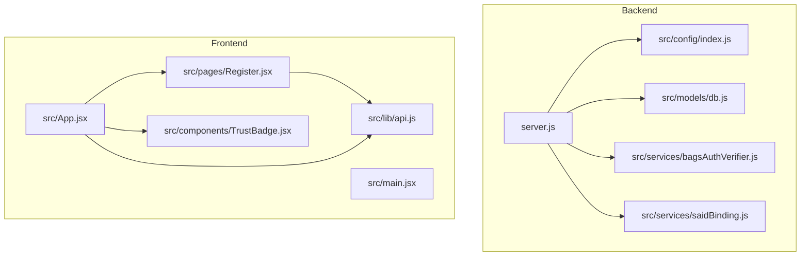
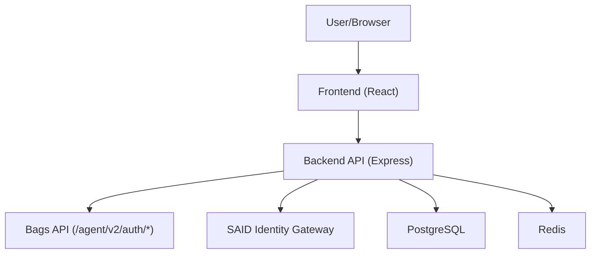
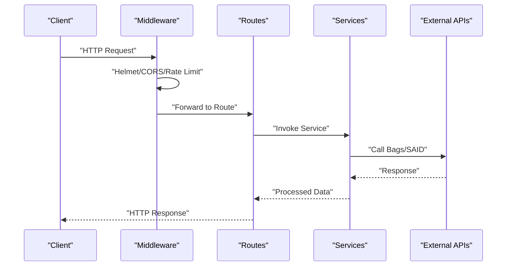
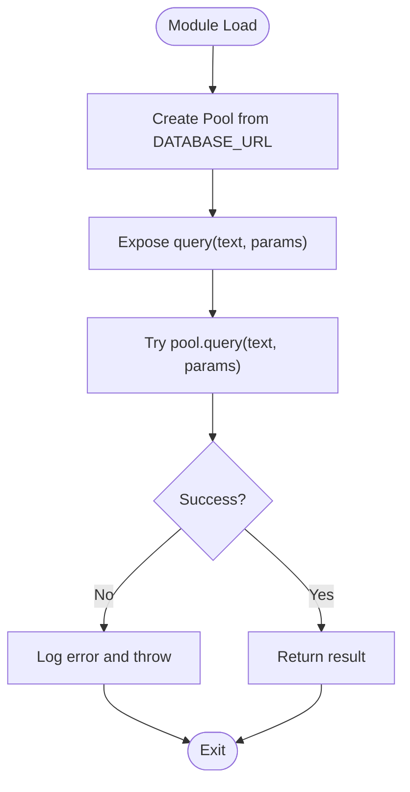
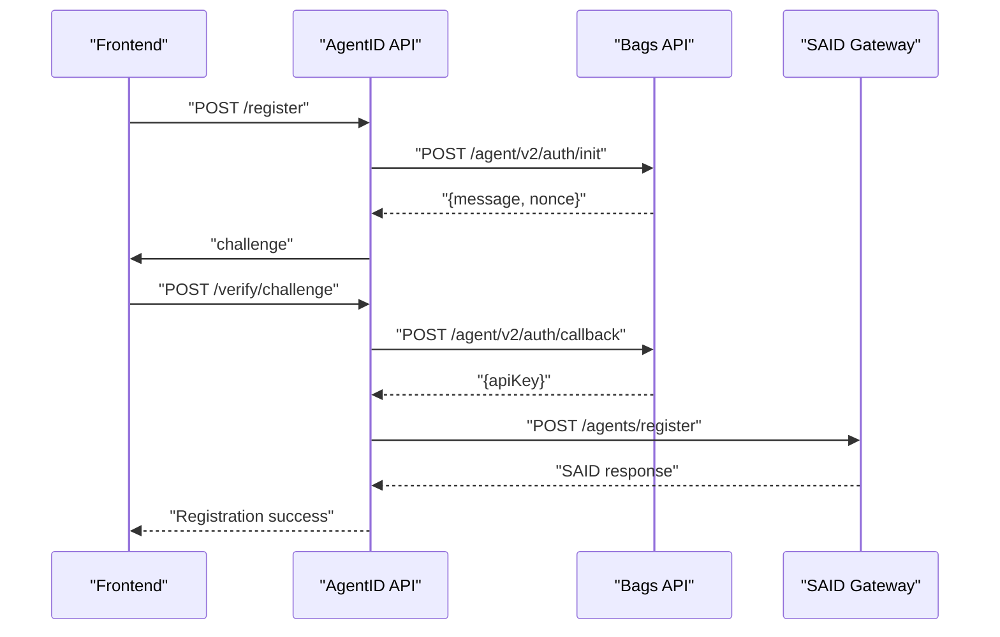
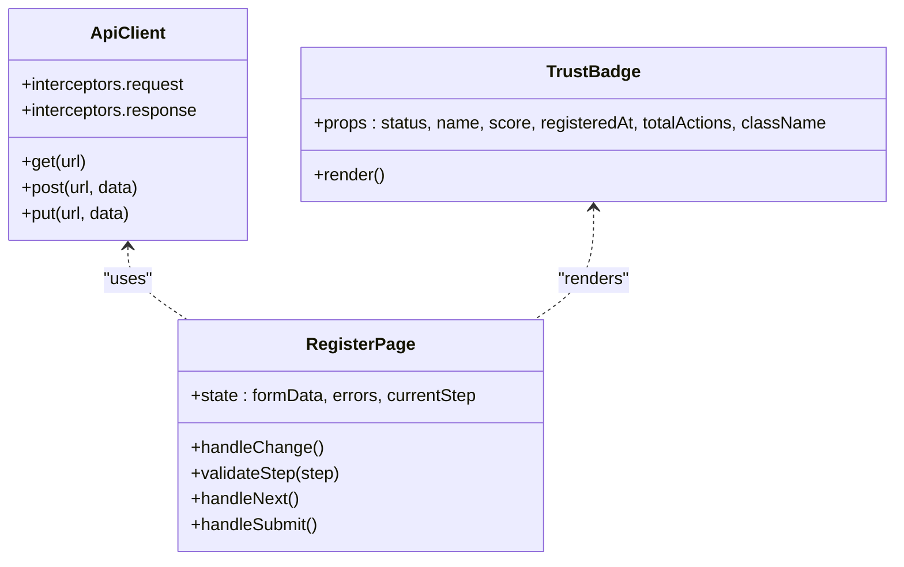
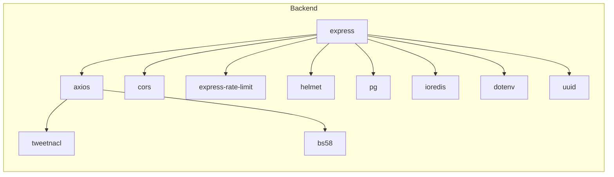

# Developer Guidelines

<cite>
**Referenced Files in This Document**
- [agentid_build_plan.md](file://agentid_build_plan.md)
- [backend/package.json](file://backend/package.json)
- [backend/server.js](file://backend/server.js)
- [backend/src/config/index.js](file://backend/src/config/index.js)
- [backend/src/models/db.js](file://backend/src/models/db.js)
- [backend/src/services/bagsAuthVerifier.js](file://backend/src/services/bagsAuthVerifier.js)
- [backend/src/services/saidBinding.js](file://backend/src/services/saidBinding.js)
- [frontend/package.json](file://frontend/package.json)
- [frontend/eslint.config.js](file://frontend/eslint.config.js)
- [frontend/vite.config.js](file://frontend/vite.config.js)
- [frontend/src/lib/api.js](file://frontend/src/lib/api.js)
- [frontend/src/components/TrustBadge.jsx](file://frontend/src/components/TrustBadge.jsx)
- [frontend/src/pages/Register.jsx](file://frontend/src/pages/Register.jsx)
- [frontend/src/App.jsx](file://frontend/src/App.jsx)
- [frontend/src/main.jsx](file://frontend/src/main.jsx)
</cite>

## Table of Contents
1. [Introduction](#introduction)
2. [Project Structure](#project-structure)
3. [Core Components](#core-components)
4. [Architecture Overview](#architecture-overview)
5. [Detailed Component Analysis](#detailed-component-analysis)
6. [Dependency Analysis](#dependency-analysis)
7. [Performance Considerations](#performance-considerations)
8. [Troubleshooting Guide](#troubleshooting-guide)
9. [Code Standards and Quality Assurance](#code-standards-and-quality-assurance)
10. [Development Workflow](#development-workflow)
11. [Contributing and Onboarding](#contributing-and-onboarding)
12. [Conclusion](#conclusion)

## Introduction
This document provides comprehensive developer guidelines for the AgentID project. It covers code standards, contributing processes, development workflow, API design principles, documentation standards, troubleshooting, performance optimization, architectural principles, and extension points. The goal is to ensure consistent, secure, and maintainable development across both the backend (Node.js/Express) and frontend (React/Vite) components.

## Project Structure
AgentID is organized into two primary modules:
- Backend: Node.js/Express API with modular routes, services, middleware, and models.
- Frontend: React 18 application with Vite build tooling and Tailwind CSS.

**Diagram sources**
- [backend/server.js:1-76](file://backend/server.js#L1-L76)
- [backend/src/config/index.js:1-31](file://backend/src/config/index.js#L1-L31)
- [backend/src/models/db.js:1-45](file://backend/src/models/db.js#L1-L45)
- [backend/src/services/bagsAuthVerifier.js:1-87](file://backend/src/services/bagsAuthVerifier.js#L1-L87)
- [backend/src/services/saidBinding.js:1-119](file://backend/src/services/saidBinding.js#L1-L119)
- [frontend/src/App.jsx:1-107](file://frontend/src/App.jsx#L1-L107)
- [frontend/src/main.jsx:1-11](file://frontend/src/main.jsx#L1-L11)
- [frontend/src/lib/api.js:1-140](file://frontend/src/lib/api.js#L1-L140)
- [frontend/src/pages/Register.jsx:1-673](file://frontend/src/pages/Register.jsx#L1-L673)
- [frontend/src/components/TrustBadge.jsx:1-145](file://frontend/src/components/TrustBadge.jsx#L1-L145)

**Section sources**
- [agentid_build_plan.md:258-302](file://agentid_build_plan.md#L258-L302)
- [backend/server.js:1-76](file://backend/server.js#L1-L76)
- [frontend/src/App.jsx:1-107](file://frontend/src/App.jsx#L1-L107)

## Core Components
- Backend configuration and environment management
- Database connectivity and pooling
- External service integrations (Bags API, SAID Gateway)
- Frontend API client and reusable UI components
- Routing and middleware stack (security, rate limiting, error handling)

Key implementation patterns:
- Centralized configuration via environment variables
- Modular service layer for external integrations
- Axios-based API client with interceptors for auth and error handling
- React components with PropTypes for type safety

**Section sources**
- [backend/src/config/index.js:1-31](file://backend/src/config/index.js#L1-L31)
- [backend/src/models/db.js:1-45](file://backend/src/models/db.js#L1-L45)
- [backend/src/services/bagsAuthVerifier.js:1-87](file://backend/src/services/bagsAuthVerifier.js#L1-L87)
- [backend/src/services/saidBinding.js:1-119](file://backend/src/services/saidBinding.js#L1-L119)
- [frontend/src/lib/api.js:1-140](file://frontend/src/lib/api.js#L1-L140)
- [frontend/src/components/TrustBadge.jsx:1-145](file://frontend/src/components/TrustBadge.jsx#L1-L145)

## Architecture Overview
AgentID sits between Bags agents and end-users, wrapping Bags’ Ed25519 auth flow, binding identities to SAID, computing a composite reputation score, and exposing a trust badge and discovery API.

**Diagram sources**
- [agentid_build_plan.md:1-330](file://agentid_build_plan.md#L1-L330)
- [backend/server.js:1-76](file://backend/server.js#L1-L76)
- [backend/src/services/bagsAuthVerifier.js:1-87](file://backend/src/services/bagsAuthVerifier.js#L1-L87)
- [backend/src/services/saidBinding.js:1-119](file://backend/src/services/saidBinding.js#L1-L119)
- [backend/src/models/db.js:1-45](file://backend/src/models/db.js#L1-L45)

## Detailed Component Analysis

### Backend API and Middleware Stack
- Security: Helmet hardens headers; CORS configured per environment; rate limiting applied globally.
- Routing: Modular route modules mounted under logical prefixes.
- Error handling: Centralized error handler middleware.
- Health checks: Simple GET /health endpoint.

**Diagram sources**
- [backend/server.js:1-76](file://backend/server.js#L1-L76)
- [backend/src/services/bagsAuthVerifier.js:1-87](file://backend/src/services/bagsAuthVerifier.js#L1-L87)
- [backend/src/services/saidBinding.js:1-119](file://backend/src/services/saidBinding.js#L1-L119)

**Section sources**
- [backend/server.js:1-76](file://backend/server.js#L1-L76)

### Database Connectivity and Pooling
- Uses pg Pool with SSL configuration in production.
- Centralized query helper with error logging and rethrow.

**Diagram sources**
- [backend/src/models/db.js:1-45](file://backend/src/models/db.js#L1-L45)

**Section sources**
- [backend/src/models/db.js:1-45](file://backend/src/models/db.js#L1-L45)

### External Integrations: Bags Auth and SAID Binding
- Bags Auth Verifier: Issues and validates Ed25519 challenges; returns API key identifiers.
- SAID Binding: Registers agents, retrieves trust scores, and supports discovery.

**Diagram sources**
- [agentid_build_plan.md:40-86](file://agentid_build_plan.md#L40-L86)
- [backend/src/services/bagsAuthVerifier.js:1-87](file://backend/src/services/bagsAuthVerifier.js#L1-L87)
- [backend/src/services/saidBinding.js:1-119](file://backend/src/services/saidBinding.js#L1-L119)

**Section sources**
- [agentid_build_plan.md:40-86](file://agentid_build_plan.md#L40-L86)
- [backend/src/services/bagsAuthVerifier.js:1-87](file://backend/src/services/bagsAuthVerifier.js#L1-L87)
- [backend/src/services/saidBinding.js:1-119](file://backend/src/services/saidBinding.js#L1-L119)

### Frontend API Client and Components
- API client encapsulates baseURL, interceptors, and domain-specific helpers.
- TrustBadge component renders status with Tailwind-based theming and PropTypes validation.
- Register page implements a guided multi-step form with validation and challenge issuance.

**Diagram sources**
- [frontend/src/lib/api.js:1-140](file://frontend/src/lib/api.js#L1-L140)
- [frontend/src/components/TrustBadge.jsx:1-145](file://frontend/src/components/TrustBadge.jsx#L1-L145)
- [frontend/src/pages/Register.jsx:1-673](file://frontend/src/pages/Register.jsx#L1-L673)

**Section sources**
- [frontend/src/lib/api.js:1-140](file://frontend/src/lib/api.js#L1-L140)
- [frontend/src/components/TrustBadge.jsx:1-145](file://frontend/src/components/TrustBadge.jsx#L1-L145)
- [frontend/src/pages/Register.jsx:1-673](file://frontend/src/pages/Register.jsx#L1-L673)

## Dependency Analysis
- Backend dependencies include Express, helmet, cors, rate-limit, tweetnacl, bs58, axios, pg, ioredis, dotenv, uuid.
- Frontend dependencies include React, ReactDOM, axios, prop-types, react-router-dom, Tailwind, Vite, ESLint.

**Diagram sources**
- [backend/package.json:1-35](file://backend/package.json#L1-L35)

**Section sources**
- [backend/package.json:1-35](file://backend/package.json#L1-L35)
- [frontend/package.json:1-33](file://frontend/package.json#L1-L33)

## Performance Considerations
- Use Redis for short-lived challenge nonces and badge caching to reduce external API calls and database load.
- Apply rate limiting at the API level to protect downstream services.
- Optimize frontend bundle size with Vite and Tailwind purging.
- Use streaming and pagination for large datasets (agents, attestations).
- Cache badge responses with configurable TTL to minimize repeated computation.

[No sources needed since this section provides general guidance]

## Troubleshooting Guide
Common issues and resolutions:
- Authentication failures with Bags API:
  - Verify BAGS_API_KEY and endpoint reachability.
  - Confirm Ed25519 challenge/response flow and signature decoding.
- SAID registration/unavailable:
  - Check SAID_GATEWAY_URL and network connectivity.
  - Inspect returned error messages and fallback behavior.
- Database connectivity:
  - Validate DATABASE_URL and SSL settings in production.
  - Monitor pool errors and retry logic.
- Frontend API errors:
  - Use axios interceptors to detect 401 and clear stale tokens.
  - Inspect baseURL and proxy configuration in Vite.
- Widget rendering:
  - Ensure widget.html rewrite middleware is active during development.
  - Confirm CORS origin matches frontend origin.

**Section sources**
- [agentid_build_plan.md:309-330](file://agentid_build_plan.md#L309-L330)
- [backend/src/services/bagsAuthVerifier.js:1-87](file://backend/src/services/bagsAuthVerifier.js#L1-L87)
- [backend/src/services/saidBinding.js:1-119](file://backend/src/services/saidBinding.js#L1-L119)
- [backend/src/models/db.js:1-45](file://backend/src/models/db.js#L1-L45)
- [frontend/src/lib/api.js:1-140](file://frontend/src/lib/api.js#L1-L140)
- [frontend/vite.config.js:1-42](file://frontend/vite.config.js#L1-L42)

## Code Standards and Quality Assurance
- JavaScript/React conventions:
  - Use functional components with hooks.
  - PropTypes for component props; enforce required vs optional fields.
  - Consistent naming: camelCase for variables, PascalCase for components.
  - Avoid inline styles; use Tailwind utility classes.
- API design:
  - RESTful endpoints with clear HTTP verbs and resource paths.
  - Standardized error responses with error and message fields.
  - Pagination and filtering via query parameters.
- Documentation:
  - Inline JSDoc comments for exported functions and services.
  - README-style build plan and architecture references.
- Formatting and linting:
  - ESLint flat config with recommended rules and React hooks plugin.
  - Run linting via npm/yarn scripts before committing.
- Testing:
  - Unit tests for pure functions (e.g., signature verification).
  - Integration tests for API endpoints and external service calls.
  - Snapshot tests for UI components to prevent regressions.

**Section sources**
- [frontend/eslint.config.js:1-30](file://frontend/eslint.config.js#L1-L30)
- [frontend/package.json:1-33](file://frontend/package.json#L1-L33)
- [agentid_build_plan.md:1-330](file://agentid_build_plan.md#L1-L330)

## Development Workflow
- Local setup:
  - Backend: Install dependencies, configure .env, run migrations, start dev server.
  - Frontend: Install dependencies, configure Vite proxy to backend, start dev server.
- Branching:
  - Use feature branches prefixed with feature/, fix/, chore/.
  - Keep main protected; avoid direct commits to main.
- Pull requests:
  - Open PRs early; include summary, screenshots, and testing notes.
  - Assign reviewers; ensure CI passes and diffs are clean.
- Code review:
  - Focus on correctness, security (Ed25519, PKI), maintainability, and UX.
  - Approve only after resolving comments and verifying changes.
- Environment variables:
  - Use .env.example as a template; never commit secrets.
  - Validate required variables at startup.

**Section sources**
- [agentid_build_plan.md:309-330](file://agentid_build_plan.md#L309-L330)
- [backend/server.js:1-76](file://backend/server.js#L1-L76)
- [frontend/vite.config.js:1-42](file://frontend/vite.config.js#L1-L42)

## Contributing and Onboarding
- New contributor steps:
  - Fork and clone the repository.
  - Install dependencies for both backend and frontend.
  - Review the build plan and architecture overview.
  - Pick a good-first-issue labeled accordingly.
- Pair programming and mentoring:
  - Work with maintainers on complex features.
  - Present designs before implementation.
- Extension points:
  - Add new routes under src/routes and mount in server.js.
  - Introduce new services under src/services and integrate via routes.
  - Extend frontend pages/components under src/pages and src/components.

**Section sources**
- [agentid_build_plan.md:1-330](file://agentid_build_plan.md#L1-L330)
- [backend/server.js:1-76](file://backend/server.js#L1-L76)

## Conclusion
These guidelines establish a consistent foundation for building, testing, and operating AgentID. By adhering to the outlined standards, workflows, and architectural principles, contributors can collaborate effectively while maintaining a secure, performant, and user-friendly system.