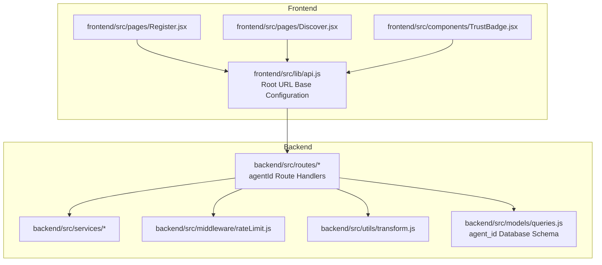
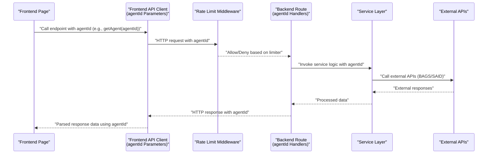
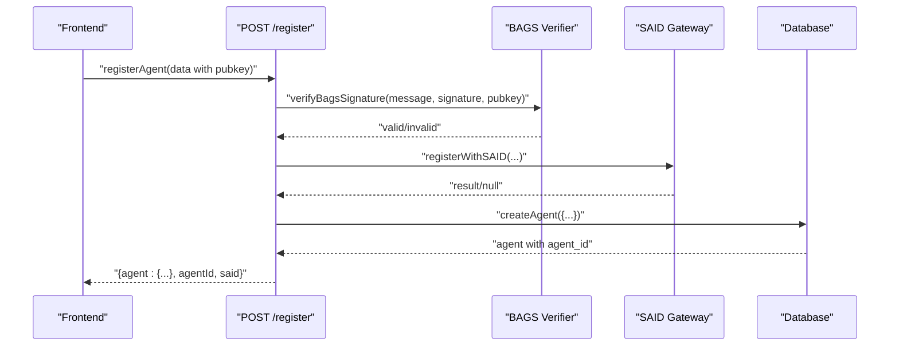
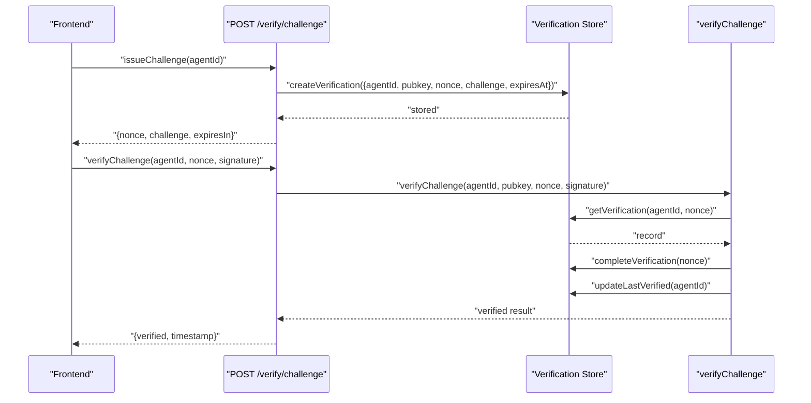
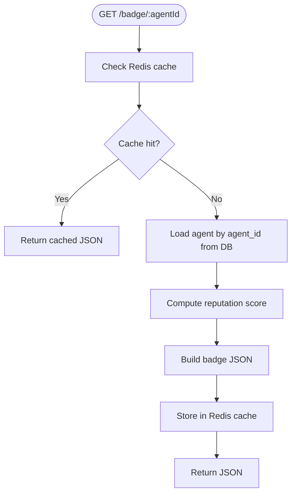
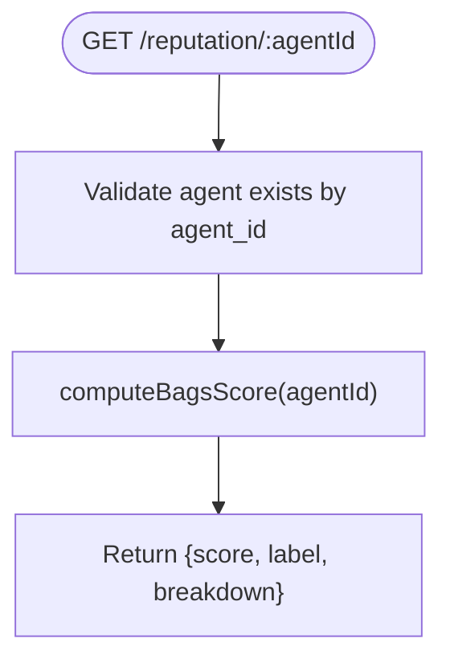
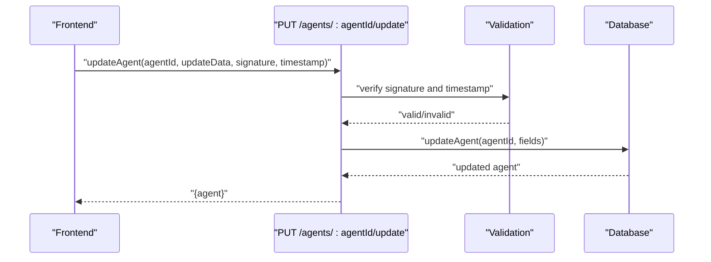
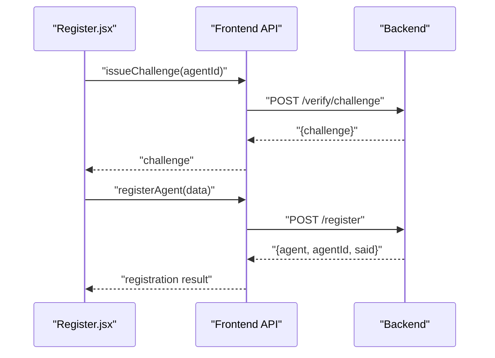
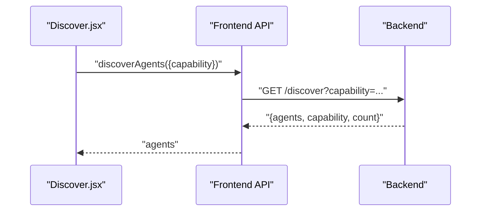
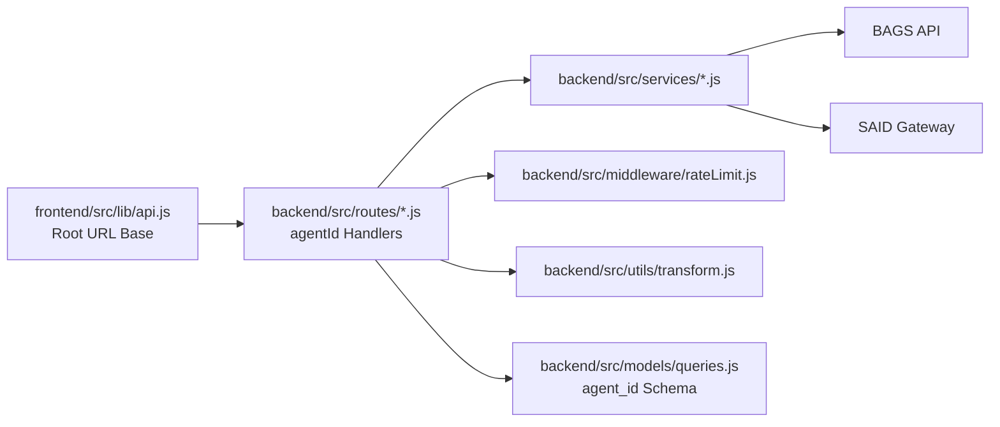

# API Integration

<cite>
**Referenced Files in This Document**
- [api.js](file://frontend/src/lib/api.js)
- [register.js](file://backend/src/routes/register.js)
- [verify.js](file://backend/src/routes/verify.js)
- [badge.js](file://backend/src/routes/badge.js)
- [reputation.js](file://backend/src/routes/reputation.js)
- [agents.js](file://backend/src/routes/agents.js)
- [rateLimit.js](file://backend/src/middleware/rateLimit.js)
- [bagsAuthVerifier.js](file://backend/src/services/bagsAuthVerifier.js)
- [pkiChallenge.js](file://backend/src/services/pkiChallenge.js)
- [badgeBuilder.js](file://backend/src/services/badgeBuilder.js)
- [bagsReputation.js](file://backend/src/services/bagsReputation.js)
- [saidBinding.js](file://backend/src/services/saidBinding.js)
- [transform.js](file://backend/src/utils/transform.js)
- [queries.js](file://backend/src/models/queries.js)
- [Register.jsx](file://frontend/src/pages/Register.jsx)
- [Discover.jsx](file://frontend/src/pages/Discover.jsx)
- [TrustBadge.jsx](file://frontend/src/components/TrustBadge.jsx)
</cite>

## Update Summary
**Changes Made**
- Updated base URL configuration from '/api' to empty string ('') in frontend API client to resolve production deployment conflicts with Nginx reverse proxies
- Enhanced deployment flexibility by sending API requests directly to root URL in production environments
- Maintained all existing API endpoint functionality and parameter patterns
- Preserved agentId parameter usage throughout the system for consistency

## Table of Contents
1. [Introduction](#introduction)
2. [Project Structure](#project-structure)
3. [Core Components](#core-components)
4. [Architecture Overview](#architecture-overview)
5. [Detailed Component Analysis](#detailed-component-analysis)
6. [Dependency Analysis](#dependency-analysis)
7. [Performance Considerations](#performance-considerations)
8. [Troubleshooting Guide](#troubleshooting-guide)
9. [Conclusion](#conclusion)
10. [Appendices](#appendices)

## Introduction
This document provides comprehensive documentation for the AgentID frontend API integration centered on the api.js client and backend communication patterns. The integration has been comprehensively updated to use agentId parameters throughout the API interface, replacing pubkey-based operations with UUID-based agent identification. This change enables better scalability, improved security through UUID isolation, and support for multi-agent wallet scenarios through the new getAgentsByOwner function.

The documentation covers all API endpoints for agent registration, verification, badge retrieval, reputation scoring, and discovery services, explaining request/response patterns, error handling strategies, authentication mechanisms, data transformation utilities, caching strategies, offline handling approaches, examples of API calls and response processing, loading states, error recovery, integration with external services, rate limiting considerations, performance optimization techniques, and guidelines for extending the API client and adding new endpoints.

## Project Structure
The AgentID project is organized into two primary areas:
- Frontend: React application with a dedicated API client and pages/components that consume the backend, now using agentId parameters consistently
- Backend: Express-based server exposing REST endpoints, middleware, services, and utilities, with database queries optimized for agent_id UUIDs

**Diagram sources**
- [api.js:1-147](file://frontend/src/lib/api.js#L1-L147)
- [register.js:1-172](file://backend/src/routes/register.js#L1-L172)
- [verify.js:1-121](file://backend/src/routes/verify.js#L1-L121)
- [badge.js:1-58](file://backend/src/routes/badge.js#L1-L58)
- [reputation.js:1-45](file://backend/src/routes/reputation.js#L1-L45)
- [agents.js:1-277](file://backend/src/routes/agents.js#L1-L277)
- [rateLimit.js:1-62](file://backend/src/middleware/rateLimit.js#L1-L62)
- [transform.js:1-103](file://backend/src/utils/transform.js#L1-L103)
- [queries.js:1-200](file://backend/src/models/queries.js#L1-L200)

**Section sources**
- [api.js:1-147](file://frontend/src/lib/api.js#L1-L147)
- [register.js:1-172](file://backend/src/routes/register.js#L1-L172)
- [verify.js:1-121](file://backend/src/routes/verify.js#L1-L121)
- [badge.js:1-58](file://backend/src/routes/badge.js#L1-L58)
- [reputation.js:1-45](file://backend/src/routes/reputation.js#L1-L45)
- [agents.js:1-277](file://backend/src/routes/agents.js#L1-L277)
- [rateLimit.js:1-62](file://backend/src/middleware/rateLimit.js#L1-L62)
- [transform.js:1-103](file://backend/src/utils/transform.js#L1-L103)
- [queries.js:1-200](file://backend/src/models/queries.js#L1-L200)

## Core Components
- **Frontend API Client**: Centralized Axios instance with interceptors for authentication and global error handling, now exposing typed functions for all backend endpoints using agentId parameters instead of pubkey
- **Backend Routes**: REST endpoints for agents, registration, verification, badges, reputation, discovery, and widgets, all updated to handle agentId parameters consistently
- **Services**: Business logic for authentication verification, PKI challenge-response, badge generation, reputation computation, and SAID integration
- **Middleware**: Rate limiting configuration for default and strict auth endpoints
- **Utilities**: Data transformation helpers for API responses and validation
- **Database Models**: PostgreSQL queries optimized for agent_id UUIDs with enhanced multi-agent support

Key responsibilities:
- **Authentication**: Bearer token injection and 401 cleanup
- **Request/Response**: Typed wrappers around HTTP calls, parameter serialization, and response parsing using agentId parameters
- **Error Handling**: Centralized response interceptor and route-level validation
- **Data Transformation**: Snake_case to camelCase conversion and frontend compatibility mapping
- **Caching**: Redis-backed caching for badge JSON generation
- **Multi-Agent Support**: Enhanced support for wallets managing multiple agents through getAgentsByOwner function

**Section sources**
- [api.js:1-147](file://frontend/src/lib/api.js#L1-L147)
- [rateLimit.js:1-62](file://backend/src/middleware/rateLimit.js#L1-L62)
- [transform.js:1-103](file://backend/src/utils/transform.js#L1-L103)
- [badgeBuilder.js:1-497](file://backend/src/services/badgeBuilder.js#L1-L497)
- [queries.js:1-200](file://backend/src/models/queries.js#L1-L200)

## Architecture Overview
The frontend communicates with the backend via a centralized API client that now consistently uses agentId parameters. The backend enforces rate limits, validates inputs, integrates with external services (BAGS, SAID), computes reputation scores, and caches frequently accessed data. The architecture supports both individual agent operations and multi-agent wallet scenarios.

**Diagram sources**
- [api.js:1-147](file://frontend/src/lib/api.js#L1-L147)
- [rateLimit.js:1-62](file://backend/src/middleware/rateLimit.js#L1-L62)
- [register.js:1-172](file://backend/src/routes/register.js#L1-L172)
- [verify.js:1-121](file://backend/src/routes/verify.js#L1-L121)
- [badge.js:1-58](file://backend/src/routes/badge.js#L1-L58)
- [reputation.js:1-45](file://backend/src/routes/reputation.js#L1-L45)
- [agents.js:1-277](file://backend/src/routes/agents.js#L1-L277)
- [bagsAuthVerifier.js:1-93](file://backend/src/services/bagsAuthVerifier.js#L1-L93)
- [saidBinding.js:1-119](file://backend/src/services/saidBinding.js#L1-L119)

## Detailed Component Analysis

### Frontend API Client (api.js) - Updated
**Updated** Base URL configuration changed from '/api' to empty string ('') to resolve production deployment conflicts

- **Base configuration**: Axios instance pointing to root URL '' with JSON content-type
- **Authentication**: Adds Authorization header if a token exists in localStorage
- **Global error handling**: Removes token on 401 responses
- **Endpoints exposed**:
  - **Agents**: getAgents(filters), getAgent(agentId) - Now uses agentId instead of pubkey
  - **Trust Badge**: getBadge(agentId), getBadgeSvg(agentId) - Updated parameter naming
  - **Reputation**: getReputation(agentId) - Changed from pubkey to agentId
  - **Registration**: registerAgent(registrationData) - Maintains pubkey for BAGS verification
  - **Verification**: issueChallenge(agentId), verifyChallenge(agentId, nonce, signature) - Updated parameter naming
  - **Attestations**: attestAgent(agentId, data), flagAgent(agentId, data) - Changed parameter naming
  - **Discovery**: discoverAgents(params) - No parameter changes
  - **Widget**: getWidgetHtml(agentId) - Updated parameter naming
  - **Agent Updates**: updateAgent(agentId, updateData, signature, timestamp) - Changed parameter naming
  - **History**: getAttestations(agentId), getFlags(agentId) - Updated parameter naming
  - **Multi-Agent Support**: getAgentsByOwner(pubkey) - New function for multi-agent scenarios

**Processing logic highlights**:
- Query parameter construction for filtering and pagination
- Request body composition for POST/PUT operations using agentId
- Response data extraction and return
- Enhanced support for multi-agent wallet scenarios

**Section sources**
- [api.js:1-147](file://frontend/src/lib/api.js#L1-L147)

### Backend Routes and Services - Updated

#### Registration (/register)
**Updated** Registration maintains pubkey parameter for BAGS signature verification while returning agentId in responses

- **Endpoint**: POST /register
- **Validation**: Ensures required fields, pubkey format, and nonce presence in message
- **Authentication**: Verifies Ed25519 signature against BAGS challenge using BAGS API key
- **SAID Binding**: Attempts non-blocking registration with SAID Identity Gateway
- **Persistence**: Stores agent record with capability set and metadata, returns agentId
- **Response**: Returns created agent with agentId and SAID status

**Diagram sources**
- [register.js:1-172](file://backend/src/routes/register.js#L1-L172)
- [bagsAuthVerifier.js:1-93](file://backend/src/services/bagsAuthVerifier.js#L1-L93)
- [saidBinding.js:1-119](file://backend/src/services/saidBinding.js#L1-L119)

**Section sources**
- [register.js:1-172](file://backend/src/routes/register.js#L1-L172)
- [bagsAuthVerifier.js:1-93](file://backend/src/services/bagsAuthVerifier.js#L1-L93)
- [saidBinding.js:1-119](file://backend/src/services/saidBinding.js#L1-L119)

#### Verification (/verify) - Updated
**Updated** All verification endpoints now use agentId parameters consistently

- **Challenge Issuance**: POST /verify/challenge validates agentId, checks agent existence, and stores challenge with expiry
- **Response Verification**: POST /verify/response validates agentId, nonce/signature, checks expiry, and marks completion

**Diagram sources**
- [verify.js:1-121](file://backend/src/routes/verify.js#L1-L121)
- [pkiChallenge.js:1-102](file://backend/src/services/pkiChallenge.js#L1-L102)

**Section sources**
- [verify.js:1-121](file://backend/src/routes/verify.js#L1-L121)
- [pkiChallenge.js:1-102](file://backend/src/services/pkiChallenge.js#L1-L102)

#### Trust Badge (/badge)
- **JSON Badge**: GET /badge/:agentId returns badge data with caching and agent lookup
- **SVG Badge**: GET /badge/:agentId/svg returns SVG image with dynamic theming
- **Widget HTML**: GET /widget/:agentId returns embedded HTML widget

**Diagram sources**
- [badge.js:1-58](file://backend/src/routes/badge.js#L1-L58)
- [badgeBuilder.js:1-497](file://backend/src/services/badgeBuilder.js#L1-L497)

**Section sources**
- [badge.js:1-58](file://backend/src/routes/badge.js#L1-L58)
- [badgeBuilder.js:1-497](file://backend/src/services/badgeBuilder.js#L1-L497)

#### Reputation (/reputation)
- **GET /reputation/:agentId** computes BAGS reputation score and returns structured breakdown

**Diagram sources**
- [reputation.js:1-45](file://backend/src/routes/reputation.js#L1-L45)
- [bagsReputation.js:1-146](file://backend/src/services/bagsReputation.js#L1-L146)

**Section sources**
- [reputation.js:1-45](file://backend/src/routes/reputation.js#L1-L45)
- [bagsReputation.js:1-146](file://backend/src/services/bagsReputation.js#L1-L146)

#### Agents and Discovery (/agents, /discover, /agents/:agentId/update, /agents/owner/:pubkey) - Updated

**Updated** All agent endpoints now consistently use agentId parameters, with enhanced multi-agent support

- **Listing**: GET /agents supports filters, pagination, and total count
- **Detail**: GET /agents/:agentId returns agent plus reputation using agentId
- **Discovery**: GET /discover finds agents by capability
- **Update**: PUT /agents/:agentId/update verifies Ed25519 signature, enforces timestamp window, and updates allowed fields
- **Multi-Agent**: GET /agents/owner/:pubkey returns all agents owned by a specific pubkey

**Diagram sources**
- [agents.js:1-277](file://backend/src/routes/agents.js#L1-L277)

**Section sources**
- [agents.js:1-277](file://backend/src/routes/agents.js#L1-L277)

### Frontend Pages and Components - Updated

#### Registration Flow (Register.jsx)
**Updated** Registration flow now works seamlessly with agentId parameter changes

- **Multi-step form**: Identity, Challenge issuance, Metadata, Confirmation
- **Calls**: issueChallenge(agentId), registerAgent()
- **Error handling**: Localized validation and server-side error display
- **Success state**: Renders TrustBadge with registration outcome

**Diagram sources**
- [Register.jsx:1-733](file://frontend/src/pages/Register.jsx#L1-L733)
- [api.js:1-147](file://frontend/src/lib/api.js#L1-L147)
- [register.js:1-172](file://backend/src/routes/register.js#L1-L172)
- [verify.js:1-121](file://backend/src/routes/verify.js#L1-L121)

**Section sources**
- [Register.jsx:1-733](file://frontend/src/pages/Register.jsx#L1-L733)
- [api.js:1-147](file://frontend/src/lib/api.js#L1-L147)

#### Discovery (Discover.jsx)
**Updated** Discovery functionality remains unchanged but now benefits from improved agentId parameter consistency

- **Capability-based search**: discoverAgents({ capability })
- **Loading states**, skeleton loaders, empty/error states
- **Renders TrustBadge** for each agent

**Diagram sources**
- [Discover.jsx:1-421](file://frontend/src/pages/Discover.jsx#L1-L421)
- [api.js:1-147](file://frontend/src/lib/api.js#L1-L147)
- [agents.js:1-277](file://backend/src/routes/agents.js#L1-L277)

**Section sources**
- [Discover.jsx:1-421](file://frontend/src/pages/Discover.jsx#L1-L421)
- [api.js:1-147](file://frontend/src/lib/api.js#L1-L147)

#### TrustBadge Component (TrustBadge.jsx)
**Updated** TrustBadge component remains unchanged as it consumes data rather than making API calls

- **Renders status-specific visuals and metadata**
- **Consumes props**: status, name, score, registeredAt, totalActions

**Section sources**
- [TrustBadge.jsx:1-280](file://frontend/src/components/TrustBadge.jsx#L1-L280)

### Database Models - Updated

#### Enhanced Multi-Agent Support
**Updated** Database models now work exclusively with agent_id UUIDs while maintaining backward compatibility

- **Agent Identity Queries**: All functions use agent_id UUID instead of pubkey
- **Multi-Agent Queries**: New getAgentsByOwner function for wallet scenarios
- **Enhanced Security**: UUID isolation prevents pubkey-based attacks
- **Improved Scalability**: Better indexing and query performance with UUIDs

**Section sources**
- [queries.js:1-200](file://backend/src/models/queries.js#L1-L200)

## Dependency Analysis
**Updated** Dependencies now reflect the agentId parameter replacement throughout the system

- **Frontend depends on api.js** for all HTTP interactions using agentId parameters
- **Backend routes depend on services** for business logic and middleware for rate limiting
- **Services integrate with external APIs** (BAGS, SAID) and internal models/queries
- **Data transformation utilities** normalize backend responses for frontend consumption
- **Database layer optimized** for agent_id UUID queries with enhanced multi-agent support

**Diagram sources**
- [api.js:1-147](file://frontend/src/lib/api.js#L1-L147)
- [register.js:1-172](file://backend/src/routes/register.js#L1-L172)
- [verify.js:1-121](file://backend/src/routes/verify.js#L1-L121)
- [badge.js:1-58](file://backend/src/routes/badge.js#L1-L58)
- [reputation.js:1-45](file://backend/src/routes/reputation.js#L1-L45)
- [agents.js:1-277](file://backend/src/routes/agents.js#L1-L277)
- [rateLimit.js:1-62](file://backend/src/middleware/rateLimit.js#L1-L62)
- [transform.js:1-103](file://backend/src/utils/transform.js#L1-L103)
- [bagsAuthVerifier.js:1-93](file://backend/src/services/bagsAuthVerifier.js#L1-L93)
- [saidBinding.js:1-119](file://backend/src/services/saidBinding.js#L1-L119)
- [queries.js:1-200](file://backend/src/models/queries.js#L1-L200)

**Section sources**
- [api.js:1-147](file://frontend/src/lib/api.js#L1-L147)
- [rateLimit.js:1-62](file://backend/src/middleware/rateLimit.js#L1-L62)
- [transform.js:1-103](file://backend/src/utils/transform.js#L1-L103)
- [bagsAuthVerifier.js:1-93](file://backend/src/services/bagsAuthVerifier.js#L1-L93)
- [saidBinding.js:1-119](file://backend/src/services/saidBinding.js#L1-L119)
- [queries.js:1-200](file://backend/src/models/queries.js#L1-L200)

## Performance Considerations
**Updated** Performance optimizations now leverage agentId UUIDs for better query performance

- **Caching**: Badge JSON is cached in Redis to reduce repeated computations and DB lookups
- **Pagination**: Backend enforces max limit and returns total for efficient client-side pagination
- **Rate Limiting**: Default and strict limits applied to protect endpoints; configure via middleware
- **External API timeouts**: Services set timeouts to avoid blocking calls to BAGS/SAID
- **Frontend loading states**: Skeleton loaders and compact layouts improve perceived performance during network-bound operations
- **Database Optimization**: UUID-based queries provide better indexing and performance for multi-agent scenarios
- **Multi-Agent Efficiency**: getAgentsByOwner function optimized for wallet with multiple agents

## Troubleshooting Guide
**Updated** Troubleshooting guide reflects agentId parameter changes

Common scenarios and remedies:
- **401 Unauthorized**: Token removed automatically by response interceptor; re-authenticate and retry
- **Validation errors**: Ensure required fields and formats match backend validation (e.g., agentId UUID format)
- **Challenge verification failures**: Confirm agentId exists, nonce presence in message, correct signature encoding, and non-expired challenge
- **SAID integration failures**: Non-blocking fallback; retry or monitor SAID gateway availability
- **Rate limit exceeded**: Reduce request frequency or adjust client-side polling intervals
- **Multi-agent issues**: Use getAgentsByOwner(pubkey) for wallet scenarios instead of individual agentId lookups

**Section sources**
- [api.js:23-33](file://frontend/src/lib/api.js#L23-L33)
- [register.js:20-53](file://backend/src/routes/register.js#L20-L53)
- [verify.js:57-118](file://backend/src/routes/verify.js#L57-L118)
- [rateLimit.js:15-62](file://backend/src/middleware/rateLimit.js#L15-L62)

## Conclusion
The AgentID API integration provides a robust, secure, and scalable foundation for agent registration, verification, reputation scoring, badge generation, and discovery. The comprehensive update to use agentId parameters throughout the system enhances security through UUID isolation, improves performance with optimized database queries, and enables better support for multi-agent wallet scenarios through the new getAgentsByOwner function. The frontend API client encapsulates authentication and error handling while the backend enforces validation, integrates external services, and optimizes performance through caching and rate limiting. The documented patterns enable safe extension with new endpoints and services.

## Appendices

### API Endpoints Reference - Updated
**Updated** All endpoints now use agentId parameters consistently

- **Agents**
  - GET /agents?status=&capability=&limit=&offset=
  - GET /agents/:agentId - Now uses agentId instead of pubkey
  - PUT /agents/:agentId/update (requires signature and timestamp) - Updated parameter naming
  - GET /agents/owner/:pubkey - New multi-agent support endpoint
- **Trust Badge**
  - GET /badge/:agentId - Updated parameter naming
  - GET /badge/:agentId/svg - Updated parameter naming
  - GET /widget/:agentId - Updated parameter naming
- **Reputation**
  - GET /reputation/:agentId - Updated parameter naming
- **Registration**
  - POST /register - Maintains pubkey for BAGS verification
- **Verification**
  - POST /verify/challenge - Updated parameter naming
  - POST /verify/response - Updated parameter naming
- **Discovery**
  - GET /discover?capability=
- **Attestations and Flags**
  - POST /agents/:agentId/attest - Updated parameter naming
  - POST /agents/:agentId/flag - Updated parameter naming
  - GET /agents/:agentId/attestations - Updated parameter naming
  - GET /agents/:agentId/flags - Updated parameter naming

**Section sources**
- [agents.js:1-277](file://backend/src/routes/agents.js#L1-L277)
- [badge.js:1-58](file://backend/src/routes/badge.js#L1-L58)
- [reputation.js:1-45](file://backend/src/routes/reputation.js#L1-L45)
- [register.js:1-172](file://backend/src/routes/register.js#L1-L172)
- [verify.js:1-121](file://backend/src/routes/verify.js#L1-L121)
- [agents.js:96-118](file://backend/src/routes/agents.js#L96-L118)

### Frontend Usage Examples - Updated
**Updated** Examples now demonstrate agentId parameter usage

- **Registration**
  - Steps: Issue challenge with agentId, sign challenge, submit registration, show success
- **Discovery**
  - Search by capability, render results with TrustBadge, handle loading and error states
- **Multi-Agent Wallets**
  - Retrieve all agents for a wallet: getAgentsByOwner(pubkey)

**Section sources**
- [Register.jsx:295-341](file://frontend/src/pages/Register.jsx#L295-L341)
- [Discover.jsx:101-117](file://frontend/src/pages/Discover.jsx#L101-L117)
- [api.js:140-144](file://frontend/src/lib/api.js#L140-L144)

### Guidelines for Extending the API Client - Updated
**Updated** Guidelines now emphasize agentId parameter consistency

- **Add new endpoint function** in api.js with appropriate request/response handling using agentId parameters
- **Export the function** for use across pages/components
- **Respect baseURL and interceptors** for auth and error handling
- **Keep parameter serialization** consistent with backend expectations using agentId
- **Maintain backward compatibility** where appropriate for multi-agent scenarios

**Section sources**
- [api.js:1-147](file://frontend/src/lib/api.js#L1-L147)

### Guidelines for Adding New Backend Endpoints - Updated
**Updated** Guidelines emphasize agentId parameter usage

- **Define route** in backend/src/routes with validation and rate limiting using agentId parameters
- **Implement service logic** in backend/src/services
- **Integrate with external APIs** and database as needed
- **Apply data transformation utilities** for consistent response formats
- **Add caching** where appropriate to improve performance
- **Support multi-agent scenarios** through agentId-based operations

**Section sources**
- [rateLimit.js:1-62](file://backend/src/middleware/rateLimit.js#L1-L62)
- [transform.js:1-103](file://backend/src/utils/transform.js#L1-L103)
- [badgeBuilder.js:1-497](file://backend/src/services/badgeBuilder.js#L1-L497)
- [queries.js:1-200](file://backend/src/models/queries.js#L1-L200)