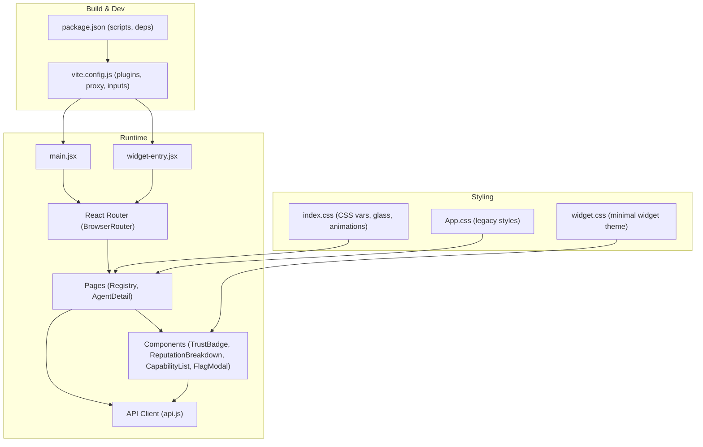
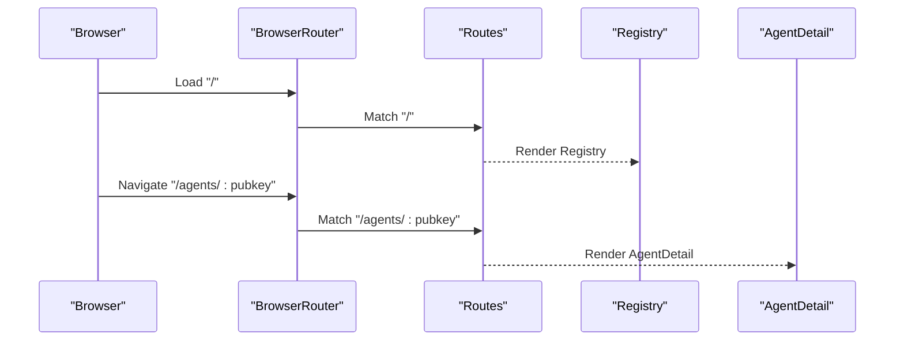
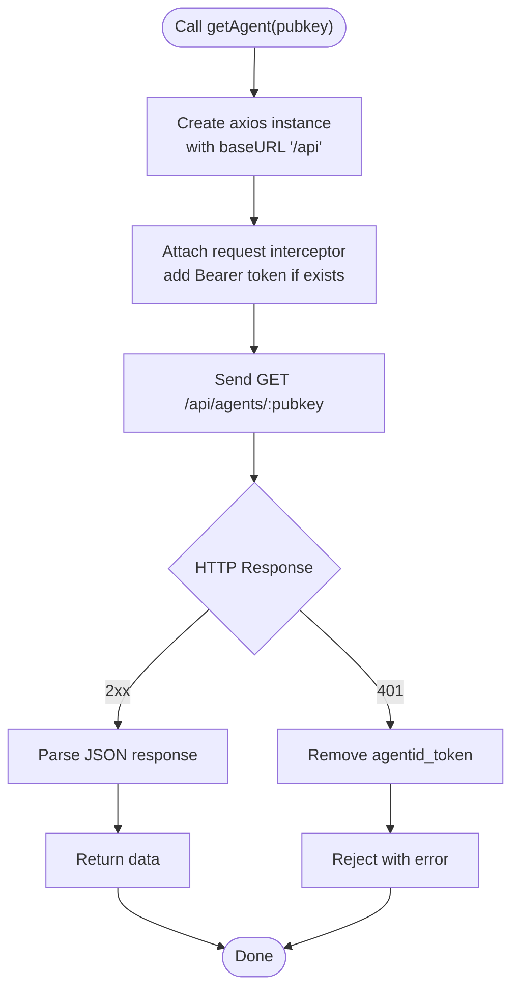
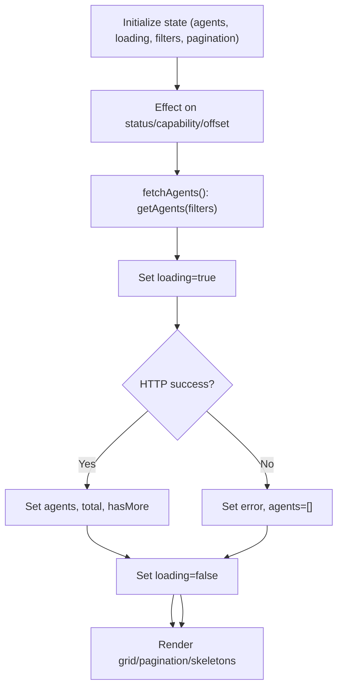
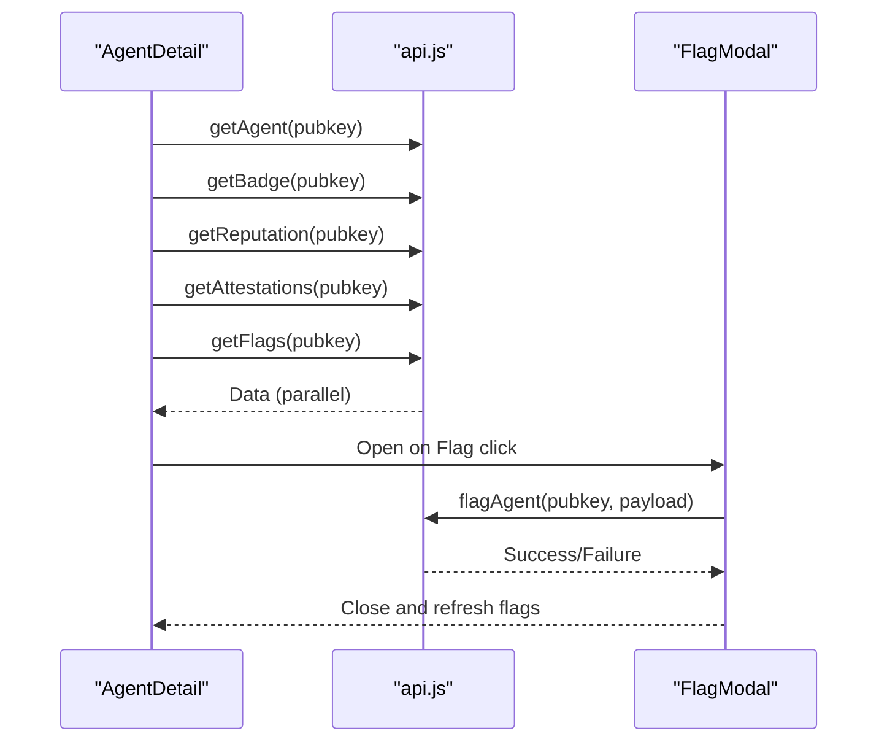
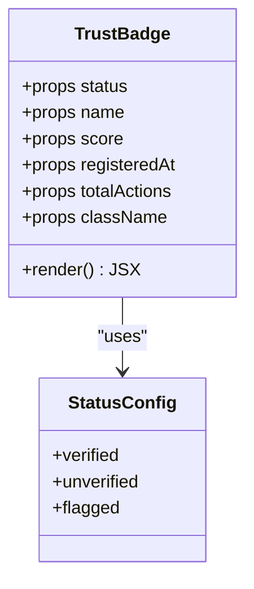
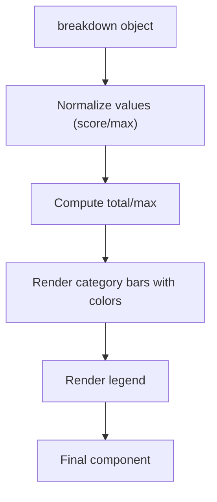
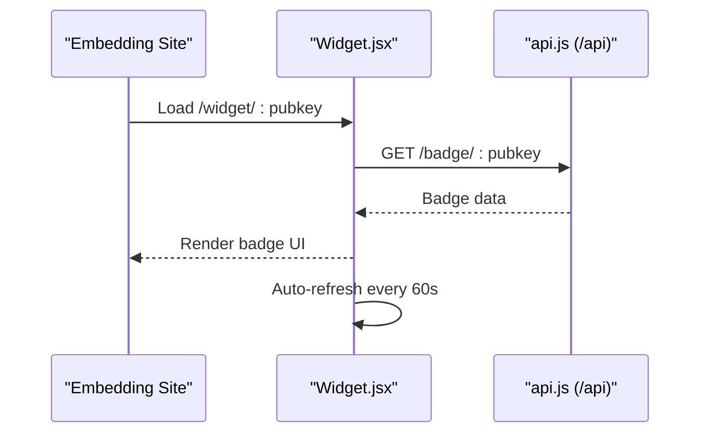
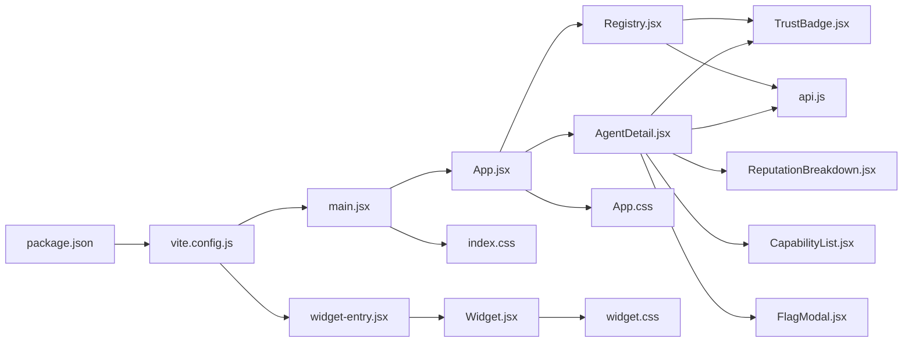

# Application Architecture

<cite>
**Referenced Files in This Document**
- [main.jsx](file://frontend/src/main.jsx)
- [App.jsx](file://frontend/src/App.jsx)
- [vite.config.js](file://frontend/vite.config.js)
- [package.json](file://frontend/package.json)
- [api.js](file://frontend/src/lib/api.js)
- [index.css](file://frontend/src/index.css)
- [App.css](file://frontend/src/App.css)
- [Registry.jsx](file://frontend/src/pages/Registry.jsx)
- [AgentDetail.jsx](file://frontend/src/pages/AgentDetail.jsx)
- [TrustBadge.jsx](file://frontend/src/components/TrustBadge.jsx)
- [ReputationBreakdown.jsx](file://frontend/src/components/ReputationBreakdown.jsx)
- [CapabilityList.jsx](file://frontend/src/components/CapabilityList.jsx)
- [FlagModal.jsx](file://frontend/src/components/FlagModal.jsx)
- [widget-entry.jsx](file://frontend/src/widget/widget-entry.jsx)
- [Widget.jsx](file://frontend/src/widget/Widget.jsx)
- [widget.css](file://frontend/src/widget/widget.css)
</cite>

## Table of Contents
1. [Introduction](#introduction)
2. [Project Structure](#project-structure)
3. [Core Components](#core-components)
4. [Architecture Overview](#architecture-overview)
5. [Detailed Component Analysis](#detailed-component-analysis)
6. [Dependency Analysis](#dependency-analysis)
7. [Performance Considerations](#performance-considerations)
8. [Troubleshooting Guide](#troubleshooting-guide)
9. [Conclusion](#conclusion)
10. [Appendices](#appendices)

## Introduction
This document describes the AgentID frontend application architecture with a focus on React component structure, routing configuration, and the Vite build system. It explains the overall application layout with navigation and routing using React Router, the component hierarchy, and the CSS architecture leveraging TailwindCSS variables and custom styling. It also documents component composition patterns, state management strategies, and integration with the backend API through the shared api.js library. Finally, it covers responsive design, glass morphism effects, theme implementation, and practical examples of imports, routing patterns, and build optimization techniques.

## Project Structure
The frontend is organized around a React application bootstrapped with Vite. The main entry renders the root App component, which sets up routing and defines the global layout with navigation and footer. Pages and components are grouped under dedicated folders, and a separate widget bundle is built for embedding trust badges in third-party sites.

```mermaid
graph TB
subgraph "Entry"
MAIN["src/main.jsx"]
WENTRY["src/widget/widget-entry.jsx"]
end
subgraph "App Shell"
APP["src/App.jsx"]
NAV["Navigation (App.jsx)"]
FOOTER["Footer (App.jsx)"]
end
subgraph "Pages"
REG["src/pages/Registry.jsx"]
DETAIL["src/pages/AgentDetail.jsx"]
end
subgraph "Components"
BADGE["src/components/TrustBadge.jsx"]
REP["src/components/ReputationBreakdown.jsx"]
CAP["src/components/CapabilityList.jsx"]
FLAG["src/components/FlagModal.jsx"]
end
subgraph "API"
API["src/lib/api.js"]
end
subgraph "Styles"
ICSS["src/index.css"]
ACSS["src/App.css"]
WCSS["src/widget/widget.css"]
end
subgraph "Build"
VCFG["vite.config.js"]
PKG["package.json"]
end
MAIN --> APP
WENTRY --> Widget["src/widget/Widget.jsx"]
APP --> NAV
APP --> FOOTER
APP --> REG
APP --> DETAIL
REG --> BADGE
DETAIL --> BADGE
DETAIL --> REP
DETAIL --> CAP
DETAIL --> FLAG
REG --> API
DETAIL --> API
BADGE --> API
ICSS --> APP
ACSS --> APP
WCSS --> Widget
VCFG --> MAIN
VCFG --> WENTRY
PKG --> VCFG
```

**Diagram sources**
- [main.jsx:1-11](file://frontend/src/main.jsx#L1-L11)
- [App.jsx:128-148](file://frontend/src/App.jsx#L128-L148)
- [Registry.jsx:1-276](file://frontend/src/pages/Registry.jsx#L1-L276)
- [AgentDetail.jsx:167-501](file://frontend/src/pages/AgentDetail.jsx#L167-L501)
- [TrustBadge.jsx:42-145](file://frontend/src/components/TrustBadge.jsx#L42-L145)
- [ReputationBreakdown.jsx:46-165](file://frontend/src/components/ReputationBreakdown.jsx#L46-L165)
- [CapabilityList.jsx:69-111](file://frontend/src/components/CapabilityList.jsx#L69-L111)
- [FlagModal.jsx](file://frontend/src/components/FlagModal.jsx)
- [api.js:1-140](file://frontend/src/lib/api.js#L1-L140)
- [index.css:1-163](file://frontend/src/index.css#L1-L163)
- [App.css:1-185](file://frontend/src/App.css#L1-L185)
- [widget-entry.jsx:1-11](file://frontend/src/widget/widget-entry.jsx#L1-L11)
- [Widget.jsx:61-218](file://frontend/src/widget/Widget.jsx#L61-L218)
- [widget.css:1-70](file://frontend/src/widget/widget.css#L1-L70)
- [vite.config.js:1-42](file://frontend/vite.config.js#L1-L42)
- [package.json:1-33](file://frontend/package.json#L1-L33)

**Section sources**
- [main.jsx:1-11](file://frontend/src/main.jsx#L1-L11)
- [App.jsx:128-148](file://frontend/src/App.jsx#L128-L148)
- [vite.config.js:1-42](file://frontend/vite.config.js#L1-L42)
- [package.json:1-33](file://frontend/package.json#L1-L33)

## Core Components
- App shell and routing: The App component wraps the entire application with BrowserRouter, defines the global navigation and footer, and mounts route-specific pages.
- Pages:
  - Registry: Lists agents with filtering, pagination, and skeleton loaders.
  - AgentDetail: Shows detailed agent information, reputation breakdown, capabilities, and action history.
- Shared components:
  - TrustBadge: Renders agent status with glass morphism and glow effects.
  - ReputationBreakdown: Visualizes a multi-factor reputation score.
  - CapabilityList: Displays agent capabilities with categorized styling and icons.
  - FlagModal: Provides a modal for reporting agents.
- API client: Centralized axios instance with interceptors for auth and error handling.
- Widget: Standalone React widget for embedding trust badges in iframes.

Key implementation patterns:
- Composition: Pages compose smaller components (TrustBadge, ReputationBreakdown, CapabilityList).
- State management: Pages use React hooks (useState, useEffect, useCallback) for local state and data fetching.
- Theming and styling: Tailwind utilities combined with CSS variables for consistent dark theme, glass morphism, and gradients.

**Section sources**
- [App.jsx:128-148](file://frontend/src/App.jsx#L128-L148)
- [Registry.jsx:51-276](file://frontend/src/pages/Registry.jsx#L51-L276)
- [AgentDetail.jsx:167-501](file://frontend/src/pages/AgentDetail.jsx#L167-L501)
- [TrustBadge.jsx:42-145](file://frontend/src/components/TrustBadge.jsx#L42-L145)
- [ReputationBreakdown.jsx:46-165](file://frontend/src/components/ReputationBreakdown.jsx#L46-L165)
- [CapabilityList.jsx:69-111](file://frontend/src/components/CapabilityList.jsx#L69-L111)
- [FlagModal.jsx](file://frontend/src/components/FlagModal.jsx)
- [api.js:1-140](file://frontend/src/lib/api.js#L1-L140)
- [widget-entry.jsx:1-11](file://frontend/src/widget/widget-entry.jsx#L1-L11)
- [Widget.jsx:61-218](file://frontend/src/widget/Widget.jsx#L61-L218)

## Architecture Overview
The frontend follows a layered architecture:
- Entry layer: Initializes React roots for both the main app and the widget.
- Routing layer: React Router v6 manages routes and navigational UI.
- Presentation layer: Pages and components render UI with TailwindCSS and CSS variables.
- Data access layer: A shared API module encapsulates HTTP requests and interceptors.
- Build layer: Vite orchestrates development server, proxying, and multi-page builds.



**Diagram sources**
- [main.jsx:1-11](file://frontend/src/main.jsx#L1-L11)
- [widget-entry.jsx:1-11](file://frontend/src/widget/widget-entry.jsx#L1-L11)
- [App.jsx:128-148](file://frontend/src/App.jsx#L128-L148)
- [Registry.jsx:51-276](file://frontend/src/pages/Registry.jsx#L51-L276)
- [AgentDetail.jsx:167-501](file://frontend/src/pages/AgentDetail.jsx#L167-L501)
- [TrustBadge.jsx:42-145](file://frontend/src/components/TrustBadge.jsx#L42-L145)
- [ReputationBreakdown.jsx:46-165](file://frontend/src/components/ReputationBreakdown.jsx#L46-L165)
- [CapabilityList.jsx:69-111](file://frontend/src/components/CapabilityList.jsx#L69-L111)
- [FlagModal.jsx](file://frontend/src/components/FlagModal.jsx)
- [api.js:1-140](file://frontend/src/lib/api.js#L1-L140)
- [index.css:1-163](file://frontend/src/index.css#L1-L163)
- [App.css:1-185](file://frontend/src/App.css#L1-L185)
- [widget.css:1-70](file://frontend/src/widget/widget.css#L1-L70)
- [vite.config.js:1-42](file://frontend/vite.config.js#L1-L42)
- [package.json:1-33](file://frontend/package.json#L1-L33)

## Detailed Component Analysis

### Routing and Navigation
- Router setup: BrowserRouter wraps the app; Routes define path-to-component mappings.
- Navigation: A custom Navigation component provides desktop and mobile menus, active-link highlighting, and a logo area.
- Footer: A reusable footer with links and branding.



**Diagram sources**
- [App.jsx:128-144](file://frontend/src/App.jsx#L128-L144)
- [Registry.jsx:51-276](file://frontend/src/pages/Registry.jsx#L51-L276)
- [AgentDetail.jsx:167-501](file://frontend/src/pages/AgentDetail.jsx#L167-L501)

**Section sources**
- [App.jsx:8-126](file://frontend/src/App.jsx#L8-L126)
- [App.jsx:128-148](file://frontend/src/App.jsx#L128-L148)

### API Integration Pattern
- Centralized axios instance with base URL pointing to /api.
- Request interceptor adds Authorization header if present.
- Response interceptor handles 401 globally by removing token.
- Named exports for each endpoint used by pages and components.



**Diagram sources**
- [api.js:3-33](file://frontend/src/lib/api.js#L3-L33)
- [api.js:47-50](file://frontend/src/lib/api.js#L47-L50)

**Section sources**
- [api.js:1-140](file://frontend/src/lib/api.js#L1-L140)

### Registry Page Composition
- State: Tracks agents, loading, error, filters (status, capability), pagination (offset, total, hasMore).
- Fetching: Uses useCallback to memoize fetchAgents; resets offset on filter change.
- Rendering: Skeletons during loading, empty state, grid of TrustBadge cards, pagination controls.



**Diagram sources**
- [Registry.jsx:51-84](file://frontend/src/pages/Registry.jsx#L51-L84)
- [Registry.jsx:61-80](file://frontend/src/pages/Registry.jsx#L61-L80)
- [Registry.jsx:202-276](file://frontend/src/pages/Registry.jsx#L202-L276)

**Section sources**
- [Registry.jsx:51-276](file://frontend/src/pages/Registry.jsx#L51-L276)

### Agent Detail Page Composition
- Parallel data fetching: Uses Promise.all to load agent, badge, reputation, attestations, flags.
- State: Manages loading, error, agent, badge, reputation, attestations, flags, and flag modal state.
- Rendering: PageSkeleton while loading, error state, hero with TrustBadge, reputation breakdown, details grid, capabilities, and activity history.
- Interaction: Copy pubkey, back navigation, flag submission via modal.



**Diagram sources**
- [AgentDetail.jsx:167-212](file://frontend/src/pages/AgentDetail.jsx#L167-L212)
- [AgentDetail.jsx:214-230](file://frontend/src/pages/AgentDetail.jsx#L214-L230)
- [api.js:91-94](file://frontend/src/lib/api.js#L91-L94)

**Section sources**
- [AgentDetail.jsx:167-501](file://frontend/src/pages/AgentDetail.jsx#L167-L501)

### TrustBadge Component
- Props: status, name, score, registeredAt, totalActions, className.
- Config-driven rendering: statusConfig maps status to icon, label, colors, and glow classes.
- Formatting: Date formatting and truncation helpers.
- Visuals: Glass morphism background, gradient overlays, and subtle animations.



**Diagram sources**
- [TrustBadge.jsx:42-145](file://frontend/src/components/TrustBadge.jsx#L42-L145)

**Section sources**
- [TrustBadge.jsx:42-145](file://frontend/src/components/TrustBadge.jsx#L42-L145)

### ReputationBreakdown Component
- Props: breakdown object with numeric or structured values.
- Categories: Fee Activity, Success Rate, Registration Age, SAID Trust, Community.
- Rendering: Total score, per-category bars with color-coded glows, legend.



**Diagram sources**
- [ReputationBreakdown.jsx:46-144](file://frontend/src/components/ReputationBreakdown.jsx#L46-L144)

**Section sources**
- [ReputationBreakdown.jsx:46-165](file://frontend/src/components/ReputationBreakdown.jsx#L46-L165)

### CapabilityList Component
- Props: capabilities array and optional label visibility.
- Styling: Prefix-based categorization and icons for common capability patterns.
- Rendering: Flex-wrap tag list with hover scaling and shadows.

**Section sources**
- [CapabilityList.jsx:69-111](file://frontend/src/components/CapabilityList.jsx#L69-L111)

### Widget Bundle
- Standalone entry: widget-entry.jsx creates a root for the widget bundle.
- Widget component: Fetches badge data from /api/badge/:pubkey, auto-refreshes, and renders a compact badge.
- Styling: Minimal dark theme tailored for iframes.



**Diagram sources**
- [widget-entry.jsx:1-11](file://frontend/src/widget/widget-entry.jsx#L1-L11)
- [Widget.jsx:61-102](file://frontend/src/widget/Widget.jsx#L61-L102)
- [Widget.jsx:82-94](file://frontend/src/widget/Widget.jsx#L82-L94)

**Section sources**
- [widget-entry.jsx:1-11](file://frontend/src/widget/widget-entry.jsx#L1-L11)
- [Widget.jsx:61-218](file://frontend/src/widget/Widget.jsx#L61-L218)
- [widget.css:1-70](file://frontend/src/widget/widget.css#L1-L70)

## Dependency Analysis
- Runtime dependencies: React, React DOM, React Router DOM, Axios, Prop Types.
- Build dependencies: Vite, @vitejs/plugin-react, TailwindCSS, @tailwindcss/vite.
- Internal dependencies:
  - main.jsx depends on App.jsx and index.css.
  - App.jsx depends on pages and components.
  - Pages depend on components and api.js.
  - Widget depends on its own entry and css.



**Diagram sources**
- [package.json:12-31](file://frontend/package.json#L12-L31)
- [main.jsx:1-11](file://frontend/src/main.jsx#L1-L11)
- [App.jsx:128-148](file://frontend/src/App.jsx#L128-L148)
- [Registry.jsx:1-276](file://frontend/src/pages/Registry.jsx#L1-L276)
- [AgentDetail.jsx:1-501](file://frontend/src/pages/AgentDetail.jsx#L1-L501)
- [TrustBadge.jsx:1-145](file://frontend/src/components/TrustBadge.jsx#L1-L145)
- [ReputationBreakdown.jsx:1-165](file://frontend/src/components/ReputationBreakdown.jsx#L1-L165)
- [CapabilityList.jsx:1-111](file://frontend/src/components/CapabilityList.jsx#L1-L111)
- [FlagModal.jsx](file://frontend/src/components/FlagModal.jsx)
- [api.js:1-140](file://frontend/src/lib/api.js#L1-L140)
- [index.css:1-163](file://frontend/src/index.css#L1-L163)
- [App.css:1-185](file://frontend/src/App.css#L1-L185)
- [widget-entry.jsx:1-11](file://frontend/src/widget/widget-entry.jsx#L1-L11)
- [Widget.jsx:1-218](file://frontend/src/widget/Widget.jsx#L1-L218)
- [widget.css:1-70](file://frontend/src/widget/widget.css#L1-L70)
- [vite.config.js:1-42](file://frontend/vite.config.js#L1-L42)

**Section sources**
- [package.json:12-31](file://frontend/package.json#L12-L31)
- [vite.config.js:1-42](file://frontend/vite.config.js#L1-L42)

## Performance Considerations
- Lazy loading and code splitting: Consider lazy-loading pages to reduce initial bundle size.
- Memoization: The Registry page uses useCallback for data fetching to avoid unnecessary re-renders.
- Efficient rendering: Skeleton loaders and conditional rendering minimize layout shifts.
- Asset optimization: Vite’s default bundling and Tailwind purging (via TailwindCSS plugin) help optimize CSS delivery.
- Widget performance: The widget uses a minimal axios instance and auto-refresh cadence to balance freshness and overhead.

[No sources needed since this section provides general guidance]

## Troubleshooting Guide
Common issues and resolutions:
- API errors:
  - 401 Unauthorized: The API client removes the stored token automatically; ensure proper login flow.
  - Network failures: Implement retry logic or user-triggered reloads in pages.
- Widget not loading:
  - Verify the URL pattern /widget/:pubkey and that the API base URL is correctly configured.
  - Check browser console for CORS or network errors.
- Styling inconsistencies:
  - Ensure TailwindCSS and @tailwindcss/vite are installed and configured in Vite.
  - Confirm CSS variables in index.css and widget.css are applied consistently.

**Section sources**
- [api.js:24-33](file://frontend/src/lib/api.js#L24-L33)
- [Widget.jsx:7-14](file://frontend/src/widget/Widget.jsx#L7-L14)
- [vite.config.js:31-40](file://frontend/vite.config.js#L31-L40)
- [index.css:3-42](file://frontend/src/index.css#L3-L42)
- [widget.css:3-25](file://frontend/src/widget/widget.css#L3-L25)

## Conclusion
The AgentID frontend is a modular React application with clear separation of concerns. Routing is centralized in App.jsx, pages orchestrate data fetching and rendering, and shared components encapsulate UI patterns. The API client provides a unified interface to the backend, while Vite streamlines development and build processes. TailwindCSS with CSS variables enables a cohesive dark theme, glass morphism effects, and responsive layouts. The widget bundle demonstrates a self-contained integration strategy suitable for embedding.

[No sources needed since this section summarizes without analyzing specific files]

## Appendices

### Build System and Development Server
- Plugins: React and TailwindCSS Vite plugins.
- Multi-page build: Inputs for main app and widget HTML.
- Proxy: API requests under /api are proxied to the backend server.
- Dev server: Port configurable; middleware rewrites widget paths for development.

**Section sources**
- [vite.config.js:1-42](file://frontend/vite.config.js#L1-L42)
- [package.json:6-11](file://frontend/package.json#L6-L11)

### Theme and Responsive Design
- CSS variables define a deep navy/slate dark theme with accent colors and glows.
- Glass morphism: Utility classes apply backdrop blur, borders, and translucent backgrounds.
- Animations: Fade-in and pulse-glow utilities enhance UX transitions.
- Responsive breakpoints: Tailwind utilities drive responsive grids and typography.

**Section sources**
- [index.css:3-42](file://frontend/src/index.css#L3-L42)
- [index.css:129-163](file://frontend/src/index.css#L129-L163)
- [Registry.jsx:105-114](file://frontend/src/pages/Registry.jsx#L105-L114)
- [AgentDetail.jsx:291-304](file://frontend/src/pages/AgentDetail.jsx#L291-L304)

### Component Import Examples
- App.jsx imports pages and registers routes.
- Registry.jsx imports TrustBadge and API functions.
- AgentDetail.jsx imports TrustBadge, ReputationBreakdown, CapabilityList, FlagModal, and API functions.

**Section sources**
- [App.jsx:1-10](file://frontend/src/App.jsx#L1-L10)
- [Registry.jsx:1-5](file://frontend/src/pages/Registry.jsx#L1-L5)
- [AgentDetail.jsx:1-8](file://frontend/src/pages/AgentDetail.jsx#L1-L8)

### Routing Patterns
- Root route: "/" renders Registry.
- Dynamic route: "/agents/:pubkey" renders AgentDetail.
- Additional routes: "/register", "/discover".

**Section sources**
- [App.jsx:134-139](file://frontend/src/App.jsx#L134-L139)

### API Endpoint Coverage
- Agent registry: getAgents, getAgent.
- Trust badge: getBadge.
- Reputation: getReputation.
- Registration: registerAgent.
- PKI challenge-response: issueChallenge, verifyChallenge.
- Attestations: attestAgent, getAttestations.
- Flags: flagAgent, getFlags.
- Discovery: discoverAgents.
- Widget: getWidgetHtml, getBadgeSvg.
- Updates: updateAgent.
- History: getAttestations, getFlags.

**Section sources**
- [api.js:35-139](file://frontend/src/lib/api.js#L35-L139)