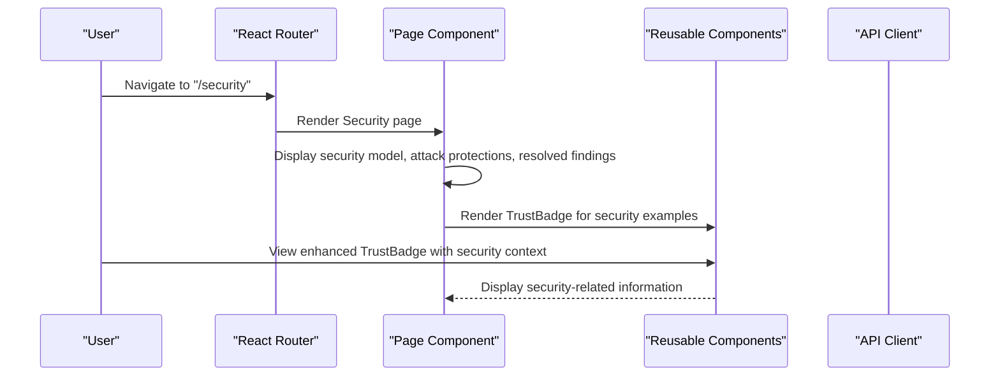
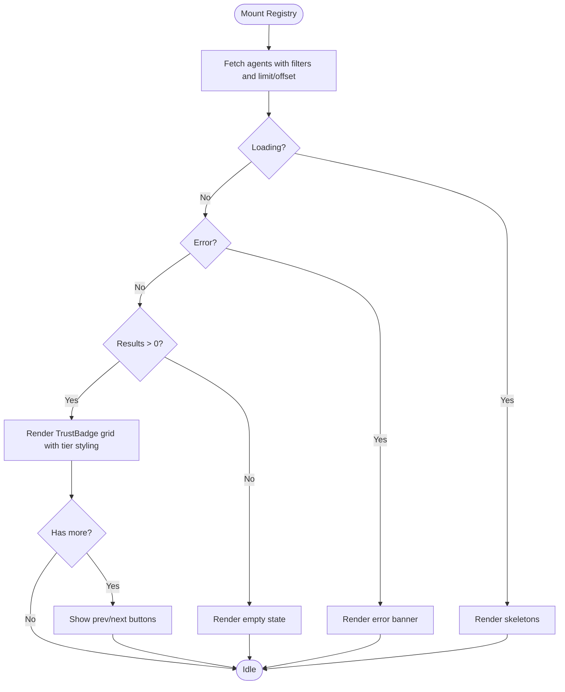
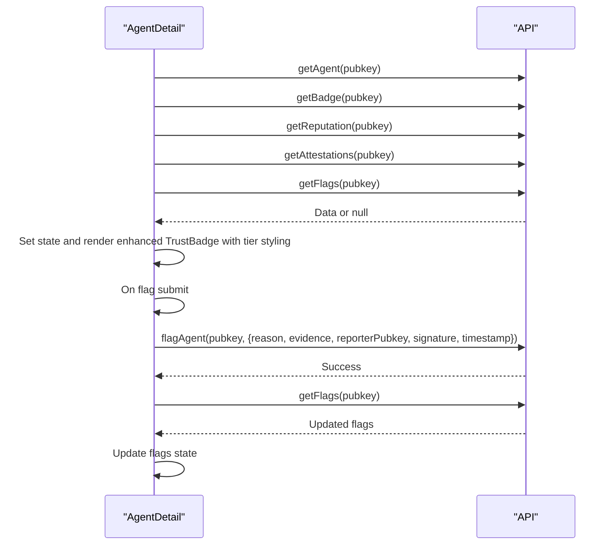
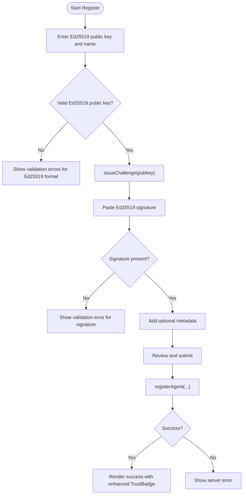
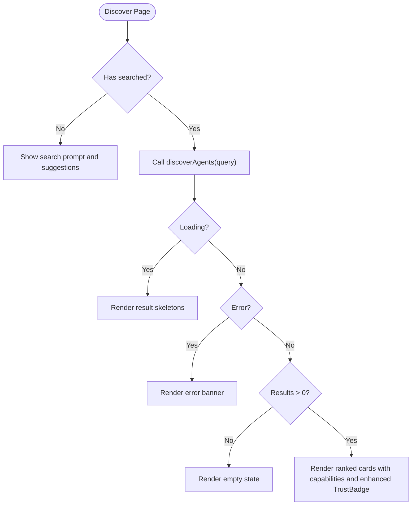
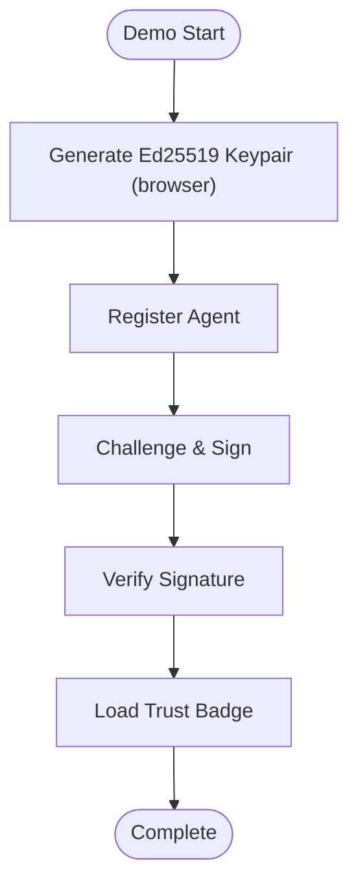
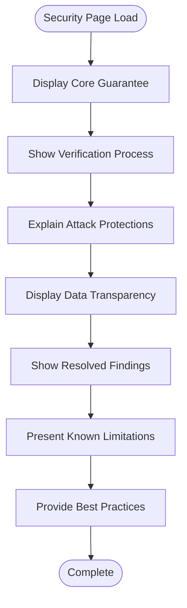
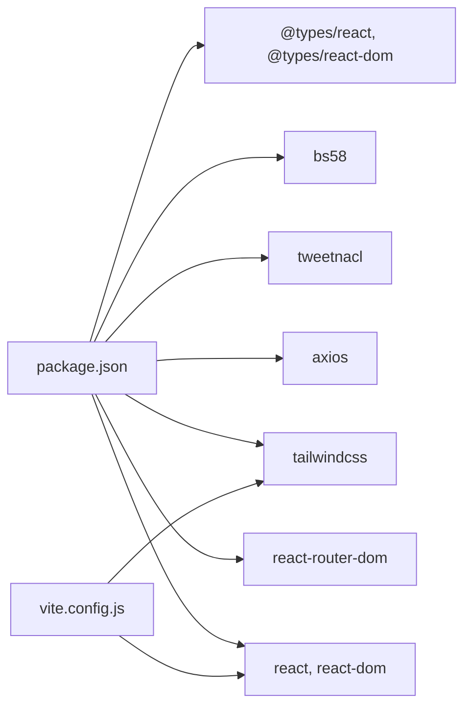

# Frontend Application

<cite>
**Referenced Files in This Document**
- [App.jsx](file://frontend/src/App.jsx)
- [main.jsx](file://frontend/src/main.jsx)
- [api.js](file://frontend/src/lib/api.js)
- [Registry.jsx](file://frontend/src/pages/Registry.jsx)
- [AgentDetail.jsx](file://frontend/src/pages/AgentDetail.jsx)
- [Register.jsx](file://frontend/src/pages/Register.jsx)
- [Discover.jsx](file://frontend/src/pages/Discover.jsx)
- [Demo.jsx](file://frontend/src/pages/Demo.jsx)
- [Security.jsx](file://frontend/src/pages/Security.jsx)
- [TrustBadge.jsx](file://frontend/src/components/TrustBadge.jsx)
- [ReputationBreakdown.jsx](file://frontend/src/components/ReputationBreakdown.jsx)
- [CapabilityList.jsx](file://frontend/src/components/CapabilityList.jsx)
- [FlagModal.jsx](file://frontend/src/components/FlagModal.jsx)
- [index.css](file://frontend/src/index.css)
- [package.json](file://frontend/package.json)
- [vite.config.js](file://frontend/vite.config.js)
- [index.html](file://frontend/index.html)
</cite>

## Update Summary
**Changes Made**
- Updated terminology throughout the application from "Solana wallet address" to "Ed25519 public key" for cryptographic identity verification
- Enhanced frontend with comprehensive Security page featuring detailed cryptographic security model, attack protections, and best practices
- Improved registration process with better Ed25519 key validation and clearer instructions
- Enhanced flagging process with cryptographic authentication using Ed25519 signatures
- Added tiered trust badge system with premium verified agents featuring gold-themed styling and shimmer animations
- Integrated Security page into navigation system with proper active state highlighting

## Table of Contents
1. [Introduction](#introduction)
2. [Project Structure](#project-structure)
3. [Core Components](#core-components)
4. [Architecture Overview](#architecture-overview)
5. [Detailed Component Analysis](#detailed-component-analysis)
6. [Dependency Analysis](#dependency-analysis)
7. [Performance Considerations](#performance-considerations)
8. [Troubleshooting Guide](#troubleshooting-guide)
9. [Conclusion](#conclusion)
10. [Appendices](#appendices)

## Introduction
This document describes the AgentID frontend React application, focusing on the user interface and component architecture. It explains the routing configuration, state management approach, and styling strategy using TailwindCSS. It documents the key pages (Registry, AgentDetail, Register, Discover, Demo, Security), reusable components (TrustBadge, ReputationBreakdown, CapabilityList, FlagModal), and integration patterns with the backend API. It also covers user workflows, form handling, error states, and responsive design considerations. **The application now features a comprehensive Security page that provides detailed information about AgentID's cryptographic security model, attack protections, and best practices for agent operators, with corrected terminology emphasizing Ed25519 public key cryptography throughout.**

## Project Structure
The frontend is a Vite-powered React application with:
- Pages under src/pages for route handlers including the new Security page
- Reusable components under src/components
- Shared API client under src/lib/api.js
- Global styles under src/index.css
- Routing and navigation in src/App.jsx with Security page integration
- Application entry in src/main.jsx
- Build and development configuration in vite.config.js

```mermaid
graph TB
subgraph "Entry"
MAIN["main.jsx"]
APP["App.jsx"]
INDEX["index.html"]
END
subgraph "Routing"
ROUTES["React Router Routes"]
NAV["Navigation"]
SECURITY["Security Route"]
END
subgraph "Pages"
REG["Registry.jsx"]
DETAIL["AgentDetail.jsx"]
REGISTER["Register.jsx"]
DISCOVER["Discover.jsx"]
DEMO["Demo.jsx"]
SECURITY_PAGE["Security.jsx"]
END
subgraph "Components"
BADGE["TrustBadge.jsx"]
REP["ReputationBreakdown.jsx"]
CAPS["CapabilityList.jsx"]
FLAG["FlagModal.jsx"]
END
subgraph "API"
API["api.js"]
END
MAIN --> APP
APP --> ROUTES
ROUTES --> REG
ROUTES --> DETAIL
ROUTES --> REGISTER
ROUTES --> DISCOVER
ROUTES --> DEMO
ROUTES --> SECURITY
SECURITY --> SECURITY_PAGE
DETAIL --> BADGE
DETAIL --> REP
DETAIL --> CAPS
DETAIL --> FLAG
REG --> BADGE
DISCOVER --> BADGE
DISCOVER --> CAPS
REGISTER --> BADGE
DEMO --> BADGE
SECURITY_PAGE --> BADGE
REG --> API
DETAIL --> API
REGISTER --> API
DISCOVER --> API
DEMO --> API
SECURITY_PAGE --> API
NAV --> SECURITY
```

**Diagram sources**
- [main.jsx:1-11](file://frontend/src/main.jsx#L1-L11)
- [App.jsx:87-193](file://frontend/src/App.jsx#L87-L193)
- [Registry.jsx:1-276](file://frontend/src/pages/Registry.jsx#L1-L276)
- [AgentDetail.jsx:1-504](file://frontend/src/pages/AgentDetail.jsx#L1-L504)
- [Register.jsx:1-673](file://frontend/src/pages/Register.jsx#L1-L673)
- [Discover.jsx:1-421](file://frontend/src/pages/Discover.jsx#L1-L421)
- [Demo.jsx:1-780](file://frontend/src/pages/Demo.jsx#L1-L780)
- [Security.jsx:1-779](file://frontend/src/pages/Security.jsx#L1-L779)
- [TrustBadge.jsx:1-196](file://frontend/src/components/TrustBadge.jsx#L1-L196)
- [ReputationBreakdown.jsx:1-165](file://frontend/src/components/ReputationBreakdown.jsx#L1-L165)
- [CapabilityList.jsx:1-111](file://frontend/src/components/CapabilityList.jsx#L1-L111)
- [FlagModal.jsx:1-258](file://frontend/src/components/FlagModal.jsx#L1-L258)
- [api.js:1-141](file://frontend/src/lib/api.js#L1-L141)
- [index.html:1-14](file://frontend/index.html#L1-L14)

**Section sources**
- [main.jsx:1-11](file://frontend/src/main.jsx#L1-L11)
- [App.jsx:87-193](file://frontend/src/App.jsx#L87-L193)
- [package.json:1-35](file://frontend/package.json#L1-L35)
- [vite.config.js:1-42](file://frontend/vite.config.js#L1-L42)
- [index.html:1-14](file://frontend/index.html#L1-L14)

## Core Components
- Navigation and Footer: Provide global site layout and links with enhanced Security page integration. **Updated** Navigation now includes Security route in both desktop and mobile menus with proper active state highlighting.
- Pages:
  - Registry: Browse agents with filters, pagination, and loading/error states.
  - AgentDetail: View agent profile, reputation, capabilities, flags/attestations, and flag submission with cryptographic authentication.
  - Register: Multi-step agent onboarding with challenge-response and metadata collection using Ed25519 public keys.
  - Discover: Capability-based agent discovery with suggestions and ranking.
  - Demo: Interactive demonstration of the complete verification workflow with step-by-step guidance.
  - **New** Security: Comprehensive security and trust page explaining AgentID's cryptographic security model, attack protections, resolved findings, and best practices for agent operators.
- Reusable Components:
  - TrustBadge: Enhanced with verified tier styling, shimmer animations, and gold-themed visual indicators for premium verified agents.
  - ReputationBreakdown: Five-factor reputation scoring visualization.
  - CapabilityList: Capability tags with categorization and icons.
  - FlagModal: Enhanced controlled modal for reporting agents with Ed25519 signature requirements and cryptographic authentication.

**Updated** Added comprehensive Security page that provides detailed information about AgentID's cryptographic security model, attack protections, and best practices. Navigation now includes Security route with proper active state highlighting in both desktop and mobile views. All terminology has been corrected to use "Ed25519 public key" instead of "Solana wallet address".

**Section sources**
- [App.jsx:7-193](file://frontend/src/App.jsx#L7-L193)
- [Registry.jsx:51-276](file://frontend/src/pages/Registry.jsx#L51-L276)
- [AgentDetail.jsx:167-504](file://frontend/src/pages/AgentDetail.jsx#L167-L504)
- [Register.jsx:241-673](file://frontend/src/pages/Register.jsx#L241-L673)
- [Discover.jsx:94-421](file://frontend/src/pages/Discover.jsx#L94-L421)
- [Demo.jsx:121-780](file://frontend/src/pages/Demo.jsx#L121-L780)
- [Security.jsx:121-779](file://frontend/src/pages/Security.jsx#L121-L779)
- [TrustBadge.jsx:42-196](file://frontend/src/components/TrustBadge.jsx#L42-L196)
- [ReputationBreakdown.jsx:46-165](file://frontend/src/components/ReputationBreakdown.jsx#L46-L165)
- [CapabilityList.jsx:69-111](file://frontend/src/components/CapabilityList.jsx#L69-L111)
- [FlagModal.jsx:4-258](file://frontend/src/components/FlagModal.jsx#L4-L258)

## Architecture Overview
The app uses React Router for client-side routing and a shared Axios-based API client for backend integration. Pages orchestrate state and render reusable components. Styling relies on TailwindCSS with a custom dark theme and glass morphism effects. **The new Security page provides comprehensive security transparency, explaining cryptographic implementations, attack protections, and best practices for agent operators using corrected Ed25519 terminology throughout.**



**Diagram sources**
- [Security.jsx:121-779](file://frontend/src/pages/Security.jsx#L121-L779)
- [TrustBadge.jsx:42-196](file://frontend/src/components/TrustBadge.jsx#L42-L196)
- [api.js:1-141](file://frontend/src/lib/api.js#L1-L141)

**Section sources**
- [App.jsx:87-193](file://frontend/src/App.jsx#L87-L193)
- [api.js:1-141](file://frontend/src/lib/api.js#L1-L141)

## Detailed Component Analysis

### Routing and Navigation
- Routes:
  - "/" → Registry
  - "/agents/:pubkey" → AgentDetail
  - "/register" → Register
  - "/discover" → Discover
  - "/demo" → Demo
  - **"/security" → Security (new)**: Comprehensive security and trust page
- Navigation highlights active route and includes responsive mobile menu with Security route integration.
- **Updated** Security page is now accessible from both desktop and mobile navigation menus with proper active state highlighting.

**Updated** Added Security route with dedicated navigation elements and styling for comprehensive security transparency. Security page provides detailed information about cryptographic security model, attack protections, and best practices. All navigation elements now use "Ed25519 public key" terminology consistently.

**Section sources**
- [App.jsx:1-193](file://frontend/src/App.jsx#L1-L193)

### Registry Page
- State: agents, loading, error, filters (status, capability), pagination (offset, total, hasMore).
- Behavior:
  - Fetches paginated agent list with filters.
  - Resets offset when filters change.
  - Renders skeletons while loading, error state, empty state, and grid of TrustBadges with tier styling.
  - Pagination controls compute current and total pages.
- Backend integration: getAgents with status/capability/limit/offset.



**Diagram sources**
- [Registry.jsx:51-276](file://frontend/src/pages/Registry.jsx#L51-L276)
- [api.js:35-45](file://frontend/src/lib/api.js#L35-L45)
- [TrustBadge.jsx:42-196](file://frontend/src/components/TrustBadge.jsx#L42-L196)

**Section sources**
- [Registry.jsx:51-276](file://frontend/src/pages/Registry.jsx#L51-L276)
- [api.js:35-45](file://frontend/src/lib/api.js#L35-L45)
- [TrustBadge.jsx:42-196](file://frontend/src/components/TrustBadge.jsx#L42-L196)

### AgentDetail Page
- State: agent, badge, reputation, attestations, flags, loading/error, flag modal open, flag submitting.
- Behavior:
  - Parallel fetch of agent, badge, reputation, attestations, flags.
  - Renders hero with TrustBadge (enhanced with tier styling), reputation breakdown, details, action statistics, capabilities, description, and activity history.
  - Displays tier information alongside status badges for verified agents.
  - Flag submission opens FlagModal with cryptographic authentication, validates reason/evidence/signature, submits via API, refreshes flags.
  - Handles 404 and generic errors with dedicated UI.
- Backend integration: getAgent, getBadge, getReputation, getAttestations, getFlags, flagAgent.

**Updated** Enhanced TrustBadge rendering to display tier information for verified agents with gold-themed styling and shimmer animations. All agent detail pages now consistently use "Ed25519 public key" terminology.



**Diagram sources**
- [AgentDetail.jsx:167-504](file://frontend/src/pages/AgentDetail.jsx#L167-L504)
- [TrustBadge.jsx:42-196](file://frontend/src/components/TrustBadge.jsx#L42-L196)
- [api.js:91-95](file://frontend/src/lib/api.js#L91-L95)

**Section sources**
- [AgentDetail.jsx:167-504](file://frontend/src/pages/AgentDetail.jsx#L167-L504)
- [TrustBadge.jsx:42-196](file://frontend/src/components/TrustBadge.jsx#L42-L196)
- [api.js:91-95](file://frontend/src/lib/api.js#L91-L95)

### Register Page
- State: currentStep, formData, errors, serverError, submitting, registeredAgent.
- Workflow:
  - Step 1: Collect pubkey and name; validates Ed25519 public key inputs.
  - Step 2: Fetch challenge via issueChallenge, user signs challenge, enters signature.
  - Step 3: Optional metadata (tokenMint, capabilities, creatorXHandle, creatorWallet, description).
  - Step 4: Review and submit registration via registerAgent.
- Backend integration: registerAgent, issueChallenge.

**Updated** Enhanced validation to specifically check for Ed25519 public key format and provide clear guidance on cryptographic key management. All registration forms now use "Ed25519 public key" terminology consistently.



**Diagram sources**
- [Register.jsx:241-673](file://frontend/src/pages/Register.jsx#L241-L673)
- [api.js:64-83](file://frontend/src/lib/api.js#L64-L83)
- [TrustBadge.jsx:42-196](file://frontend/src/components/TrustBadge.jsx#L42-L196)

**Section sources**
- [Register.jsx:241-673](file://frontend/src/pages/Register.jsx#L241-L673)
- [api.js:64-83](file://frontend/src/lib/api.js#L64-L83)
- [TrustBadge.jsx:42-196](file://frontend/src/components/TrustBadge.jsx#L42-L196)

### Discover Page
- State: searchQuery, results, loading, hasSearched, error.
- Behavior:
  - Suggests capability keywords; user can search or click suggestions.
  - Calls discoverAgents with capability; renders ranked results with TrustBadge-like visuals and capability tags.
  - Provides empty state and error handling.
- Backend integration: discoverAgents.



**Diagram sources**
- [Discover.jsx:94-421](file://frontend/src/pages/Discover.jsx#L94-L421)
- [api.js:96-105](file://frontend/src/lib/api.js#L96-L105)
- [TrustBadge.jsx:42-196](file://frontend/src/components/TrustBadge.jsx#L42-L196)

**Section sources**
- [Discover.jsx:94-421](file://frontend/src/pages/Discover.jsx#L94-L421)
- [api.js:96-105](file://frontend/src/lib/api.js#L96-L105)
- [TrustBadge.jsx:42-196](file://frontend/src/components/TrustBadge.jsx#L42-L196)

### Demo Page
- State: currentStep, keypair generation, agent registration, challenge-response verification, badge display.
- Workflow:
  - Step 1: Generate Ed25519 keypair in browser using tweetnacl.
  - Step 2: Register agent with metadata.
  - Step 3: Challenge-response verification with automatic signing.
  - Step 4: Display trust badge with embed options.
- Backend integration: registerAgent, issueChallenge, verifyChallenge, getBadge.



**Diagram sources**
- [Demo.jsx:121-780](file://frontend/src/pages/Demo.jsx#L121-L780)
- [api.js:64-83](file://frontend/src/lib/api.js#L64-L83)

**Section sources**
- [Demo.jsx:121-780](file://frontend/src/pages/Demo.jsx#L121-L780)
- [api.js:64-83](file://frontend/src/lib/api.js#L64-L83)

### Security Page
**New** Comprehensive security and trust page explaining AgentID's cryptographic security model:

- **Core Guarantee**: Three fundamental security guarantees - private keys never stored, nothing secret leaves server, and proof-based trust using Ed25519 signatures.
- **Verification Process**: Four-step cryptographic verification workflow with detailed explanations of challenge issuance, agent signing, verification, and nonce consumption.
- **Attack Protections**: Detailed coverage of replay attack prevention, time-based verification, rate limiting, and XSS prevention.
- **Data Transparency**: Complete data handling policy showing what is stored, what is temporary, and what is never collected.
- **Resolved Findings**: Documentation of security issues identified during audit and their resolutions.
- **Known Limitations**: Transparent disclosure of ongoing improvements and future roadmap items.
- **Best Practices**: Practical guidance for agent operators on secure key management and operational security.

**Updated** Security page provides comprehensive security transparency and educational content for users and operators. All security documentation now consistently uses "Ed25519 public key" terminology.



**Diagram sources**
- [Security.jsx:121-779](file://frontend/src/pages/Security.jsx#L121-L779)

**Section sources**
- [Security.jsx:121-779](file://frontend/src/pages/Security.jsx#L121-L779)

### Reusable Components

#### Enhanced TrustBadge
- Props: status, name, score, registeredAt, totalActions, tier, tierColor, className.
- **Enhanced** with verified tier styling:
  - Premium verified agents receive gold-themed styling with shimmer animations
  - Standard verified agents get blue-themed styling without shimmer
  - Verified tier badge displays ★ for premium verified agents
  - Enhanced visual hierarchy with gradient backgrounds and border styling
- Renders a visually distinct card per status with enhanced tier-based styling and gradient glow effects.
- Uses Tailwind utilities and CSS variables for theming with shimmer animation support.

**Updated** Added tier configuration system with verified tier styling, shimmer animations, and gold-themed visual indicators for premium verified agents. All TrustBadge instances now use "Ed25519 public key" terminology consistently.

**Section sources**
- [TrustBadge.jsx:42-196](file://frontend/src/components/TrustBadge.jsx#L42-L196)

#### ReputationBreakdown
- Props: breakdown (object with five factors).
- Computes total/max, maps to color-coded bars, and displays legend thresholds.
- Supports flexible input shapes (plain number or {score,max}).

**Section sources**
- [ReputationBreakdown.jsx:46-165](file://frontend/src/components/ReputationBreakdown.jsx#L46-L165)

#### CapabilityList
- Props: capabilities (array), showLabel (boolean).
- Renders capability tags with category-specific colors/icons; falls back to default style.

**Section sources**
- [CapabilityList.jsx:69-111](file://frontend/src/components/CapabilityList.jsx#L69-L111)

#### FlagModal
- Props: isOpen, onClose, onSubmit, agentPubkey.
- **Enhanced** with Ed25519 signature requirements and cryptographic authentication:
  - **New State Management**: Added reporterPubkey, signature, timestamp, and messageToSign state variables.
  - **Cryptographic Message Construction**: Generates standardized message format: `AGENTID-FLAG:{agentPubkey}:{reporterPubkey}:{timestamp}`.
  - **Ed25519 Signature Validation**: Requires base58-encoded Ed25519 signatures for authentication.
  - **Enhanced Form Fields**: Includes reporterPubkey input, dynamic message display, and signature textarea.
  - **Real-time Message Generation**: Automatically updates message when reporterPubkey or timestamp changes.
  - **Timestamp Management**: Updates timestamp when modal opens and includes it in authentication.
  - **Validation Improvements**: Validates signature presence and provides clear error messages for cryptographic requirements.
  - **Integration Flow**: Submits {reason, evidence, reporterPubkey, signature, timestamp} to onSubmit callback.

**Updated** Enhanced FlagModal to use "Ed25519 public key" terminology and improved cryptographic authentication flow. All flag submission processes now consistently reference Ed25519 signatures and public keys.

**Section sources**
- [FlagModal.jsx:4-258](file://frontend/src/components/FlagModal.jsx#L4-L258)

### API Integration Patterns
- Centralized client in api.js with:
  - Base URL /api and JSON headers.
  - Request interceptor adds Authorization Bearer token from localStorage.
  - Response interceptor handles 401 by removing token.
  - Exposed functions for agents, badges, reputation, registration, verification, attestations, discovery, widgets, updates, and histories.
  - **New Function**: flagAgent(pubkey, flagData) - posts flag data with cryptographic authentication.

**Section sources**
- [api.js:1-141](file://frontend/src/lib/api.js#L1-L141)

### Styling and Theming
- TailwindCSS configured via Vite plugin.
- Custom CSS variables define dark theme palette (backgrounds, text, accents, borders, shadows).
- **Enhanced** with shimmer animation support:
  - Shimmer animation for verified tier badges using @keyframes shimmer
  - Gold-themed visual indicators with yellow-400 and amber-500 gradients
  - Enhanced gradient text and status badge utilities
- Utilities:
  - Glass morphism (.glass) with backdrop blur.
  - Gradient text.
  - Status badges for verified/unverified/flagged.
  - Animations (fade-in, slide-in, pulse-glow, shimmer).
- Responsive design uses Tailwind's responsive prefixes and flex/grid layouts.

**Updated** Added shimmer animation support and gold-themed visual indicators for premium verified agents. All styling now consistently uses "Ed25519 public key" terminology in tooltips and help text.

**Section sources**
- [index.css:1-173](file://frontend/src/index.css#L1-L173)
- [vite.config.js:1-42](file://frontend/vite.config.js#L1-L42)

## Dependency Analysis
- Runtime dependencies: React, ReactDOM, React Router, Axios, Prop Types, tweetnacl, bs58.
- Dev dependencies: Vite, TailwindCSS, React plugin, ESLint, TypeScript types.
- Build pipeline:
  - Vite serves index.html and widget.html.
  - Proxy /api to backend server.
  - Widget middleware rewrites /widget/* to widget.html.



**Diagram sources**
- [package.json:12-35](file://frontend/package.json#L12-L35)
- [vite.config.js:1-42](file://frontend/vite.config.js#L1-L42)

**Section sources**
- [package.json:12-35](file://frontend/package.json#L12-L35)
- [vite.config.js:1-42](file://frontend/vite.config.js#L1-L42)

## Performance Considerations
- Parallel API fetching in AgentDetail reduces total load time.
- Pagination in Registry prevents large DOM rendering.
- Skeleton loaders improve perceived performance during network requests.
- Debounce or throttle search in Discover could reduce API calls (not currently implemented).
- Lazy loading images (if added) and virtualizing long lists would further optimize.
- **Enhanced** FlagModal performance: Real-time message generation and validation occur efficiently without blocking UI.
- **Enhanced** TrustBadge performance: Tier styling calculations are optimized with conditional rendering to minimize re-renders.
- **New** Security page performance: Comprehensive content is optimized with lazy loading and efficient rendering of security information.

## Troubleshooting Guide
- Authentication:
  - 401 responses automatically clear stored token; re-authenticate and retry.
- Network errors:
  - Check proxy configuration (/api to backend) and CORS settings.
- Form validation:
  - Register step 1 requires valid Ed25519 public key and name; step 2 requires signature.
  - **Enhanced** FlagModal validation: Requires reason, reporterPubkey, signature, and optional JSON evidence; signature must be base58-encoded Ed25519 signature.
- Error boundaries:
  - Pages render explicit error banners and empty states for graceful degradation.
- **New** Security Page Issues:
  - Ensure all SVG icons are properly rendered and styled.
  - Verify responsive design works correctly across all screen sizes.
  - Check that security data displays properly without performance issues.
- **New** Cryptographic Authentication Issues:
  - Ensure reporterPubkey follows Ed25519 public key format (base58-encoded).
  - Verify signature is generated using Ed25519 private key and base58 encoding.
  - Confirm message format matches `AGENTID-FLAG:{agentPubkey}:{reporterPubkey}:{timestamp}`.
  - Check timestamp is current and included in authentication.
- **New** Demo Page Issues:
  - Ensure tweetnacl and bs58 libraries are properly loaded for keypair generation.
  - Verify browser supports WebCrypto API for cryptographic operations.
  - Check that API endpoints are accessible for registration and verification steps.
- **New** Terminology Issues:
  - Ensure all user-facing text consistently uses "Ed25519 public key" instead of "Solana wallet address".
  - Verify cryptographic terminology is consistent throughout registration, flagging, and security documentation.

**Section sources**
- [api.js:23-33](file://frontend/src/lib/api.js#L23-L33)
- [Register.jsx:269-314](file://frontend/src/pages/Register.jsx#L269-L314)
- [FlagModal.jsx:12-73](file://frontend/src/components/FlagModal.jsx#L12-L73)
- [AgentDetail.jsx:214-227](file://frontend/src/pages/AgentDetail.jsx#L214-L227)
- [Demo.jsx:147-203](file://frontend/src/pages/Demo.jsx#L147-L203)
- [Security.jsx:121-779](file://frontend/src/pages/Security.jsx#L121-L779)

## Conclusion
The AgentID frontend is a modular, theme-consistent React application with clear separation of concerns. Pages manage UI state and orchestrate API calls, while reusable components encapsulate presentation logic. The routing and API client provide a solid foundation for user workflows spanning discovery, onboarding, and profile management. **The addition of the comprehensive Security page significantly enhances the application's transparency and trustworthiness by providing detailed information about AgentID's cryptographic security model, attack protections, and best practices. The enhanced navigation system now includes Security route integration in both desktop and mobile views, making security information easily accessible to all users. All terminology has been corrected to use "Ed25519 public key" consistently throughout the application, reflecting the cryptographic nature of the platform.**

## Appendices

### Component Usage Examples
- Registry: Pass TrustBadge to each agent card; apply className for sizing; TrustBadge now supports tier styling.
- AgentDetail: Compose TrustBadge with tier information, ReputationBreakdown, CapabilityList; embed FlagModal with callbacks; TrustBadge displays enhanced tier styling.
- Register: Use FormField, TextAreaField, CapabilitiesInput; manage multi-step state transitions with Ed25519 public key validation.
- Discover: Render suggested capabilities and clickable chips; pass results to result cards with enhanced TrustBadge visuals.
- Demo: Interactive demonstration of complete verification workflow with step-by-step guidance using Ed25519 keypair generation.
- **New** Security: Comprehensive security transparency page with detailed explanations of cryptographic security model and best practices.

### Customization Options
- Theming: Adjust CSS variables in index.css to change palettes and glows; shimmer animation can be customized.
- Components: Extend TrustBadge props to include tier or additional metrics; customize CapabilityList styles.
- API: Add interceptors for logging or retry policies; expand api.js with new endpoints.
- **Enhanced** FlagModal: Customize message format, adjust signature requirements, or modify authentication parameters.
- **New** Security Page: Customize security information, add new attack protection categories, or modify best practices content.
- **New** Navigation: Add or modify Security page integration in desktop and mobile menus.

### Enhanced TrustBadge Features
**New** The TrustBadge component now supports comprehensive tier-based styling:

1. **Tier Configuration System**: Separate configurations for verified and standard tiers
2. **Premium Verified Agents**: Gold-themed styling with shimmer animations using yellow-400 and amber-500 gradients
3. **Standard Verified Agents**: Blue-themed styling without shimmer effects
4. **Visual Hierarchy**: Enhanced gradient backgrounds, border styling, and status-specific colors
5. **Shimmer Animation**: Smooth horizontal shimmer effect for premium verified agents using CSS keyframes

**Section sources**
- [TrustBadge.jsx:42-196](file://frontend/src/components/TrustBadge.jsx#L42-L196)
- [index.css:164-173](file://frontend/src/index.css#L164-L173)

### Cryptographic Authentication Flow
**New** The FlagModal implements a comprehensive Ed25519 signature authentication system:

1. **Message Construction**: Generates standardized message format: `AGENTID-FLAG:{agentPubkey}:{reporterPubkey}:{timestamp}`
2. **Signature Requirement**: Requires base58-encoded Ed25519 signatures for cryptographic proof of ownership
3. **Real-time Validation**: Validates signature presence and provides clear error messages
4. **Timestamp Integration**: Includes current timestamp in authentication for freshness
5. **Secure Submission**: Submits all authentication data to backend for verification

**Section sources**
- [FlagModal.jsx:13-16](file://frontend/src/components/FlagModal.jsx#L13-L16)
- [FlagModal.jsx:47-51](file://frontend/src/components/FlagModal.jsx#L47-L51)
- [FlagModal.jsx:144](file://frontend/src/components/FlagModal.jsx#L144)
- [FlagModal.jsx:166](file://frontend/src/components/FlagModal.jsx#L166)

### Security Page Comprehensive Information
**New** The Security page provides extensive security transparency:

1. **Core Guarantee**: Three fundamental security promises - private keys never stored, nothing secret leaves server, and proof-based trust
2. **Verification Process**: Four-step cryptographic workflow with detailed explanations
3. **Attack Protections**: Replay prevention, time-based verification, rate limiting, and XSS prevention
4. **Data Transparency**: Complete data handling policy with storage classifications
5. **Resolved Findings**: Documentation of audit findings and their resolutions
6. **Known Limitations**: Transparent disclosure of ongoing improvements
7. **Best Practices**: Practical guidance for secure agent operation

**Section sources**
- [Security.jsx:121-779](file://frontend/src/pages/Security.jsx#L121-L779)

### Navigation Enhancement Details
**New** The navigation system now includes comprehensive Security page integration:

1. **Desktop Navigation**: Security link prominently displayed in main navigation bar with active state highlighting
2. **Mobile Navigation**: Security option available in responsive mobile menu with proper styling
3. **Active State Management**: Security route properly highlights when active
4. **Consistent Styling**: Security navigation maintains the same design language as other navigation elements
5. **Accessibility**: Proper ARIA labels and keyboard navigation support

**Section sources**
- [App.jsx:30-78](file://frontend/src/App.jsx#L30-L78)

### Terminology Corrections
**New** All user-facing terminology has been updated to reflect the cryptographic nature of the platform:

1. **Ed25519 Public Key**: Replaced "Solana wallet address" with "Ed25519 public key" throughout registration, flagging, and security documentation
2. **Cryptographic Identity**: Emphasizes that Ed25519 public keys serve as cryptographic identity rather than traditional wallet addresses
3. **Signature Verification**: Consistent use of "Ed25519 signature" instead of "wallet signature"
4. **Key Management**: Updated guidance to emphasize secure Ed25519 keypair generation and storage
5. **Verification Workflow**: All steps now reference Ed25519 cryptographic verification procedures

**Section sources**
- [Register.jsx:275](file://frontend/src/pages/Register.jsx#L275)
- [Register.jsx:429](file://frontend/src/pages/Register.jsx#L429)
- [FlagModal.jsx:126](file://frontend/src/components/FlagModal.jsx#L126)
- [Security.jsx:312](file://frontend/src/pages/Security.jsx#L312)