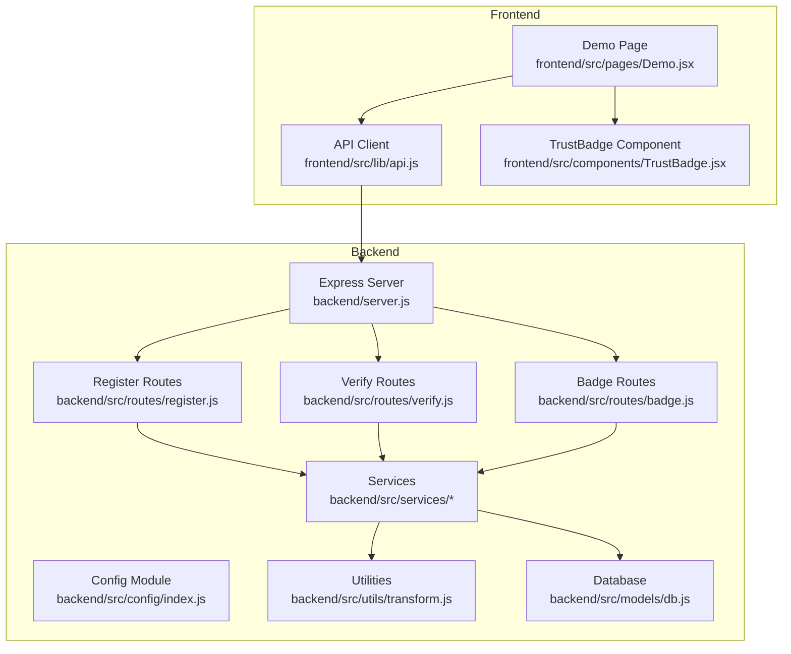
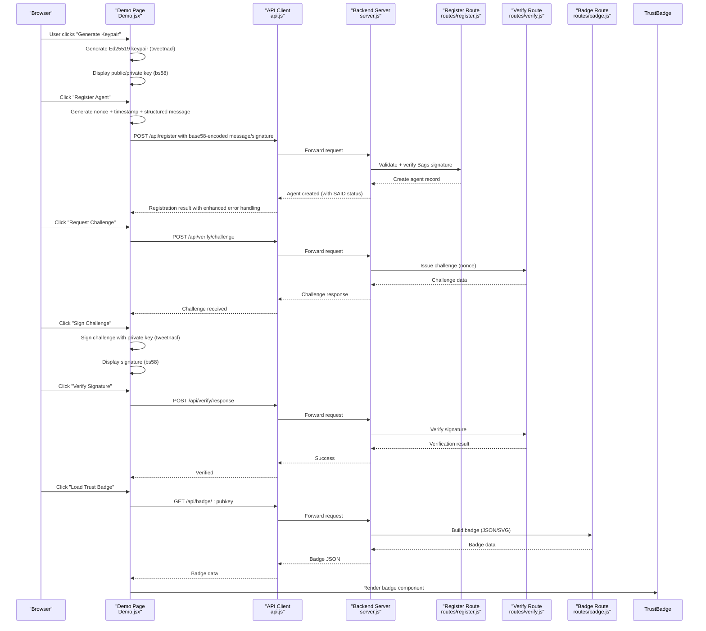
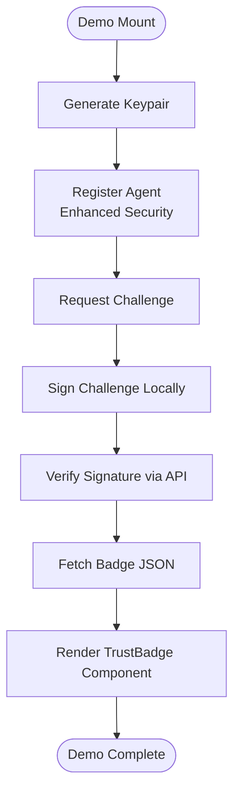
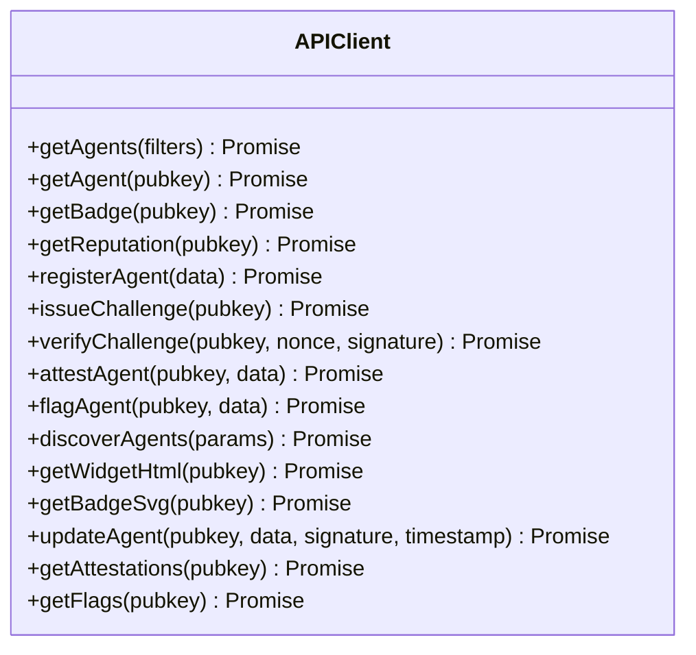
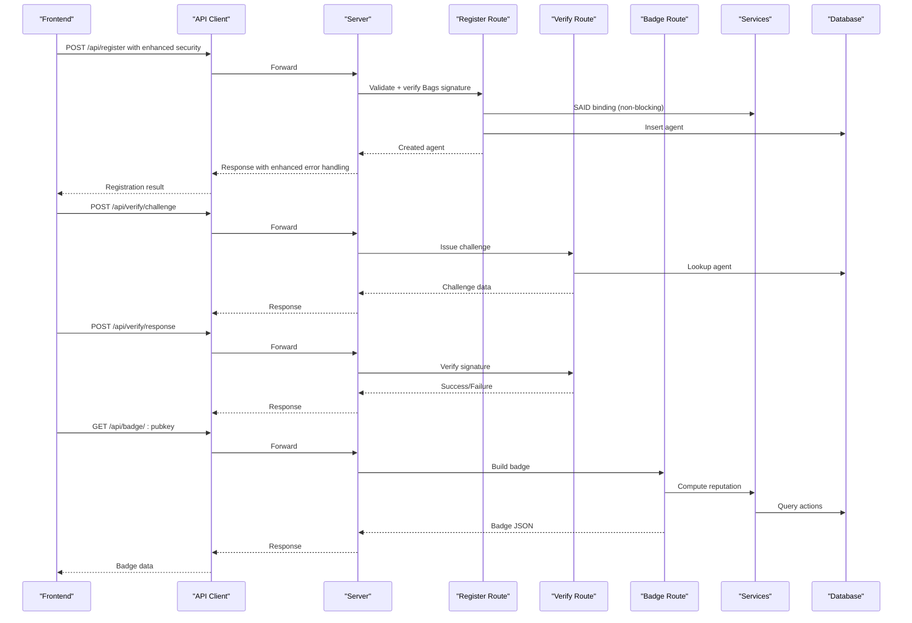
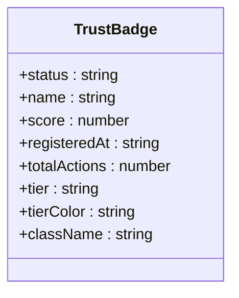
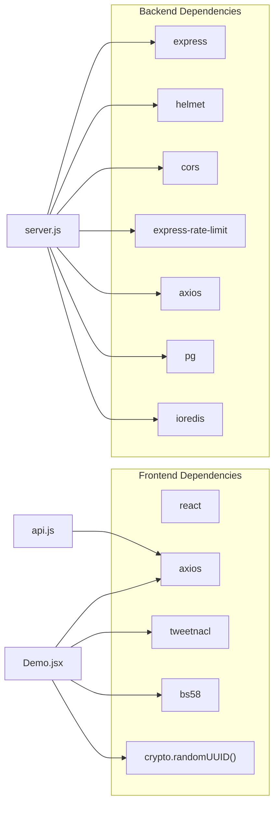

# Demo Page

<cite>
**Referenced Files in This Document**
- [README.md](file://README.md)
- [Demo.jsx](file://frontend/src/pages/Demo.jsx)
- [App.jsx](file://frontend/src/App.jsx)
- [api.js](file://frontend/src/lib/api.js)
- [server.js](file://backend/server.js)
- [config/index.js](file://backend/src/config/index.js)
- [routes/register.js](file://backend/src/routes/register.js)
- [routes/verify.js](file://backend/src/routes/verify.js)
- [routes/badge.js](file://backend/src/routes/badge.js)
- [services/bagsAuthVerifier.js](file://backend/src/services/bagsAuthVerifier.js)
- [services/badgeBuilder.js](file://backend/src/services/badgeBuilder.js)
- [utils/transform.js](file://backend/src/utils/transform.js)
- [db.js](file://backend/src/models/db.js)
- [TrustBadge.jsx](file://frontend/src/components/TrustBadge.jsx)
- [vite.config.js](file://frontend/vite.config.js)
</cite>

## Update Summary
**Changes Made**
- Enhanced registration flow with proper nonce generation using `crypto.randomUUID()`
- Added timestamp inclusion in registration messages for enhanced security
- Implemented structured message formatting with standardized format
- Improved base58 encoding handling for both messages and signatures
- Enhanced error handling for agent ID extraction from various response formats
- Updated challenge-response flow with improved signature verification

## Table of Contents
1. [Introduction](#introduction)
2. [Project Structure](#project-structure)
3. [Core Components](#core-components)
4. [Architecture Overview](#architecture-overview)
5. [Detailed Component Analysis](#detailed-component-analysis)
6. [Dependency Analysis](#dependency-analysis)
7. [Performance Considerations](#performance-considerations)
8. [Troubleshooting Guide](#troubleshooting-guide)
9. [Conclusion](#conclusion)

## Introduction
This document explains the interactive Demo page that demonstrates AgentID's end-to-end verification flow. The demo runs entirely in the browser for the cryptographic steps while integrating with the backend API for registration, challenge-response, and badge retrieval. It guides users through generating an Ed25519 keypair, registering an agent, performing a cryptographic challenge-response, and viewing the resulting trust badge.

**Updated** Enhanced with improved security measures including proper nonce generation, timestamp inclusion, and structured message formatting for the registration flow.

## Project Structure
The demo is part of a full-stack application with:
- Frontend (React + Vite): Provides the interactive demo UI and handles cryptographic operations locally.
- Backend (Node.js + Express): Exposes REST endpoints for registration, verification, badges, and reputation.
- Shared cryptography libraries: tweetnacl and bs58 for Ed25519 signing and Base58 encoding.

**Diagram sources**
- [Demo.jsx:121-810](file://frontend/src/pages/Demo.jsx#L121-L810)
- [api.js:1-147](file://frontend/src/lib/api.js#L1-L147)
- [server.js:25-104](file://backend/server.js#L25-L104)
- [config/index.js:6-34](file://backend/src/config/index.js#L6-L34)
- [routes/register.js:1-172](file://backend/src/routes/register.js#L1-L172)
- [routes/verify.js:1-121](file://backend/src/routes/verify.js#L1-L121)
- [routes/badge.js:1-58](file://backend/src/routes/badge.js#L1-L58)
- [services/badgeBuilder.js:1-556](file://backend/src/services/badgeBuilder.js#L1-L556)
- [utils/transform.js:1-125](file://backend/src/utils/transform.js#L1-L125)
- [db.js:1-71](file://backend/src/models/db.js#L1-L71)
- [TrustBadge.jsx:1-278](file://frontend/src/components/TrustBadge.jsx#L1-L278)

**Section sources**
- [README.md:1-104](file://README.md#L1-L104)
- [Demo.jsx:121-810](file://frontend/src/pages/Demo.jsx#L121-L810)
- [server.js:25-104](file://backend/server.js#L25-L104)

## Core Components
- Demo Page: Orchestrates the four-step verification flow, manages state, and renders interactive UI elements.
- API Client: Encapsulates HTTP requests to the backend API with interceptors for auth and error handling.
- Trust Badge Component: Renders the verified/unverified/flagged badge with dynamic theming.
- Backend Routes: Implement registration, challenge-response, and badge retrieval.
- Services: Handle cryptographic verification, reputation computation, and badge generation.
- Utilities: Data transformation and validation helpers.

**Updated** Enhanced registration flow with improved nonce generation and structured message formatting.

**Section sources**
- [Demo.jsx:121-810](file://frontend/src/pages/Demo.jsx#L121-L810)
- [api.js:1-147](file://frontend/src/lib/api.js#L1-L147)
- [TrustBadge.jsx:68-278](file://frontend/src/components/TrustBadge.jsx#L68-L278)
- [routes/register.js:1-172](file://backend/src/routes/register.js#L1-L172)
- [routes/verify.js:1-121](file://backend/src/routes/verify.js#L1-L121)
- [routes/badge.js:1-58](file://backend/src/routes/badge.js#L1-L58)
- [services/bagsAuthVerifier.js:1-93](file://backend/src/services/bagsAuthVerifier.js#L1-L93)
- [services/badgeBuilder.js:1-556](file://backend/src/services/badgeBuilder.js#L1-L556)
- [utils/transform.js:1-125](file://backend/src/utils/transform.js#L1-L125)

## Architecture Overview
The demo executes a cryptographic challenge-response entirely in the browser using tweetnacl and bs58. It communicates with the backend for registration and badge retrieval. The backend enforces rate limits, validates inputs, and integrates with external services for reputation and identity binding.

**Updated** Enhanced with improved security measures including proper nonce generation and structured message formatting.

**Diagram sources**
- [Demo.jsx:147-246](file://frontend/src/pages/Demo.jsx#L147-L246)
- [api.js:65-83](file://frontend/src/lib/api.js#L65-L83)
- [server.js:69-77](file://backend/server.js#L69-L77)
- [routes/register.js:59-157](file://backend/src/routes/register.js#L59-L157)
- [routes/verify.js:18-118](file://backend/src/routes/verify.js#L18-L118)
- [routes/badge.js:16-55](file://backend/src/routes/badge.js#L16-L55)
- [services/bagsAuthVerifier.js:44-57](file://backend/src/services/bagsAuthVerifier.js#L44-L57)
- [services/badgeBuilder.js:17-89](file://backend/src/services/badgeBuilder.js#L17-L89)
- [TrustBadge.jsx:68-278](file://frontend/src/components/TrustBadge.jsx#L68-L278)

## Detailed Component Analysis

### Demo Page Component
The Demo page coordinates the entire flow:
- Step 1: Generates an Ed25519 keypair using tweetnacl and displays public/private keys encoded in Base58.
- Step 2: Registers the agent via the API client, sending the public key and metadata with enhanced security measures.
- Step 3: Requests a challenge, signs it locally with the private key, and verifies the signature with the backend.
- Step 4: Retrieves and renders the trust badge using the TrustBadge component.

**Updated** Enhanced registration flow with proper nonce generation using `crypto.randomUUID()`, timestamp inclusion, and structured message formatting.

**Diagram sources**
- [Demo.jsx:147-246](file://frontend/src/pages/Demo.jsx#L147-L246)
- [api.js:65-83](file://frontend/src/lib/api.js#L65-L83)
- [TrustBadge.jsx:68-278](file://frontend/src/components/TrustBadge.jsx#L68-L278)

**Section sources**
- [Demo.jsx:121-810](file://frontend/src/pages/Demo.jsx#L121-L810)

### API Client
The API client:
- Sets the base URL to `/api` and attaches optional Authorization headers.
- Intercepts requests to add tokens and responses to remove stale tokens on 401.
- Exposes functions for registration, challenge issuance, signature verification, badge retrieval, discovery, and widget access.

**Diagram sources**
- [api.js:1-147](file://frontend/src/lib/api.js#L1-L147)

**Section sources**
- [api.js:1-147](file://frontend/src/lib/api.js#L1-L147)

### Backend Routes and Services
- Registration route validates inputs, verifies the Bags signature, checks for existing agents, attempts SAID binding, and stores the agent record.
- Verify route issues challenges and verifies signatures, handling various error conditions.
- Badge route builds badge JSON and SVG, leveraging reputation services and caching.

**Updated** Enhanced registration flow with improved nonce validation and structured message handling.

**Diagram sources**
- [routes/register.js:59-157](file://backend/src/routes/register.js#L59-L157)
- [routes/verify.js:18-118](file://backend/src/routes/verify.js#L18-L118)
- [routes/badge.js:16-55](file://backend/src/routes/badge.js#L16-L55)
- [services/bagsAuthVerifier.js:18-86](file://backend/src/services/bagsAuthVerifier.js#L18-L86)
- [services/badgeBuilder.js:17-89](file://backend/src/services/badgeBuilder.js#L17-L89)
- [db.js:51-64](file://backend/src/models/db.js#L51-L64)

**Section sources**
- [routes/register.js:1-172](file://backend/src/routes/register.js#L1-L172)
- [routes/verify.js:1-121](file://backend/src/routes/verify.js#L1-L121)
- [routes/badge.js:1-58](file://backend/src/routes/badge.js#L1-L58)
- [services/bagsAuthVerifier.js:1-93](file://backend/src/services/bagsAuthVerifier.js#L1-L93)
- [services/badgeBuilder.js:1-556](file://backend/src/services/badgeBuilder.js#L1-L556)
- [db.js:1-71](file://backend/src/models/db.js#L1-L71)

### Trust Badge Component
The TrustBadge component renders a responsive, themed badge with:
- Status icon and label (verified/unverified/flagged).
- Tier differentiation (verified vs standard) with visual effects.
- Agent name, trust score, registration date, and total actions.

**Updated** Enhanced with improved visual styling and responsive design.

**Diagram sources**
- [TrustBadge.jsx:68-278](file://frontend/src/components/TrustBadge.jsx#L68-L278)

**Section sources**
- [TrustBadge.jsx:1-278](file://frontend/src/components/TrustBadge.jsx#L1-L278)

## Dependency Analysis
- Frontend depends on tweetnacl and bs58 for cryptographic operations and on axios for HTTP communication.
- Backend depends on Express, helmet, cors, rate limiting, tweetnacl, bs58, pg (PostgreSQL), ioredis, and axios.
- The demo uses Vite with a development proxy to forward `/api` requests to the backend server.

**Updated** Enhanced with improved security dependencies and error handling mechanisms.

**Diagram sources**
- [frontend/package.json:12-20](file://frontend/package.json#L12-L20)
- [backend/package.json:20-32](file://backend/package.json#L20-L32)
- [vite.config.js:31-40](file://frontend/vite.config.js#L31-L40)

**Section sources**
- [frontend/package.json:1-35](file://frontend/package.json#L1-L35)
- [backend/package.json:1-38](file://backend/package.json#L1-L38)
- [vite.config.js:1-42](file://frontend/vite.config.js#L1-L42)

## Performance Considerations
- The demo performs cryptographic operations in the browser, avoiding network overhead for signing.
- Backend routes implement rate limiting to protect against abuse.
- Badge generation caches results to reduce repeated computations and database queries.
- The frontend proxy and Vite middleware optimize local development performance.
- Enhanced error handling reduces unnecessary retries and improves user experience.

**Updated** Improved error handling and caching mechanisms for better performance.

## Troubleshooting Guide
Common issues and resolutions:
- Missing environment variables: The backend server exits early if required variables are missing and logs the list of missing keys.
- CORS errors: Ensure the frontend origin matches the configured CORS origin.
- Rate limiting: Excessive requests trigger rate limits; wait for the window to reset.
- Challenge verification failures: Confirm the nonce is included in the message and the signature is valid Base58.
- Badge not found: Verify the agent is registered and the public key is correct.
- Registration failures: Check that the nonce is properly included in the registration message and the signature is valid.

**Updated** Enhanced error handling for improved troubleshooting experience.

**Section sources**
- [server.js:3-23](file://backend/server.js#L3-L23)
- [server.js:48-51](file://backend/server.js#L48-L51)
- [routes/verify.js:93-113](file://backend/src/routes/verify.js#L93-L113)
- [routes/badge.js:24-29](file://backend/src/routes/badge.js#L24-L29)
- [Demo.jsx:197-213](file://frontend/src/pages/Demo.jsx#L197-L213)

## Conclusion
The Demo page provides a comprehensive walkthrough of AgentID's verification pipeline. It demonstrates secure, client-side cryptographic signing while delegating registration and badge generation to the backend. The modular architecture ensures maintainability, and the frontend components offer a polished user experience with responsive theming.

**Updated** Enhanced with improved security measures, better error handling, and structured message formatting for a more robust and secure demonstration experience.