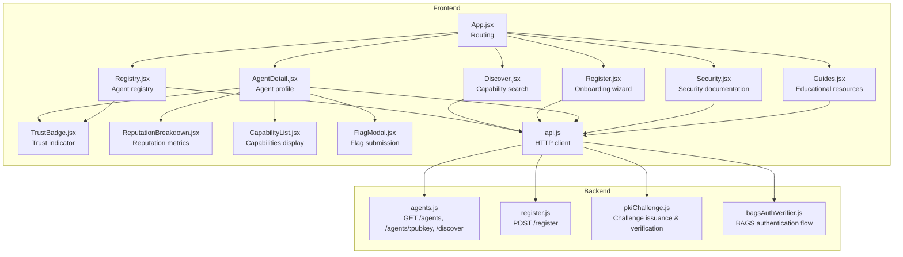
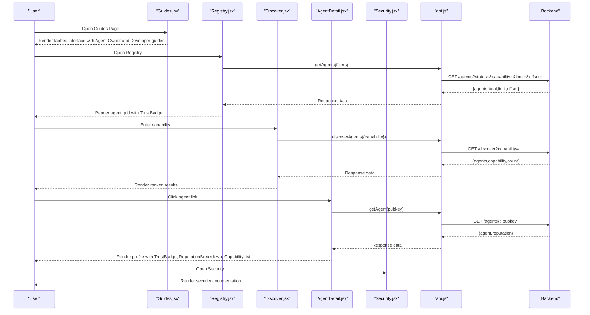
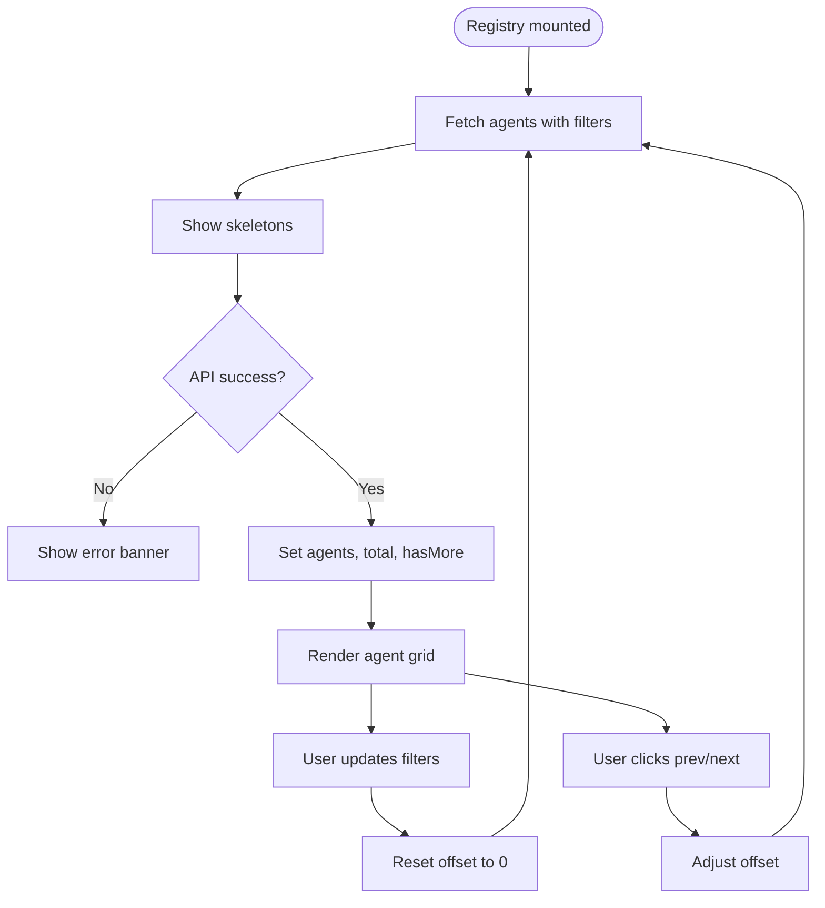
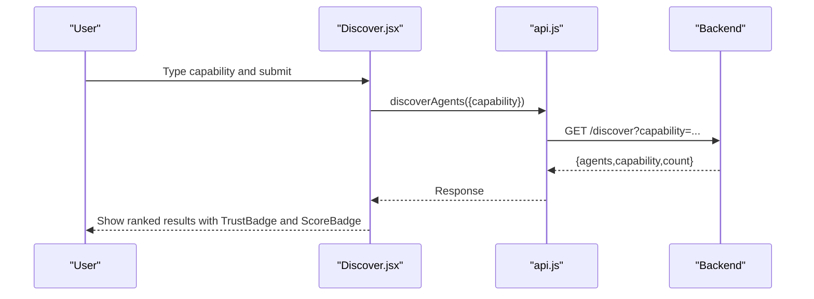
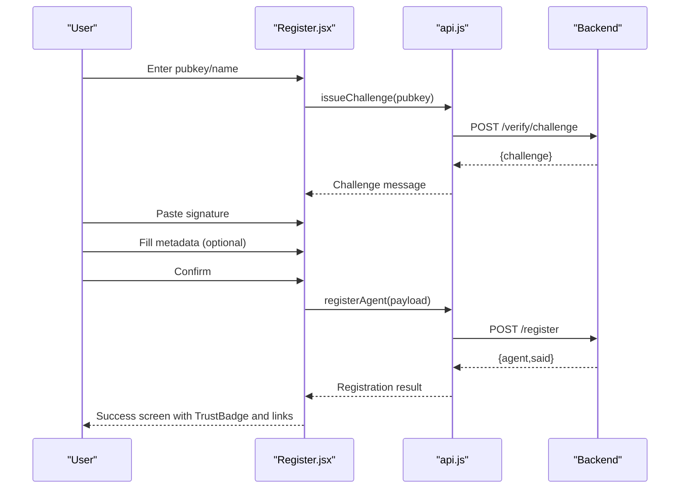
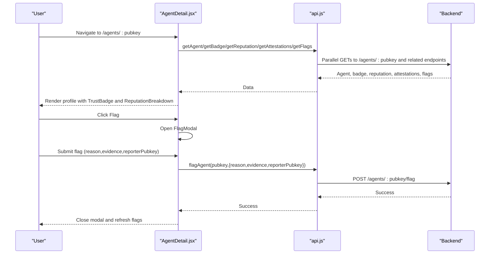
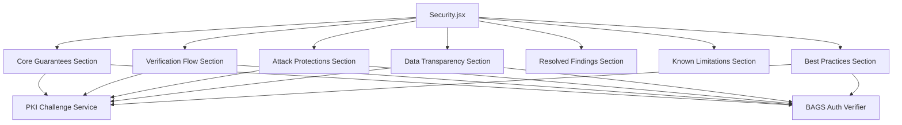
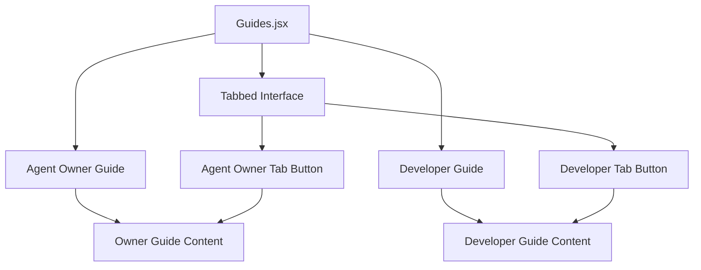
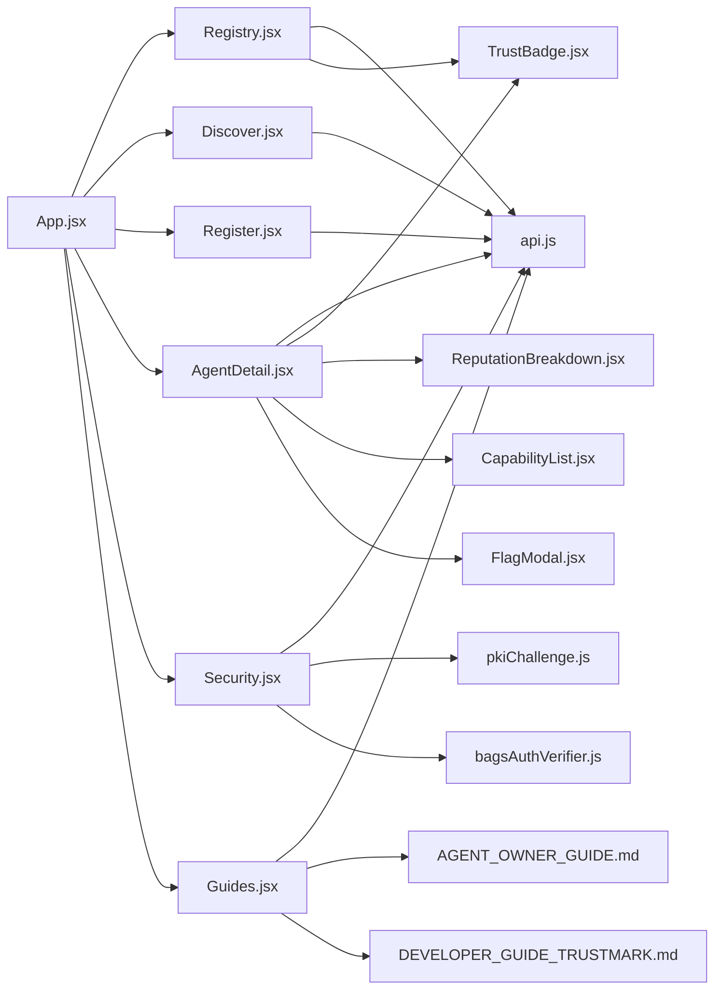

# Page Components

<cite>
**Referenced Files in This Document**
- [Registry.jsx](file://frontend/src/pages/Registry.jsx)
- [AgentDetail.jsx](file://frontend/src/pages/AgentDetail.jsx)
- [Register.jsx](file://frontend/src/pages/Register.jsx)
- [Discover.jsx](file://frontend/src/pages/Discover.jsx)
- [Security.jsx](file://frontend/src/pages/Security.jsx)
- [Guides.jsx](file://frontend/src/pages/Guides.jsx)
- [TrustBadge.jsx](file://frontend/src/components/TrustBadge.jsx)
- [ReputationBreakdown.jsx](file://frontend/src/components/ReputationBreakdown.jsx)
- [CapabilityList.jsx](file://frontend/src/components/CapabilityList.jsx)
- [FlagModal.jsx](file://frontend/src/components/FlagModal.jsx)
- [api.js](file://frontend/src/lib/api.js)
- [App.jsx](file://frontend/src/App.jsx)
- [agents.js](file://backend/src/routes/agents.js)
- [register.js](file://backend/src/routes/register.js)
- [pkiChallenge.js](file://backend/src/services/pkiChallenge.js)
- [bagsAuthVerifier.js](file://backend/src/services/bagsAuthVerifier.js)
</cite>

## Update Summary
**Changes Made**
- Added comprehensive documentation for the new Guides page component
- Updated routing information to include the Guides page
- Enhanced documentation with educational resource integration
- Updated architecture overview to include guides page navigation
- Added new section covering Guides page functionality and educational content

## Table of Contents
1. [Introduction](#introduction)
2. [Project Structure](#project-structure)
3. [Core Components](#core-components)
4. [Architecture Overview](#architecture-overview)
5. [Detailed Component Analysis](#detailed-component-analysis)
6. [Dependency Analysis](#dependency-analysis)
7. [Performance Considerations](#performance-considerations)
8. [Troubleshooting Guide](#troubleshooting-guide)
9. [Conclusion](#conclusion)

## Introduction
This document provides comprehensive documentation for the main application pages and their functionality in the AgentID ecosystem. It covers:
- Registry page for browsing and searching agents with capability filtering and reputation sorting
- AgentDetail page for displaying individual agent profiles, trust badges, and reputation breakdowns
- Register page for agent onboarding workflow including wallet connection and registration process
- Discover page for capability-based agent discovery with advanced filtering options
- Security page for comprehensive security documentation with interactive elements, core guarantees, verification flows, attack protections, and best practices
- **Guides page for centralized educational resources including Agent Owner and Developer integration guides**

It explains component props, state management, API integration patterns, error handling, loading states, and user interaction flows. It also includes examples of page navigation, data fetching, form handling, and responsive design implementation.

## Project Structure
The frontend is a React application structured around six main pages and several shared components. Routing is handled by React Router, and HTTP requests are abstracted via a centralized API module that wraps Axios. Backend endpoints are implemented in Express and expose REST APIs for agents, registration, discovery, and related security operations.

**Diagram sources**
- [App.jsx:170-193](file://frontend/src/App.jsx#L170-L193)
- [Registry.jsx:1-276](file://frontend/src/pages/Registry.jsx#L1-L276)
- [Discover.jsx:1-421](file://frontend/src/pages/Discover.jsx#L1-L421)
- [Register.jsx:1-733](file://frontend/src/pages/Register.jsx#L1-L733)
- [AgentDetail.jsx:1-501](file://frontend/src/pages/AgentDetail.jsx#L1-L501)
- [Security.jsx:1-779](file://frontend/src/pages/Security.jsx#L1-L779)
- [Guides.jsx:1-44](file://frontend/src/pages/Guides.jsx#L1-L44)
- [TrustBadge.jsx:1-145](file://frontend/src/components/TrustBadge.jsx#L1-L145)
- [ReputationBreakdown.jsx:1-165](file://frontend/src/components/ReputationBreakdown.jsx#L1-L165)
- [CapabilityList.jsx:1-111](file://frontend/src/components/CapabilityList.jsx#L1-L111)
- [FlagModal.jsx:1-201](file://frontend/src/components/FlagModal.jsx#L1-L201)
- [api.js:1-140](file://frontend/src/lib/api.js#L1-L140)
- [agents.js:1-251](file://backend/src/routes/agents.js#L1-L251)
- [register.js:1-156](file://backend/src/routes/register.js#L1-L156)
- [pkiChallenge.js:1-108](file://backend/src/services/pkiChallenge.js#L1-L108)
- [bagsAuthVerifier.js:1-93](file://backend/src/services/bagsAuthVerifier.js#L1-L93)

**Section sources**
- [App.jsx:170-193](file://frontend/src/App.jsx#L170-L193)
- [api.js:1-140](file://frontend/src/lib/api.js#L1-L140)

## Core Components
This section outlines the primary UI components used across pages and their responsibilities:
- TrustBadge: Displays agent status, name, trust score, registration date, and total actions with status-specific styling and glow effects.
- ReputationBreakdown: Renders a 5-factor reputation scoring system with progress bars and color-coded labels.
- CapabilityList: Shows agent capabilities with categorized styles and icons.
- FlagModal: Provides a modal interface for reporting agents with validation and JSON evidence parsing.
- Security.jsx: Comprehensive security documentation page with interactive elements, core guarantees, verification flows, attack protections, and best practices.
- **Guides.jsx: Educational resource hub with tabbed interface for Agent Owner and Developer guides, featuring SVG icons and external documentation links.**

Props and behavior:
- TrustBadge: Accepts status, name, score, registeredAt, totalActions, and className.
- ReputationBreakdown: Accepts a breakdown object with numeric or nested {score,max} values.
- CapabilityList: Accepts capabilities array and optional label visibility.
- FlagModal: Accepts isOpen, onClose, onSubmit, and agentPubkey; manages reason, evidence, and reporterPubkey internally.
- Security.jsx: Self-contained page component with no props, featuring comprehensive security documentation and interactive elements.
- **Guides.jsx: Tabbed interface component with activeTab state management, SVG icon rendering, and external documentation links.**

**Section sources**
- [TrustBadge.jsx:42-145](file://frontend/src/components/TrustBadge.jsx#L42-L145)
- [ReputationBreakdown.jsx:46-165](file://frontend/src/components/ReputationBreakdown.jsx#L46-L165)
- [CapabilityList.jsx:69-111](file://frontend/src/components/CapabilityList.jsx#L69-L111)
- [FlagModal.jsx:4-201](file://frontend/src/components/FlagModal.jsx#L4-L201)
- [Security.jsx:121-779](file://frontend/src/pages/Security.jsx#L121-L779)
- [Guides.jsx:17-44](file://frontend/src/pages/Guides.jsx#L17-L44)

## Architecture Overview
The frontend pages integrate with backend endpoints through a thin HTTP client. The client adds optional Authorization headers and centralizes error handling. Pages orchestrate data fetching, manage local state, and render reusable components. The Guides page serves as an educational resource hub that provides quick access to comprehensive documentation for both agent owners and developers.

**Diagram sources**
- [Registry.jsx:61-84](file://frontend/src/pages/Registry.jsx#L61-L84)
- [Discover.jsx:101-122](file://frontend/src/pages/Discover.jsx#L101-L122)
- [AgentDetail.jsx:180-212](file://frontend/src/pages/AgentDetail.jsx#L180-L212)
- [Guides.jsx:17-44](file://frontend/src/pages/Guides.jsx#L17-L44)
- [Security.jsx:121-159](file://frontend/src/pages/Security.jsx#L121-L159)
- [api.js:36-105](file://frontend/src/lib/api.js#L36-L105)
- [agents.js:23-114](file://backend/src/routes/agents.js#L23-L114)

## Detailed Component Analysis

### Registry Page
Purpose: Browse and filter agents by status and capability, with pagination and reputation-based ranking.

Key features:
- Filters: Status dropdown (All, Verified, Unverified, Flagged) and capability text input with clear button.
- Pagination: Items per page constant with offset-based navigation.
- Loading and error states: Skeleton loaders, error banners, and empty state messaging.
- Rendering: Grid of TrustBadge cards linking to agent detail pages.

State management:
- Local state includes agents array, loading/error flags, status/capability filters, offset, total, and hasMore flag.
- Effects trigger data fetch when filters or offset change.

API integration:
- Uses getAgents with status, capability, limit, and offset parameters.
- Backend enforces a maximum limit and computes total for pagination.

User interactions:
- Changing filters resets offset to zero.
- Pagination buttons adjust offset and conditionally enable/disable based on availability.

Responsive design:
- Responsive grid layout adjusts columns based on viewport.
- Filter bar stacks on small screens.

Navigation:
- Clicking an agent card navigates to AgentDetail route with pubkey.

**Section sources**
- [Registry.jsx:51-276](file://frontend/src/pages/Registry.jsx#L51-L276)
- [api.js:36-45](file://frontend/src/lib/api.js#L36-L45)
- [agents.js:23-55](file://backend/src/routes/agents.js#L23-L55)

**Diagram sources**
- [Registry.jsx:61-102](file://frontend/src/pages/Registry.jsx#L61-L102)

### Discover Page
Purpose: Capability-based agent discovery with suggested capabilities and ranked results.

Key features:
- Search box with submit button and suggested capability chips.
- Loading skeletons and empty/no-results states.
- Results list with rank badges, status tags, truncated pubkeys, capability chips, score badges, and action counts.
- Navigation back to initial state.

State management:
- Local state includes searchQuery, results array, loading flag, hasSearched flag, and error message.
- Uses a debounced-like pattern via immediate fetch on form submit.

API integration:
- Calls discoverAgents with capability parameter.
- Backend validates presence of capability and returns transformed agent list.

User interactions:
- Submitting the form triggers search.
- Clicking suggested capabilities auto-fills and searches.
- Clicking result links navigates to AgentDetail.

Responsive design:
- Compact search bar in results view.
- Capability chips adapt to screen size.

**Section sources**
- [Discover.jsx:94-421](file://frontend/src/pages/Discover.jsx#L94-L421)
- [api.js:96-105](file://frontend/src/lib/api.js#L96-L105)
- [agents.js:93-114](file://backend/src/routes/agents.js#L93-L114)

**Diagram sources**
- [Discover.jsx:101-122](file://frontend/src/pages/Discover.jsx#L101-L122)
- [api.js:96-105](file://frontend/src/lib/api.js#L96-L105)
- [agents.js:93-114](file://backend/src/routes/agents.js#L93-L114)

### Register Page
Purpose: Multi-step onboarding wizard for agent registration with wallet signature verification and metadata collection.

Workflow:
- Step 1: Collect agent pubkey and name; basic validation.
- Step 2: Issue challenge, display challenge message, collect signature; validation.
- Step 3: Optional metadata (token mint, capabilities, creator X handle, creator wallet, description).
- Step 4: Confirmation review; submit registration.

State management:
- Tracks currentStep, formData, errors, serverError, submitting flag, and registeredAgent.
- Validates each step before advancing; clears step-specific errors on input changes.
- On submit, transforms capabilities into an array and sends normalized payload.

API integration:
- Issues challenge via issueChallenge.
- Submits registration via registerAgent.
- Backend verifies signature against Bags protocol, checks nonce presence, prevents duplicates, and attempts SAID binding.

Security and UX:
- Provides detailed signing instructions for Phantom and Solana CLI.
- Shows expected signature format guidance.
- Displays success state with TrustBadge and navigation options.

**Section sources**
- [Register.jsx:241-733](file://frontend/src/pages/Register.jsx#L241-L733)
- [api.js:64-83](file://frontend/src/lib/api.js#L64-L83)
- [register.js:59-153](file://backend/src/routes/register.js#L59-L153)

**Diagram sources**
- [Register.jsx:295-341](file://frontend/src/pages/Register.jsx#L295-L341)
- [api.js:71-83](file://frontend/src/lib/api.js#L71-L83)
- [register.js:59-153](file://backend/src/routes/register.js#L59-L153)

### AgentDetail Page
Purpose: Display detailed agent information, trust badge, reputation breakdown, capabilities, and action history. Supports flagging agents.

Key features:
- Hero section with large TrustBadge and action buttons.
- Reputation breakdown rendered from backend-provided breakdown.
- Details panel with token mint, creator X, creator wallet, registration dates.
- Action statistics with success/failure rates and BAGS score.
- Capabilities list and optional description.
- Activity history (flags) with chronological sorting.
- Flag modal integration with validation and JSON evidence parsing.

State management:
- Loads agent, badge, reputation, attestations, and flags concurrently.
- Handles 404 and generic error states with user-friendly messages and retry options.
- Manages flag modal open state and submission lifecycle.

API integration:
- getAgent, getBadge, getReputation, getAttestations, getFlags.
- flagAgent submission integrated with modal.

User interactions:
- Back button navigates to previous location.
- Copy pubkey button supports clipboard operations.
- Flag button opens modal; successful submission refreshes flags.

**Section sources**
- [AgentDetail.jsx:167-501](file://frontend/src/pages/AgentDetail.jsx#L167-L501)
- [api.js:3-139](file://frontend/src/lib/api.js#L3-L139)
- [agents.js:61-87](file://backend/src/routes/agents.js#L61-L87)

**Diagram sources**
- [AgentDetail.jsx:180-230](file://frontend/src/pages/AgentDetail.jsx#L180-L230)
- [api.js:85-137](file://frontend/src/lib/api.js#L85-L137)
- [agents.js:61-87](file://backend/src/routes/agents.js#L61-L87)

### Security Page
Purpose: Comprehensive security documentation page explaining AgentID's cryptographic verification processes, core guarantees, attack protections, and best practices for agent operators.

Key features:
- Core Guarantees: Three fundamental security promises with visual icons and explanations.
- Verification Flow: Four-step challenge-response process with cryptographic details.
- Attack Protections: Comprehensive coverage of replay prevention, time-based verification, rate limiting, and XSS prevention.
- Data Transparency: Complete inventory of stored data with sensitivity ratings.
- Resolved Findings: Audit findings and their resolution status.
- Known Limitations: Transparent documentation of ongoing security improvements.
- Best Practices: Practical guidance for agent operators on key management and operational security.

Security components:
- SeverityBadge: Color-coded severity indicators (high, medium, low, standard).
- StatusBadge: Status indicators for resolved, mitigated, in-progress, planned items.
- Interactive elements: SVG icons, animated transitions, and responsive layouts.

State management:
- Self-contained: No internal state management; relies on React Router for navigation.
- Static content: Comprehensive documentation loaded from component JSX.

API integration:
- Minimal: Uses API client for general application functionality.
- Security-focused: Demonstrates secure practices through implementation examples.

User interactions:
- Navigation: Links to register, demo, and registry pages.
- External resources: Links to audit reports, API documentation, and GitHub repositories.
- Responsive design: Adapts to mobile and desktop viewports.

**Section sources**
- [Security.jsx:121-779](file://frontend/src/pages/Security.jsx#L121-L779)
- [pkiChallenge.js:46-108](file://backend/src/services/pkiChallenge.js#L46-L108)
- [bagsAuthVerifier.js:18-92](file://backend/src/services/bagsAuthVerifier.js#L18-L92)

**Diagram sources**
- [Security.jsx:161-779](file://frontend/src/pages/Security.jsx#L161-L779)
- [pkiChallenge.js:1-108](file://backend/src/services/pkiChallenge.js#L1-L108)
- [bagsAuthVerifier.js:1-93](file://backend/src/services/bagsAuthVerifier.js#L1-L93)

### Guides Page
Purpose: Centralized educational resource hub providing quick access to Agent Owner and Developer integration guides through a tabbed interface.

Key features:
- Tabbed interface: Agent Owner Guide and Developer Guide tabs with smooth transitions.
- SVG icon integration: Custom SVG icons for visual enhancement (book, user, code, external link).
- External documentation links: Direct links to comprehensive guides hosted on GitHub.
- Responsive design: Glass-morphism styling with gradient accents and fade animations.
- Self-contained functionality: No API integration required, purely informational content.

Component structure:
- AgentOwnerGuide: Renders Agent Owner Guide content with GitHub link.
- DeveloperGuide: Renders Developer Integration Guide content with GitHub link.
- Main component: Manages active tab state and renders appropriate content.

State management:
- Active tab tracking: Uses useState to manage current tab selection ("owner" or "developer").
- No external dependencies: Purely client-side rendering with external links.

User interactions:
- Tab switching: Clicking tab buttons toggles between Agent Owner and Developer guides.
- External navigation: Clicking guide links opens documentation in new tabs.
- Responsive behavior: Mobile-friendly tab switching with smooth animations.

**Section sources**
- [Guides.jsx:1-44](file://frontend/src/pages/Guides.jsx#L1-L44)

**Diagram sources**
- [Guides.jsx:17-44](file://frontend/src/pages/Guides.jsx#L17-L44)

## Dependency Analysis
Component and module relationships:
- Pages depend on the API client for data fetching.
- AgentDetail composes TrustBadge, ReputationBreakdown, CapabilityList, and FlagModal.
- Registry composes TrustBadge.
- App defines routing and exposes pages including the new Guides page.
- Security page integrates with PKI challenge service and BAGS authentication verifier for cryptographic verification demonstrations.
- **Guides page provides educational content without external API dependencies, serving as a standalone informational resource.**

**Diagram sources**
- [App.jsx:170-193](file://frontend/src/App.jsx#L170-L193)
- [Registry.jsx:1-276](file://frontend/src/pages/Registry.jsx#L1-L276)
- [Discover.jsx:1-421](file://frontend/src/pages/Discover.jsx#L1-L421)
- [Register.jsx:1-733](file://frontend/src/pages/Register.jsx#L1-L733)
- [AgentDetail.jsx:1-501](file://frontend/src/pages/AgentDetail.jsx#L1-L501)
- [Security.jsx:1-779](file://frontend/src/pages/Security.jsx#L1-L779)
- [Guides.jsx:1-44](file://frontend/src/pages/Guides.jsx#L1-L44)
- [TrustBadge.jsx:1-145](file://frontend/src/components/TrustBadge.jsx#L1-L145)
- [ReputationBreakdown.jsx:1-165](file://frontend/src/components/ReputationBreakdown.jsx#L1-L165)
- [CapabilityList.jsx:1-111](file://frontend/src/components/CapabilityList.jsx#L1-L111)
- [FlagModal.jsx:1-201](file://frontend/src/components/FlagModal.jsx#L1-L201)
- [api.js:1-140](file://frontend/src/lib/api.js#L1-L140)
- [pkiChallenge.js:1-108](file://backend/src/services/pkiChallenge.js#L1-L108)
- [bagsAuthVerifier.js:1-93](file://backend/src/services/bagsAuthVerifier.js#L1-L93)

**Section sources**
- [App.jsx:170-193](file://frontend/src/App.jsx#L170-L193)
- [api.js:1-140](file://frontend/src/lib/api.js#L1-L140)

## Performance Considerations
- Registry and Discover pages implement pagination and skeleton loaders to improve perceived performance and reduce layout shifts.
- AgentDetail uses concurrent data fetching to minimize time-to-first-content.
- TrustBadge and ReputationBreakdown are lightweight presentational components; avoid unnecessary re-renders by passing memoized props.
- Debounce or throttle search input in Discover to limit frequent network requests (current implementation triggers on submit).
- Consider virtualizing long lists if agent registries grow substantially.
- Security page uses static content with minimal JavaScript, ensuring fast loading times and smooth user experience.
- **Guides page is purely client-side with no API calls, providing instant loading and excellent performance characteristics.**

## Troubleshooting Guide
Common issues and resolutions:
- Network errors:
  - Registry/Discover show error banners with actionable messages; users can retry.
  - AgentDetail displays an error state with a reload button.
- Authentication:
  - API client removes token on 401 responses; re-authenticate or reconnect wallet as needed.
- Registration failures:
  - Validate pubkey length/format, signature correctness, and nonce presence.
  - Ensure capabilities are comma-separated and token mint is a valid address.
- Flagging:
  - Provide a reason; evidence must be valid JSON if included.
  - Reporter pubkey is optional; leaving it blank marks the report as anonymous.
- Security page issues:
  - Verification failures: Ensure challenge message format matches expected pattern (AGENTID-VERIFY:{pubkey}:{nonce}:{timestamp}).
  - Signature validation errors: Verify Ed25519 signature using correct base58 encoding and public key format.
  - Nonce expiration: Challenges expire after 5 minutes; regenerate challenges if expired.
  - Rate limiting: Authentication endpoints limit 20 requests per 15 minutes per IP.
- **Guides page issues:**
  - **Tab switching problems:** Ensure React Router is properly configured and the Guides route is defined in App.jsx.
  - **External link failures:** Verify that documentation files exist on GitHub and are accessible.
  - **SVG icon rendering:** Check that the SVG components are properly imported and rendered.

**Section sources**
- [Registry.jsx:186-199](file://frontend/src/pages/Registry.jsx#L186-L199)
- [Discover.jsx:261-274](file://frontend/src/pages/Discover.jsx#L261-L274)
- [AgentDetail.jsx:263-284](file://frontend/src/pages/AgentDetail.jsx#L263-L284)
- [api.js:23-33](file://frontend/src/lib/api.js#L23-L33)
- [register.js:59-153](file://backend/src/routes/register.js#L59-L153)
- [FlagModal.jsx:13-50](file://frontend/src/components/FlagModal.jsx#L13-L50)
- [pkiChallenge.js:55-103](file://backend/src/services/pkiChallenge.js#L55-L103)
- [App.jsx:170-193](file://frontend/src/App.jsx#L170-L193)

## Conclusion
The AgentID pages provide a cohesive, secure, and user-friendly experience for discovering, registering, and managing AI agents. They leverage a clean separation of concerns with centralized API integration, robust error handling, and reusable UI components. The multi-step registration flow ensures trust and verifiability, while the discovery and registry pages offer powerful filtering and ranking capabilities. **The new Guides page serves as a comprehensive educational hub that provides quick access to both Agent Owner and Developer integration guides, making AgentID's functionality accessible to all stakeholders regardless of their technical expertise.** The Security page complements this educational approach with detailed security documentation, ensuring transparency and trust in the platform's cryptographic verification processes.