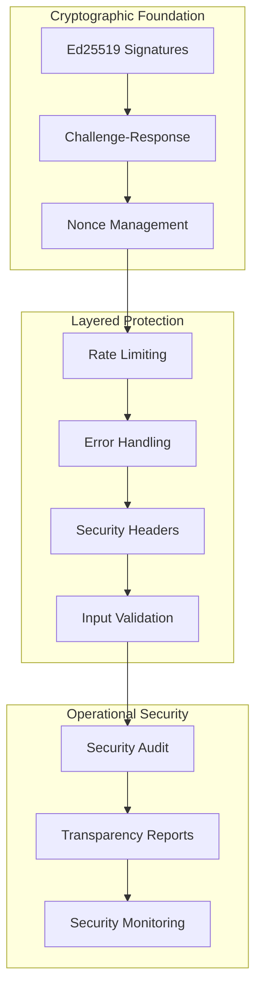
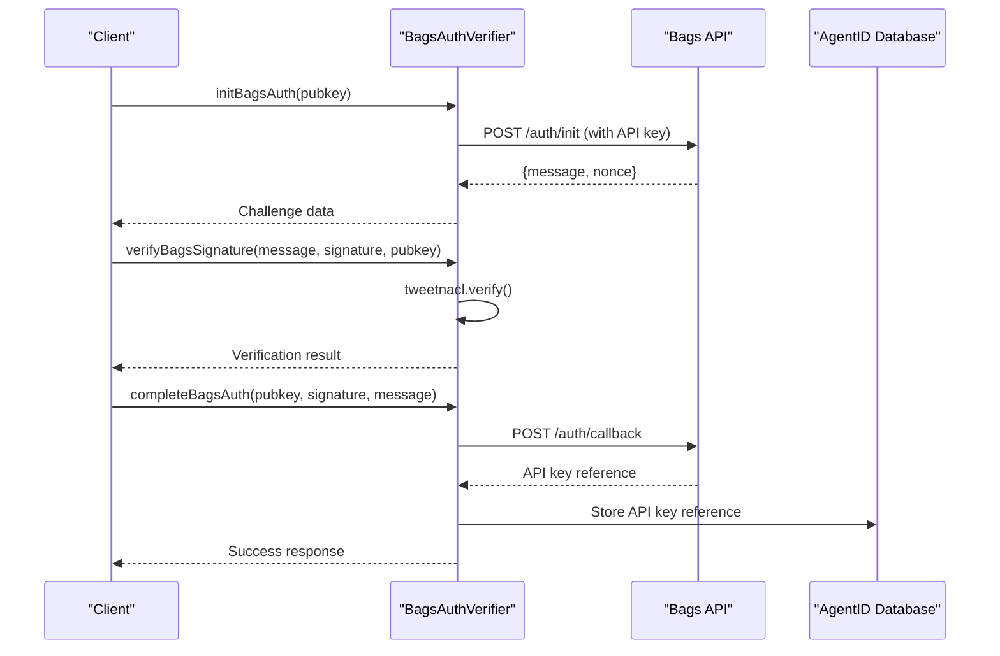
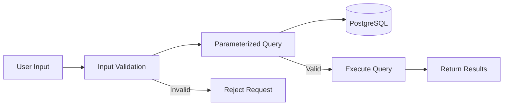
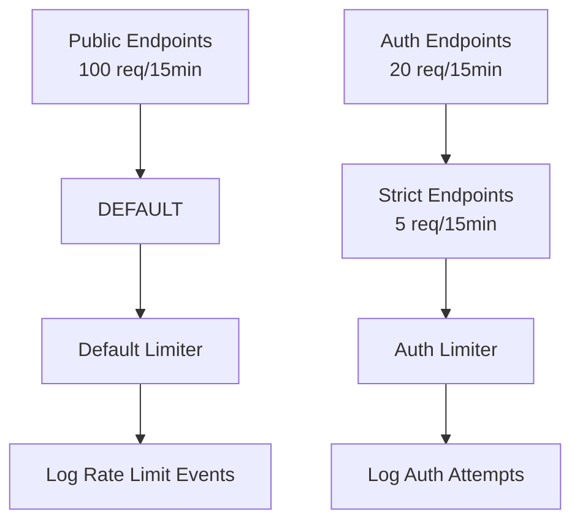
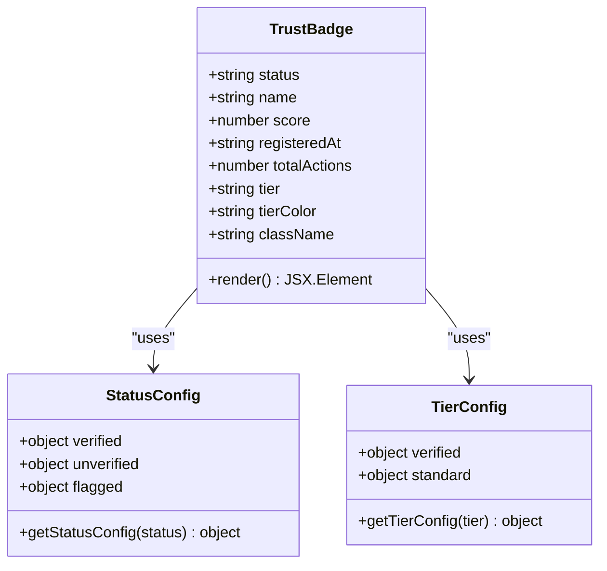

# Security Page

<cite>
**Referenced Files in This Document**
- [Security.jsx](file://frontend/src/pages/Security.jsx)
- [Security-Implementation.md](file://AgentID-wiki-temp/Security-Implementation.md)
- [Architecture-Security.md](file://AgentID-wiki-temp/Architecture-Security.md)
- [Service-Authentication-Services.md](file://AgentID-wiki-temp/Service-Authentication-Services.md)
- [bagsAuthVerifier.js](file://backend/src/services/bagsAuthVerifier.js)
- [pkiChallenge.js](file://backend/src/services/pkiChallenge.js)
- [rateLimit.js](file://backend/src/middleware/rateLimit.js)
- [errorHandler.js](file://backend/src/middleware/errorHandler.js)
- [queries.js](file://backend/src/models/queries.js)
- [server.js](file://backend/server.js)
- [api.js](file://frontend/src/lib/api.js)
- [TrustBadge.jsx](file://frontend/src/components/TrustBadge.jsx)
- [index.js](file://backend/src/config/index.js)
</cite>

## Update Summary
**Changes Made**
- Enhanced comprehensive security page implementation with detailed Ed25519 public key terminology
- Added challenge-response flow visualization with attack prevention scenarios
- Implemented database transparency table with detailed data storage policies
- Integrated attack scenario analysis with concrete threat mitigation examples
- Added security best practices for agent operators with practical guidance
- Updated frontend security components with interactive elements and visualizations

## Table of Contents
1. [Introduction](#introduction)
2. [Security Architecture Overview](#security-architecture-overview)
3. [Authentication Mechanisms](#authentication-mechanisms)
4. [Authorization Model](#authorization-model)
5. [Data Protection Measures](#data-protection-measures)
6. [Rate Limiting Strategy](#rate-limiting-strategy)
7. [Error Handling Security](#error-handling-security)
8. [Security Headers Implementation](#security-headers-implementation)
9. [Frontend Security Components](#frontend-security-components)
10. [Known Limitations and Roadmap](#known-limitations-and-roadmap)
11. [Best Practices](#best-practices)
12. [Conclusion](#conclusion)

## Introduction

The AgentID Security Page provides comprehensive documentation of the platform's security architecture, focusing on cryptographic verification using Ed25519 signatures, defense-in-depth security measures, and transparency about known limitations. This page serves as both a technical reference for developers and a security assurance document for operators and stakeholders.

AgentID implements a multi-layered security approach built on mathematical proof of identity rather than trust-based systems. The platform never requests, receives, or stores private keys, ensuring that cryptographic verification occurs entirely within the operator's infrastructure.

**Updated** Enhanced with comprehensive security page implementation featuring detailed Ed25519 public key terminology and attack scenario analysis.

## Security Architecture Overview

The AgentID security architecture is built on three fundamental pillars: cryptographic verification, layered protection, and operational transparency.



**Diagram sources**
- [Architecture-Security.md:25-81](file://AgentID-wiki-temp/Architecture-Security.md#L25-L81)
- [Security-Implementation.md:27-224](file://AgentID-wiki-temp/Security-Implementation.md#L27-L224)

The architecture emphasizes defense-in-depth, where each layer provides protection against different types of threats while maintaining the cryptographic foundation that makes AgentID fundamentally secure.

## Authentication Mechanisms

### Ed25519 Signature Verification

AgentID uses Ed25519 digital signatures for all authentication processes, providing mathematically proven identity verification without requiring private key transmission.

```mermaid
flowchart TD
START[Signature Verification] --> DECODE[Base58 Decode Inputs]
DECODE --> VERIFY[tweetnacl.verify()]
VERIFY --> |Valid| SUCCESS[Authentication Success]
VERIFY --> |Invalid| FAILURE[Authentication Failure]
DECODE --> |Invalid Format| FAILURE
SUCCESS --> STORE[Store Verification Record]
STORE --> UPDATE[Update Last Verified Timestamp]
UPDATE --> COMPLETE[Complete Challenge]
FAILURE --> LOG[Log Security Event]
LOG --> RETURN[Return Error Response]
```

**Diagram sources**
- [Architecture-Security.md:29-37](file://AgentID-wiki-temp/Architecture-Security.md#L29-L37)
- [Security-Implementation.md:46-58](file://AgentID-wiki-temp/Security-Implementation.md#L46-L58)

### Bags Authentication Wrapper

The Bags authentication flow integrates with the BAGS ecosystem while maintaining AgentID's security standards:

1. **Initialization**: Request challenge from Bags API with API key authentication
2. **Signature Verification**: Verify Ed25519 signatures using tweetnacl
3. **Callback Processing**: Submit signature to Bags callback for API key reference



**Diagram sources**
- [Service-Authentication-Services.md:109-114](file://AgentID-wiki-temp/Service-Authentication-Services.md#L109-L114)
- [bagsAuthVerifier.js:18-35](file://backend/src/services/bagsAuthVerifier.js#L18-L35)

### PKI Challenge-Response System

The PKI challenge-response mechanism provides ongoing verification with strong replay protection:

```mermaid
flowchart TD
ISSUE[Issue Challenge] --> GEN[Generate UUID Nonce]
GEN --> BUILD[Build Challenge Message:<br/>AGENTID-VERIFY:{agentId}:{pubkey}:{nonce}:{timestamp}]
BUILD --> ENCODE[Base58 Encode]
ENCODE --> STORE[Store with Expiration]
STORE --> RETURN[Return to Client]
VERIFY[Verify Response] --> LOAD[Load Challenge Record]
LOAD --> CHECK_EXPIRY{Check Expiration}
CHECK_EXPIRY --> |Expired| ERROR[Error: Expired]
CHECK_EXPIRY --> |Valid| CHECK_USED{Check Not Used}
CHECK_USED --> |Used| ERROR
CHECK_USED --> VERIFY_SIG[Verify Ed25519 Signature]
VERIFY_SIG --> |Invalid| ERROR
VERIFY_SIG --> |Valid| MARK_USED[Mark Challenge Used]
MARK_USED --> UPDATE_TS[Update Last Verified Timestamp]
UPDATE_TS --> SUCCESS[Return Success]
```

**Diagram sources**
- [Architecture-Security.md:62-81](file://AgentID-wiki-temp/Architecture-Security.md#L62-L81)
- [pkiChallenge.js:18-44](file://backend/src/services/pkiChallenge.js#L18-L44)

**Section sources**
- [Service-Authentication-Services.md:109-134](file://AgentID-wiki-temp/Service-Authentication-Services.md#L109-L134)
- [bagsAuthVerifier.js:44-57](file://backend/src/services/bagsAuthVerifier.js#L44-L57)
- [pkiChallenge.js:55-103](file://backend/src/services/pkiChallenge.js#L55-L103)

## Authorization Model

AgentID implements a signature-based authorization system that eliminates traditional role-based access controls in favor of cryptographic proof:

| Action | Authorization Method |
|--------|---------------------|
| Read agent data | Public (no authentication required) |
| Register agent | Ed25519 signature of challenge message |
| Update agent | Ed25519 signature of update request |
| Verify challenge | Ed25519 signature of challenge response |
| Flag agent | Ed25519 signature + reporter signature |

### Signature Requirements

```javascript
// Registration requires:
{
  pubkey,      // Agent's public key
  signature,   // Ed25519 signature of message
  message,     // Challenge message
  nonce        // Challenge nonce
}

// Flagging requires:
{
  reason,         // Flag reason
  reporterPubkey, // Reporter's public key
  signature,      // Reporter's Ed25519 signature
  timestamp       // Timestamp for freshness
}
```

**Section sources**
- [Architecture-Security.md:85-113](file://AgentID-wiki-temp/Architecture-Security.md#L85-L113)
- [Security-Implementation.md:70-85](file://AgentID-wiki-temp/Security-Implementation.md#L70-L85)

## Data Protection Measures

### SQL Injection Prevention

AgentID employs strict parameterized query patterns throughout the application:



**Diagram sources**
- [Architecture-Security.md:119-126](file://AgentID-wiki-temp/Architecture-Security.md#L119-L126)
- [Security-Implementation.md:100-106](file://AgentID-wiki-temp/Security-Implementation.md#L100-L106)

### XSS Prevention

Output encoding and Content Security Policy headers protect against cross-site scripting attacks:

```javascript
function escapeHtml(text) {
  const map = {
    '&': '&amp;',
    '<': '&lt;',
    '>': '&gt;',
    '"': '&quot;',
    "'": '&#039;'
  };
  return text.replace(/[&<>"']/g, m => map[m]);
}
```

### Data Storage Transparency

**Updated** Comprehensive database transparency table with detailed data classification and storage policies:

| Data Type | Stored | Classification | Details |
|-----------|--------|----------------|---------|
| Public Key | Yes | Sensitive | Ed25519 public key (32 bytes) - essential for verification |
| Name & Description | Yes | Self-asserted | Self-reported metadata during registration |
| Reputation Score | Yes | Aggregate | Aggregated from external sources (BAGS, SAID) |
| Private Key | Never | Never Stored | Cryptographically protected - never transmitted |
| IP Address / Email | Never | No PII | No personally identifiable information collected |
| Challenge Nonces | Temporary | Transient | 5-minute TTL, auto-deleted after use/expiry |
| API Keys | Temporary | Server-side | Generated for external service integration |
| Verification Records | Temporary | Audit Trail | Challenge/response pairs with timestamps |

**Section sources**
- [Security-Implementation.md:86-118](file://AgentID-wiki-temp/Security-Implementation.md#L86-L118)
- [Security.jsx:302-376](file://frontend/src/pages/Security.jsx#L302-L376)

## Rate Limiting Strategy

AgentID implements a multi-tier rate limiting system to prevent abuse and maintain service availability:



**Diagram sources**
- [Architecture-Security.md:159-164](file://AgentID-wiki-temp/Architecture-Security.md#L159-L164)
- [rateLimit.js:44-55](file://backend/src/middleware/rateLimit.js#L44-L55)

### Implementation Details

The rate limiting system uses express-rate-limit middleware with configurable parameters:

- **Default Rate Limiter**: 100 requests per 15 minutes per IP address
- **Auth Rate Limiter**: 20 requests per 15 minutes per IP address  
- **Strict Rate Limiter**: 5 requests per 15 minutes per IP address

**Section sources**
- [rateLimit.js:1-62](file://backend/src/middleware/rateLimit.js#L1-L62)
- [Architecture-Security.md:155-186](file://AgentID-wiki-temp/Architecture-Security.md#L155-L186)

## Error Handling Security

AgentID implements security-conscious error handling that prevents information disclosure while maintaining operational visibility:

```mermaid
flowchart TD
ERROR[Error Occurs] --> LOG[Log Full Error<br/>(Server-side Only)]
LOG --> CHECK_ENV{Environment?}
CHECK_ENV --> |Development| DEV_RESPONSE[Return Detailed Error]
CHECK_ENV --> |Production| PROD_RESPONSE[Return Generic Error]
DEV_RESPONSE --> CLIENT[Client Receives Detailed Info]
PROD_RESPONSE --> CLIENT_GENERIC[Client Receives Generic Message]
LOG --> SECURITY[Security Event Logged]
SECURITY --> MONITORING[Monitoring System]
```

**Diagram sources**
- [Architecture-Security.md:192-198](file://AgentID-wiki-temp/Architecture-Security.md#L192-L198)
- [errorHandler.js:15-41](file://backend/src/middleware/errorHandler.js#L15-L41)

### Error Response Strategy

- **Development Environment**: Detailed error messages with stack traces for debugging
- **Production Environment**: Generic error messages without sensitive information
- **Logging**: Comprehensive error logging with timestamps, request context, and stack traces

**Section sources**
- [errorHandler.js:15-41](file://backend/src/middleware/errorHandler.js#L15-L41)
- [Architecture-Security.md:188-198](file://AgentID-wiki-temp/Architecture-Security.md#L188-L198)

## Security Headers Implementation

AgentID uses Helmet.js to implement comprehensive security headers that protect against various web vulnerabilities:

| Header | Purpose | Implementation |
|--------|---------|----------------|
| Content-Security-Policy | Prevent XSS and data injection attacks | Restricts resource loading |
| X-Frame-Options | Prevent clickjacking attacks | Controls frame embedding |
| X-Content-Type-Options | Prevent MIME type sniffing | Disables content type sniffing |
| Strict-Transport-Security | Enforce HTTPS connections | Forces secure connections |
| X-DNS-Prefetch-Control | Control DNS prefetching | Prevents DNS leaks |
| Referrer-Policy | Control referrer information | Minimizes information leakage |

**Section sources**
- [Security-Implementation.md:163-181](file://AgentID-wiki-temp/Security-Implementation.md#L163-L181)
- [server.js:44-51](file://backend/server.js#L44-L51)

## Frontend Security Components

### Trust Badge Component

The TrustBadge component provides visual security indicators with gradient effects and status-based styling:



**Diagram sources**
- [TrustBadge.jsx:150-186](file://frontend/src/components/TrustBadge.jsx#L150-L186)
- [TrustBadge.jsx:97-148](file://frontend/src/components/TrustBadge.jsx#L97-L148)

### Security Page Implementation

**Updated** The Security page serves as a comprehensive security documentation hub with interactive elements and detailed security visualizations:

- **Core Guarantee Cards**: Three-column layout highlighting fundamental security principles with visual icons
- **Verification Flow**: Four-step process visualization with attack prevention explanations and real-time security demonstrations
- **Data Transparency Table**: Interactive table showing what data is stored, why it's stored, and how long it persists
- **Attack Protections Grid**: Visual presentation of security measures with severity ratings and status indicators
- **Audit Information**: Links to security audit reports and comprehensive documentation
- **Best Practices**: Practical guidance for agent operators with step-by-step security recommendations

**Section sources**
- [Security.jsx:121-779](file://frontend/src/pages/Security.jsx#L121-L779)

## Known Limitations and Roadmap

### Resolved Security Findings

**Updated** Comprehensive tracking of resolved security findings with detailed implementation details:

| Finding | Status | Resolution | Timeline |
|---------|--------|------------|----------|
| Flag Proof-of-Ownership | Resolved | Ed25519 signature verification required for all flag submissions | Fixed |
| Rate Limiter Upgrade | Resolved | Stricter authLimiter now applied to sensitive endpoints | Fixed |
| Startup Validation | Resolved | Environment variable validation at startup with clear error messages | Fixed |

### Active Security Improvements

**Updated** Detailed roadmap of active security improvements with severity classifications:

| Issue | Severity | Status | Target Sprint | Implementation Details |
|-------|----------|--------|---------------|----------------------|
| Self-Asserted Metadata | Medium | Planned | Sprint 3 | Social verification through attestations from trusted entities |
| No Key Revocation | Medium | Planned | Sprint 3 | Multi-signature recovery and key rotation workflows |
| Database Breach Risk | Standard | Mitigated | Standard | Parameterized statements, VPN access, no sensitive data stored |
| SAID Gateway Dependency | Low | Mitigated | Monitored | Graceful degradation with external API dependency |

**Section sources**
- [Security.jsx:457-601](file://frontend/src/pages/Security.jsx#L457-L601)

## Best Practices

### Secret Management

**Updated** Enhanced secret management practices with comprehensive guidance:

- **Never commit secrets** to version control systems
- **Use environment variables** for configuration management
- **Rotate API keys regularly** as part of operational procedures
- **Implement secrets management** in production environments
- **Store private keys securely** using hardware security modules or cloud key management services

### Infrastructure Security

**Updated** Comprehensive infrastructure security guidelines:

- **Enable HTTPS** with TLS 1.2+ in production deployments
- **Use valid SSL certificates** from trusted Certificate Authorities
- **Implement HSTS** headers for automatic HTTPS enforcement
- **Configure proper firewall rules** restricting access to database and cache
- **Use VPN access** for database administration and maintenance
- **Implement network segmentation** separating critical services

### Monitoring and Auditing

**Updated** Advanced monitoring and auditing practices:

- **Monitor authentication failures** for brute force attempts and suspicious patterns
- **Track rate limit violations** for potential abuse detection
- **Monitor unusual traffic patterns** indicative of security incidents
- **Review error logs** for security-related anomalies and error spikes
- **Implement security event logging** with detailed audit trails
- **Set up alerting** for security-sensitive events and threshold breaches

### Agent Operator Security

**Updated** Comprehensive security guidance for agent operators:

- **Generate Keypairs Securely**: Use established libraries like tweetnacl or libsodium in air-gapped environments
- **Protect Your Private Key**: Store in secure hardware wallets or cloud key management services
- **If Compromised: Act Fast**: Immediately register new agent with fresh keypair, flag compromised agent, contact support
- **Operational Security**: Rotate keys periodically, monitor reputation scores, use dedicated keypairs for different environments
- **Network Security**: Implement proper firewall rules and network segmentation for agent infrastructure

**Section sources**
- [Security-Implementation.md:182-223](file://AgentID-wiki-temp/Security-Implementation.md#L182-L223)

## Conclusion

The AgentID security architecture represents a comprehensive approach to decentralized identity verification that prioritizes cryptographic proof over trust-based systems. By implementing Ed25519 signatures, multi-layered protection, and transparent security practices, AgentID provides a robust foundation for secure agent identity management.

The platform's commitment to transparency is evident in its detailed security documentation, formal security audit, and ongoing improvement roadmap. The comprehensive security page implementation demonstrates how modern web applications can effectively communicate complex security concepts to both technical and non-technical audiences.

While some limitations exist, they are actively being addressed through the documented improvement plans. The security measures implemented in AgentID serve as a model for decentralized identity systems, demonstrating how cryptographic verification can eliminate the need for centralized trust while maintaining strong security guarantees.

The interactive security page with detailed attack scenario analysis, comprehensive data transparency, and practical best practices provides operators with the information needed to make informed security decisions and implement robust security measures for their agent infrastructure.