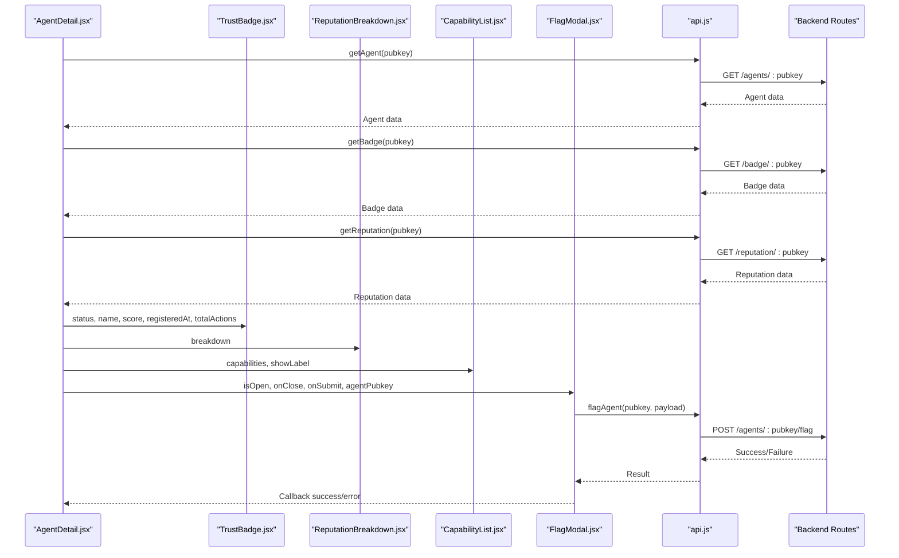
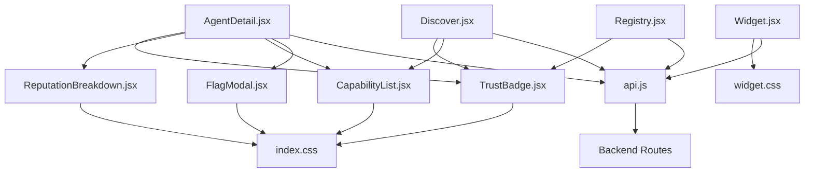

# UI Components

<cite>
**Referenced Files in This Document**
- [TrustBadge.jsx](file://frontend/src/components/TrustBadge.jsx)
- [ReputationBreakdown.jsx](file://frontend/src/components/ReputationBreakdown.jsx)
- [CapabilityList.jsx](file://frontend/src/components/CapabilityList.jsx)
- [FlagModal.jsx](file://frontend/src/components/FlagModal.jsx)
- [AgentDetail.jsx](file://frontend/src/pages/AgentDetail.jsx)
- [Discover.jsx](file://frontend/src/pages/Discover.jsx)
- [Registry.jsx](file://frontend/src/pages/Registry.jsx)
- [Widget.jsx](file://frontend/src/widget/Widget.jsx)
- [widget-entry.jsx](file://frontend/src/widget/widget-entry.jsx)
- [index.css](file://frontend/src/index.css)
- [widget.css](file://frontend/src/widget/widget.css)
- [api.js](file://frontend/src/lib/api.js)
</cite>

## Table of Contents
1. [Introduction](#introduction)
2. [Project Structure](#project-structure)
3. [Core Components](#core-components)
4. [Architecture Overview](#architecture-overview)
5. [Detailed Component Analysis](#detailed-component-analysis)
6. [Dependency Analysis](#dependency-analysis)
7. [Performance Considerations](#performance-considerations)
8. [Troubleshooting Guide](#troubleshooting-guide)
9. [Conclusion](#conclusion)
10. [Appendices](#appendices)

## Introduction
This document provides comprehensive documentation for the AgentID reusable UI components: TrustBadge, ReputationBreakdown, CapabilityList, and FlagModal. It covers component architecture, props interfaces, styling approaches using TailwindCSS variables, accessibility considerations, responsive design patterns, usage examples, customization options, and integration patterns with the application state and backend API.

## Project Structure
The UI components are located under the frontend/src/components directory and are integrated into several pages and the widget system. The styling system relies on CSS variables defined in index.css and widget.css, enabling consistent theming across the application and embedded widget.

```mermaid
graph TB
subgraph "Components"
TB["TrustBadge.jsx"]
RB["ReputationBreakdown.jsx"]
CL["CapabilityList.jsx"]
FM["FlagModal.jsx"]
end
subgraph "Pages"
AD["AgentDetail.jsx"]
DG["Discover.jsx"]
RG["Registry.jsx"]
end
subgraph "Widget"
WJ["widget-entry.jsx"]
W["Widget.jsx"]
end
subgraph "Styling"
IC["index.css"]
WC["widget.css"]
end
subgraph "API"
API["api.js"]
end
AD --> TB
AD --> RB
AD --> CL
AD --> FM
DG --> TB
RG --> TB
WJ --> W
TB --> IC
RB --> IC
CL --> IC
FM --> IC
W --> WC
AD --> API
DG --> API
RG --> API
```

**Diagram sources**
- [TrustBadge.jsx:1-145](file://frontend/src/components/TrustBadge.jsx#L1-L145)
- [ReputationBreakdown.jsx:1-165](file://frontend/src/components/ReputationBreakdown.jsx#L1-L165)
- [CapabilityList.jsx:1-111](file://frontend/src/components/CapabilityList.jsx#L1-L111)
- [FlagModal.jsx:1-201](file://frontend/src/components/FlagModal.jsx#L1-L201)
- [AgentDetail.jsx:1-501](file://frontend/src/pages/AgentDetail.jsx#L1-L501)
- [Discover.jsx:1-421](file://frontend/src/pages/Discover.jsx#L1-L421)
- [Registry.jsx:1-276](file://frontend/src/pages/Registry.jsx#L1-L276)
- [Widget.jsx:1-218](file://frontend/src/widget/Widget.jsx#L1-L218)
- [widget-entry.jsx:1-11](file://frontend/src/widget/widget-entry.jsx#L1-L11)
- [index.css:1-163](file://frontend/src/index.css#L1-L163)
- [widget.css:1-70](file://frontend/src/widget/widget.css#L1-L70)
- [api.js:1-140](file://frontend/src/lib/api.js#L1-L140)

**Section sources**
- [TrustBadge.jsx:1-145](file://frontend/src/components/TrustBadge.jsx#L1-L145)
- [ReputationBreakdown.jsx:1-165](file://frontend/src/components/ReputationBreakdown.jsx#L1-L165)
- [CapabilityList.jsx:1-111](file://frontend/src/components/CapabilityList.jsx#L1-L111)
- [FlagModal.jsx:1-201](file://frontend/src/components/FlagModal.jsx#L1-L201)
- [index.css:1-163](file://frontend/src/index.css#L1-L163)
- [widget.css:1-70](file://frontend/src/widget/widget.css#L1-L70)
- [api.js:1-140](file://frontend/src/lib/api.js#L1-L140)

## Core Components
This section outlines the primary UI components and their roles within the AgentID ecosystem.

- TrustBadge: Displays agent trust status with visual indicators, score, and metadata. Supports verified, unverified, and flagged states with distinct styling and glow effects.
- ReputationBreakdown: Presents a five-factor reputation scoring system with progress bars, color-coded labels, and a total score with quality classification.
- CapabilityList: Renders agent capabilities with categorized styling, icons, and optional labels. Provides a compact display suitable for lists and detail views.
- FlagModal: Handles community moderation workflows with form validation, JSON evidence parsing, and submission to the backend API.

**Section sources**
- [TrustBadge.jsx:42-135](file://frontend/src/components/TrustBadge.jsx#L42-L135)
- [ReputationBreakdown.jsx:46-144](file://frontend/src/components/ReputationBreakdown.jsx#L46-L144)
- [CapabilityList.jsx:69-105](file://frontend/src/components/CapabilityList.jsx#L69-L105)
- [FlagModal.jsx:4-201](file://frontend/src/components/FlagModal.jsx#L4-L201)

## Architecture Overview
The components integrate with the application’s state management and backend API through dedicated hooks and page-level logic. Pages orchestrate data fetching, state updates, and component rendering while passing props and callbacks to child components.



**Diagram sources**
- [AgentDetail.jsx:167-230](file://frontend/src/pages/AgentDetail.jsx#L167-L230)
- [TrustBadge.jsx:42-135](file://frontend/src/components/TrustBadge.jsx#L42-L135)
- [ReputationBreakdown.jsx:46-144](file://frontend/src/components/ReputationBreakdown.jsx#L46-L144)
- [CapabilityList.jsx:69-105](file://frontend/src/components/CapabilityList.jsx#L69-L105)
- [FlagModal.jsx:4-201](file://frontend/src/components/FlagModal.jsx#L4-L201)
- [api.js:1-140](file://frontend/src/lib/api.js#L1-L140)

## Detailed Component Analysis

### TrustBadge Component
TrustBadge renders a visually rich trust indicator with status-specific styling, score display, and metadata. It uses TailwindCSS classes bound to CSS variables for consistent theming and supports a className prop for additional customization.

Props
- status: One of 'verified', 'unverified', 'flagged'. Defaults to 'unverified'.
- name: Optional agent name to display below the status label.
- score: Optional numeric score out of 100 to display prominently.
- registeredAt: Optional ISO date string for registration date formatting.
- totalActions: Optional number of actions performed by the agent.
- className: Optional additional Tailwind classes to customize layout and sizing.

Styling and Theming
- Uses CSS variables for colors and borders (e.g., --accent-emerald, --accent-amber, --accent-red).
- Applies status-specific background, border, and glow classes.
- Utilizes gradient overlays and subtle animations for depth and interactivity.

Accessibility and Responsiveness
- Responsive layout adapts to different screen sizes.
- Focus-visible outlines and hover states improve keyboard navigation and interaction feedback.

Usage Patterns
- Integrated in AgentDetail hero section and Registry agent cards.
- Supports both large and compact layouts via className.

Customization Options
- Override default status styling by passing additional Tailwind classes via className.
- Conditionally render name, score, and metadata based on provided props.

Integration Notes
- Consumes data from getAgent, getBadge, and getReputation APIs.
- Used in both main application and widget contexts with slightly different styling variants.

**Section sources**
- [TrustBadge.jsx:42-135](file://frontend/src/components/TrustBadge.jsx#L42-L135)
- [AgentDetail.jsx:307-360](file://frontend/src/pages/AgentDetail.jsx#L307-L360)
- [Registry.jsx:221-238](file://frontend/src/pages/Registry.jsx#L221-L238)
- [Widget.jsx:16-59](file://frontend/src/widget/Widget.jsx#L16-L59)

#### TrustBadge Props Interface
- status: PropTypes.oneOf(['verified', 'unverified', 'flagged'])
- name: PropTypes.string
- score: PropTypes.number
- registeredAt: PropTypes.string
- totalActions: PropTypes.number
- className: PropTypes.string

**Section sources**
- [TrustBadge.jsx:137-144](file://frontend/src/components/TrustBadge.jsx#L137-L144)

### ReputationBreakdown Component
ReputationBreakdown displays a five-factor scoring system with progress bars, color-coded labels, and a total score with quality classification. It accepts a breakdown object and computes totals and percentages.

Props
- breakdown: PropTypes.shape with keys:
  - feeActivity: number or { score, max }
  - successRate: number or { score, max }
  - age: number or { score, max }
  - saidTrust: number or { score, max }
  - community: number or { score, max }

Default Behavior
- If no breakdown is provided, defaults to zero scores across all factors.

Styling and Theming
- Uses colorMap entries mapped to CSS variables for gradients and glow effects.
- Applies Tailwind classes for progress bar backgrounds and fills.
- Includes a legend indicating score quality thresholds.

Accessibility and Responsiveness
- Responsive layout with stacked bars on smaller screens.
- Clear labeling and color coding aid comprehension.

Usage Patterns
- Integrated in AgentDetail page under the reputation section.
- Suitable for both detailed dashboards and summary displays.

Customization Options
- Modify category weights by adjusting the categories array and max values.
- Customize color scheme by updating colorMap entries.

**Section sources**
- [ReputationBreakdown.jsx:46-144](file://frontend/src/components/ReputationBreakdown.jsx#L46-L144)
- [AgentDetail.jsx:367-369](file://frontend/src/pages/AgentDetail.jsx#L367-L369)

#### ReputationBreakdown Props Interface
- breakdown: PropTypes.shape with keys feeActivity, successRate, age, saidTrust, community.

**Section sources**
- [ReputationBreakdown.jsx:146-154](file://frontend/src/components/ReputationBreakdown.jsx#L146-L154)

### CapabilityList Component
CapabilityList renders agent capabilities with categorized styling and icons. It supports optional labels and provides a compact, interactive display.

Props
- capabilities: PropTypes.arrayOf(PropTypes.string). Defaults to an empty array.
- showLabel: PropTypes.bool. When true, displays a small "Capabilities" label.

Styling and Theming
- Uses capabilityColors mapping based on capability prefixes (e.g., bags.*, infra).
- Applies hover scaling and shadow transitions for interactivity.
- Icons are selected based on capability keywords.

Accessibility and Responsiveness
- Wraps capabilities to accommodate long lists.
- Hover and focus states enhance discoverability.

Usage Patterns
- Integrated in AgentDetail under the capabilities section.
- Can be used in Discover results and Registry listings.

Customization Options
- Extend capabilityColors to support new capability categories.
- Adjust icon selection logic for additional capability types.

**Section sources**
- [CapabilityList.jsx:69-105](file://frontend/src/components/CapabilityList.jsx#L69-L105)
- [AgentDetail.jsx:459-462](file://frontend/src/pages/AgentDetail.jsx#L459-L462)

#### CapabilityList Props Interface
- capabilities: PropTypes.arrayOf(PropTypes.string)
- showLabel: PropTypes.bool

**Section sources**
- [CapabilityList.jsx:107-110](file://frontend/src/components/CapabilityList.jsx#L107-L110)

### FlagModal Component
FlagModal provides a modal interface for community moderation, including form validation, JSON evidence parsing, and submission to the backend API.

Props
- isOpen: PropTypes.bool.isRequired
- onClose: PropTypes.func.isRequired
- onSubmit: PropTypes.func.isRequired
- agentPubkey: PropTypes.string.isRequired

Form Fields and Validation
- Reporter Pubkey: Optional wallet address; falls back to 'anonymous' if empty.
- Reason: Required field; prevents submission if empty.
- Evidence: Optional JSON payload; validates JSON syntax and parses on submit.

Submission Workflow
- Prevents concurrent submissions via isSubmitting state.
- On success, clears form fields, closes modal, and invokes onClose.
- On failure, displays error messages and keeps modal open.

Styling and Theming
- Uses glass morphism and backdrop blur for modal presentation.
- Status-specific header styling with red accents.
- Disabled states and loading indicators during submission.

Accessibility and Responsiveness
- Backdrop click to close when not submitting.
- Focus management and keyboard-friendly controls.

Usage Patterns
- Triggered from AgentDetail action buttons.
- Integrates with page state to manage visibility and submission callbacks.

Customization Options
- Extend form fields by adding new inputs and validation rules.
- Integrate with wallet connect for automatic reporterPubkey population.

**Section sources**
- [FlagModal.jsx:4-201](file://frontend/src/components/FlagModal.jsx#L4-L201)
- [AgentDetail.jsx:491-498](file://frontend/src/pages/AgentDetail.jsx#L491-L498)

#### FlagModal Props Interface
- isOpen: PropTypes.bool.isRequired
- onClose: PropTypes.func.isRequired
- onSubmit: PropTypes.func.isRequired
- agentPubkey: PropTypes.string.isRequired

**Section sources**
- [FlagModal.jsx:195-200](file://frontend/src/components/FlagModal.jsx#L195-L200)

## Dependency Analysis
The components depend on shared styling variables and page-level state management. They interact with the backend API through dedicated functions exported from api.js.



**Diagram sources**
- [TrustBadge.jsx:1-145](file://frontend/src/components/TrustBadge.jsx#L1-L145)
- [ReputationBreakdown.jsx:1-165](file://frontend/src/components/ReputationBreakdown.jsx#L1-L165)
- [CapabilityList.jsx:1-111](file://frontend/src/components/CapabilityList.jsx#L1-L111)
- [FlagModal.jsx:1-201](file://frontend/src/components/FlagModal.jsx#L1-L201)
- [AgentDetail.jsx:1-501](file://frontend/src/pages/AgentDetail.jsx#L1-L501)
- [Discover.jsx:1-421](file://frontend/src/pages/Discover.jsx#L1-L421)
- [Registry.jsx:1-276](file://frontend/src/pages/Registry.jsx#L1-L276)
- [Widget.jsx:1-218](file://frontend/src/widget/Widget.jsx#L1-L218)
- [index.css:1-163](file://frontend/src/index.css#L1-L163)
- [widget.css:1-70](file://frontend/src/widget/widget.css#L1-L70)
- [api.js:1-140](file://frontend/src/lib/api.js#L1-L140)

**Section sources**
- [api.js:1-140](file://frontend/src/lib/api.js#L1-L140)
- [index.css:1-163](file://frontend/src/index.css#L1-L163)
- [widget.css:1-70](file://frontend/src/widget/widget.css#L1-L70)

## Performance Considerations
- Lazy loading and skeleton loaders are implemented in pages to improve perceived performance during data fetching.
- Minimal re-renders: components accept pre-fetched data and rely on page-level state management.
- Efficient progress bar rendering: ReputationBreakdown computes percentages once and applies CSS transitions for smooth animations.
- Modal lazy mounting: FlagModal only renders when isOpen is true, reducing DOM overhead.

[No sources needed since this section provides general guidance]

## Troubleshooting Guide
Common Issues and Resolutions
- Missing or invalid agent data: Pages handle 404 and error states gracefully, displaying user-friendly messages and retry options.
- Flag submission failures: FlagModal surfaces error messages and preserves form state for correction.
- JSON evidence validation errors: FlagModal validates JSON syntax and displays clear error messages.
- Styling inconsistencies: Ensure CSS variables are defined in index.css or widget.css depending on context.

Debugging Tips
- Verify API responses for expected shapes (e.g., breakdown, badges, capabilities).
- Check Tailwind classes against CSS variable definitions.
- Confirm event handlers (onSubmit, onClose) are passed correctly from parent components.

**Section sources**
- [AgentDetail.jsx:232-284](file://frontend/src/pages/AgentDetail.jsx#L232-L284)
- [FlagModal.jsx:13-50](file://frontend/src/components/FlagModal.jsx#L13-L50)

## Conclusion
The AgentID UI components provide a cohesive, accessible, and responsive foundation for displaying agent trust, reputation, capabilities, and moderation workflows. Their integration with the application state and backend API ensures consistent behavior across pages and the embedded widget. By leveraging TailwindCSS variables and modular component design, developers can easily customize and extend functionality while maintaining visual coherence.

[No sources needed since this section summarizes without analyzing specific files]

## Appendices

### Styling Variables Reference
Key CSS variables used across components:
- Background and text colors: --bg-primary, --bg-secondary, --bg-tertiary, --text-primary, --text-secondary, --text-muted
- Accent colors: --accent-cyan, --accent-emerald, --accent-amber, --accent-red, --accent-purple
- Borders and shadows: --border-subtle, --border-default, --border-focus, --shadow-sm, --shadow-md, --shadow-lg
- Typography: --font-sans, --font-mono

Status badge utilities and glass morphism are defined for consistent theming.

**Section sources**
- [index.css:3-42](file://frontend/src/index.css#L3-L42)
- [index.css:129-162](file://frontend/src/index.css#L129-L162)
- [widget.css:3-25](file://frontend/src/widget/widget.css#L3-L25)

### API Integration Patterns
- Centralized API client in api.js handles base URLs, interceptors, and endpoint functions.
- Pages orchestrate data fetching using Promise.all for concurrent requests and error boundaries.
- Widget uses its own axios instance with configurable base URL for iframe embedding.

**Section sources**
- [api.js:1-140](file://frontend/src/lib/api.js#L1-L140)
- [AgentDetail.jsx:180-212](file://frontend/src/pages/AgentDetail.jsx#L180-L212)
- [Widget.jsx:7-14](file://frontend/src/widget/Widget.jsx#L7-L14)

### Usage Examples and Integration Patterns
- AgentDetail integrates TrustBadge, ReputationBreakdown, CapabilityList, and FlagModal to present comprehensive agent information and moderation controls.
- Discover and Registry pages showcase TrustBadge in list contexts with search and filtering capabilities.
- Widget provides a minimal, self-contained badge display suitable for third-party embedding.

**Section sources**
- [AgentDetail.jsx:307-498](file://frontend/src/pages/AgentDetail.jsx#L307-L498)
- [Discover.jsx:329-398](file://frontend/src/pages/Discover.jsx#L329-L398)
- [Registry.jsx:221-238](file://frontend/src/pages/Registry.jsx#L221-L238)
- [Widget.jsx:61-215](file://frontend/src/widget/Widget.jsx#L61-L215)