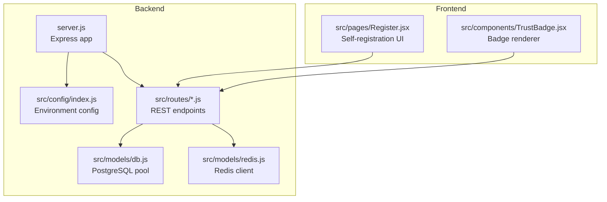
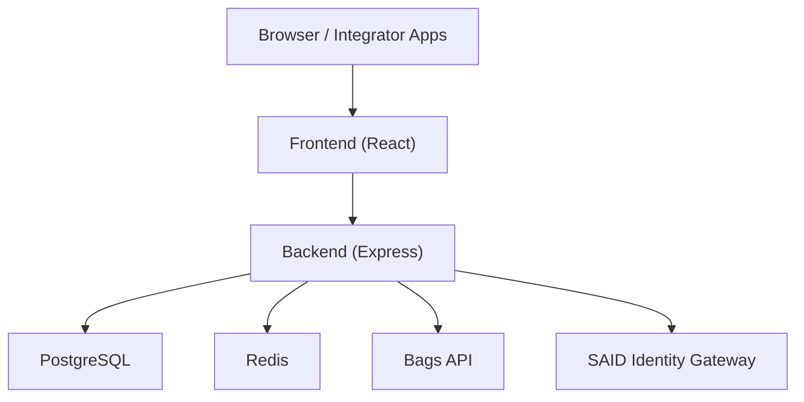
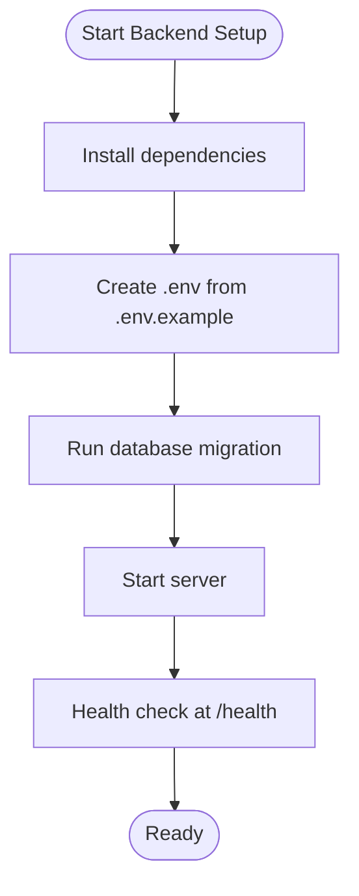
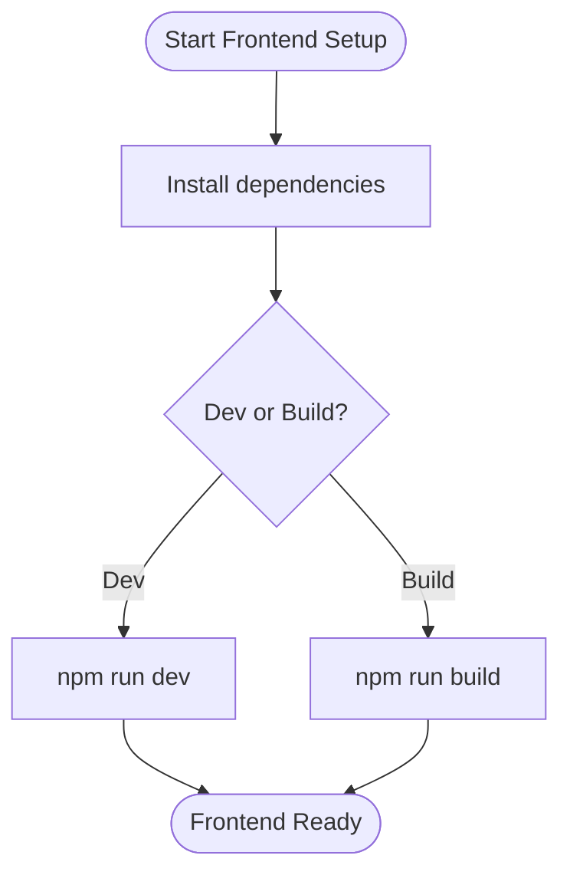
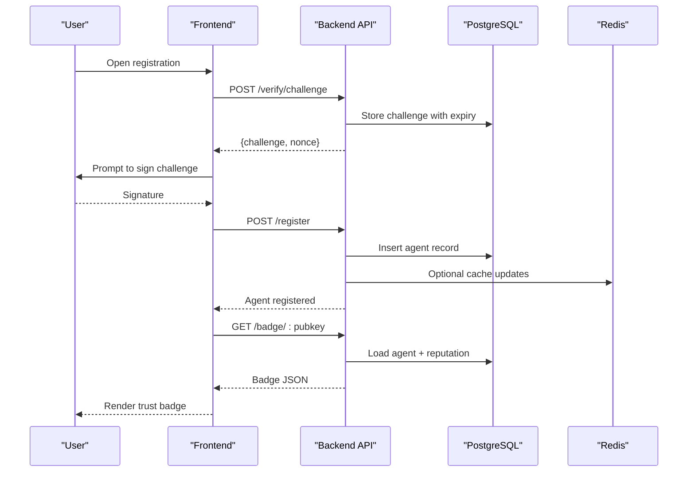
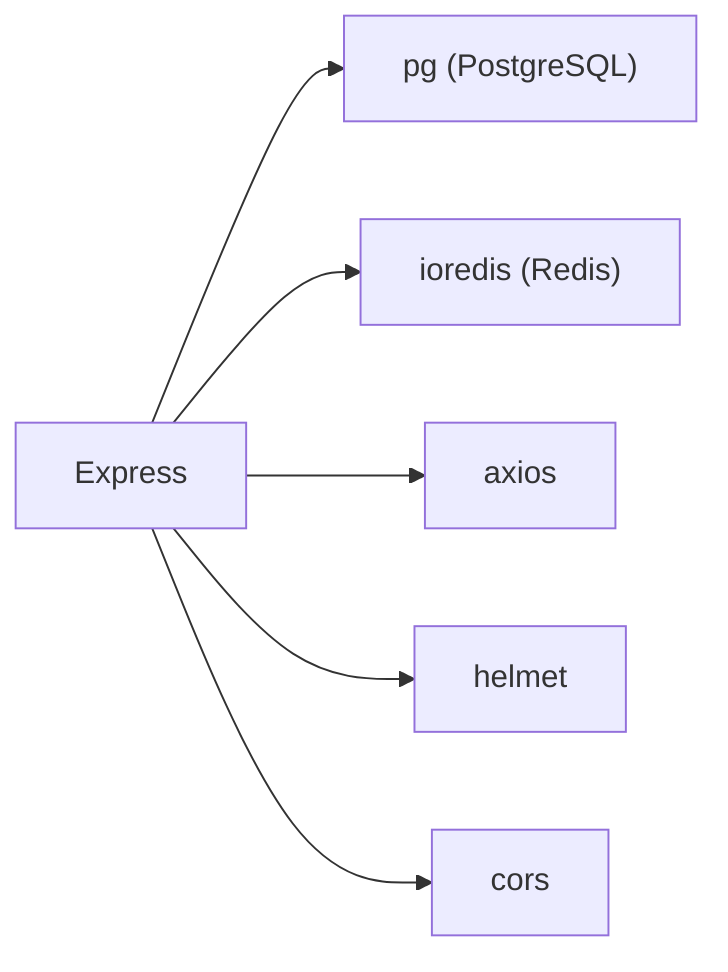

# Getting Started

<cite>
**Referenced Files in This Document**
- [agentid_build_plan.md](file://agentid_build_plan.md)
- [backend/package.json](file://backend/package.json)
- [backend/server.js](file://backend/server.js)
- [backend/src/config/index.js](file://backend/src/config/index.js)
- [backend/src/models/db.js](file://backend/src/models/db.js)
- [backend/src/models/migrate.js](file://backend/src/models/migrate.js)
- [backend/src/models/redis.js](file://backend/src/models/redis.js)
- [backend/src/routes/register.js](file://backend/src/routes/register.js)
- [backend/src/routes/badge.js](file://backend/src/routes/badge.js)
- [backend/.env.example](file://backend/.env.example)
- [frontend/package.json](file://frontend/package.json)
- [frontend/src/pages/Register.jsx](file://frontend/src/pages/Register.jsx)
- [frontend/src/components/TrustBadge.jsx](file://frontend/src/components/TrustBadge.jsx)
</cite>

## Table of Contents
1. [Introduction](#introduction)
2. [Project Structure](#project-structure)
3. [Core Components](#core-components)
4. [Architecture Overview](#architecture-overview)
5. [Detailed Component Analysis](#detailed-component-analysis)
6. [Dependency Analysis](#dependency-analysis)
7. [Performance Considerations](#performance-considerations)
8. [Troubleshooting Guide](#troubleshooting-guide)
9. [Conclusion](#conclusion)
10. [Appendices](#appendices)

## Introduction
AgentID is a trust verification layer for Bags AI agents. It wraps Bags’ Ed25519 agent authentication, binds identities to the Solana Agent Registry (SAID Protocol), adds Bags-specific reputation scoring, and surfaces a human-readable trust badge inside Bags chat. This guide helps you install, configure, and deploy AgentID for both development and production, and demonstrates the end-to-end workflow from registration to trust badge display.

## Project Structure
AgentID is organized into two primary parts:
- Backend: Node.js/Express API with PostgreSQL and Redis, exposing REST endpoints for registration, verification, badges, reputation, and widgets.
- Frontend: React-based registry explorer and self-registration UI.

**Diagram sources**
- [backend/server.js:1-76](file://backend/server.js#L1-L76)
- [backend/src/config/index.js:1-30](file://backend/src/config/index.js#L1-L30)
- [backend/src/models/db.js:1-45](file://backend/src/models/db.js#L1-L45)
- [backend/src/models/redis.js:1-94](file://backend/src/models/redis.js#L1-L94)
- [frontend/src/pages/Register.jsx:1-673](file://frontend/src/pages/Register.jsx#L1-L673)
- [frontend/src/components/TrustBadge.jsx:1-145](file://frontend/src/components/TrustBadge.jsx#L1-L145)

**Section sources**
- [agentid_build_plan.md:258-302](file://agentid_build_plan.md#L258-L302)
- [backend/server.js:1-76](file://backend/server.js#L1-L76)
- [frontend/package.json:1-33](file://frontend/package.json#L1-L33)

## Core Components
- Configuration: Centralized environment-driven configuration for ports, external APIs, database, Redis, CORS, and cache TTLs.
- Database: PostgreSQL-backed agent registry, verifications, and flags with migrations.
- Cache: Redis for challenge nonces and badge caching.
- API: REST endpoints for registration, verification, badges, reputation, discovery, and widgets.
- Frontend: Registration wizard and trust badge rendering.

**Section sources**
- [backend/src/config/index.js:6-27](file://backend/src/config/index.js#L6-L27)
- [backend/src/models/db.js:10-18](file://backend/src/models/db.js#L10-L18)
- [backend/src/models/migrate.js:9-64](file://backend/src/models/migrate.js#L9-L64)
- [backend/src/models/redis.js:10-20](file://backend/src/models/redis.js#L10-L20)
- [backend/server.js:47-53](file://backend/server.js#L47-L53)

## Architecture Overview
AgentID’s runtime architecture integrates external services (Bags API, SAID Gateway) with local PostgreSQL and Redis. The frontend consumes the backend API to register agents and render trust badges.

**Diagram sources**
- [agentid_build_plan.md:1-330](file://agentid_build_plan.md#L1-L330)
- [backend/src/config/index.js:12-13](file://backend/src/config/index.js#L12-L13)
- [backend/src/config/index.js:16-19](file://backend/src/config/index.js#L16-L19)

## Detailed Component Analysis

### System Requirements
- Node.js 20.x (backend scripts and runtime)
- PostgreSQL (database for agent registry and verifications)
- Redis (cache and nonce storage)
- Environment variables for API keys, URLs, database, Redis, CORS, and cache TTLs

**Section sources**
- [agentid_build_plan.md:258-302](file://agentid_build_plan.md#L258-L302)
- [backend/package.json:6-9](file://backend/package.json#L6-L9)
- [backend/.env.example:1-10](file://backend/.env.example#L1-L10)

### Installation and Setup

#### Backend Setup
1. Install dependencies
   - Use the backend package manager to install production dependencies.
2. Configure environment variables
   - Copy the example environment file and set values for ports, API keys, database URL, Redis URL, CORS origin, and cache TTLs.
3. Initialize the database
   - Run the migration script to create tables and indexes.
4. Start the backend server
   - Use the configured port and environment.

**Diagram sources**
- [backend/.env.example:1-10](file://backend/.env.example#L1-L10)
- [backend/src/models/migrate.js:66-91](file://backend/src/models/migrate.js#L66-L91)
- [backend/server.js:35-41](file://backend/server.js#L35-L41)

**Section sources**
- [backend/package.json:6-9](file://backend/package.json#L6-L9)
- [backend/.env.example:1-10](file://backend/.env.example#L1-L10)
- [backend/src/models/migrate.js:66-91](file://backend/src/models/migrate.js#L66-L91)
- [backend/server.js:67-73](file://backend/server.js#L67-L73)

#### Frontend Setup
1. Install dependencies
   - Use the frontend package manager to install dependencies.
2. Build or run the development server
   - Use the provided scripts to develop or build the UI.

**Diagram sources**
- [frontend/package.json:6-11](file://frontend/package.json#L6-L11)

**Section sources**
- [frontend/package.json:6-11](file://frontend/package.json#L6-L11)

### Environment Configuration
Key environment variables include:
- PORT, NODE_ENV
- BAGS_API_KEY
- SAID_GATEWAY_URL
- DATABASE_URL
- REDIS_URL
- CORS_ORIGIN
- BADGE_CACHE_TTL, CHALLENGE_EXPIRY_SECONDS

Ensure these are set consistently in both development and production.

**Section sources**
- [backend/src/config/index.js:6-27](file://backend/src/config/index.js#L6-L27)
- [backend/.env.example:1-10](file://backend/.env.example#L1-L10)

### Initial Deployment

#### Development
- Start the backend server in development mode.
- Start the frontend development server.
- Access the frontend locally and use the backend health endpoint to confirm readiness.

**Section sources**
- [backend/package.json:8](file://backend/package.json#L8)
- [frontend/package.json:7](file://frontend/package.json#L7)
- [backend/server.js:35-41](file://backend/server.js#L35-L41)

#### Production
- Choose a domain and SSL termination (e.g., Nginx + certbot).
- Run the backend server with production environment.
- Ensure PostgreSQL and Redis are reachable from the server.
- Expose the backend on the chosen domain and port.

Note: The build plan documents a typical deployment approach on a VPS with a dedicated port and reverse proxy.

**Section sources**
- [agentid_build_plan.md:304-330](file://agentid_build_plan.md#L304-L330)
- [backend/src/config/index.js:8](file://backend/src/config/index.js#L8)
- [backend/src/models/db.js:13-17](file://backend/src/models/db.js#L13-L17)

### Basic Workflow: From Registration to Trust Badge
1. User initiates registration in the frontend.
2. The frontend requests a challenge from the backend.
3. The user signs the challenge with their Ed25519 key and submits the signature.
4. The backend validates the signature against Bags auth and registers the agent.
5. The frontend displays the trust badge with status and score.

**Diagram sources**
- [frontend/src/pages/Register.jsx:295-341](file://frontend/src/pages/Register.jsx#L295-L341)
- [backend/src/routes/register.js:59-153](file://backend/src/routes/register.js#L59-L153)
- [backend/src/routes/badge.js:16-32](file://backend/src/routes/badge.js#L16-L32)
- [backend/src/models/migrate.js:9-64](file://backend/src/models/migrate.js#L9-L64)
- [backend/src/models/redis.js:41-71](file://backend/src/models/redis.js#L41-L71)

**Section sources**
- [frontend/src/pages/Register.jsx:295-341](file://frontend/src/pages/Register.jsx#L295-L341)
- [backend/src/routes/register.js:59-153](file://backend/src/routes/register.js#L59-L153)
- [backend/src/routes/badge.js:16-32](file://backend/src/routes/badge.js#L16-L32)

### Automated vs Manual Deployment
- Manual setup: Follow the environment configuration, run migrations, start servers, and expose endpoints.
- Automated deployment: Package the backend and frontend artifacts, containerize if desired, and orchestrate with your platform of choice. Ensure environment variables are injected and database/Redis are provisioned externally.

[No sources needed since this section provides general guidance]

## Dependency Analysis
AgentID’s backend depends on:
- Express for routing and middleware
- PostgreSQL via pg for persistence
- Redis via ioredis for caching and nonce storage
- External services for authentication and identity binding

**Diagram sources**
- [backend/package.json:18-30](file://backend/package.json#L18-L30)
- [backend/server.js:3-8](file://backend/server.js#L3-L8)

**Section sources**
- [backend/package.json:18-30](file://backend/package.json#L18-L30)
- [backend/server.js:3-8](file://backend/server.js#L3-L8)

## Performance Considerations
- Use Redis for challenge nonces and badge caching to reduce database load.
- Apply rate limiting and security middleware to protect endpoints.
- Tune database indexes for frequent queries (status, score, flags).
- Consider SSL for production PostgreSQL connections when applicable.

[No sources needed since this section provides general guidance]

## Troubleshooting Guide
Common issues and resolutions:
- Database connectivity
  - Verify DATABASE_URL and that PostgreSQL is running and accessible.
  - Confirm migrations succeeded and tables exist.
- Redis connectivity
  - Ensure REDIS_URL points to a running Redis instance.
  - Check retry strategy logs for transient failures.
- CORS errors
  - Set CORS_ORIGIN to match the frontend origin.
- Health checks
  - Confirm the backend responds to the health endpoint.
- Registration failures
  - Validate that the signature matches the challenge and nonce requirements.
  - Ensure the agent pubkey is valid and not already registered.

**Section sources**
- [backend/src/models/db.js:21-23](file://backend/src/models/db.js#L21-L23)
- [backend/src/models/redis.js:23-34](file://backend/src/models/redis.js#L23-L34)
- [backend/src/config/index.js:22](file://backend/src/config/index.js#L22)
- [backend/server.js:35-41](file://backend/server.js#L35-L41)
- [backend/src/routes/register.js:82-95](file://backend/src/routes/register.js#L82-L95)

## Conclusion
You now have the essentials to install, configure, and deploy AgentID. Use the environment configuration, run migrations, start both backend and frontend, and follow the registration workflow to display trust badges. For production, secure endpoints, manage secrets, and scale Redis and PostgreSQL appropriately.

[No sources needed since this section summarizes without analyzing specific files]

## Appendices

### Environment Variables Reference
- PORT: Backend server port
- NODE_ENV: Environment mode
- BAGS_API_KEY: API key for Bags integration
- SAID_GATEWAY_URL: SAID Identity Gateway URL
- DATABASE_URL: PostgreSQL connection string
- REDIS_URL: Redis connection string
- CORS_ORIGIN: Allowed frontend origin
- BADGE_CACHE_TTL: Badge cache TTL in seconds
- CHALLENGE_EXPIRY_SECONDS: Challenge expiry in seconds

**Section sources**
- [backend/.env.example:1-10](file://backend/.env.example#L1-L10)
- [backend/src/config/index.js:8-26](file://backend/src/config/index.js#L8-L26)

### API Quick Reference
- POST /register: Register agent with Bags auth and SAID binding
- POST /verify/challenge: Issue challenge for signature
- POST /verify/response: Submit signed response
- GET /badge/:pubkey: Retrieve trust badge JSON
- GET /badge/:pubkey/svg: Retrieve trust badge SVG
- GET /reputation/:pubkey: Full reputation breakdown
- GET /agents, GET /agents/:pubkey, GET /discover: Agent listings and discovery
- POST /agents/:pubkey/attest, POST /agents/:pubkey/flag: Attestations and flagging
- GET /widget/:pubkey: Embeddable trust badge HTML

**Section sources**
- [agentid_build_plan.md:228-247](file://agentid_build_plan.md#L228-L247)
- [backend/server.js:47-53](file://backend/server.js#L47-L53)