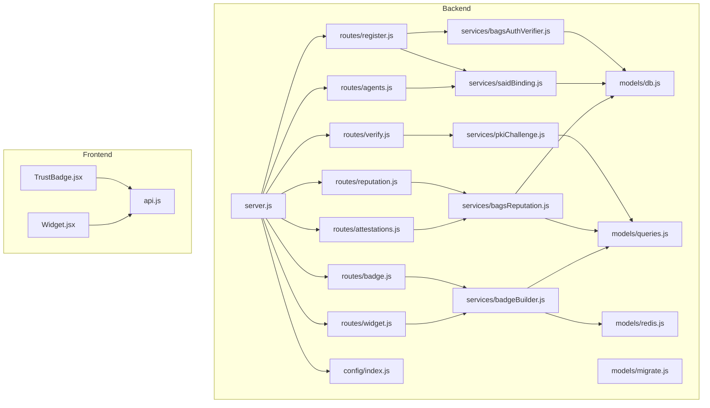
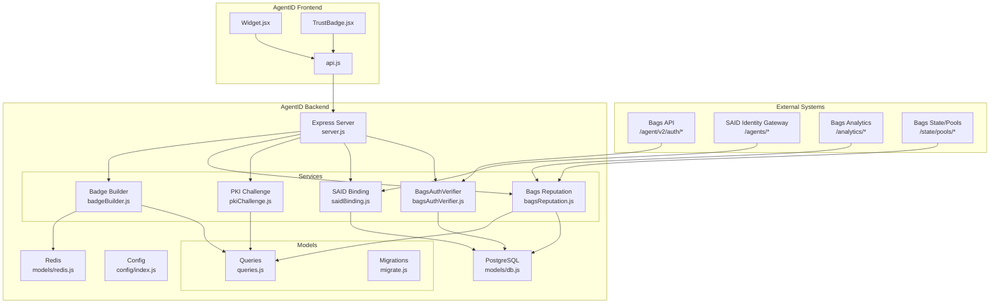
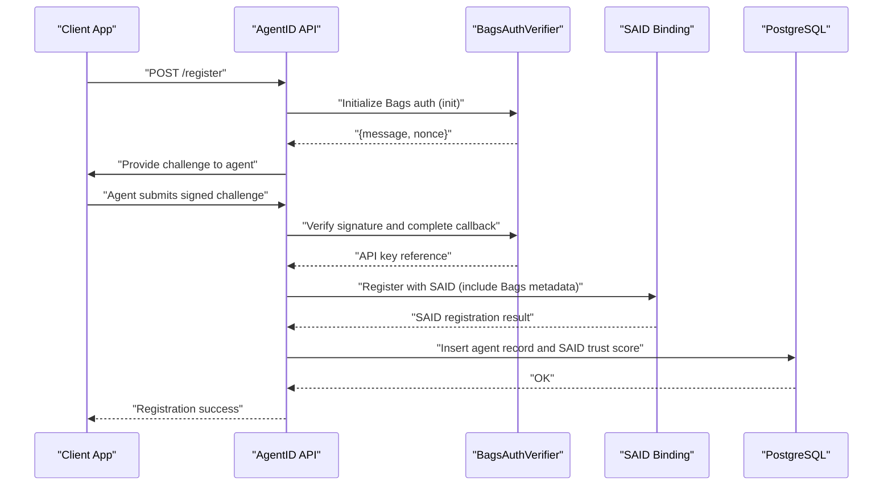
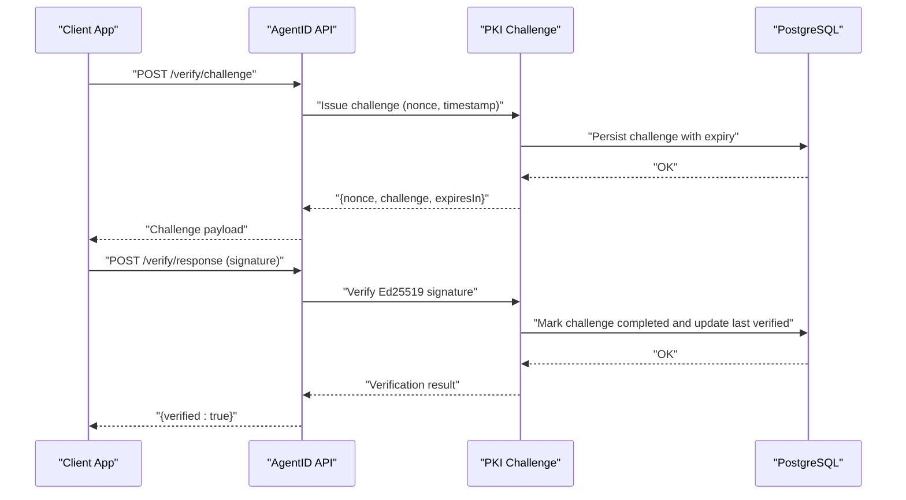
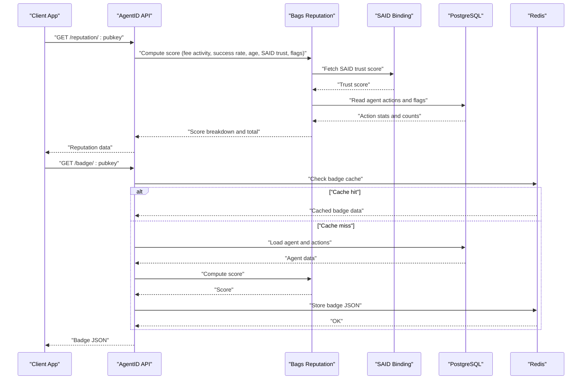
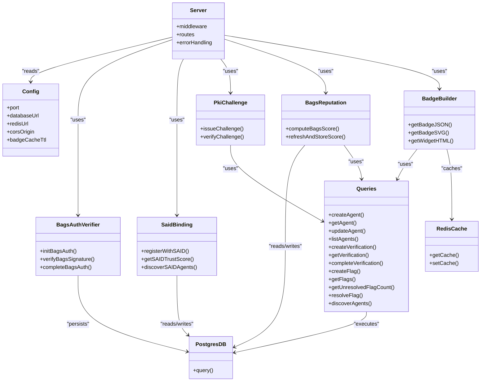
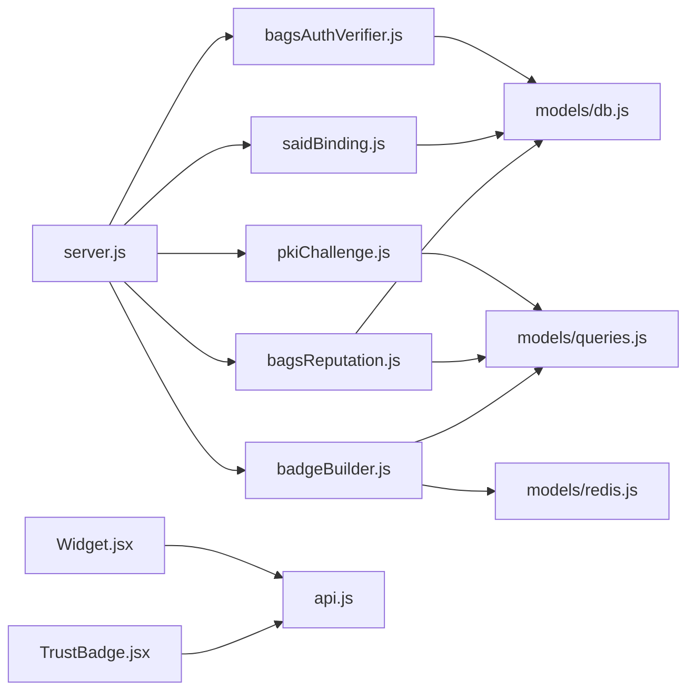

# Architecture Overview

<cite>
**Referenced Files in This Document**
- [agentid_build_plan.md](file://agentid_build_plan.md)
- [server.js](file://backend/server.js)
- [config/index.js](file://backend/src/config/index.js)
- [package.json](file://backend/package.json)
- [bagsAuthVerifier.js](file://backend/src/services/bagsAuthVerifier.js)
- [saidBinding.js](file://backend/src/services/saidBinding.js)
- [pkiChallenge.js](file://backend/src/services/pkiChallenge.js)
- [bagsReputation.js](file://backend/src/services/bagsReputation.js)
- [badgeBuilder.js](file://backend/src/services/badgeBuilder.js)
- [db.js](file://backend/src/models/db.js)
- [migrate.js](file://backend/src/models/migrate.js)
- [queries.js](file://backend/src/models/queries.js)
- [redis.js](file://backend/src/models/redis.js)
- [TrustBadge.jsx](file://frontend/src/components/TrustBadge.jsx)
- [Widget.jsx](file://frontend/src/widget/Widget.jsx)
- [api.js](file://frontend/src/lib/api.js)
</cite>

## Table of Contents
1. [Introduction](#introduction)
2. [Project Structure](#project-structure)
3. [Core Components](#core-components)
4. [Architecture Overview](#architecture-overview)
5. [Detailed Component Analysis](#detailed-component-analysis)
6. [Dependency Analysis](#dependency-analysis)
7. [Performance Considerations](#performance-considerations)
8. [Troubleshooting Guide](#troubleshooting-guide)
9. [Conclusion](#conclusion)

## Introduction
AgentID is the trust verification layer that integrates Bags’ Ed25519 agent authentication with the Solana Agent Registry (SAID Protocol), binds agent identities, computes a Bags ecosystem reputation score, and exposes a human-readable trust badge for embedding in applications. It prevents spoofing through PKI challenge-response and provides a robust foundation for agent trust in the Bags ecosystem.

## Project Structure
The system is split into two primary parts:
- Backend (Node.js/Express): API server, routing, services, models, and middleware
- Frontend (React 18/Vite): Registry UI, badge components, and an embeddable widget

**Diagram sources**
- [server.js:1-85](file://backend/server.js#L1-L85)
- [config/index.js:1-31](file://backend/src/config/index.js#L1-L31)
- [bagsAuthVerifier.js:1-93](file://backend/src/services/bagsAuthVerifier.js#L1-L93)
- [saidBinding.js:1-119](file://backend/src/services/saidBinding.js#L1-L119)
- [pkiChallenge.js:1-102](file://backend/src/services/pkiChallenge.js#L1-L102)
- [bagsReputation.js:1-146](file://backend/src/services/bagsReputation.js#L1-L146)
- [badgeBuilder.js:1-497](file://backend/src/services/badgeBuilder.js#L1-L497)
- [db.js:1-45](file://backend/src/models/db.js#L1-L45)
- [migrate.js:1-100](file://backend/src/models/migrate.js#L1-L100)
- [queries.js:1-404](file://backend/src/models/queries.js#L1-L404)
- [redis.js:1-94](file://backend/src/models/redis.js#L1-L94)
- [TrustBadge.jsx:1-145](file://frontend/src/components/TrustBadge.jsx#L1-L145)
- [Widget.jsx:1-218](file://frontend/src/widget/Widget.jsx#L1-L218)
- [api.js:1-140](file://frontend/src/lib/api.js#L1-L140)

**Section sources**
- [agentid_build_plan.md:257-302](file://agentid_build_plan.md#L257-L302)
- [server.js:19-62](file://backend/server.js#L19-L62)

## Core Components
This section documents the six core components and their roles in the AgentID system.

- Bags Agent Auth Wrapper
  - Purpose: Wrap Bags’ Ed25519 agent auth flow to verify wallet ownership during registration.
  - Key functions: Initialize challenge, verify signature, and complete callback to obtain API key reference.
  - Integration: Calls external Bags endpoints and uses Ed25519 verification.

- SAID Protocol Binding
  - Purpose: Register or verify agent identity in the SAID Identity Gateway and retrieve trust metrics.
  - Key functions: Register with SAID, fetch trust score, and discover agents by capability.
  - Integration: Communicates with SAID gateway and enriches local records.

- AgentID Database Record
  - Purpose: Persist agent identity, reputation metrics, verification challenges, and flags.
  - Schema highlights: agent_identities, agent_verifications, agent_flags with indexes for performance.
  - Integration: Used by services for reads/writes and scoring.

- PKI Challenge-Response System
  - Purpose: Ongoing verification to prevent spoofing by challenging agent actions.
  - Key functions: Issue challenge with nonce/timestamp, verify Ed25519 signature, enforce expiration and single-use.
  - Integration: Stores challenges in DB and updates last verified timestamps.

- Bags Ecosystem Reputation Score
  - Purpose: Compute a composite trust score using five factors: fee activity, success rate, registration age, SAID trust, and community verification.
  - Key functions: Query external analytics, compute weighted score, and persist results.
  - Integration: Uses both external APIs and internal DB state.

- Trust Badge API + Widget
  - Purpose: Expose trust badge data and render an embeddable widget for third-party apps.
  - Key functions: JSON badge endpoint, SVG export, and HTML widget with auto-refresh.
  - Integration: Caches badge data in Redis and renders both in-app and standalone widget.

**Section sources**
- [bagsAuthVerifier.js:18-86](file://backend/src/services/bagsAuthVerifier.js#L18-L86)
- [saidBinding.js:21-87](file://backend/src/services/saidBinding.js#L21-L87)
- [migrate.js:9-65](file://backend/src/models/migrate.js#L9-L65)
- [pkiChallenge.js:17-96](file://backend/src/services/pkiChallenge.js#L17-L96)
- [bagsReputation.js:16-140](file://backend/src/services/bagsReputation.js#L16-L140)
- [badgeBuilder.js:17-83](file://backend/src/services/badgeBuilder.js#L17-L83)

## Architecture Overview
The AgentID system orchestrates four major external integrations and internal services to provide a complete trust layer for Bags agents.

**Diagram sources**
- [server.js:12-82](file://backend/server.js#L12-L82)
- [config/index.js:6-28](file://backend/src/config/index.js#L6-L28)
- [bagsAuthVerifier.js:11-86](file://backend/src/services/bagsAuthVerifier.js#L11-L86)
- [saidBinding.js:21-112](file://backend/src/services/saidBinding.js#L21-L112)
- [pkiChallenge.js:9,17-96](file://backend/src/services/pkiChallenge.js#L9,L17-L96)
- [bagsReputation.js:6,16-140](file://backend/src/services/bagsReputation.js#L6,L16-L140)
- [badgeBuilder.js:6,17-83](file://backend/src/services/badgeBuilder.js#L6,L17-L83)
- [db.js:10-44](file://backend/src/models/db.js#L10-L44)
- [redis.js:10,41-71](file://backend/src/models/redis.js#L10,L41-L71)
- [queries.js:17-403](file://backend/src/models/queries.js#L17-L403)
- [Widget.jsx:7-14,61-102](file://frontend/src/widget/Widget.jsx#L7,L14,L61-L102)
- [TrustBadge.jsx:42-135](file://frontend/src/components/TrustBadge.jsx#L42-L135)
- [api.js:3,36-116](file://frontend/src/lib/api.js#L3,L36-L116)

## Detailed Component Analysis

### Data Flow: Agent Registration Through SAID Binding
This sequence illustrates how a new agent is registered, verified, bound to SAID, and recorded locally.

**Diagram sources**
- [bagsAuthVerifier.js:18-86](file://backend/src/services/bagsAuthVerifier.js#L18-L86)
- [saidBinding.js:21-54](file://backend/src/services/saidBinding.js#L21-L54)
- [migrate.js:11-34](file://backend/src/models/migrate.js#L11-L34)

**Section sources**
- [agentid_build_plan.md:39-62](file://agentid_build_plan.md#L39-L62)

### Data Flow: Ongoing Verification and Spoofing Prevention
This flow demonstrates the PKI challenge-response mechanism used to verify agent actions and prevent spoofing.

**Diagram sources**
- [pkiChallenge.js:17-96](file://backend/src/services/pkiChallenge.js#L17-L96)
- [queries.js:213-256](file://backend/src/models/queries.js#L213-L256)

**Section sources**
- [agentid_build_plan.md:131-184](file://agentid_build_plan.md#L131-L184)

### Data Flow: Reputation Scoring and Badge Generation
This flow shows how the Bags reputation score is computed and how the trust badge is generated and cached.

**Diagram sources**
- [bagsReputation.js:16-140](file://backend/src/services/bagsReputation.js#L16-L140)
- [badgeBuilder.js:17-83](file://backend/src/services/badgeBuilder.js#L17-L83)
- [redis.js:41-71](file://backend/src/models/redis.js#L41-L71)
- [queries.js:187-202](file://backend/src/models/queries.js#L187-L202)

**Section sources**
- [agentid_build_plan.md:185-246](file://agentid_build_plan.md#L185-L246)

### Component Relationships: Services, Models, and Middleware

**Diagram sources**
- [server.js:12-82](file://backend/server.js#L12-L82)
- [config/index.js:6-28](file://backend/src/config/index.js#L6-L28)
- [bagsAuthVerifier.js:18-86](file://backend/src/services/bagsAuthVerifier.js#L18-L86)
- [saidBinding.js:21-112](file://backend/src/services/saidBinding.js#L21-L112)
- [pkiChallenge.js:17-96](file://backend/src/services/pkiChallenge.js#L17-L96)
- [bagsReputation.js:16-140](file://backend/src/services/bagsReputation.js#L16-L140)
- [badgeBuilder.js:17-83](file://backend/src/services/badgeBuilder.js#L17-L83)
- [db.js:10-44](file://backend/src/models/db.js#L10-L44)
- [redis.js:41-71](file://backend/src/models/redis.js#L41-L71)
- [queries.js:17-403](file://backend/src/models/queries.js#L17-L403)

**Section sources**
- [server.js:19-73](file://backend/server.js#L19-L73)
- [config/index.js:6-28](file://backend/src/config/index.js#L6-L28)

## Dependency Analysis
- External Dependencies
  - Bags API: Authentication and analytics endpoints
  - SAID Identity Gateway: Agent registration and trust score retrieval
- Internal Dependencies
  - Services depend on models for persistence and Redis for caching
  - Routes orchestrate service calls and return standardized responses
- Frontend Integration
  - Widget and UI components consume the API via a shared library

**Diagram sources**
- [server.js:19-62](file://backend/server.js#L19-L62)
- [bagsAuthVerifier.js:6,11](file://backend/src/services/bagsAuthVerifier.js#L6,L11)
- [saidBinding.js:6,7](file://backend/src/services/saidBinding.js#L6,L7)
- [pkiChallenge.js:9,10](file://backend/src/services/pkiChallenge.js#L9,L10)
- [bagsReputation.js:6,8,9](file://backend/src/services/bagsReputation.js#L6,L8,L9)
- [badgeBuilder.js:6,8,9](file://backend/src/services/badgeBuilder.js#L6,L8,L9)
- [db.js:6,7](file://backend/src/models/db.js#L6,L7)
- [queries.js:6](file://backend/src/models/queries.js#L6)
- [redis.js:6,7](file://backend/src/models/redis.js#L6,L7)
- [Widget.jsx:7-14](file://frontend/src/widget/Widget.jsx#L7,L14)
- [api.js:3](file://frontend/src/lib/api.js#L3)

**Section sources**
- [package.json:20-32](file://backend/package.json#L20-L32)

## Performance Considerations
- Caching
  - Badge JSON is cached in Redis with configurable TTL to reduce repeated computation and DB load.
- Database Indexes
  - Strategic indexes on agent_identities (status, bags_score) and agent_flags (resolved) improve query performance for listings and filtering.
- Asynchronous Operations
  - External API calls are awaited with timeouts to avoid blocking and to surface failures gracefully.
- Rate Limiting and Security
  - Express rate limiter and Helmet middleware protect the API from abuse and common web vulnerabilities.

[No sources needed since this section provides general guidance]

## Troubleshooting Guide
- Missing Environment Variables
  - The server validates required variables (e.g., DATABASE_URL) and exits early with guidance if missing.
- Database Connectivity
  - PostgreSQL pool logs errors without crashing; verify connection string and SSL settings.
- Redis Availability
  - Redis client has retry strategy and graceful degradation; cache misses are handled safely.
- API Errors
  - Global error handler standardizes error responses; check route-specific handlers for detailed messages.

**Section sources**
- [server.js:4,6,72-73](file://backend/server.js#L4,L6,L72-L73)
- [db.js:21-23](file://backend/src/models/db.js#L21-L23)
- [redis.js:23-34](file://backend/src/models/redis.js#L23-L34)

## Conclusion
AgentID provides a cohesive trust layer for Bags agents by wrapping Ed25519 authentication, binding identities to SAID, computing a comprehensive reputation score, and delivering a trust badge for human-readable verification. Its modular backend services, robust database schema, and embeddable frontend widget form a scalable foundation for agent trust in the Bags ecosystem.