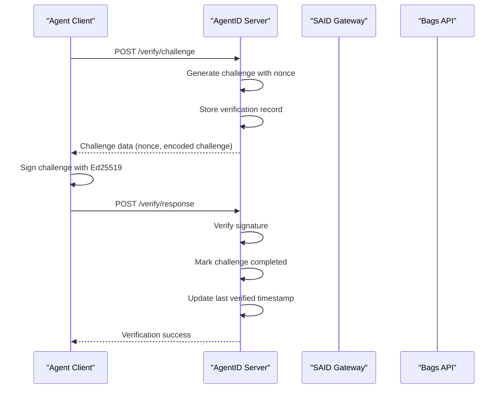
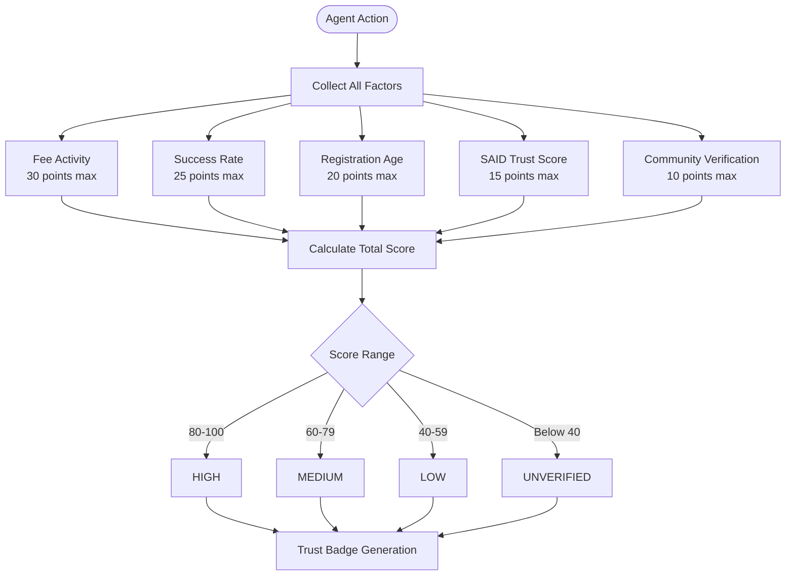
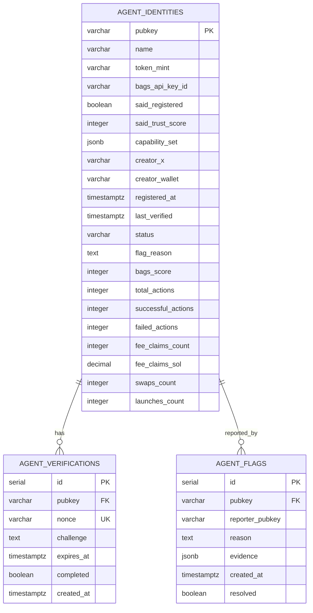

# Competitive Landscape

<cite>
**Referenced Files in This Document**
- [agentid_build_plan.md](file://agentid_build_plan.md)
- [bagsAuthVerifier.js](file://backend/src/services/bagsAuthVerifier.js)
- [saidBinding.js](file://backend/src/services/saidBinding.js)
- [pkiChallenge.js](file://backend/src/services/pkiChallenge.js)
- [bagsReputation.js](file://backend/src/services/bagsReputation.js)
- [register.js](file://backend/src/routes/register.js)
- [verify.js](file://backend/src/routes/verify.js)
- [badge.js](file://backend/src/routes/badge.js)
- [reputation.js](file://backend/src/routes/reputation.js)
- [db.js](file://backend/src/models/db.js)
- [config/index.js](file://backend/src/config/index.js)
- [TrustBadge.jsx](file://frontend/src/components/TrustBadge.jsx)
</cite>

## Table of Contents
1. [Introduction](#introduction)
2. [Executive Summary](#executive-summary)
3. [Competitive Systems Comparison](#competitive-systems-comparison)
4. [System Capabilities Matrix](#system-capabilities-matrix)
5. [AgentID's Unique Value Proposition](#agentids-unique-value-proposition)
6. [Technical Differentiators](#technical-differentiators)
7. [Market Positioning Analysis](#market-positioning-analysis)
8. [Conclusion](#conclusion)

## Introduction

The AI agent ecosystem is rapidly evolving, with multiple trust and identity systems emerging across the Solana ecosystem. However, none of these systems alone provides a complete solution for agent verification and trust establishment. This document analyzes the competitive landscape and demonstrates how AgentID serves as the missing connector that integrates fragmented trust solutions into a comprehensive identity verification platform.

The competitive landscape reveals four primary systems, each addressing specific aspects of agent identity verification but falling short of providing a complete solution. Understanding these gaps is crucial for positioning AgentID effectively in the market and communicating its unique value proposition to developers, agents, and end-users.

## Executive Summary

AgentID represents a critical missing piece in the Solana AI agent trust ecosystem. While three partial systems exist—SAID Identity Gateway, Agistry Framework, and Bags Agent Auth—none provides the complete solution that developers and users need. AgentID uniquely bridges these fragmented systems by combining:

- **Bags-native authentication** with Ed25519 challenge-response
- **SAID Protocol integration** for on-chain identity binding
- **Bags-specific reputation scoring** for ecosystem behavior assessment
- **Human-readable trust badges** for transparent verification

The bottom line is clear: AgentID is the connector that none of the existing systems provide. Three partial systems exist, but only AgentID connects them into a cohesive trust verification layer.

## Competitive Systems Comparison

### SAID Identity Gateway

**What It Does:**
- Provides on-chain PDA-based agent registration
- Implements Ed25519 key management for identity verification
- Offers trust score calculation and attestation trails
- Enables agent-to-agent (A2A) discovery through capability-based routing

**What It Lacks:**
- Zero Bags integration for wallet binding
- No Bags ecosystem reputation scoring
- No trust badge integration within Bags UI
- No spoofing detection mechanisms
- Limited developer experience for agent onboarding

### Agistry Framework

**What It Does:**
- Solana smart contract infrastructure for agent-tool connections
- Provides blockchain-based agent-tool binding
- Supports Rust-based development environments

**What It Lacks:**
- Rust-only development limitation restricting broader adoption
- No integrated trust scoring or reputation systems
- No user-facing verification interfaces
- Limited focus on identity verification beyond tool connections

### Bags Agent Auth

**What It Does:**
- Implements Ed25519 challenge-response authentication
- Provides API key generation for agent access
- Establishes wallet ownership verification through cryptographic signing

**What It Lacks:**
- No registry system for agent persistence
- No reputation scoring or trust assessment
- No trust badge display or user verification interface
- No protection against agent spoofing attacks
- Limited integration with external identity systems

### AgentID (The Connector)

**What It Does:**
- **Bags Authentication Wrapper:** Integrates and enhances Bags' Ed25519 auth flow
- **SAID Protocol Binding:** Connects agent identities to the Solana Agent Registry
- **Bags Reputation Engine:** Computes ecosystem-specific trust scores
- **Trust Badge System:** Provides human-readable verification displays
- **Spoofing Prevention:** Implements PKI challenge-response for runtime verification

**What Makes It Different:**
- **Complete Integration:** Bridges three fragmented systems into one cohesive platform
- **Developer-Friendly:** Simplifies complex PKI concepts for widespread adoption
- **Ecosystem Focus:** Tailored specifically for Bags AI agent ecosystem
- **Production-Ready:** Built with enterprise-grade security and scalability

## System Capabilities Matrix

| Feature | SAID Identity Gateway | Agistry Framework | Bags Agent Auth | AgentID |
|---------|----------------------|-------------------|-----------------|---------|
| **On-chain Identity Registration** | ✅ | ❌ | ❌ | ✅ (via SAID binding) |
| **Ed25519 Cryptographic Verification** | ✅ | ❌ | ✅ | ✅ (enhanced PKI) |
| **Trust Score Calculation** | ✅ | ❌ | ❌ | ✅ (Bags-specific scoring) |
| **Agent-to-Agent Discovery** | ✅ | ❌ | ❌ | ✅ (via SAID integration) |
| **Wallet Binding** | ❌ | ❌ | ❌ | ✅ (Bags wallet ownership) |
| **Reputation Scoring** | ❌ | ❌ | ❌ | ✅ (5-factor ecosystem scoring) |
| **Trust Badge Display** | ❌ | ❌ | ❌ | ✅ (human-readable verification) |
| **Spoofing Prevention** | ❌ | ❌ | ❌ | ✅ (challenge-response) |
| **Rust Development Support** | ❌ | ✅ | ❌ | ❌ |
| **Bags Ecosystem Integration** | ❌ | ❌ | ✅ | ✅ (complete) |
| **Developer Experience** | ❌ | ❌ | ❌ | ✅ (simplified PKI) |

## AgentID's Unique Value Proposition

### The Connector Gap

AgentID uniquely addresses the fundamental problem identified in the competitive landscape: **three partial systems exist, but none connects them**. This creates a significant market opportunity because:

1. **Developer Fragmentation:** Developers must integrate multiple systems manually
2. **User Confusion:** End users receive inconsistent trust signals across platforms
3. **Security Gaps:** Partial implementations leave spoofing vulnerabilities unaddressed
4. **Ecosystem Isolation:** Each system operates in isolation without cross-integration benefits

### PKI Expertise Advantage

AgentID leverages the builder's PKI expertise, treating Ed25519 challenge-response as a familiar concept rather than a cryptic primitive. This approach provides several advantages:

- **Reduced Learning Curve:** Familiarity with TLS/CCIE principles accelerates adoption
- **Enhanced Security:** Proper implementation of replay protection and certificate chains
- **Developer Confidence:** Understanding of underlying security mechanisms increases trust
- **Innovation Edge:** PKI-based approaches are less common in the agent space

### Market Positioning Strategy

AgentID positions itself as the **Bags-native trust verification layer** that simplifies complex identity verification for AI agents. This positioning addresses:

- **Developer Needs:** Streamlined integration reduces implementation complexity
- **User Expectations:** Transparent trust badges improve user confidence
- **Ecosystem Requirements:** Comprehensive reputation scoring aligns with Bags' goals
- **Security Demands:** Spoofing prevention addresses critical safety concerns

## Technical Differentiators

### PKI Challenge-Response Implementation

AgentID implements a sophisticated PKI challenge-response system that sets it apart from other trust systems:

**Diagram sources**
- [pkiChallenge.js:17-96](file://backend/src/services/pkiChallenge.js#L17-L96)
- [verify.js:17-109](file://backend/src/routes/verify.js#L17-L109)

### Multi-Layered Reputation Scoring

AgentID's reputation system combines five distinct factors to provide comprehensive trust assessment:

**Diagram sources**
- [bagsReputation.js:16-122](file://backend/src/services/bagsReputation.js#L16-L122)

### Database Architecture Integration

AgentID's database schema reflects its role as a connector system:

**Diagram sources**
- [agentid_build_plan.md:88-130](file://agentid_build_plan.md#L88-L130)

## Market Positioning Analysis

### Target Market Segments

**Primary Users:**
- **48 AI Agent Projects** participating in hackathons requiring trust verification
- **Bags Platform Users** seeking reliable agent identification
- **Developer Teams** building on Bags wanting trust badges
- **End Users** interacting with AI agents requiring verification

**Market Opportunity:**
- **First-Mover Advantage:** AgentID is the first Bags-native binding layer
- **Network Effects:** Each registered agent increases platform value
- **Ecosystem Integration:** Seamless integration with existing Bags infrastructure
- **Scalability:** Ready-to-deploy infrastructure supporting rapid growth

### Competitive Advantages

1. **Technical Sophistication:** PKI expertise enables robust security implementation
2. **Developer Experience:** Simplified integration reduces adoption barriers
3. **Ecosystem Alignment:** Designed specifically for Bags AI agent ecosystem
4. **Production Readiness:** Enterprise-grade architecture and security measures
5. **First-Mover Positioning:** Early adoption in emerging market segment

### Revenue Model Integration

AgentID's competitive positioning supports multiple revenue streams:

- **Freemium Tier:** Basic trust verification for small agents
- **Premium Tier:** $AGID token holder benefits with advanced features
- **Enterprise Licensing:** White-label solutions for large applications
- **API Access:** Revenue from third-party integrations

## Conclusion

The competitive landscape analysis clearly demonstrates AgentID's unique position as the missing connector in the Solana AI agent trust ecosystem. While three partial systems exist—SAID Identity Gateway, Agistry Framework, and Bags Agent Auth—none provides the complete solution that developers and users require.

AgentID's value proposition lies in its ability to integrate these fragmented systems into a cohesive trust verification platform. By combining cryptographic authentication, on-chain identity binding, ecosystem reputation scoring, and user-friendly trust displays, AgentID addresses fundamental gaps in the current market.

The technical differentiators—particularly the PKI challenge-response system and multi-layered reputation scoring—provide substantial competitive advantages over existing solutions. These capabilities, combined with AgentID's developer-centric approach and ecosystem alignment, position it as the definitive solution for AI agent trust verification in the Bags ecosystem.

**Bottom line:** Three partial systems exist. None connects them. AgentID is the connector. This fundamental positioning provides AgentID with a clear competitive advantage and strong market opportunity in the rapidly growing AI agent verification space.