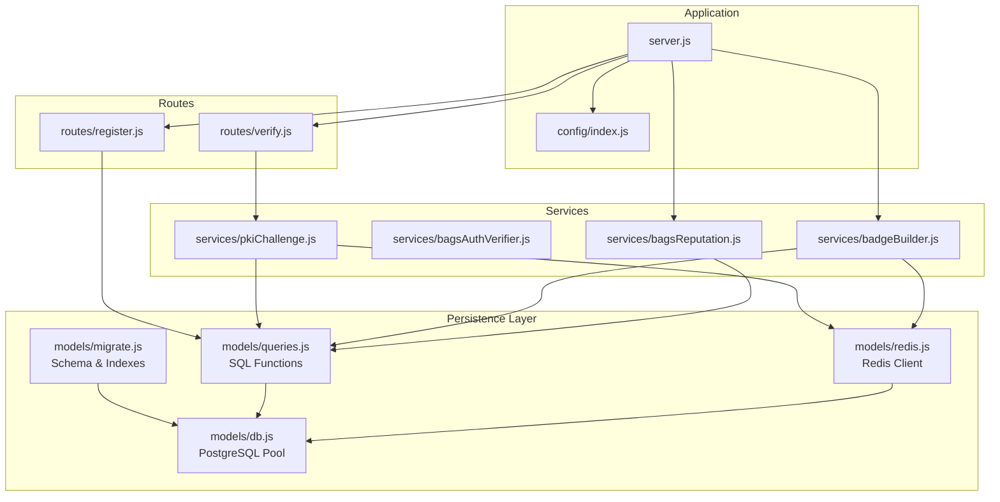
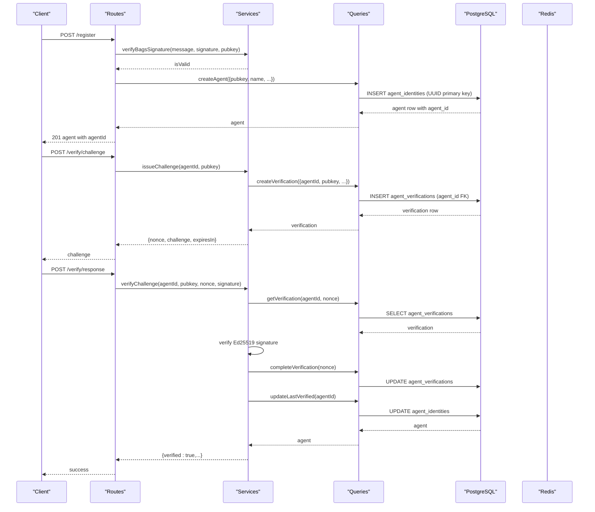
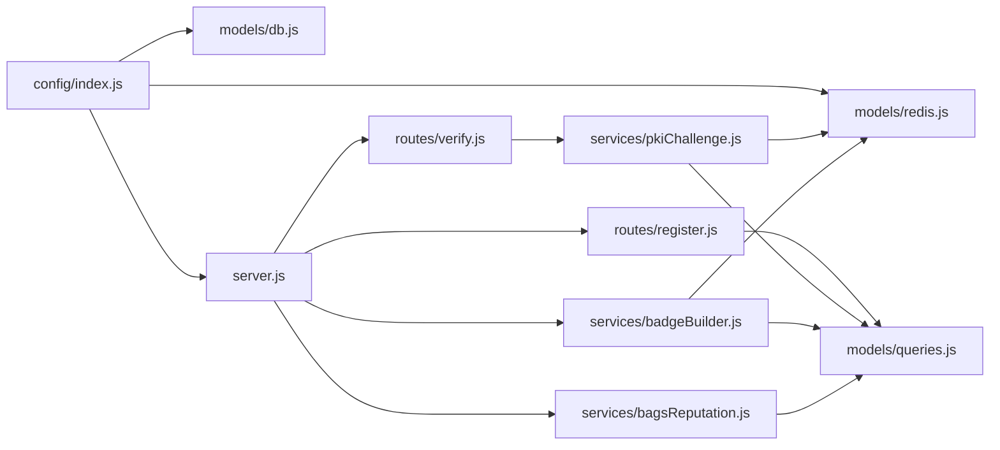

# AgentID Database Record

<cite>
**Referenced Files in This Document**
- [server.js](file://backend/server.js)
- [config/index.js](file://backend/src/config/index.js)
- [models/db.js](file://backend/src/models/db.js)
- [models/migrate.js](file://backend/src/models/migrate.js)
- [models/queries.js](file://backend/src/models/queries.js)
- [models/redis.js](file://backend/src/models/redis.js)
- [routes/register.js](file://backend/src/routes/register.js)
- [routes/verify.js](file://backend/src/routes/verify.js)
- [services/pkiChallenge.js](file://backend/src/services/pkiChallenge.js)
- [services/bagsAuthVerifier.js](file://backend/src/services/bagsAuthVerifier.js)
- [services/badgeBuilder.js](file://backend/src/services/badgeBuilder.js)
- [services/bagsReputation.js](file://backend/src/services/bagsReputation.js)
- [utils/transform.js](file://backend/src/utils/transform.js)
- [package.json](file://backend/package.json)
</cite>

## Update Summary
**Changes Made**
- Updated agent_identities table documentation to reflect UUID primary key instead of VARCHAR(88) primary key
- Enhanced action metrics documentation with new total_fees_earned field and improved action counting
- Added documentation for new unique (pubkey, name) constraint pattern
- Updated foreign key relationships to use UUID agent_id instead of pubkey
- Enhanced reputation scoring with new action-based metrics
- Updated query patterns to use UUID-based lookups

## Table of Contents
1. [Introduction](#introduction)
2. [Project Structure](#project-structure)
3. [Core Components](#core-components)
4. [Architecture Overview](#architecture-overview)
5. [Detailed Component Analysis](#detailed-component-analysis)
6. [Dependency Analysis](#dependency-analysis)
7. [Performance Considerations](#performance-considerations)
8. [Troubleshooting Guide](#troubleshooting-guide)
9. [Conclusion](#conclusion)
10. [Appendices](#appendices)

## Introduction
This document describes the AgentID Database Record system with a focus on the PostgreSQL schema and data persistence layer. The system has been updated to use UUID-based agent identification with enhanced action metrics and new constraint patterns. It documents the complete structure of the agent_identities table (with UUID primary key), the agent_verifications table for challenge-response tracking, and the agent_flags table for community moderation. It also explains the database migration process, connection pooling configuration, and the role of Redis for nonce storage and caching. SQL examples for table creation, indexing strategies, and query patterns are included, along with data integrity measures, foreign key relationships, JSONB fields for capability_set and metadata, performance considerations, backup strategies, and the integration between PostgreSQL and Redis.

## Project Structure
The backend is organized around a layered architecture with UUID-based agent identification:
- Configuration and environment variables
- Database connection pool and migrations
- Query layer for reusable SQL operations with UUID-based lookups
- Redis client for caching and ephemeral nonce storage
- Route handlers for API endpoints using agentId parameters
- Services for business logic (challenge-response, reputation, badges)
- Application bootstrap and middleware

**Diagram sources**
- [server.js:1-91](file://backend/server.js#L1-L91)
- [config/index.js:1-34](file://backend/src/config/index.js#L1-L34)
- [models/db.js:1-71](file://backend/src/models/db.js#L1-L71)
- [models/migrate.js:1-101](file://backend/src/models/migrate.js#L1-L101)
- [models/queries.js:1-443](file://backend/src/models/queries.js#L1-L443)
- [models/redis.js:1-94](file://backend/src/models/redis.js#L1-L94)
- [routes/register.js:1-162](file://backend/src/routes/register.js#L1-L162)
- [routes/verify.js:1-121](file://backend/src/routes/verify.js#L1-L121)
- [services/pkiChallenge.js:1-106](file://backend/src/services/pkiChallenge.js#L1-L106)
- [services/bagsAuthVerifier.js:1-93](file://backend/src/services/bagsAuthVerifier.js#L1-L93)
- [services/badgeBuilder.js](file://backend/src/services/badgeBuilder.js)
- [services/bagsReputation.js:1-146](file://backend/src/services/bagsReputation.js#L1-L146)

**Section sources**
- [server.js:1-91](file://backend/server.js#L1-L91)
- [config/index.js:1-34](file://backend/src/config/index.js#L1-L34)

## Core Components
- PostgreSQL connection pool and query wrapper with UUID-based operations
- Migration script that creates tables with UUID primary keys and enhanced constraints
- Query functions for agent identities, verifications, flags, discovery, and counts using UUID parameters
- Redis client for caching and ephemeral nonce storage
- Route handlers for registration and verification using agentId parameters
- Services for PKI challenge-response and reputation computation with UUID-based workflows

**Section sources**
- [models/db.js:1-71](file://backend/src/models/db.js#L1-L71)
- [models/migrate.js:1-101](file://backend/src/models/migrate.js#L1-L101)
- [models/queries.js:1-443](file://backend/src/models/queries.js#L1-L443)
- [models/redis.js:1-94](file://backend/src/models/redis.js#L1-L94)
- [routes/register.js:1-162](file://backend/src/routes/register.js#L1-L162)
- [routes/verify.js:1-121](file://backend/src/routes/verify.js#L1-L121)
- [services/pkiChallenge.js:1-106](file://backend/src/services/pkiChallenge.js#L1-L106)
- [services/bagsReputation.js:1-146](file://backend/src/services/bagsReputation.js#L1-L146)

## Architecture Overview
The system integrates PostgreSQL for durable identity and verification records with Redis for ephemeral challenge nonces and caching. The architecture now uses UUID-based agent identification throughout the system. Routes orchestrate requests using agentId parameters, services encapsulate cryptographic and external API interactions, and the query layer ensures safe, parameterized SQL with UUID-based operations.

**Diagram sources**
- [routes/register.js:59-159](file://backend/src/routes/register.js#L59-L159)
- [routes/verify.js:18-118](file://backend/src/routes/verify.js#L18-L118)
- [services/pkiChallenge.js:18-100](file://backend/src/services/pkiChallenge.js#L18-L100)
- [services/bagsAuthVerifier.js:18-86](file://backend/src/services/bagsAuthVerifier.js#L18-L86)
- [models/queries.js:17-29](file://backend/src/models/queries.js#L17-L29)
- [models/queries.js:249-258](file://backend/src/models/queries.js#L249-L258)
- [models/queries.js:266-276](file://backend/src/models/queries.js#L266-L276)
- [models/queries.js:283-292](file://backend/src/models/queries.js#L283-L292)
- [models/queries.js:170-179](file://backend/src/models/queries.js#L170-L179)

## Detailed Component Analysis

### PostgreSQL Schema: agent_identities
The agent_identities table now uses UUID as the primary key with enhanced action metrics and new constraint patterns. Below is the complete column inventory with data types, constraints, and roles.

**Updated** Changed from VARCHAR(88) primary key to UUID primary key with enhanced action metrics

- agent_id: UUID PRIMARY KEY DEFAULT gen_random_uuid()
  - Universally unique identifier for the agent (generated automatically)
- pubkey: VARCHAR(88) NOT NULL
  - Unique identifier for the agent (Solana public key)
- name: VARCHAR(255) NOT NULL
  - Human-readable agent name
- description: TEXT
  - Optional description
- token_mint: VARCHAR(88)
  - Associated token mint for analytics
- capability_set: JSONB DEFAULT '[]'
  - Array of capabilities (e.g., ["swap", "stake"])
- creator_x: VARCHAR(255)
  - Creator social handle
- creator_wallet: VARCHAR(88)
  - Creator wallet address
- registered_at: TIMESTAMPTZ DEFAULT NOW()
  - Timestamp of registration
- last_verified: TIMESTAMPTZ
  - Timestamp of last successful verification
- status: VARCHAR(20) DEFAULT 'verified'
  - Agent status: verified, flagged, suspended
- bags_score: INTEGER DEFAULT 0
  - Computed BAGS reputation score (0-100)
- successful_actions: INTEGER DEFAULT 0
  - Successful actions performed
- failed_actions: INTEGER DEFAULT 0
  - Failed actions
- total_actions: INTEGER DEFAULT 0
  - Total actions performed
- total_fees_earned: NUMERIC(20,9) DEFAULT 0
  - Total fees earned in SOL
- CONSTRAINT uq_agent_pubkey_name UNIQUE (pubkey, name)
  - Unique constraint preventing duplicate agent names for the same public key

**Updated** Added new unique constraint pattern (pubkey, name) and enhanced action metrics

Constraints and relationships:
- Primary key on agent_id (UUID)
- Unique constraint on (pubkey, name) to prevent duplicate agent names per owner
- JSONB fields for capability_set and metadata-like fields
- Status supports reputation and moderation workflows
- Action metrics track operational performance

Indexes:
- idx_agent_identities_pubkey
- idx_agent_identities_status
- idx_agent_identities_bags_score
- idx_agent_identities_creator_wallet

Example SQL (from migration):
- CREATE TABLE IF NOT EXISTS agent_identities (...)
- CREATE INDEX IF NOT EXISTS idx_agent_identities_pubkey ON agent_identities(pubkey);
- CREATE INDEX IF NOT EXISTS idx_agent_identities_status ON agent_identities(status);
- CREATE INDEX IF NOT EXISTS idx_agent_identities_bags_score ON agent_identities(bags_score);
- CREATE INDEX IF NOT EXISTS idx_agent_identities_creator_wallet ON agent_identities(creator_wallet);

**Section sources**
- [models/migrate.js:10-29](file://backend/src/models/migrate.js#L10-L29)
- [models/migrate.js:55-65](file://backend/src/models/migrate.js#L55-L65)
- [models/queries.js:17-29](file://backend/src/models/queries.js#L17-L29)
- [models/queries.js:36-49](file://backend/src/models/queries.js#L36-L49)

### PostgreSQL Schema: agent_verifications
The agent_verifications table tracks challenge-response sessions for ongoing verification with UUID-based foreign key relationships.

**Updated** Changed foreign key from pubkey to agent_id (UUID)

Columns:
- id: SERIAL PRIMARY KEY
- agent_id: UUID REFERENCES agent_identities(agent_id) ON DELETE CASCADE
- pubkey: VARCHAR(88) NOT NULL
- nonce: VARCHAR(64) UNIQUE NOT NULL
- challenge: TEXT NOT NULL
- expires_at: TIMESTAMPTZ NOT NULL
- completed: BOOLEAN DEFAULT false
- created_at: TIMESTAMPTZ DEFAULT NOW()

**Updated** Foreign key now references agent_id UUID instead of pubkey

Indexes:
- idx_agent_verifications_agent_id
- idx_agent_verifications_pubkey

Example SQL (from migration):
- CREATE TABLE IF NOT EXISTS agent_verifications (...)
- CREATE INDEX IF NOT EXISTS idx_agent_verifications_agent_id ON agent_verifications(agent_id);
- CREATE INDEX IF NOT EXISTS idx_agent_verifications_pubkey ON agent_verifications(pubkey);

Integration:
- Challenges are issued with a random UUID nonce and stored with an expiration timestamp
- Responses are validated against the stored challenge and nonce, then marked completed and last_verified is updated
- Foreign key cascade ensures cleanup when agent is deleted

**Section sources**
- [models/migrate.js:31-41](file://backend/src/models/migrate.js#L31-L41)
- [models/migrate.js:60](file://backend/src/models/migrate.js#L60)
- [models/queries.js:249-258](file://backend/src/models/queries.js#L249-L258)
- [models/queries.js:266-276](file://backend/src/models/queries.js#L266-L276)
- [models/queries.js:283-292](file://backend/src/models/queries.js#L283-L292)

### PostgreSQL Schema: agent_flags
The agent_flags table captures community moderation reports with UUID-based foreign key relationships.

**Updated** Changed foreign key from pubkey to agent_id (UUID)

Columns:
- id: SERIAL PRIMARY KEY
- agent_id: UUID REFERENCES agent_identities(agent_id) ON DELETE CASCADE
- pubkey: VARCHAR(88) NOT NULL
- reporter_pubkey: VARCHAR(88)
- reason: TEXT NOT NULL
- evidence: JSONB
- resolved: BOOLEAN DEFAULT false
- created_at: TIMESTAMPTZ DEFAULT NOW()

**Updated** Foreign key now references agent_id UUID instead of pubkey

Indexes:
- idx_agent_flags_agent_id
- idx_agent_flags_pubkey
- idx_agent_flags_resolved
- idx_agent_flags_agent_id_resolved

Example SQL (from migration):
- CREATE TABLE IF NOT EXISTS agent_flags (...)
- CREATE INDEX IF NOT EXISTS idx_agent_flags_agent_id ON agent_flags(agent_id);
- CREATE INDEX IF NOT EXISTS idx_agent_flags_pubkey ON agent_flags(pubkey);
- CREATE INDEX IF NOT EXISTS idx_agent_flags_resolved ON agent_flags(resolved);
- CREATE INDEX IF NOT EXISTS idx_agent_flags_agent_id_resolved ON agent_flags(agent_id, resolved);

Integration:
- Flags are created with reporter_pubkey, reason, and optional evidence
- Unresolved flag counts influence reputation scoring
- Flags can be resolved to false to indicate closure
- Foreign key cascade ensures cleanup when agent is deleted

**Section sources**
- [models/migrate.js:43-53](file://backend/src/models/migrate.js#L43-L53)
- [models/migrate.js:62-65](file://backend/src/models/migrate.js#L62-L65)
- [models/queries.js:303-315](file://backend/src/models/queries.js#L303-L315)
- [models/queries.js:322-328](file://backend/src/models/queries.js#L322-L328)
- [models/queries.js:335-341](file://backend/src/models/queries.js#L335-L341)

### Database Migration Process
The migration script performs the following:
- Connects to the database using the pool
- Begins a transaction
- Creates agent_identities, agent_verifications, and agent_flags tables with UUID primary keys
- Creates performance indexes including new indexes for UUID-based lookups
- Commits the transaction or rolls back on failure
- Exits the process with success or failure status

**Updated** Migration now creates UUID-based tables with enhanced constraints

Operational notes:
- Run via npm script: migrate
- Uses a dedicated client connection to execute DDL safely
- Ensures atomicity for schema changes
- Creates indexes optimized for UUID-based queries

**Section sources**
- [models/migrate.js:68-93](file://backend/src/models/migrate.js#L68-L93)
- [package.json:9](file://backend/package.json#L9)

### Connection Pooling Configuration
The PostgreSQL pool is configured with:
- connectionString from DATABASE_URL
- SSL settings enabled in production (rejectUnauthorized: false)
- Error event logging to prevent crashes
- A shared query wrapper that executes parameterized statements

**Updated** Connection pooling remains the same but now handles UUID-based queries

Security and reliability:
- Reject unauthorized SSL in production environments
- Centralized error logging for pool issues
- Parameterized queries in the query layer prevent SQL injection
- UUID handling is transparent to the connection pool

**Section sources**
- [models/db.js:25-43](file://backend/src/models/db.js#L25-L43)
- [models/db.js:51-64](file://backend/src/models/db.js#L51-L64)
- [models/queries.js:17-29](file://backend/src/models/queries.js#L17-L29)

### Redis Integration for Nonce Storage and Caching
Redis is used for:
- Ephemeral nonce storage for PKI challenges (challenge-response)
- Caching badge JSON data with TTL

Redis client configuration:
- retryStrategy with exponential backoff
- maxRetriesPerRequest to bound retry attempts
- enableOfflineQueue to buffer commands during reconnection
- getCache/setCache/deleteCache helpers with JSON serialization

PKI challenge flow:
- issueChallenge generates a nonce and challenge string, stores in agent_verifications, and returns base58-encoded challenge
- verifyChallenge retrieves the verification record, validates expiration and signature, marks completed, and updates last_verified

Badge caching:
- getBadgeJSON checks cache first, computes reputation and aggregates stats, caches result with TTL

**Section sources**
- [models/redis.js:10-20](file://backend/src/models/redis.js#L10-L20)
- [models/redis.js:22-34](file://backend/src/models/redis.js#L22-L34)
- [models/redis.js:41-71](file://backend/src/models/redis.js#L41-L71)
- [services/pkiChallenge.js:18-41](file://backend/src/services/pkiChallenge.js#L18-L41)
- [services/pkiChallenge.js:52-100](file://backend/src/services/pkiChallenge.js#L52-L100)

### Data Integrity Measures and Foreign Keys
- agent_verifications.agent_id references agent_identities.agent_id (ON DELETE CASCADE)
- agent_flags.agent_id references agent_identities.agent_id (ON DELETE CASCADE)
- UNIQUE constraint on agent_verifications.nonce prevents reuse
- UNIQUE constraint on (agent_identities.pubkey, agent_identities.name) prevents duplicate agent names per owner
- Status and flag_reason fields support moderation workflows
- JSONB fields (capability_set, evidence) store structured metadata
- Parameterized queries and strict validations in routes enforce input integrity

**Updated** Foreign keys now use UUID agent_id instead of pubkey, with new unique constraint pattern

**Section sources**
- [models/migrate.js:34](file://backend/src/models/migrate.js#L34)
- [models/migrate.js:46](file://backend/src/models/migrate.js#L46)
- [models/migrate.js:28](file://backend/src/models/migrate.js#L28)
- [models/queries.js:303-315](file://backend/src/models/queries.js#L303-L315)
- [routes/register.js:101-109](file://backend/src/routes/register.js#L101-L109)
- [routes/verify.js:54-73](file://backend/src/routes/verify.js#L54-L73)

### SQL Examples and Query Patterns
- Create tables and indexes: see migration script with UUID primary keys
- Insert agent identity: parameterized insert with UUID primary key and JSONB capability_set
- Update agent fields dynamically: allowed fields mapped to snake_case DB columns with UUID parameter
- List agents with filters: status and JSONB containment for capability
- Discovery by capability: verified status + JSONB containment + score ordering
- Count agents: conditional WHERE clauses with JSONB containment
- Create verification: insert with UUID agent_id, pubkey, nonce, challenge, expires_at
- Get verification: pending, uncompleted, not expired by UUID agent_id
- Complete verification: mark completed and update last_verified
- Create flag: insert with UUID agent_id, reporter_pubkey, reason, optional evidence
- Get unresolved flag count: aggregation filtered by resolved=false
- Increment action counters: total_actions, successful_actions, failed_actions with UUID parameter

**Updated** All query patterns now use UUID-based parameters and foreign keys

**Section sources**
- [models/migrate.js:10-65](file://backend/src/models/migrate.js#L10-L65)
- [models/queries.js:17-29](file://backend/src/models/queries.js#L17-L29)
- [models/queries.js:83-109](file://backend/src/models/queries.js#L83-L109)
- [models/queries.js:116-145](file://backend/src/models/queries.js#L116-L145)
- [models/queries.js:368-393](file://backend/src/models/queries.js#L368-L393)
- [models/queries.js:395-411](file://backend/src/models/queries.js#L395-L411)
- [models/queries.js:249-258](file://backend/src/models/queries.js#L249-L258)
- [models/queries.js:266-276](file://backend/src/models/queries.js#L266-L276)
- [models/queries.js:283-292](file://backend/src/models/queries.js#L283-L292)
- [models/queries.js:303-315](file://backend/src/models/queries.js#L303-L315)
- [models/queries.js:335-341](file://backend/src/models/queries.js#L335-L341)
- [models/queries.js:204-216](file://backend/src/models/queries.js#L204-L216)

## Dependency Analysis
The system exhibits clear separation of concerns with UUID-based agent identification:
- Routes depend on services and queries using agentId parameters
- Services depend on queries and external APIs
- Queries depend on the database pool with UUID-based operations
- Redis is used by services and badge builder
- Configuration is centralized and consumed across modules

**Diagram sources**
- [config/index.js:1-34](file://backend/src/config/index.js#L1-L34)
- [models/db.js:1-71](file://backend/src/models/db.js#L1-L71)
- [models/redis.js:1-94](file://backend/src/models/redis.js#L1-L94)
- [server.js:20-28](file://backend/server.js#L20-L28)
- [routes/register.js:1-162](file://backend/src/routes/register.js#L1-L162)
- [routes/verify.js:1-121](file://backend/src/routes/verify.js#L1-L121)
- [services/pkiChallenge.js:1-106](file://backend/src/services/pkiChallenge.js#L1-L106)
- [services/badgeBuilder.js](file://backend/src/services/badgeBuilder.js)
- [services/bagsReputation.js:1-146](file://backend/src/services/bagsReputation.js#L1-L146)
- [models/queries.js:1-443](file://backend/src/models/queries.js#L1-L443)

**Section sources**
- [server.js:20-28](file://backend/server.js#L20-L28)
- [models/queries.js:1-443](file://backend/src/models/queries.js#L1-L443)

## Performance Considerations
- Indexes
  - agent_identities(agent_id): primary key index for UUID lookups
  - agent_identities(pubkey): supports owner-based queries
  - agent_identities(status): supports filtering by status
  - agent_identities(bags_score): optimizes reputation-based sorting
  - agent_identities(creator_wallet): supports creator-based queries
  - agent_verifications(agent_id): speeds up verification lookups by agent
  - agent_verifications(pubkey): supports verification by public key
  - agent_flags(agent_id): speeds up flag lookups by agent
  - agent_flags(pubkey, resolved): supports efficient moderation queries
- JSONB containment
  - capability_set @> $1::jsonb enables fast capability filtering
- Caching
  - Redis cache for badge JSON reduces repeated computation and DB load
  - TTL controls freshness and memory usage
- Connection pooling
  - Single pool shared across the app improves resource utilization
  - SSL in production avoids handshake overhead while maintaining security
- Query patterns
  - Parameterized queries prevent plan cache pollution and improve reuse
  - Aggregation queries (counts, sums) should leverage indexes where possible
  - UUID-based queries benefit from native PostgreSQL UUID optimization

**Updated** Performance considerations now include UUID-specific optimizations and new indexes

## Troubleshooting Guide
Common issues and resolutions:
- Migration failures
  - Ensure DATABASE_URL is set and reachable
  - Review logs for rollback reasons
  - Confirm transaction boundaries and index creation steps
  - Verify UUID extension is available in PostgreSQL
- Pool errors
  - Check connection string and network connectivity
  - Monitor pool error logs; application continues after logging
- Redis connectivity
  - Verify REDIS_URL and retry strategy
  - Offline queue allows buffered commands during reconnection
- Verification failures
  - Nonce not found or already completed
  - Expired challenge
  - Invalid signature or encoding
  - UUID not found in database
- Badge generation
  - Cache misses are expected; confirm TTL and setCache success
  - Reputation computation relies on external APIs; handle timeouts gracefully
- Duplicate agent registration
  - Unique constraint (pubkey, name) prevents duplicate agent names per owner
  - Check existing agent records before registration

**Updated** Added troubleshooting for UUID-specific issues and new constraint patterns

**Section sources**
- [models/migrate.js:68-93](file://backend/src/models/migrate.js#L68-L93)
- [models/db.js:37-40](file://backend/src/models/db.js#L37-L40)
- [models/redis.js:22-34](file://backend/src/models/redis.js#L22-L34)
- [routes/verify.js:93-113](file://backend/src/routes/verify.js#L93-L113)
- [services/badgeBuilder.js](file://backend/src/services/badgeBuilder.js)
- [routes/register.js:101-109](file://backend/src/routes/register.js#L101-L109)

## Conclusion
The AgentID Database Record system has been successfully updated to use UUID-based agent identification with enhanced action metrics and new constraint patterns. The system combines a robust PostgreSQL schema with UUID primary keys and Redis for ephemeral and caching needs. The schema supports identity, verification, and moderation workflows with strong integrity constraints including unique (pubkey, name) combinations and UUID-based foreign keys. The migration process is atomic and idempotent, and the query layer enforces safety and flexibility with UUID-based operations. Redis enhances responsiveness for challenge-response and badge generation. Together, these components form a scalable and maintainable foundation for agent identity and reputation management with improved data integrity and performance characteristics.

## Appendices

### Appendix A: Environment Variables
- DATABASE_URL: PostgreSQL connection string
- REDIS_URL: Redis connection string
- BAGS_API_KEY: API key for BAGS integration
- SAID_GATEWAY_URL: SAID gateway endpoint
- AGENTID_BASE_URL: Base URL for widget links
- PORT: Server port
- NODE_ENV: Environment mode
- CORS_ORIGIN: Allowed origins
- BADGE_CACHE_TTL: Badge cache TTL in seconds
- CHALLENGE_EXPIRY_SECONDS: Challenge expiration in seconds

**Section sources**
- [config/index.js:6-31](file://backend/src/config/index.js#L6-L31)

### Appendix B: Example Queries
- Create tables and indexes: see migration script with UUID primary keys and new indexes
- Insert agent identity: parameterized insert with UUID primary key and JSONB capability_set
- Update agent fields: dynamic field mapping with UUID parameter and JSONB serialization
- List agents by status and capability: JSONB containment with UUID-based filtering
- Discovery by capability: verified + JSONB containment + score ordering with UUID
- Count agents: conditional WHERE clauses with JSONB containment and UUID parameters
- Create verification: insert with UUID agent_id, pubkey, nonce, challenge, expires_at
- Get verification: pending, uncompleted, not expired by UUID agent_id
- Complete verification: mark completed and update last_verified with UUID
- Create flag: insert with UUID agent_id, reporter_pubkey, reason, optional evidence
- Get unresolved flag count: aggregation filtered by resolved=false with UUID
- Increment action counters: total_actions, successful_actions, failed_actions with UUID
- Update BAGS score: parameterized update with UUID agent_id

**Updated** All example queries now use UUID-based parameters and foreign keys

**Section sources**
- [models/migrate.js:10-65](file://backend/src/models/migrate.js#L10-L65)
- [models/queries.js:17-29](file://backend/src/models/queries.js#L17-L29)
- [models/queries.js:83-109](file://backend/src/models/queries.js#L83-L109)
- [models/queries.js:116-145](file://backend/src/models/queries.js#L116-L145)
- [models/queries.js:368-393](file://backend/src/models/queries.js#L368-L393)
- [models/queries.js:395-411](file://backend/src/models/queries.js#L395-L411)
- [models/queries.js:249-258](file://backend/src/models/queries.js#L249-L258)
- [models/queries.js:266-276](file://backend/src/models/queries.js#L266-L276)
- [models/queries.js:283-292](file://backend/src/models/queries.js#L283-L292)
- [models/queries.js:303-315](file://backend/src/models/queries.js#L303-L315)
- [models/queries.js:335-341](file://backend/src/models/queries.js#L335-L341)
- [models/queries.js:204-216](file://backend/src/models/queries.js#L204-L216)
- [models/queries.js:187-196](file://backend/src/models/queries.js#L187-L196)