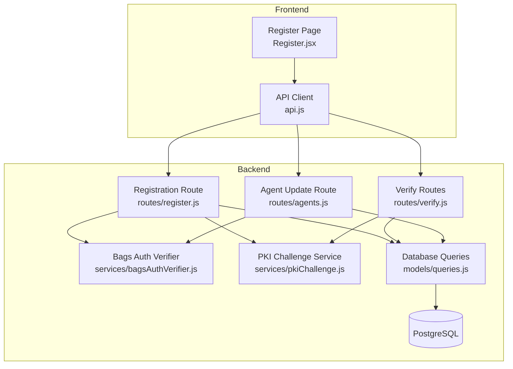
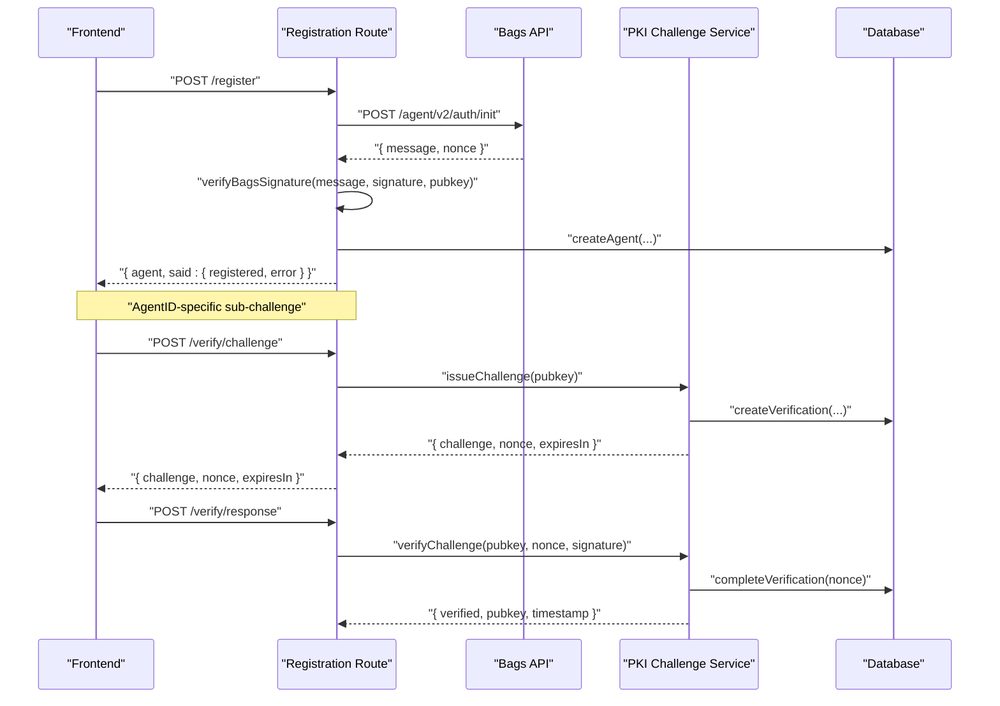
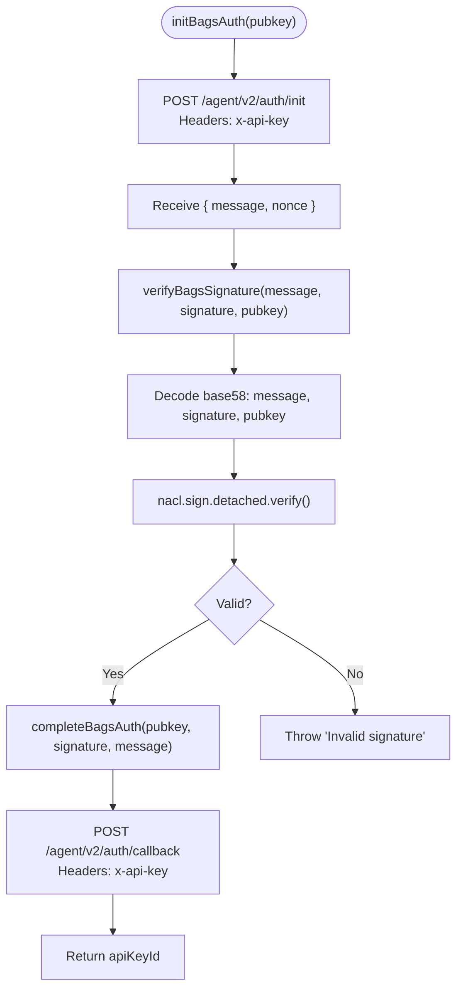
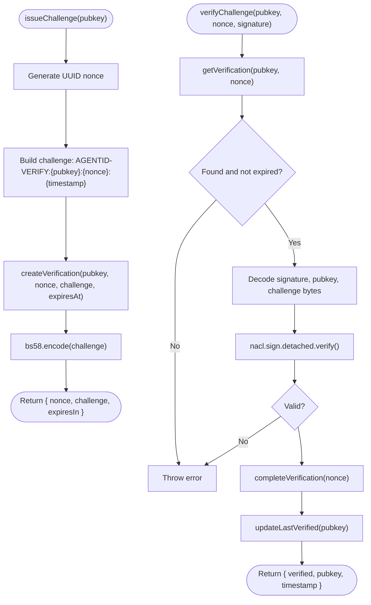
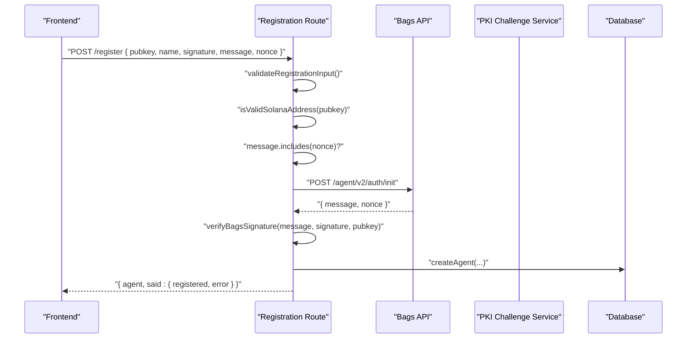
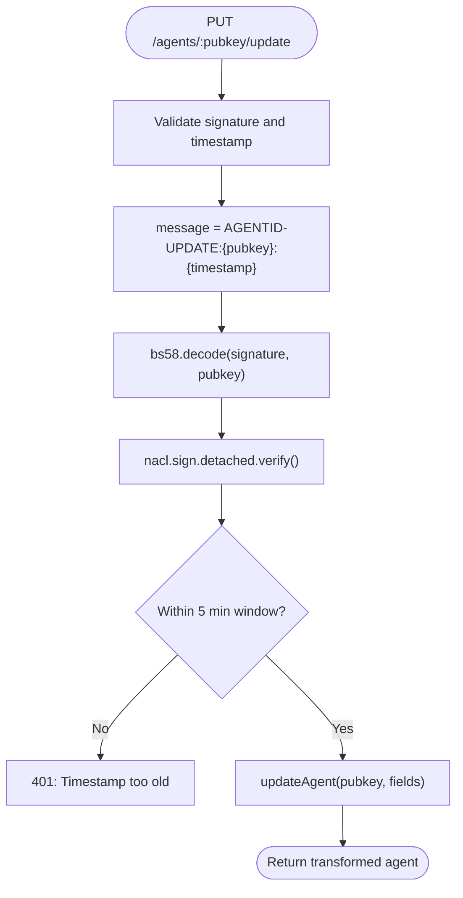
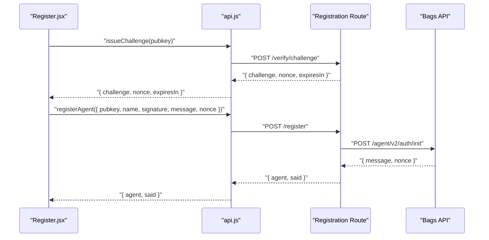
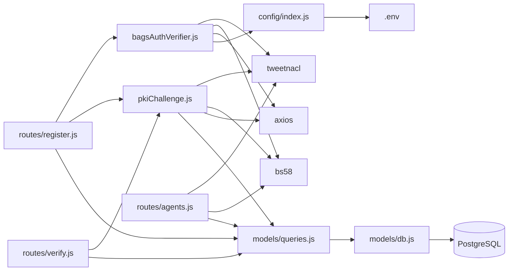

# Bags Agent Auth Wrapper

<cite>
**Referenced Files in This Document**
- [bagsAuthVerifier.js](file://backend/src/services/bagsAuthVerifier.js)
- [pkiChallenge.js](file://backend/src/services/pkiChallenge.js)
- [agents.js](file://backend/src/routes/agents.js)
- [register.js](file://backend/src/routes/register.js)
- [verify.js](file://backend/src/routes/verify.js)
- [api.js](file://frontend/src/lib/api.js)
- [Register.jsx](file://frontend/src/pages/Register.jsx)
- [index.js](file://backend/src/config/index.js)
- [queries.js](file://backend/src/models/queries.js)
- [db.js](file://backend/src/models/db.js)
- [migrate.js](file://backend/src/models/migrate.js)
- [agentid_build_plan.md](file://agentid_build_plan.md)
</cite>

## Table of Contents
1. [Introduction](#introduction)
2. [Project Structure](#project-structure)
3. [Core Components](#core-components)
4. [Architecture Overview](#architecture-overview)
5. [Detailed Component Analysis](#detailed-component-analysis)
6. [Dependency Analysis](#dependency-analysis)
7. [Performance Considerations](#performance-considerations)
8. [Troubleshooting Guide](#troubleshooting-guide)
9. [Conclusion](#conclusion)

## Introduction
This document explains the Bags Agent Auth Wrapper component that extends Bags' Ed25519-based authentication with AgentID-specific enhancements. The wrapper integrates with Bags' public API to establish wallet ownership as the first step of AgentID registration, while preserving and strengthening Bags' native Ed25519 challenge-response flow. It also introduces AgentID-specific sub-challenges and signature verification to create an immutable proof of wallet ownership that prevents spoofing.

The wrapper consists of:
- Axios integration with Bags API endpoints for initialization and callback
- Ed25519 signature verification using tweetnacl
- bs58 encoding/decoding for messages, signatures, and public keys
- Replay protection and nonce validation
- Immutable proof creation for AgentID registration

## Project Structure
The Bags Agent Auth Wrapper is implemented in the backend service layer and integrated with frontend registration flows.

**Diagram sources**
- [Register.jsx:1-733](file://frontend/src/pages/Register.jsx#L1-733)
- [api.js:1-140](file://frontend/src/lib/api.js#L1-140)
- [register.js:1-162](file://backend/src/routes/register.js#L1-162)
- [bagsAuthVerifier.js:1-93](file://backend/src/services/bagsAuthVerifier.js#L1-93)
- [pkiChallenge.js:1-102](file://backend/src/services/pkiChallenge.js#L1-102)
- [agents.js:120-252](file://backend/src/routes/agents.js#L120-252)
- [verify.js:1-121](file://backend/src/routes/verify.js#L1-121)
- [queries.js:1-404](file://backend/src/models/queries.js#L1-404)
- [db.js:1-45](file://backend/src/models/db.js#L1-45)

**Section sources**
- [bagsAuthVerifier.js:1-93](file://backend/src/services/bagsAuthVerifier.js#L1-93)
- [pkiChallenge.js:1-102](file://backend/src/services/pkiChallenge.js#L1-102)
- [register.js:1-162](file://backend/src/routes/register.js#L1-162)
- [agents.js:120-252](file://backend/src/routes/agents.js#L120-252)
- [verify.js:1-121](file://backend/src/routes/verify.js#L1-121)
- [api.js:1-140](file://frontend/src/lib/api.js#L1-140)
- [Register.jsx:1-733](file://frontend/src/pages/Register.jsx#L1-733)

## Core Components
- Bags Auth Verifier: Implements the Ed25519 challenge-response with Bags API, including initialization, signature verification, and callback completion.
- PKI Challenge Service: Issues and verifies AgentID-specific Ed25519 challenges with nonce and expiration.
- Registration Route: Orchestrates AgentID registration using Bags wallet ownership verification and optional SAID binding.
- Agent Update Route: Enforces AgentID-specific Ed25519 signature verification for agent metadata updates.
- Verify Routes: Provides endpoints for issuing and verifying PKI challenges.

**Section sources**
- [bagsAuthVerifier.js:18-86](file://backend/src/services/bagsAuthVerifier.js#L18-86)
- [pkiChallenge.js:17-96](file://backend/src/services/pkiChallenge.js#L17-96)
- [register.js:59-159](file://backend/src/routes/register.js#L59-159)
- [agents.js:124-188](file://backend/src/routes/agents.js#L124-188)
- [verify.js:18-118](file://backend/src/routes/verify.js#L18-118)

## Architecture Overview
The Bags Agent Auth Wrapper augments Bags' native Ed25519 authentication with AgentID-specific protections and immutability guarantees.

**Diagram sources**
- [register.js:59-159](file://backend/src/routes/register.js#L59-159)
- [bagsAuthVerifier.js:18-86](file://backend/src/services/bagsAuthVerifier.js#L18-86)
- [pkiChallenge.js:17-96](file://backend/src/services/pkiChallenge.js#L17-96)
- [queries.js:213-256](file://backend/src/models/queries.js#L213-256)

## Detailed Component Analysis

### Bags Auth Verifier
Implements the Ed25519 authentication flow with Bags API:
- Initialization: POST /agent/v2/auth/init with x-api-key header to receive message and nonce
- Signature verification: Decodes base58 message, signature, and pubkey; verifies Ed25519 signature using tweetnacl
- Callback completion: POST /agent/v2/auth/callback with x-api-key header and signature

**Diagram sources**
- [bagsAuthVerifier.js:18-86](file://backend/src/services/bagsAuthVerifier.js#L18-86)

**Section sources**
- [bagsAuthVerifier.js:18-86](file://backend/src/services/bagsAuthVerifier.js#L18-86)
- [index.js](file://backend/src/config/index.js#L12)

### PKI Challenge Service
Issues and verifies AgentID-specific Ed25519 challenges:
- Issue: Generates UUID nonce, constructs challenge string with pubkey, nonce, and timestamp, stores in DB with expiration, returns base58-encoded challenge
- Verify: Retrieves pending verification, checks expiration, decodes inputs, verifies Ed25519 signature, marks verification complete, updates last verified timestamp

**Diagram sources**
- [pkiChallenge.js:17-96](file://backend/src/services/pkiChallenge.js#L17-96)
- [queries.js:213-256](file://backend/src/models/queries.js#L213-256)

**Section sources**
- [pkiChallenge.js:17-96](file://backend/src/services/pkiChallenge.js#L17-96)
- [queries.js:213-256](file://backend/src/models/queries.js#L213-256)

### Registration Flow Integration
The registration route integrates Bags authentication and PKI challenges:
- Validates input and Solana address format
- Verifies Bags signature against stored challenge
- Prevents replay by ensuring message contains nonce
- Optionally binds to SAID and stores agent record

**Diagram sources**
- [register.js:59-159](file://backend/src/routes/register.js#L59-159)
- [bagsAuthVerifier.js:18-86](file://backend/src/services/bagsAuthVerifier.js#L18-86)

**Section sources**
- [register.js:59-159](file://backend/src/routes/register.js#L59-159)

### Agent Update Authentication
The agent update route enforces AgentID-specific Ed25519 signature verification:
- Constructs message: "AGENTID-UPDATE:{pubkey}:{timestamp}"
- Verifies Ed25519 signature using tweetnacl
- Enforces 5-minute timestamp window for replay protection
- Updates allowed fields and returns transformed agent

**Diagram sources**
- [agents.js:124-188](file://backend/src/routes/agents.js#L124-188)

**Section sources**
- [agents.js:124-188](file://backend/src/routes/agents.js#L124-188)

### Frontend Integration
The frontend integrates with the backend APIs:
- API client defines base URL and interceptors for auth tokens
- Registration page orchestrates challenge issuance and signature submission
- Verify endpoints support ongoing PKI challenge-response verification

**Diagram sources**
- [Register.jsx:295-341](file://frontend/src/pages/Register.jsx#L295-341)
- [api.js:71-83](file://frontend/src/lib/api.js#L71-83)
- [register.js:59-159](file://backend/src/routes/register.js#L59-159)

**Section sources**
- [api.js:71-83](file://frontend/src/lib/api.js#L71-83)
- [Register.jsx:295-341](file://frontend/src/pages/Register.jsx#L295-341)

## Dependency Analysis
The Bags Agent Auth Wrapper depends on:
- tweetnacl for Ed25519 signature verification
- bs58 for base58 encoding/decoding of messages, signatures, and public keys
- axios for HTTP requests to Bags API and SAID Gateway
- PostgreSQL for storing agent identities, verification challenges, and flags
- Environment configuration for API keys and URLs

**Diagram sources**
- [bagsAuthVerifier.js:6-9](file://backend/src/services/bagsAuthVerifier.js#L6-9)
- [pkiChallenge.js:6-9](file://backend/src/services/pkiChallenge.js#L6-9)
- [register.js:6-11](file://backend/src/routes/register.js#L6-11)
- [agents.js:6-12](file://backend/src/routes/agents.js#L6-12)
- [verify.js:6-10](file://backend/src/routes/verify.js#L6-10)
- [queries.js](file://backend/src/models/queries.js#L6)
- [db.js](file://backend/src/models/db.js#L6)
- [index.js](file://backend/src/config/index.js#L6)

**Section sources**
- [bagsAuthVerifier.js:6-9](file://backend/src/services/bagsAuthVerifier.js#L6-9)
- [pkiChallenge.js:6-9](file://backend/src/services/pkiChallenge.js#L6-9)
- [register.js:6-11](file://backend/src/routes/register.js#L6-11)
- [agents.js:6-12](file://backend/src/routes/agents.js#L6-12)
- [verify.js:6-10](file://backend/src/routes/verify.js#L6-10)
- [queries.js](file://backend/src/models/queries.js#L6)
- [db.js](file://backend/src/models/db.js#L6)
- [index.js](file://backend/src/config/index.js#L6)

## Performance Considerations
- Database migrations create indexes on frequently queried columns to optimize lookups for agent identities, verifications, and flags.
- Challenge issuance generates UUID nonces and stores them with expiration to minimize collision risks and enable cleanup.
- Signature verification uses detached Ed25519 verification which is efficient and secure.
- HTTP timeouts are configured for external API calls to Bags and SAID to prevent hanging requests.

[No sources needed since this section provides general guidance]

## Troubleshooting Guide
Common integration issues and resolutions:
- Bags API authentication header: Ensure x-api-key header is used instead of Authorization: Bearer for Bags API calls.
- Signature verification failures: Verify base58 encoding/decoding and correct message construction for both Bags and AgentID flows.
- Nonce mismatch: Ensure the message includes the nonce to prevent replay attacks.
- Challenge expiration: Verify that challenges are issued and used within the configured expiration window.
- Timestamp window violations: For agent updates, ensure the timestamp is within the 5-minute window.

Security considerations:
- Use base58 encoding for all Ed25519 inputs to align with Bags API expectations.
- Implement strict input validation for public keys and signatures.
- Enforce replay protection via nonce validation and timestamp windows.
- Store sensitive data securely and avoid logging raw signatures or keys.

**Section sources**
- [bagsAuthVerifier.js:72-85](file://backend/src/services/bagsAuthVerifier.js#L72-85)
- [register.js:88-93](file://backend/src/routes/register.js#L88-93)
- [agents.js:165-179](file://backend/src/routes/agents.js#L165-179)
- [pkiChallenge.js:58-63](file://backend/src/services/pkiChallenge.js#L58-63)

## Conclusion
The Bags Agent Auth Wrapper seamlessly integrates Bags' Ed25519 authentication with AgentID's PKI challenge-response system. It establishes immutable proof of wallet ownership, prevents spoofing, and provides replay protection. The implementation leverages tweetnacl for secure signature verification, bs58 for encoding/decoding, and robust database storage for verifications and agent records. Proper configuration of API keys and adherence to the authentication flow ensures reliable operation in production environments.