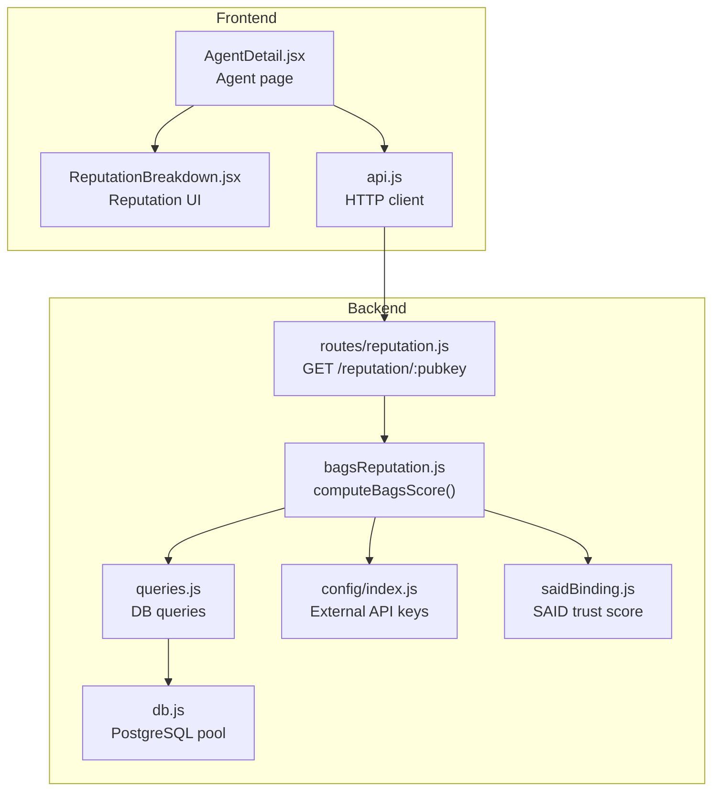
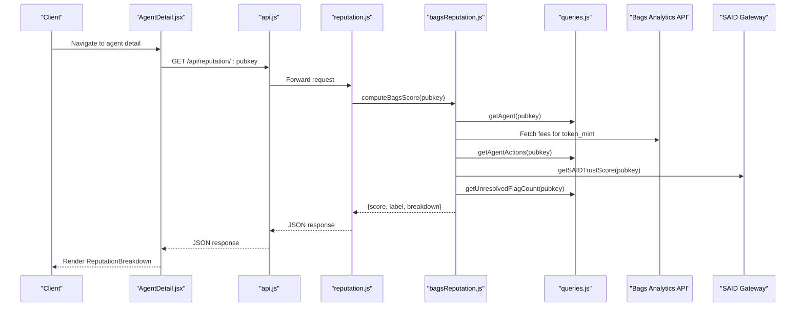
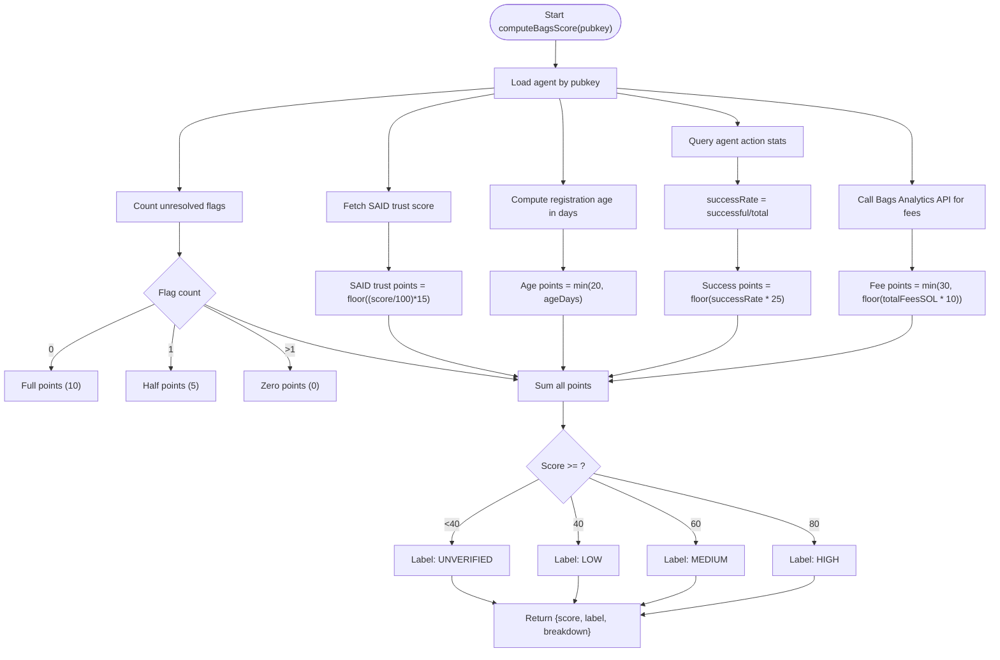
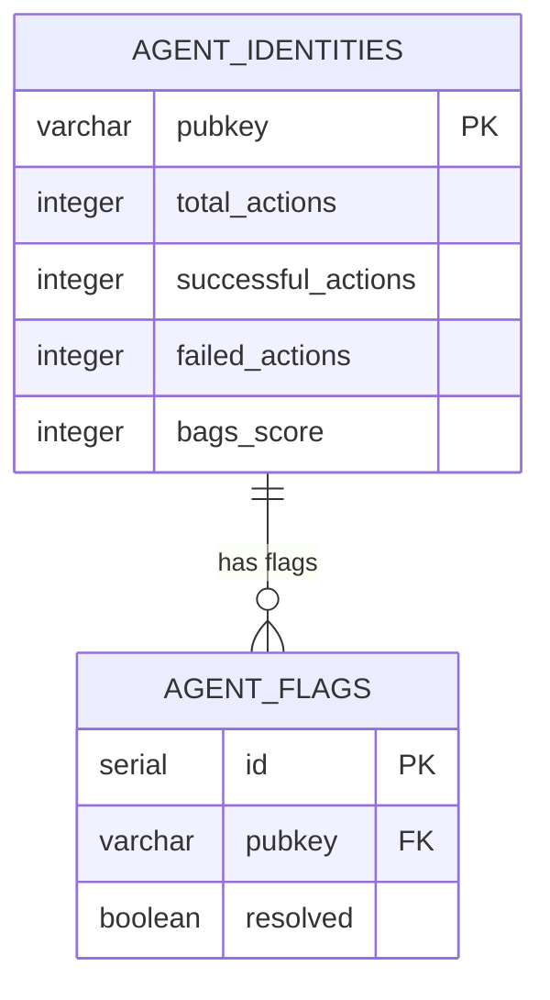
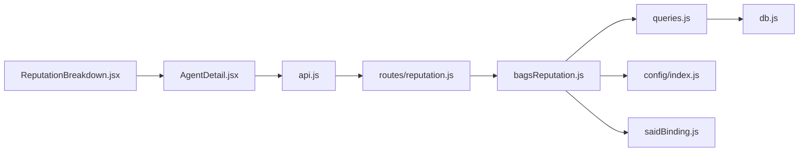

# Bags Ecosystem Reputation Score

<cite>
**Referenced Files in This Document**
- [bagsReputation.js](file://backend/src/services/bagsReputation.js)
- [queries.js](file://backend/src/models/queries.js)
- [db.js](file://backend/src/models/db.js)
- [migrate.js](file://backend/src/models/migrate.js)
- [reputation.js](file://backend/src/routes/reputation.js)
- [config/index.js](file://backend/src/config/index.js)
- [saidBinding.js](file://backend/src/services/saidBinding.js)
- [api.js](file://frontend/src/lib/api.js)
- [AgentDetail.jsx](file://frontend/src/pages/AgentDetail.jsx)
- [ReputationBreakdown.jsx](file://frontend/src/components/ReputationBreakdown.jsx)
</cite>

## Table of Contents
1. [Introduction](#introduction)
2. [Project Structure](#project-structure)
3. [Core Components](#core-components)
4. [Architecture Overview](#architecture-overview)
5. [Detailed Component Analysis](#detailed-component-analysis)
6. [Dependency Analysis](#dependency-analysis)
7. [Performance Considerations](#performance-considerations)
8. [Troubleshooting Guide](#troubleshooting-guide)
9. [Conclusion](#conclusion)

## Introduction
This document explains the Bags Ecosystem Reputation Score component that evaluates agent trustworthiness using a 5-factor scoring algorithm. It covers how the score is computed, how external APIs integrate with the system, how database queries power action metrics, and how flag resolution impacts scores. It also documents the reputation breakdown JSON structure, the real-time nature of score updates, and the frontend integration for displaying reputation data.

## Project Structure
The reputation system spans backend services, database models, and frontend components:
- Backend services compute the score and expose it via an API route.
- Database models encapsulate all data access and persistence.
- Frontend pages and components render the reputation breakdown and integrate with the backend API.

**Diagram sources**
- [bagsReputation.js:16-122](file://backend/src/services/bagsReputation.js#L16-L122)
- [queries.js:146-202](file://backend/src/models/queries.js#L146-L202)
- [db.js:31-39](file://backend/src/models/db.js#L31-L39)
- [config/index.js:11-14](file://backend/src/config/index.js#L11-L14)
- [saidBinding.js:61-86](file://backend/src/services/saidBinding.js#L61-L86)
- [reputation.js:17-41](file://backend/src/routes/reputation.js#L17-L41)
- [AgentDetail.jsx:186-212](file://frontend/src/pages/AgentDetail.jsx#L186-L212)
- [ReputationBreakdown.jsx:46-144](file://frontend/src/components/ReputationBreakdown.jsx#L46-L144)
- [api.js:59-62](file://frontend/src/lib/api.js#L59-L62)

**Section sources**
- [bagsReputation.js:16-122](file://backend/src/services/bagsReputation.js#L16-L122)
- [queries.js:146-202](file://backend/src/models/queries.js#L146-L202)
- [db.js:31-39](file://backend/src/models/db.js#L31-L39)
- [config/index.js:11-14](file://backend/src/config/index.js#L11-L14)
- [saidBinding.js:61-86](file://backend/src/services/saidBinding.js#L61-L86)
- [reputation.js:17-41](file://backend/src/routes/reputation.js#L17-L41)
- [AgentDetail.jsx:186-212](file://frontend/src/pages/AgentDetail.jsx#L186-L212)
- [ReputationBreakdown.jsx:46-144](file://frontend/src/components/ReputationBreakdown.jsx#L46-L144)
- [api.js:59-62](file://frontend/src/lib/api.js#L59-L62)

## Core Components
- Reputation computation service: computes the 5-factor score and returns a structured breakdown.
- Database model: provides queries for agent data, action metrics, and flag counts.
- API route: exposes the reputation endpoint for clients.
- Frontend integration: renders the reputation breakdown and fetches data via the API.

Key responsibilities:
- computeBagsScore: orchestrates all scoring factors and returns total score and label.
- Queries: supply agent metadata, action statistics, and flag counts.
- Route: validates agent existence and returns the computed reputation.
- Frontend: displays the breakdown and integrates with the API.

**Section sources**
- [bagsReputation.js:16-122](file://backend/src/services/bagsReputation.js#L16-L122)
- [queries.js:146-202](file://backend/src/models/queries.js#L146-L202)
- [reputation.js:17-41](file://backend/src/routes/reputation.js#L17-L41)
- [ReputationBreakdown.jsx:46-144](file://frontend/src/components/ReputationBreakdown.jsx#L46-L144)

## Architecture Overview
The reputation system is a real-time pipeline:
- Clients call the backend reputation endpoint.
- The backend loads agent data and calculates the score using five factors.
- External APIs are queried for fee analytics and SAID trust score.
- Database queries provide action metrics and flag counts.
- The result is returned immediately to the client.

**Diagram sources**
- [AgentDetail.jsx:186-212](file://frontend/src/pages/AgentDetail.jsx#L186-L212)
- [api.js:59-62](file://frontend/src/lib/api.js#L59-L62)
- [reputation.js:17-41](file://backend/src/routes/reputation.js#L17-L41)
- [bagsReputation.js:16-122](file://backend/src/services/bagsReputation.js#L16-L122)
- [queries.js:146-202](file://backend/src/models/queries.js#L146-L202)
- [saidBinding.js:61-86](file://backend/src/services/saidBinding.js#L61-L86)

## Detailed Component Analysis

### 5-Factor Scoring Algorithm
The Bags Reputation Score is a weighted sum of five factors, each capped at a maximum value:
- Fee claiming activity: up to 30 points
- Successful action rate: up to 25 points
- Registration age: up to 20 points
- SAID trust score contribution: up to 15 points
- Community verification: up to 10 points

Final score categorization:
- HIGH: 80–100
- MEDIUM: 60–79
- LOW: 40–59
- UNVERIFIED: below 40

Point allocation and category thresholds are implemented consistently in both backend and frontend.

**Diagram sources**
- [bagsReputation.js:16-122](file://backend/src/services/bagsReputation.js#L16-L122)

**Section sources**
- [bagsReputation.js:24-94](file://backend/src/services/bagsReputation.js#L24-L94)
- [ReputationBreakdown.jsx:39-67](file://frontend/src/components/ReputationBreakdown.jsx#L39-L67)

### External API Integrations
- Bags Analytics API: Provides fee analytics for a token mint to derive fee activity points.
- SAID Identity Gateway: Provides trust score and label for an agent.

Integration details:
- Bags Analytics API is called with a timeout to prevent blocking.
- SAID trust score is fetched and normalized to a 0–15 point contribution.
- Both integrations are wrapped with try/catch to ensure robustness.

**Section sources**
- [bagsReputation.js:27-38](file://backend/src/services/bagsReputation.js#L27-L38)
- [bagsReputation.js:68-75](file://backend/src/services/bagsReputation.js#L68-L75)
- [config/index.js:11-14](file://backend/src/config/index.js#L11-L14)
- [saidBinding.js:61-86](file://backend/src/services/saidBinding.js#L61-L86)

### Database Queries for Action Metrics
The system relies on a single agent record with counters for actions and a separate flags table for community verification:
- Action metrics: total_actions, successful_actions, failed_actions.
- Flags: unresolved flag count determines community verification points.

**Diagram sources**
- [migrate.js:11-34](file://backend/src/models/migrate.js#L11-L34)
- [queries.js:187-202](file://backend/src/models/queries.js#L187-L202)
- [queries.js:299-305](file://backend/src/models/queries.js#L299-L305)

**Section sources**
- [queries.js:187-202](file://backend/src/models/queries.js#L187-L202)
- [queries.js:299-305](file://backend/src/models/queries.js#L299-L305)
- [migrate.js:11-34](file://backend/src/models/migrate.js#L11-L34)

### Flag Resolution Impact on Scores
- Unresolved flags reduce community verification points:
  - 0 unresolved flags: 10 points
  - 1 unresolved flag: 5 points
  - More than 1 unresolved flag: 0 points
- If flag resolution fails, the system defaults to full points to avoid penalizing agents due to transient failures.

**Section sources**
- [bagsReputation.js:77-90](file://backend/src/services/bagsReputation.js#L77-L90)
- [queries.js:299-305](file://backend/src/models/queries.js#L299-L305)

### Real-Time Score Updates
- The reputation endpoint returns the latest computed score based on current agent data and external API responses.
- The score is stored in the agent record and can be refreshed programmatically via a dedicated function that recomputes and persists the score.

**Section sources**
- [reputation.js:17-41](file://backend/src/routes/reputation.js#L17-L41)
- [bagsReputation.js:129-140](file://backend/src/services/bagsReputation.js#L129-L140)
- [queries.js:151-160](file://backend/src/models/queries.js#L151-L160)

### Reputation Breakdown JSON Structure
The backend returns a structured object containing:
- score: total score (0–100)
- label: categorical label (HIGH/MEDIUM/LOW/UNVERIFIED)
- breakdown: object with each factor’s score and maximum
- saidScore: raw SAID trust score used for display

Frontend consumes this structure to render the visual breakdown.

**Section sources**
- [bagsReputation.js:107-118](file://backend/src/services/bagsReputation.js#L107-L118)
- [AgentDetail.jsx:186-212](file://frontend/src/pages/AgentDetail.jsx#L186-L212)
- [ReputationBreakdown.jsx:46-144](file://frontend/src/components/ReputationBreakdown.jsx#L46-L144)

### Frontend Integration
- The agent detail page fetches reputation data alongside other agent information.
- The ReputationBreakdown component renders a visual progress bar for each factor and computes the overall label.
- The API client abstracts HTTP calls to the backend.

**Section sources**
- [AgentDetail.jsx:186-212](file://frontend/src/pages/AgentDetail.jsx#L186-L212)
- [ReputationBreakdown.jsx:46-144](file://frontend/src/components/ReputationBreakdown.jsx#L46-L144)
- [api.js:59-62](file://frontend/src/lib/api.js#L59-L62)

## Dependency Analysis
The reputation service depends on:
- Database queries for agent data, action metrics, and flags.
- External APIs for fee analytics and SAID trust score.
- Configuration for API keys and gateway URLs.

**Diagram sources**
- [bagsReputation.js:8-9](file://backend/src/services/bagsReputation.js#L8-L9)
- [queries.js:6](file://backend/src/models/queries.js#L6)
- [db.js:6](file://backend/src/models/db.js#L6)
- [config/index.js:11-14](file://backend/src/config/index.js#L11-L14)
- [saidBinding.js:6](file://backend/src/services/saidBinding.js#L6)
- [reputation.js:7-8](file://backend/src/routes/reputation.js#L7-L8)
- [AgentDetail.jsx:3](file://frontend/src/pages/AgentDetail.jsx#L3)
- [api.js:1](file://frontend/src/lib/api.js#L1)

**Section sources**
- [bagsReputation.js:8-9](file://backend/src/services/bagsReputation.js#L8-L9)
- [queries.js:6](file://backend/src/models/queries.js#L6)
- [db.js:6](file://backend/src/models/db.js#L6)
- [config/index.js:11-14](file://backend/src/config/index.js#L11-L14)
- [saidBinding.js:6](file://backend/src/services/saidBinding.js#L6)
- [reputation.js:7-8](file://backend/src/routes/reputation.js#L7-L8)
- [AgentDetail.jsx:3](file://frontend/src/pages/AgentDetail.jsx#L3)
- [api.js:1](file://frontend/src/lib/api.js#L1)

## Performance Considerations
- External API timeouts: fee analytics and SAID trust score requests include timeouts to prevent slow responses from blocking the reputation computation.
- Database indexing: indexes on status and bags_score improve listing and discovery performance.
- Caching: consider caching reputation results for frequently accessed agents to reduce repeated computations and external API calls.

[No sources needed since this section provides general guidance]

## Troubleshooting Guide
Common issues and resolutions:
- Agent not found: The route checks agent existence and returns a 404 if missing.
- External API failures: Fee analytics and SAID trust score calls are wrapped in try/catch; failures default to zero points for those factors.
- Flag resolution errors: If counting unresolved flags fails, the system defaults to full community points to avoid penalizing agents.
- Database errors: Queries wrap pool errors and rethrow for upstream handling.

**Section sources**
- [reputation.js:22-28](file://backend/src/routes/reputation.js#L22-L28)
- [bagsReputation.js:35-38](file://backend/src/services/bagsReputation.js#L35-L38)
- [bagsReputation.js:74-75](file://backend/src/services/bagsReputation.js#L74-L75)
- [bagsReputation.js:88-90](file://backend/src/services/bagsReputation.js#L88-L90)
- [db.js:35-38](file://backend/src/models/db.js#L35-L38)

## Conclusion
The Bags Ecosystem Reputation Score provides a transparent, real-time evaluation of agent trustworthiness across five well-defined factors. Its modular design integrates cleanly with external APIs and the local database, while the frontend presents a clear, visual breakdown of each factor. The system’s error-handling ensures resilience against external and internal failures, and the consistent scoring logic guarantees predictable categorization.