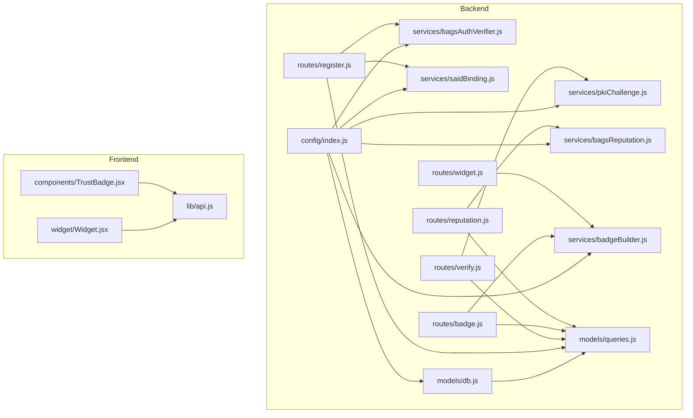
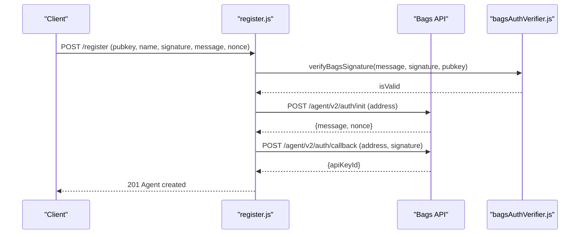
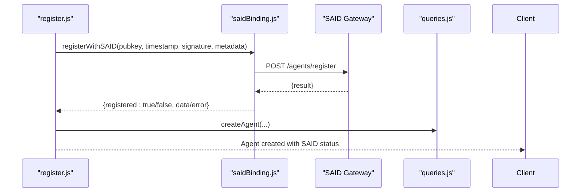
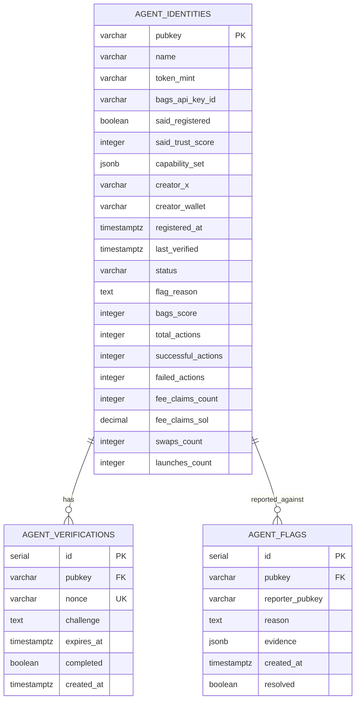
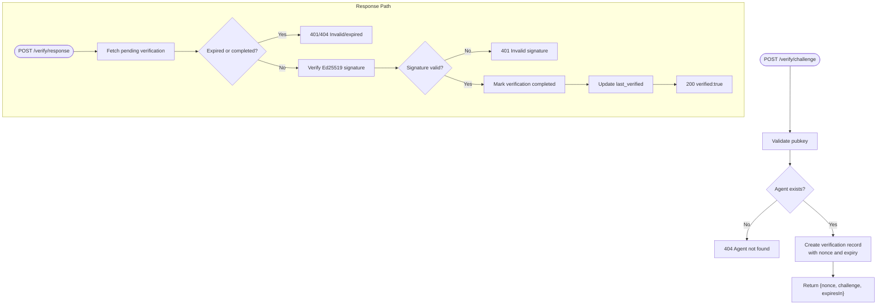
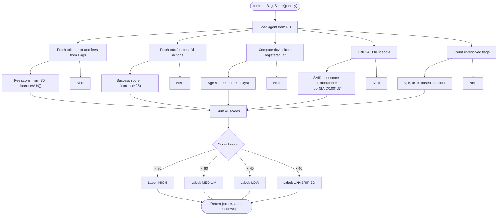
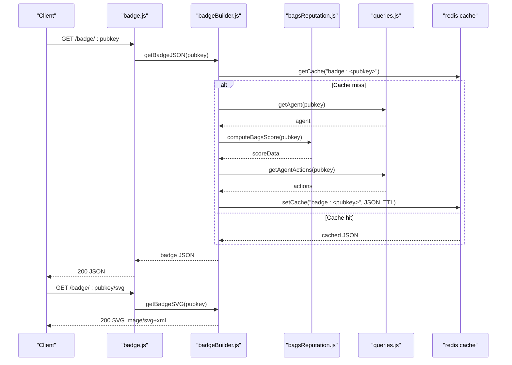
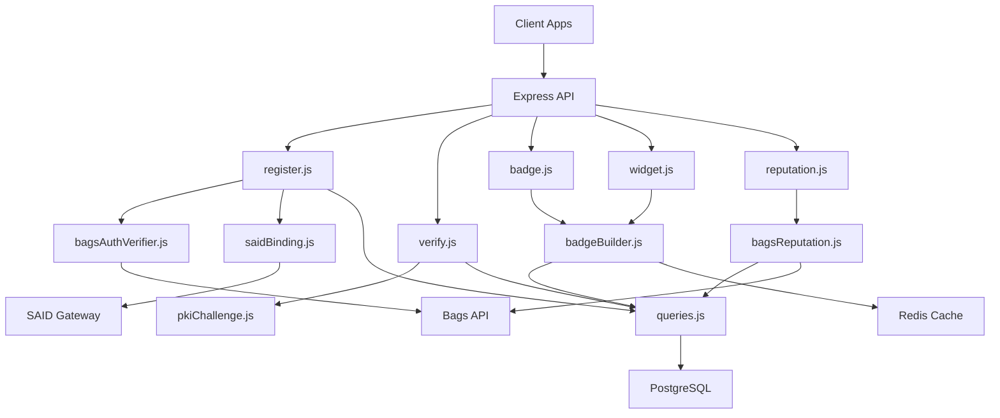
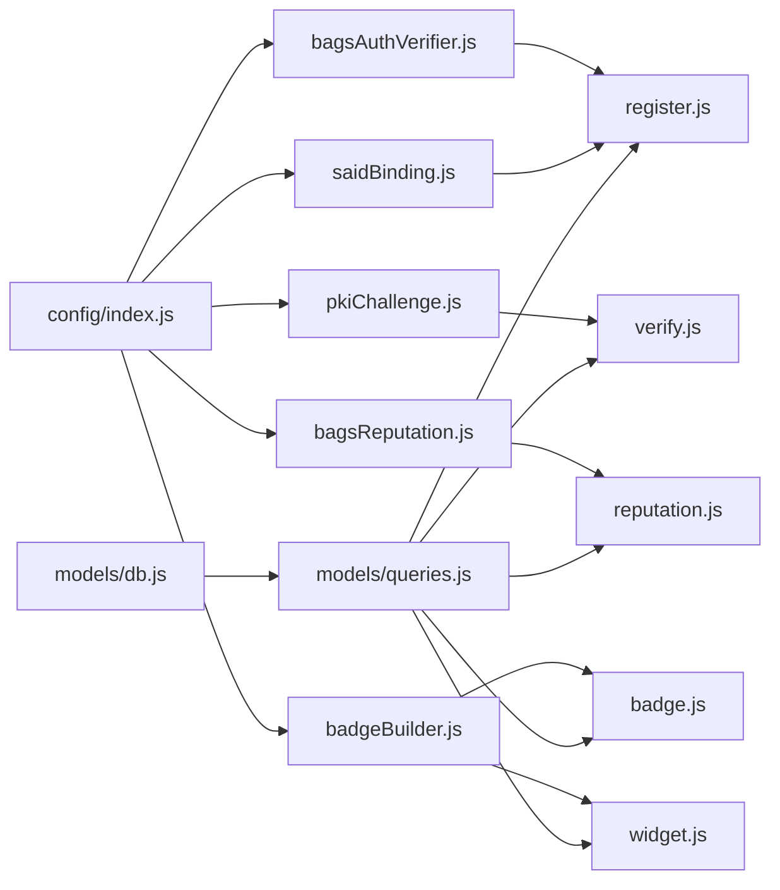

# Core Components

<cite>
**Referenced Files in This Document**
- [agentid_build_plan.md](file://agentid_build_plan.md)
- [bagsAuthVerifier.js](file://backend/src/services/bagsAuthVerifier.js)
- [saidBinding.js](file://backend/src/services/saidBinding.js)
- [pkiChallenge.js](file://backend/src/services/pkiChallenge.js)
- [bagsReputation.js](file://backend/src/services/bagsReputation.js)
- [badgeBuilder.js](file://backend/src/services/badgeBuilder.js)
- [db.js](file://backend/src/models/db.js)
- [queries.js](file://backend/src/models/queries.js)
- [register.js](file://backend/src/routes/register.js)
- [verify.js](file://backend/src/routes/verify.js)
- [badge.js](file://backend/src/routes/badge.js)
- [widget.js](file://backend/src/routes/widget.js)
- [reputation.js](file://backend/src/routes/reputation.js)
- [index.js](file://backend/src/config/index.js)
- [TrustBadge.jsx](file://frontend/src/components/TrustBadge.jsx)
- [Widget.jsx](file://frontend/src/widget/Widget.jsx)
- [api.js](file://frontend/src/lib/api.js)
</cite>

## Table of Contents
1. [Introduction](#introduction)
2. [Project Structure](#project-structure)
3. [Core Components](#core-components)
4. [Architecture Overview](#architecture-overview)
5. [Detailed Component Analysis](#detailed-component-analysis)
6. [Dependency Analysis](#dependency-analysis)
7. [Performance Considerations](#performance-considerations)
8. [Troubleshooting Guide](#troubleshooting-guide)
9. [Conclusion](#conclusion)

## Introduction
This document details the six major subsystems that compose AgentID’s trust verification platform. Each component is grounded in the repository’s implementation and build plan, focusing on how they collaborate to establish identity, prevent spoofing, compute reputation, and surface trust signals through badges and widgets. The components are:
- Component 1: Bags Agent Auth Wrapper
- Component 2: SAID Protocol Binding
- Component 3: AgentID Database Record
- Component 4: PKI Challenge-Response
- Component 5: Bags Ecosystem Reputation Score
- Component 6: Trust Badge API + Widget

## Project Structure
AgentID is organized into a backend service (Node.js/Express) and a frontend (React/Vite). The backend exposes REST endpoints, integrates external APIs (Bags and SAID), and manages a PostgreSQL database with Redis caching. The frontend includes a registry UI and an embeddable widget.

**Diagram sources**
- [index.js:1-31](file://backend/src/config/index.js#L1-L31)
- [db.js:1-45](file://backend/src/models/db.js#L1-L45)
- [queries.js:1-404](file://backend/src/models/queries.js#L1-L404)
- [register.js:1-162](file://backend/src/routes/register.js#L1-L162)
- [verify.js:1-121](file://backend/src/routes/verify.js#L1-L121)
- [badge.js:1-58](file://backend/src/routes/badge.js#L1-L58)
- [widget.js:1-89](file://backend/src/routes/widget.js#L1-L89)
- [reputation.js:1-44](file://backend/src/routes/reputation.js#L1-L44)
- [bagsAuthVerifier.js:1-93](file://backend/src/services/bagsAuthVerifier.js#L1-L93)
- [saidBinding.js:1-119](file://backend/src/services/saidBinding.js#L1-L119)
- [pkiChallenge.js:1-102](file://backend/src/services/pkiChallenge.js#L1-L102)
- [bagsReputation.js:1-146](file://backend/src/services/bagsReputation.js#L1-L146)
- [badgeBuilder.js:1-497](file://backend/src/services/badgeBuilder.js#L1-L497)
- [TrustBadge.jsx:1-145](file://frontend/src/components/TrustBadge.jsx#L1-L145)
- [Widget.jsx:1-218](file://frontend/src/widget/Widget.jsx#L1-L218)
- [api.js:1-140](file://frontend/src/lib/api.js#L1-L140)

**Section sources**
- [agentid_build_plan.md:258-302](file://agentid_build_plan.md#L258-L302)

## Core Components

### Component 1: Bags Agent Auth Wrapper
Purpose: Wrap Bags’ Ed25519 agent authentication to verify wallet ownership as the first step of registration. This prevents spoofing by ensuring only owners of the claimed public key can proceed.

Key behaviors:
- Initialize Bags auth challenge and receive message and nonce.
- Verify Ed25519 signature locally before invoking Bags callback.
- Return a reference identifier for subsequent steps.

**Diagram sources**
- [register.js:59-159](file://backend/src/routes/register.js#L59-L159)
- [bagsAuthVerifier.js:18-86](file://backend/src/services/bagsAuthVerifier.js#L18-L86)

**Section sources**
- [bagsAuthVerifier.js:1-93](file://backend/src/services/bagsAuthVerifier.js#L1-L93)
- [register.js:1-162](file://backend/src/routes/register.js#L1-L162)
- [agentid_build_plan.md:39-62](file://agentid_build_plan.md#L39-L62)

### Component 2: SAID Protocol Binding
Purpose: Bind the agent identity to the SAID Identity Gateway, inheriting SAID’s trust score and enabling A2A discovery. AgentID extends SAID records with Bags-specific metadata.

Key behaviors:
- Register agent with SAID, including Bags-specific fields.
- Retrieve SAID trust score and agent listings.
- Discover agents by capability via SAID.

**Diagram sources**
- [register.js:112-136](file://backend/src/routes/register.js#L112-L136)
- [saidBinding.js:21-54](file://backend/src/services/saidBinding.js#L21-L54)
- [queries.js:17-29](file://backend/src/models/queries.js#L17-L29)

**Section sources**
- [saidBinding.js:1-119](file://backend/src/services/saidBinding.js#L1-L119)
- [register.js:112-136](file://backend/src/routes/register.js#L112-L136)
- [agentid_build_plan.md:63-86](file://agentid_build_plan.md#L63-L86)

### Component 3: AgentID Database Record
Purpose: Persist AgentID-specific agent data, verification challenges, and flags. Provides structured storage for trust state and reputation metrics.

Key entities:
- agent_identities: agent metadata, status, scores, and action counts.
- agent_verifications: issued challenges with expiry and completion.
- agent_flags: community-reported flags with resolution.

**Diagram sources**
- [agentid_build_plan.md:87-130](file://agentid_build_plan.md#L87-L130)
- [queries.js:17-29](file://backend/src/models/queries.js#L17-L29)
- [queries.js:213-222](file://backend/src/models/queries.js#L213-L222)
- [queries.js:267-279](file://backend/src/models/queries.js#L267-L279)

**Section sources**
- [agentid_build_plan.md:87-130](file://agentid_build_plan.md#L87-L130)
- [db.js:1-45](file://backend/src/models/db.js#L1-L45)
- [queries.js:1-404](file://backend/src/models/queries.js#L1-L404)

### Component 4: PKI Challenge-Response
Purpose: Ongoing verification to prevent spoofing and detect replay attacks. Agents must sign a scoped challenge to prove current possession of their Ed25519 key.

Key behaviors:
- Issue a challenge with a random nonce and timestamp.
- Enforce single-use and expiry (configurable).
- Verify Ed25519 signature against the stored challenge.
- Update last verified timestamp upon success.

**Diagram sources**
- [verify.js:18-51](file://backend/src/routes/verify.js#L18-L51)
- [verify.js:57-118](file://backend/src/routes/verify.js#L57-L118)
- [pkiChallenge.js:17-96](file://backend/src/services/pkiChallenge.js#L17-L96)
- [queries.js:230-256](file://backend/src/models/queries.js#L230-L256)

**Section sources**
- [pkiChallenge.js:1-102](file://backend/src/services/pkiChallenge.js#L1-L102)
- [verify.js:1-121](file://backend/src/routes/verify.js#L1-L121)
- [agentid_build_plan.md:131-184](file://agentid_build_plan.md#L131-L184)

### Component 5: Bags Ecosystem Reputation Score
Purpose: Compute a composite trust score (0–100) using five factors derived from live data and internal metrics.

Factors:
- Fee activity: SOL fees earned (up to 30 points).
- Success rate: ratio of successful to total actions (up to 25 points).
- Registration age: days since registration (up to 20 points).
- SAID trust score: inherited trust scaled to 15 points.
- Community verification: flags impact (10, 5, or 0 points).

**Diagram sources**
- [bagsReputation.js:16-140](file://backend/src/services/bagsReputation.js#L16-L140)
- [queries.js:187-202](file://backend/src/models/queries.js#L187-L202)
- [queries.js:299-305](file://backend/src/models/queries.js#L299-L305)

**Section sources**
- [bagsReputation.js:1-146](file://backend/src/services/bagsReputation.js#L1-L146)
- [agentid_build_plan.md:185-227](file://agentid_build_plan.md#L185-L227)

### Component 6: Trust Badge API + Widget
Purpose: Expose trust badges in multiple formats and provide an embeddable widget for third-party apps.

Endpoints:
- GET /badge/:pubkey → JSON badge data.
- GET /badge/:pubkey/svg → SVG image for documentation/readmes.
- GET /widget/:pubkey → HTML widget for iframe embedding.

Badge builder:
- Caches badge JSON for performance.
- Builds SVG with dynamic colors and status icons.
- Generates a rich HTML widget with live refresh and capability tags.

**Diagram sources**
- [badge.js:16-55](file://backend/src/routes/badge.js#L16-L55)
- [badgeBuilder.js:17-83](file://backend/src/services/badgeBuilder.js#L17-L83)
- [bagsReputation.js:16-140](file://backend/src/services/bagsReputation.js#L16-L140)
- [queries.js:36-38](file://backend/src/models/queries.js#L36-L38)
- [queries.js:187-202](file://backend/src/models/queries.js#L187-L202)

**Section sources**
- [badgeBuilder.js:1-497](file://backend/src/services/badgeBuilder.js#L1-L497)
- [badge.js:1-58](file://backend/src/routes/badge.js#L1-L58)
- [widget.js:1-89](file://backend/src/routes/widget.js#L1-L89)
- [agentid_build_plan.md:228-257](file://agentid_build_plan.md#L228-L257)

## Architecture Overview
AgentID orchestrates identity, verification, and trust presentation across three layers:
- External integrations: Bags API and SAID Identity Gateway.
- Backend services: authentication wrapper, SAID binding, PKI challenge-response, reputation engine, and badge builder.
- Storage: PostgreSQL for identities, verifications, and flags; Redis for caching and nonce storage.
- Frontend: registry UI and embeddable widget.

**Diagram sources**
- [register.js:1-162](file://backend/src/routes/register.js#L1-L162)
- [verify.js:1-121](file://backend/src/routes/verify.js#L1-L121)
- [badge.js:1-58](file://backend/src/routes/badge.js#L1-L58)
- [widget.js:1-89](file://backend/src/routes/widget.js#L1-L89)
- [reputation.js:1-44](file://backend/src/routes/reputation.js#L1-L44)
- [bagsAuthVerifier.js:1-93](file://backend/src/services/bagsAuthVerifier.js#L1-L93)
- [saidBinding.js:1-119](file://backend/src/services/saidBinding.js#L1-L119)
- [pkiChallenge.js:1-102](file://backend/src/services/pkiChallenge.js#L1-L102)
- [bagsReputation.js:1-146](file://backend/src/services/bagsReputation.js#L1-L146)
- [badgeBuilder.js:1-497](file://backend/src/services/badgeBuilder.js#L1-L497)
- [queries.js:1-404](file://backend/src/models/queries.js#L1-L404)
- [db.js:1-45](file://backend/src/models/db.js#L1-L45)
- [index.js:1-31](file://backend/src/config/index.js#L1-L31)

## Detailed Component Analysis

### Component 1: Bags Agent Auth Wrapper
- Authentication flow: initialization, signature verification, and callback.
- Security: local Ed25519 verification prevents misuse of signatures.
- Integration: uses environment-configured Bags API key and base URL.

**Section sources**
- [bagsAuthVerifier.js:1-93](file://backend/src/services/bagsAuthVerifier.js#L1-L93)
- [register.js:59-101](file://backend/src/routes/register.js#L59-L101)
- [index.js:11-14](file://backend/src/config/index.js#L11-L14)

### Component 2: SAID Protocol Binding
- Registration: posts to SAID with extended Bags metadata.
- Trust retrieval: obtains SAID trust score and labels.
- Discovery: supports capability-based agent discovery.

**Section sources**
- [saidBinding.js:21-112](file://backend/src/services/saidBinding.js#L21-L112)
- [register.js:112-136](file://backend/src/routes/register.js#L112-L136)
- [bagsReputation.js:66-75](file://backend/src/services/bagsReputation.js#L66-L75)

### Component 3: AgentID Database Record
- Schema: identities, verifications, and flags with appropriate constraints.
- Queries: CRUD and aggregation helpers for actions, flags, and discovery.
- Safety: parameterized queries and explicit field whitelists.

**Section sources**
- [agentid_build_plan.md:87-130](file://agentid_build_plan.md#L87-L130)
- [queries.js:17-202](file://backend/src/models/queries.js#L17-L202)
- [queries.js:213-357](file://backend/src/models/queries.js#L213-L357)

### Component 4: PKI Challenge-Response
- Issuance: generates UUID nonce and timestamp, encodes challenge, stores with expiry.
- Verification: validates encoding, checks expiry, verifies Ed25519 signature, marks used, updates timestamps.
- Replay protection: single-use and expiry enforced.

**Section sources**
- [pkiChallenge.js:17-96](file://backend/src/services/pkiChallenge.js#L17-L96)
- [verify.js:57-118](file://backend/src/routes/verify.js#L57-L118)
- [index.js](file://backend/src/config/index.js#L27)

### Component 5: Bags Ecosystem Reputation Score
- Factors: fee activity, success rate, registration age, SAID trust, and community verification.
- Scoring: bounded contributions summed to produce label buckets.
- Persistence: stores computed score back to agent record.

**Section sources**
- [bagsReputation.js:16-140](file://backend/src/services/bagsReputation.js#L16-L140)
- [queries.js:187-202](file://backend/src/models/queries.js#L187-L202)
- [queries.js:299-305](file://backend/src/models/queries.js#L299-L305)

### Component 6: Trust Badge API + Widget
- Badge JSON: caches results, computes reputation, aggregates stats.
- SVG: generates static badge images with status-specific theming.
- Widget: HTML renderer with live refresh and capability tags; standalone axios instance for iframe compatibility.

**Section sources**
- [badgeBuilder.js:17-162](file://backend/src/services/badgeBuilder.js#L17-L162)
- [badgeBuilder.js:169-475](file://backend/src/services/badgeBuilder.js#L169-L475)
- [badge.js:16-55](file://backend/src/routes/badge.js#L16-L55)
- [widget.js:18-85](file://backend/src/routes/widget.js#L18-L85)
- [TrustBadge.jsx:42-135](file://frontend/src/components/TrustBadge.jsx#L42-L135)
- [Widget.jsx:61-215](file://frontend/src/widget/Widget.jsx#L61-L215)
- [api.js:52-116](file://frontend/src/lib/api.js#L52-L116)

## Dependency Analysis
- External dependencies: Bags API, SAID Identity Gateway, PostgreSQL, Redis.
- Internal dependencies: services depend on models/queries and config; routes depend on services and enforce validation and rate limits.
- Coupling: services encapsulate domain logic; routes focus on transport and validation; models abstract persistence.

**Diagram sources**
- [index.js:1-31](file://backend/src/config/index.js#L1-L31)
- [bagsAuthVerifier.js:1-93](file://backend/src/services/bagsAuthVerifier.js#L1-L93)
- [saidBinding.js:1-119](file://backend/src/services/saidBinding.js#L1-L119)
- [pkiChallenge.js:1-102](file://backend/src/services/pkiChallenge.js#L1-L102)
- [bagsReputation.js:1-146](file://backend/src/services/bagsReputation.js#L1-L146)
- [badgeBuilder.js:1-497](file://backend/src/services/badgeBuilder.js#L1-L497)
- [db.js:1-45](file://backend/src/models/db.js#L1-L45)
- [queries.js:1-404](file://backend/src/models/queries.js#L1-L404)
- [register.js:1-162](file://backend/src/routes/register.js#L1-L162)
- [verify.js:1-121](file://backend/src/routes/verify.js#L1-L121)
- [badge.js:1-58](file://backend/src/routes/badge.js#L1-L58)
- [widget.js:1-89](file://backend/src/routes/widget.js#L1-L89)
- [reputation.js:1-44](file://backend/src/routes/reputation.js#L1-L44)

**Section sources**
- [index.js:1-31](file://backend/src/config/index.js#L1-L31)
- [queries.js:1-404](file://backend/src/models/queries.js#L1-L404)

## Performance Considerations
- Caching: Badge JSON is cached in Redis with configurable TTL to reduce repeated computation and external API calls.
- Database pooling: PostgreSQL connection pool with production SSL settings for reliability.
- Rate limiting: Route-level rate limiters protect endpoints from abuse.
- Asynchronous operations: SAID binding is attempted but non-blocking during registration to avoid blocking the primary flow.

[No sources needed since this section provides general guidance]

## Troubleshooting Guide
Common issues and remedies:
- Registration failures:
  - Invalid signature or missing nonce in message: ensure the message includes the nonce and signature is generated by the claimed key.
  - SAID registration unavailable: logs a warning and continues; retry or check SAID gateway status.
- Verification failures:
  - Challenge not found/expired: re-issue challenge; ensure client respects expiry.
  - Invalid signature/encoding: confirm base58 encoding and Ed25519 key pair correctness.
- Badge/widget errors:
  - Agent not found: verify pubkey format and registration status.
  - Cache misses: expect latency on first request; subsequent requests use cache.

**Section sources**
- [register.js:88-101](file://backend/src/routes/register.js#L88-L101)
- [register.js:132-136](file://backend/src/routes/register.js#L132-L136)
- [verify.js:93-113](file://backend/src/routes/verify.js#L93-L113)
- [pkiChallenge.js:49-96](file://backend/src/services/pkiChallenge.js#L49-L96)
- [badge.js:24-31](file://backend/src/routes/badge.js#L24-L31)
- [widget.js:24-77](file://backend/src/routes/widget.js#L24-L77)

## Conclusion
AgentID’s six components form a cohesive trust layer:
- Bags Agent Auth Wrapper establishes ownership early.
- SAID Protocol Binding integrates with the broader Solana agent ecosystem.
- AgentID Database Record persists state and metrics.
- PKI Challenge-Response prevents spoofing and replays.
- Bags Ecosystem Reputation Score synthesizes live and historical signals.
- Trust Badge API + Widget delivers human-readable trust everywhere.

These components collectively enable a robust, extensible system for verifying and communicating agent trust in the Bags ecosystem.