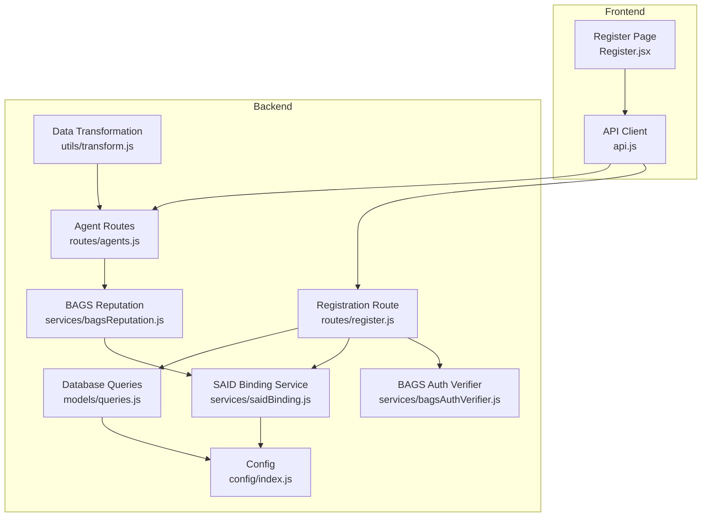
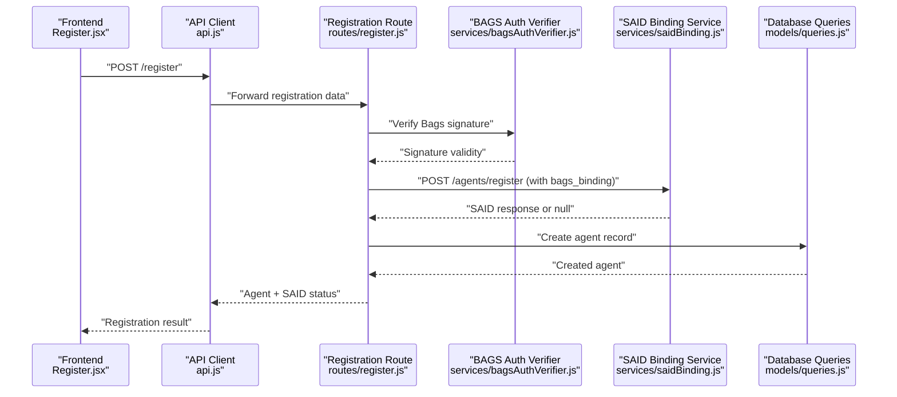
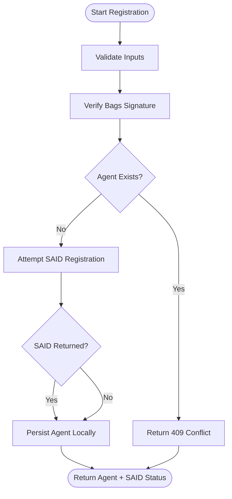
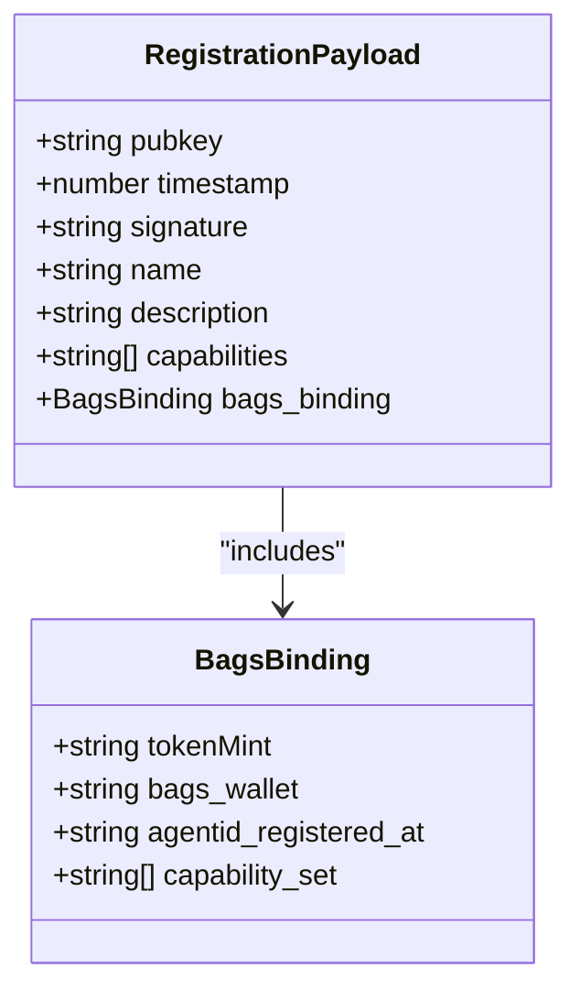
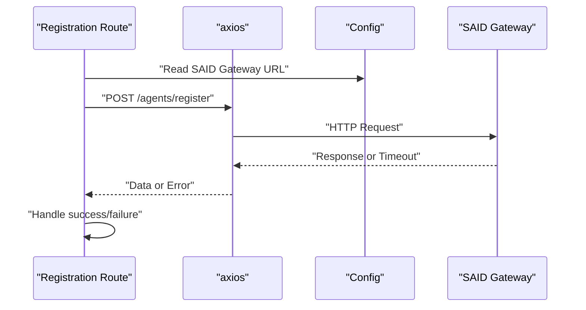
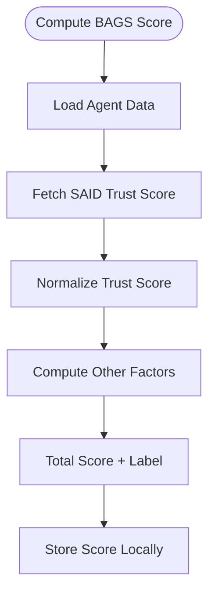
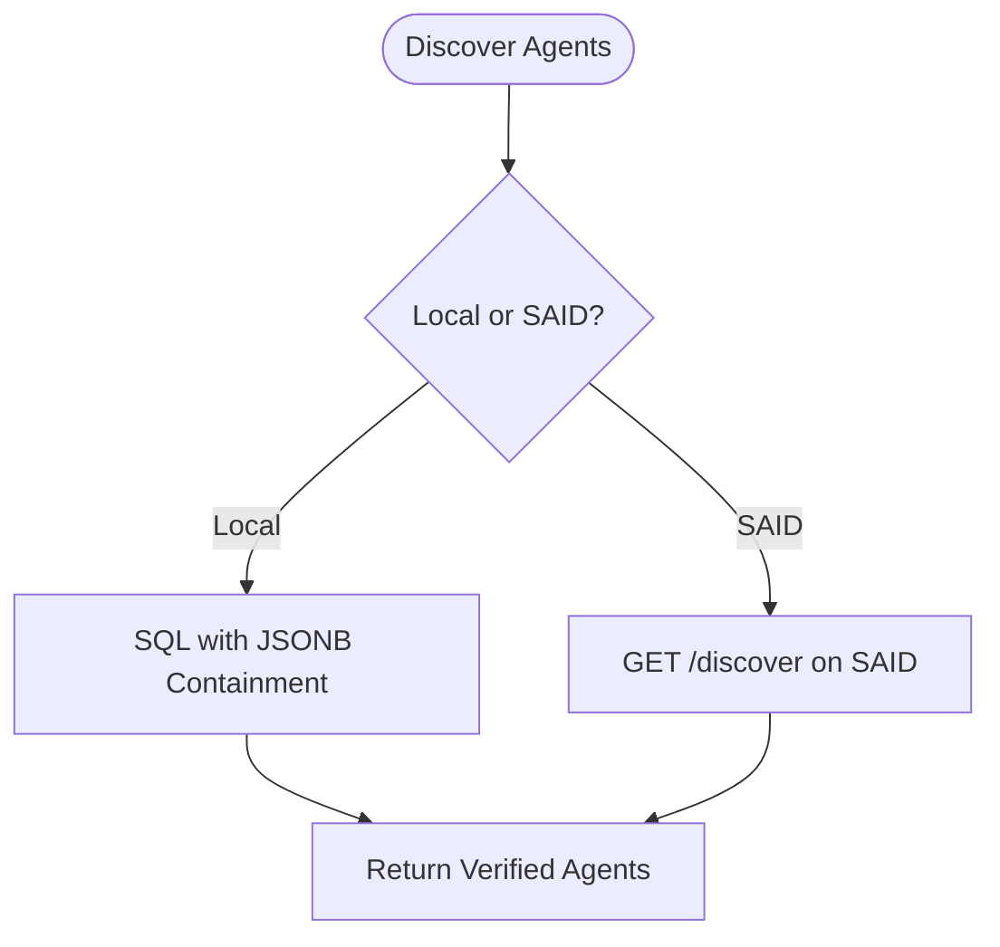
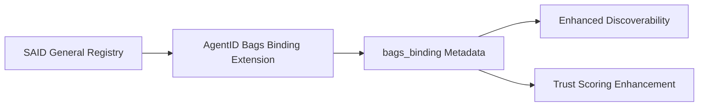
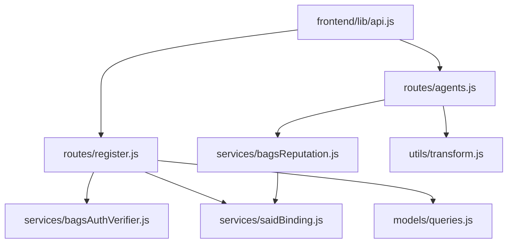

# SAID Protocol Binding

<cite>
**Referenced Files in This Document**
- [register.js](file://backend/src/routes/register.js)
- [agents.js](file://backend/src/routes/agents.js)
- [saidBinding.js](file://backend/src/services/saidBinding.js)
- [bagsAuthVerifier.js](file://backend/src/services/bagsAuthVerifier.js)
- [bagsReputation.js](file://backend/src/services/bagsReputation.js)
- [queries.js](file://backend/src/models/queries.js)
- [transform.js](file://backend/src/utils/transform.js)
- [migrate.js](file://backend/src/models/migrate.js)
- [api.js](file://frontend/src/lib/api.js)
- [Register.jsx](file://frontend/src/pages/Register.jsx)
- [index.js](file://backend/src/config/index.js)
</cite>

## Table of Contents
1. [Introduction](#introduction)
2. [Project Structure](#project-structure)
3. [Core Components](#core-components)
4. [Architecture Overview](#architecture-overview)
5. [Detailed Component Analysis](#detailed-component-analysis)
6. [Dependency Analysis](#dependency-analysis)
7. [Performance Considerations](#performance-considerations)
8. [Troubleshooting Guide](#troubleshooting-guide)
9. [Conclusion](#conclusion)

## Introduction
This document explains the SAID Protocol Binding component that integrates AgentID with Solana's Agent Registry (SAID). It covers the registration process, the POST /agents/register endpoint, the metadata extension that AgentID adds, and how AgentID extends SAID records with Bags-specific information. It also documents the JSON payload structure, inheritance of SAID's trust score and attestation trail, A2A discovery integration, and error handling for registration failures.

## Project Structure
The SAID integration spans backend routes, services, models, and utilities, plus frontend integration for user-facing registration.

**Diagram sources**
- [register.js:1-162](file://backend/src/routes/register.js#L1-L162)
- [agents.js:1-255](file://backend/src/routes/agents.js#L1-L255)
- [saidBinding.js:1-119](file://backend/src/services/saidBinding.js#L1-L119)
- [bagsAuthVerifier.js:1-93](file://backend/src/services/bagsAuthVerifier.js#L1-L93)
- [bagsReputation.js:1-146](file://backend/src/services/bagsReputation.js#L1-L146)
- [queries.js:1-404](file://backend/src/models/queries.js#L1-L404)
- [transform.js:1-103](file://backend/src/utils/transform.js#L1-L103)
- [index.js:1-31](file://backend/src/config/index.js#L1-L31)

**Section sources**
- [register.js:1-162](file://backend/src/routes/register.js#L1-L162)
- [agents.js:1-255](file://backend/src/routes/agents.js#L1-L255)
- [saidBinding.js:1-119](file://backend/src/services/saidBinding.js#L1-L119)
- [bagsAuthVerifier.js:1-93](file://backend/src/services/bagsAuthVerifier.js#L1-L93)
- [bagsReputation.js:1-146](file://backend/src/services/bagsReputation.js#L1-L146)
- [queries.js:1-404](file://backend/src/models/queries.js#L1-L404)
- [transform.js:1-103](file://backend/src/utils/transform.js#L1-L103)
- [index.js:1-31](file://backend/src/config/index.js#L1-L31)

## Core Components
- Registration Route: Validates inputs, verifies Bags signature, attempts SAID binding, and persists agent data.
- SAID Binding Service: Posts to SAID's /agents/register endpoint with AgentID's extended metadata.
- BAGS Auth Verifier: Interacts with BAGS APIs to initialize and verify Ed25519 signatures.
- BAGS Reputation Service: Computes a composite score using SAID trust data and other metrics.
- Database Queries: Manages agent persistence, updates, and discovery.
- Data Transformation Utilities: Converts snake_case to camelCase and validates Solana addresses.
- Frontend API Client and Registration Page: Provides user interface and axios integration.

**Section sources**
- [register.js:59-159](file://backend/src/routes/register.js#L59-L159)
- [saidBinding.js:21-54](file://backend/src/services/saidBinding.js#L21-L54)
- [bagsAuthVerifier.js:18-86](file://backend/src/services/bagsAuthVerifier.js#L18-L86)
- [bagsReputation.js:16-140](file://backend/src/services/bagsReputation.js#L16-L140)
- [queries.js:17-73](file://backend/src/models/queries.js#L17-L73)
- [transform.js:43-93](file://backend/src/utils/transform.js#L43-L93)
- [api.js:65-68](file://frontend/src/lib/api.js#L65-L68)
- [Register.jsx:321-341](file://frontend/src/pages/Register.jsx#L321-L341)

## Architecture Overview
The SAID integration follows a non-blocking registration flow:
1. Frontend collects agent metadata and signature.
2. Backend validates inputs and verifies Bags signature.
3. Backend attempts SAID registration with AgentID's extended metadata.
4. Backend stores agent record locally regardless of SAID outcome.
5. Frontend receives registration result and SAID status.

**Diagram sources**
- [Register.jsx:321-341](file://frontend/src/pages/Register.jsx#L321-L341)
- [api.js:65-68](file://frontend/src/lib/api.js#L65-L68)
- [register.js:59-159](file://backend/src/routes/register.js#L59-L159)
- [bagsAuthVerifier.js:44-57](file://backend/src/services/bagsAuthVerifier.js#L44-L57)
- [saidBinding.js:21-54](file://backend/src/services/saidBinding.js#L21-L54)
- [queries.js:17-29](file://backend/src/models/queries.js#L17-L29)

## Detailed Component Analysis

### SAID Identity Gateway Registration Process
- Endpoint: POST /agents/register on the SAID Gateway.
- Payload: Includes standard SAID fields plus AgentID's bags_binding extension.
- Non-blocking SAID binding: Registration continues even if SAID is unavailable.

**Diagram sources**
- [register.js:59-159](file://backend/src/routes/register.js#L59-L159)

**Section sources**
- [register.js:59-159](file://backend/src/routes/register.js#L59-L159)
- [saidBinding.js:21-54](file://backend/src/services/saidBinding.js#L21-L54)

### SAID Registration Payload and Metadata Extension
- Standard SAID fields: pubkey, timestamp, signature, name, description, capabilities.
- AgentID extension: bags_binding object containing token_mint, bags_wallet, agentid_registered_at, and capability_set.
- This extension enriches SAID records with Bags-specific context for discoverability and trust scoring.

**Diagram sources**
- [saidBinding.js:23-36](file://backend/src/services/saidBinding.js#L23-L36)

**Section sources**
- [saidBinding.js:21-54](file://backend/src/services/saidBinding.js#L21-L54)

### Axios Integration and Error Handling
- Backend uses axios to communicate with SAID Gateway and BAGS APIs.
- Configurable timeouts and graceful fallbacks when external services are unavailable.
- Frontend axios client handles auth tokens and global error responses.

**Diagram sources**
- [saidBinding.js:38-53](file://backend/src/services/saidBinding.js#L38-L53)
- [index.js:13-13](file://backend/src/config/index.js#L13-L13)

**Section sources**
- [saidBinding.js:38-53](file://backend/src/services/saidBinding.js#L38-L53)
- [api.js:3-33](file://frontend/src/lib/api.js#L3-L33)

### Inheritance of SAID Trust Score and Attestation Trail
- BAGS reputation service queries SAID trust score and incorporates it into the composite score.
- SAID trust_label and trust_score are extracted and normalized for downstream use.
- Attestation history is maintained locally; SAID attestation trail is accessed via SAID's agent endpoint.

**Diagram sources**
- [bagsReputation.js:61-87](file://backend/src/services/bagsReputation.js#L61-L87)
- [bagsReputation.js:16-122](file://backend/src/services/bagsReputation.js#L16-L122)

**Section sources**
- [bagsReputation.js:61-87](file://backend/src/services/bagsReputation.js#L61-L87)
- [bagsReputation.js:16-122](file://backend/src/services/bagsReputation.js#L16-L122)

### A2A Discovery Integration
- Local discovery filters verified agents by capability using JSONB containment.
- SAID discovery is available via the SAID Binding Service for cross-platform discovery.
- Capability filtering ensures only verified agents are surfaced for discovery.

**Diagram sources**
- [agents.js:97-118](file://backend/src/routes/agents.js#L97-L118)
- [queries.js:332-357](file://backend/src/models/queries.js#L332-L357)
- [saidBinding.js:94-112](file://backend/src/services/saidBinding.js#L94-L112)

**Section sources**
- [agents.js:97-118](file://backend/src/routes/agents.js#L97-L118)
- [queries.js:332-357](file://backend/src/models/queries.js#L332-L357)
- [saidBinding.js:94-112](file://backend/src/services/saidBinding.js#L94-L112)

### Relationship Between SAID General Registry and AgentID Enhancements
- SAID serves as a general-purpose identity registry with trust scores and attestation trails.
- AgentID extends SAID records with bags_binding to add Bags-specific metadata (token_mint, capability_set, etc.).
- This enhancement improves agent discoverability and trust scoring by incorporating Bags analytics and capability sets.

**Diagram sources**
- [saidBinding.js:30-35](file://backend/src/services/saidBinding.js#L30-L35)
- [bagsReputation.js:65-75](file://backend/src/services/bagsReputation.js#L65-L75)

**Section sources**
- [saidBinding.js:30-35](file://backend/src/services/saidBinding.js#L30-L35)
- [bagsReputation.js:65-75](file://backend/src/services/bagsReputation.js#L65-L75)

## Dependency Analysis
- Registration depends on BAGS auth verification and SAID binding services.
- Reputation computation depends on SAID trust score retrieval.
- Agent routes depend on database queries and transformation utilities.
- Frontend depends on API client for all backend interactions.

**Diagram sources**
- [register.js:7-11](file://backend/src/routes/register.js#L7-L11)
- [agents.js:9-12](file://backend/src/routes/agents.js#L9-L12)
- [bagsAuthVerifier.js:1-93](file://backend/src/services/bagsAuthVerifier.js#L1-L93)
- [saidBinding.js:1-119](file://backend/src/services/saidBinding.js#L1-L119)
- [bagsReputation.js:1-146](file://backend/src/services/bagsReputation.js#L1-L146)
- [queries.js:1-404](file://backend/src/models/queries.js#L1-L404)
- [transform.js:1-103](file://backend/src/utils/transform.js#L1-L103)
- [api.js:1-140](file://frontend/src/lib/api.js#L1-L140)

**Section sources**
- [register.js:7-11](file://backend/src/routes/register.js#L7-L11)
- [agents.js:9-12](file://backend/src/routes/agents.js#L9-L12)
- [bagsAuthVerifier.js:1-93](file://backend/src/services/bagsAuthVerifier.js#L1-L93)
- [saidBinding.js:1-119](file://backend/src/services/saidBinding.js#L1-L119)
- [bagsReputation.js:1-146](file://backend/src/services/bagsReputation.js#L1-L146)
- [queries.js:1-404](file://backend/src/models/queries.js#L1-L404)
- [transform.js:1-103](file://backend/src/utils/transform.js#L1-L103)
- [api.js:1-140](file://frontend/src/lib/api.js#L1-L140)

## Performance Considerations
- SAID requests use short timeouts to prevent blocking local operations.
- Discovery queries leverage JSONB containment and indexes for efficient filtering.
- Reputation computation includes caching-friendly patterns by fetching external data selectively.
- Frontend axios interceptors centralize auth and error handling to reduce repeated logic.

[No sources needed since this section provides general guidance]

## Troubleshooting Guide
Common issues and resolutions:
- SAID Registration Unavailable: The service returns null and logs a warning; registration proceeds locally.
- Invalid Signature: Bags signature verification failure returns 401 Unauthorized.
- Duplicate Registration: If agent already exists, returns 409 Conflict.
- SAID Trust Score Unavailable: Defaults to zero trust score and unknown label.
- SAID Discovery Unavailable: Returns empty array and logs a warning.

**Section sources**
- [saidBinding.js:50-53](file://backend/src/services/saidBinding.js#L50-L53)
- [register.js:96-101](file://backend/src/routes/register.js#L96-L101)
- [register.js:104-110](file://backend/src/routes/register.js#L104-L110)
- [bagsReputation.js:82-86](file://backend/src/services/bagsReputation.js#L82-L86)
- [saidBinding.js:108-111](file://backend/src/services/saidBinding.js#L108-L111)

## Conclusion
The SAID Protocol Binding component seamlessly integrates AgentID with Solana's Agent Registry by extending SAID records with Bags-specific metadata and leveraging SAID's trust score for reputation. The registration flow is robust, non-blocking, and user-friendly, while discovery and reputation systems benefit from SAID's attestation infrastructure. This design preserves SAID's general-purpose identity model while adding Bags-specific enhancements that improve agent discoverability and trust scoring.