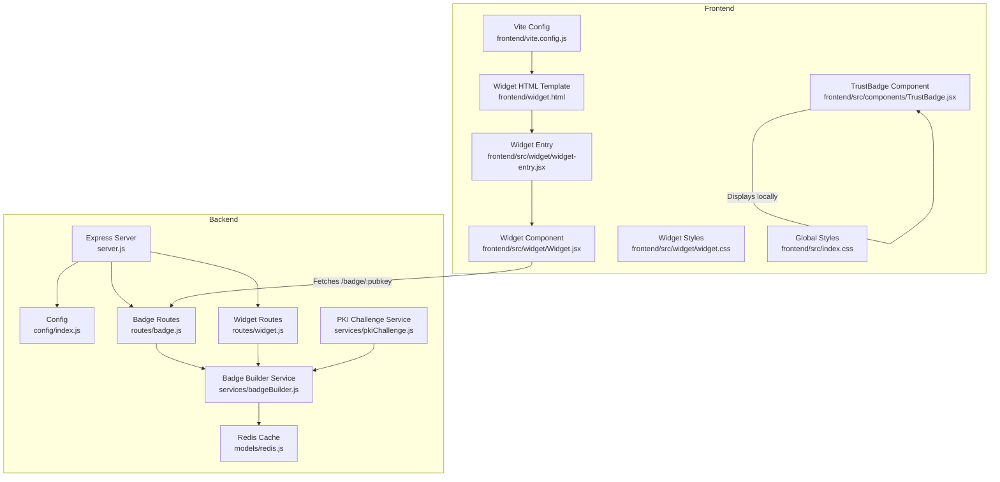
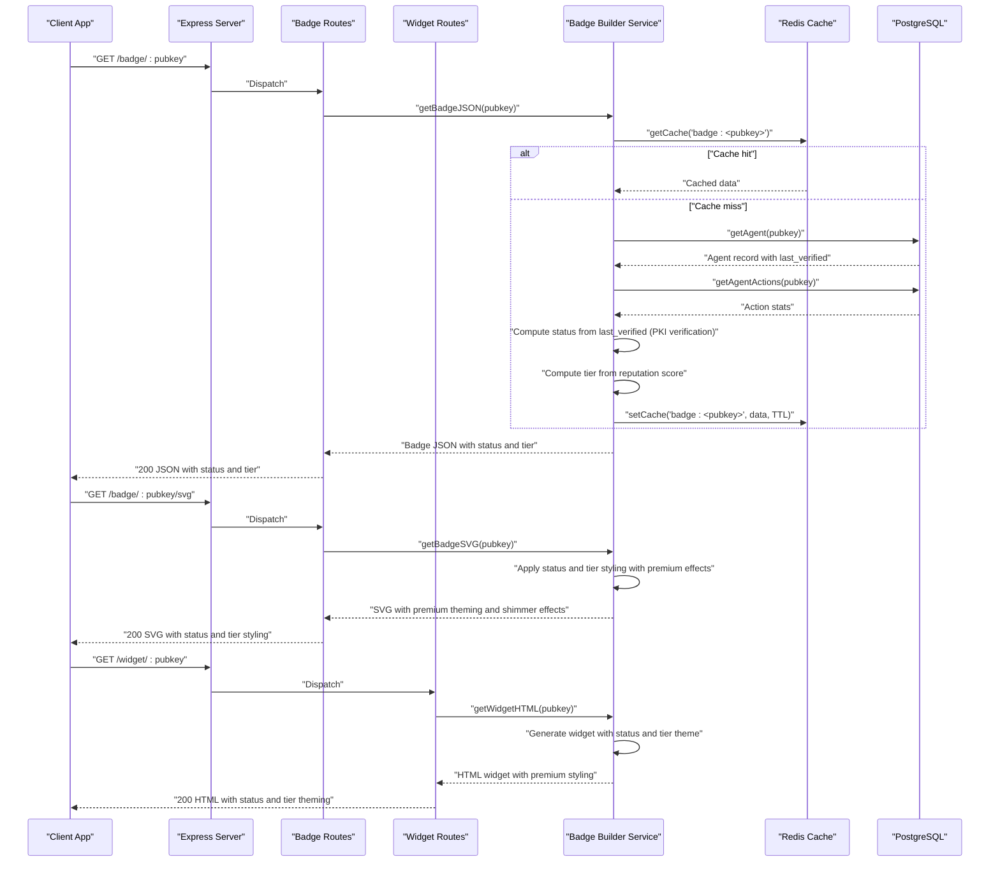
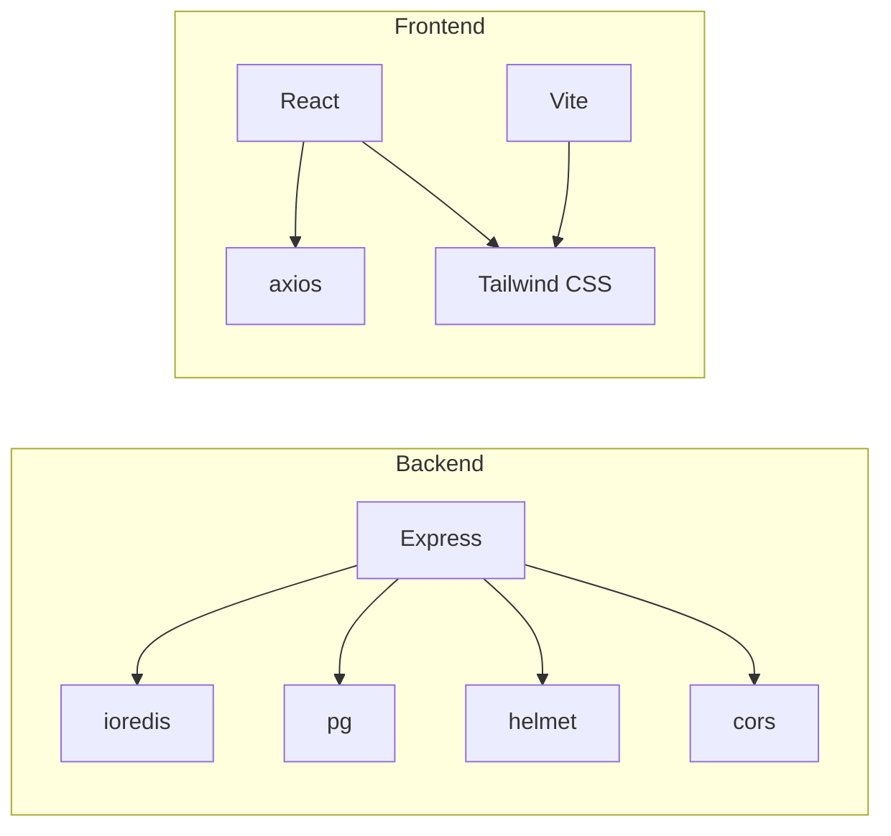

# Trust Badge API and Widget System

<cite>
**Referenced Files in This Document**
- [server.js](file://backend/server.js)
- [config/index.js](file://backend/src/config/index.js)
- [routes/badge.js](file://backend/src/routes/badge.js)
- [routes/widget.js](file://backend/src/routes/widget.js)
- [services/badgeBuilder.js](file://backend/src/services/badgeBuilder.js)
- [models/redis.js](file://backend/src/models/redis.js)
- [frontend/src/components/TrustBadge.jsx](file://frontend/src/components/TrustBadge.jsx)
- [frontend/src/widget/Widget.jsx](file://frontend/src/widget/Widget.jsx)
- [frontend/src/widget/widget-entry.jsx](file://frontend/src/widget/widget-entry.jsx)
- [frontend/src/widget/widget.css](file://frontend/src/widget/widget.css)
- [frontend/src/index.css](file://frontend/src/index.css)
- [frontend/vite.config.js](file://frontend/vite.config.js)
- [frontend/widget.html](file://frontend/widget.html)
</cite>

## Update Summary
**Changes Made**
- Updated to reflect Major visual branding enhancements including new VerifiedShieldIcon, UnverifiedIcon, and FlaggedIcon components with premium SVG styling, gold/yellow gradient effects, glow shadows, and shimmer animations for verified agents
- Enhanced TrustBadge component now features sophisticated visual hierarchy with tier-based styling and improved date display consistency
- Updated frontend styling system with new shimmer animation effects and premium gradient styling
- Enhanced widget system with improved status and tier theming

## Table of Contents
1. [Introduction](#introduction)
2. [Project Structure](#project-structure)
3. [Core Components](#core-components)
4. [Architecture Overview](#architecture-overview)
5. [Detailed Component Analysis](#detailed-component-analysis)
6. [Dependency Analysis](#dependency-analysis)
7. [Performance Considerations](#performance-considerations)
8. [Troubleshooting Guide](#troubleshooting-guide)
9. [Conclusion](#conclusion)

## Introduction
This document describes the Trust Badge API and Widget System that powers human-readable trust displays for agents. The system features a refined verification logic where badge status is determined solely by PKI verification completion rather than reputation scores, while reputation scores continue to determine the tier classification. The system now includes premium visual branding enhancements with sophisticated iconography and styling effects.

Key features include:
- The GET /badge/:pubkey endpoint response structure including pubkey, name, status, badge emoji, label, scores, tier information, and metadata
- The widget generation process, SVG creation for README documentation, and the embeddable iframe system
- The React TrustBadge component implementation with tier-aware styling, the widget-entry.jsx integration, and the styling system using Tailwind CSS with premium visual effects
- Integration patterns for third-party applications
- Caching strategies, widget URL generation, and real-time badge updates based on reputation changes
- Frontend components with enhanced visual branding, customization options, and performance optimizations for badge delivery
- **Updated**: Refined verification logic where status reflects PKI verification completion while tier reflects reputation thresholds
- **Updated**: Premium visual branding with VerifiedShieldIcon, UnverifiedIcon, and FlaggedIcon components featuring gold/yellow gradient effects, glow shadows, and shimmer animations

## Project Structure
The system comprises:
- Backend API exposing badge and widget endpoints, with caching and reputation computation
- Frontend React components for displaying badges and an embeddable widget with premium visual effects
- Vite configuration enabling standalone widget builds and development proxying
- **Updated**: PKI verification service for challenge-response authentication
- **Updated**: Premium SVG icon components with advanced styling and animations

**Diagram sources**
- [server.js:1-91](file://backend/server.js#L1-L91)
- [config/index.js:1-34](file://backend/src/config/index.js#L1-L34)
- [routes/badge.js:1-58](file://backend/src/routes/badge.js#L1-L58)
- [routes/widget.js:1-89](file://backend/src/routes/widget.js#L1-L89)
- [services/badgeBuilder.js:1-556](file://backend/src/services/badgeBuilder.js#L1-L556)
- [models/redis.js:1-94](file://backend/src/models/redis.js#L1-L94)
- [frontend/src/components/TrustBadge.jsx:1-280](file://frontend/src/components/TrustBadge.jsx#L1-L280)
- [frontend/src/widget/widget-entry.jsx:1-11](file://frontend/src/widget/widget-entry.jsx#L1-L11)
- [frontend/src/widget/Widget.jsx:1-218](file://frontend/src/widget/Widget.jsx#L1-L218)
- [frontend/src/widget/widget.css:1-70](file://frontend/src/widget/widget.css#L1-L70)
- [frontend/src/index.css:1-172](file://frontend/src/index.css#L1-L172)
- [frontend/vite.config.js:1-42](file://frontend/vite.config.js#L1-L42)
- [frontend/widget.html:1-16](file://frontend/widget.html#L1-L16)

**Section sources**
- [server.js:1-91](file://backend/server.js#L1-L91)
- [frontend/vite.config.js:1-42](file://frontend/vite.config.js#L1-L42)

## Core Components
- Badge API endpoints:
  - GET /badge/:pubkey returns badge JSON with status and tier information
  - GET /badge/:pubkey/svg returns SVG badge with status and tier-specific styling including premium visual effects
- Widget API endpoint:
  - GET /widget/:pubkey returns embeddable HTML widget with status-aware theming and premium styling
- Badge builder service:
  - Computes reputation scores, aggregates agent stats, and generates JSON, SVG, and HTML widget with status and tier-based rendering
- Frontend components:
  - TrustBadge: local React component for displaying badges with status and tier styling including premium visual effects
  - Widget: standalone React component for iframe/embedded usage with live refresh and enhanced theming
- Caching:
  - Redis-backed cache with configurable TTL for badge data
- **Updated**: Verification system:
  - PKI challenge-response for ongoing verification
  - Status determined by `agent.last_verified !== null` check
  - Tier determined by reputation score threshold comparison
- **Updated**: Premium visual branding system:
  - VerifiedShieldIcon with gold/yellow gradient effects and checkmark
  - UnverifiedIcon with amber/gold styling
  - FlaggedIcon with red gradient effects
  - Shimmer animation effects for verified tier badges
  - Sophisticated visual hierarchy with status and tier styling

**Section sources**
- [routes/badge.js:12-55](file://backend/src/routes/badge.js#L12-L55)
- [routes/widget.js:14-86](file://backend/src/routes/widget.js#L14-L86)
- [services/badgeBuilder.js:17-94](file://backend/src/services/badgeBuilder.js#L17-L94)
- [frontend/src/components/TrustBadge.jsx:150-280](file://frontend/src/components/TrustBadge.jsx#L150-L280)
- [frontend/src/widget/Widget.jsx:61-218](file://frontend/src/widget/Widget.jsx#L61-L218)
- [models/redis.js:41-71](file://backend/src/models/redis.js#L41-L71)
- [config/index.js:29-31](file://backend/src/config/index.js#L29-L31)

## Architecture Overview
The system integrates backend APIs with frontend components and a caching layer to deliver responsive trust badges with refined verification logic that separates status from tier classification. The enhanced system now features premium visual branding with sophisticated iconography and styling effects.

**Diagram sources**
- [server.js:56-63](file://backend/server.js#L56-L63)
- [routes/badge.js:16-55](file://backend/src/routes/badge.js#L16-L55)
- [routes/widget.js:18-86](file://backend/src/routes/widget.js#L18-L86)
- [services/badgeBuilder.js:17-94](file://backend/src/services/badgeBuilder.js#L17-L94)
- [models/redis.js:41-71](file://backend/src/models/redis.js#L41-L71)
- [config/index.js:29-31](file://backend/src/config/index.js#L29-L31)

## Detailed Component Analysis

### GET /badge/:pubkey Endpoint
- Purpose: Returns trust badge JSON for a given agent public key with status and tier information
- Response fields:
  - pubkey: Agent's public key
  - name: Human-readable agent name
  - status: One of verified, unverified, flagged (determined by PKI verification)
  - badge: Emoji representing status
  - label: Human-friendly status label
  - score: Numeric trust score (0–100)
  - bags_score: Same as score
  - saidTrustScore: SAID trust score (fallback 0)
  - saidLabel: SAID label
  - registeredAt: ISO date string or null
  - lastVerified: ISO date string when PKI verification completed or null
  - totalActions: Total actions performed
  - successRate: Ratio of successful to total actions
  - capabilities: Array of capability strings
  - tokenMint: Token mint identifier
  - widgetUrl: URL to the embeddable widget
  - **Updated**: tier: 'verified' or 'standard' based on reputation score threshold
  - **Updated**: tierColor: '#FFD700' for verified tier, '#3B82F6' for standard tier
- Error handling:
  - 404 with JSON error payload when agent not found
  - Pass-through errors otherwise

**Section sources**
- [routes/badge.js:16-32](file://backend/src/routes/badge.js#L16-L32)
- [services/badgeBuilder.js:17-94](file://backend/src/services/badgeBuilder.js#L17-L94)

### GET /badge/:pubkey/svg Endpoint
- Purpose: Returns an SVG image of the badge with status and tier-specific styling including premium visual effects
- Rendering logic:
  - Determines background and accent colors based on status and tier
  - **Updated**: Status styling based on PKI verification completion (`last_verified !== null`)
  - **Updated**: Tier styling based on reputation score threshold
  - Renders status icon with premium SVG styling (checkmark for verified, X for flagged, exclamation for unverified)
  - Displays agent name, status label, trust score, and a score bar with gradient
  - **New**: Gold border accents and glow effects for verified tier
  - **New**: Shimmer animation layer for verified tier badges with gold/yellow gradient effects
  - **New**: Premium gradient styling with sophisticated color transitions
- Content-Type: image/svg+xml

**Section sources**
- [routes/badge.js:38-55](file://backend/src/routes/badge.js#L38-L55)
- [services/badgeBuilder.js:101-218](file://backend/src/services/badgeBuilder.js#L101-L218)

### GET /widget/:pubkey Endpoint
- Purpose: Returns an embeddable HTML widget suitable for iframe embedding with status and tier-aware theming including premium styling
- Generation logic:
  - Builds theme colors based on status and tier (status determines primary theming, tier affects accent colors)
  - Formats dates and success rate with enhanced visual presentation
  - Embeds a self-refreshing script that reloads every 60 seconds
  - **Updated**: Applies status and tier-specific styling with appropriate color schemes and premium effects
  - **New**: Live indicator with pulsing animation for real-time updates
- Error handling:
  - 404 with a simple HTML error page if agent not found

**Section sources**
- [routes/widget.js:18-86](file://backend/src/routes/widget.js#L18-L86)
- [services/badgeBuilder.js:225-549](file://backend/src/services/badgeBuilder.js#L225-L549)

### Badge Builder Service
Responsibilities:
- Cache-first retrieval of badge data
- Agent lookup and action statistics aggregation
- Reputation score computation via external services
- **Updated**: Status determination based on PKI verification completion (`agent.last_verified !== null`)
- **Updated**: Tier determination based on configurable reputation score threshold (default 70)
- SVG generation with dynamic colors, gradients, and status/tier-specific premium effects
- HTML widget generation with theme-aware styles, live refresh, and status/tier theming including premium visual effects

Key behaviors:
- Cache key: badge:<pubkey>
- Cache TTL: configured via environment variable
- Status determination:
  - flagged: agent.status == 'flagged'
  - verified: agent.status != 'flagged' AND agent.last_verified !== null
  - unverified: agent.status != 'flagged' AND agent.last_verified === null
- **Updated**: Tier determination:
  - verified: reputation.score >= VERIFIED_THRESHOLD (default 70)
  - standard: reputation.score < VERIFIED_THRESHOLD
- Widget URL construction uses base URL from configuration
- **New**: Premium gradient effects and shimmer animations for verified tier badges

**Section sources**
- [services/badgeBuilder.js:17-94](file://backend/src/services/badgeBuilder.js#L17-L94)
- [services/badgeBuilder.js:101-218](file://backend/src/services/badgeBuilder.js#L101-L218)
- [services/badgeBuilder.js:225-549](file://backend/src/services/badgeBuilder.js#L225-L549)
- [config/index.js:25-27](file://backend/src/config/index.js#L25-L27)
- [config/index.js:29-31](file://backend/src/config/index.js#L29-L31)

### React TrustBadge Component
- Props:
  - status: 'verified' | 'unverified' | 'flagged'
  - name: string
  - score: number
  - registeredAt: string (ISO date)
  - totalActions: number
  - tier: 'verified' | 'standard'
  - tierColor: string
  - className: string
- Features:
  - Status-specific styling with Tailwind CSS variables
  - **Updated**: Tier-aware styling with gold shimmer for verified tier
  - **Updated**: Status styling based on PKI verification completion
  - **Updated**: Gradient backgrounds and border accents for different statuses and tiers
  - **New**: Premium VerifiedShieldIcon with gold/yellow gradient effects, checkmark, and sparkle accents
  - **New**: Sophisticated visual hierarchy with enhanced status and tier styling
  - **New**: Shimmer animation layer for verified tier badges with gold gradient effects
  - Responsive layout with premium icons, labels, and metadata
  - Formatted dates and action counts with improved consistency
  - Hover scaling and subtle glow effects with premium styling
  - **New**: Sophisticated visual branding with premium SVG icons and effects

**Section sources**
- [frontend/src/components/TrustBadge.jsx:1-280](file://frontend/src/components/TrustBadge.jsx#L1-L280)

### Widget Entry and Standalone Widget
- Entry point:
  - Creates a React root and renders the Widget component
- Widget component:
  - Fetches badge JSON from /api/badge/:pubkey
  - Auto-refreshes every 60 seconds
  - Handles loading, error, and success states
  - Extracts pubkey from URL path
  - **Updated**: Applies status and tier-aware theming based on badge data with premium styling
  - **New**: Live indicator with pulsing animation for real-time updates
- Build and dev:
  - Vite serves widget.html for /widget/* paths in development
  - Standalone build targets main and widget entries

**Section sources**
- [frontend/src/widget/widget-entry.jsx:1-11](file://frontend/src/widget/widget-entry.jsx#L1-L11)
- [frontend/src/widget/Widget.jsx:61-218](file://frontend/src/widget/Widget.jsx#L61-L218)
- [frontend/vite.config.js:9-22](file://frontend/vite.config.js#L9-L22)
- [frontend/widget.html:1-16](file://frontend/widget.html#L1-L16)

### Styling System (Tailwind CSS)
- Local component:
  - Uses CSS variables for theme colors and typography
  - **Updated**: Status and tier-specific styling with appropriate color schemes
  - **Updated**: Status styling based on PKI verification completion
  - **Updated**: Tier styling with gold gradients for verified, blue for standard
  - **New**: Premium VerifiedShieldIcon with gold/yellow gradient effects and checkmark
  - **New**: Sophisticated visual hierarchy with enhanced status and tier styling
  - **New**: Shimmer animation effects for verified tier badges with gold gradient
  - Applies status-specific backgrounds, borders, and glows with premium styling
- Widget:
  - Defines CSS variables for dark theme and accents
  - Uses Tailwind utilities for layout and animations
  - Includes a pulse animation for loading states
  - **Updated**: Tier-aware color schemes with appropriate contrast
  - **New**: Live indicator with pulsing animation for real-time updates

**Section sources**
- [frontend/src/components/TrustBadge.jsx:1-280](file://frontend/src/components/TrustBadge.jsx#L1-L280)
- [frontend/src/widget/widget.css:1-70](file://frontend/src/widget/widget.css#L1-L70)
- [frontend/src/index.css:164-172](file://frontend/src/index.css#L164-L172)

### Real-time Badge Updates
- Widget auto-refresh:
  - The widget component sets an interval to reload badge data every 60 seconds
- Backend cache TTL:
  - Badge data is cached with a TTL controlled by environment configuration
- Combined effect:
  - Clients receive fresh data at predictable intervals while minimizing backend load

**Section sources**
- [frontend/src/widget/Widget.jsx:96-102](file://frontend/src/widget/Widget.jsx#L96-L102)
- [config/index.js:25-27](file://backend/src/config/index.js#L25-L27)
- [services/badgeBuilder.js:87-88](file://backend/src/services/badgeBuilder.js#L87-L88)

### Integration Patterns for Third Parties
- Embedding the widget:
  - Use the /widget/:pubkey endpoint in an iframe
  - The widget automatically fetches /api/badge/:pubkey
- Using the SVG:
  - Fetch /badge/:pubkey/svg for static badge images with status and tier styling including premium visual effects
- Using the JSON:
  - Fetch /badge/:pubkey for programmatic integration with status and tier information
- Customization:
  - The widget's theme adapts to status and tier with premium styling
  - The local TrustBadge component accepts props for styling and content with enhanced visual effects
  - **Updated**: Status and tier information allows for custom styling based on verification level and reputation with premium branding

**Section sources**
- [routes/widget.js:18-86](file://backend/src/routes/widget.js#L18-L86)
- [routes/badge.js:16-55](file://backend/src/routes/badge.js#L16-L55)
- [frontend/src/widget/Widget.jsx:82-94](file://frontend/src/widget/Widget.jsx#L82-L94)

## Dependency Analysis
- Backend dependencies:
  - Express for routing and middleware
  - Redis for caching
  - PostgreSQL via pg for persistence
  - Rate limiting and security middleware
- Frontend dependencies:
  - React and React DOM for components
  - Axios for HTTP requests
  - Tailwind CSS for styling
  - Vite for build and dev server

**Diagram sources**
- [backend/package.json:20-32](file://backend/package.json#L20-L32)
- [frontend/package.json:12-31](file://frontend/package.json#L12-L31)

**Section sources**
- [backend/package.json:20-32](file://backend/package.json#L20-L32)
- [frontend/package.json:12-31](file://frontend/package.json#L12-L31)

## Performance Considerations
- Caching:
  - Cache key: badge:<pubkey>
  - TTL configurable via environment variable
  - Redis client includes retry and offline queue strategies
- Request limits:
  - Rate limiting middleware applied globally
- Network efficiency:
  - SVG endpoint returns compact SVG with optimized gradients and premium effects
  - Widget auto-refresh reduces polling overhead
- Build optimization:
  - Vite build targets separate bundles for main and widget
  - Dev proxy routes API requests to backend
- **Updated**: Status calculation is computed once per cache miss, separating PKI verification logic from reputation scoring
- **New**: Premium visual effects are optimized for performance with efficient gradient rendering and animation

**Section sources**
- [models/redis.js:41-71](file://backend/src/models/redis.js#L41-L71)
- [config/index.js:25-27](file://backend/src/config/index.js#L25-L27)
- [routes/badge.js:8](file://backend/src/routes/badge.js#L8)
- [frontend/vite.config.js:23-41](file://frontend/vite.config.js#L23-L41)

## Troubleshooting Guide
- Agent not found:
  - Badge JSON endpoint returns 404 with error payload
  - Widget endpoint returns a simple HTML error page
- Redis connectivity issues:
  - Redis client logs errors but does not crash the service
  - Cache operations fail gracefully
- Widget fails to load:
  - Verify API base URL is correctly injected or configured
  - Ensure /api/badge/:pubkey is reachable from the widget's origin
- SVG rendering issues:
  - Confirm Content-Type header is image/svg+xml
  - Validate SVG generation logic and escape sequences
- **Updated**: Status and tier styling issues:
  - Verify PKI verification is properly recorded in `last_verified` field
  - Check that reputation scoring is functioning correctly
  - Ensure VERIFIED_THRESHOLD environment variable is set correctly
  - Verify that tier calculation logic matches expected threshold values
  - Ensure gold gradient effects render properly in target browsers
- **New**: Premium visual effects issues:
  - Verify shimmer animation CSS classes are properly loaded
  - Check that gradient definitions render correctly in SVG output
  - Ensure premium icon components render with proper styling
  - Validate that gold/yellow gradient effects work across different browsers

**Section sources**
- [routes/badge.js:23-31](file://backend/src/routes/badge.js#L23-L31)
- [routes/widget.js:24-77](file://backend/src/routes/widget.js#L24-L77)
- [models/redis.js:27-30](file://backend/src/models/redis.js#L27-L30)
- [frontend/src/widget/Widget.jsx:82-94](file://frontend/src/widget/Widget.jsx#L82-L94)
- [config/index.js:29-31](file://backend/src/config/index.js#L29-L31)

## Conclusion
The Trust Badge API and Widget System provides a robust, cache-backed solution for displaying agent trust in human-readable formats with refined verification logic and premium visual branding. The system now features:

- Consistent JSON, SVG, and HTML widget outputs with status and tier information
- **Updated**: Refined verification logic where status reflects PKI verification completion while tier reflects reputation thresholds
- **Updated**: Status determined by `agent.last_verified !== null` check rather than reputation scores
- **Updated**: Tier system with configurable threshold (default 70) for reputation-based classification
- **Updated**: Enhanced status styling with premium VerifiedShieldIcon featuring gold/yellow gradient effects, checkmark, and sparkle accents for verified agents
- **Updated**: Sophisticated visual hierarchy with tier-based styling and improved date display consistency
- **New**: Premium visual branding system with UnverifiedIcon and FlaggedIcon components featuring sophisticated gradient effects
- **New**: Shimmer animation effects for verified tier badges with gold gradient transitions
- Real-time updates through cache TTL and widget refresh
- Flexible integration for websites and applications via iframe embedding
- Tailwind-powered styling with status-aware and tier-aware themes including premium visual effects
- Strong separation between verification status and reputation tier classification
- Comprehensive status and tier-based badge rendering logic with premium styling and sophisticated visual effects

The enhanced system provides clear visual distinction between agents who have completed PKI verification (status) and those classified by reputation (tier), enabling users to quickly identify both verified authenticity and trustworthiness levels in the ecosystem while maintaining backward compatibility with existing integrations. The premium visual branding enhances the user experience with sophisticated iconography, gradient effects, and shimmer animations that distinguish verified agents with premium styling.