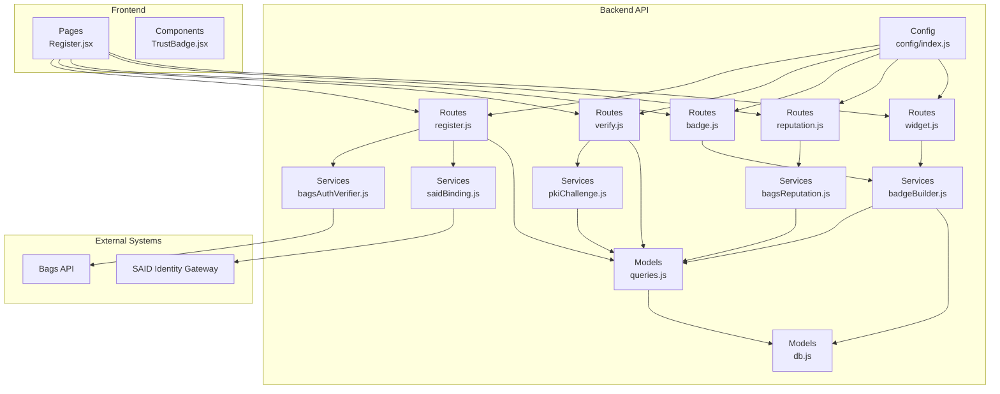
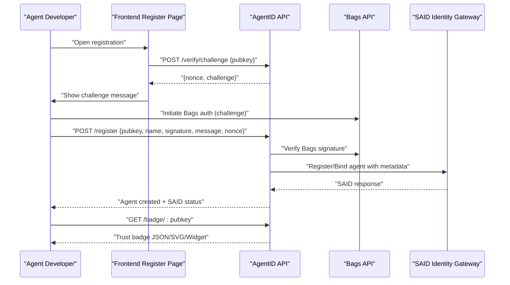
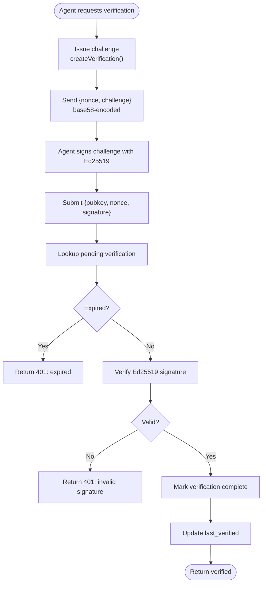
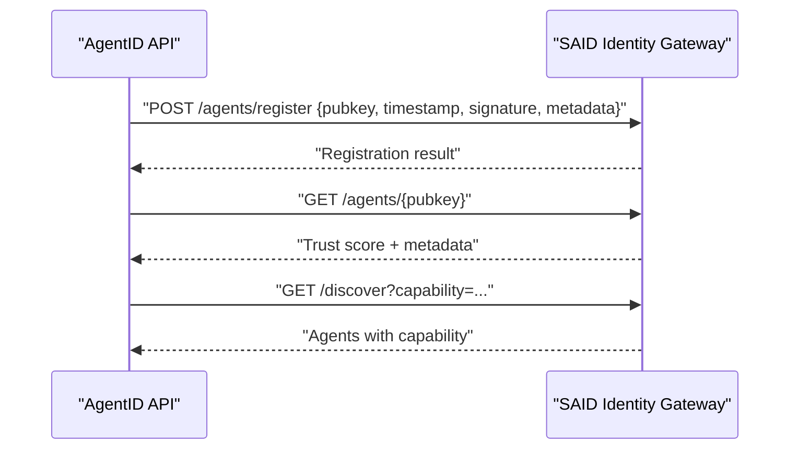
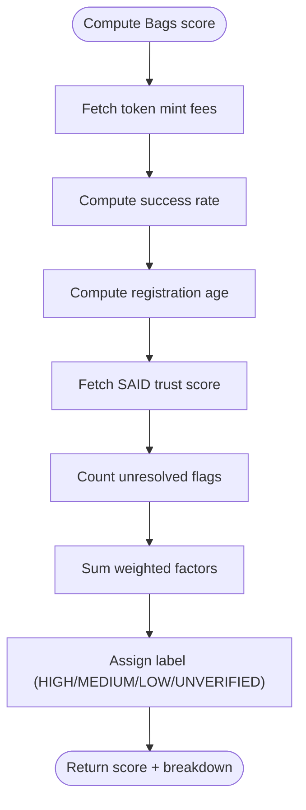
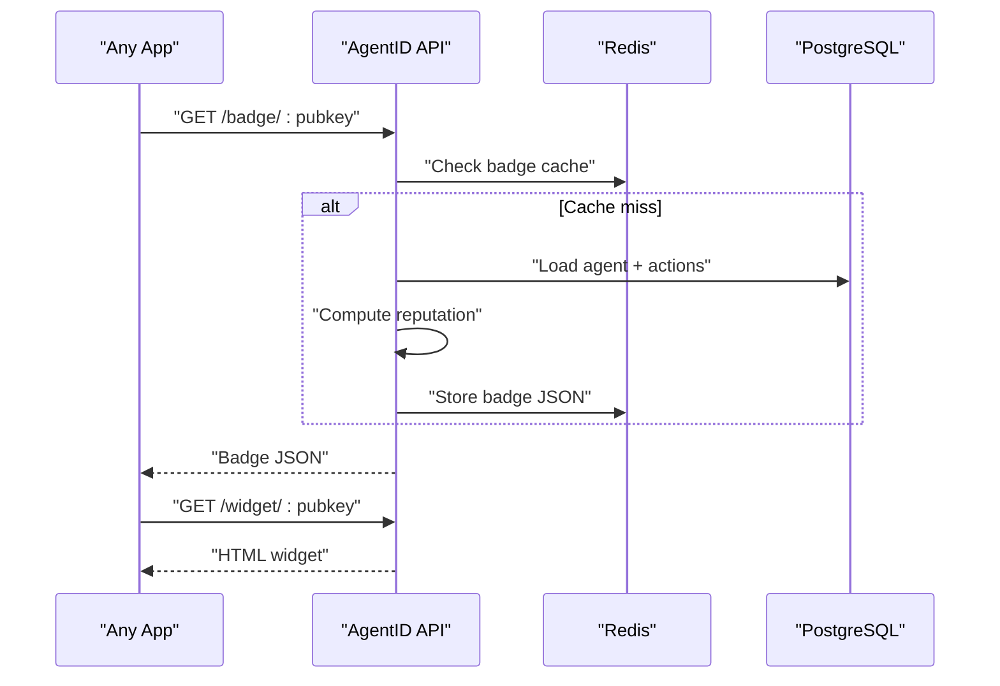
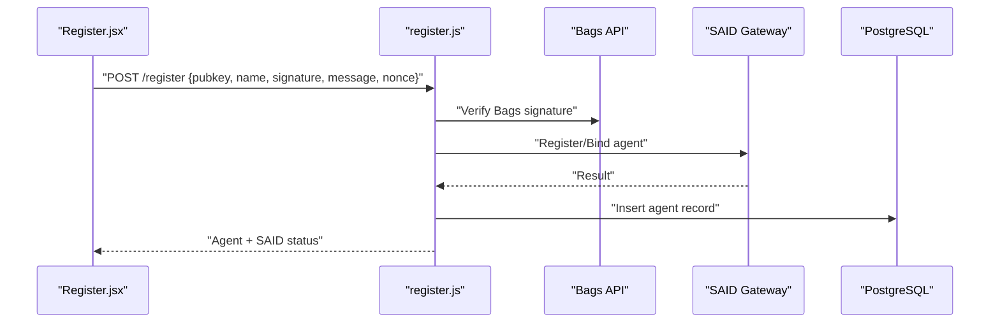
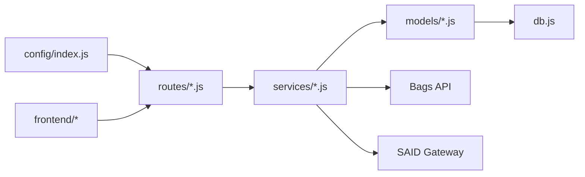

# Executive Summary

<cite>
**Referenced Files in This Document**
- [agentid_build_plan.md](file://agentid_build_plan.md)
- [bagsAuthVerifier.js](file://backend/src/services/bagsAuthVerifier.js)
- [saidBinding.js](file://backend/src/services/saidBinding.js)
- [pkiChallenge.js](file://backend/src/services/pkiChallenge.js)
- [bagsReputation.js](file://backend/src/services/bagsReputation.js)
- [badgeBuilder.js](file://backend/src/services/badgeBuilder.js)
- [register.js](file://backend/src/routes/register.js)
- [verify.js](file://backend/src/routes/verify.js)
- [badge.js](file://backend/src/routes/badge.js)
- [reputation.js](file://backend/src/routes/reputation.js)
- [widget.js](file://backend/src/routes/widget.js)
- [queries.js](file://backend/src/models/queries.js)
- [db.js](file://backend/src/models/db.js)
- [config/index.js](file://backend/src/config/index.js)
- [package.json](file://backend/package.json)
- [TrustBadge.jsx](file://frontend/src/components/TrustBadge.jsx)
- [Register.jsx](file://frontend/src/pages/Register.jsx)
</cite>

## Table of Contents
1. [Introduction](#introduction)
2. [Project Structure](#project-structure)
3. [Core Components](#core-components)
4. [Architecture Overview](#architecture-overview)
5. [Detailed Component Analysis](#detailed-component-analysis)
6. [Dependency Analysis](#dependency-analysis)
7. [Performance Considerations](#performance-considerations)
8. [Troubleshooting Guide](#troubleshooting-guide)
9. [Conclusion](#conclusion)

## Introduction
AgentID is the Bags-native trust layer for AI agents. It is a trust verification service that wraps Bags’ Ed25519 agent authentication flow, binds agent identities to the Solana Agent Registry (SAID Protocol), augments trust with Bags ecosystem reputation, and surfaces human-readable trust badges inside Bags applications. AgentID’s value is rooted in three pillars: PKI challenge-response spoofing prevention, SAID binding for on-chain provenance, and a comprehensive Bags reputation engine. Its target audience spans the 48 AI Agent projects participating in the hackathon, every Bags user interacting with agents, and developers building on Bags who want a verifiable trust badge for their agents.

AgentID’s key differentiators:
- SAID Protocol: General-purpose Solana agent registry with no native Bags integration.
- Agistry Framework: Solana smart contracts for agent-tool connections, Rust-only, no trust scoring or UI.
- Bags Agent Auth: Ed25519 challenge-response for API keys, but no registry, reputation, trust badge, or spoofing detection.
- AgentID: Wraps Bags auth, binds to SAID, adds Bags reputation, and delivers trust badges in-app.

AgentID’s competitive advantages include PKI expertise (Ed25519 challenge-response), first-mover advantage on Bags+SAID binding, and a ready ecosystem of 48 potential customers.

## Project Structure
AgentID is organized into a backend API (Node.js/Express), a PostgreSQL database, Redis cache, and a React/Vite frontend. The backend exposes REST endpoints for registration, verification, reputation, badges, and discovery. The frontend provides a guided registration flow and a registry explorer.

**Diagram sources**
- [register.js:59-153](file://backend/src/routes/register.js#L59-L153)
- [verify.js:20-112](file://backend/src/routes/verify.js#L20-L112)
- [badge.js:16-55](file://backend/src/routes/badge.js#L16-L55)
- [reputation.js:17-41](file://backend/src/routes/reputation.js#L17-L41)
- [widget.js:32-100](file://backend/src/routes/widget.js#L32-L100)
- [bagsAuthVerifier.js:18-86](file://backend/src/services/bagsAuthVerifier.js#L18-L86)
- [saidBinding.js:21-54](file://backend/src/services/saidBinding.js#L21-L54)
- [pkiChallenge.js:17-96](file://backend/src/services/pkiChallenge.js#L17-L96)
- [bagsReputation.js:16-140](file://backend/src/services/bagsReputation.js#L16-L140)
- [badgeBuilder.js:16-82](file://backend/src/services/badgeBuilder.js#L16-L82)
- [queries.js:17-356](file://backend/src/models/queries.js#L17-L356)
- [db.js:10-44](file://backend/src/models/db.js#L10-L44)
- [config/index.js:6-28](file://backend/src/config/index.js#L6-L28)
- [Register.jsx:241-390](file://frontend/src/pages/Register.jsx#L241-L390)
- [TrustBadge.jsx:42-135](file://frontend/src/components/TrustBadge.jsx#L42-L135)

**Section sources**
- [agentid_build_plan.md:1-39](file://agentid_build_plan.md#L1-L39)
- [package.json:18-29](file://backend/package.json#L18-L29)

## Core Components
- Bags Auth Wrapper: Validates wallet ownership using Bags’ Ed25519 challenge-response prior to registration.
- SAID Binding: Registers or retrieves agent records in the SAID Identity Gateway and attaches Bags-specific metadata.
- PKI Challenge-Response: Issues time-bound challenges and verifies Ed25519 signatures to prevent spoofing during agent actions.
- Bags Reputation Engine: Computes a 0–100 score combining fee activity, success rate, registration age, SAID trust, and community flags.
- Trust Badge Builder: Produces JSON, SVG, and embeddable HTML widgets with status, score, and capability metadata.
- Database and Cache: PostgreSQL stores agent identities, verifications, flags, and actions; Redis caches badges and nonces.

**Section sources**
- [bagsAuthVerifier.js:18-86](file://backend/src/services/bagsAuthVerifier.js#L18-L86)
- [saidBinding.js:21-87](file://backend/src/services/saidBinding.js#L21-L87)
- [pkiChallenge.js:17-96](file://backend/src/services/pkiChallenge.js#L17-L96)
- [bagsReputation.js:16-140](file://backend/src/services/bagsReputation.js#L16-L140)
- [badgeBuilder.js:16-82](file://backend/src/services/badgeBuilder.js#L16-L82)
- [queries.js:17-356](file://backend/src/models/queries.js#L17-L356)
- [db.js:10-44](file://backend/src/models/db.js#L10-L44)

## Architecture Overview
AgentID sits between Bags agents and the broader ecosystem. It wraps Bags authentication, binds to SAID, computes Bags reputation, and serves trust badges. The system enforces spoofing resistance via PKI challenge-response and surfaces trust signals in-app.

**Diagram sources**
- [register.js:59-153](file://backend/src/routes/register.js#L59-L153)
- [verify.js:20-112](file://backend/src/routes/verify.js#L20-L112)
- [bagsAuthVerifier.js:18-86](file://backend/src/services/bagsAuthVerifier.js#L18-L86)
- [saidBinding.js:21-54](file://backend/src/services/saidBinding.js#L21-L54)
- [badge.js:16-55](file://backend/src/routes/badge.js#L16-L55)
- [Register.jsx:295-341](file://frontend/src/pages/Register.jsx#L295-L341)

## Detailed Component Analysis

### PKI Challenge-Response Spoofing Prevention
AgentID issues time-bound, single-use challenges and validates Ed25519 signatures to prevent spoofing. The challenge format mirrors SAID’s pattern but scopes to AgentID actions. Nonces expire and are marked complete upon successful verification, preventing replay.

**Diagram sources**
- [pkiChallenge.js:17-96](file://backend/src/services/pkiChallenge.js#L17-L96)
- [queries.js:213-256](file://backend/src/models/queries.js#L213-L256)

**Section sources**
- [pkiChallenge.js:17-96](file://backend/src/services/pkiChallenge.js#L17-L96)
- [queries.js:213-256](file://backend/src/models/queries.js#L213-L256)

### SAID Protocol Binding
AgentID registers agents with SAID and enriches entries with Bags-specific metadata (token mint, wallet, capability set). It also retrieves SAID trust scores and supports A2A discovery.

**Diagram sources**
- [saidBinding.js:21-112](file://backend/src/services/saidBinding.js#L21-L112)

**Section sources**
- [saidBinding.js:21-112](file://backend/src/services/saidBinding.js#L21-L112)

### Bags Reputation Scoring
AgentID computes a composite score from five factors: fee activity, success rate, registration age, SAID trust, and community flags. Scores are cached and exposed via the reputation endpoint.

**Diagram sources**
- [bagsReputation.js:16-140](file://backend/src/services/bagsReputation.js#L16-L140)

**Section sources**
- [bagsReputation.js:16-140](file://backend/src/services/bagsReputation.js#L16-L140)

### Trust Badge Generation and UI
AgentID produces trust badges in JSON, SVG, and HTML widget formats. The frontend TrustBadge component renders a responsive, themed badge with status, score, and metadata.

**Diagram sources**
- [badgeBuilder.js:16-82](file://backend/src/services/badgeBuilder.js#L16-L82)
- [badge.js:16-55](file://backend/src/routes/badge.js#L16-L55)
- [widget.js:32-100](file://backend/src/routes/widget.js#L32-L100)
- [queries.js:17-356](file://backend/src/models/queries.js#L17-L356)

**Section sources**
- [badgeBuilder.js:16-82](file://backend/src/services/badgeBuilder.js#L16-L82)
- [badge.js:16-55](file://backend/src/routes/badge.js#L16-L55)
- [widget.js:32-100](file://backend/src/routes/widget.js#L32-L100)
- [TrustBadge.jsx:42-135](file://frontend/src/components/TrustBadge.jsx#L42-L135)

### Registration Flow
AgentID’s registration flow integrates Bags authentication, SAID binding, and metadata capture. It validates inputs, checks nonces, verifies signatures, and persists agent records.

**Diagram sources**
- [register.js:59-153](file://backend/src/routes/register.js#L59-L153)
- [bagsAuthVerifier.js:18-86](file://backend/src/services/bagsAuthVerifier.js#L18-L86)
- [saidBinding.js:21-54](file://backend/src/services/saidBinding.js#L21-L54)
- [queries.js:17-29](file://backend/src/models/queries.js#L17-L29)
- [Register.jsx:295-341](file://frontend/src/pages/Register.jsx#L295-L341)

**Section sources**
- [register.js:59-153](file://backend/src/routes/register.js#L59-L153)
- [bagsAuthVerifier.js:18-86](file://backend/src/services/bagsAuthVerifier.js#L18-L86)
- [saidBinding.js:21-54](file://backend/src/services/saidBinding.js#L21-L54)
- [queries.js:17-29](file://backend/src/models/queries.js#L17-L29)
- [Register.jsx:295-341](file://frontend/src/pages/Register.jsx#L295-L341)

## Dependency Analysis
AgentID depends on external systems (Bags API, SAID Gateway) and internal modules (services, models, routes). The backend uses Node.js/Express with tweetnacl for Ed25519, bs58 for base58 encoding, and PostgreSQL/Redis for persistence and caching.

**Diagram sources**
- [config/index.js:6-28](file://backend/src/config/index.js#L6-L28)
- [register.js:59-153](file://backend/src/routes/register.js#L59-L153)
- [verify.js:20-112](file://backend/src/routes/verify.js#L20-L112)
- [badge.js:16-55](file://backend/src/routes/badge.js#L16-L55)
- [reputation.js:17-41](file://backend/src/routes/reputation.js#L17-L41)
- [widget.js:32-100](file://backend/src/routes/widget.js#L32-L100)
- [bagsAuthVerifier.js:18-86](file://backend/src/services/bagsAuthVerifier.js#L18-L86)
- [saidBinding.js:21-54](file://backend/src/services/saidBinding.js#L21-L54)
- [pkiChallenge.js:17-96](file://backend/src/services/pkiChallenge.js#L17-L96)
- [bagsReputation.js:16-140](file://backend/src/services/bagsReputation.js#L16-L140)
- [badgeBuilder.js:16-82](file://backend/src/services/badgeBuilder.js#L16-L82)
- [db.js:10-44](file://backend/src/models/db.js#L10-L44)

**Section sources**
- [package.json:18-29](file://backend/package.json#L18-L29)
- [config/index.js:6-28](file://backend/src/config/index.js#L6-L28)

## Performance Considerations
- Caching: Badge JSON and SVG are cached in Redis to reduce repeated computation and API calls.
- Rate limiting: Express rate limits protect sensitive endpoints (/verify, /register).
- Database indexing: JSONB fields and timestamps support capability filtering and ranking.
- Asynchronous SAID binding: Registration continues even if SAID is temporarily unavailable.
- Lightweight frontend: TrustBadge component renders efficiently with minimal DOM.

[No sources needed since this section provides general guidance]

## Troubleshooting Guide
Common issues and resolutions:
- Invalid signature during registration: Ensure the signature matches the challenge message and nonce.
- Challenge not found/expired: Re-issue a challenge; verify nonce freshness and timestamp windows.
- SAID registration failure: Continue registration; SAID availability is non-blocking.
- Agent not found: Confirm pubkey correctness and that registration succeeded.
- Widget rendering errors: Validate agent existence and check embedded HTML error pages.

**Section sources**
- [register.js:89-95](file://backend/src/routes/register.js#L89-L95)
- [verify.js:85-107](file://backend/src/routes/verify.js#L85-L107)
- [widget.js:38-91](file://backend/src/routes/widget.js#L38-L91)
- [saidBinding.js:50-53](file://backend/src/services/saidBinding.js#L50-L53)

## Conclusion
AgentID delivers a complete, Bags-native trust layer by wrapping Ed25519 authentication, binding to SAID, computing Bags reputation, and surfacing trust badges. Its PKI challenge-response system prevents spoofing, while its first-mover position on Bags+SAID binding positions it strongly for adoption among the 48 AI Agent projects. With a robust architecture, clear APIs, and a guided registration flow, AgentID provides immediate value to developers and users in the Bags ecosystem.