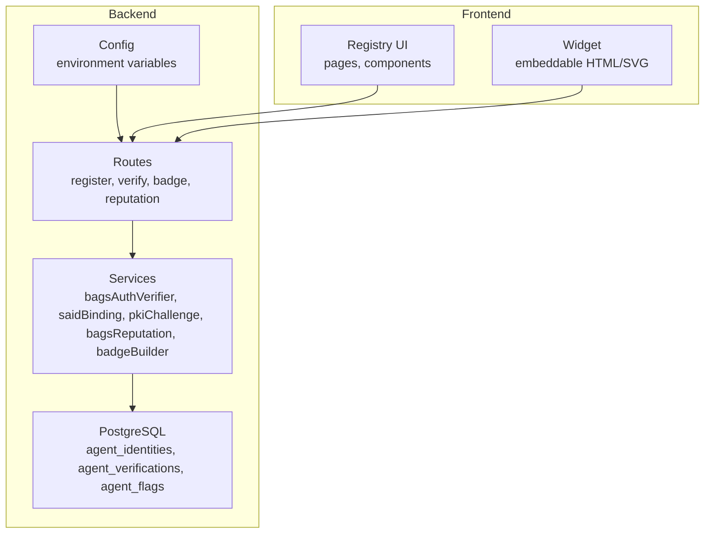
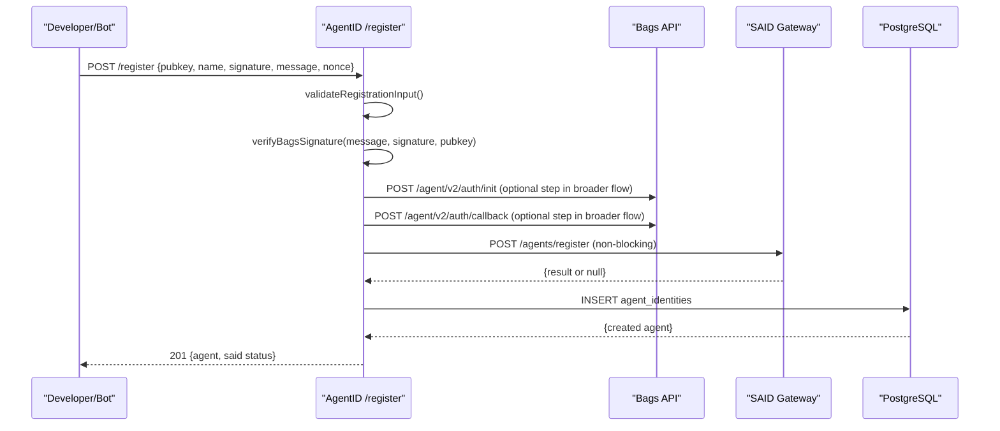
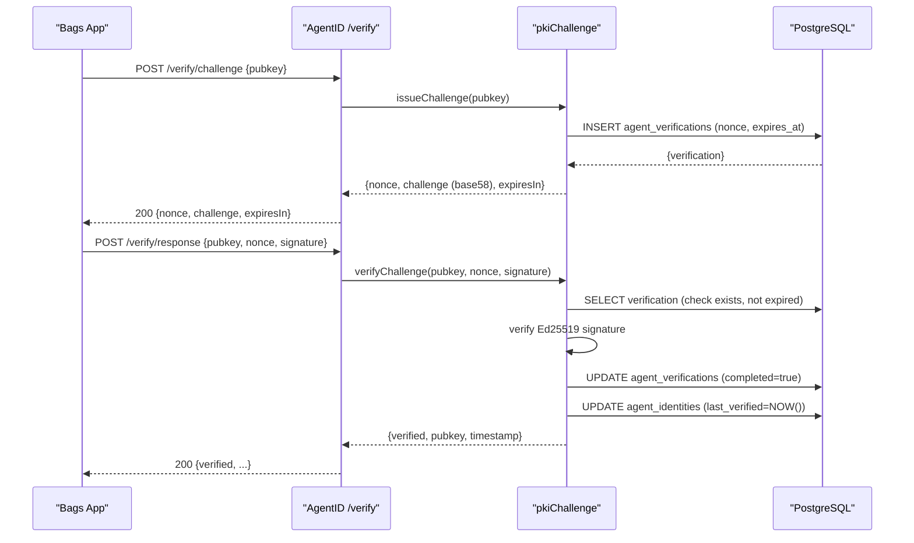
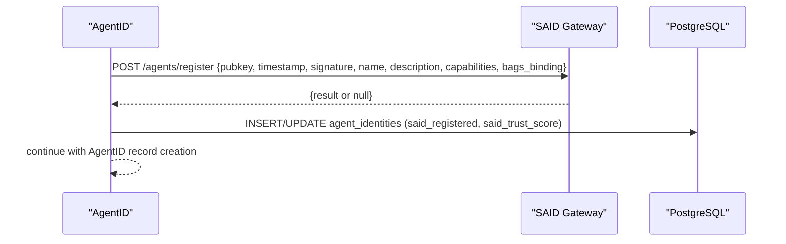
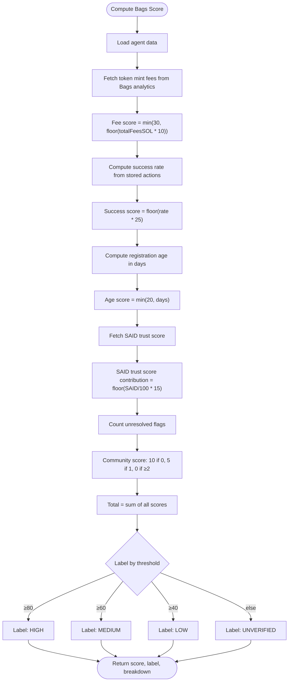
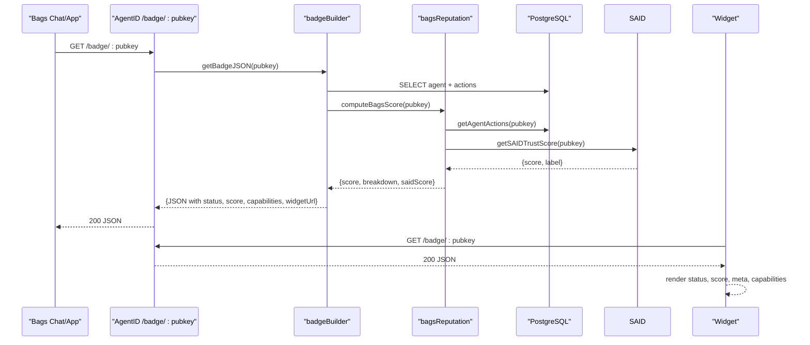
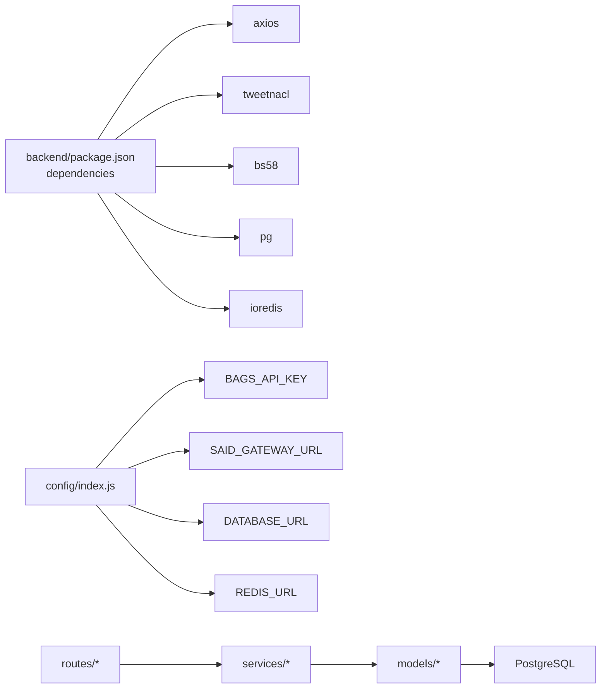

# Project Overview

<cite>
**Referenced Files in This Document**
- [agentid_build_plan.md](file://agentid_build_plan.md)
- [backend/package.json](file://backend/package.json)
- [frontend/package.json](file://frontend/package.json)
- [backend/src/config/index.js](file://backend/src/config/index.js)
- [backend/src/models/db.js](file://backend/src/models/db.js)
- [backend/src/models/queries.js](file://backend/src/models/queries.js)
- [backend/src/services/bagsAuthVerifier.js](file://backend/src/services/bagsAuthVerifier.js)
- [backend/src/services/saidBinding.js](file://backend/src/services/saidBinding.js)
- [backend/src/services/pkiChallenge.js](file://backend/src/services/pkiChallenge.js)
- [backend/src/services/bagsReputation.js](file://backend/src/services/bagsReputation.js)
- [backend/src/services/badgeBuilder.js](file://backend/src/services/badgeBuilder.js)
- [backend/src/routes/register.js](file://backend/src/routes/register.js)
- [backend/src/routes/verify.js](file://backend/src/routes/verify.js)
- [backend/src/routes/badge.js](file://backend/src/routes/badge.js)
- [backend/src/routes/reputation.js](file://backend/src/routes/reputation.js)
- [frontend/src/components/TrustBadge.jsx](file://frontend/src/components/TrustBadge.jsx)
- [frontend/src/widget/Widget.jsx](file://frontend/src/widget/Widget.jsx)
</cite>

## Table of Contents
1. [Introduction](#introduction)
2. [Project Structure](#project-structure)
3. [Core Components](#core-components)
4. [Architecture Overview](#architecture-overview)
5. [Detailed Component Analysis](#detailed-component-analysis)
6. [Dependency Analysis](#dependency-analysis)
7. [Performance Considerations](#performance-considerations)
8. [Troubleshooting Guide](#troubleshooting-guide)
9. [Conclusion](#conclusion)

## Introduction
AgentID is the Bags-native trust layer for AI agents. It provides a trust verification layer that:
- Wraps Bags’ Ed25519 agent authentication flow to establish wallet ownership
- Binds agent identities to the Solana Agent Registry (SAID Protocol)
- Adds Bags-specific reputation scoring
- Surfaces a human-readable trust badge inside Bags chat and embeddable widgets

AgentID’s value is rooted in PKI challenge-response spoofing prevention using Ed25519, ensuring that only agents who truly control the private key can operate. This differentiates it from:
- SAID Protocol (general-purpose Solana agent registry without Bags integration)
- Agistry Framework (Solana smart contracts for agent-tool connections, Rust-only, no trust scoring)
- Bags Agent Auth alone (Ed25519 challenge-response without registry, reputation, or trust badge)

Target audience:
- Every one of the 48 AI Agent projects participating in the hackathon
- Every Bags user interacting with agents
- Developers building on Bags who want their agents to display a trust badge

Core value proposition:
- First Bags-native binding layer connecting SAID with the Bags ecosystem
- PKI challenge-response prevents spoofing and enables runtime verification
- Human-readable trust indicators and embeddable badges for transparency and adoption

## Project Structure
The repository is organized into a backend API service and a frontend UI and widget system:
- Backend: Node.js/Express API with routes, services, models, and middleware
- Frontend: React-based registry UI and embeddable widget



**Diagram sources**
- [backend/src/config/index.js:1-30](file://backend/src/config/index.js#L1-L30)
- [backend/src/models/db.js:1-45](file://backend/src/models/db.js#L1-L45)
- [backend/src/models/queries.js:1-385](file://backend/src/models/queries.js#L1-L385)
- [backend/src/services/bagsAuthVerifier.js:1-87](file://backend/src/services/bagsAuthVerifier.js#L1-L87)
- [backend/src/services/saidBinding.js:1-119](file://backend/src/services/saidBinding.js#L1-L119)
- [backend/src/services/pkiChallenge.js:1-102](file://backend/src/services/pkiChallenge.js#L1-L102)
- [backend/src/services/bagsReputation.js:1-147](file://backend/src/services/bagsReputation.js#L1-L147)
- [backend/src/services/badgeBuilder.js:1-512](file://backend/src/services/badgeBuilder.js#L1-L512)
- [backend/src/routes/register.js:1-156](file://backend/src/routes/register.js#L1-L156)
- [backend/src/routes/verify.js:1-115](file://backend/src/routes/verify.js#L1-L115)
- [backend/src/routes/badge.js:1-58](file://backend/src/routes/badge.js#L1-L58)
- [backend/src/routes/reputation.js:1-44](file://backend/src/routes/reputation.js#L1-L44)
- [frontend/src/components/TrustBadge.jsx:1-145](file://frontend/src/components/TrustBadge.jsx#L1-L145)
- [frontend/src/widget/Widget.jsx:1-213](file://frontend/src/widget/Widget.jsx#L1-L213)

**Section sources**
- [agentid_build_plan.md:258-302](file://agentid_build_plan.md#L258-L302)
- [backend/package.json:1-35](file://backend/package.json#L1-L35)
- [frontend/package.json:1-33](file://frontend/package.json#L1-L33)

## Core Components
- Bags Auth Wrapper: Validates wallet ownership via Bags Ed25519 challenge-response
- SAID Binding: Registers or verifies agents in the SAID Identity Gateway with Bags-specific metadata
- PKI Challenge-Response: Ongoing verification using Ed25519 challenge messages scoped to AgentID actions
- Bags Reputation Scoring: Computes a 0–100 score using five factors (fee activity, success rate, registration age, SAID trust, community verification)
- Trust Badge: Human-readable badge JSON, SVG, and embeddable widget with status, score, and metadata

Practical examples:
- Trust badge JSON response includes status, label, score, capabilities, and widget URL
- Embeddable widget displays verified/unverified/flagged status with live refresh
- Human-readable indicators show “✅ VERIFIED AGENT”, “⚠️ UNVERIFIED”, or “🔴 FLAGGED”

**Section sources**
- [agentid_build_plan.md:39-62](file://agentid_build_plan.md#L39-L62)
- [agentid_build_plan.md:131-184](file://agentid_build_plan.md#L131-L184)
- [agentid_build_plan.md:185-227](file://agentid_build_plan.md#L185-L227)
- [agentid_build_plan.md:228-257](file://agentid_build_plan.md#L228-L257)
- [backend/src/services/bagsAuthVerifier.js:18-80](file://backend/src/services/bagsAuthVerifier.js#L18-L80)
- [backend/src/services/saidBinding.js:21-54](file://backend/src/services/saidBinding.js#L21-L54)
- [backend/src/services/pkiChallenge.js:17-96](file://backend/src/services/pkiChallenge.js#L17-L96)
- [backend/src/services/bagsReputation.js:16-141](file://backend/src/services/bagsReputation.js#L16-L141)
- [backend/src/services/badgeBuilder.js:16-83](file://backend/src/services/badgeBuilder.js#L16-L83)
- [frontend/src/components/TrustBadge.jsx:42-135](file://frontend/src/components/TrustBadge.jsx#L42-L135)
- [frontend/src/widget/Widget.jsx:56-210](file://frontend/src/widget/Widget.jsx#L56-L210)

## Architecture Overview
AgentID sits between Bags agents and the applications/users interacting with them. It integrates with Bags API for authentication and analytics, with SAID for trust scores and A2A discovery, and exposes a trust badge and verification endpoints.

```mermaid
graph TB
subgraph "External Systems"
BAGS["Bags API<br/>/agent/v2/auth/*, /analytics/*"]
SAID["SAID Identity Gateway<br/>/agents/register, /agents/:pubkey, /discover"]
end
subgraph "AgentID Backend"
R["Routes<br/>/register, /verify/*, /badge/*, /reputation/*"]
S_BAGS["Service: bagsAuthVerifier"]
S_SAID["Service: saidBinding"]
S_PKI["Service: pkiChallenge"]
S_REP["Service: bagsReputation"]
S_BADGE["Service: badgeBuilder"]
Q["Queries<br/>DB access"]
DB["PostgreSQL"]
end
subgraph "AgentID Frontend"
UI["Registry UI"]
W["Widget"]
end
BAGS <- --> S_BAGS
SAID <- --> S_SAID
R --> S_BAGS
R --> S_SAID
R --> S_PKI
R --> S_REP
R --> S_BADGE
S_BAGS --> Q
S_SAID --> Q
S_PKI --> Q
S_REP --> Q
S_BADGE --> Q
Q --> DB
UI --> R
W --> R
```

**Diagram sources**
- [backend/src/routes/register.js:59-153](file://backend/src/routes/register.js#L59-L153)
- [backend/src/routes/verify.js:20-112](file://backend/src/routes/verify.js#L20-L112)
- [backend/src/routes/badge.js:16-55](file://backend/src/routes/badge.js#L16-L55)
- [backend/src/routes/reputation.js:17-41](file://backend/src/routes/reputation.js#L17-L41)
- [backend/src/services/bagsAuthVerifier.js:18-80](file://backend/src/services/bagsAuthVerifier.js#L18-L80)
- [backend/src/services/saidBinding.js:21-112](file://backend/src/services/saidBinding.js#L21-L112)
- [backend/src/services/pkiChallenge.js:17-96](file://backend/src/services/pkiChallenge.js#L17-L96)
- [backend/src/services/bagsReputation.js:16-141](file://backend/src/services/bagsReputation.js#L16-L141)
- [backend/src/services/badgeBuilder.js:16-83](file://backend/src/services/badgeBuilder.js#L16-L83)
- [backend/src/models/queries.js:17-384](file://backend/src/models/queries.js#L17-L384)
- [backend/src/models/db.js:10-18](file://backend/src/models/db.js#L10-L18)
- [frontend/src/components/TrustBadge.jsx:42-135](file://frontend/src/components/TrustBadge.jsx#L42-L135)
- [frontend/src/widget/Widget.jsx:56-210](file://frontend/src/widget/Widget.jsx#L56-L210)

## Detailed Component Analysis

### Registration and Wallet Ownership Verification
AgentID’s registration flow wraps Bags’ Ed25519 auth to verify wallet ownership, then optionally binds to SAID and stores AgentID records.



**Diagram sources**
- [backend/src/routes/register.js:59-153](file://backend/src/routes/register.js#L59-L153)
- [backend/src/services/bagsAuthVerifier.js:18-80](file://backend/src/services/bagsAuthVerifier.js#L18-L80)
- [backend/src/services/saidBinding.js:21-54](file://backend/src/services/saidBinding.js#L21-L54)
- [backend/src/models/queries.js:17-29](file://backend/src/models/queries.js#L17-L29)

**Section sources**
- [agentid_build_plan.md:39-62](file://agentid_build_plan.md#L39-L62)
- [backend/src/routes/register.js:20-53](file://backend/src/routes/register.js#L20-L53)
- [backend/src/services/bagsAuthVerifier.js:18-80](file://backend/src/services/bagsAuthVerifier.js#L18-L80)

### PKI Challenge-Response Spoofing Prevention
AgentID issues time-bound challenges and verifies Ed25519 signatures to prevent spoofing. Nonces expire and are single-use to prevent replay attacks.



**Diagram sources**
- [backend/src/routes/verify.js:20-112](file://backend/src/routes/verify.js#L20-L112)
- [backend/src/services/pkiChallenge.js:17-96](file://backend/src/services/pkiChallenge.js#L17-L96)
- [backend/src/models/queries.js:213-256](file://backend/src/models/queries.js#L213-L256)
- [backend/src/models/queries.js:134-143](file://backend/src/models/queries.js#L134-L143)

**Section sources**
- [agentid_build_plan.md:131-184](file://agentid_build_plan.md#L131-L184)
- [backend/src/services/pkiChallenge.js:17-96](file://backend/src/services/pkiChallenge.js#L17-L96)
- [backend/src/routes/verify.js:20-112](file://backend/src/routes/verify.js#L20-L112)

### SAID Protocol Binding
AgentID registers or retrieves agent trust data from SAID and augments it with Bags-specific metadata.



**Diagram sources**
- [backend/src/services/saidBinding.js:21-54](file://backend/src/services/saidBinding.js#L21-L54)
- [backend/src/models/queries.js:17-29](file://backend/src/models/queries.js#L17-L29)

**Section sources**
- [agentid_build_plan.md:63-86](file://agentid_build_plan.md#L63-L86)
- [backend/src/services/saidBinding.js:21-54](file://backend/src/services/saidBinding.js#L21-L54)

### Bags Ecosystem Reputation Scoring
AgentID computes a 0–100 score combining:
- Fee activity (up to 30 points)
- Success rate (up to 25 points)
- Registration age (up to 20 days, capped at 20)
- SAID trust score contribution (up to 15 points)
- Community verification (10, 5, or 0 depending on unresolved flags)



**Diagram sources**
- [backend/src/services/bagsReputation.js:16-141](file://backend/src/services/bagsReputation.js#L16-L141)
- [backend/src/models/queries.js:187-202](file://backend/src/models/queries.js#L187-L202)
- [backend/src/models/queries.js:299-305](file://backend/src/models/queries.js#L299-L305)

**Section sources**
- [agentid_build_plan.md:185-227](file://agentid_build_plan.md#L185-L227)
- [backend/src/services/bagsReputation.js:16-141](file://backend/src/services/bagsReputation.js#L16-L141)

### Trust Badge API and Widget
AgentID exposes:
- GET /badge/:pubkey returning JSON with status, score, capabilities, and widget URL
- GET /badge/:pubkey/svg returning an SVG badge
- GET /widget/:pubkey returning an embeddable HTML widget



**Diagram sources**
- [backend/src/routes/badge.js:16-55](file://backend/src/routes/badge.js#L16-L55)
- [backend/src/services/badgeBuilder.js:16-83](file://backend/src/services/badgeBuilder.js#L16-L83)
- [backend/src/services/bagsReputation.js:16-141](file://backend/src/services/bagsReputation.js#L16-L141)
- [backend/src/models/queries.js:187-202](file://backend/src/models/queries.js#L187-L202)
- [backend/src/services/saidBinding.js:61-87](file://backend/src/services/saidBinding.js#L61-L87)
- [frontend/src/components/TrustBadge.jsx:42-135](file://frontend/src/components/TrustBadge.jsx#L42-L135)
- [frontend/src/widget/Widget.jsx:56-210](file://frontend/src/widget/Widget.jsx#L56-L210)

**Section sources**
- [agentid_build_plan.md:228-257](file://agentid_build_plan.md#L228-L257)
- [backend/src/routes/badge.js:16-55](file://backend/src/routes/badge.js#L16-L55)
- [backend/src/services/badgeBuilder.js:16-83](file://backend/src/services/badgeBuilder.js#L16-L83)
- [frontend/src/components/TrustBadge.jsx:42-135](file://frontend/src/components/TrustBadge.jsx#L42-L135)
- [frontend/src/widget/Widget.jsx:56-210](file://frontend/src/widget/Widget.jsx#L56-L210)

## Dependency Analysis
AgentID’s backend depends on:
- External APIs: Bags API (authentication and analytics), SAID Identity Gateway (registry and trust)
- Internal services: Ed25519 verification, SAID binding, PKI challenge-response, reputation scoring, badge builder
- Data stores: PostgreSQL for agent records and verifications, Redis for caching and nonce storage



**Diagram sources**
- [backend/package.json:18-29](file://backend/package.json#L18-L29)
- [backend/src/config/index.js:6-27](file://backend/src/config/index.js#L6-L27)
- [backend/src/models/db.js:10-18](file://backend/src/models/db.js#L10-L18)

**Section sources**
- [backend/package.json:18-29](file://backend/package.json#L18-L29)
- [backend/src/config/index.js:6-27](file://backend/src/config/index.js#L6-L27)
- [backend/src/models/db.js:10-18](file://backend/src/models/db.js#L10-L18)

## Performance Considerations
- Caching: Badge JSON is cached with a configurable TTL to reduce repeated computation and external API calls
- Rate limiting: Authentication and verification endpoints use rate limits to prevent abuse
- Database indexing: JSONB fields for capability sets enable efficient filtering and discovery
- Asynchronous operations: SAID binding is non-blocking during registration to improve UX

[No sources needed since this section provides general guidance]

## Troubleshooting Guide
Common issues and resolutions:
- Registration failures due to invalid signature or missing nonce in message
  - Validate Ed25519 signature against the Bags challenge and ensure the nonce is embedded
- SAID registration unavailable
  - Continue registration without SAID binding; trust score will be computed from other factors
- Verification errors
  - Nonce not found/expired indicates stale challenge; re-issue a new challenge
  - Invalid signature suggests spoofing attempt or tampered inputs
- Badge not found
  - Confirm agent is registered and the pubkey is correct

**Section sources**
- [backend/src/routes/register.js:82-104](file://backend/src/routes/register.js#L82-L104)
- [backend/src/routes/verify.js:85-107](file://backend/src/routes/verify.js#L85-L107)
- [backend/src/routes/badge.js:24-29](file://backend/src/routes/badge.js#L24-L29)
- [backend/src/services/saidBinding.js:50-53](file://backend/src/services/saidBinding.js#L50-L53)

## Conclusion
AgentID delivers a Bags-native trust layer that:
- Wraps Bags Ed25519 auth to verify wallet ownership
- Binds agents to SAID for trust and A2A discovery
- Adds Bags-specific reputation scoring
- Provides human-readable trust badges and embeddable widgets
- Prevents spoofing via PKI challenge-response

Its positioning as the first Bags-native binding layer, combined with PKI-based spoofing prevention and a strong developer-first UX, makes it a compelling solution for the 48 AI Agent projects and the broader Bags ecosystem.

[No sources needed since this section summarizes without analyzing specific files]