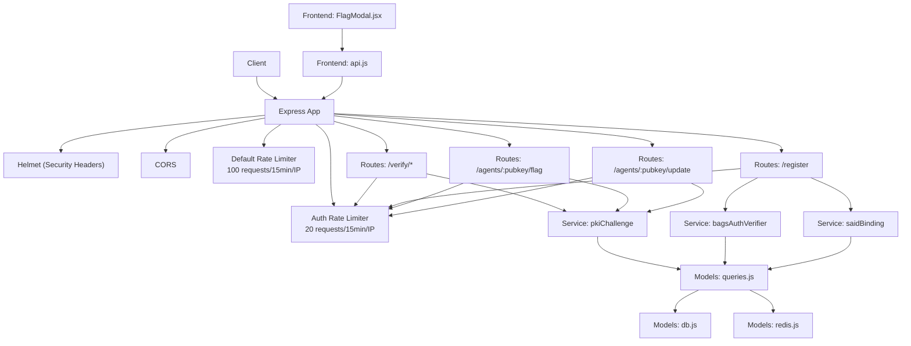
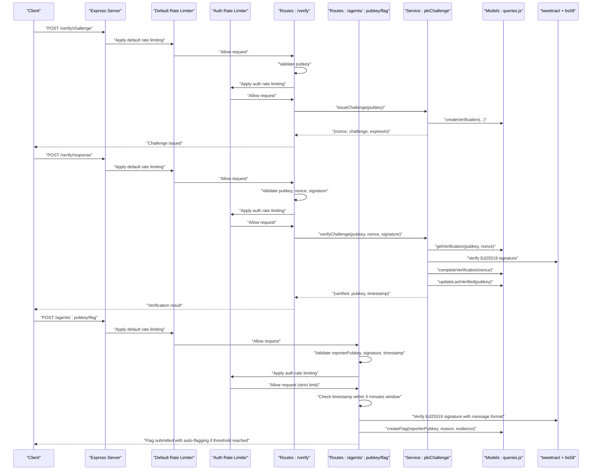
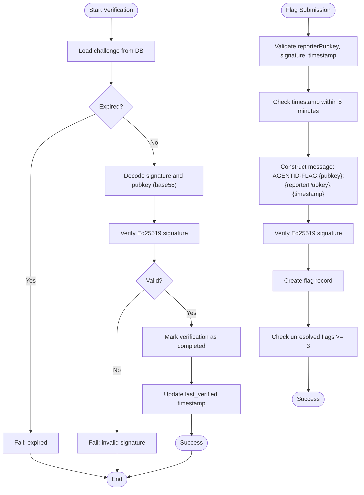
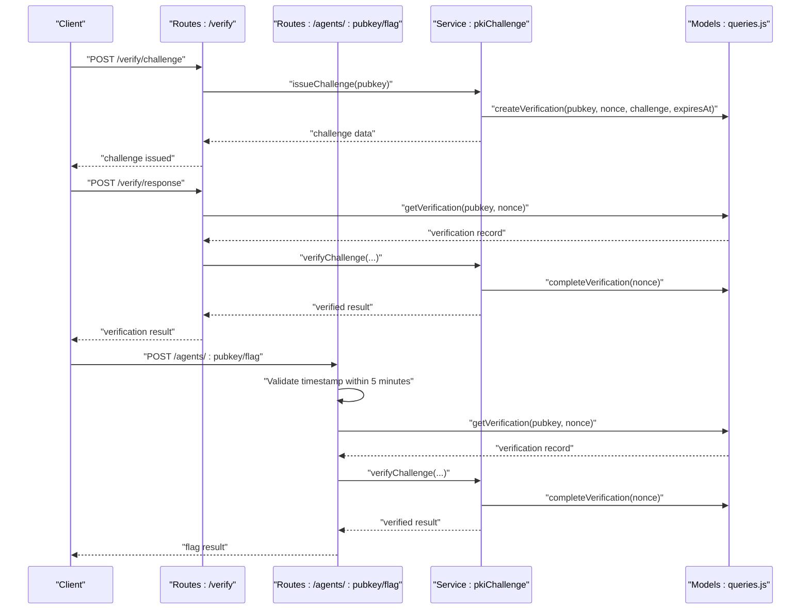
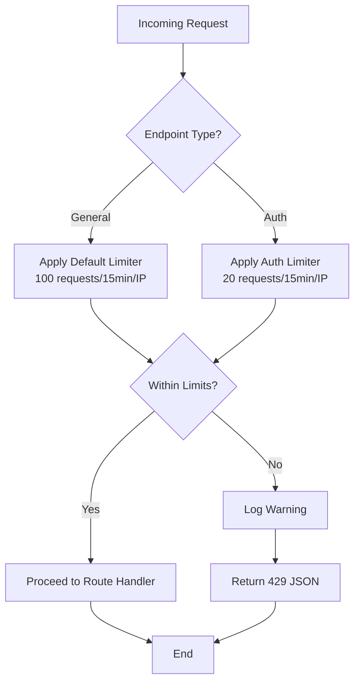
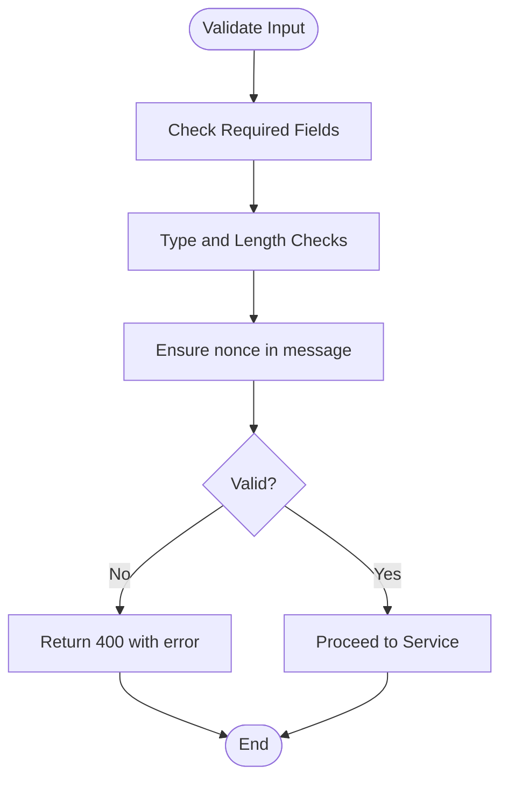
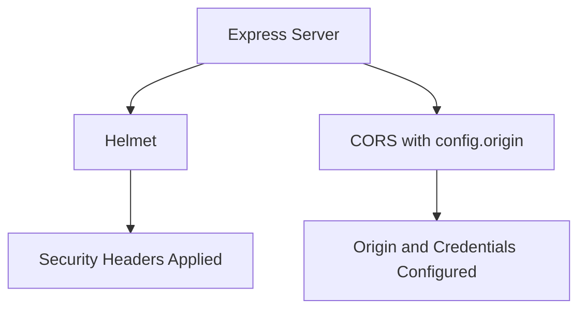
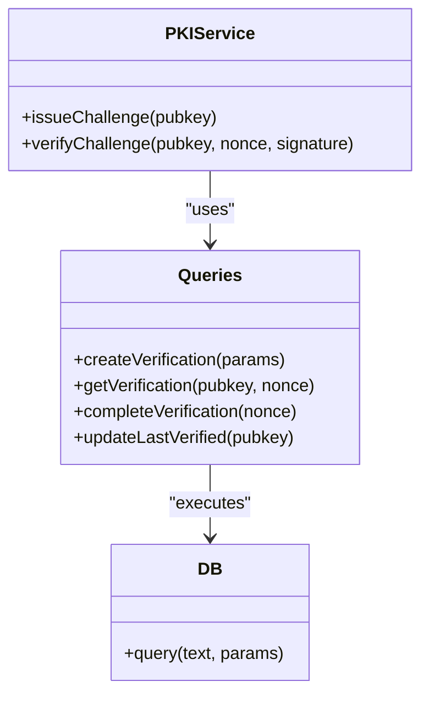
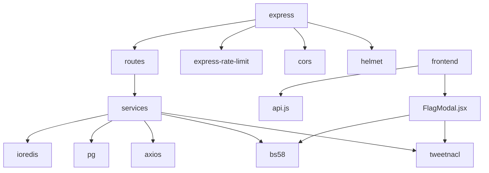

# Security Implementation

<cite>
**Referenced Files in This Document**
- [server.js](file://backend/server.js)
- [config/index.js](file://backend/src/config/index.js)
- [middleware/rateLimit.js](file://backend/src/middleware/rateLimit.js)
- [middleware/errorHandler.js](file://backend/src/middleware/errorHandler.js)
- [models/db.js](file://backend/src/models/db.js)
- [models/redis.js](file://backend/src/models/redis.js)
- [models/queries.js](file://backend/src/models/queries.js)
- [routes/verify.js](file://backend/src/routes/verify.js)
- [routes/register.js](file://backend/src/routes/register.js)
- [routes/attestations.js](file://backend/src/routes/attestations.js)
- [routes/agents.js](file://backend/src/routes/agents.js)
- [services/pkiChallenge.js](file://backend/src/services/pkiChallenge.js)
- [services/bagsAuthVerifier.js](file://backend/src/services/bagsAuthVerifier.js)
- [services/saidBinding.js](file://backend/src/services/saidBinding.js)
- [utils/transform.js](file://backend/src/utils/transform.js)
- [frontend/src/components/FlagModal.jsx](file://frontend/src/components/FlagModal.jsx)
- [frontend/src/lib/api.js](file://frontend/src/lib/api.js)
- [package.json](file://backend/package.json)
- [agentid_build_plan.md](file://agentid_build_plan.md)
</cite>

## Update Summary
**Changes Made**
- Enhanced authentication security with dedicated authLimiter middleware for flag submission endpoints
- Implemented stricter rate limiting for sensitive operations while maintaining appropriate performance
- Updated rate limiting architecture to differentiate between general endpoints and authentication endpoints
- Improved security posture for critical operations like flag submissions, registration, and verification

## Table of Contents
1. [Introduction](#introduction)
2. [Project Structure](#project-structure)
3. [Core Components](#core-components)
4. [Architecture Overview](#architecture-overview)
5. [Detailed Component Analysis](#detailed-component-analysis)
6. [Dependency Analysis](#dependency-analysis)
7. [Performance Considerations](#performance-considerations)
8. [Troubleshooting Guide](#troubleshooting-guide)
9. [Conclusion](#conclusion)
10. [Appendices](#appendices)

## Introduction
This document provides comprehensive security documentation for the AgentID system with a focus on authentication security, data protection, and API security measures. It explains the Ed25519 signature verification implementation, replay attack prevention through challenge-response system, and enhanced rate limiting middleware configuration with dedicated authentication endpoints. The system now includes enhanced cryptographic proof-of-ownership requirements for flag submissions with timestamp validation, comprehensive input validation strategies, SQL injection prevention, CORS configuration, and security headers implementation. The PKI challenge-response system is detailed, including nonce management, expiration policies, and one-time use protection with timestamp validation. Error handling security practices, sensitive data handling, and secure communication protocols are addressed. External API integrations, Redis security configuration, and database security measures are covered, along with threat modeling, security audit procedures, and incident response protocols.

## Project Structure
The backend follows a layered architecture:
- Entry point initializes Express, security middleware, CORS, rate limiting, routes, and global error handling.
- Configuration centralizes environment-driven settings for ports, external APIs, database, Redis, CORS, and expirations.
- Middleware provides rate limiting and centralized error handling.
- Models encapsulate database connectivity and Redis operations, with parameterized queries to prevent SQL injection.
- Services implement PKI challenge-response, external API verifications, and SAID binding.
- Routes define endpoints for registration, verification, and attestation with input validation, rate limits, and cryptographic signature requirements.
- Frontend components provide cryptographic signature generation and validation for flag submissions.

**Diagram sources**
- [server.js:1-104](file://backend/server.js#L1-L104)
- [routes/verify.js:1-121](file://backend/src/routes/verify.js#L1-L121)
- [routes/register.js:1-160](file://backend/src/routes/register.js#L1-L160)
- [routes/attestations.js:1-241](file://backend/src/routes/attestations.js#L1-L241)
- [routes/agents.js:1-255](file://backend/src/routes/agents.js#L1-L255)
- [services/pkiChallenge.js:1-102](file://backend/src/services/pkiChallenge.js#L1-L102)
- [services/bagsAuthVerifier.js:1-87](file://backend/src/services/bagsAuthVerifier.js#L1-L87)
- [services/saidBinding.js:1-119](file://backend/src/services/saidBinding.js#L1-L119)
- [models/queries.js:1-404](file://backend/src/models/queries.js#L1-L404)
- [models/db.js:1-45](file://backend/src/models/db.js#L1-L45)
- [models/redis.js:1-94](file://backend/src/models/redis.js#L1-L94)
- [frontend/src/components/FlagModal.jsx:1-258](file://frontend/src/components/FlagModal.jsx#L1-L258)
- [frontend/src/lib/api.js:1-141](file://frontend/src/lib/api.js#L1-L141)

**Section sources**
- [server.js:1-104](file://backend/server.js#L1-L104)
- [config/index.js:1-31](file://backend/src/config/index.js#L1-L31)

## Core Components
- Authentication and Authorization
  - Ed25519 signature verification using tweetnacl and base58 decoding for both internal PKI challenges and external Bags verification.
  - Enhanced PKI challenge-response with nonce generation, challenge creation, expiration enforcement, one-time use marking, and timestamp validation for replay protection.
  - Registration flow validates inputs, checks nonce inclusion in messages, and verifies external signatures before storing records.
  - Cryptographic proof-of-ownership for flag submissions with mandatory reporterPubkey, signature, timestamp validation, and message format verification.

- Data Protection
  - Parameterized queries in models prevent SQL injection.
  - Environment-driven secrets and URLs for external APIs and databases.
  - Sensitive data handling: API keys are passed via Authorization headers; raw keys are not stored; only identifiers are persisted.

- API Security Measures
  - Helmet sets robust security headers.
  - CORS configured with origin and credentials support.
  - Enhanced rate limiting with dedicated authLimiter middleware for sensitive endpoints while maintaining appropriate performance for general endpoints.
  - Centralized error handling logs and sanitizes error responses.

- External Integrations
  - Bags API integration for wallet ownership verification.
  - SAID Identity Gateway integration for registry binding and trust score retrieval.
  - Redis used for caching and nonces; retry strategy and offline queue for resilience.

- Frontend Security Integration
  - Client-side Ed25519 signature generation for flag submissions.
  - Real-time message construction with timestamp for cryptographic proof-of-ownership.
  - Base58 encoding/decoding for signature and public key handling.

**Section sources**
- [services/pkiChallenge.js:1-102](file://backend/src/services/pkiChallenge.js#L1-L102)
- [routes/verify.js:1-121](file://backend/src/routes/verify.js#L1-L121)
- [routes/register.js:1-160](file://backend/src/routes/register.js#L1-L160)
- [routes/attestations.js:76-180](file://backend/src/routes/attestations.js#L76-L180)
- [routes/agents.js:120-252](file://backend/src/routes/agents.js#L120-L252)
- [services/bagsAuthVerifier.js:1-87](file://backend/src/services/bagsAuthVerifier.js#L1-L87)
- [services/saidBinding.js:1-119](file://backend/src/services/saidBinding.js#L1-L119)
- [models/queries.js:1-404](file://backend/src/models/queries.js#L1-L404)
- [models/db.js:1-45](file://backend/src/models/db.js#L1-L45)
- [models/redis.js:1-94](file://backend/src/models/redis.js#L1-L94)
- [middleware/rateLimit.js:1-62](file://backend/src/middleware/rateLimit.js#L1-L62)
- [middleware/errorHandler.js:1-44](file://backend/src/middleware/errorHandler.js#L1-L44)
- [server.js:1-104](file://backend/server.js#L1-L104)
- [frontend/src/components/FlagModal.jsx:1-258](file://frontend/src/components/FlagModal.jsx#L1-L258)
- [frontend/src/lib/api.js:91-95](file://frontend/src/lib/api.js#L91-L95)

## Architecture Overview
The system enforces authentication and authorization through Ed25519-based challenge-response with timestamp validation, protects against replay attacks via nonces, expiration, and time-based validation, and secures API access with enhanced rate limiting and security headers. The new architecture implements a dual-tier rate limiting system: a default limiter for general endpoints and a stricter authLimiter for sensitive authentication operations. Data integrity is ensured through parameterized queries and environment-driven configuration. The enhanced flag submission system provides cryptographic proof-of-ownership through mandatory reporterPubkey, signature verification, and timestamp validation. External integrations are handled securely with timeouts and error logging.

**Diagram sources**
- [routes/verify.js:1-121](file://backend/src/routes/verify.js#L1-L121)
- [routes/attestations.js:76-180](file://backend/src/routes/attestations.js#L76-L180)
- [services/pkiChallenge.js:1-102](file://backend/src/services/pkiChallenge.js#L1-L102)
- [models/queries.js:207-321](file://backend/src/models/queries.js#L207-L321)

## Detailed Component Analysis

### Enhanced Ed25519 Signature Verification Implementation
- Internal PKI challenge-response with timestamp validation:
  - Challenge string includes pubkey, nonce, and timestamp.
  - Nonce is UUID-based random identifier.
  - Expiration enforced via database timestamp.
  - One-time use enforced by marking verification as completed after successful verification.
  - Ed25519 signature verified using tweetnacl with base58 decoding of inputs.
  - Timestamp validation ensures challenges are used within acceptable time windows.

- Enhanced flag submission cryptographic proof-of-ownership:
  - Mandatory reporterPubkey field for cryptographic verification.
  - Signature field containing base58-encoded Ed25519 signature.
  - Timestamp field with 5-minute validation window (±1 minute future skew allowance).
  - Message format: `AGENTID-FLAG:{pubkey}:{reporterPubkey}:{timestamp}`.
  - Frontend generates message automatically when reporterPubkey is provided.
  - Backend validates signature format, decodes base58 inputs, and verifies Ed25519 signature.

- Agent update cryptographic verification:
  - Message format: `AGENTID-UPDATE:{pubkey}:{timestamp}`.
  - Timestamp validation with 5-minute window and 1-minute future skew allowance.
  - Field validation with allowed update fields whitelist.

**Diagram sources**
- [services/pkiChallenge.js:49-96](file://backend/src/services/pkiChallenge.js#L49-L96)
- [models/queries.js:230-256](file://backend/src/models/queries.js#L230-L256)
- [routes/attestations.js:117-147](file://backend/src/routes/attestations.js#L117-L147)
- [routes/agents.js:165-179](file://backend/src/routes/agents.js#L165-L179)

**Section sources**
- [services/pkiChallenge.js:1-102](file://backend/src/services/pkiChallenge.js#L1-L102)
- [services/bagsAuthVerifier.js:1-87](file://backend/src/services/bagsAuthVerifier.js#L1-L87)
- [services/saidBinding.js:1-119](file://backend/src/services/saidBinding.js#L1-L119)
- [models/queries.js:207-321](file://backend/src/models/queries.js#L207-L321)
- [routes/attestations.js:76-180](file://backend/src/routes/attestations.js#L76-L180)
- [routes/agents.js:120-252](file://backend/src/routes/agents.js#L120-L252)
- [frontend/src/components/FlagModal.jsx:13-23](file://frontend/src/components/FlagModal.jsx#L13-L23)

### Enhanced Replay Attack Prevention Through Challenge-Response System
- Nonce management:
  - Random UUID generated per challenge.
  - Challenge string concatenation includes pubkey, nonce, and timestamp.
- Enhanced expiration policies:
  - Expiration configured via environment variable and enforced in database queries.
  - Additional timestamp validation for real-time replay protection.
- One-time use protection:
  - Verification marked as completed upon successful signature validation.
- Input validation:
  - Routes validate presence and type of required fields (pubkey, nonce, signature).
  - Registration route ensures message includes nonce to prevent replay misuse.
  - Flag submission validates timestamp within 5-minute window with future skew allowance.

**Diagram sources**
- [routes/verify.js:20-49](file://backend/src/routes/verify.js#L20-L49)
- [routes/verify.js:55-112](file://backend/src/routes/verify.js#L55-L112)
- [routes/attestations.js:117-147](file://backend/src/routes/attestations.js#L117-L147)
- [services/pkiChallenge.js:17-39](file://backend/src/services/pkiChallenge.js#L17-L39)
- [services/pkiChallenge.js:49-96](file://backend/src/services/pkiChallenge.js#L49-L96)
- [models/queries.js:213-256](file://backend/src/models/queries.js#L213-L256)

**Section sources**
- [routes/verify.js:13-112](file://backend/src/routes/verify.js#L13-L112)
- [routes/attestations.js:117-147](file://backend/src/routes/attestations.js#L117-L147)
- [services/pkiChallenge.js:17-96](file://backend/src/services/pkiChallenge.js#L17-L96)
- [models/queries.js:213-256](file://backend/src/models/queries.js#L213-L256)

### Enhanced Rate Limiting Middleware Configuration
- **Updated** Enhanced rate limiting architecture with dedicated authLimiter middleware:
  - Default rate limiter: 100 requests per 15 minutes per IP for general endpoints.
  - Authentication-specific limiter: 20 requests per 15 minutes per IP for sensitive endpoints.
  - Strict limiter for auth endpoints: 20 requests per 15 minutes with custom error message.
  - Standard headers enabled; legacy headers disabled.
  - Custom handler logs exceeded limits and returns JSON with status 429.
  - Enhanced security for sensitive operations with stricter rate limiting on authentication endpoints.

- **Updated** Implementation across all sensitive endpoints:
  - `/verify/challenge` - Uses authLimiter for challenge issuance
  - `/verify/response` - Uses authLimiter for response verification
  - `/register` - Uses authLimiter for agent registration
  - `/agents/:pubkey/flag` - Uses authLimiter for flag submissions
  - `/agents/:pubkey/update` - Uses authLimiter for agent updates

**Diagram sources**
- [middleware/rateLimit.js:23-61](file://backend/src/middleware/rateLimit.js#L23-L61)

**Section sources**
- [middleware/rateLimit.js:1-62](file://backend/src/middleware/rateLimit.js#L1-L62)
- [server.js:66](file://backend/server.js#L66)
- [routes/verify.js:18, 57](file://backend/src/routes/verify.js#L18,L57)
- [routes/register.js:59](file://backend/src/routes/register.js#L59)
- [routes/attestations.js:80](file://backend/src/routes/attestations.js#L80)
- [routes/agents.js:124](file://backend/src/routes/agents.js#L124)

### Enhanced Input Validation Strategies and SQL Injection Prevention
- Enhanced input validation:
  - Registration route validates presence, type, length, and nonce inclusion in message.
  - Verification routes validate presence and type of pubkey, nonce, and signature.
  - Flag submission validates reporterPubkey format, signature presence, timestamp validity, and reason requirements.
  - Agent update validates signature, timestamp, and field constraints with allowed field whitelist.
- SQL injection prevention:
  - All database queries use parameterized statements with the pg library.
  - Dynamic field updates construct parameterized SET clauses safely.
  - Solana address validation using base58 decoding with 32-byte length check.

**Diagram sources**
- [routes/register.js:20-53](file://backend/src/routes/register.js#L20-L53)
- [routes/verify.js:22-76](file://backend/src/routes/verify.js#L22-L76)
- [routes/attestations.js:85-115](file://backend/src/routes/attestations.js#L85-L115)
- [routes/agents.js:129-140](file://backend/src/routes/agents.js#L129-L140)

**Section sources**
- [routes/register.js:20-53](file://backend/src/routes/register.js#L20-L53)
- [routes/register.js:59-153](file://backend/src/routes/register.js#L59-L153)
- [routes/verify.js:22-112](file://backend/src/routes/verify.js#L22-L112)
- [routes/attestations.js:85-115](file://backend/src/routes/attestations.js#L85-L115)
- [routes/agents.js:129-140](file://backend/src/routes/agents.js#L129-L140)
- [models/queries.js:17-73](file://backend/src/models/queries.js#L17-L73)
- [utils/transform.js:87-93](file://backend/src/utils/transform.js#L87-L93)

### CORS Configuration and Security Headers
- CORS:
  - Origin configured via environment variable with credentials support.
- Security headers:
  - Helmet middleware applied globally to set strict security headers.

**Diagram sources**
- [server.js:44-51](file://backend/server.js#L44-L51)
- [config/index.js:22-23](file://backend/src/config/index.js#L22-L23)

**Section sources**
- [server.js:44-51](file://backend/server.js#L44-L51)
- [config/index.js:22-23](file://backend/src/config/index.js#L22-L23)

### Enhanced PKI Challenge-Response System Details
- Nonce management:
  - UUID-based random nonce per challenge.
  - Challenge string includes pubkey, nonce, and timestamp.
- Enhanced expiration policies:
  - Expiration seconds configured via environment variable.
  - Database query enforces expiration.
  - Additional timestamp validation for real-time replay protection.
- One-time use protection:
  - Verification marked completed after successful validation.
- Enhanced signature verification:
  - Ed25519 verification using tweetnacl with base58 decoding.
  - Timestamp validation ensures challenges are used within acceptable time windows.

**Diagram sources**
- [services/pkiChallenge.js:17-96](file://backend/src/services/pkiChallenge.js#L17-L96)
- [models/queries.js:213-256](file://backend/src/models/queries.js#L213-L256)
- [models/db.js:31-39](file://backend/src/models/db.js#L31-L39)

**Section sources**
- [services/pkiChallenge.js:17-96](file://backend/src/services/pkiChallenge.js#L17-L96)
- [models/queries.js:213-256](file://backend/src/models/queries.js#L213-L256)

### Enhanced Error Handling Security Practices
- Centralized error handler logs error details, request context, and environment-specific stack traces in development.
- Sanitized error responses avoid leaking internal details in production.
- Rate limiter handler logs IP and path for exceeded limits.
- Enhanced error handling for cryptographic operations with specific error messages for invalid signatures, encoding errors, and timestamp validation failures.

**Section sources**
- [middleware/errorHandler.js:15-41](file://backend/src/middleware/errorHandler.js#L15-L41)
- [middleware/rateLimit.js:37-40](file://backend/src/middleware/rateLimit.js#L37-L40)

### Enhanced Sensitive Data Handling and Secure Communication Protocols
- Sensitive data:
  - BAGS_API_KEY passed via Authorization header; raw key not stored.
  - Only API key identifiers are persisted.
  - Frontend handles cryptographic signatures locally without exposing private keys.
- Secure communication:
  - HTTPS enforced by Helmet and deployment configuration.
  - External API calls use HTTPS endpoints with timeouts.
  - Base58 encoding/decoding for cryptographic data transmission.

**Section sources**
- [services/bagsAuthVerifier.js:22-27](file://backend/src/services/bagsAuthVerifier.js#L22-L27)
- [services/saidBinding.js:38-47](file://backend/src/services/saidBinding.js#L38-L47)
- [server.js:44](file://backend/server.js#L44)
- [frontend/src/components/FlagModal.jsx:141-146](file://frontend/src/components/FlagModal.jsx#L141-L146)

### Enhanced External API Integrations Security
- Bags API:
  - Authorization header with BAGS_API_KEY.
  - Timeouts configured for outbound requests.
- SAID Gateway:
  - HTTPS endpoint for registry binding and trust score retrieval.
  - Timeouts configured for outbound requests.
- Redis:
  - Connection retry strategy and offline queue for resilience.
  - Cache operations with TTL support.

**Section sources**
- [services/bagsAuthVerifier.js:18-80](file://backend/src/services/bagsAuthVerifier.js#L18-L80)
- [services/saidBinding.js:21-112](file://backend/src/services/saidBinding.js#L21-L112)
- [models/redis.js:10-34](file://backend/src/models/redis.js#L10-L34)

### Enhanced Database Security Measures
- Connection pooling with SSL configuration in production.
- Parameterized queries to prevent SQL injection.
- Separate tables for agent identities, verifications, flags, and actions with appropriate constraints.
- Enhanced query validation with dynamic field updates and JSONB containment queries.

**Section sources**
- [models/db.js:10-18](file://backend/src/models/db.js#L10-L18)
- [models/queries.js:17-73](file://backend/src/models/queries.js#L17-L73)
- [models/queries.js:332-356](file://backend/src/models/queries.js#L332-L356)
- [agentid_build_plan.md:88-131](file://agentid_build_plan.md#L88-L131)

### Enhanced Frontend Security Integration
- Client-side cryptographic signature generation:
  - Automatic message construction for flag submissions.
  - Real-time timestamp generation with 1-second precision.
  - Base58 encoding for signature and public key handling.
- User experience enhancements:
  - Clear instructions for Ed25519 signature generation.
  - Real-time validation of signature format.
  - Error handling for invalid JSON evidence.
- Integration with backend API:
  - Seamless integration with existing API client.
  - Proper error propagation and user feedback.

**Section sources**
- [frontend/src/components/FlagModal.jsx:13-23](file://frontend/src/components/FlagModal.jsx#L13-L23)
- [frontend/src/components/FlagModal.jsx:141-146](file://frontend/src/components/FlagModal.jsx#L141-L146)
- [frontend/src/lib/api.js:91-95](file://frontend/src/lib/api.js#L91-L95)

## Dependency Analysis
The system relies on several key dependencies for security:
- helmet: Provides security headers.
- cors: Controls cross-origin requests.
- express-rate-limit: Enforces rate limits with configurable limits.
- tweetnacl and bs58: Ed25519 signature verification and base58 encoding/decoding.
- axios: External API communication with timeouts.
- pg and ioredis: Database and Redis connectivity.

**Diagram sources**
- [package.json:18-29](file://backend/package.json#L18-L29)
- [server.js:25-31](file://backend/server.js#L25-L31)
- [frontend/src/components/FlagModal.jsx:1-258](file://frontend/src/components/FlagModal.jsx#L1-L258)
- [frontend/src/lib/api.js:1-141](file://frontend/src/lib/api.js#L1-L141)

**Section sources**
- [package.json:18-29](file://backend/package.json#L18-L29)
- [server.js:25-31](file://backend/server.js#L25-L31)

## Performance Considerations
- Enhanced rate limiting reduces load and mitigates abuse while maintaining appropriate performance for general endpoints.
- Parameterized queries minimize SQL overhead and risk.
- Redis caching reduces database load for frequently accessed data.
- Helmet and CORS are lightweight middleware with minimal performance impact.
- Frontend cryptographic operations are performed client-side to reduce server load.
- Timestamp validation occurs in memory for fast validation without database queries.
- **Updated** Dedicated authLimiter provides stricter limits for sensitive operations while allowing higher throughput for general endpoints.

## Troubleshooting Guide
- Rate limit exceeded:
  - Check logs for warnings and adjust limits if necessary.
  - Review client-side retry logic.
  - **Updated** Differentiate between general endpoint limits (100/15min) and authentication limits (20/15min).
- Signature verification failures:
  - Ensure base58 encoding/decoding is correct.
  - Verify challenge string composition and nonce usage.
  - Check timestamp validation for flag submissions.
- Database errors:
  - Review connection string and SSL configuration.
  - Check for query parameter mismatches.
- Redis connectivity:
  - Monitor retry strategy logs and offline queue behavior.
- Frontend cryptographic issues:
  - Verify base58 encoding/decoding in browser console.
  - Check network requests for proper message construction.
  - Ensure wallet supports Ed25519 signature generation.

**Section sources**
- [middleware/rateLimit.js:37-40](file://backend/src/middleware/rateLimit.js#L37-L40)
- [services/pkiChallenge.js:70-76](file://backend/src/services/pkiChallenge.js#L70-L76)
- [models/db.js:21-23](file://backend/src/models/db.js#L21-L23)
- [models/redis.js:22-34](file://backend/src/models/redis.js#L22-L34)
- [frontend/src/components/FlagModal.jsx:141-146](file://frontend/src/components/FlagModal.jsx#L141-L146)

## Conclusion
The AgentID system implements robust authentication and authorization through Ed25519-based challenge-response with enhanced timestamp validation, prevents replay attacks with nonces, expiration, and time-based validation, and secures API access with enhanced rate limiting and security headers. The new dual-tier rate limiting architecture provides dedicated authentication endpoints with stricter limits while maintaining appropriate performance for general operations. The enhanced flag submission system provides cryptographic proof-of-ownership through mandatory reporterPubkey, signature verification, and timestamp validation. Data integrity is maintained via parameterized queries, while external integrations are handled securely with timeouts and error logging. The architecture balances security, performance, and maintainability, providing a strong foundation for trust verification in the Bags ecosystem with comprehensive cryptographic protections and enhanced security measures for sensitive operations.

## Appendices
- Threat Modeling:
  - Spoofing: Mitigated by Ed25519 private key requirement and cryptographic proof-of-ownership.
  - Replay: Mitigated by nonce, timestamp, expiration, one-time use, and timestamp window validation.
  - DDoS: Mitigated by enhanced rate limiting with dedicated authLimiter for sensitive endpoints.
  - Man-in-the-middle: Mitigated by HTTPS and helmet security headers.
  - Frontend attacks: Mitigated by client-side cryptographic operations and input validation.
- Security Audit Procedures:
  - Regular review of environment variables and secrets rotation.
  - Penetration testing of external API integrations.
  - Database and Redis security hardening.
  - Cryptographic signature validation testing.
  - **Updated** Rate limiting effectiveness testing for both general and authentication endpoints.
- Incident Response Protocols:
  - Immediate rate limit increase for affected IPs.
  - External API outage handling with fallbacks.
  - Database and Redis connectivity monitoring with alerts.
  - Cryptographic key rotation procedures.
  - Frontend security monitoring for signature validation failures.
  - **Updated** Authentication endpoint monitoring and alerting for rate limit bypass attempts.