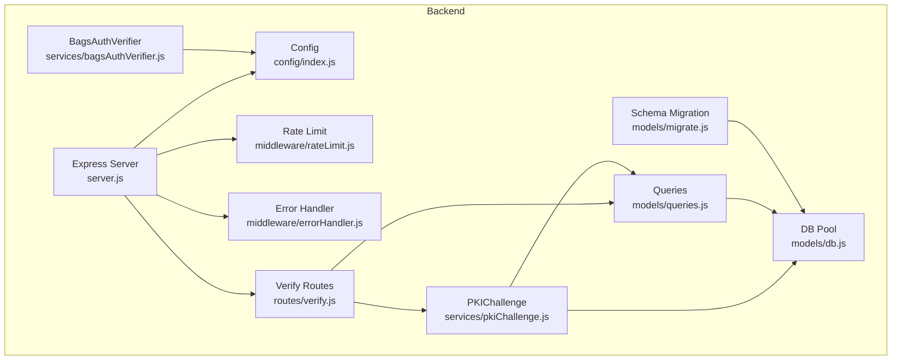
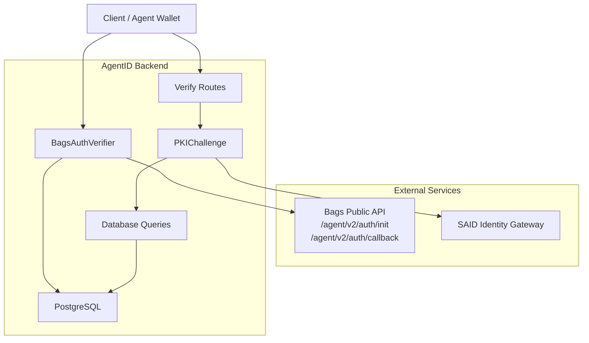
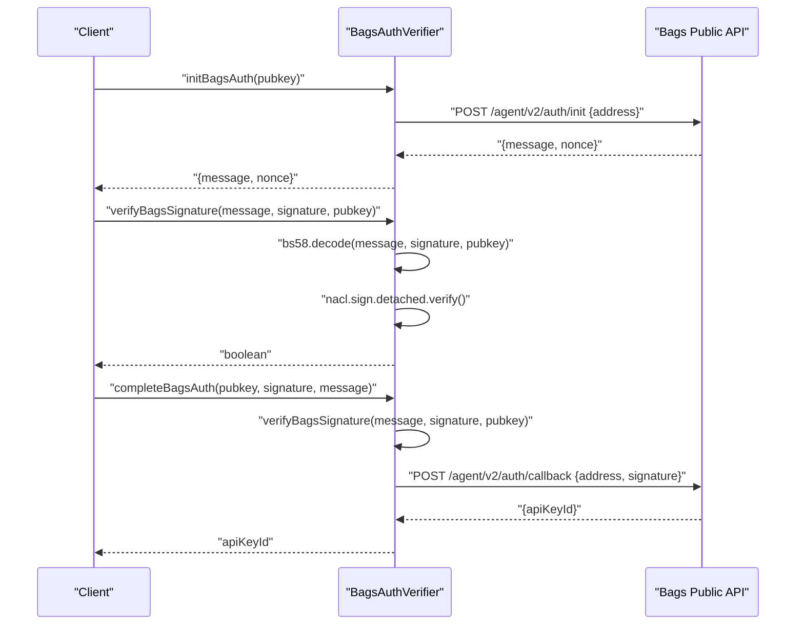
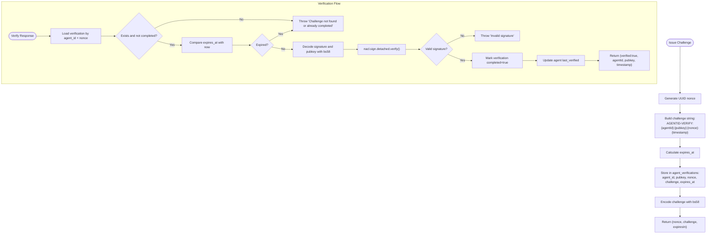
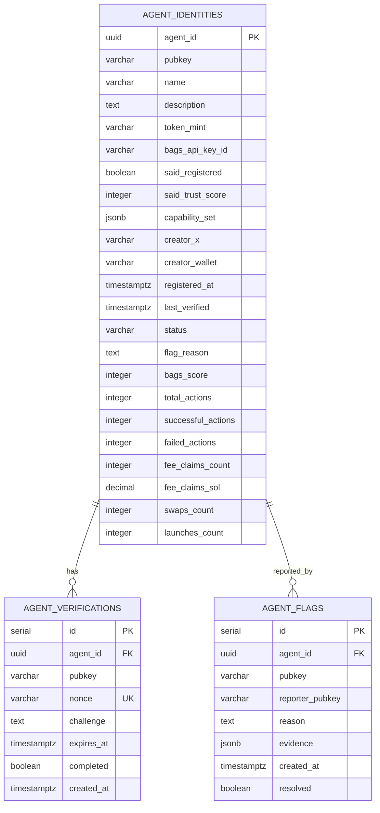
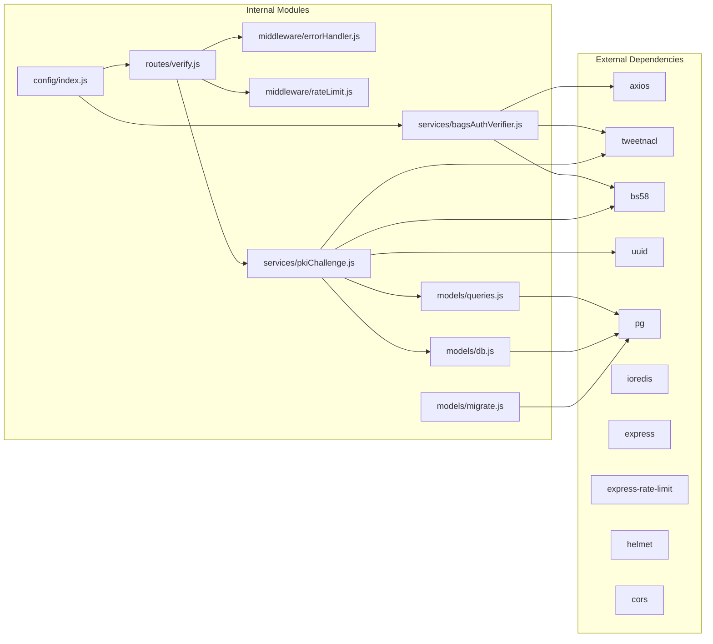

# Authentication Services

<cite>
**Referenced Files in This Document**
- [bagsAuthVerifier.js](file://backend/src/services/bagsAuthVerifier.js)
- [pkiChallenge.js](file://backend/src/services/pkiChallenge.js)
- [verify.js](file://backend/src/routes/verify.js)
- [errorHandler.js](file://backend/src/middleware/errorHandler.js)
- [rateLimit.js](file://backend/src/middleware/rateLimit.js)
- [index.js](file://backend/src/config/index.js)
- [queries.js](file://backend/src/models/queries.js)
- [db.js](file://backend/src/models/db.js)
- [migrate.js](file://backend/src/models/migrate.js)
- [server.js](file://backend/server.js)
- [package.json](file://backend/package.json)
- [AgentID_Code_Review.md](file://AgentID_Code_Review.md)
- [agentid_build_plan.md](file://agentid_build_plan.md)
- [pkiChallenge.test.js](file://backend/tests/pkiChallenge.test.js)
</cite>

## Update Summary
**Changes Made**
- Updated challenge string format to include agent UUID: `AGENTID-VERIFY:{agentId}:{pubkey}:{nonce}:{timestamp}`
- Modified verification response to return agentId alongside verification result
- Updated PKI challenge endpoints to accept agentId instead of pubkey in request bodies
- Enhanced service APIs to use agent UUID for challenge issuance and verification
- Updated authentication workflows to reflect UUID-based agent identification

## Table of Contents
1. [Introduction](#introduction)
2. [Project Structure](#project-structure)
3. [Core Components](#core-components)
4. [Architecture Overview](#architecture-overview)
5. [Detailed Component Analysis](#detailed-component-analysis)
6. [Dependency Analysis](#dependency-analysis)
7. [Performance Considerations](#performance-considerations)
8. [Troubleshooting Guide](#troubleshooting-guide)
9. [Conclusion](#conclusion)
10. [Appendices](#appendices)

## Introduction
This document provides comprehensive documentation for the AgentID authentication services with a focus on:
- Bags authentication wrapper for establishing wallet ownership
- PKI challenge-response system for ongoing verification and spoofing prevention
- Ed25519 signature verification using tweetnacl
- Base58 encoding/decoding for cryptographic data transport
- API specifications, error handling, security considerations, and integration patterns with external services

The authentication system is composed of two primary services:
- BagsAuthVerifier: wraps the Bags Ed25519 agent auth flow to verify wallet ownership
- PKIChallenge: issues and validates Ed25519-signed challenges to prevent spoofing and replay attacks

**Updated** The system now uses UUID-based agent identification throughout the authentication flow, with challenge strings containing agent UUID for enhanced security and traceability.

## Project Structure
The authentication-related code resides in the backend service under the src directory. Key areas include:
- Services: BagsAuthVerifier and PKIChallenge implementations with explicit .js extensions
- Routes: HTTP endpoints for challenge issuance and verification
- Middleware: error handling and rate limiting
- Models: database queries and schema migrations
- Config: environment-driven configuration
- Root: Express server bootstrap and route mounting



**Diagram sources**
- [server.js:1-85](file://backend/server.js#L1-L85)
- [index.js:1-34](file://backend/src/config/index.js#L1-L34)
- [rateLimit.js:1-62](file://backend/src/middleware/rateLimit.js#L1-L62)
- [errorHandler.js:1-44](file://backend/src/middleware/errorHandler.js#L1-L44)
- [verify.js:1-121](file://backend/src/routes/verify.js#L1-L121)
- [bagsAuthVerifier.js:1-93](file://backend/src/services/bagsAuthVerifier.js#L1-L93)
- [pkiChallenge.js:1-106](file://backend/src/services/pkiChallenge.js#L1-L106)
- [queries.js:1-443](file://backend/src/models/queries.js#L1-L443)
- [db.js:1-45](file://backend/src/models/db.js#L1-L45)
- [migrate.js:1-101](file://backend/src/models/migrate.js#L1-L101)

**Section sources**
- [server.js:1-85](file://backend/server.js#L1-L85)
- [index.js:1-34](file://backend/src/config/index.js#L1-L34)
- [rateLimit.js:1-62](file://backend/src/middleware/rateLimit.js#L1-L62)
- [errorHandler.js:1-44](file://backend/src/middleware/errorHandler.js#L1-L44)
- [verify.js:1-121](file://backend/src/routes/verify.js#L1-L121)
- [bagsAuthVerifier.js:1-93](file://backend/src/services/bagsAuthVerifier.js#L1-L93)
- [pkiChallenge.js:1-106](file://backend/src/services/pkiChallenge.js#L1-L106)
- [queries.js:1-443](file://backend/src/models/queries.js#L1-L443)
- [db.js:1-45](file://backend/src/models/db.js#L1-L45)
- [migrate.js:1-101](file://backend/src/models/migrate.js#L1-L101)

## Core Components
- BagsAuthVerifier service
  - initBagsAuth: initializes the Bags Ed25519 auth flow and returns a challenge message and nonce
  - verifyBagsSignature: verifies an Ed25519 signature using tweetnacl with base58-decoded inputs
  - completeBagsAuth: completes the Bags auth by submitting the signature and returning an API key reference
- PKIChallenge service
  - issueChallenge: generates a random UUID nonce, constructs a challenge string with agent UUID, stores it in the database with expiration, and returns a base58-encoded challenge
  - verifyChallenge: retrieves a pending verification by agent UUID and nonce, validates expiration, decodes inputs, verifies the Ed25519 signature, marks the challenge as completed, and updates the last verified timestamp

Key cryptographic and encoding utilities:
- tweetnacl for Ed25519 signature verification
- bs58 for base58 encoding/decoding of messages, signatures, and public keys
- crypto.randomUUID for UUID-based nonce generation

**Section sources**
- [bagsAuthVerifier.js:18-86](file://backend/src/services/bagsAuthVerifier.js#L18-L86)
- [pkiChallenge.js:18-100](file://backend/src/services/pkiChallenge.js#L18-L100)

## Architecture Overview
The authentication architecture integrates external services and internal components to provide secure, verifiable identity for agents within the Bags ecosystem.



**Diagram sources**
- [bagsAuthVerifier.js:11](file://backend/src/services/bagsAuthVerifier.js#L11)
- [verify.js:17-118](file://backend/src/routes/verify.js#L17-L118)
- [pkiChallenge.js:18-100](file://backend/src/services/pkiChallenge.js#L18-L100)
- [queries.js:249-292](file://backend/src/models/queries.js#L249-L292)
- [db.js:10-39](file://backend/src/models/db.js#L10-L39)

## Detailed Component Analysis

### BagsAuthVerifier Service
The BagsAuthVerifier service wraps the Bags Ed25519 agent authentication flow to establish wallet ownership as the first step of agent registration. It performs three primary operations:
- Initialization: requests a challenge message and nonce from the Bags API
- Signature verification: validates an Ed25519 signature using tweetnacl with base58-decoded inputs
- Completion: submits the signature to the Bags callback endpoint and returns an API key reference



**Diagram sources**
- [bagsAuthVerifier.js:18-86](file://backend/src/services/bagsAuthVerifier.js#L18-L86)
- [bagsAuthVerifier.js:11](file://backend/src/services/bagsAuthVerifier.js#L11)

Implementation highlights:
- Uses axios for HTTP requests to the Bags API
- Encodes/decodes cryptographic data with bs58
- Verifies Ed25519 signatures with tweetnacl
- Enforces timeouts on external API calls
- Returns only the API key reference (not the key itself) for security

**Section sources**
- [bagsAuthVerifier.js:18-86](file://backend/src/services/bagsAuthVerifier.js#L18-L86)
- [bagsAuthVerifier.js:6-8](file://backend/src/services/bagsAuthVerifier.js#L6-L8)
- [index.js:12](file://backend/src/config/index.js#L12)

### PKIChallenge Service
The PKIChallenge service implements an Ed25519-based challenge-response mechanism to prevent spoofing and replay attacks. It manages challenge lifecycle and cryptographic verification with UUID-based agent identification.



**Diagram sources**
- [pkiChallenge.js:18-100](file://backend/src/services/pkiChallenge.js#L18-L100)
- [queries.js:266-292](file://backend/src/models/queries.js#L266-L292)

Security features:
- UUID-based nonce generation with crypto.randomUUID
- Challenge string includes agent UUID, pubkey, nonce, and timestamp
- Expiration enforcement at both database and service levels
- Single-use verification with completion flag
- Ed25519 signature verification with tweetnacl
- Base58 encoding for compact transport

**Section sources**
- [pkiChallenge.js:18-100](file://backend/src/services/pkiChallenge.js#L18-L100)
- [queries.js:266-292](file://backend/src/models/queries.js#L266-L292)

### API Specifications

#### PKI Challenge Endpoints
- POST /verify/challenge
  - Purpose: Issue a new PKI challenge for an agent
  - Request body: { agentId: string }
  - Response: { nonce: string, challenge: string, expiresIn: number }
  - Validation: Requires existing agent record with UUID
  - Security: Rate-limited, challenge expires after configured TTL

- POST /verify/response
  - Purpose: Verify a signed challenge response
  - Request body: { agentId: string, nonce: string, signature: string }
  - Response: { verified: boolean, agentId: string, pubkey: string, timestamp: number }
  - Validation: Checks existence, expiration, and signature validity
  - Security: Rate-limited, prevents replay via completion flag

Error responses:
- 400 Bad Request: Missing or invalid parameters
- 404 Not Found: Agent not found or challenge not found
- 401 Unauthorized: Challenge expired or invalid signature
- 429 Too Many Requests: Rate limit exceeded

**Section sources**
- [verify.js:17-118](file://backend/src/routes/verify.js#L17-L118)
- [rateLimit.js:50-55](file://backend/src/middleware/rateLimit.js#L50-L55)

#### Bags Authentication Endpoints
Note: The BagsAuthVerifier service orchestrates these flows internally. Integration points:
- POST /agent/v2/auth/init (external)
  - Request: { address: string }
  - Response: { message: string, nonce: string }
- POST /agent/v2/auth/callback (external)
  - Request: { address: string, signature: string }
  - Response: { apiKeyId: string }

Integration pattern:
- Client obtains challenge from Bags via BagsAuthVerifier.initBagsAuth
- Client signs challenge with Ed25519 private key
- Client calls BagsAuthVerifier.completeBagsAuth with signature
- Service verifies signature locally before calling Bags callback

**Section sources**
- [bagsAuthVerifier.js:18-86](file://backend/src/services/bagsAuthVerifier.js#L18-L86)

### Data Models and Schema
The authentication system relies on three core tables:
- agent_identities: Stores agent records with UUID primary key, status, scores, and metadata
- agent_verifications: Stores issued challenges with agent UUID, nonce, expiration, and completion status
- agent_flags: Records community-reported flags for moderation



**Diagram sources**
- [migrate.js:10-65](file://backend/src/models/migrate.js#L10-L65)
- [queries.js:249-292](file://backend/src/models/queries.js#L249-L292)

**Section sources**
- [migrate.js:10-65](file://backend/src/models/migrate.js#L10-L65)
- [queries.js:249-292](file://backend/src/models/queries.js#L249-L292)

## Dependency Analysis
The authentication services depend on several external libraries and internal modules with consistent .js extensions:



**Diagram sources**
- [package.json:18-29](file://backend/package.json#L18-L29)
- [server.js:12-26](file://backend/server.js#L12-L26)
- [bagsAuthVerifier.js:6-8](file://backend/src/services/bagsAuthVerifier.js#L6-L8)
- [pkiChallenge.js:6-10](file://backend/src/services/pkiChallenge.js#L6-L10)
- [queries.js:6](file://backend/src/models/queries.js#L6)
- [db.js:6-18](file://backend/src/models/db.js#L6-L18)
- [migrate.js:7](file://backend/src/models/migrate.js#L7)

**Section sources**
- [package.json:18-29](file://backend/package.json#L18-L29)
- [server.js:12-26](file://backend/server.js#L12-L26)
- [bagsAuthVerifier.js:6-8](file://backend/src/services/bagsAuthVerifier.js#L6-L8)
- [pkiChallenge.js:6-10](file://backend/src/services/pkiChallenge.js#L6-L10)
- [queries.js:6](file://backend/src/models/queries.js#L6)
- [db.js:6-18](file://backend/src/models/db.js#L6-L18)
- [migrate.js:7](file://backend/src/models/migrate.js#L7)

## Performance Considerations
- Database indexing: The migration script creates indexes on frequently queried columns (status, bags_score, pubkey, agent_id) to optimize discovery and filtering operations.
- Connection pooling: The PostgreSQL pool uses environment-specific SSL configuration for production deployments.
- Caching: Redis is available for challenge nonces and badge caching, with configurable TTL.
- Rate limiting: Express-rate-limit middleware provides configurable request throttling to protect endpoints from abuse.
- Timeout configuration: External API calls include timeout settings to prevent hanging requests.

## Troubleshooting Guide

### Common Authentication Failures
- Challenge not found or already completed
  - Cause: Nonce reuse or expired verification record
  - Resolution: Issue a new challenge and ensure timely response submission
  - Reference: [pkiChallenge.js:57-59](file://backend/src/services/pkiChallenge.js#L57-L59)

- Challenge has expired
  - Cause: Response submitted after expiration window
  - Resolution: Request a new challenge before attempting verification
  - Reference: [pkiChallenge.js:64-66](file://backend/src/services/pkiChallenge.js#L64-L66)

- Invalid signature
  - Cause: Incorrect message format, wrong key, or corrupted data
  - Resolution: Verify message includes correct agent UUID, nonce, and timestamp, use proper Ed25519 key, ensure base58 encoding/decoding
  - Reference: [pkiChallenge.js:84-86](file://backend/src/services/pkiChallenge.js#L84-L86)

- Rate limit exceeded
  - Cause: Too many requests within time window
  - Resolution: Implement exponential backoff and reduce request frequency
  - Reference: [rateLimit.js:50-55](file://backend/src/middleware/rateLimit.js#L50-L55)

### Error Handling Strategy
The system employs a centralized error handler that:
- Logs detailed error context (message, stack, path, method, timestamp)
- Returns standardized JSON responses with appropriate HTTP status codes
- Includes stack traces only in development mode for debugging

**Section sources**
- [errorHandler.js:15-40](file://backend/src/middleware/errorHandler.js#L15-L40)
- [verify.js:91-117](file://backend/src/routes/verify.js#L91-L117)

### Security Considerations
- Spoofing prevention: Ed25519 signatures require possession of the private key; copying only metadata is insufficient
- Replay attack protection: UUID-based nonces are single-use and expire after a configured time window
- Data validation: All inputs are validated and sanitized before processing
- Transport security: HTTPS is recommended for production deployments
- Secret management: API keys and sensitive configuration are loaded from environment variables

**Section sources**
- [pkiChallenge.js:18-41](file://backend/src/services/pkiChallenge.js#L18-L41)
- [bagsAuthVerifier.js:44-57](file://backend/src/services/bagsAuthVerifier.js#L44-L57)
- [index.js:12](file://backend/src/config/index.js#L12)

## Conclusion
The AgentID authentication services provide a robust, PKI-based solution for verifying agent identities within the Bags ecosystem. The BagsAuthVerifier service seamlessly integrates with the Bags Ed25519 authentication flow, while the PKIChallenge service offers comprehensive spoofing prevention and replay protection through Ed25519 signatures and UUID-based nonce management. The enhanced authentication system now uses UUID-based agent identification throughout the flow, with challenge strings containing agent UUID for improved security and traceability. Together, these components establish a secure foundation for agent registration, ongoing verification, and trust badge issuance.

## Appendices

### Configuration Requirements
Required environment variables:
- DATABASE_URL: PostgreSQL connection string
- BAGS_API_KEY: API key for Bags authentication
- SAID_GATEWAY_URL: SAID Identity Gateway endpoint
- AGENTID_BASE_URL: Base URL for AgentID service
- REDIS_URL: Redis connection string for caching
- CORS_ORIGIN: Allowed origins for cross-origin requests
- BADGE_CACHE_TTL: Badge cache time-to-live in seconds
- CHALLENGE_EXPIRY_SECONDS: Challenge expiration in seconds

**Section sources**
- [index.js:6-31](file://backend/src/config/index.js#L6-L31)

### Integration Patterns
- External API integration: The BagsAuthVerifier service communicates with the Bags Public API using the x-api-key header scheme
- Database integration: All database operations use parameterized queries to prevent SQL injection
- Frontend integration: Clients should implement proper error handling and rate limiting when calling authentication endpoints

**Section sources**
- [bagsAuthVerifier.js:11](file://backend/src/services/bagsAuthVerifier.js#L11)
- [queries.js:17-28](file://backend/src/models/queries.js#L17-L28)

### Practical Examples
- Authentication workflow:
  1. Client calls POST /verify/challenge with agentId
  2. Server responds with challenge and nonce
  3. Client signs challenge with Ed25519 private key
  4. Client calls POST /verify/response with agentId, nonce, and signature
  5. Server validates signature and returns {verified: true, agentId, pubkey, timestamp}

- Bags authentication workflow:
  1. Client calls BagsAuthVerifier.initBagsAuth with pubkey
  2. Client signs returned message with Ed25519 private key
  3. Client calls BagsAuthVerifier.completeBagsAuth with signature
  4. Service verifies signature and calls Bags callback

**Section sources**
- [verify.js:17-118](file://backend/src/routes/verify.js#L17-L118)
- [bagsAuthVerifier.js:18-86](file://backend/src/services/bagsAuthVerifier.js#L18-L86)

### Challenge String Format
The challenge string format now includes agent UUID for enhanced security:
```
AGENTID-VERIFY:{agentId}:{pubkey}:{nonce}:{timestamp}
```

Where:
- `{agentId}`: UUID of the agent being verified
- `{pubkey}`: Agent's public key
- `{nonce}`: Random UUID nonce
- `{timestamp}`: Unix timestamp when challenge was created

**Section sources**
- [pkiChallenge.js:21](file://backend/src/services/pkiChallenge.js#L21)
- [pkiChallenge.test.js:74](file://backend/tests/pkiChallenge.test.js#L74)