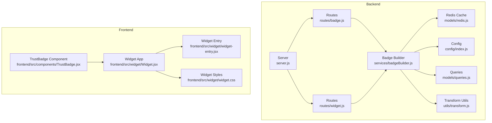
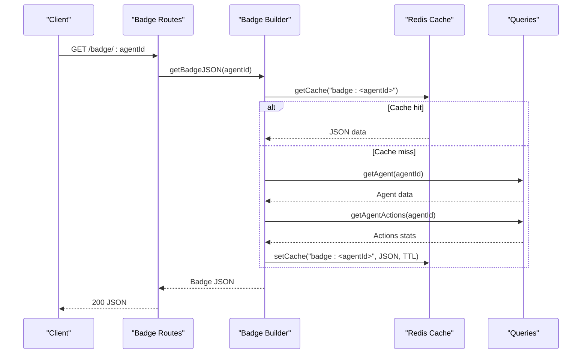
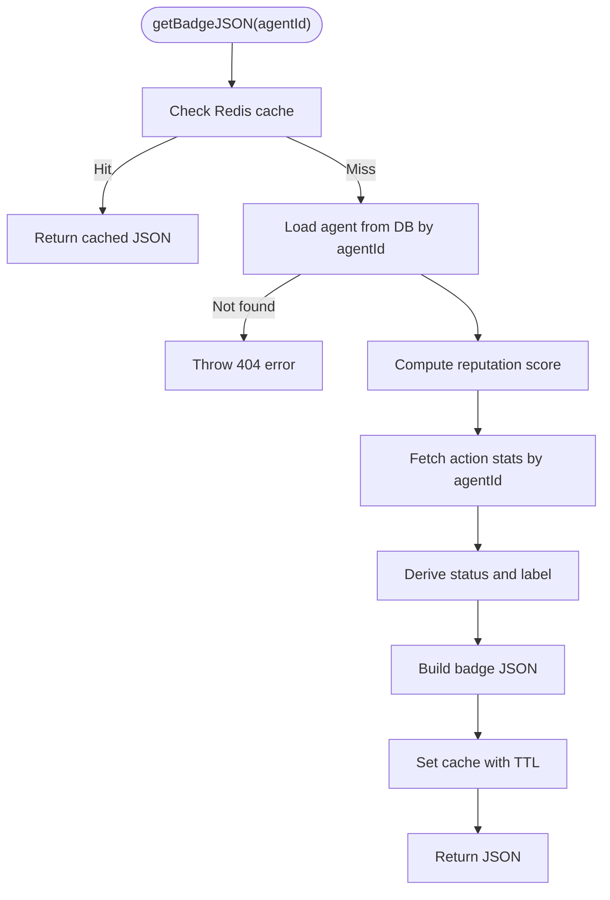
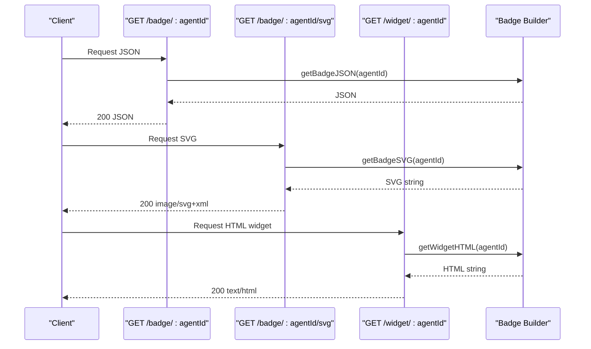
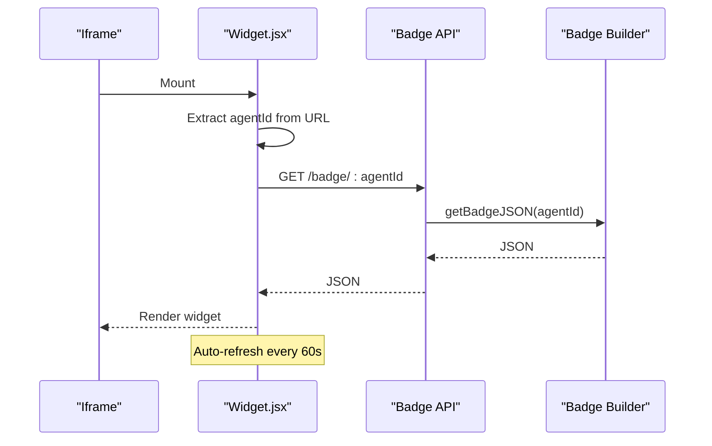
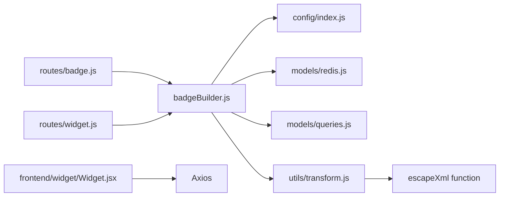

# Badge Services

<cite>
**Referenced Files in This Document**
- [backend/src/services/badgeBuilder.js](file://backend/src/services/badgeBuilder.js)
- [backend/src/routes/badge.js](file://backend/src/routes/badge.js)
- [backend/src/routes/widget.js](file://backend/src/routes/widget.js)
- [backend/src/models/redis.js](file://backend/src/models/redis.js)
- [backend/src/config/index.js](file://backend/src/config/index.js)
- [backend/src/utils/transform.js](file://backend/src/utils/transform.js)
- [backend/src/models/queries.js](file://backend/src/models/queries.js)
- [backend/server.js](file://backend/server.js)
- [frontend/src/components/TrustBadge.jsx](file://frontend/src/components/TrustBadge.jsx)
- [frontend/src/widget/Widget.jsx](file://frontend/src/widget/Widget.jsx)
- [frontend/src/widget/widget-entry.jsx](file://frontend/src/widget/widget-entry.jsx)
- [frontend/src/widget/widget.css](file://frontend/src/widget/widget.css)
- [agentid_build_plan.md](file://agentid_build_plan.md)
</cite>

## Update Summary
**Changes Made**
- Updated all references from `pubkey` to `agentId` throughout the badge service documentation
- Updated API endpoint documentation to reflect `/badge/:agentId` and `/widget/:agentId` routes
- Updated function signatures and parameter documentation to use `agentId` consistently
- Updated database query documentation to reflect UUID-based agent identification
- Updated frontend widget documentation to clarify URL parameter handling
- Enhanced security considerations to include UUID validation

## Table of Contents
1. [Introduction](#introduction)
2. [Project Structure](#project-structure)
3. [Core Components](#core-components)
4. [Architecture Overview](#architecture-overview)
5. [Detailed Component Analysis](#detailed-component-analysis)
6. [Dependency Analysis](#dependency-analysis)
7. [Performance Considerations](#performance-considerations)
8. [Troubleshooting Guide](#troubleshooting-guide)
9. [Conclusion](#conclusion)
10. [Appendices](#appendices)

## Introduction
This document explains the AgentID badge services that power trust badges, SVG generation, and widget rendering. The system has been refactored to use UUID-based agent identification throughout the entire pipeline, replacing the previous pubkey-based approach. It covers the badgeBuilder service, the rendering pipeline, caching strategies, configuration options, and integration with the widget system. It also addresses SVG optimization, accessibility, and responsive design patterns.

## Project Structure
The badge services span backend and frontend:
- Backend exposes badge JSON, SVG, and widget endpoints using agentId parameters and caches results.
- Frontend provides a React TrustBadge component and a standalone widget for embedding.

**Diagram sources**
- [backend/server.js:1-91](file://backend/server.js#L1-L91)
- [backend/src/routes/badge.js:1-58](file://backend/src/routes/badge.js#L1-L58)
- [backend/src/routes/widget.js:1-89](file://backend/src/routes/widget.js#L1-L89)
- [backend/src/services/badgeBuilder.js:1-552](file://backend/src/services/badgeBuilder.js#L1-L552)
- [backend/src/models/redis.js:1-94](file://backend/src/models/redis.js#L1-L94)
- [backend/src/config/index.js:1-34](file://backend/src/config/index.js#L1-L34)
- [backend/src/utils/transform.js:1-125](file://backend/src/utils/transform.js#L1-L125)
- [backend/src/models/queries.js:1-443](file://backend/src/models/queries.js#L1-L443)
- [frontend/src/components/TrustBadge.jsx:1-196](file://frontend/src/components/TrustBadge.jsx#L1-L196)
- [frontend/src/widget/Widget.jsx:1-218](file://frontend/src/widget/Widget.jsx#L1-L218)
- [frontend/src/widget/widget-entry.jsx:1-11](file://frontend/src/widget/widget-entry.jsx#L1-L11)
- [frontend/src/widget/widget.css:1-70](file://frontend/src/widget/widget.css#L1-L70)

**Section sources**
- [backend/server.js:1-91](file://backend/server.js#L1-L91)
- [agentid_build_plan.md:258-303](file://agentid_build_plan.md#L258-L303)

## Core Components
- Badge Builder service: Computes reputation, constructs badge JSON, generates SVG, and produces HTML widget using agentId parameters.
- Routes: Expose endpoints for badge JSON, SVG, and widget HTML using agentId path parameters.
- Redis cache: Stores badge JSON with TTL to reduce DB and computation overhead.
- Frontend TrustBadge: Renders a compact badge UI for the main app.
- Frontend Widget: Standalone embeddable widget with auto-refresh that extracts agentId from URL.

**Section sources**
- [backend/src/services/badgeBuilder.js:17-90](file://backend/src/services/badgeBuilder.js#L17-L90)
- [backend/src/routes/badge.js:16-32](file://backend/src/routes/badge.js#L16-L32)
- [backend/src/routes/widget.js:18-86](file://backend/src/routes/widget.js#L18-L86)
- [backend/src/models/redis.js:41-71](file://backend/src/models/redis.js#L41-L71)
- [frontend/src/components/TrustBadge.jsx:42-135](file://frontend/src/components/TrustBadge.jsx#L42-L135)
- [frontend/src/widget/Widget.jsx:61-215](file://frontend/src/widget/Widget.jsx#L61-L215)

## Architecture Overview
The badge pipeline now uses UUID-based agent identification:
- Request arrives at a route endpoint with agentId parameter.
- Route delegates to badgeBuilder service with agentId.
- badgeBuilder retrieves agent data by UUID, computes reputation, and constructs badge payload.
- Results are cached in Redis with TTL using agentId key.
- For SVG and widget, badgeBuilder generates markup and returns it to clients.

**Diagram sources**
- [backend/src/routes/badge.js:16-32](file://backend/src/routes/badge.js#L16-L32)
- [backend/src/services/badgeBuilder.js:17-90](file://backend/src/services/badgeBuilder.js#L17-L90)
- [backend/src/models/redis.js:41-71](file://backend/src/models/redis.js#L41-L71)

## Detailed Component Analysis

### Badge Builder Service
Responsibilities:
- Compute reputation and derive status using agentId.
- Build badge JSON with metadata and widget URL using agentId.
- Generate SVG with dynamic colors based on status.
- Produce HTML widget with theme-aware styling and auto-refresh.

Key behaviors:
- Status derivation: verified, flagged, or unverified based on agent status and reputation threshold.
- Color schemes: verified uses green tones, flagged uses red, unverified uses amber.
- SVG generation: uses inline gradients and status icons; score bar reflects normalized score.
- Widget HTML: themed CSS with glow effects, animated elements, and live refresh.
- **Security**: Both HTML and XML content is properly escaped to prevent XSS attacks.

**Diagram sources**
- [backend/src/services/badgeBuilder.js:17-90](file://backend/src/services/badgeBuilder.js#L17-L90)
- [backend/src/models/redis.js:41-71](file://backend/src/models/redis.js#L41-L71)

**Section sources**
- [backend/src/services/badgeBuilder.js:17-90](file://backend/src/services/badgeBuilder.js#L17-L90)
- [backend/src/services/badgeBuilder.js:97-214](file://backend/src/services/badgeBuilder.js#L97-L214)
- [backend/src/services/badgeBuilder.js:221-545](file://backend/src/services/badgeBuilder.js#L221-L545)

### Transform Utilities
The transform.js module provides shared utility functions for data transformation and security:
- **escapeHtml**: Escapes HTML special characters to prevent XSS in HTML contexts.
- **escapeXml**: Consolidated from badgeBuilder service for XML content security.
- Data transformation utilities for snake_case to camelCase conversion.
- Additional validation functions for Solana addresses.

**Section sources**
- [backend/src/utils/transform.js:78-101](file://backend/src/utils/transform.js#L78-L101)
- [backend/src/utils/transform.js:108-114](file://backend/src/utils/transform.js#L108-L114)

### Routes: Badge and Widget
- Badge routes:
  - GET /badge/:agentId returns badge JSON.
  - GET /badge/:agentId/svg returns SVG with appropriate content-type header.
- Widget route:
  - GET /widget/:agentId returns HTML widget page.
  - Validates agent existence and returns a simple error page if not found.

**Diagram sources**
- [backend/src/routes/badge.js:16-55](file://backend/src/routes/badge.js#L16-L55)
- [backend/src/routes/widget.js:18-86](file://backend/src/routes/widget.js#L18-L86)
- [backend/src/services/badgeBuilder.js:97-214](file://backend/src/services/badgeBuilder.js#L97-L214)
- [backend/src/services/badgeBuilder.js:221-545](file://backend/src/services/badgeBuilder.js#L221-L545)

**Section sources**
- [backend/src/routes/badge.js:16-55](file://backend/src/routes/badge.js#L16-L55)
- [backend/src/routes/widget.js:18-86](file://backend/src/routes/widget.js#L18-L86)

### Frontend TrustBadge Component
- Props: status, name, score, registeredAt, totalActions, className.
- Status-dependent styling: verified (green), flagged (red), unverified (amber).
- Renders status icon, label, agent name, and meta info (registered date, total actions).
- Uses CSS variables and Tailwind classes for theming.

**Section sources**
- [frontend/src/components/TrustBadge.jsx:42-135](file://frontend/src/components/TrustBadge.jsx#L42-L135)

### Frontend Widget Application
- Standalone React app embedded in an iframe.
- Extracts agentId from URL path: /widget/:agentId.
- Fetches badge JSON from the backend using agentId and renders a rich widget with:
  - Status icon and label.
  - Trust score with animated progress bar.
  - Stats grid (total actions, success rate, registered date, last verified).
  - Capability tags.
  - Footer with branding and live indicator.
- Auto-refreshes every 60 seconds.

**Diagram sources**
- [frontend/src/widget/Widget.jsx:73-102](file://frontend/src/widget/Widget.jsx#L73-L102)
- [backend/src/services/badgeBuilder.js:17-90](file://backend/src/services/badgeBuilder.js#L17-L90)

**Section sources**
- [frontend/src/widget/Widget.jsx:61-215](file://frontend/src/widget/Widget.jsx#L61-L215)
- [frontend/src/widget/widget-entry.jsx:1-11](file://frontend/src/widget/widget-entry.jsx#L1-L11)
- [frontend/src/widget/widget.css:1-70](file://frontend/src/widget/widget.css#L1-L70)

## Dependency Analysis
- badgeBuilder depends on:
  - queries (agent and actions retrieval by agentId).
  - reputation service (computeBagsScore).
  - redis cache (getCache/setCache).
  - config (base URL and cache TTL).
  - transform utilities (escapeHtml, escapeXml) for XSS prevention.
- Routes depend on badgeBuilder and apply rate limiting.
- Frontend widget depends on axios and environment-provided base URL.

**Diagram sources**
- [backend/src/services/badgeBuilder.js:6-10](file://backend/src/services/badgeBuilder.js#L6-L10)
- [backend/src/routes/badge.js:7-8](file://backend/src/routes/badge.js#L7-L8)
- [backend/src/routes/widget.js:7-10](file://backend/src/routes/widget.js#L7-L10)
- [frontend/src/widget/Widget.jsx:7-14](file://frontend/src/widget/Widget.jsx#L7-L14)

**Section sources**
- [backend/src/services/badgeBuilder.js:6-10](file://backend/src/services/badgeBuilder.js#L6-L10)
- [backend/src/routes/badge.js:7-8](file://backend/src/routes/badge.js#L7-L8)
- [backend/src/routes/widget.js:7-10](file://backend/src/routes/widget.js#L7-L10)
- [frontend/src/widget/Widget.jsx:7-14](file://frontend/src/widget/Widget.jsx#L7-L14)

## Performance Considerations
- Caching:
  - Badge JSON is cached with a configurable TTL to minimize repeated DB queries and reputation computations.
  - Redis is configured with retry strategy and offline queue to improve resilience.
- Rate limiting:
  - Routes apply default rate limiter to protect backend resources.
- Rendering:
  - SVG is generated server-side to offload client rendering.
  - Widget uses lightweight React and minimal DOM updates.
- Auto-refresh:
  - Widget refreshes every 60 seconds to keep data fresh without manual reloads.

**Section sources**
- [backend/src/models/redis.js:10-20](file://backend/src/models/redis.js#L10-L20)
- [backend/src/models/redis.js:41-71](file://backend/src/models/redis.js#L41-L71)
- [backend/src/config/index.js:26](file://backend/src/config/index.js#L26)
- [backend/src/routes/badge.js:8](file://backend/src/routes/badge.js#L8)
- [backend/src/routes/widget.js:9](file://backend/src/routes/widget.js#L9)
- [frontend/src/widget/Widget.jsx:99-102](file://frontend/src/widget/Widget.jsx#L99-L102)

## Troubleshooting Guide
Common issues and resolutions:
- Agent not found:
  - Badge JSON and SVG routes return 404 with structured error when agent does not exist.
  - Widget route returns a simple HTML error page with the agentId.
- Redis connectivity:
  - Redis client logs errors but does not crash; cache operations fall back gracefully.
- **Security vulnerabilities**:
  - Both HTML and XML content is now centrally managed through transform.js utilities to prevent XSS attacks.
  - escapeHtml is used for HTML content in widget templates.
  - escapeXml is used for XML content in SVG generation.
- Widget loading:
  - Widget displays a skeleton while loading and an error state if the API fails.
- **UUID validation**:
  - All endpoints now validate agentId format and return appropriate error responses.

**Section sources**
- [backend/src/routes/badge.js:24-31](file://backend/src/routes/badge.js#L24-L31)
- [backend/src/routes/badge.js:47-52](file://backend/src/routes/badge.js#L47-L52)
- [backend/src/routes/widget.js:24-77](file://backend/src/routes/widget.js#L24-L77)
- [backend/src/models/redis.js:27-30](file://backend/src/models/redis.js#L27-L30)
- [backend/src/utils/transform.js:78-101](file://backend/src/utils/transform.js#L78-L101)
- [backend/src/services/badgeBuilder.js:28-30](file://backend/src/services/badgeBuilder.js#L28-L30)
- [frontend/src/widget/Widget.jsx:115-145](file://frontend/src/widget/Widget.jsx#L115-L145)

## Conclusion
The badge services provide a robust, cache-backed pipeline for generating trust badges in JSON, SVG, and HTML widget formats. The system has been successfully refactored to use UUID-based agent identification throughout the entire pipeline, replacing the previous pubkey-based approach. They integrate seamlessly with the frontend TrustBadge component and the standalone widget, offering consistent theming, responsive design, and performance optimizations through caching and rate limiting. The centralized security utilities ensure comprehensive protection against XSS attacks across all badge generation contexts.

## Appendices

### Configuration Options
- Cache TTL: Controls how long badge JSON remains cached.
- Base URL: Used to construct widget URLs.
- Redis URL: Connection string for caching.
- CORS Origin: Controls which origins can access the API.
- Verified threshold: Minimum score required for verified tier.

**Section sources**
- [backend/src/config/index.js:6-31](file://backend/src/config/index.js#L6-L31)

### Badge Generation Workflows
- JSON workflow:
  - Route GET /badge/:agentId → badgeBuilder.getBadgeJSON → cache miss → DB queries → cache set → return JSON.
- SVG workflow:
  - Route GET /badge/:agentId/svg → badgeBuilder.getBadgeSVG → dynamic colors and SVG assembly → return SVG.
- Widget workflow:
  - Route GET /widget/:agentId → badgeBuilder.getWidgetHTML → themed HTML with live refresh → return HTML.

**Section sources**
- [backend/src/routes/badge.js:16-55](file://backend/src/routes/badge.js#L16-L55)
- [backend/src/routes/widget.js:18-86](file://backend/src/routes/widget.js#L18-L86)
- [backend/src/services/badgeBuilder.js:97-214](file://backend/src/services/badgeBuilder.js#L97-L214)
- [backend/src/services/badgeBuilder.js:221-545](file://backend/src/services/badgeBuilder.js#L221-L545)

### Customization and Branding
- Status-based theming:
  - Verified: green accents and background.
  - Flagged: red accents and background.
  - Unverified: amber accents and background.
- SVG customization:
  - Colors derived from status; score bar width scales with score.
- Widget customization:
  - Theme colors, glow effects, and typography controlled via CSS variables and inline styles.

**Section sources**
- [backend/src/services/badgeBuilder.js:40-53](file://backend/src/services/badgeBuilder.js#L40-L53)
- [backend/src/services/badgeBuilder.js:101-134](file://backend/src/services/badgeBuilder.js#L101-L134)
- [frontend/src/components/TrustBadge.jsx:3-40](file://frontend/src/components/TrustBadge.jsx#L3-L40)
- [frontend/src/widget/widget.css:3-25](file://frontend/src/widget/widget.css#L3-L25)

### Accessibility and Responsive Design
- Accessibility:
  - SVG uses semantic text elements and appropriate contrast.
  - Widget uses readable fonts and sufficient color contrast.
- Responsive:
  - Widget adapts to small screen sizes with flexible layout and reduced font sizes.
  - TrustBadge component truncates long names and uses responsive spacing.

**Section sources**
- [backend/src/services/badgeBuilder.js:136-208](file://backend/src/services/badgeBuilder.js#L136-L208)
- [frontend/src/components/TrustBadge.jsx:84-89](file://frontend/src/components/TrustBadge.jsx#L84-L89)
- [frontend/src/widget/Widget.jsx:150-214](file://frontend/src/widget/Widget.jsx#L150-L214)
- [frontend/src/widget/widget.css:33-55](file://frontend/src/widget/widget.css#L33-L55)

### Security Considerations
- XSS Prevention:
  - Centralized security utilities in transform.js provide consistent escaping across all badge generation contexts.
  - escapeHtml protects HTML content in widget templates.
  - escapeXml protects XML content in SVG generation.
  - Both functions handle edge cases including null/undefined inputs and non-string types.
- Input Validation:
  - UUID validation ensures only valid agent identifiers are processed.
  - Comprehensive test coverage validates escaping behavior for various input scenarios.

**Section sources**
- [backend/src/utils/transform.js:78-101](file://backend/src/utils/transform.js#L78-L101)
- [backend/src/utils/transform.js:108-114](file://backend/src/utils/transform.js#L108-L114)
- [backend/src/models/queries.js:36-39](file://backend/src/models/queries.js#L36-L39)