# Identity Services

<cite>
**Referenced Files in This Document**
- [server.js](file://backend/server.js)
- [config/index.js](file://backend/src/config/index.js)
- [services/saidBinding.js](file://backend/src/services/saidBinding.js)
- [services/bagsAuthVerifier.js](file://backend/src/services/bagsAuthVerifier.js)
- [services/bagsReputation.js](file://backend/src/services/bagsReputation.js)
- [routes/register.js](file://backend/src/routes/register.js)
- [routes/agents.js](file://backend/src/routes/agents.js)
- [models/db.js](file://backend/src/models/db.js)
- [models/redis.js](file://backend/src/models/redis.js)
- [models/queries.js](file://backend/src/models/queries.js)
- [models/migrate.js](file://backend/src/models/migrate.js)
- [utils/transform.js](file://backend/src/utils/transform.js)
- [middleware/errorHandler.js](file://backend/src/middleware/errorHandler.js)
- [middleware/rateLimit.js](file://backend/src/middleware/rateLimit.js)
- [package.json](file://backend/package.json)
</cite>

## Update Summary
**Changes Made**
- Updated database query layer documentation to reflect complete UUID-based operation system
- Added documentation for new backward compatibility functions (`getAgentByPubkey`, `getAgentsByOwner`)
- Updated data model documentation to show UUID primary keys and foreign key relationships
- Revised identity lifecycle management to reflect agent_id usage in internal operations
- Updated service integration patterns to show pubkey vs agent_id usage differences

## Table of Contents
1. [Introduction](#introduction)
2. [Project Structure](#project-structure)
3. [Core Components](#core-components)
4. [Architecture Overview](#architecture-overview)
5. [Detailed Component Analysis](#detailed-component-analysis)
6. [Dependency Analysis](#dependency-analysis)
7. [Performance Considerations](#performance-considerations)
8. [Troubleshooting Guide](#troubleshooting-guide)
9. [Conclusion](#conclusion)
10. [Appendices](#appendices)

## Introduction
This document describes the AgentID identity services with a focus on SAID protocol integration and identity binding. The system has been updated to use a complete UUID-based operation system internally while maintaining backward compatibility for external API endpoints. It explains how agents are registered, bound to SAID, and how trust scores are retrieved and integrated into the BAGS reputation computation. It also documents the identity lifecycle, data transformation patterns, error handling, configuration requirements, and performance considerations including caching.

## Project Structure
The backend is organized around layered concerns with a complete UUID-based internal operation system:
- Configuration and environment variables
- Middleware for security, rate limiting, and error handling
- Models for database and Redis with UUID-based query functions
- Services for external integrations (SAID, BAGS auth, reputation)
- Routes for API endpoints with backward compatibility
- Utilities for data transformation

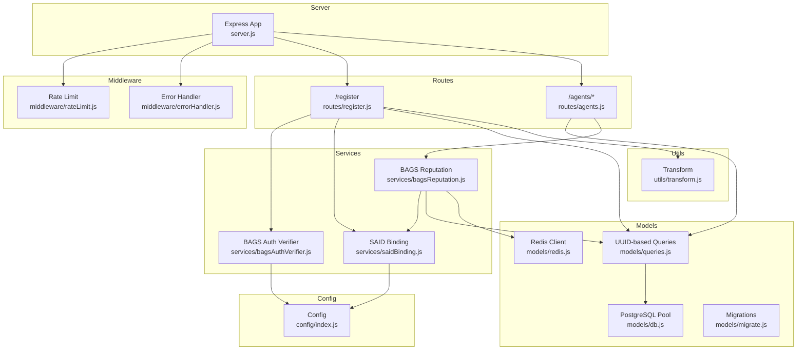

**Diagram sources**
- [server.js:1-85](file://backend/server.js#L1-L85)
- [middleware/rateLimit.js:1-62](file://backend/src/middleware/rateLimit.js#L1-L62)
- [middleware/errorHandler.js:1-44](file://backend/src/middleware/errorHandler.js#L1-L44)
- [routes/register.js:1-162](file://backend/src/routes/register.js#L1-L162)
- [routes/agents.js:1-277](file://backend/src/routes/agents.js#L1-L277)
- [services/saidBinding.js:1-119](file://backend/src/services/saidBinding.js#L1-L119)
- [services/bagsAuthVerifier.js:1-93](file://backend/src/services/bagsAuthVerifier.js#L1-L93)
- [services/bagsReputation.js:1-146](file://backend/src/services/bagsReputation.js#L1-L146)
- [models/db.js:1-71](file://backend/src/models/db.js#L1-L71)
- [models/queries.js:1-443](file://backend/src/models/queries.js#L1-L443)
- [models/redis.js:1-94](file://backend/src/models/redis.js#L1-L94)
- [models/migrate.js:1-101](file://backend/src/models/migrate.js#L1-L101)
- [utils/transform.js:1-125](file://backend/src/utils/transform.js#L1-L125)
- [config/index.js:1-31](file://backend/src/config/index.js#L1-L31)

**Section sources**
- [server.js:1-85](file://backend/server.js#L1-L85)
- [config/index.js:1-31](file://backend/src/config/index.js#L1-L31)

## Core Components
- **UUID-based Data Access Layer**: Complete transition to UUID primary keys with parameterized queries, migrations, and Redis caching utilities.
- **SAID Binding Service**: Integrates with the SAID Identity Gateway to register agents and fetch trust scores using pubkeys.
- **BAGS Auth Verifier**: Initializes and completes BAGS authentication challenges and verifies Ed25519 signatures.
- **BAGS Reputation Service**: Computes a composite reputation score using SAID trust and internal metrics.
- **Identity Routes**: Registration and agent management endpoints with signature verification, rate limits, and backward compatibility.
- **Transformation Utilities**: Normalize database field names to camelCase for API responses.

**Section sources**
- [models/queries.js:1-443](file://backend/src/models/queries.js#L1-L443)
- [services/saidBinding.js:1-119](file://backend/src/services/saidBinding.js#L1-L119)
- [services/bagsAuthVerifier.js:1-93](file://backend/src/services/bagsAuthVerifier.js#L1-L93)
- [services/bagsReputation.js:1-146](file://backend/src/services/bagsReputation.js#L1-L146)
- [routes/register.js:1-162](file://backend/src/routes/register.js#L1-L162)
- [routes/agents.js:1-277](file://backend/src/routes/agents.js#L1-L277)
- [utils/transform.js:1-125](file://backend/src/utils/transform.js#L1-L125)

## Architecture Overview
The system orchestrates identity registration and reputation computation across local storage, external APIs, and caching with a complete UUID-based internal operation system.

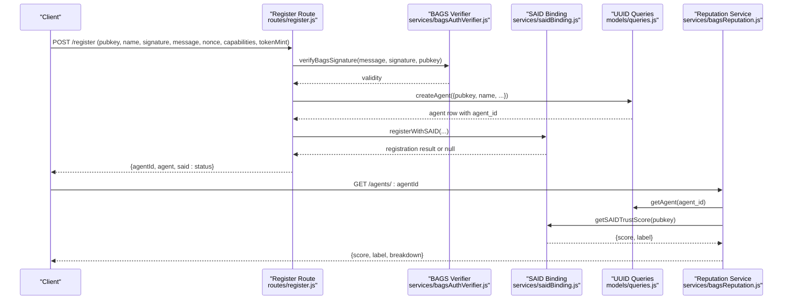

**Diagram sources**
- [routes/register.js:59-159](file://backend/src/routes/register.js#L59-L159)
- [services/bagsAuthVerifier.js:44-57](file://backend/src/services/bagsAuthVerifier.js#L44-L57)
- [models/queries.js:17-29](file://backend/src/models/queries.js#L17-L29)
- [services/saidBinding.js:21-54](file://backend/src/services/saidBinding.js#L21-L54)
- [services/bagsReputation.js:16-122](file://backend/src/services/bagsReputation.js#L16-L122)

## Detailed Component Analysis

### UUID-based Data Access Layer
**Updated** The data access layer has been completely restructured to use UUID-based operations internally while maintaining backward compatibility.

Responsibilities:
- **Primary Key Operations**: All internal queries use `agent_id` UUID as the primary identifier
- **Backward Compatibility**: Functions like `getAgentByPubkey` enable legacy pubkey-based operations
- **Multi-agent Support**: `getAgentsByOwner` handles wallets with multiple associated agents
- **Parameterized Queries**: All database operations use parameterized queries for security
- **Foreign Key Relationships**: Proper UUID foreign key constraints in verification and flag tables

Key functions:
- `getAgent(agentId)`: Retrieve agent by UUID (internal primary key)
- `getAgentByPubkey(pubkey)`: Backward compatibility for pubkey-based lookups
- `getAgentsByOwner(pubkey)`: Multi-agent wallet support
- `updateAgent(agentId, fields)`: Dynamic field updates using UUID
- `createAgent(data)`: Insert new agent with automatic UUID generation

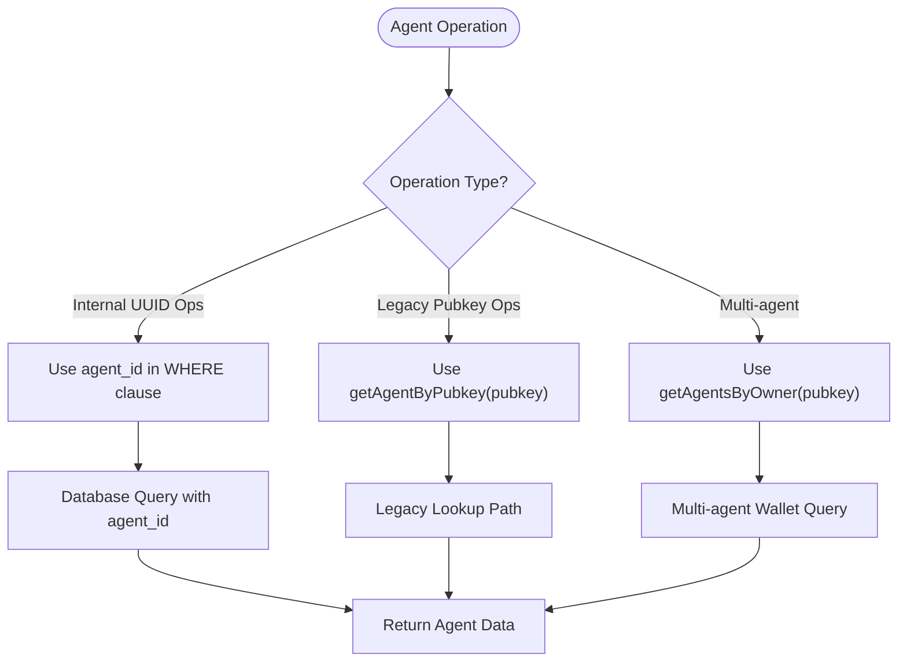

**Diagram sources**
- [models/queries.js:36-75](file://backend/src/models/queries.js#L36-L75)
- [models/queries.js:46-61](file://backend/src/models/queries.js#L46-L61)

**Section sources**
- [models/queries.js:1-443](file://backend/src/models/queries.js#L1-L443)
- [models/migrate.js:10-66](file://backend/src/models/migrate.js#L10-L66)

### SAID Binding Service
Responsibilities:
- Register agents with the SAID Identity Gateway, including capability sets and token mint metadata.
- Retrieve trust scores and labels for agents via SAID.
- Discover agents by capability through SAID.

Behavior highlights:
- Non-blocking SAID registration during agent creation.
- Graceful fallback returning null or default trust values on failure.
- Configurable endpoint and timeouts.

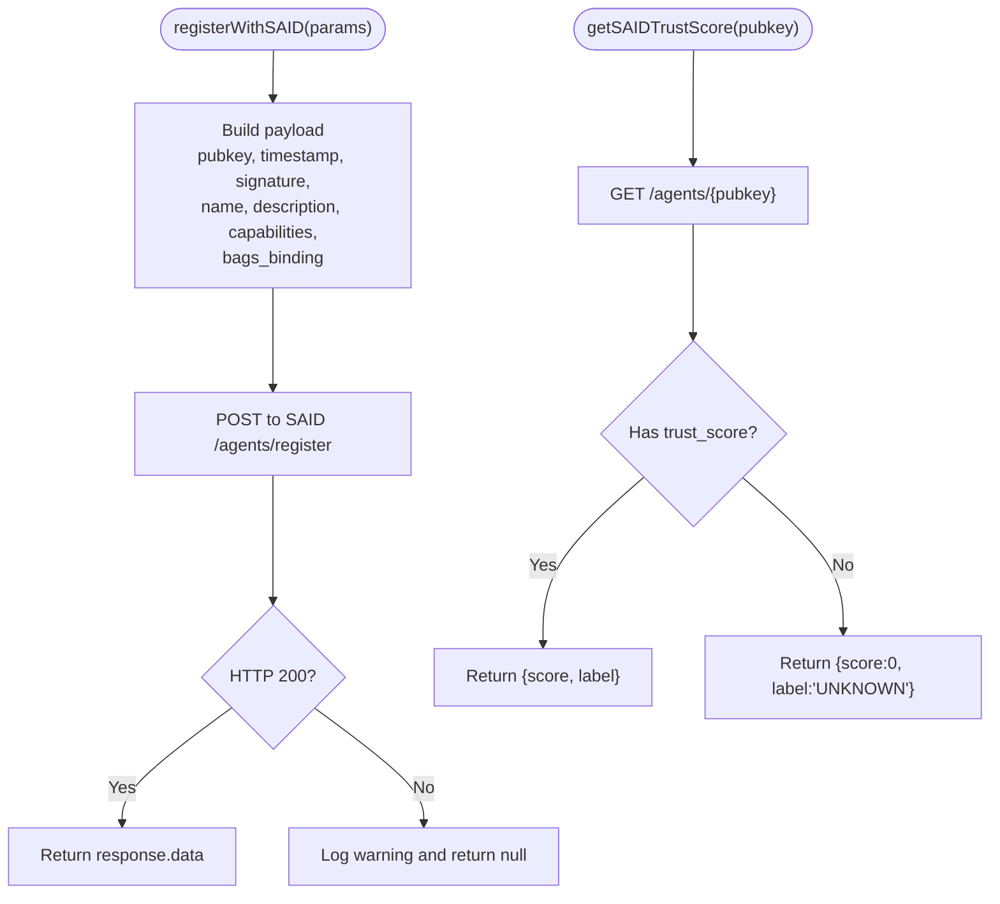

**Diagram sources**
- [services/saidBinding.js:21-87](file://backend/src/services/saidBinding.js#L21-L87)

**Section sources**
- [services/saidBinding.js:1-119](file://backend/src/services/saidBinding.js#L1-L119)
- [config/index.js:12-14](file://backend/src/config/index.js#L12-L14)

### BAGS Authentication Verifier
Responsibilities:
- Initialize BAGS auth challenge with a message and nonce.
- Verify Ed25519 signatures using base58-encoded inputs.
- Complete BAGS auth callback and obtain an API key reference.

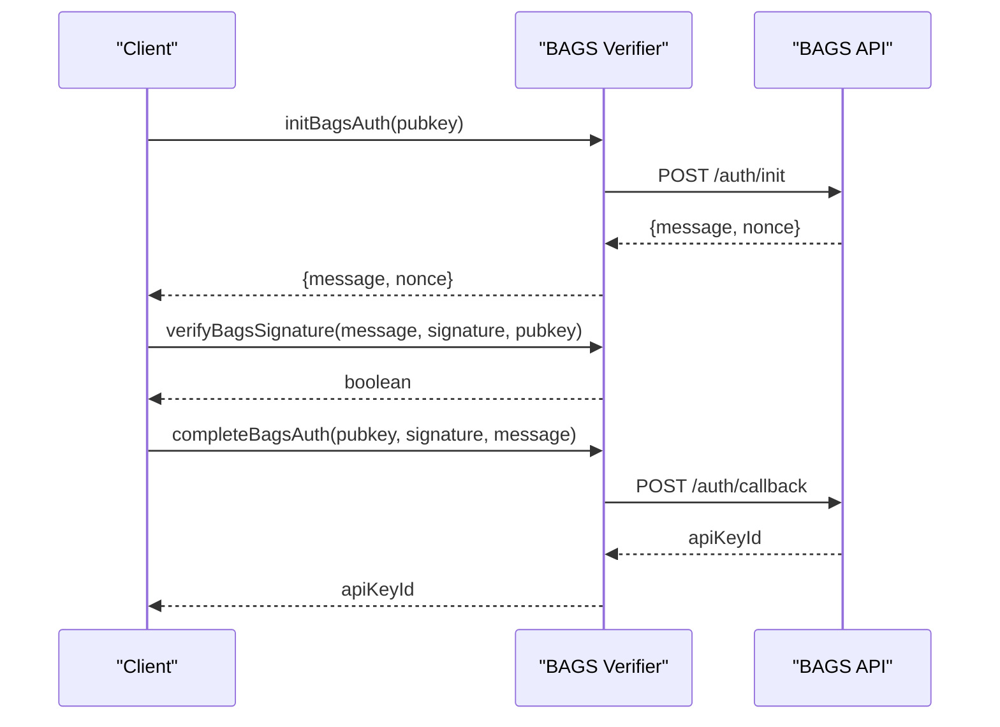

**Diagram sources**
- [services/bagsAuthVerifier.js:18-86](file://backend/src/services/bagsAuthVerifier.js#L18-L86)

**Section sources**
- [services/bagsAuthVerifier.js:1-93](file://backend/src/services/bagsAuthVerifier.js#L1-L93)
- [config/index.js:12](file://backend/src/config/index.js#L12)

### BAGS Reputation Service
Responsibilities:
- Compute a composite reputation score from multiple factors.
- Integrate SAID trust score into the reputation calculation.
- Persist the computed score back to the database using UUID operations.

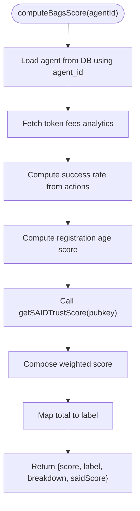

**Diagram sources**
- [services/bagsReputation.js:16-122](file://backend/src/services/bagsReputation.js#L16-L122)
- [services/saidBinding.js:61-87](file://backend/src/services/saidBinding.js#L61-L87)
- [models/queries.js:187-202](file://backend/src/models/queries.js#L187-L202)

**Section sources**
- [services/bagsReputation.js:1-146](file://backend/src/services/bagsReputation.js#L1-L146)
- [models/queries.js:17-29](file://backend/src/models/queries.js#L17-L29)

### Identity Lifecycle Management
**Updated** End-to-end flow for registration and updates with UUID-based internal operations:

- Registration validates inputs, verifies BAGS signature, optionally binds to SAID, and persists agent records with automatic UUID generation.
- Updates enforce signature verification and timestamp windows, then apply allowed field updates using UUID operations.
- Multi-agent wallet scenarios supported through owner-based queries.

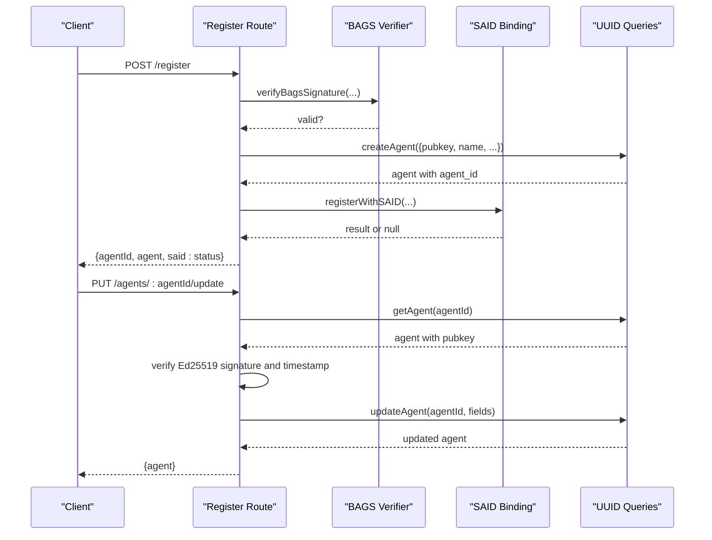

**Diagram sources**
- [routes/register.js:59-159](file://backend/src/routes/register.js#L59-L159)
- [routes/agents.js:144-274](file://backend/src/routes/agents.js#L144-L274)
- [services/bagsAuthVerifier.js:44-57](file://backend/src/services/bagsAuthVerifier.js#L44-L57)
- [services/saidBinding.js:21-54](file://backend/src/services/saidBinding.js#L21-L54)
- [models/queries.js:47-73](file://backend/src/models/queries.js#L47-L73)

**Section sources**
- [routes/register.js:1-162](file://backend/src/routes/register.js#L1-L162)
- [routes/agents.js:1-277](file://backend/src/routes/agents.js#L1-L277)
- [models/queries.js:1-443](file://backend/src/models/queries.js#L1-L443)

### Data Transformation Patterns
- Database rows use snake_case; API responses normalize to camelCase.
- capability_set is mapped to capabilities for frontend compatibility.
- agent_id is exposed as agentId in API responses for consistency.
- HTML escaping utilities are available for safe rendering.

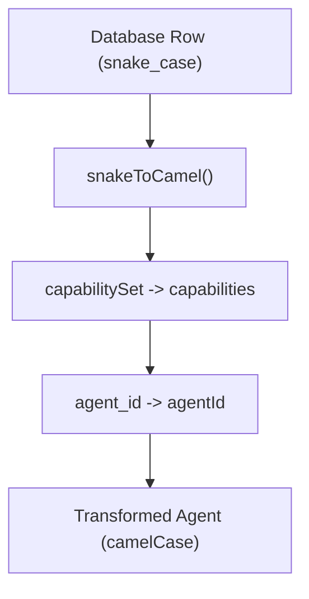

**Diagram sources**
- [utils/transform.js:44-61](file://backend/src/utils/transform.js#L44-L61)

**Section sources**
- [utils/transform.js:1-125](file://backend/src/utils/transform.js#L1-L125)

### Error Handling and Rate Limiting
- Centralized error handler logs structured errors and returns JSON responses.
- Rate limiting middleware applies stricter limits to auth endpoints.

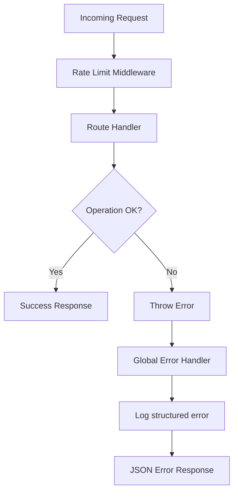

**Diagram sources**
- [middleware/errorHandler.js:15-41](file://backend/src/middleware/errorHandler.js#L15-L41)
- [middleware/rateLimit.js:23-55](file://backend/src/middleware/rateLimit.js#L23-L55)

**Section sources**
- [middleware/errorHandler.js:1-44](file://backend/src/middleware/errorHandler.js#L1-L44)
- [middleware/rateLimit.js:1-62](file://backend/src/middleware/rateLimit.js#L1-L62)

## Dependency Analysis
External dependencies include HTTP clients, cryptographic libraries, and database/Redis clients. The SAID and BAGS integrations rely on HTTP endpoints configured via environment variables.

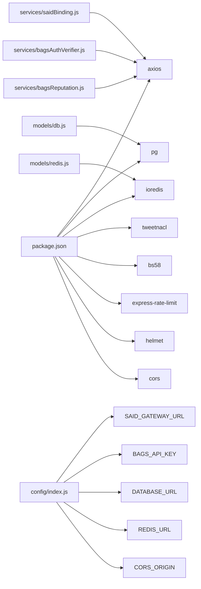

**Diagram sources**
- [package.json:18-30](file://backend/package.json#L18-L30)
- [config/index.js:12-27](file://backend/src/config/index.js#L12-L27)
- [services/saidBinding.js:6](file://backend/src/services/saidBinding.js#L6)
- [services/bagsAuthVerifier.js:6-9](file://backend/src/services/bagsAuthVerifier.js#L6-L9)
- [services/bagsReputation.js:6-9](file://backend/src/services/bagsReputation.js#L6-L9)
- [models/db.js:6-18](file://backend/src/models/db.js#L6-L18)
- [models/redis.js:6-20](file://backend/src/models/redis.js#L6-L20)

**Section sources**
- [package.json:1-35](file://backend/package.json#L1-L35)
- [config/index.js:1-31](file://backend/src/config/index.js#L1-L31)

## Performance Considerations
- Database pooling and SSL configuration for production stability.
- Redis client with retry strategy and offline queue to handle transient failures gracefully.
- Indexes on frequently queried columns to optimize listing and discovery.
- Caching TTL configuration for badges and challenge expirations.
- Timeout settings on external HTTP calls to avoid blocking.

Recommendations:
- Use Redis for short-lived caches (e.g., trust scores, discovery results) with TTL aligned to business needs.
- Apply circuit-breaker patterns around external APIs if latency increases.
- Batch or debounce discovery requests when feasible.
- Monitor rate-limit hits and adjust thresholds per deployment.
- **Updated** Leverage UUID primary keys for optimal database performance and foreign key relationships.

**Section sources**
- [models/db.js:10-18](file://backend/src/models/db.js#L10-L18)
- [models/redis.js:10-20](file://backend/src/models/redis.js#L10-L20)
- [models/migrate.js:58-64](file://backend/src/models/migrate.js#L58-L64)
- [config/index.js:25-27](file://backend/src/config/index.js#L25-L27)
- [services/saidBinding.js:45](file://backend/src/services/saidBinding.js#L45)
- [services/bagsAuthVerifier.js:27](file://backend/src/services/bagsAuthVerifier.js#L27)
- [services/bagsReputation.js:30](file://backend/src/services/bagsReputation.js#L30)

## Troubleshooting Guide
Common issues and resolutions:
- Missing environment variables: Ensure DATABASE_URL is set; the server validates required variables at startup.
- SAID registration returns null: The service logs a warning and continues; verify SAID gateway URL and network connectivity.
- SAID trust score unavailable: Returns default values; confirm SAID endpoint availability and response format.
- Signature verification fails: Validate base58 encoding and ensure the message includes the nonce.
- Rate limit exceeded: Adjust client-side retry delays or contact support for higher quotas.
- Redis connection errors: The client logs and continues; monitor connectivity and retry strategy.
- **Updated** UUID conversion issues: Ensure agent_id is properly handled in external API responses and transformations.

Operational checks:
- Health endpoint: GET /health to confirm service responsiveness.
- Database connectivity: Verify pool configuration and SSL settings in production.
- Redis health: Confirm connect/reconnect logs and cache operations.
- **Updated** Migration status: Verify UUID-based schema is properly migrated and indexed.

**Section sources**
- [server.js:3-10](file://backend/server.js#L3-L10)
- [services/saidBinding.js:50-53](file://backend/src/services/saidBinding.js#L50-L53)
- [services/saidBinding.js:83-86](file://backend/src/services/saidBinding.js#L83-L86)
- [services/bagsAuthVerifier.js:53-56](file://backend/src/services/bagsAuthVerifier.js#L53-L56)
- [middleware/rateLimit.js:37-41](file://backend/src/middleware/rateLimit.js#L37-L41)
- [models/redis.js:22-34](file://backend/src/models/redis.js#L22-L34)

## Conclusion
The AgentID identity services integrate tightly with SAID and BAGS to provide secure, verifiable agent identities with reputation scoring. The system has been enhanced with a complete UUID-based operation system that provides improved scalability, security, and maintainability while preserving backward compatibility. The design emphasizes resilience through graceful fallbacks, strict input validation, and robust error handling. With proper configuration and caching strategies, the system supports scalable identity lifecycle management and discovery.

## Appendices

### Configuration Requirements
Required environment variables:
- DATABASE_URL: PostgreSQL connection string
- SAID_GATEWAY_URL: SAID Identity Gateway base URL
- BAGS_API_KEY: API key for BAGS authentication
- REDIS_URL: Redis connection string
- AGENTID_BASE_URL: Base URL for AgentID services
- PORT, NODE_ENV: Server configuration
- CORS_ORIGIN: Allowed origin for cross-origin requests
- BADGE_CACHE_TTL, CHALLENGE_EXPIRY_SECONDS: Cache and expiry settings

Optional:
- Enable SSL for PostgreSQL in production via environment-dependent pool configuration.

**Section sources**
- [config/index.js:6-28](file://backend/src/config/index.js#L6-L28)
- [models/db.js:10-18](file://backend/src/models/db.js#L10-L18)

### Identity Binding Workflows
**Updated** Identity binding workflows with UUID-based internal operations:

- **Registration**:
  - Client sends pubkey, name, signature, message, nonce, capabilities, tokenMint.
  - Server verifies nonce presence, BAGS signature, and uniqueness.
  - Server creates agent record with automatic UUID generation and attempts SAID registration (non-blocking).
  - Response includes agentId, agent data, and SAID status.

- **Status Checking**:
  - Use GET /agents/:agentId to retrieve agent details and reputation using UUID.
  - Use GET /agents/owner/:pubkey to retrieve all agents owned by a wallet address.
  - Use GET /reputation/:agentId to fetch computed BAGS score and breakdown.

- **Discovery**:
  - Use GET /discover?capability={name} to list verified agents with matching capabilities.
  - Multi-agent wallet scenarios supported through owner-based queries.

**Section sources**
- [routes/register.js:59-159](file://backend/src/routes/register.js#L59-L159)
- [routes/agents.js:61-138](file://backend/src/routes/agents.js#L61-L138)
- [services/saidBinding.js:94-112](file://backend/src/services/saidBinding.js#L94-L112)

### Data Model Overview
**Updated** Core tables with UUID-based primary keys and foreign key relationships:

- **agent_identities**: Stores agent metadata with UUID primary key, capability sets, scores, and counters.
- **agent_verifications**: Challenge/nonce lifecycle for verification with UUID foreign key to agent_identities.
- **agent_flags**: Moderation reports and resolution tracking with UUID foreign key to agent_identities.
- **Indexes**: Optimized indexes on pubkey, status, bags_score, creator_wallet, and foreign key columns.

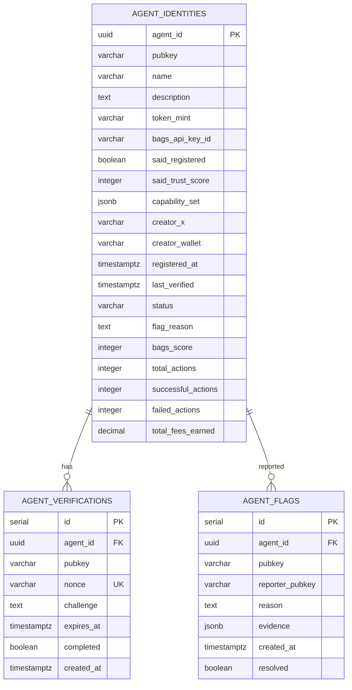

**Diagram sources**
- [models/migrate.js:10-66](file://backend/src/models/migrate.js#L10-L66)

**Section sources**
- [models/migrate.js:1-101](file://backend/src/models/migrate.js#L1-L101)
- [models/queries.js:1-443](file://backend/src/models/queries.js#L1-L443)