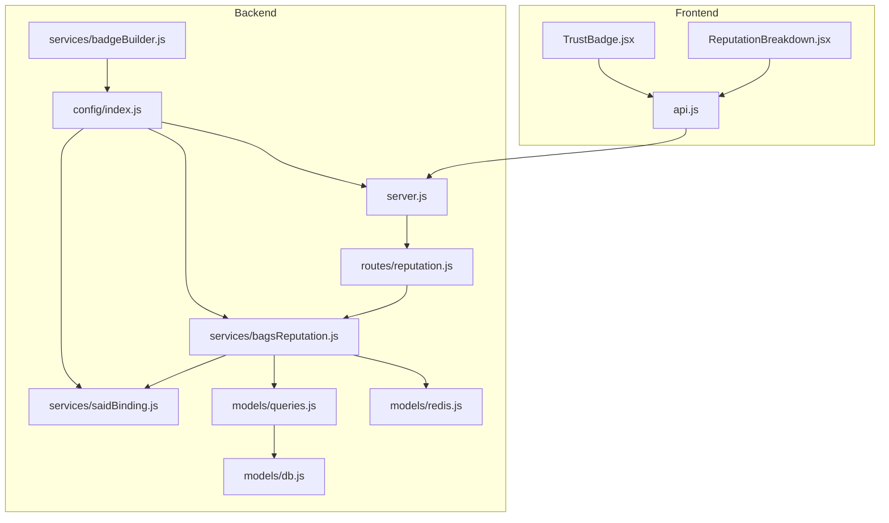
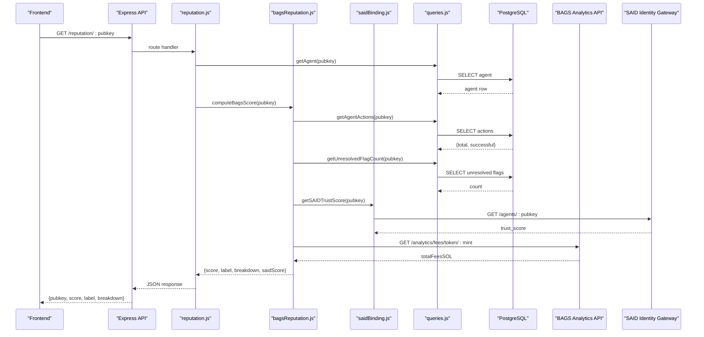
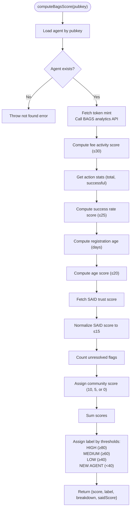
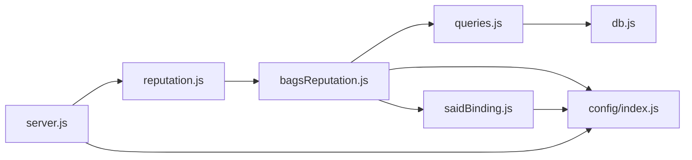

# Reputation Services

<cite>
**Referenced Files in This Document**
- [bagsReputation.js](file://backend/src/services/bagsReputation.js)
- [reputation.js](file://backend/src/routes/reputation.js)
- [queries.js](file://backend/src/models/queries.js)
- [config/index.js](file://backend/src/config/index.js)
- [db.js](file://backend/src/models/db.js)
- [redis.js](file://backend/src/models/redis.js)
- [migrate.js](file://backend/src/models/migrate.js)
- [saidBinding.js](file://backend/src/services/saidBinding.js)
- [server.js](file://backend/server.js)
- [ReputationBreakdown.jsx](file://frontend/src/components/ReputationBreakdown.jsx)
- [api.js](file://frontend/src/lib/api.js)
- [TrustBadge.jsx](file://frontend/src/components/TrustBadge.jsx)
- [badgeBuilder.js](file://backend/src/services/badgeBuilder.js)
</cite>

## Update Summary
**Changes Made**
- Updated label threshold documentation to reflect the change from "UNVERIFIED" to "NEW AGENT" for scores below 40
- Updated frontend label mapping to maintain consistency with backend changes
- Added new section documenting the positive user approach rationale for the label change
- Updated troubleshooting guide to include the new "NEW AGENT" label

## Table of Contents
1. [Introduction](#introduction)
2. [Project Structure](#project-structure)
3. [Core Components](#core-components)
4. [Architecture Overview](#architecture-overview)
5. [Detailed Component Analysis](#detailed-component-analysis)
6. [Dependency Analysis](#dependency-analysis)
7. [Performance Considerations](#performance-considerations)
8. [Troubleshooting Guide](#troubleshooting-guide)
9. [Conclusion](#conclusion)
10. [Appendices](#appendices)

## Introduction
This document describes the AgentID reputation services with a focus on the BAGS ecosystem scoring and trust evaluation algorithms. It explains how the 0–100 scale reputation score is computed from five weighted factors, how performance metrics integrate into the scoring, and how the reputation breakdown is generated. The system now uses a more positive approach by labeling agents with scores below 40 as "NEW AGENT" instead of "UNVERIFIED" to encourage new users. It also covers configuration options, caching strategies, integration patterns with external reputation APIs, and operational guidance for real-time updates and troubleshooting.

## Project Structure
The reputation service spans backend and frontend components:
- Backend services compute the BAGS score and expose it via a REST endpoint.
- Frontend components render the reputation breakdown and integrate with the backend API.
- Database stores agent metadata and action counters used in scoring.
- Redis provides optional caching for performance optimization.

**Diagram sources**
- [server.js:1-91](file://backend/server.js#L1-L91)
- [reputation.js:1-44](file://backend/src/routes/reputation.js#L1-L44)
- [bagsReputation.js:1-146](file://backend/src/services/bagsReputation.js#L1-L146)
- [saidBinding.js:1-119](file://backend/src/services/saidBinding.js#L1-L119)
- [queries.js:1-404](file://backend/src/models/queries.js#L1-L404)
- [db.js:1-45](file://backend/src/models/db.js#L1-L45)
- [redis.js:1-94](file://backend/src/models/redis.js#L1-L94)
- [config/index.js:1-34](file://backend/src/config/index.js#L1-L34)
- [ReputationBreakdown.jsx:1-165](file://frontend/src/components/ReputationBreakdown.jsx#L1-L165)
- [TrustBadge.jsx:1-280](file://frontend/src/components/TrustBadge.jsx#L1-L280)
- [api.js:1-140](file://frontend/src/lib/api.js#L1-L140)
- [badgeBuilder.js:40-82](file://backend/src/services/badgeBuilder.js#L40-L82)

**Section sources**
- [server.js:1-91](file://backend/server.js#L1-L91)
- [config/index.js:1-34](file://backend/src/config/index.js#L1-L34)

## Core Components
- Reputation computation service: computes a 0–100 score from five factors and returns a structured breakdown.
- Route handler: exposes GET /reputation/:pubkey returning the computed score and breakdown.
- Data access layer: provides agent data, action statistics, and flag counts.
- External integrations: BAGS analytics API for fee activity and SAID Identity Gateway for trust scores.
- Frontend renderer: displays the reputation breakdown with color-coded progress bars and labels.
- Badge builder: integrates reputation data into trust badges with tier classification.

Key responsibilities:
- Factor aggregation and normalization.
- Graceful degradation when external APIs are unavailable.
- Consistent labeling of scores into HIGH/MEDIUM/LOW/NEW AGENT tiers.
- Integration with discovery and listing endpoints that sort by bags_score.
- Positive user experience through encouraging "NEW AGENT" labeling.

**Section sources**
- [bagsReputation.js:16-122](file://backend/src/services/bagsReputation.js#L16-L122)
- [reputation.js:17-41](file://backend/src/routes/reputation.js#L17-L41)
- [queries.js:146-202](file://backend/src/models/queries.js#L146-L202)
- [queries.js:294-305](file://backend/src/models/queries.js#L294-L305)
- [saidBinding.js:61-87](file://backend/src/services/saidBinding.js#L61-L87)
- [badgeBuilder.js:40-82](file://backend/src/services/badgeBuilder.js#L40-L82)

## Architecture Overview
The reputation pipeline integrates internal and external data sources to produce a normalized score with a positive user approach.

**Diagram sources**
- [reputation.js:17-41](file://backend/src/routes/reputation.js#L17-L41)
- [bagsReputation.js:16-122](file://backend/src/services/bagsReputation.js#L16-L122)
- [saidBinding.js:61-87](file://backend/src/services/saidBinding.js#L61-L87)
- [queries.js:187-202](file://backend/src/models/queries.js#L187-L202)
- [queries.js:299-305](file://backend/src/models/queries.js#L299-L305)

## Detailed Component Analysis

### BAGS Reputation Service
Computes a 0–100 score from five factors:
- Fee Activity: up to 30 points based on total fees in SOL multiplied and floored.
- Success Rate: up to 25 points based on ratio of successful actions to total actions.
- Registration Age: up to 20 points based on days since registration.
- SAID Trust Score: up to 15 points derived from the SAID trust score (normalized to 0–100).
- Community Verification: up to 10 points, adjusted based on unresolved flag count.

Scoring logic:
- Each factor is computed independently and clamped to its maximum.
- Total score is the sum of all factors.
- Label is assigned based on thresholds: HIGH (≥80), MEDIUM (≥60), LOW (≥40), **NEW AGENT (<40)**.

**Updated** The label assignment now uses "NEW AGENT" instead of "UNVERIFIED" for scores below 40, reflecting a more positive approach to encourage new users in the BAGS ecosystem.

External API handling:
- Calls to BAGS analytics and SAID gateway are wrapped with timeouts and fallbacks to zero or default values when unavailable.

Storage:
- The computed score is stored in the agent record via updateBagsScore.

**Diagram sources**
- [bagsReputation.js:16-122](file://backend/src/services/bagsReputation.js#L16-L122)

**Section sources**
- [bagsReputation.js:16-122](file://backend/src/services/bagsReputation.js#L16-L122)
- [bagsReputation.js:129-140](file://backend/src/services/bagsReputation.js#L129-L140)

### Reputation Route Handler
- Validates agent existence before computing reputation.
- Delegates computation to the reputation service.
- Returns a JSON payload containing pubkey, score, label, and breakdown.

Security and limits:
- Uses a shared rate limiter middleware to protect endpoints.

**Section sources**
- [reputation.js:17-41](file://backend/src/routes/reputation.js#L17-L41)

### Data Access Layer
- Provides agent lookup, action statistics, and unresolved flag counts.
- Updates agent records including bags_score and action counters.
- Supports discovery and listing with sorting by bags_score.

Database schema highlights:
- agent_identities includes fields for bags_score, total_actions, successful_actions, failed_actions, and others used by the reputation service.

**Section sources**
- [queries.js:36-73](file://backend/src/models/queries.js#L36-L73)
- [queries.js:146-160](file://backend/src/models/queries.js#L146-L160)
- [queries.js:187-202](file://backend/src/models/queries.js#L187-L202)
- [queries.js:299-305](file://backend/src/models/queries.js#L299-L305)
- [migrate.js:11-34](file://backend/src/models/migrate.js#L11-L34)

### SAID Trust Score Integration
- Fetches trust score and label from the SAID Identity Gateway.
- Normalizes the score to contribute up to 15 points to the BAGS reputation.
- Handles unavailability gracefully by returning zero trust score.

**Section sources**
- [saidBinding.js:61-87](file://backend/src/services/saidBinding.js#L61-L87)
- [bagsReputation.js:65-75](file://backend/src/services/bagsReputation.js#L65-L75)

### Frontend Reputation Renderer
- Displays the reputation breakdown with color-coded bars and labels.
- Computes total score and label based on the breakdown.
- Uses gradient bars and glow effects to visualize contribution of each factor.
- **Updated** Now displays "NEW AGENT" label consistently with backend changes.

**Section sources**
- [ReputationBreakdown.jsx:46-144](file://frontend/src/components/ReputationBreakdown.jsx#L46-L144)

### Trust Badge Integration
- Integrates reputation data into trust badges with tier classification.
- Uses "NEW AGENT" label for low-scoring agents to encourage participation.
- Maintains consistent labeling across all UI components.

**Section sources**
- [TrustBadge.jsx:97-122](file://frontend/src/components/TrustBadge.jsx#L97-L122)
- [badgeBuilder.js:40-82](file://backend/src/services/badgeBuilder.js#L40-L82)

### API Client Integration
- Provides a convenience wrapper around the backend API.
- Exposes getReputation(pubkey) to fetch the reputation data for rendering.

**Section sources**
- [api.js:58-62](file://frontend/src/lib/api.js#L58-L62)

## Dependency Analysis
The reputation service depends on:
- Internal data access layer for agent and action metrics.
- External BAGS analytics API for fee activity.
- External SAID Identity Gateway for trust scores.
- Optional Redis cache for performance (not currently used in reputation computation).
- Express routing and rate limiting middleware.

**Diagram sources**
- [reputation.js:7-9](file://backend/src/routes/reputation.js#L7-L9)
- [bagsReputation.js:8-9](file://backend/src/services/bagsReputation.js#L8-L9)
- [saidBinding.js:7](file://backend/src/services/saidBinding.js#L7)
- [queries.js:6](file://backend/src/models/queries.js#L6)
- [db.js:7](file://backend/src/models/db.js#L7)
- [config/index.js:7](file://backend/src/config/index.js#L7)
- [server.js:24](file://backend/server.js#L24)

**Section sources**
- [server.js:20-27](file://backend/server.js#L20-L27)
- [config/index.js:6-28](file://backend/src/config/index.js#L6-L28)

## Performance Considerations
- External API timeouts: BAGS and SAID calls use timeouts to prevent blocking; failures default to zero points for those factors.
- Database queries: Parameterized queries prevent injection and leverage indexes on status and bags_score.
- Caching: Redis client is configured but not currently used in reputation computation. Consider adding cache keys for pubkey-based reputation data with TTL to reduce repeated computations and external API calls.
- Rate limiting: Applied at the route level to protect the API from abuse.
- Sorting and discovery: Listing and discovery endpoints sort by bags_score, enabling efficient front-end filtering and ranking.

Recommendations:
- Add Redis caching for reputation data keyed by pubkey with TTL aligned to badgeCacheTtl.
- Cache SAID trust score separately to minimize repeated calls.
- Batch refresh jobs can pre-compute scores for frequently accessed agents.

**Section sources**
- [bagsReputation.js:28-38](file://backend/src/services/bagsReputation.js#L28-L38)
- [bagsReputation.js:68-75](file://backend/src/services/bagsReputation.js#L68-L75)
- [redis.js:10-20](file://backend/src/models/redis.js#L10-L20)
- [config/index.js:25-27](file://backend/src/config/index.js#L25-L27)
- [queries.js:100-108](file://backend/src/models/queries.js#L100-L108)

## Troubleshooting Guide
Common issues and resolutions:
- Agent not found: Ensure the pubkey exists in agent_identities. The route handler returns a 404 if not found.
- Zero or low scores:
  - Fee Activity: Verify token_mint is set and BAGS API is reachable.
  - Success Rate: Confirm action counters are being incremented via incrementActions.
  - Registration Age: Check registered_at timestamp.
  - SAID Trust Score: Confirm SAID gateway is reachable and returns a trust_score.
  - Community Verification: Unresolved flags reduce score; verify flag resolution.
- External API failures: The service falls back to zero points for affected factors; monitor logs for warnings.
- Redis connectivity: Non-critical; service continues without cache.
- Real-time updates: The refreshAndStoreScore function updates bags_score in the database; ensure this is invoked when conditions change.
- **Updated** Label inconsistencies: Ensure both backend and frontend components use "NEW AGENT" for scores below 40.

Operational checks:
- Health endpoints: Use /health to verify service availability.
- SAID connectivity: The server performs a non-blocking health check on startup.

**Section sources**
- [reputation.js:22-28](file://backend/src/routes/reputation.js#L22-L28)
- [bagsReputation.js:20-22](file://backend/src/services/bagsReputation.js#L20-L22)
- [bagsReputation.js:35-38](file://backend/src/services/bagsReputation.js#L35-L38)
- [bagsReputation.js:72-75](file://backend/src/services/bagsReputation.js#L72-L75)
- [server.js:84-86](file://backend/server.js#L84-L86)

## Conclusion
The AgentID reputation service provides a robust, extensible framework for computing and exposing BAGS ecosystem trust scores. Its modular design separates concerns across routing, computation, data access, and external integrations, while gracefully handling external API failures. The recent enhancement of labeling agents with scores below 40 as "NEW AGENT" instead of "UNVERIFIED" reflects a more positive approach to encourage new users in the ecosystem. With optional caching and existing database indexes, the system can be tuned for performance and reliability. The frontend components offer a clear, visual representation of the reputation breakdown, aiding trust evaluation across the AgentID ecosystem.

## Appendices

### Scoring Factors and Weighting
- Fee Activity: up to 30 points (derived from total fees in SOL).
- Success Rate: up to 25 points (ratio of successful actions).
- Registration Age: up to 20 points (days since registration).
- SAID Trust Score: up to 15 points (normalized from external trust score).
- Community Verification: up to 10 points (adjusted by unresolved flags).

Total score is the sum of the five factors, capped at 100.

**Section sources**
- [bagsReputation.js:24-93](file://backend/src/services/bagsReputation.js#L24-L93)

### Label Thresholds
- HIGH: score ≥ 80
- MEDIUM: score ≥ 60
- LOW: score ≥ 40
- **NEW AGENT: score < 40**

**Updated** The label threshold now uses "NEW AGENT" for scores below 40, providing a more encouraging experience for new users in the BAGS ecosystem.

**Section sources**
- [bagsReputation.js:95-105](file://backend/src/services/bagsReputation.js#L95-L105)
- [ReputationBreakdown.jsx:62-67](file://frontend/src/components/ReputationBreakdown.jsx#L62-L67)

### Configuration Options
- External API URLs and keys: SAID gateway URL and BAGS API key.
- Database and Redis connections: connection strings and retry strategies.
- Cache TTL and challenge expiry: configurable for badges and verification.
- **New** Verified threshold: configurable threshold for determining verified vs standard tier.

Environment variables:
- DATABASE_URL, BAGS_API_KEY, SAID_GATEWAY_URL, AGENTID_BASE_URL, REDIS_URL, CORS_ORIGIN, BADGE_CACHE_TTL, CHALLENGE_EXPIRY_SECONDS, VERIFIED_THRESHOLD.

**Section sources**
- [config/index.js:6-28](file://backend/src/config/index.js#L6-L28)

### Data Model Overview
Key fields used by the reputation service:
- agent_identities: pubkey, bags_score, total_actions, successful_actions, failed_actions, registered_at, status.
- agent_flags: unresolved flag count influences community score.

Indexes:
- bags_score descending index supports efficient ranking and discovery.

**Section sources**
- [migrate.js:11-34](file://backend/src/models/migrate.js#L11-L34)
- [migrate.js:58-64](file://backend/src/models/migrate.js#L58-L64)
- [queries.js:146-160](file://backend/src/models/queries.js#L146-L160)
- [queries.js:187-202](file://backend/src/models/queries.js#L187-L202)
- [queries.js:299-305](file://backend/src/models/queries.js#L299-L305)

### Integration Patterns
- Frontend: Use getReputation(pubkey) to fetch and render the breakdown.
- Backend: Call computeBagsScore(pubkey) to compute and refresh scores.
- External APIs: Integrate BAGS analytics and SAID gateway with timeouts and fallbacks.
- **New** Positive User Experience: The "NEW AGENT" label encourages continued participation and learning in the BAGS ecosystem.

**Section sources**
- [api.js:58-62](file://frontend/src/lib/api.js#L58-L62)
- [bagsReputation.js:16-122](file://backend/src/services/bagsReputation.js#L16-L122)
- [saidBinding.js:61-87](file://backend/src/services/saidBinding.js#L61-L87)