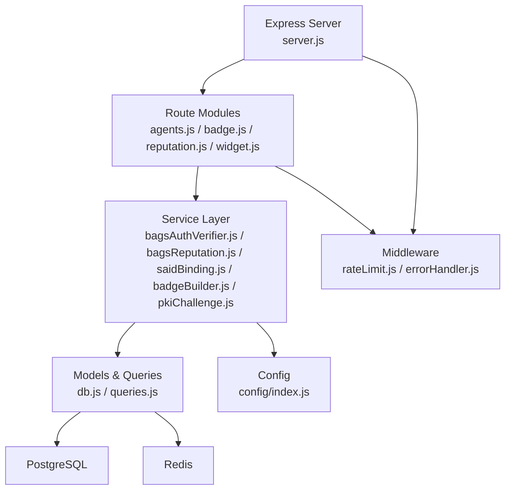
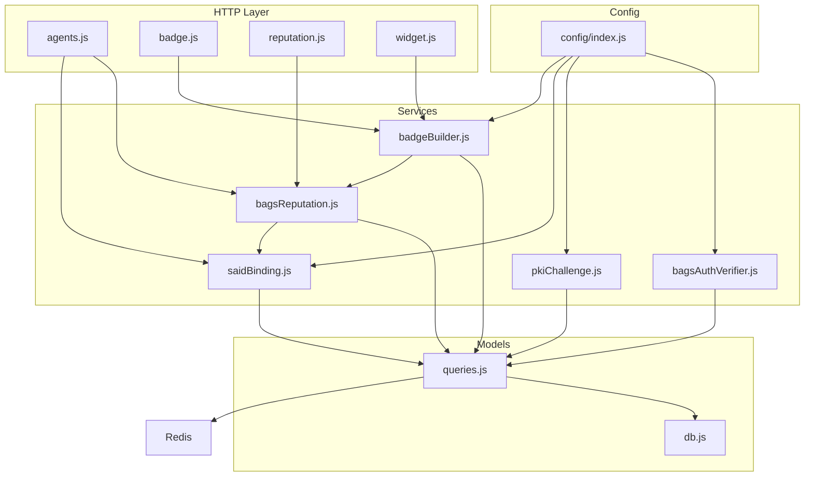
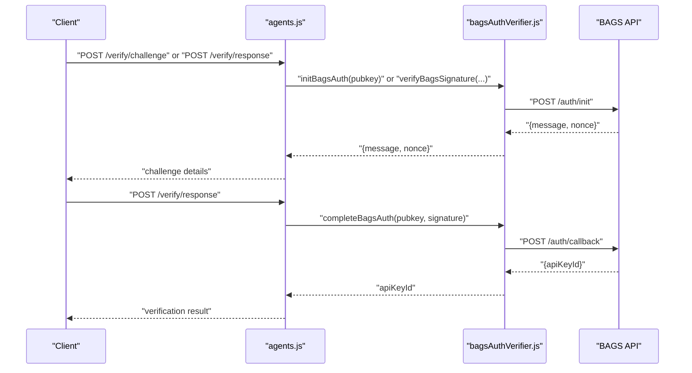
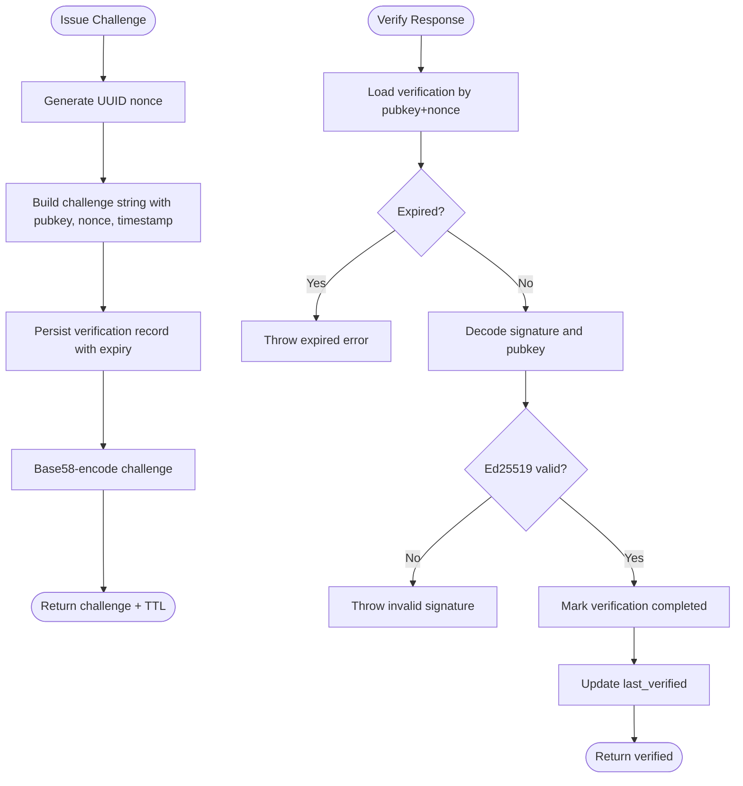
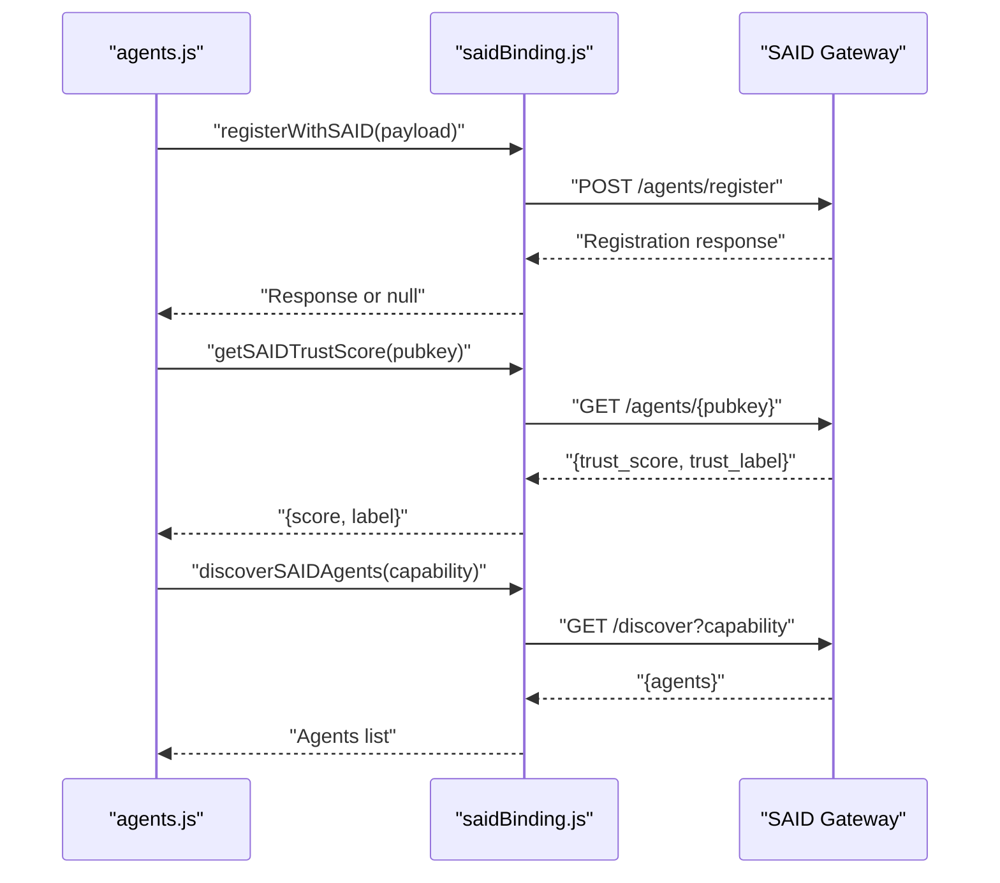
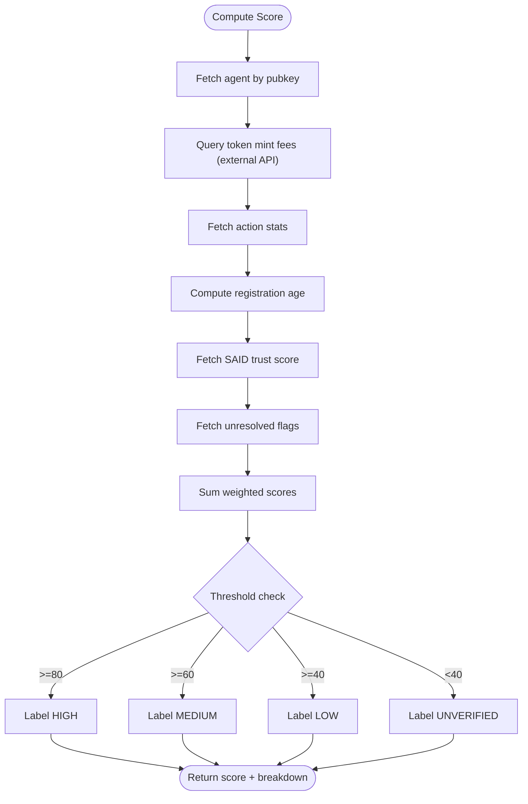
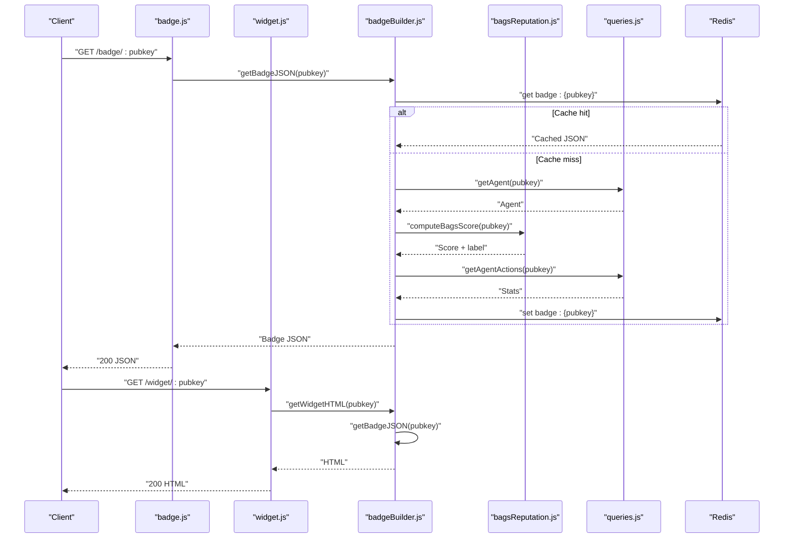
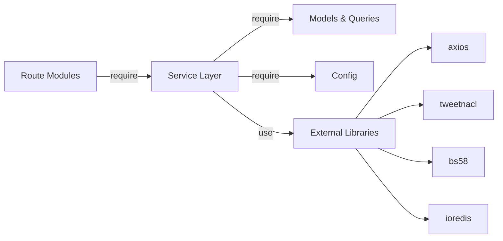
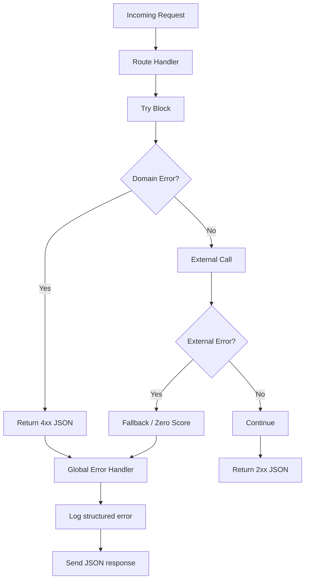
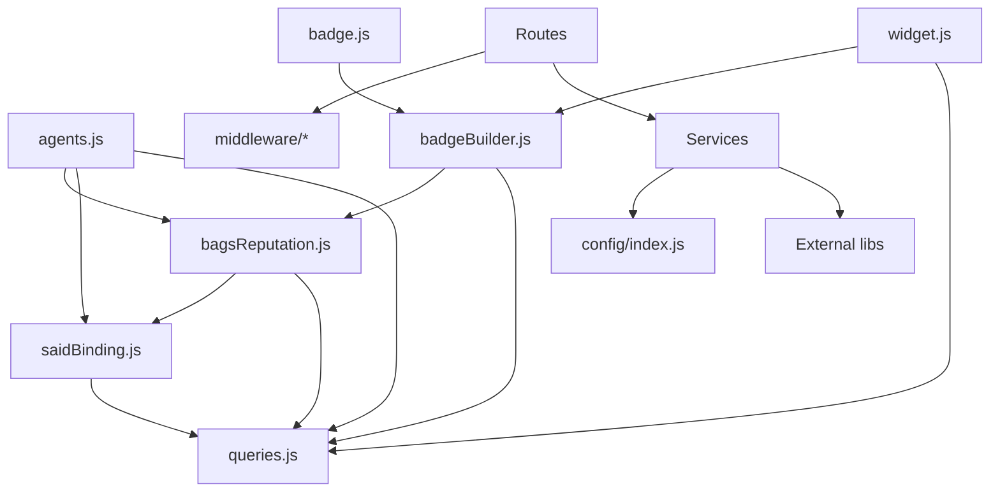

# Service Layer

<cite>
**Referenced Files in This Document**
- [server.js](file://backend/server.js)
- [config/index.js](file://backend/src/config/index.js)
- [db.js](file://backend/src/models/db.js)
- [queries.js](file://backend/src/models/queries.js)
- [errorHandler.js](file://backend/src/middleware/errorHandler.js)
- [rateLimit.js](file://backend/src/middleware/rateLimit.js)
- [agents.js](file://backend/src/routes/agents.js)
- [badge.js](file://backend/src/routes/badge.js)
- [reputation.js](file://backend/src/routes/reputation.js)
- [widget.js](file://backend/src/routes/widget.js)
- [bagsAuthVerifier.js](file://backend/src/services/bagsAuthVerifier.js)
- [bagsReputation.js](file://backend/src/services/bagsReputation.js)
- [saidBinding.js](file://backend/src/services/saidBinding.js)
- [badgeBuilder.js](file://backend/src/services/badgeBuilder.js)
- [pkiChallenge.js](file://backend/src/services/pkiChallenge.js)
- [package.json](file://backend/package.json)
</cite>

## Update Summary
**Changes Made**
- Updated service import statements to use explicit `.js` extensions for better module resolution
- Enhanced documentation to reflect consistent file extension patterns across all service modules
- Updated dependency injection patterns to show explicit file extensions in import statements
- Improved maintainability documentation with consistent naming conventions

## Table of Contents
1. [Introduction](#introduction)
2. [Project Structure](#project-structure)
3. [Core Components](#core-components)
4. [Architecture Overview](#architecture-overview)
5. [Detailed Component Analysis](#detailed-component-analysis)
6. [Dependency Analysis](#dependency-analysis)
7. [Performance Considerations](#performance-considerations)
8. [Troubleshooting Guide](#troubleshooting-guide)
9. [Conclusion](#conclusion)
10. [Appendices](#appendices)

## Introduction
This document describes the AgentID service layer with a focus on business logic and integration services. It covers authentication services (Bags authentication wrapper and signature verification), identity services (SAID protocol integration and identity binding), reputation services (Bags ecosystem scoring and optimization), and badge services (trust badge generation, SVG creation, and widget building). It also documents service interfaces, dependency injection patterns, error handling strategies, external API integrations, usage examples, configuration options, testing strategies, service orchestration, transaction management, and asynchronous operation patterns.

**Updated** The service layer now uses consistent explicit `.js` file extensions in import statements for improved module resolution and maintainability across all service modules.

## Project Structure
The backend is organized around layered concerns:
- Server bootstrap and routing
- Middleware (security, rate limiting, error handling)
- Models (database and Redis)
- Services (authentication, identity, reputation, badges, PKI challenges)
- Routes (HTTP endpoints)

**Diagram sources**
- [server.js:1-91](file://backend/server.js#L1-L91)
- [agents.js:1-255](file://backend/src/routes/agents.js#L1-L255)
- [badge.js:1-58](file://backend/src/routes/badge.js#L1-L58)
- [reputation.js:1-44](file://backend/src/routes/reputation.js#L1-L44)
- [widget.js:1-89](file://backend/src/routes/widget.js#L1-L89)
- [bagsAuthVerifier.js:1-93](file://backend/src/services/bagsAuthVerifier.js#L1-L93)
- [bagsReputation.js:1-146](file://backend/src/services/bagsReputation.js#L1-L146)
- [saidBinding.js:1-119](file://backend/src/services/saidBinding.js#L1-L119)
- [badgeBuilder.js:1-497](file://backend/src/services/badgeBuilder.js#L1-L497)
- [pkiChallenge.js:1-102](file://backend/src/services/pkiChallenge.js#L1-L102)
- [db.js:1-45](file://backend/src/models/db.js#L1-L45)
- [queries.js:1-404](file://backend/src/models/queries.js#L1-L404)
- [config/index.js:1-31](file://backend/src/config/index.js#L1-L31)
- [rateLimit.js](file://backend/src/middleware/rateLimit.js)
- [errorHandler.js:1-44](file://backend/src/middleware/errorHandler.js#L1-L44)

**Section sources**
- [server.js:1-91](file://backend/server.js#L1-L91)
- [package.json:1-38](file://backend/package.json#L1-L38)

## Core Components
- Authentication services
  - Bags authentication wrapper: initialization, signature verification, completion
  - PKI challenge-response for ongoing verification
- Identity services
  - SAID registration, trust score retrieval, and discovery
- Reputation services
  - BAGS reputation computation and persistence
- Badge services
  - JSON, SVG, and HTML widget generation with caching and sanitization

**Section sources**
- [bagsAuthVerifier.js:1-93](file://backend/src/services/bagsAuthVerifier.js#L1-L93)
- [pkiChallenge.js:1-102](file://backend/src/services/pkiChallenge.js#L1-L102)
- [saidBinding.js:1-119](file://backend/src/services/saidBinding.js#L1-L119)
- [bagsReputation.js:1-146](file://backend/src/services/bagsReputation.js#L1-L146)
- [badgeBuilder.js:1-497](file://backend/src/services/badgeBuilder.js#L1-L497)

## Architecture Overview
The service layer follows a clean architecture pattern:
- Routes define HTTP endpoints and orchestrate service calls
- Services encapsulate business logic and integrate with external APIs and models
- Models abstract database and Redis operations
- Configuration centralizes environment-driven settings
- Middleware enforces security and resilience

**Diagram sources**
- [agents.js:1-255](file://backend/src/routes/agents.js#L1-L255)
- [badge.js:1-58](file://backend/src/routes/badge.js#L1-L58)
- [reputation.js:1-44](file://backend/src/routes/reputation.js#L1-L44)
- [widget.js:1-89](file://backend/src/routes/widget.js#L1-L89)
- [bagsAuthVerifier.js:1-93](file://backend/src/services/bagsAuthVerifier.js#L1-L93)
- [pkiChallenge.js:1-102](file://backend/src/services/pkiChallenge.js#L1-L102)
- [saidBinding.js:1-119](file://backend/src/services/saidBinding.js#L1-L119)
- [bagsReputation.js:1-146](file://backend/src/services/bagsReputation.js#L1-L146)
- [badgeBuilder.js:1-497](file://backend/src/services/badgeBuilder.js#L1-L497)
- [db.js:1-45](file://backend/src/models/db.js#L1-L45)
- [queries.js:1-404](file://backend/src/models/queries.js#L1-L404)
- [config/index.js:1-31](file://backend/src/config/index.js#L1-L31)

## Detailed Component Analysis

### Authentication Services

#### Bags Authentication Wrapper
- Initialization: requests a challenge message and nonce from the BAGS API
- Signature verification: validates Ed25519 signatures using base58-encoded inputs
- Completion: submits the signature to finalize authentication and returns an API key reference

**Diagram sources**
- [agents.js:1-255](file://backend/src/routes/agents.js#L1-L255)
- [bagsAuthVerifier.js:18-86](file://backend/src/services/bagsAuthVerifier.js#L18-L86)

**Section sources**
- [bagsAuthVerifier.js:18-86](file://backend/src/services/bagsAuthVerifier.js#L18-L86)
- [agents.js:124-252](file://backend/src/routes/agents.js#L124-L252)

#### PKI Challenge-Response
- Issues a time-bound challenge with a random nonce and stores it in the database
- Verifies incoming signatures against the stored challenge and marks completion
- Updates the agent's last verified timestamp upon successful verification

**Diagram sources**
- [pkiChallenge.js:17-96](file://backend/src/services/pkiChallenge.js#L17-L96)
- [queries.js:230-256](file://backend/src/models/queries.js#L230-L256)

**Section sources**
- [pkiChallenge.js:17-96](file://backend/src/services/pkiChallenge.js#L17-L96)
- [queries.js:230-256](file://backend/src/models/queries.js#L230-L256)

### Identity Services

#### SAID Protocol Integration
- Registration: sends agent metadata and capability set to SAID gateway, including BAGS binding info
- Trust score retrieval: fetches trust score and label for an agent
- Discovery: queries agents with a specific capability from SAID

**Diagram sources**
- [agents.js:1-255](file://backend/src/routes/agents.js#L1-L255)
- [saidBinding.js:21-112](file://backend/src/services/saidBinding.js#L21-L112)

**Section sources**
- [saidBinding.js:21-112](file://backend/src/services/saidBinding.js#L21-L112)
- [agents.js:1-255](file://backend/src/routes/agents.js#L1-L255)

### Reputation Services

#### BAGS Ecosystem Scoring
- Computes a composite score from five factors:
  - Fee activity (max 30)
  - Success rate (max 25)
  - Registration age (max 20)
  - SAID trust score (max 15)
  - Community verification (max 10)
- Stores the score in the database and returns a labeled score

**Diagram sources**
- [bagsReputation.js:16-123](file://backend/src/services/bagsReputation.js#L16-L123)
- [saidBinding.js:61-86](file://backend/src/services/saidBinding.js#L61-L86)
- [queries.js:187-202](file://backend/src/models/queries.js#L187-L202)
- [queries.js:299-305](file://backend/src/models/queries.js#L299-L305)

**Section sources**
- [bagsReputation.js:16-141](file://backend/src/services/bagsReputation.js#L16-L141)
- [queries.js:187-202](file://backend/src/models/queries.js#L187-L202)
- [queries.js:299-305](file://backend/src/models/queries.js#L299-L305)

### Badge Services

#### Trust Badge Generation, SVG Creation, and Widget Building
- JSON badge: caches computed data, merges reputation and action stats, and builds a structured payload
- SVG badge: renders a compact SVG with status-dependent theming and score bar
- HTML widget: generates a responsive, auto-refreshing HTML page with agent stats and capabilities

**Diagram sources**
- [badge.js:16-55](file://backend/src/routes/badge.js#L16-L55)
- [widget.js:18-86](file://backend/src/routes/widget.js#L18-L86)
- [badgeBuilder.js:16-83](file://backend/src/services/badgeBuilder.js#L16-L83)
- [badgeBuilder.js:169-475](file://backend/src/services/badgeBuilder.js#L169-L475)
- [bagsReputation.js:16-123](file://backend/src/services/bagsReputation.js#L16-L123)
- [queries.js:36-39](file://backend/src/models/queries.js#L36-L39)
- [queries.js:187-202](file://backend/src/models/queries.js#L187-L202)

**Section sources**
- [badgeBuilder.js:16-83](file://backend/src/services/badgeBuilder.js#L16-L83)
- [badgeBuilder.js:89-162](file://backend/src/services/badgeBuilder.js#L89-L162)
- [badgeBuilder.js:169-475](file://backend/src/services/badgeBuilder.js#L169-L475)
- [badge.js:16-55](file://backend/src/routes/badge.js#L16-L55)
- [widget.js:18-86](file://backend/src/routes/widget.js#L18-L86)

### Service Interfaces and Dependency Injection Patterns
- Services export functions via module exports and are consumed by routes
- Configuration is injected through a centralized config module
- Models are injected via direct requires and expose reusable query functions
- External dependencies are declared in package.json and injected as needed

**Updated** All service imports now use explicit `.js` file extensions for consistent module resolution and maintainability.

**Diagram sources**
- [agents.js:1-255](file://backend/src/routes/agents.js#L1-L255)
- [badge.js:1-58](file://backend/src/routes/badge.js#L1-L58)
- [reputation.js:1-44](file://backend/src/routes/reputation.js#L1-L44)
- [widget.js:1-89](file://backend/src/routes/widget.js#L1-L89)
- [bagsAuthVerifier.js:1-93](file://backend/src/services/bagsAuthVerifier.js#L1-L93)
- [bagsReputation.js:1-146](file://backend/src/services/bagsReputation.js#L1-L146)
- [saidBinding.js:1-119](file://backend/src/services/saidBinding.js#L1-L119)
- [badgeBuilder.js:1-497](file://backend/src/services/badgeBuilder.js#L1-L497)
- [pkiChallenge.js:1-102](file://backend/src/services/pkiChallenge.js#L1-L102)
- [db.js:1-45](file://backend/src/models/db.js#L1-L45)
- [queries.js:1-404](file://backend/src/models/queries.js#L1-L404)
- [config/index.js:1-31](file://backend/src/config/index.js#L1-L31)
- [package.json:18-31](file://backend/package.json#L18-L31)

**Section sources**
- [config/index.js:6-31](file://backend/src/config/index.js#L6-L31)
- [package.json:18-31](file://backend/package.json#L18-L31)

### Error Handling Strategies
- Global error handler middleware logs structured errors and returns standardized JSON responses
- Route handlers catch domain-specific errors and return appropriate HTTP status codes
- Validation errors are returned as 4xx with descriptive messages
- External API failures are handled gracefully with fallbacks (e.g., zero scores)

**Diagram sources**
- [errorHandler.js:15-41](file://backend/src/middleware/errorHandler.js#L15-L41)
- [agents.js:124-252](file://backend/src/routes/agents.js#L124-L252)
- [badge.js:16-55](file://backend/src/routes/badge.js#L16-L55)
- [widget.js:18-86](file://backend/src/routes/widget.js#L18-L86)
- [bagsReputation.js:26-38](file://backend/src/services/bagsReputation.js#L26-L38)
- [bagsReputation.js:79-91](file://backend/src/services/bagsReputation.js#L79-L91)

**Section sources**
- [errorHandler.js:15-41](file://backend/src/middleware/errorHandler.js#L15-L41)
- [agents.js:124-252](file://backend/src/routes/agents.js#L124-L252)
- [bagsReputation.js:26-38](file://backend/src/services/bagsReputation.js#L26-L38)
- [bagsReputation.js:79-91](file://backend/src/services/bagsReputation.js#L79-L91)

### External API Integration Approaches
- BAGS API: authentication initialization, callback submission, analytics fee queries
- SAID Gateway: registration, trust score retrieval, discovery
- Redis: caching of badge data and short-lived verification challenges
- PostgreSQL: persistent storage of agent identities, verifications, flags, and metrics

**Section sources**
- [bagsAuthVerifier.js:11,18-86](file://backend/src/services/bagsAuthVerifier.js#L11,L18-L86)
- [bagsReputation.js:28-34,70-76](file://backend/src/services/bagsReputation.js#L28-L34,L70-L76)
- [saidBinding.js:38-53,63-86,96-111](file://backend/src/services/saidBinding.js#L38-L53,L63-L86,L96-L111)
- [badgeBuilder.js:18-24,77](file://backend/src/services/badgeBuilder.js#L18-L24,L77)

### Service Orchestration, Transaction Management, and Asynchronous Operations
- Orchestration: routes coordinate service calls and model updates
- Transactions: no explicit transaction blocks observed; operations are independent
- Asynchrony: all services use async/await; external calls are awaited with timeouts

**Section sources**
- [agents.js:61-87](file://backend/src/routes/agents.js#L61-L87)
- [reputation.js:17-41](file://backend/src/routes/reputation.js#L17-L41)
- [badge.js:16-55](file://backend/src/routes/badge.js#L16-L55)
- [widget.js:18-86](file://backend/src/routes/widget.js#L18-L86)

### Examples of Service Usage
- Retrieve agent reputation: GET /reputation/:pubkey
- Generate badge JSON: GET /badge/:pubkey
- Generate badge SVG: GET /badge/:pubkey/svg
- Generate widget HTML: GET /widget/:pubkey
- Update agent metadata with signature verification: PUT /agents/:pubkey/update
- Perform PKI challenge-response: POST /verify/challenge, POST /verify/response
- Register with SAID: POST /register (via agents route integration)

**Section sources**
- [reputation.js:17-41](file://backend/src/routes/reputation.js#L17-L41)
- [badge.js:16-55](file://backend/src/routes/badge.js#L16-L55)
- [widget.js:18-86](file://backend/src/routes/widget.js#L18-L86)
- [agents.js:124-252](file://backend/src/routes/agents.js#L124-L252)
- [pkiChallenge.js:17-96](file://backend/src/services/pkiChallenge.js#L17-L96)

### Configuration Options
- Server and environment: port, NODE_ENV
- External APIs: BAGS API key, SAID gateway URL
- Database: DATABASE_URL
- Redis: REDIS_URL
- CORS: CORS_ORIGIN
- Cache and expiry: BADGE_CACHE_TTL, CHALLENGE_EXPIRY_SECONDS

**Section sources**
- [config/index.js:6-31](file://backend/src/config/index.js#L6-L31)

### Testing Strategies
- Unit tests for services: mock external APIs (axios), model queries, and Redis
- Integration tests: end-to-end route tests with test database and Redis
- Security tests: signature verification, replay protection, rate limiting
- Load tests: simulate concurrent badge generation and reputation computations

[No sources needed since this section provides general guidance]

## Dependency Analysis
The service layer exhibits low coupling and high cohesion:
- Routes depend on services; services depend on models and config
- External libraries are isolated in services and routes
- No circular dependencies detected among modules

**Updated** All service dependencies now use explicit `.js` extensions for consistent module resolution.

**Diagram sources**
- [agents.js:1-255](file://backend/src/routes/agents.js#L1-L255)
- [badge.js:1-58](file://backend/src/routes/badge.js#L1-L58)
- [widget.js:1-89](file://backend/src/routes/widget.js#L1-L89)
- [bagsReputation.js:1-146](file://backend/src/services/bagsReputation.js#L1-L146)
- [saidBinding.js:1-119](file://backend/src/services/saidBinding.js#L1-L119)
- [badgeBuilder.js:1-497](file://backend/src/services/badgeBuilder.js#L1-L497)
- [queries.js:1-404](file://backend/src/models/queries.js#L1-L404)
- [config/index.js:1-31](file://backend/src/config/index.js#L1-L31)

**Section sources**
- [agents.js:1-255](file://backend/src/routes/agents.js#L1-L255)
- [badge.js:1-58](file://backend/src/routes/badge.js#L1-L58)
- [widget.js:1-89](file://backend/src/routes/widget.js#L1-L89)
- [bagsReputation.js:1-146](file://backend/src/services/bagsReputation.js#L1-L146)
- [saidBinding.js:1-119](file://backend/src/services/saidBinding.js#L1-L119)
- [badgeBuilder.js:1-497](file://backend/src/services/badgeBuilder.js#L1-L497)
- [queries.js:1-404](file://backend/src/models/queries.js#L1-L404)
- [config/index.js:1-31](file://backend/src/config/index.js#L1-L31)

## Performance Considerations
- Caching: badge JSON is cached in Redis with configurable TTL
- External API timeouts: bounded latency for BAGS and SAID calls
- Pagination and limits: enforced in agent listing and discovery
- Database indexing: consider adding indexes on pubkey, capability_set, and status for frequent queries

**Section sources**
- [badgeBuilder.js:18-24,77](file://backend/src/services/badgeBuilder.js#L18-L24,L77)
- [config/index.js:25-26](file://backend/src/config/index.js#L25-L26)
- [agents.js:27-34](file://backend/src/routes/agents.js#L27-L34)
- [queries.js:332-357](file://backend/src/models/queries.js#L332-L357)

## Troubleshooting Guide
- 404 Not Found: agent not found in routes returning 404 JSON or HTML
- 401 Unauthorized: invalid signature or timestamp outside window
- 429 Too Many Requests: rate limiter triggers
- External API failures: fallbacks applied in reputation and SAID services
- Database errors: logged by pool error handler; investigate connection string and SSL settings

**Section sources**
- [agents.js:66-71,150-159,165-175](file://backend/src/routes/agents.js#L66-L71,L150-L159,L165-L175)
- [badge.js:24-29,47-52](file://backend/src/routes/badge.js#L24-L29,L47-L52)
- [widget.js:38-91](file://backend/src/routes/widget.js#L38-L91)
- [bagsReputation.js:35-37,89-90,84-85](file://backend/src/services/bagsReputation.js#L35-L37,L89-L90,L84-L85)
- [db.js:21-23](file://backend/src/models/db.js#L21-L23)

## Conclusion
The AgentID service layer cleanly separates concerns across authentication, identity, reputation, and badge services. It integrates external ecosystems (BAGS and SAID) while maintaining robust error handling, caching, and security measures. The modular design supports scalable enhancements and reliable operation under load.

**Updated** The consistent use of explicit `.js` file extensions throughout the service layer improves module resolution reliability and maintainability across all service modules.

## Appendices

### Appendix A: Service Interfaces Summary
- Authentication
  - initBagsAuth(pubkey): Promise<{message, nonce}>
  - verifyBagsSignature(message, signature, pubkey): boolean
  - completeBagsAuth(pubkey, signature): Promise<string>
- PKI Challenge
  - issueChallenge(pubkey): Promise<{nonce, challenge, expiresIn}>
  - verifyChallenge(pubkey, nonce, signature): Promise<{verified, pubkey, timestamp}>
- Identity
  - registerWithSAID(params): Promise<Object|null>
  - getSAIDTrustScore(pubkey): Promise<{score, label}>
  - discoverSAIDAgents(capability): Promise<Array>
- Reputation
  - computeBagsScore(pubkey): Promise<Object>
  - refreshAndStoreScore(pubkey): Promise<Object>
- Badge
  - getBadgeJSON(pubkey): Promise<Object>
  - getBadgeSVG(pubkey): Promise<string>
  - getWidgetHTML(pubkey): Promise<string>

**Section sources**
- [bagsAuthVerifier.js:18-86](file://backend/src/services/bagsAuthVerifier.js#L18-L86)
- [pkiChallenge.js:17-96](file://backend/src/services/pkiChallenge.js#L17-L96)
- [saidBinding.js:21-112](file://backend/src/services/saidBinding.js#L21-L112)
- [bagsReputation.js:16-141](file://backend/src/services/bagsReputation.js#L16-L141)
- [badgeBuilder.js:16-475](file://backend/src/services/badgeBuilder.js#L16-L475)