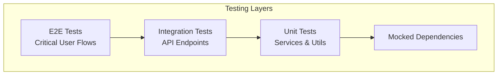
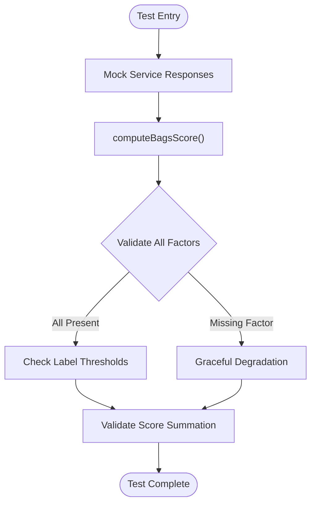
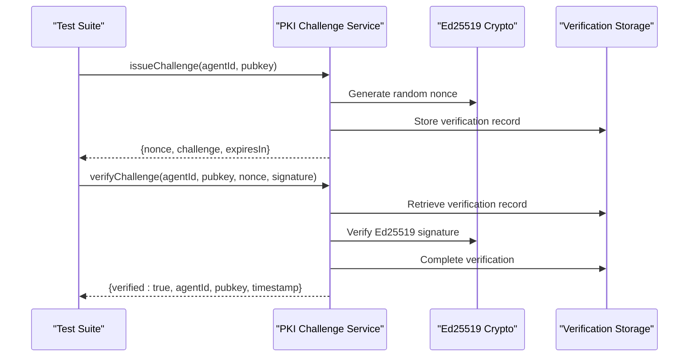
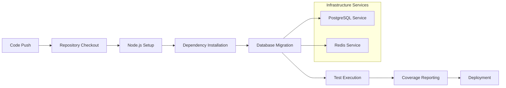

# Testing Strategy

<cite>
**Referenced Files in This Document**
- [Testing-Strategy.md](file://AgentID-wiki-temp/Testing-Strategy.md)
- [backend/tests/bagsReputation.test.js](file://backend/tests/bagsReputation.test.js)
- [backend/tests/pkiChallenge.test.js](file://backend/tests/pkiChallenge.test.js)
- [backend/tests/transform.test.js](file://backend/tests/transform.test.js)
- [backend/package.json](file://backend/package.json)
- [backend/src/models/__mocks__/db.js](file://backend/src/models/__mocks__/db.js)
- [backend/src/services/bagsAuthVerifier.js](file://backend/src/services/bagsAuthVerifier.js)
- [backend/src/services/pkiChallenge.js](file://backend/src/services/pkiChallenge.js)
- [backend/src/utils/transform.js](file://backend/src/utils/transform.js)
- [test-register.js](file://test-register.js)
- [docker-compose.yml](file://docker-compose.yml)
</cite>

## Table of Contents
1. [Introduction](#introduction)
2. [Testing Levels](#testing-levels)
3. [Unit Testing](#unit-testing)
4. [Integration Testing](#integration-testing)
5. [End-to-End Testing](#end-to-end-testing)
6. [Security Testing](#security-testing)
7. [Performance Testing](#performance-testing)
8. [Test Data Management](#test-data-management)
9. [Continuous Integration](#continuous-integration)
10. [Testing Infrastructure](#testing-infrastructure)
11. [Best Practices](#best-practices)

## Introduction

AgentID employs a comprehensive testing strategy designed to ensure reliability, security, and performance across all components. The testing framework covers unit tests for individual services and utilities, integration tests for API endpoints, and end-to-end tests for critical user flows. This multi-layered approach provides confidence in the system's stability while maintaining high standards for security verification and performance metrics.

The testing strategy focuses on three core areas: service-level verification for cryptographic operations, database integration testing, and comprehensive API endpoint validation. The framework leverages modern JavaScript testing tools including Jest for unit testing, Vitest for database mocking, and practical manual testing scripts for integration verification.

## Testing Levels

The testing pyramid follows a structured hierarchy from unit-level service testing to end-to-end user flow validation:

**Diagram sources**
- [Testing-Strategy.md:31-36](file://AgentID-wiki-temp/Testing-Strategy.md#L31-L36)

The testing approach ensures that each layer builds upon the previous one, with unit tests providing the foundation for reliable service behavior, integration tests validating API interactions, and end-to-end tests confirming complete user workflows.

## Unit Testing

### Service Tests

Unit testing focuses on individual service functions with comprehensive mocking of external dependencies. The current test suite demonstrates robust coverage of critical services including BAGS reputation scoring and PKI challenge verification.

#### BAGS Reputation Service Testing

The BAGS reputation service tests validate complex scoring logic across five distinct factors: fee activity, success rate, agent age, SAID trust score, and community flags. The testing strategy includes comprehensive scenarios for label thresholds (HIGH, MEDIUM, LOW, NEW AGENT) and graceful degradation handling during API failures.

**Diagram sources**
- [backend/tests/bagsReputation.test.js:36-105](file://backend/tests/bagsReputation.test.js#L36-L105)

#### PKI Challenge Service Testing

The PKI challenge service tests validate Ed25519 signature verification with comprehensive test scenarios including valid signatures, invalid signatures, and expired challenges. The testing framework generates real cryptographic key pairs for authentic validation scenarios.

**Diagram sources**
- [backend/tests/pkiChallenge.test.js:29-126](file://backend/tests/pkiChallenge.test.js#L29-L126)

**Section sources**
- [backend/tests/bagsReputation.test.js:1-290](file://backend/tests/bagsReputation.test.js#L1-L290)
- [backend/tests/pkiChallenge.test.js:1-182](file://backend/tests/pkiChallenge.test.js#L1-L182)

### Utility Function Testing

Utility function testing ensures proper data transformation and security validation. The transform utilities include snake_case to camelCase conversion, HTML escaping for XSS prevention, and Solana address validation.

**Section sources**
- [backend/tests/transform.test.js:1-181](file://backend/tests/transform.test.js#L1-L181)

## Integration Testing

### API Endpoint Testing

Integration testing validates complete API endpoint functionality through HTTP requests to the backend server. The testing strategy focuses on critical endpoints including registration, verification, and reputation services.

#### Registration Flow Testing

The registration flow testing validates the complete agent registration process from initial request through database persistence and response generation. Test scenarios include valid registration with proper cryptographic signatures and invalid input validation.

#### Verification Flow Testing

Verification flow testing encompasses both BAGS authentication and PKI challenge-response mechanisms. The testing framework validates challenge issuance, signature verification, and completion workflows.

### Database Integration Testing

Database integration testing ensures proper data persistence and retrieval across all service layers. The testing strategy includes transaction isolation, proper cleanup procedures, and realistic data seeding for comprehensive validation.

**Section sources**
- [Testing-Strategy.md:79-118](file://AgentID-wiki-temp/Testing-Strategy.md#L79-L118)

## End-to-End Testing

### Critical User Flows

End-to-end testing validates complete user journeys through the AgentID platform, focusing on three primary workflows:

#### Registration Flow
1. Navigate to registration page
2. Fill form with valid cryptographic credentials
3. Submit registration request
4. Verify agent creation and response validation

#### Verification Flow
1. Request challenge from verification endpoint
2. Generate Ed25519 signature using private key
3. Submit signed challenge response
4. Confirm verification completion and timestamp updates

#### Discovery Flow
1. Search for agents using various filters
2. Filter by capability and category criteria
3. View agent details and reputation scores
4. Validate badge generation and display

### E2E Tools and Frameworks

The testing strategy supports multiple end-to-end testing frameworks including Cypress for comprehensive browser automation and Playwright for cross-browser compatibility. These tools enable validation of frontend interactions, user interface responsiveness, and complete user journey automation.

**Section sources**
- [Testing-Strategy.md:119-143](file://AgentID-wiki-temp/Testing-Strategy.md#L119-L143)

## Security Testing

### Signature Verification Testing

Security testing focuses on cryptographic verification and threat mitigation. The testing framework validates Ed25519 signature verification, replay attack prevention, and proper error handling for invalid inputs.

#### Ed25519 Signature Validation

Signature validation testing includes comprehensive scenarios for legitimate signatures, tampered signatures, and malformed cryptographic inputs. The testing framework validates proper error propagation and security boundary enforcement.

#### Replay Attack Prevention

Replay attack testing ensures that challenge responses cannot be reused, with validation of nonce uniqueness and timestamp-based expiration mechanisms.

**Section sources**
- [Testing-Strategy.md:144-186](file://AgentID-wiki-temp/Testing-Strategy.md#L144-L186)

### Rate Limiting and DDoS Protection

Rate limiting validation ensures system resilience under high load conditions. The testing framework validates proper throttling mechanisms, error response codes (429), and resource protection strategies.

## Performance Testing

### Load Testing Strategy

Performance testing utilizes industry-standard tools like Artillery and k6 to validate system behavior under various load conditions. The testing strategy establishes specific performance targets for critical operations.

#### Performance Metrics Targets

- API response time: < 200ms (p95 percentile)
- Badge generation: < 100ms (with caching)
- Database query performance: < 50ms
- Concurrent user handling: Scales linearly with resource provisioning

#### Load Testing Scenarios

Load testing scenarios focus on peak usage periods, including high-volume registration flows, simultaneous verification requests, and concurrent discovery operations. The testing framework validates graceful degradation and error handling under stress conditions.

**Section sources**
- [Testing-Strategy.md:188-214](file://AgentID-wiki-temp/Testing-Strategy.md#L188-L214)

## Test Data Management

### Test Fixtures and Seeding

Comprehensive test data management ensures consistent and reliable testing across all scenarios. The testing framework includes standardized fixtures for valid and invalid test data, along with automated database seeding procedures.

#### Test Data Standards

Test fixtures define consistent data structures for agents, verifications, and reputation scores. The testing framework ensures data integrity across test runs and supports both positive and negative test scenarios.

#### Database Seeding Procedures

Automated database seeding procedures initialize test environments with realistic data distributions, including agent registration histories, verification records, and reputation metrics.

**Section sources**
- [Testing-Strategy.md:215-253](file://AgentID-wiki-temp/Testing-Strategy.md#L215-L253)

## Continuous Integration

### GitHub Actions Workflow

The continuous integration pipeline automates testing, deployment, and quality assurance processes. The workflow ensures comprehensive test coverage, proper environment setup, and reliable deployment validation.

#### CI/CD Pipeline Components

**Diagram sources**
- [Testing-Strategy.md:257-279](file://AgentID-wiki-temp/Testing-Strategy.md#L257-L279)

#### Coverage Requirements

The CI/CD pipeline enforces minimum coverage thresholds to maintain code quality and test reliability:
- Statements: 80%
- Branches: 75%
- Functions: 80%
- Lines: 80%

#### Pre-commit Validation

Pre-commit hooks ensure code quality before integration, including linting validation and staged test execution. This prevents problematic code from entering the main branch and maintains development velocity.

**Section sources**
- [Testing-Strategy.md:255-301](file://AgentID-wiki-temp/Testing-Strategy.md#L255-L301)

## Testing Infrastructure

### Database Mocking and Testing Environment

The testing infrastructure includes sophisticated database mocking capabilities and comprehensive service containers for realistic testing environments.

#### Database Mock Implementation

The database mocking system provides flexible query interception and response simulation, enabling rapid unit testing without external dependencies. The mock system supports query parameter validation and response customization.

#### Service Containerization

Docker Compose provides isolated testing environments with PostgreSQL and Redis services, ensuring consistent database and caching behavior across test executions. The containerized environment mirrors production configurations while enabling rapid setup and teardown.

**Section sources**
- [backend/src/models/__mocks__/db.js:1-13](file://backend/src/models/__mocks__/db.js#L1-L13)
- [docker-compose.yml:1-47](file://docker-compose.yml#L1-L47)

### Manual Testing Scripts

Manual testing scripts provide quick validation of critical workflows and integration points. These scripts enable rapid verification of complete user flows and system integration without extensive test framework overhead.

**Section sources**
- [test-register.js:1-73](file://test-register.js#L1-L73)

## Best Practices

### Test Organization and Structure

Effective test organization ensures maintainable and scalable testing infrastructure. The testing strategy emphasizes clear separation of concerns, comprehensive coverage validation, and automated quality gates.

### Security-First Testing Approach

Security testing is integrated throughout the testing strategy, with dedicated validation of cryptographic operations, input sanitization, and threat mitigation. This approach ensures security vulnerabilities are identified and addressed early in the development cycle.

### Performance-Oriented Testing

Performance testing is incorporated into the continuous integration pipeline, with automated validation of performance metrics and scalability characteristics. This ensures system performance remains optimal as new features are added.

### Cross-Platform Compatibility

Testing strategies account for cross-platform compatibility, with validation across different operating systems, browsers, and device types. This ensures consistent user experience regardless of deployment environment.