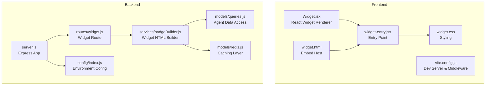
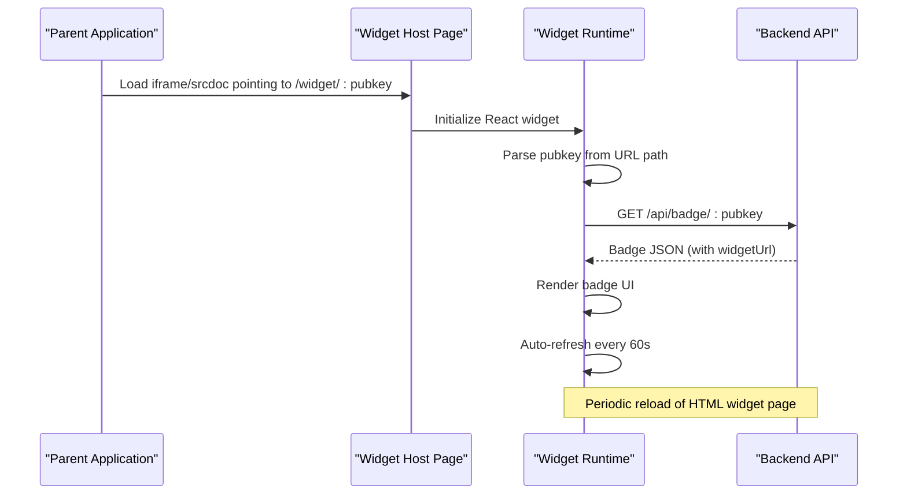
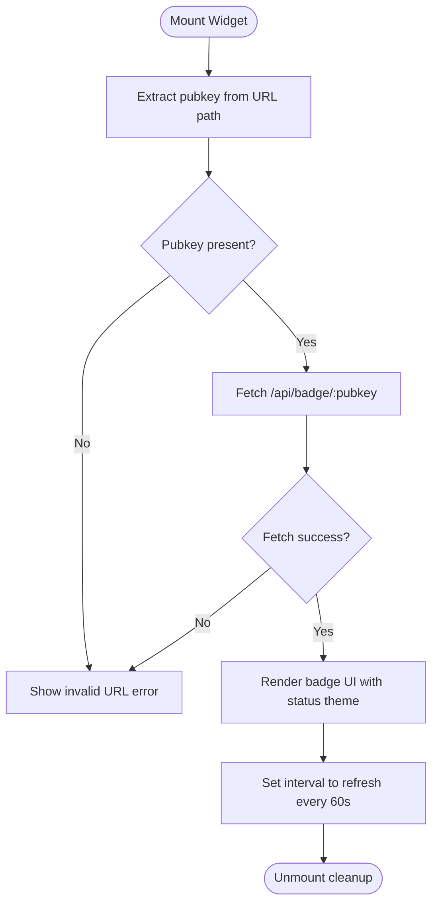
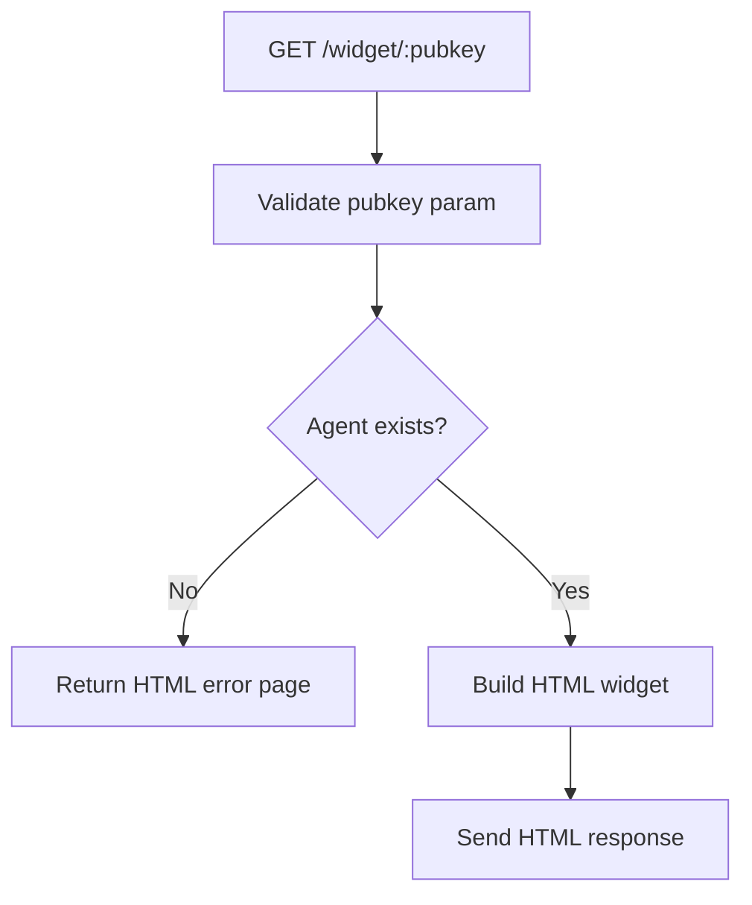
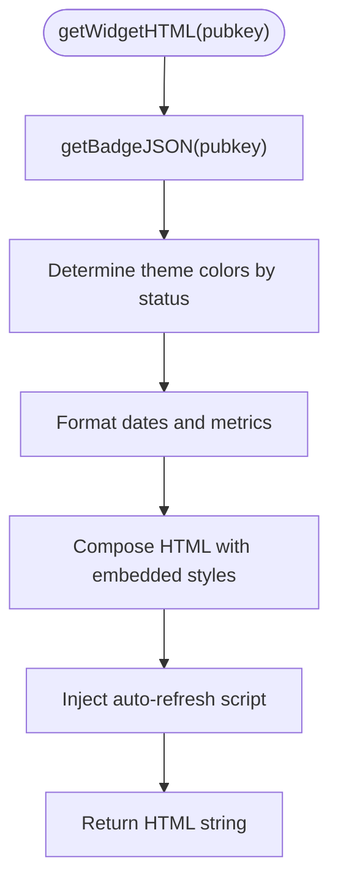
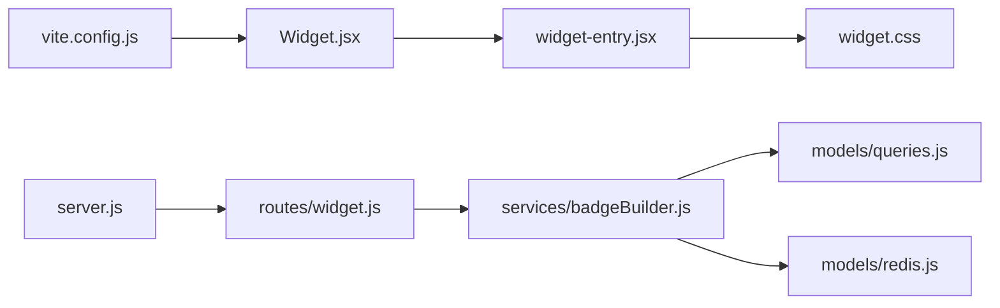

# Widget System

<cite>
**Referenced Files in This Document**
- [Widget.jsx](file://frontend/src/widget/Widget.jsx)
- [widget-entry.jsx](file://frontend/src/widget/widget-entry.jsx)
- [widget.css](file://frontend/src/widget/widget.css)
- [widget.html](file://frontend/widget.html)
- [widget.js](file://backend/src/routes/widget.js)
- [badgeBuilder.js](file://backend/src/services/badgeBuilder.js)
- [queries.js](file://backend/src/models/queries.js)
- [server.js](file://backend/server.js)
- [vite.config.js](file://frontend/vite.config.js)
- [config/index.js](file://backend/src/config/index.js)
- [redis.js](file://backend/src/models/redis.js)
- [TrustBadge.jsx](file://frontend/src/components/TrustBadge.jsx)
</cite>

## Table of Contents
1. [Introduction](#introduction)
2. [Project Structure](#project-structure)
3. [Core Components](#core-components)
4. [Architecture Overview](#architecture-overview)
5. [Detailed Component Analysis](#detailed-component-analysis)
6. [Dependency Analysis](#dependency-analysis)
7. [Performance Considerations](#performance-considerations)
8. [Troubleshooting Guide](#troubleshooting-guide)
9. [Conclusion](#conclusion)
10. [Appendices](#appendices)

## Introduction
This document describes the AgentID widget system with a focus on the embeddable trust badge functionality. It covers the standalone embeddable system, the widget rendering engine, and the communication protocols between the widget and parent applications. It also documents the integration process, customization options, styling guidelines, responsive behavior, URL structure, caching mechanisms, real-time update capabilities, and security considerations.

## Project Structure
The widget system spans both frontend and backend components:
- Frontend widget runtime: React-based embeddable badge renderer with Tailwind CSS styling.
- Backend widget endpoint: Express route that serves a complete HTML widget page for embedding.
- Caching and data pipeline: Redis-backed caching and PostgreSQL-backed agent data.
- Development server: Vite-based development server with a custom middleware to support widget routing.

**Diagram sources**
- [Widget.jsx:1-213](file://frontend/src/widget/Widget.jsx#L1-L213)
- [widget-entry.jsx:1-11](file://frontend/src/widget/widget-entry.jsx#L1-L11)
- [widget.css:1-70](file://frontend/src/widget/widget.css#L1-L70)
- [widget.html:1-16](file://frontend/widget.html#L1-L16)
- [vite.config.js:1-42](file://frontend/vite.config.js#L1-L42)
- [server.js:1-76](file://backend/server.js#L1-L76)
- [widget.js:1-103](file://backend/src/routes/widget.js#L1-L103)
- [badgeBuilder.js:1-512](file://backend/src/services/badgeBuilder.js#L1-L512)
- [queries.js:1-385](file://backend/src/models/queries.js#L1-L385)
- [config/index.js:1-30](file://backend/src/config/index.js#L1-L30)
- [redis.js:1-94](file://backend/src/models/redis.js#L1-L94)

**Section sources**
- [Widget.jsx:1-213](file://frontend/src/widget/Widget.jsx#L1-L213)
- [widget.js:1-103](file://backend/src/routes/widget.js#L1-L103)
- [badgeBuilder.js:1-512](file://backend/src/services/badgeBuilder.js#L1-L512)
- [vite.config.js:1-42](file://frontend/vite.config.js#L1-L42)
- [server.js:1-76](file://backend/server.js#L1-L76)

## Core Components
- Widget renderer (frontend): Parses the pubkey from the URL path, fetches badge data from the backend API, renders a responsive trust badge UI, and auto-refreshes periodically.
- Widget host page (frontend): Minimal HTML shell that loads the widget entry script and applies global styles.
- Widget route (backend): Validates the pubkey, checks agent existence, and returns a complete HTML widget page with embedded styles and auto-refresh logic.
- Widget HTML builder (backend): Generates the HTML widget content, computes theme colors based on status, and escapes HTML/XML to prevent XSS.
- Data access (backend): Provides agent queries, action statistics, and discovery helpers.
- Caching (backend): Redis-backed caching for badge JSON data with configurable TTL.
- Development server (frontend): Serves the widget host page for widget URLs and proxies API requests to the backend.

**Section sources**
- [Widget.jsx:56-97](file://frontend/src/widget/Widget.jsx#L56-L97)
- [widget.html:1-16](file://frontend/widget.html#L1-L16)
- [widget.js:32-96](file://backend/src/routes/widget.js#L32-L96)
- [badgeBuilder.js:169-475](file://backend/src/services/badgeBuilder.js#L169-L475)
- [queries.js:36-202](file://backend/src/models/queries.js#L36-L202)
- [redis.js:41-71](file://backend/src/models/redis.js#L41-L71)
- [vite.config.js:9-21](file://frontend/vite.config.js#L9-L21)

## Architecture Overview
The widget system operates as a standalone embeddable component that can be included in external websites via an iframe or direct HTML embedding. The frontend widget reads the pubkey from the URL path and requests badge data from the backend API. The backend responds with either a JSON payload (for programmatic consumption) or a complete HTML widget page (for iframe embedding). The HTML widget page includes embedded styles and JavaScript to auto-refresh every minute.

**Diagram sources**
- [Widget.jsx:62-97](file://frontend/src/widget/Widget.jsx#L62-L97)
- [widget.js:32-96](file://backend/src/routes/widget.js#L32-L96)
- [badgeBuilder.js:16-83](file://backend/src/services/badgeBuilder.js#L16-L83)

## Detailed Component Analysis

### Widget Renderer (Frontend)
The widget renderer is a React component that:
- Extracts the pubkey from the URL path.
- Fetches badge data from the backend API.
- Renders a responsive trust badge UI with status-specific theming.
- Implements a periodic auto-refresh mechanism.

**Diagram sources**
- [Widget.jsx:62-97](file://frontend/src/widget/Widget.jsx#L62-L97)

**Section sources**
- [Widget.jsx:56-210](file://frontend/src/widget/Widget.jsx#L56-L210)

### Widget Host Page (Frontend)
The widget host page provides a minimal HTML shell that:
- Loads the widget entry script.
- Connects to Google Fonts for typography.
- Ensures the root element is centered and styled appropriately.

**Section sources**
- [widget.html:1-16](file://frontend/widget.html#L1-L16)
- [widget-entry.jsx:1-11](file://frontend/src/widget/widget-entry.jsx#L1-L11)
- [widget.css:39-55](file://frontend/src/widget/widget.css#L39-L55)

### Widget Route (Backend)
The widget route:
- Validates the pubkey parameter.
- Checks agent existence via the data access layer.
- Returns a simple HTML error page if the agent is not found.
- Otherwise, generates and returns a complete HTML widget page.

**Diagram sources**
- [widget.js:32-96](file://backend/src/routes/widget.js#L32-L96)
- [queries.js:36-39](file://backend/src/models/queries.js#L36-L39)

**Section sources**
- [widget.js:32-100](file://backend/src/routes/widget.js#L32-L100)

### Widget HTML Builder (Backend)
The widget HTML builder:
- Computes badge data (including status, score, and metadata).
- Determines theme colors based on status.
- Generates a complete HTML page with embedded CSS and JavaScript.
- Includes auto-refresh logic to reload the page every 60 seconds.

**Diagram sources**
- [badgeBuilder.js:169-475](file://backend/src/services/badgeBuilder.js#L169-L475)

**Section sources**
- [badgeBuilder.js:169-475](file://backend/src/services/badgeBuilder.js#L169-L475)

### Data Access Layer (Backend)
The data access layer provides:
- Agent retrieval by pubkey.
- Action statistics aggregation.
- Capability set filtering for discovery.
- Safe parameterized queries to prevent SQL injection.

**Section sources**
- [queries.js:36-202](file://backend/src/models/queries.js#L36-L202)

### Caching Layer (Backend)
The caching layer:
- Uses Redis to cache badge JSON data.
- Applies a configurable TTL for cache entries.
- Handles connection errors gracefully without failing the request.

**Section sources**
- [redis.js:41-71](file://backend/src/models/redis.js#L41-L71)
- [config/index.js:24-26](file://backend/src/config/index.js#L24-L26)

### Development Server (Frontend)
The development server:
- Serves the widget host page for any URL under /widget/.
- Proxies API requests to the backend server.
- Builds both the main app and the widget bundle.

**Section sources**
- [vite.config.js:9-21](file://frontend/vite.config.js#L9-L21)
- [vite.config.js:23-30](file://frontend/vite.config.js#L23-L30)

### Backend Server (Production)
The backend server:
- Applies security middleware (Helmet).
- Configures CORS for the frontend origin.
- Exposes health check, rate limiting, and all API routes including the widget route.

**Section sources**
- [server.js:21-64](file://backend/server.js#L21-L64)
- [config/index.js:21-22](file://backend/src/config/index.js#L21-L22)

## Dependency Analysis
The widget system exhibits clear separation of concerns:
- Frontend widget depends on React and Tailwind CSS for rendering.
- Backend route depends on the widget HTML builder and data access layer.
- The widget HTML builder depends on the data access layer and Redis caching.
- The development server depends on Vite and a custom middleware to support widget routing.

**Diagram sources**
- [Widget.jsx:1-2](file://frontend/src/widget/Widget.jsx#L1-L2)
- [widget-entry.jsx:1-11](file://frontend/src/widget/widget-entry.jsx#L1-L11)
- [widget.css:1-70](file://frontend/src/widget/widget.css#L1-L70)
- [widget.js:1-103](file://backend/src/routes/widget.js#L1-L103)
- [badgeBuilder.js:1-512](file://backend/src/services/badgeBuilder.js#L1-L512)
- [queries.js:1-385](file://backend/src/models/queries.js#L1-L385)
- [redis.js:1-94](file://backend/src/models/redis.js#L1-L94)
- [vite.config.js:1-42](file://frontend/vite.config.js#L1-L42)
- [server.js:1-76](file://backend/server.js#L1-L76)

**Section sources**
- [Widget.jsx:1-2](file://frontend/src/widget/Widget.jsx#L1-L2)
- [widget.js:1-103](file://backend/src/routes/widget.js#L1-L103)
- [badgeBuilder.js:1-512](file://backend/src/services/badgeBuilder.js#L1-L512)
- [queries.js:1-385](file://backend/src/models/queries.js#L1-L385)
- [redis.js:1-94](file://backend/src/models/redis.js#L1-L94)
- [vite.config.js:1-42](file://frontend/vite.config.js#L1-L42)
- [server.js:1-76](file://backend/server.js#L1-L76)

## Performance Considerations
- Caching: Badge JSON data is cached in Redis with a configurable TTL to reduce database load and API latency.
- Auto-refresh: The frontend widget auto-refreshes every 60 seconds, balancing freshness with network usage.
- Embedded HTML widget: The backend-generated HTML widget includes embedded styles and a small auto-refresh script, minimizing external dependencies.
- Database queries: Parameterized queries prevent SQL injection and improve query plan reuse.
- Development server: The Vite middleware ensures efficient local development without unnecessary rebuilds.

[No sources needed since this section provides general guidance]

## Troubleshooting Guide
Common issues and resolutions:
- Invalid widget URL: The widget renderer displays an error if the pubkey is missing from the URL path.
- Agent not found: The backend route returns a dedicated HTML error page when the agent does not exist.
- Network errors: The widget renderer catches fetch errors and displays a user-friendly message.
- CORS issues: Ensure the backend CORS origin matches the frontend origin configured in environment variables.
- Redis connectivity: Redis errors are logged but do not fail requests; the system continues to operate with reduced performance.

**Section sources**
- [Widget.jsx:70-88](file://frontend/src/widget/Widget.jsx#L70-L88)
- [widget.js:38-91](file://backend/src/routes/widget.js#L38-L91)
- [server.js:24-28](file://backend/server.js#L24-L28)
- [redis.js:27-30](file://backend/src/models/redis.js#L27-L30)

## Conclusion
The AgentID widget system provides a robust, embeddable trust badge solution. It combines a lightweight frontend React renderer with a backend route that generates a complete HTML widget page. The system emphasizes security, performance, and developer ergonomics through parameterized queries, Redis caching, and a clean separation of concerns.

## Appendices

### Widget Integration Instructions
- Embedding via iframe: Point the iframe src to the widget URL structure described below.
- Embedding via HTML: Use the backend route to retrieve the HTML widget page for direct inclusion.

**Section sources**
- [widget.js:32-96](file://backend/src/routes/widget.js#L32-L96)

### Widget URL Structure
- Standalone widget URL: https://your-domain.com/widget/:pubkey
- Backend API endpoint: /api/badge/:pubkey
- Widget route: /widget/:pubkey

**Section sources**
- [widget.js:32-34](file://backend/src/routes/widget.js#L32-L34)
- [Widget.jsx:62-66](file://frontend/src/widget/Widget.jsx#L62-L66)

### Customization Options
- Styling: The widget host page applies global CSS and Tailwind utilities. Customize colors and fonts via the CSS variables and Tailwind configuration.
- Theming: The widget renderer and HTML builder derive theme colors from the agent’s status.
- Responsive behavior: The widget uses Tailwind utilities for responsive layouts and spacing.

**Section sources**
- [widget.css:3-25](file://frontend/src/widget/widget.css#L3-L25)
- [Widget.jsx:142-143](file://frontend/src/widget/Widget.jsx#L142-L143)
- [badgeBuilder.js:174-187](file://backend/src/services/badgeBuilder.js#L174-L187)

### Real-time Update Capabilities
- Frontend auto-refresh: The widget renderer sets a 60-second interval to refetch badge data.
- HTML widget auto-refresh: The backend-generated HTML widget includes a script to reload the page every 60 seconds.

**Section sources**
- [Widget.jsx:94-96](file://frontend/src/widget/Widget.jsx#L94-L96)
- [badgeBuilder.js:462-467](file://backend/src/services/badgeBuilder.js#L462-L467)

### Security Considerations
- XSS prevention: Both the backend route and HTML builder escape HTML and XML to prevent XSS.
- Parameterized queries: All database queries use parameterized statements to prevent SQL injection.
- Security middleware: Helmet is enabled on the backend server.
- CORS: CORS is configured to allow only the specified origin.

**Section sources**
- [widget.js:18-26](file://backend/src/routes/widget.js#L18-L26)
- [badgeBuilder.js:482-505](file://backend/src/services/badgeBuilder.js#L482-L505)
- [queries.js:17-28](file://backend/src/models/queries.js#L17-L28)
- [server.js:21-28](file://backend/server.js#L21-L28)

### Cross-Origin Communication Patterns
- Iframe embedding: The widget is served from the same origin as the parent application for simplicity.
- API communication: The frontend widget communicates with the backend API via /api/*, proxied by the development server.

**Section sources**
- [vite.config.js:33-39](file://frontend/vite.config.js#L33-L39)
- [Widget.jsx:4-9](file://frontend/src/widget/Widget.jsx#L4-L9)