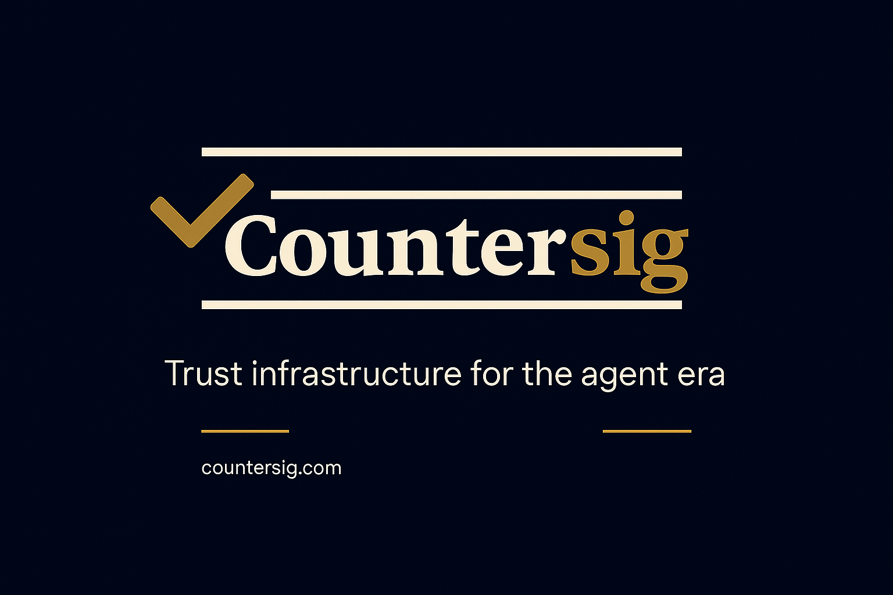

# Countersig

**Universal Identity for AI Agents**

Countersig is a production-grade identity, verification, and reputation platform for AI agents. It provides wallet-signed registration, W3C Verifiable Credentials, multi-chain support, and enterprise authentication — all in one platform.



## What Countersig Does

- **Identity Issuance** — Register AI agents with cryptographic identity (Ed25519, OAuth2, Entra ID, API Keys)
- **Verification** — Challenge-response proof of ownership, W3C Verifiable Credentials, DID documents
- **Reputation** — Multi-dimensional trust scoring across chains and organizations
- **Multi-Chain** — Solana, Ethereum, Base, Polygon support
- **Enterprise Ready** — RBAC, audit logs with hash chaining, policy engine, webhooks, Stripe billing

## Live Platform

- **Website:** [countersig.com](https://countersig.com)
- **API:** [api.countersig.com](https://api.countersig.com)
- **Interactive Demo:** [countersig.com/demo](https://countersig.com/demo)
- **Pricing:** [countersig.com/pricing](https://countersig.com/pricing)

## Client Libraries

| Package | Description | Install |
|---------|-------------|---------|
| [@countersig/sdk](https://www.npmjs.com/package/@countersig/sdk) | TypeScript SDK | `npm install @countersig/sdk` |
| [@countersig/mcp](https://www.npmjs.com/package/@countersig/mcp) | MCP Server for Claude | `npx -y @countersig/mcp` |
| [@countersig/react](https://www.npmjs.com/package/@countersig/react) | React Components | `npm install @countersig/react` |
| [@countersig/verify](https://www.npmjs.com/package/@countersig/verify) | Standalone Verifier | `npm install @countersig/verify` |

## Quick Start with Claude

```bash
claude mcp add countersig -- npx -y @countersig/mcp
```

Then ask Claude: "List all registered agents" or "Register a new agent called my-bot"

## Quick Start with SDK

```typescript
import { CountersigClient } from '@countersig/sdk';

const client = new CountersigClient({
  baseUrl: 'https://api.countersig.com'
});

// List verified agents
const agents = await client.listAgents();

// Get agent reputation
const rep = await client.getReputation(agentPublicKey);
```

## Documentation

- [API Reference](docs/API_REFERENCE.md)
- [Developer Guide](docs/DEVELOPER_GUIDE.md)
- [Trustmark Integration Guide](docs/DEVELOPER_GUIDE_TRUSTMARK.md)
- [Widget Guide](docs/WIDGET_GUIDE.md)
- [Agent Owner Guide](docs/AGENT_OWNER_GUIDE.md)
- [Migration Guide](docs/MIGRATION_GUIDE.md)
- [Deployment Guide](docs/DEPLOYMENT_GUIDE.md)

## Architecture

Countersig provides three core capabilities:

1. **Identity Issuer** — Wallet-signed registration, W3C Verifiable Credentials, JWKS endpoint, did:web document, multi-chain support (Solana BAGS, Solana generic, Ethereum, Base, Polygon)
2. **Management Plane** — Organizations, RBAC, API keys with scopes, audit logs with hash chaining, policy engine, webhooks, heartbeat monitoring, attestations and reputation scoring
3. **Integration Surface** — TypeScript SDK, MCP server, React components, standalone verify package, OpenAPI spec, Swagger UI

## Authentication Methods

| Method | Use Case |
|--------|----------|
| Ed25519 Cryptographic | Wallet-based agent registration |
| OAuth2 / OIDC | Enterprise SSO integration |
| Microsoft Entra ID | Azure workload identity |
| API Keys | Programmatic access with scopes |
| Agent-to-Agent (A2A) JWT | Inter-agent communication |
| PKI Challenge-Response | Cryptographic proof of ownership |

## Pricing

| Plan | Price | Attestations | Verifications | Badge Calls | A2A Tokens |
|------|-------|-------------|---------------|-------------|------------|
| Free | $0/mo | 100 | 50 | 500 | 100 |
| Starter | $29/mo | 5,000 | 1,000 | 10,000 | 1,000 |
| Professional | $99/mo | 50,000 | 10,000 | 100,000 | 10,000 |
| Enterprise | Custom | Unlimited | Unlimited | Unlimited | Unlimited |

See [countersig.com/pricing](https://countersig.com/pricing) for full details.

## License

MIT — see [LICENSE](LICENSE)

## Contact

- **Enterprise:** enterprise@countersig.com
- **Website:** [countersig.com](https://countersig.com)
